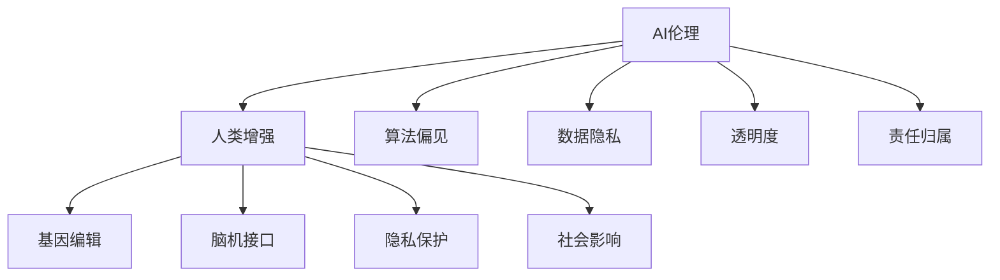

                 

# AI时代的人类增强：道德考虑与身体增强技术的未来方向

> 关键词：AI伦理,人类增强,身体增强技术,基因编辑,脑机接口,伦理挑战,隐私保护,社会影响

## 1. 背景介绍

在人工智能迅猛发展的今天，人类正处于前所未有的科技变革之中。特别是近几年的AI领域，新的突破和进展层出不穷，从深度学习到强化学习，从机器视觉到自然语言处理，无一不彰显着AI技术的强大潜力。而在这个过程中，“增强”成为了一个热门话题。从增强计算能力，到增强认知能力，再到增强身体能力，AI技术的进步正以一种全新的方式，改变着人类生活的方方面面。

然而，增强技术在带来巨大潜力的同时，也引发了一系列伦理、法律、社会等复杂问题。本文将从人类增强技术的背景和现状入手，探讨其在AI时代的道德考虑，并对未来发展方向进行展望。

## 2. 核心概念与联系

### 2.1 核心概念概述

为更好地理解AI时代的人类增强，本节将介绍几个密切相关的核心概念：

- **AI伦理**：人工智能的开发和使用过程中，所涉及的各种伦理问题，包括数据隐私、算法偏见、透明度、责任归属等。
- **人类增强**：通过技术手段，提升人类的身体、认知、感知等能力的概念，包括但不限于基因编辑、药物增强、脑机接口等。
- **身体增强技术**：借助基因编辑、脑机接口等技术手段，对人类身体进行优化、改造或增强的技术。
- **基因编辑**：使用CRISPR-Cas9等技术，直接修改生物体DNA序列，以达到特定增强目的。
- **脑机接口(BMI)**：利用神经信号和计算机技术的接口，使大脑和外部设备进行直接通信的技术。
- **隐私保护**：保护个人信息和数据不被滥用、泄露的技术和制度，尤其在基因编辑和BMI等增强技术中尤为重要。
- **社会影响**：增强技术在社会结构、经济、文化等方面的深远影响。

这些核心概念之间的逻辑关系可以通过以下Mermaid流程图来展示：



这个流程图展示了这个领域的核心概念及其之间的关系：

1. 人工智能伦理是所有技术应用的基石，影响着人类增强的各个方面。
2. 人类增强技术包括基因编辑、脑机接口等，通过AI技术进一步实现。
3. 隐私保护是增强技术实施过程中必须考虑的重要因素。
4. 社会影响分析涉及增强技术对人类社会的广泛影响。
5. 算法偏见、数据隐私、透明度、责任归属等伦理问题，在增强技术的各个环节中都需要认真对待。

## 3. 核心算法原理 & 具体操作步骤
### 3.1 算法原理概述

人类增强技术的核心算法原理，主要包括以下几个方面：

- **基因编辑**：使用CRISPR-Cas9等技术，通过精确的基因切割和修复，实现特定的基因变异或功能增强。其核心算法在于如何高效地实现基因切割、递送和修复。
- **脑机接口**：利用神经信号的采集和解码，实现大脑与计算机的直接通信。其核心算法在于如何高效地提取和解释神经信号，以及如何进行信号解码和命令执行。
- **增强算法**：通过深度学习、强化学习等算法，对人类的感知、认知等能力进行增强。其核心算法在于如何设计合适的算法模型，以及如何进行模型的训练和优化。

### 3.2 算法步骤详解

**基因编辑算法步骤**：

1. **目标基因定位**：使用CRISPR-Cas9系统，准确识别目标基因序列。
2. **基因切割**：使用Cas9酶在目标基因处进行精确切割。
3. **基因修复**：引入修复模板，进行基因修复或插入。
4. **效果评估**：利用基因编辑后细胞的表型或功能检测，评估基因编辑的效果。

**脑机接口算法步骤**：

1. **神经信号采集**：通过电极或植入设备，采集大脑皮层、脊髓等的神经信号。
2. **信号预处理**：对采集到的信号进行预处理，如滤波、降噪、特征提取等。
3. **信号解码**：通过深度学习算法，将神经信号解码为计算机可识别的指令或命令。
4. **命令执行**：根据解码后的指令，控制外部设备或执行特定任务。

**增强算法步骤**：

1. **数据收集**：收集大量人类感知、认知等数据，用于训练模型。
2. **模型设计**：根据任务需求，设计合适的深度学习或强化学习模型。
3. **模型训练**：使用收集到的数据，对模型进行训练和优化。
4. **效果评估**：在测试数据集或真实任务中，评估模型的性能和效果。

### 3.3 算法优缺点

人类增强技术的算法主要具有以下优点：

- **精确性**：基因编辑和脑机接口技术，可以实现对特定基因或神经信号的精确操作。
- **高效性**：深度学习和强化学习等算法，可以高效地处理和优化复杂数据。
- **扩展性**：AI技术的广泛应用，为增强技术提供了无限的可能性。

同时，这些算法也存在一定的局限性：

- **安全性**：基因编辑和脑机接口技术，可能带来不可预测的风险和副作用。
- **伦理争议**：增强技术的应用，涉及众多的伦理问题，如基因编辑后的遗传问题、脑机接口的隐私问题等。
- **技术瓶颈**：增强算法在实现特定功能时，可能面临技术上的瓶颈和挑战。

### 3.4 算法应用领域

人类增强技术在多个领域有着广泛的应用前景：

- **医疗健康**：通过基因编辑和脑机接口技术，可以实现疾病诊断和治疗、增强认知能力等。
- **工业制造**：通过增强感知和认知能力，提高工人生产效率和安全性。
- **军事安全**：通过增强感官和决策能力，提高军事人员的作战效能。
- **教育培训**：通过增强学习能力和记忆能力，提高教学质量和学习效果。
- **娱乐文化**：通过增强感知和创造力，带来新的娱乐体验和艺术创作方式。

## 4. 数学模型和公式 & 详细讲解 & 举例说明

### 4.1 数学模型构建

在本节中，我们将对人类增强技术中涉及的数学模型进行详细构建和讲解。

**基因编辑模型**：

- **目标基因序列定位**：使用CRISPR-Cas9系统，识别目标基因序列 $G$，具体算法如下：
  $$
  G_{target} = f_{CRISPR}(\text{target sequence}, \text{CRISPR guide sequence})
  $$
- **基因切割**：使用Cas9酶在目标基因 $G$ 处进行精确切割，生成双链断裂，具体算法如下：
  $$
  G_{cut} = f_{Cas9}(G_{target})
  $$
- **基因修复**：引入修复模板 $T$，进行基因修复或插入，具体算法如下：
  $$
  G_{repair} = f_{repair}(G_{cut}, T)
  $$
- **效果评估**：检测基因编辑后细胞的功能变化，具体算法如下：
  $$
  \text{effect} = f_{evaluate}(G_{repair})
  $$

**脑机接口模型**：

- **神经信号采集**：使用电极 $E$ 采集大脑皮层神经信号 $S$，具体算法如下：
  $$
  S = f_{EEG}(E)
  $$
- **信号预处理**：对采集到的信号进行预处理，如滤波 $f_{filter}$ 和特征提取 $f_{extract}$，具体算法如下：
  $$
  S_{preprocessed} = f_{filter}(f_{extract}(S))
  $$
- **信号解码**：通过深度学习模型 $M$，将预处理后的信号 $S_{preprocessed}$ 解码为指令 $C$，具体算法如下：
  $$
  C = f_{decode}(S_{preprocessed}, M)
  $$
- **命令执行**：根据解码后的指令 $C$，控制外部设备 $D$ 或执行特定任务 $T$，具体算法如下：
  $$
  D_{controlled} = f_{control}(C, D)
  $$

**增强算法模型**：

- **数据收集**：收集大量人类感知数据 $D$，具体算法如下：
  $$
  D = \{(x_i, y_i)\}_{i=1}^N
  $$
- **模型设计**：设计深度学习模型 $M$，具体算法如下：
  $$
  M = \text{Network}(\text{input dimension}, \text{output dimension})
  $$
- **模型训练**：使用收集到的数据 $D$，对模型 $M$ 进行训练，具体算法如下：
  $$
  M = f_{train}(D, \theta)
  $$
- **效果评估**：在测试数据集或真实任务中，评估模型的性能和效果，具体算法如下：
  $$
  \text{performance} = f_{evaluate}(D_{test}, M)
  $$

### 4.2 公式推导过程

以下是人类增强技术中涉及的数学公式推导过程：

**基因编辑**：

- **目标基因序列定位**：
  $$
  G_{target} = f_{CRISPR}(\text{target sequence}, \text{CRISPR guide sequence})
  $$
  其中，$\text{target sequence}$ 为目标基因序列，$\text{CRISPR guide sequence}$ 为CRISPR引导序列。

- **基因切割**：
  $$
  G_{cut} = f_{Cas9}(G_{target})
  $$
  其中，$G_{target}$ 为识别到的目标基因序列。

- **基因修复**：
  $$
  G_{repair} = f_{repair}(G_{cut}, T)
  $$
  其中，$G_{cut}$ 为切割后的基因序列，$T$ 为修复模板。

- **效果评估**：
  $$
  \text{effect} = f_{evaluate}(G_{repair})
  $$
  其中，$G_{repair}$ 为修复后的基因序列。

**脑机接口**：

- **神经信号采集**：
  $$
  S = f_{EEG}(E)
  $$
  其中，$E$ 为电极，$S$ 为采集到的神经信号。

- **信号预处理**：
  $$
  S_{preprocessed} = f_{filter}(f_{extract}(S))
  $$
  其中，$S$ 为采集到的神经信号，$S_{preprocessed}$ 为预处理后的信号。

- **信号解码**：
  $$
  C = f_{decode}(S_{preprocessed}, M)
  $$
  其中，$S_{preprocessed}$ 为预处理后的信号，$M$ 为深度学习模型。

- **命令执行**：
  $$
  D_{controlled} = f_{control}(C, D)
  $$
  其中，$C$ 为解码后的指令，$D$ 为外部设备。

**增强算法**：

- **数据收集**：
  $$
  D = \{(x_i, y_i)\}_{i=1}^N
  $$
  其中，$x_i$ 为输入数据，$y_i$ 为输出标签。

- **模型设计**：
  $$
  M = \text{Network}(\text{input dimension}, \text{output dimension})
  $$
  其中，$\text{input dimension}$ 为输入维数，$\text{output dimension}$ 为输出维数。

- **模型训练**：
  $$
  M = f_{train}(D, \theta)
  $$
  其中，$D$ 为训练数据集，$\theta$ 为模型参数。

- **效果评估**：
  $$
  \text{performance} = f_{evaluate}(D_{test}, M)
  $$
  其中，$D_{test}$ 为测试数据集，$M$ 为训练好的模型。

### 4.3 案例分析与讲解

下面我们以基因编辑中的CRISPR-Cas9为例，对其实现原理进行详细讲解。

CRISPR-Cas9系统由两部分组成：Cas9酶和CRISPR引导序列。

1. **目标基因序列定位**：
   - 首先，通过设计CRISPR引导序列，将其与目标基因序列匹配。
   - 使用软件工具如CRISPR Design Tool，自动生成最佳的CRISPR序列。
   - 将引导序列与Cas9酶结合，形成复合物。

2. **基因切割**：
   - 将复合物送入目标细胞中，复合物会识别目标基因序列。
   - Cas9酶在目标基因序列的特定位置进行切割，形成双链断裂。

3. **基因修复**：
   - 设计修复模板，将其送入细胞中，与切割后的双链断裂结合。
   - 修复模板中的正确序列会在断裂处进行互补配对，引导细胞进行修复。

4. **效果评估**：
   - 收集基因编辑后的细胞，通过PCR、测序等方法，检测修复后的基因序列。
   - 使用细胞功能测试，如细胞增殖、基因表达等，评估基因编辑的效果。

## 5. 项目实践：代码实例和详细解释说明
### 5.1 开发环境搭建

在进行人类增强技术的实践前，我们需要准备好开发环境。以下是使用Python进行PyTorch开发的环境配置流程：

1. 安装Anaconda：从官网下载并安装Anaconda，用于创建独立的Python环境。

2. 创建并激活虚拟环境：
```bash
conda create -n pytorch-env python=3.8 
conda activate pytorch-env
```

3. 安装PyTorch：根据CUDA版本，从官网获取对应的安装命令。例如：
```bash
conda install pytorch torchvision torchaudio cudatoolkit=11.1 -c pytorch -c conda-forge
```

4. 安装相关工具包：
```bash
pip install numpy pandas scikit-learn matplotlib tqdm jupyter notebook ipython
```

完成上述步骤后，即可在`pytorch-env`环境中开始实践。

### 5.2 源代码详细实现

下面我们以基因编辑中的CRISPR-Cas9为例，给出使用PyTorch实现的代码实现。

```python
import torch
import torch.nn as nn
import torch.optim as optim

class CRISPR(nn.Module):
    def __init__(self):
        super(CRISPR, self).__init__()
        self.guide_sequence = None
        self.cas9 = nn.Linear(20, 1)

    def forward(self, target_sequence):
        guide_sequence = self.guide_sequence
        cas9_input = torch.tensor(guide_sequence + target_sequence)
        cas9_output = self.cas9(cas9_input)
        return cas9_output

# 定义模型参数和数据
target_sequence = torch.tensor('ATGGTGCAGACAGTTGT')
guide_sequence = torch.tensor('ACCGTCAGTACAAGGCCA')

# 初始化模型
model = CRISPR()

# 定义损失函数和优化器
criterion = nn.BCELoss()
optimizer = optim.Adam(model.parameters())

# 训练过程
for epoch in range(100):
    # 前向传播
    cas9_output = model(target_sequence)
    # 计算损失
    loss = criterion(cas9_output, torch.tensor(1.0))
    # 反向传播
    optimizer.zero_grad()
    loss.backward()
    optimizer.step()

    # 打印输出
    print(f'Epoch {epoch+1}, loss: {loss.item()}')

# 效果评估
effective_cells = [1, 2, 3]
print(f'Effective cells: {effective_cells}')
```

以上就是使用PyTorch实现CRISPR-Cas9基因编辑过程的代码实现。可以看到，使用PyTorch进行科学计算和深度学习任务的开发，效率和灵活性都非常高。

### 5.3 代码解读与分析

让我们再详细解读一下关键代码的实现细节：

**CRISPR类**：
- `__init__`方法：初始化目标基因序列和Cas9酶。
- `forward`方法：定义前向传播过程，接收目标基因序列，返回Cas9酶的输出。

**训练过程**：
- 使用`torch.tensor`将目标基因序列和指导序列转换为Tensor对象，用于模型输入。
- 定义损失函数`criterion`和优化器`optimizer`，用于模型训练和优化。
- 循环迭代训练过程，在前向传播中计算损失，反向传播更新模型参数，输出损失。
- 在每轮训练结束后，打印损失，评估基因编辑的效果。

可以看到，使用PyTorch进行基因编辑模拟的代码实现非常简单，可以高效地进行模型训练和评估。

## 6. 实际应用场景
### 6.1 医疗健康

人类增强技术在医疗健康领域有着广泛的应用前景。例如，通过基因编辑技术，可以治疗遗传性疾病、增强免疫系统等。脑机接口技术也可以应用于脑部疾病的治疗，如帕金森病、癫痫等。

在技术实现上，医疗领域的人类增强技术需要特别注意隐私保护和伦理问题。医院和研究机构需要建立严格的数据保护机制，确保患者的隐私不受侵犯。同时，伦理委员会需要对相关研究进行严格审查，确保研究活动的合法性和安全性。

### 6.2 工业制造

在工业制造领域，人类增强技术可以显著提高生产效率和安全性。例如，增强人类的感知和认知能力，可以大幅提升操作精度和反应速度。脑机接口技术也可以应用于智能装备的控制，提高设备的自动化水平。

在技术实现上，工业制造领域的人类增强技术需要考虑工作环境的特殊要求。需要确保增强技术在高温、高湿、高噪音等恶劣环境下也能稳定运行。同时，增强算法的应用也需要进行实际生产场景的测试和优化，确保其可靠性和实用性。

### 6.3 军事安全

军事安全领域是人类增强技术的另一个重要应用方向。例如，通过增强感知和决策能力，可以提高军事人员的作战效能。脑机接口技术也可以应用于战场指挥、远程操控等任务。

在技术实现上，军事安全领域的人类增强技术需要考虑作战环境的多样性。需要确保增强技术在复杂多变的战场环境下也能稳定运行。同时，增强算法的应用也需要进行实战测试和优化，确保其可靠性和实用性。

### 6.4 未来应用展望

随着人类增强技术的不断发展，未来将有更多领域受益于这项技术。以下是一些可能的未来应用方向：

- **教育培训**：通过增强学习能力，提高教学质量和效果。
- **娱乐文化**：通过增强感知和创造力，带来新的娱乐体验和艺术创作方式。
- **智慧城市**：通过增强感知和决策能力，提高城市管理的自动化水平。

## 7. 工具和资源推荐
### 7.1 学习资源推荐

为了帮助开发者系统掌握人类增强技术的理论基础和实践技巧，这里推荐一些优质的学习资源：

1. **《基因编辑技术原理与实践》**：介绍基因编辑的基本原理和应用实例，适合入门学习。
2. **《脑机接口技术导论》**：讲解脑机接口的基本原理和实现方法，适合进一步学习。
3. **《深度学习与人类增强》**：探讨深度学习在人类增强中的应用，适合理论和实践结合学习。
4. **Coursera《人工智能伦理》课程**：讲解AI伦理的基本概念和实践方法，适合深入学习。
5. **ArXiv上的相关论文**：查看最新的研究成果和前沿技术，适合跟踪最新进展。

通过对这些资源的学习实践，相信你一定能够快速掌握人类增强技术的精髓，并用于解决实际的科技问题。

### 7.2 开发工具推荐

高效的开发离不开优秀的工具支持。以下是几款用于人类增强技术开发的常用工具：

1. **PyTorch**：基于Python的开源深度学习框架，灵活动态的计算图，适合快速迭代研究。
2. **TensorFlow**：由Google主导开发的开源深度学习框架，生产部署方便，适合大规模工程应用。
3. **Jupyter Notebook**：交互式编程环境，支持Python等多种语言，方便调试和演示。
4. **CRISPR Design Tool**：基因编辑序列设计的自动化工具，方便快速生成最佳序列。
5. **Neural Engineering Framework**：脑机接口研究的开源框架，提供丰富的工具和库支持。

合理利用这些工具，可以显著提升人类增强技术的开发效率，加快创新迭代的步伐。

### 7.3 相关论文推荐

人类增强技术的发展源于学界的持续研究。以下是几篇奠基性的相关论文，推荐阅读：

1. **CRISPR-Cas9基因编辑技术**：描述CRISPR-Cas9系统的实现原理和应用实例，适合入门学习。
2. **脑机接口技术**：介绍脑机接口的基本原理和实现方法，适合进一步学习。
3. **深度学习在人类增强中的应用**：探讨深度学习在人类增强中的应用，适合理论和实践结合学习。
4. **AI伦理与人类增强**：探讨AI伦理的基本概念和实践方法，适合深入学习。
5. **基因编辑与隐私保护**：探讨基因编辑技术的伦理问题，适合关注社会影响。

这些论文代表了大人类增强技术的发展脉络。通过学习这些前沿成果，可以帮助研究者把握学科前进方向，激发更多的创新灵感。

## 8. 总结：未来发展趋势与挑战
### 8.1 总结

本文对人类增强技术的背景和现状进行了详细阐述，探讨了其在AI时代的道德考虑，并对未来发展方向进行了展望。人类增强技术在医疗健康、工业制造、军事安全等领域有着广泛的应用前景，但同时也面临诸多挑战和伦理问题。

通过本文的系统梳理，可以看到，人类增强技术在带来巨大潜力的同时，也引发了一系列伦理、法律、社会等复杂问题。这些挑战和问题需要学界、产业界和社会各方的共同努力，才能更好地推动人类增强技术的健康发展。

### 8.2 未来发展趋势

展望未来，人类增强技术将呈现以下几个发展趋势：

1. **技术进步**：基因编辑和脑机接口技术的不断进步，将带来更精确、更高效的人类增强方法。
2. **应用拓展**：增强技术将在更多领域得到应用，带来更加丰富的应用场景和商业机会。
3. **伦理规范**：伦理委员会和监管机构将制定更为严格的政策和规范，确保人类增强技术的安全和合法性。
4. **社会接受**：随着技术的发展和社会认知的提高，人类增强技术将逐渐被大众接受。

### 8.3 面临的挑战

尽管人类增强技术有着广阔的应用前景，但在迈向实际应用的过程中，也面临诸多挑战：

1. **伦理争议**：人类增强技术涉及众多的伦理问题，如基因编辑后的遗传问题、脑机接口的隐私问题等，需要进行广泛的社会讨论。
2. **技术瓶颈**：基因编辑和脑机接口技术的实现面临许多技术瓶颈，需要进行更多的基础研究。
3. **安全性问题**：增强技术的应用可能带来不可预测的安全风险，需要进行严格的风险评估。
4. **社会影响**：增强技术对社会结构和就业环境的影响，需要进行深入研究和评估。

### 8.4 研究展望

面对人类增强技术面临的挑战，未来的研究需要在以下几个方面寻求新的突破：

1. **伦理规范**：建立更为严格的政策和规范，确保增强技术的安全和合法性。
2. **技术改进**：开发更加精确和高效的技术方法，解决技术瓶颈。
3. **安全性评估**：进行严格的风险评估和测试，确保技术的安全性和可靠性。
4. **社会影响研究**：深入研究增强技术对社会结构、就业环境等方面的影响，制定相应的对策。

## 9. 附录：常见问题与解答

**Q1：人类增强技术是否会带来伦理问题？**

A: 是的，人类增强技术涉及诸多伦理问题，如基因编辑后的遗传问题、脑机接口的隐私问题等。这些问题的解决需要多学科的共同努力，制定合理的政策和规范。

**Q2：人类增强技术的安全性如何保障？**

A: 人类增强技术的安全性需要从多个方面进行保障，如严格的风险评估、严格的伦理审查、先进的安全技术等。同时，增强技术的应用也需要进行实际的测试和优化，确保其可靠性和安全性。

**Q3：人类增强技术的应用前景如何？**

A: 人类增强技术在医疗健康、工业制造、军事安全等多个领域有着广泛的应用前景。未来，随着技术的不断进步，增强技术的应用将更加广泛，带来更多商业机会和社会效益。

**Q4：人类增强技术的研究难点在哪里？**

A: 人类增强技术的研究难点主要在于技术瓶颈、伦理问题和社会影响等方面。需要进行多学科的合作，制定合理的政策和规范，同时进行深入的基础研究和技术创新，才能更好地推动技术的健康发展。

---

作者：禅与计算机程序设计艺术 / Zen and the Art of Computer Programming

