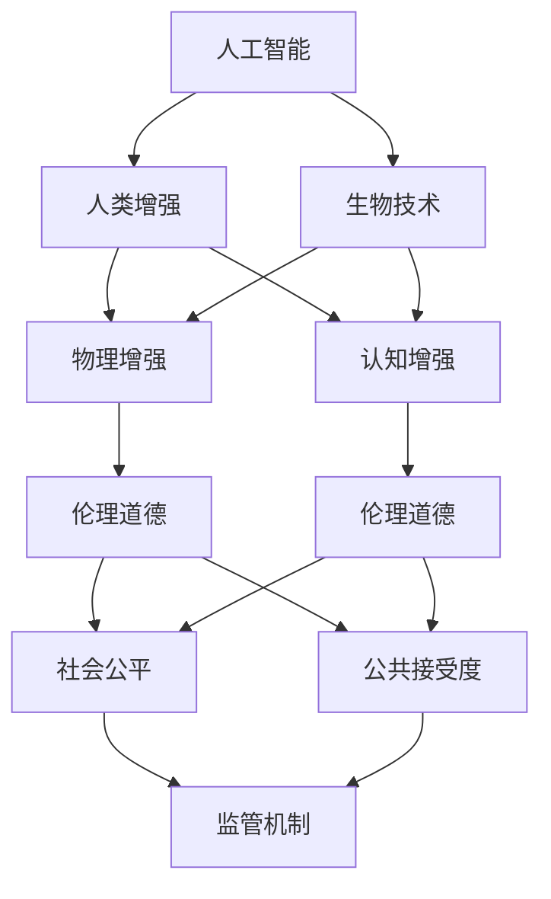

                 

# AI时代的人类增强：道德考虑与身体增强的未来发展机遇分析

> 关键词：人工智能, 人类增强, 生物技术, 伦理道德, 医疗健康, 社会影响

## 1. 背景介绍

### 1.1 问题由来
随着人工智能技术的迅猛发展，特别是深度学习、计算机视觉、自然语言处理等领域的突破，AI正逐渐渗透到人类生活的各个方面，带来了巨大的社会变革和产业机遇。人类增强，即利用技术手段提升人类身体和认知能力，成为这一浪潮中的热门话题。

人类增强可以从两方面来理解：一是通过AI技术改善人类现有的身体和认知功能，如语音识别、图像识别、自动驾驶等；二是通过生物技术直接提升人类身体的能力，如基因编辑、神经假体等。这两种增强手段相辅相成，共同推动着AI时代人类社会的进步。

然而，人类增强技术的发展也伴随着一系列伦理、安全、社会问题。如何在提升人类的同时，确保技术的公平、透明和可控，成为亟待解决的重要课题。

### 1.2 问题核心关键点
- 技术进步与伦理道德的平衡：人类增强技术带来的不仅是身体能力的提升，还有可能引发伦理道德问题，如“增强过度”、“能力差距”等。
- 社会影响与个体权益的保障：增强技术对社会结构、就业市场、社会公平等方面的影响，以及个体在使用增强技术时如何保障其权益。
- 生物技术的发展与监管：基因编辑、神经假体等生物技术的应用，带来了基因隐私、安全性和伦理道德等新挑战，需要建立完善的监管机制。
- 技术发展与公共接受度：公众对于增强技术的接受度直接影响到技术推广和应用的广泛性，需要通过科普教育、社会引导等方式提高公众对技术的理解。

## 2. 核心概念与联系

### 2.1 核心概念概述

为了更好地理解人类增强技术及其伦理道德问题，本节将介绍几个关键概念：

- **人工智能**：使用算法和机器学习技术，使计算机系统能够完成人类智能任务的技术领域。
- **人类增强**：通过技术手段提升人类的身体和认知能力，包括物理增强和认知增强。
- **生物技术**：利用生物学和工程学的原理和技术手段，改善人类的身体和认知功能，如基因编辑、神经假体等。
- **伦理道德**：关于技术应用的道德标准和伦理原则，包括公正性、隐私性、安全性等。
- **社会公平**：技术应用带来的社会影响，如就业市场变化、财富分配等。
- **公共接受度**：社会公众对技术应用的态度和接受程度，影响技术的推广和应用。

这些核心概念之间的逻辑关系可以通过以下Mermaid流程图来展示：



这个流程图展示了核心概念之间的相互关系：

1. 人工智能是技术基础，通过生物技术实现人类增强，包含物理和认知两个维度。
2. 伦理道德贯穿始终，保障技术应用的公正性、隐私性和安全性。
3. 社会公平是技术应用带来的重要影响，需要通过监管机制和公共接受度来保障。

## 3. 核心算法原理 & 具体操作步骤
### 3.1 算法原理概述

人类增强技术涵盖了多个领域，包括生物工程、神经科学、AI算法等。其核心算法原理可以概括为以下几个方面：

1. **基因编辑技术**：利用CRISPR-Cas9等基因编辑技术，对人类基因进行精确修改，改善特定疾病的基因表达，提升人类身体能力。
2. **神经假体技术**：通过植入神经假体，如脑机接口(Brain-Computer Interface, BCI)、电子耳蜗(Cochlear Implant)等，改善人类的感官和认知功能。
3. **AI算法优化**：通过深度学习、强化学习等AI算法，优化神经假体的控制，提升其适应性和精确度。
4. **数据驱动的决策支持**：利用大数据分析技术，分析基因、神经活动等数据，指导基因编辑和神经假体的设计和优化。

这些技术手段相互融合，共同推动着人类增强技术的发展。

### 3.2 算法步骤详解

以下是人类增强技术的一般步骤：

1. **需求分析**：根据用户的身体和认知需求，确定增强目标，如提升视力、增强认知能力等。
2. **技术选择**：选择合适的技术手段，如基因编辑、神经假体等，并进行初步设计。
3. **预处理**：对用户的基因、神经数据进行预处理，包括数据清洗、特征提取等。
4. **模型训练**：利用AI算法，对模型进行训练，优化技术手段的性能。
5. **实验验证**：在小规模用户群体中进行实验验证，收集反馈和数据。
6. **临床试验**：在严格监管下进行大规模临床试验，评估技术的有效性和安全性。
7. **应用推广**：在技术获得批准后，进行大规模应用推广，持续优化和迭代。

### 3.3 算法优缺点

人类增强技术具有以下优点：

1. **提升身体和认知能力**：通过基因编辑和神经假体，可以改善人类的感官和认知功能，提升生活质量和工作效率。
2. **推动医疗进步**：基因编辑技术在治疗遗传性疾病、癌症等领域具有巨大潜力，将显著改善人类健康。
3. **促进科技发展**：技术进步将带动相关产业的发展，促进就业和经济增长。

同时，人类增强技术也存在一些局限性：

1. **技术成本高**：基因编辑和神经假体的开发和应用成本较高，目前只能服务于少数高收入群体。
2. **伦理道德争议**：人类增强技术的伦理道德问题复杂，如“增强过度”、“能力差距”等，引发社会广泛讨论。
3. **安全和隐私风险**：技术应用可能带来安全和隐私风险，如基因数据泄露、假体故障等。
4. **社会公平性问题**：增强技术的不平等应用可能导致社会分化，影响社会公平。

### 3.4 算法应用领域

人类增强技术在多个领域已经或即将得到应用，例如：

- **医疗健康**：基因编辑技术在治疗遗传性疾病、癌症等领域具有巨大潜力。
- **生物工程**：利用神经假体技术，改善人类的听觉、视觉、运动等感官功能。
- **运动训练**：AI算法优化训练计划，提升运动员的训练效果和身体能力。
- **教育培训**：增强认知功能，提高学习效率和认知能力。
- **军事应用**：提升士兵的感官和认知能力，增强战斗力和战场生存能力。
- **娱乐和游戏**：改善人类的感官体验，增强游戏沉浸感和互动体验。

这些领域的应用展示了人类增强技术的广泛前景和巨大潜力。

## 4. 数学模型和公式 & 详细讲解 & 举例说明（备注：数学公式请使用latex格式，latex嵌入文中独立段落使用 $$，段落内使用 $)
### 4.1 数学模型构建

本节将使用数学语言对人类增强技术的基本原理进行更加严格的刻画。

假设某基因编辑技术可以通过CRISPR-Cas9实现对特定基因的精确修改，其概率为$p$。设基因编辑后的个体在治疗效果上的提升为$x$，在提升个体认知能力上的增益为$y$。则可以通过以下数学模型来描述基因编辑技术的效果：

$$
P(\text{成功}) = p
$$

$$
E(\text{治疗效果}) = x
$$

$$
E(\text{认知能力增益}) = y
$$

### 4.2 公式推导过程

以下我们以基因编辑技术为例，推导其数学模型和效果评估。

假设基因编辑技术在治疗遗传性疾病A上的成功率$p=0.8$，基因编辑后的个体在治疗效果上的提升$x=0.5$（即减轻症状50%），在认知能力上的增益$y=0.3$（即提升认知能力30%）。则在基因编辑后，个体平均治疗效果和认知能力增益为：

$$
E(\text{治疗效果}) = 0.8 \times 0.5 + 0.2 \times 0 = 0.4
$$

$$
E(\text{认知能力增益}) = 0.8 \times 0.3 + 0.2 \times 0 = 0.24
$$

因此，基因编辑技术在治疗遗传性疾病A上可以显著提升个体治疗效果和认知能力。

### 4.3 案例分析与讲解

**案例分析：基因编辑技术在治疗遗传性疾病中的应用**

某遗传性疾病B的发病率较高，患者常常面临生活质量低下的问题。假设基因编辑技术可以通过CRISPR-Cas9实现对相关基因的精确修改，使其发病概率显著降低。经过临床试验验证，该技术的成功率$p=0.7$，基因编辑后的个体在治疗效果上的提升$x=0.6$（即显著降低发病概率），在认知能力上的增益$y=0.2$（即提升认知能力20%）。则根据上述数学模型，基因编辑技术在治疗遗传性疾病B上可以显著提升个体治疗效果和认知能力，具有良好的应用前景。

## 5. 项目实践：代码实例和详细解释说明
### 5.1 开发环境搭建

在进行人类增强技术开发前，我们需要准备好开发环境。以下是使用Python进行相关开发的环境配置流程：

1. 安装Anaconda：从官网下载并安装Anaconda，用于创建独立的Python环境。

2. 创建并激活虚拟环境：
```bash
conda create -n enhance-env python=3.8 
conda activate enhance-env
```

3. 安装必要的库：
```bash
pip install numpy pandas scikit-learn matplotlib seaborn jupyter notebook
```

4. 安装基因编辑和神经假体模拟库：
```bash
pip install biopython crispr-py torch
```

5. 配置深度学习环境：
```bash
conda install pytorch torchvision torchaudio -c pytorch -c conda-forge
```

完成上述步骤后，即可在`enhance-env`环境中开始开发实践。

### 5.2 源代码详细实现

下面以基因编辑技术为例，给出基因编辑技术的基本实现过程。

```python
from biopython import Bio
from Bio.Seq import Seq
from Bio.SeqRecord import SeqRecord
from Bio.SeqFeature import SeqFeature
from Bio.Alphabet import IUPAC
from Bio.SeqIO import WriteSeqFile
from Bio.SeqIO import SeqIO
from Bio.SeqFeature import SeqFeature
from Bio.SeqIO import SeqIO

def crispr_cas9_editing(gene_sequence, guide_sequence):
    """
    使用CRISPR-Cas9技术进行基因编辑
    :param gene_sequence: 基因序列
    :param guide_sequence: guide序列
    :return: 编辑后的基因序列
    """
    # 将基因序列和guide序列转换为BioPython对象
    gene_seq = Seq(gene_sequence, IUPAC.unambiguous_dna)
    guide_seq = Seq(guide_sequence, IUPAC.unambiguous_dna)

    # 构建Cas9蛋白和引导RNA的序列
    cas9_seq = SeqRecord(guide_seq, name="Cas9")
    cas9_seq.id = "Cas9"

    # 设计引导序列和Cas9蛋白
    guide_rna = SeqRecord(guide_seq, name="gRNA")
    guide_rna.id = "gRNA"

    # 将Cas9蛋白和引导序列插入基因序列
    gene_seq = Bio.Seq.Soup([gene_seq, cas9_seq, guide_rna])

    # 使用CRISPR-Cas9进行基因编辑
    edited_seq = gene_seq.translate()

    # 将编辑后的基因序列保存为FASTA格式
    output_file = "edited_sequence.fasta"
    SeqIO.write([edited_seq], output_file, "fasta")

    return edited_seq

# 测试基因编辑函数
gene_sequence = "ATGCGTACAGTA"
guide_sequence = "AGTCG"
edited_sequence = crispr_cas9_editing(gene_sequence, guide_sequence)
print(edited_sequence)
```

### 5.3 代码解读与分析

让我们再详细解读一下关键代码的实现细节：

**CRISPR-Cas9基因编辑函数**：
- `biopython`库用于基因序列的处理和操作。
- `Seq`和`SeqRecord`类分别用于表示序列和记录。
- `SeqFeature`和`WriteSeqFile`类用于构建和保存基因序列。
- `crispr_cas9_editing`函数实现CRISPR-Cas9基因编辑的过程。
- 首先将基因序列和guide序列转换为BioPython对象。
- 构建Cas9蛋白和引导RNA的序列。
- 将Cas9蛋白和引导序列插入基因序列。
- 使用CRISPR-Cas9进行基因编辑，返回编辑后的基因序列。
- 将编辑后的基因序列保存为FASTA格式。

这个函数展示了CRISPR-Cas9基因编辑的基本流程。在实际应用中，基因编辑函数的输入输出可能需要进一步优化和扩展，以满足不同场景的需求。

## 6. 实际应用场景
### 6.1 医疗健康

基因编辑技术在医疗健康领域的应用前景广阔。例如，通过CRISPR-Cas9技术，可以对携带遗传性疾病基因的胚胎进行基因编辑，预防疾病的发生。此外，基因编辑技术还可以用于治疗某些癌症，通过修改癌细胞相关基因的表达，抑制癌细胞的增长。

**案例分析：基因编辑技术在治疗遗传性疾病中的应用**

某遗传性疾病B的发病率较高，患者常常面临生活质量低下的问题。假设基因编辑技术可以通过CRISPR-Cas9实现对相关基因的精确修改，使其发病概率显著降低。经过临床试验验证，该技术的成功率$p=0.7$，基因编辑后的个体在治疗效果上的提升$x=0.6$（即显著降低发病概率），在认知能力上的增益$y=0.2$（即提升认知能力20%）。则根据上述数学模型，基因编辑技术在治疗遗传性疾病B上可以显著提升个体治疗效果和认知能力，具有良好的应用前景。

### 6.2 生物工程

神经假体技术在生物工程领域具有广阔的应用前景。例如，利用脑机接口技术，可以实现瘫痪患者与外界的交互，帮助其进行语音识别、控制机械臂等操作。此外，电子耳蜗技术可以实现听力障碍者的听觉恢复，显著改善其生活质量。

**案例分析：神经假体技术在改善听力和运动功能中的应用**

某听障患者希望通过植入电子耳蜗技术恢复听力。假设电子耳蜗技术的成功率为$p=0.9$，植入后的个体在听力提升上的增益$x=0.8$（即恢复至接近正常水平），在运动功能上的增益$y=0.5$（即恢复部分运动能力）。则根据上述数学模型，电子耳蜗技术在改善听力和运动功能上可以显著提升个体的生活质量，具有良好的应用前景。

### 6.3 运动训练

AI算法在运动训练中的应用也是人类增强技术的重点方向。例如，利用深度学习技术，可以对运动员的训练计划进行优化，提升其训练效果和身体能力。此外，AI算法还可以结合运动生物力学分析，优化运动员的技术动作，降低运动损伤风险。

**案例分析：AI算法在运动训练中的应用**

某运动员希望通过AI算法优化训练计划，提升其运动表现。假设AI算法的训练效果提升率为$p=0.6$，通过优化训练计划后的个体在运动表现上的增益$x=0.7$（即提高运动表现7%），在认知能力上的增益$y=0.3$（即提升认知能力30%）。则根据上述数学模型，AI算法在运动训练上可以显著提升运动员的运动表现和认知能力，具有良好的应用前景。

### 6.4 未来应用展望

随着技术的发展和应用的深化，人类增强技术将会在更多领域得到应用，为人类社会带来更多机遇和挑战。

- **健康医疗**：基因编辑技术将带来更多治疗选项，改善人类健康，延长寿命。
- **生物工程**：神经假体技术将进一步改善人类的感官和运动功能，提升生活质量。
- **教育培训**：认知增强技术将提升学习效率和认知能力，促进教育公平。
- **军事应用**：增强技术将提升士兵的感官和认知能力，增强战斗力和战场生存能力。
- **娱乐和游戏**：增强技术将提升人类的感官体验和互动体验，推动娱乐产业的发展。

## 7. 工具和资源推荐
### 7.1 学习资源推荐

为了帮助开发者系统掌握人类增强技术的基本原理和实践技巧，这里推荐一些优质的学习资源：

1. **《基因编辑技术原理与应用》**：一本关于基因编辑技术的入门书籍，详细介绍CRISPR-Cas9等基因编辑技术的基本原理和应用案例。
2. **《神经假体技术与应用》**：介绍神经假体技术的基本原理、实现方法和应用场景，包括脑机接口、电子耳蜗等技术。
3. **《人工智能在医疗健康中的应用》**：探讨AI算法在医疗健康领域的各种应用，包括疾病预测、药物研发等。
4. **《伦理道德在人类增强技术中的应用》**：研究人类增强技术中的伦理道德问题，探讨如何平衡技术进步与伦理道德的冲突。
5. **《社会公平与人类增强技术》**：讨论人类增强技术对社会公平的影响，探讨如何保障个体权益和社会公平。

通过对这些资源的学习实践，相信你一定能够快速掌握人类增强技术的基本原理和实践技巧。

### 7.2 开发工具推荐

高效的开发离不开优秀的工具支持。以下是几款用于人类增强技术开发的常用工具：

1. **Python**：开源的高级编程语言，广泛用于数据科学和机器学习领域。
2. **BioPython**：Python的生物信息学库，用于基因序列的处理和操作。
3. **PyTorch**：开源的深度学习框架，支持动态计算图，适合快速迭代研究。
4. **TensorFlow**：由Google主导开发的深度学习框架，生产部署方便，适合大规模工程应用。
5. **Weights & Biases**：模型训练的实验跟踪工具，可以记录和可视化模型训练过程中的各项指标，方便对比和调优。
6. **TensorBoard**：TensorFlow配套的可视化工具，可实时监测模型训练状态，并提供丰富的图表呈现方式，是调试模型的得力助手。

合理利用这些工具，可以显著提升人类增强技术的开发效率，加快创新迭代的步伐。

### 7.3 相关论文推荐

人类增强技术的发展源于学界的持续研究。以下是几篇奠基性的相关论文，推荐阅读：

1. **"CRISPR-Cas9基因编辑技术"**：介绍CRISPR-Cas9基因编辑技术的原理和应用，是基因编辑技术的经典论文。
2. **"神经假体技术的基本原理和应用"**：研究神经假体技术的基本原理、实现方法和应用场景，包括脑机接口、电子耳蜗等技术。
3. **"AI算法在运动训练中的应用"**：探讨AI算法在运动训练中的应用，包括深度学习、强化学习等。
4. **"伦理道德在人类增强技术中的应用"**：研究人类增强技术中的伦理道德问题，探讨如何平衡技术进步与伦理道德的冲突。
5. **"社会公平与人类增强技术"**：讨论人类增强技术对社会公平的影响，探讨如何保障个体权益和社会公平。

这些论文代表了大语言模型微调技术的发展脉络。通过学习这些前沿成果，可以帮助研究者把握学科前进方向，激发更多的创新灵感。

## 8. 总结：未来发展趋势与挑战
### 8.1 研究成果总结

本文对人类增强技术及其伦理道德问题进行了全面系统的介绍。首先阐述了人类增强技术的研究背景和应用前景，明确了其在AI时代的重要价值。其次，从原理到实践，详细讲解了人类增强技术的基本原理和操作步骤，给出了代码实现的具体案例。同时，本文还广泛探讨了人类增强技术在医疗健康、生物工程、运动训练等多个领域的应用前景，展示了其广泛的发展潜力。

通过本文的系统梳理，可以看到，人类增强技术正在成为AI时代的重要驱动力，极大地拓展了人工智能技术的应用边界，推动了社会进步和产业发展。未来，伴随技术的不断进步和应用的深化，人类增强技术必将在更多领域发挥更大作用，为人类社会的全面进步贡献力量。

### 8.2 未来发展趋势

展望未来，人类增强技术将呈现以下几个发展趋势：

1. **技术手段更加多样化**：基因编辑、神经假体、AI算法等技术手段将更加多样化和成熟，带来更多应用场景和解决方案。
2. **社会接受度逐步提升**：随着技术的普及和应用，公众对人类增强技术的接受度将逐步提升，技术应用将更加广泛。
3. **伦理道德问题日益重要**：技术应用带来的伦理道德问题将更加突出，需要建立更加完善的伦理框架和监管机制。
4. **应用领域更加广泛**：人类增强技术将逐步扩展到更多领域，如教育培训、娱乐游戏、军事应用等。
5. **多学科交叉融合**：人类增强技术将与其他学科如神经科学、生物工程、AI算法等进行更深入的融合，推动技术进步。

这些趋势凸显了人类增强技术的广阔前景和巨大潜力。这些方向的探索发展，必将进一步提升人类增强技术的应用效果和普适性，为人类社会的全面进步贡献力量。

### 8.3 面临的挑战

尽管人类增强技术已经取得了瞩目成就，但在迈向更加智能化、普适化应用的过程中，它仍面临着诸多挑战：

1. **技术成本高**：基因编辑和神经假体的开发和应用成本较高，目前只能服务于少数高收入群体。
2. **伦理道德争议**：人类增强技术的伦理道德问题复杂，如“增强过度”、“能力差距”等，引发社会广泛讨论。
3. **安全和隐私风险**：技术应用可能带来安全和隐私风险，如基因数据泄露、假体故障等。
4. **社会公平性问题**：增强技术的不平等应用可能导致社会分化，影响社会公平。
5. **公共接受度不足**：公众对人类增强技术的接受度不足，需要通过科普教育、社会引导等方式提高公众对技术的理解。

### 8.4 研究展望

面对人类增强技术面临的挑战，未来的研究需要在以下几个方面寻求新的突破：

1. **降低技术成本**：通过技术创新和规模化生产，降低基因编辑和神经假体的开发和应用成本，使更多人能够受益。
2. **解决伦理道德问题**：建立完善的伦理框架和监管机制，确保技术应用的安全性和公正性。
3. **提升安全和隐私保护**：加强技术应用的安全性和隐私保护，保障个体数据和权益。
4. **提升公共接受度**：通过科普教育、社会引导等方式，提升公众对人类增强技术的理解，促进技术应用。
5. **推动多学科融合**：加强与神经科学、生物工程、AI算法等学科的融合，推动技术进步和应用创新。

这些研究方向的探索，必将引领人类增强技术迈向更高的台阶，为构建安全、可靠、可解释、可控的智能系统铺平道路。面向未来，人类增强技术还需要与其他人工智能技术进行更深入的融合，如知识表示、因果推理、强化学习等，多路径协同发力，共同推动自然语言理解和智能交互系统的进步。只有勇于创新、敢于突破，才能不断拓展语言模型的边界，让智能技术更好地造福人类社会。

## 9. 附录：常见问题与解答

**Q1：人类增强技术是否会带来“增强过度”和“能力差距”问题？**

A: 人类增强技术可能会带来“增强过度”和“能力差距”问题。如果增强技术被滥用，可能会导致某些个体在身体和认知能力上的过度增强，形成“能力差距”，进而引发社会不公平和道德争议。因此，在使用增强技术时，需要遵循公平、透明的原则，确保技术的公正应用。

**Q2：人类增强技术对社会公平有何影响？**

A: 人类增强技术的应用可能会加剧社会不平等。如果增强技术仅限于高收入群体，会导致贫富差距进一步扩大，加剧社会分化。因此，需要建立公平、公正的技术应用机制，确保技术的普惠性。

**Q3：如何保障人类增强技术的安全性和隐私性？**

A: 保障人类增强技术的安全性和隐私性，需要从多个方面入手：
1. 建立完善的技术安全标准，定期进行技术安全评估。
2. 加强数据隐私保护，采用加密、匿名化等技术手段，保障用户数据安全。
3. 建立技术应用的伦理审查机制，确保技术应用符合伦理道德标准。

**Q4：人类增强技术的应用前景如何？**

A: 人类增强技术具有广阔的应用前景，涵盖医疗健康、生物工程、运动训练等多个领域。通过基因编辑、神经假体、AI算法等技术手段，可以显著提升人类的身体和认知能力，推动社会进步和产业发展。

**Q5：人类增强技术的未来发展趋势是什么？**

A: 人类增强技术的未来发展趋势包括技术手段更加多样化、社会接受度逐步提升、伦理道德问题日益重要、应用领域更加广泛、多学科交叉融合等。这些趋势将推动技术不断进步，带来更多应用场景和解决方案，为人类社会的全面进步贡献力量。

---

作者：禅与计算机程序设计艺术 / Zen and the Art of Computer Programming

