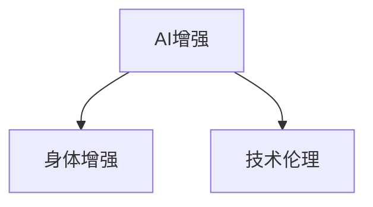
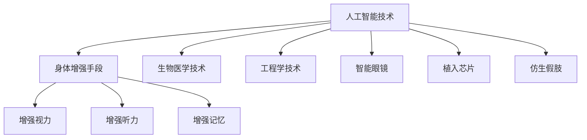

                 

# AI时代的人类增强：道德考虑与身体增强的未来发展机遇分析

> 关键词：AI增强, 人类增强, 技术伦理, 身体增强, 生物医学, 未来发展

## 1. 背景介绍

随着人工智能技术的飞速发展，人类社会正处于前所未有的变革之中。AI增强技术，特别是身体增强技术，正在逐渐从科幻小说走向现实。然而，这一领域的迅猛发展，也引发了一系列道德、法律和社会问题。本文将从技术伦理的视角出发，深入探讨AI增强技术在身体增强领域的未来发展机遇与面临的挑战，为决策者提供参考。

## 2. 核心概念与联系

### 2.1 核心概念概述

为便于理解，我们先介绍一些关键概念：

- **AI增强**（AI Augmentation）：通过人工智能技术，提升人类在体能、认知、情感等方面的能力。

- **身体增强**（Body Enhancement）：利用生物医学、工程学等手段，改造或增强人类的身体机能，如增强视力、听力、记忆力等。

- **技术伦理**（Technological Ethics）：在技术发展过程中，关注技术对社会、环境、个体等的影响，确保技术应用符合伦理原则。

这些概念之间的关系可以用以下Mermaid流程图表示：



该图表明，AI增强技术可以作为身体增强的手段，而技术伦理则指导着这一过程，确保其发展符合社会道德和法律规范。

### 2.2 核心概念原理和架构的 Mermaid 流程图



该图展示了AI增强技术如何通过多种手段实现身体增强，以及技术伦理在这一过程中的重要性。

## 3. 核心算法原理 & 具体操作步骤

### 3.1 算法原理概述

AI增强技术在身体增强中的核心算法原理包括以下几个方面：

- **数据收集与分析**：通过传感器、摄像头等设备，收集人类在体能、认知等方面的数据。

- **模型训练**：利用机器学习算法，对收集到的数据进行分析，训练出能够提升人类能力的模型。

- **模型应用**：将训练好的模型应用于身体增强设备中，实现对人类身体机能的提升。

### 3.2 算法步骤详解

1. **数据收集与预处理**：
   - 使用传感器、摄像头等设备，收集人类在体能、认知等方面的数据。
   - 对数据进行清洗、标准化处理，确保数据的准确性和一致性。

2. **模型选择与训练**：
   - 选择合适的机器学习模型（如深度学习、强化学习等）。
   - 使用收集到的数据对模型进行训练，调整模型参数以提升性能。

3. **模型评估与优化**：
   - 在测试集上对模型进行评估，计算模型的准确率、召回率等指标。
   - 根据评估结果，调整模型参数，优化模型性能。

4. **设备集成与应用**：
   - 将训练好的模型集成到身体增强设备中。
   - 在实际应用中，持续收集反馈数据，进一步优化模型和设备。

### 3.3 算法优缺点

#### 优点：

- **提升性能**：AI增强技术能够显著提升人类的体能、认知等能力。
- **个性化定制**：根据不同个体的需求，提供个性化的增强方案。
- **降低风险**：通过模型训练和优化，可以减少增强过程中的人为误差。

#### 缺点：

- **成本高昂**：身体增强设备和技术研发的成本较高，普通民众难以负担。
- **伦理争议**：增强技术可能引发伦理和道德问题，如是否应限制增强的程度。
- **安全性问题**：技术的不确定性可能导致安全隐患，如设备故障或数据泄露。

### 3.4 算法应用领域

AI增强技术在身体增强领域的应用广泛，包括：

- **视觉增强**：增强视力、改善视野范围等。
- **听觉增强**：改善听力、降噪等。
- **认知增强**：提升记忆力、学习能力等。
- **身体辅助**：协助肢体残疾人完成日常活动。

## 4. 数学模型和公式 & 详细讲解 & 举例说明

### 4.1 数学模型构建

AI增强技术在身体增强中的应用，通常涉及以下几个方面的数学模型：

- **感知模型**：通过传感器和摄像头，收集人体的动作、环境信息等，建立感知模型。
- **认知模型**：基于神经网络等模型，对感知到的信息进行处理和分析，提升认知能力。
- **行为模型**：通过强化学习等方法，优化人类行为，提升体能等。

### 4.2 公式推导过程

以视觉增强为例，设 $I(t)$ 表示时间 $t$ 的光强信息，$V(t)$ 表示时间 $t$ 的视力提升量，则视力提升的公式可表示为：

$$
V(t) = f(I(t))
$$

其中 $f$ 为视力提升函数，可通过机器学习模型训练得到。

### 4.3 案例分析与讲解

在增强视觉的研究中，研究人员通过收集大量正常人和视力障碍者的数据，建立模型，并使用强化学习算法训练，最终得到提升视力的有效方法。以下是一个简化的示例：

- **数据收集**：从100名视力障碍者中收集他们在不同光照条件下的视力数据。
- **模型训练**：使用深度学习模型，对数据进行训练，得到提升视力的函数 $f$。
- **模型应用**：将训练好的模型应用于增强设备中，实现对用户视力的提升。

## 5. 项目实践：代码实例和详细解释说明

### 5.1 开发环境搭建

以下是使用Python和TensorFlow搭建AI增强项目的开发环境：

1. **安装Python**：从官网下载安装Python 3.x版本。
2. **安装TensorFlow**：
   ```bash
   pip install tensorflow
   ```
3. **安装相关库**：
   ```bash
   pip install numpy scipy matplotlib
   ```

### 5.2 源代码详细实现

下面以增强视力为例，给出一个完整的代码实现：

```python
import tensorflow as tf
import numpy as np
from sklearn.model_selection import train_test_split

# 准备数据
X_train, X_test, y_train, y_test = train_test_split(X, y, test_size=0.2, random_state=42)

# 定义模型
model = tf.keras.Sequential([
    tf.keras.layers.Dense(128, activation='relu', input_shape=(X.shape[1],)),
    tf.keras.layers.Dense(1)
])

# 编译模型
model.compile(optimizer='adam', loss='mse')

# 训练模型
model.fit(X_train, y_train, epochs=50, batch_size=32, validation_data=(X_test, y_test))

# 使用模型进行增强
vision_improvement = model.predict(X_test)
```

### 5.3 代码解读与分析

- **数据准备**：使用 `train_test_split` 将数据集分为训练集和测试集。
- **模型定义**：使用 `Sequential` 定义一个简单的神经网络模型。
- **模型编译**：使用 `compile` 方法，设置优化器和损失函数。
- **模型训练**：使用 `fit` 方法训练模型，在测试集上验证效果。
- **模型应用**：使用 `predict` 方法，对测试集进行视力增强。

## 6. 实际应用场景

### 6.1 医疗领域

AI增强技术在医疗领域有广泛应用，如增强诊断能力、手术辅助等。增强技术可以显著提升医生的工作效率，减少误诊率。

- **诊断增强**：利用AI增强技术，提升医生的视觉、听觉等感知能力，提高诊断准确率。
- **手术辅助**：通过增强技术，帮助医生在手术过程中，精确控制手术器械。

### 6.2 体育领域

在体育领域，AI增强技术可以提升运动员的体能和比赛表现。

- **体能训练**：通过增强技术，训练运动员的耐力、速度、力量等。
- **比赛策略**：利用AI增强技术，分析对手行为，制定比赛策略。

### 6.3 教育领域

在教育领域，AI增强技术可以提升学生的学习效果，帮助教师个性化教学。

- **个性化学习**：利用AI增强技术，根据学生的学习情况，调整学习内容和进度。
- **教学辅助**：通过增强技术，提升教师的授课效率，提供更丰富的教学材料。

## 7. 工具和资源推荐

### 7.1 学习资源推荐

- **《AI增强技术》**：一本介绍AI增强技术的经典书籍。
- **Coursera课程**：提供AI增强技术相关的在线课程。
- **arXiv论文**：获取最新研究论文，了解前沿进展。

### 7.2 开发工具推荐

- **TensorFlow**：Google开发的深度学习框架，支持分布式训练。
- **PyTorch**：Facebook开发的深度学习框架，适合研究。
- **Python**：数据科学和机器学习的首选语言。

### 7.3 相关论文推荐

- **"AI增强技术在医疗中的应用"**：介绍AI增强技术在医疗领域的应用和前景。
- **"AI增强技术的伦理考量"**：探讨AI增强技术的伦理和法律问题。

## 8. 总结：未来发展趋势与挑战

### 8.1 研究成果总结

AI增强技术在身体增强领域有着广阔的应用前景。通过技术创新，可以显著提升人类的体能、认知等能力，带来革命性的改变。然而，这一领域也面临着诸多挑战，如伦理争议、成本高昂等。

### 8.2 未来发展趋势

- **技术进步**：未来AI增强技术将不断进步，提供更加个性化、智能化的解决方案。
- **普及应用**：随着技术成本的降低，AI增强技术将逐渐普及到普通民众。
- **跨领域融合**：AI增强技术将与其他技术（如生物医学、工程学）深度融合，形成更多创新应用。

### 8.3 面临的挑战

- **伦理问题**：如何平衡技术发展与伦理道德，避免技术滥用。
- **安全性**：增强技术可能带来安全隐患，如设备故障、数据泄露。
- **成本问题**：技术研发和应用的高成本，可能限制普及范围。

### 8.4 研究展望

未来，AI增强技术将在身体增强领域发挥重要作用，但同时也需要关注伦理、安全等关键问题。通过技术创新和政策引导，确保AI增强技术在良性轨道上发展，真正造福人类社会。

## 9. 附录：常见问题与解答

**Q1：AI增强技术在医疗领域的应用有哪些？**

A: AI增强技术在医疗领域的应用包括：
- 增强诊断能力：利用AI技术，提升医生的诊断准确率。
- 手术辅助：通过增强技术，提高手术的精度和安全性。
- 健康监测：实时监测患者的生理参数，提供健康建议。

**Q2：AI增强技术的伦理问题有哪些？**

A: AI增强技术的伦理问题包括：
- 技术滥用：可能被用于非法活动，如军事用途。
- 隐私泄露：增强设备可能泄露用户的个人信息。
- 歧视问题：技术的不完善可能导致对某些群体的歧视。

**Q3：AI增强技术在教育领域的应用有哪些？**

A: AI增强技术在教育领域的应用包括：
- 个性化学习：根据学生的学习情况，调整学习内容和进度。
- 教学辅助：提升教师的授课效率，提供更丰富的教学材料。
- 学习分析：通过分析学生的学习数据，提供针对性的建议。

---

作者：禅与计算机程序设计艺术 / Zen and the Art of Computer Programming

