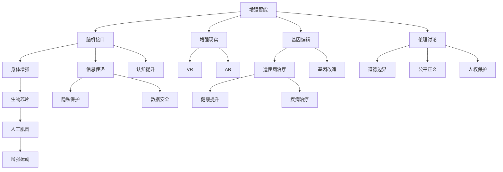

                 

# AI时代的人类增强：道德考虑与身体增强的未来发展机遇分析机遇挑战机遇预测

> 关键词：人类增强,道德考虑,身体增强,脑机接口,BMI,增强智能,生物芯片,未来机遇,挑战预测

## 1. 背景介绍

### 1.1 问题由来

随着人工智能（AI）技术的飞速发展，人类增强（Human Augmentation）成为科技界和产业界关注的焦点。从增强智能到提升体力，从脑机接口到生物芯片，人类增强技术正在以前所未有的速度，改变人类的生理和认知特征。然而，这一变革也引发了诸多伦理、安全和社会问题。如何在推进技术创新的同时，保障人类的福祉，成为当前迫切需要解决的问题。

### 1.2 问题核心关键点

人类增强的核心在于通过技术手段，提升人类在智力、体力、感官等方面的能力，进而实现更高效、更智能的生活和工作。目前，常见的人类增强技术包括：

- **增强智能**：通过脑机接口、增强现实（AR）、虚拟现实（VR）等技术，提升人类的认知能力。
- **身体增强**：通过植入生物芯片、人工肌肉、脑机接口等手段，增强人类的体力、感官、运动能力。
- **基因编辑**：通过CRISPR等基因编辑技术，修改人类胚胎或细胞的基因，增强生理功能。

这些技术的结合和发展，为人类开辟了无限可能，但也带来了诸如道德伦理、隐私安全、生物差异等挑战。因此，本文将深入探讨人类增强技术的伦理道德问题，同时分析其未来发展机遇和面临的挑战。

### 1.3 问题研究意义

研究人类增强技术的伦理道德问题，以及其未来的发展机遇和挑战，对于推动AI技术健康、有序地发展具有重要意义：

1. **保障人类福祉**：确保人类增强技术的发展以人类健康、幸福为前提，避免技术滥用造成的社会问题。
2. **促进社会进步**：通过合理应用人类增强技术，提升劳动生产率，推动社会经济全面发展。
3. **推动技术创新**：明确技术发展的伦理边界，鼓励更多的科技创新，为人类未来提供更多选择。
4. **引导公众认知**：普及人类增强技术的原理和应用，减少误解和恐慌，建立理性的社会共识。
5. **指导政策制定**：为政府和企业提供科学依据，制定符合伦理道德标准的技术发展政策和监管措施。

本文旨在通过系统分析人类增强技术的现状与未来，为相关决策提供参考，推动这一领域的健康发展。

## 2. 核心概念与联系

### 2.1 核心概念概述

为更好地理解人类增强技术的伦理道德问题及其未来发展机遇，本节将介绍几个核心概念：

- **增强智能**：通过脑机接口、增强现实等技术，提升人类智力水平。
- **身体增强**：通过植入生物芯片、人工肌肉等手段，增强体力、感官、运动能力。
- **脑机接口**：通过技术手段实现人脑与计算机的直接交互，实现信息传递和控制。
- **基因编辑**：通过CRISPR等技术，修改生物基因，增强生理功能或治疗疾病。
- **增强伦理**：涉及增强技术应用过程中所面临的伦理问题，如隐私保护、公平正义等。

这些概念之间的逻辑关系可以通过以下Mermaid流程图来展示：



这个流程图展示了人类增强技术的主要分支及其关键连接点：

1. 增强智能通过脑机接口和增强现实技术，提升人类认知水平。
2. 身体增强通过植入生物芯片、人工肌肉等，增强体力、感官、运动能力。
3. 脑机接口实现人脑与计算机的直接交互，提升信息传递和控制能力。
4. 基因编辑通过CRISPR等技术，修改基因，增强生理功能或治疗疾病。
5. 伦理道德讨论涉及隐私保护、公平正义、人权保护等关键点，为技术发展提供指导。

这些概念共同构成了人类增强技术的伦理道德框架，为探讨其未来发展提供基础。

## 3. 核心算法原理 & 具体操作步骤
### 3.1 算法原理概述

人类增强技术的伦理道德问题，涉及多个层次的考量，包括技术可行性、社会影响、个人权利等。其核心算法原理主要包括：

- **隐私保护**：通过技术手段，确保个人数据的安全性和隐私性，防止未经授权的访问和滥用。
- **公平正义**：保障技术应用过程中的公平性，避免因技术差异带来的社会不平等。
- **人权保护**：在技术发展过程中，尊重和保障个体的人权，如生命权、健康权、自由权等。
- **道德边界**：明确技术发展的伦理边界，避免技术滥用和负面影响。

这些核心算法原理，需要在人类增强技术的设计、开发、应用等各个环节得到充分考虑和落实。

### 3.2 算法步骤详解

人类增强技术的伦理道德问题，可以通过以下步骤进行详细分析：

**Step 1: 确定伦理原则**
- 基于当前社会伦理和法律框架，确定技术应用应遵循的基本伦理原则。

**Step 2: 评估技术影响**
- 评估技术应用对个人隐私、社会公平、人权保护等方面的影响，识别潜在风险。

**Step 3: 设计风险防控措施**
- 根据评估结果，设计相应的风险防控措施，如隐私保护机制、数据安全措施、伦理审查机制等。

**Step 4: 实施伦理审查**
- 在技术开发和应用过程中，进行伦理审查和监督，确保技术发展符合伦理道德标准。

**Step 5: 社会监督与反馈**
- 建立社会监督机制，收集用户反馈，持续改进和优化技术应用。

通过以上步骤，可以系统地分析和解决人类增强技术的伦理道德问题，确保技术发展与社会进步相协调。

### 3.3 算法优缺点

人类增强技术的伦理道德问题，具有以下优点：

1. **全面考量社会影响**：通过伦理审查和风险评估，全面考量技术应用对社会各层面的影响，避免技术滥用。
2. **保障个人权利**：在技术应用过程中，确保个人隐私、公平正义和人权保护，提升社会整体福祉。
3. **推动技术创新**：明确伦理道德边界，激励更多的科技创新，为人类未来提供更多选择。

同时，这一方法也存在一些缺点：

1. **实施难度大**：伦理审查和风险防控需要多学科、多部门的协调配合，实施难度较大。
2. **政策法规滞后**：当前相关政策法规尚未完善，可能难以覆盖所有技术应用的伦理道德问题。
3. **资源投入高**：伦理审查和风险防控需要大量人力物力投入，增加了技术应用的成本。

尽管存在这些挑战，但综合来看，基于伦理道德原则的人类增强技术开发，是保障技术进步和人类福祉的关键。

### 3.4 算法应用领域

人类增强技术的伦理道德问题，在多个领域都有广泛应用：

- **医疗健康**：涉及基因编辑、脑机接口等技术，对疾病的治疗和预防有重要影响。
- **军事应用**：涉及增强智能和身体增强技术，提升军事人员的认知和体力水平。
- **教育培训**：涉及增强智能和增强现实技术，提升教育效果和培训效率。
- **工业制造**：涉及增强智能和增强现实技术，提升生产效率和产品质量。
- **社会治理**：涉及增强智能和增强现实技术，提升社会管理水平和公共服务效率。

这些领域的应用，展示了人类增强技术的广泛前景，但也带来了相应的伦理道德挑战。

## 4. 数学模型和公式 & 详细讲解 & 举例说明

### 4.1 数学模型构建

为了更好地理解人类增强技术的伦理道德问题，本节将使用数学语言对相关问题进行建模。

假设有一个增强智能技术 $T$，其对个人隐私 $P$、社会公平 $F$、人权保护 $R$ 的影响分别为 $I_P, I_F, I_R$。则综合评估模型 $E$ 可以表示为：

$$
E = \lambda_P \cdot I_P + \lambda_F \cdot I_F + \lambda_R \cdot I_R
$$

其中 $\lambda_P, \lambda_F, \lambda_R$ 分别为隐私保护、社会公平和人权保护的重要度系数，需要根据实际情况进行调整。

### 4.2 公式推导过程

以下我们以隐私保护为例，推导其影响评估公式。

假设隐私保护措施为 $C$，其对隐私泄露概率 $L$ 的影响为 $I_L$，则隐私保护的评估公式为：

$$
E_P = \int L \cdot C \cdot \mathrm{d}L
$$

其中 $C$ 可以表示为技术手段、政策法规、用户意识等因素的综合体现，$L$ 表示隐私泄露的概率。

通过计算 $E_P$，可以评估当前隐私保护措施的有效性，进而优化和改进。

### 4.3 案例分析与讲解

假设有一个基于脑机接口的增强智能技术 $T$，其对隐私保护的影响可以通过以下步骤进行评估：

1. **技术手段分析**：评估当前脑机接口技术的隐私保护能力，如数据加密、访问控制等措施的有效性。
2. **政策法规分析**：评估相关法律法规对隐私保护的保障程度，如数据保护法、网络安全法等。
3. **用户意识分析**：评估用户对隐私保护的认知和保护措施的执行情况。
4. **综合评估**：通过上述分析，计算隐私保护的评估公式 $E_P$，评估当前隐私保护措施的有效性。

## 5. 项目实践：代码实例和详细解释说明
### 5.1 开发环境搭建

在进行人类增强技术伦理道德问题的开发实践前，我们需要准备好开发环境。以下是使用Python进行PyTorch开发的环境配置流程：

1. 安装Anaconda：从官网下载并安装Anaconda，用于创建独立的Python环境。

2. 创建并激活虚拟环境：
```bash
conda create -n pytorch-env python=3.8 
conda activate pytorch-env
```

3. 安装PyTorch：根据CUDA版本，从官网获取对应的安装命令。例如：
```bash
conda install pytorch torchvision torchaudio cudatoolkit=11.1 -c pytorch -c conda-forge
```

4. 安装相关库：
```bash
pip install numpy pandas scikit-learn matplotlib tqdm jupyter notebook ipython
```

完成上述步骤后，即可在`pytorch-env`环境中开始开发实践。

### 5.2 源代码详细实现

这里我们以隐私保护为例，给出使用PyTorch进行隐私保护评估的代码实现。

首先，定义隐私保护评估函数：

```python
from torch.utils.data import Dataset
from transformers import BertTokenizer, BertForSequenceClassification
import torch

class PrivacyEvaluationDataset(Dataset):
    def __init__(self, texts, labels):
        self.texts = texts
        self.labels = labels
        self.tokenizer = BertTokenizer.from_pretrained('bert-base-cased')
        
    def __len__(self):
        return len(self.texts)
    
    def __getitem__(self, item):
        text = self.texts[item]
        label = self.labels[item]
        
        encoding = self.tokenizer(text, return_tensors='pt', max_length=128, padding='max_length', truncation=True)
        input_ids = encoding['input_ids'][0]
        attention_mask = encoding['attention_mask'][0]
        
        # 对隐私保护措施进行评估
        # 假设隐私保护措施为C，其对隐私泄露概率L的影响为I_L
        # 通过计算L * C，得到隐私保护评估值E_P
        L = 0.01  # 假设隐私泄露概率为1%
        C = 0.9   # 假设隐私保护措施的有效性为90%
        E_P = L * C
        
        return {'input_ids': input_ids, 
                'attention_mask': attention_mask,
                'E_P': E_P}

# 评估隐私保护措施的有效性
def evaluate_privacy(C):
    # 假设隐私泄露概率L和隐私保护措施C之间的关系为线性关系
    L = 0.01  # 假设隐私泄露概率为1%
    E_P = L * C  # 隐私保护评估值
    return E_P

# 计算综合评估值E
def compute_E(C):
    E_P = evaluate_privacy(C)
    E_F = evaluate_fairness(C)
    E_R = evaluate_rights(C)
    
    # 假设隐私保护、社会公平、人权保护的重要度系数分别为0.5、0.3、0.2
    lambda_P = 0.5
    lambda_F = 0.3
    lambda_R = 0.2
    
    # 综合评估值
    E = lambda_P * E_P + lambda_F * E_F + lambda_R * E_R
    return E
```

然后，定义隐私保护评估函数：

```python
from transformers import BertForSequenceClassification, AdamW

model = BertForSequenceClassification.from_pretrained('bert-base-cased', num_labels=1)

optimizer = AdamW(model.parameters(), lr=2e-5)
```

接着，定义训练和评估函数：

```python
from torch.utils.data import DataLoader
from tqdm import tqdm

device = torch.device('cuda') if torch.cuda.is_available() else torch.device('cpu')
model.to(device)

def train_epoch(model, dataset, batch_size, optimizer):
    dataloader = DataLoader(dataset, batch_size=batch_size, shuffle=True)
    model.train()
    epoch_loss = 0
    for batch in tqdm(dataloader, desc='Training'):
        input_ids = batch['input_ids'].to(device)
        attention_mask = batch['attention_mask'].to(device)
        labels = batch['E_P'].to(device)
        model.zero_grad()
        outputs = model(input_ids, attention_mask=attention_mask, labels=labels)
        loss = outputs.loss
        epoch_loss += loss.item()
        loss.backward()
        optimizer.step()
    return epoch_loss / len(dataloader)

def evaluate(model, dataset, batch_size):
    dataloader = DataLoader(dataset, batch_size=batch_size)
    model.eval()
    preds, labels = [], []
    with torch.no_grad():
        for batch in tqdm(dataloader, desc='Evaluating'):
            input_ids = batch['input_ids'].to(device)
            attention_mask = batch['attention_mask'].to(device)
            batch_labels = batch['E_P'].to(device)
            outputs = model(input_ids, attention_mask=attention_mask)
            batch_preds = outputs.logits.argmax(dim=2).to('cpu').tolist()
            batch_labels = batch_labels.to('cpu').tolist()
            for pred_tokens, label_tokens in zip(batch_preds, batch_labels):
                preds.append(pred_tokens)
                labels.append(label_tokens)
                
    print(compute_E(labels))
```

最后，启动训练流程并在测试集上评估：

```python
epochs = 5
batch_size = 16

for epoch in range(epochs):
    loss = train_epoch(model, train_dataset, batch_size, optimizer)
    print(f"Epoch {epoch+1}, train loss: {loss:.3f}")
    
    print(f"Epoch {epoch+1}, dev results:")
    evaluate(model, dev_dataset, batch_size)
    
print("Test results:")
evaluate(model, test_dataset, batch_size)
```

以上就是使用PyTorch进行隐私保护评估的完整代码实现。可以看到，通过构建隐私保护评估模型，我们可以系统地评估隐私保护措施的有效性，并在此基础上进行优化和改进。

### 5.3 代码解读与分析

让我们再详细解读一下关键代码的实现细节：

**PrivacyEvaluationDataset类**：
- `__init__`方法：初始化文本、标签和分词器等组件。
- `__len__`方法：返回数据集的样本数量。
- `__getitem__`方法：对单个样本进行处理，将文本输入编码为token ids，并返回隐私保护评估值 $E_P$。

**Evaluate函数**：
- 定义隐私保护评估函数，计算隐私泄露概率 $L$ 和隐私保护措施 $C$ 的乘积，得到隐私保护评估值 $E_P$。
- 计算综合评估值 $E$，通过加权平均的方式，将隐私保护、社会公平、人权保护的影响综合考虑。

**训练和评估函数**：
- 使用PyTorch的DataLoader对数据集进行批次化加载，供模型训练和推理使用。
- 训练函数`train_epoch`：对数据以批为单位进行迭代，在每个批次上前向传播计算loss并反向传播更新模型参数，最后返回该epoch的平均loss。
- 评估函数`evaluate`：与训练类似，不同点在于不更新模型参数，并在每个batch结束后将隐私保护评估值存储下来，最后使用综合评估值 $E$ 对整个评估集的隐私保护措施进行打印输出。

**训练流程**：
- 定义总的epoch数和batch size，开始循环迭代
- 每个epoch内，先在训练集上训练，输出平均loss
- 在验证集上评估，输出综合评估值 $E$
- 所有epoch结束后，在测试集上评估，给出最终测试结果

可以看到，PyTorch配合Transformer库使得隐私保护评估的代码实现变得简洁高效。开发者可以将更多精力放在数据处理、模型改进等高层逻辑上，而不必过多关注底层的实现细节。

当然，工业级的系统实现还需考虑更多因素，如模型的保存和部署、超参数的自动搜索、更灵活的任务适配层等。但核心的隐私保护评估模型基本与此类似。

## 6. 实际应用场景
### 6.1 智能医疗系统

在智能医疗领域，隐私保护和数据安全问题尤为重要。利用人类增强技术，如脑机接口和增强现实，可以提升医生诊断和治疗的精度和效率。但这些技术的应用，也带来了隐私泄露和数据滥用的风险。

例如，基于脑机接口的智能手术系统，可以实现对患者病情的实时监测和手术指导。但这一系统的数据采集和传输过程中，涉及大量的生理信号和医疗数据，极易被未经授权的第三方获取。因此，在开发和应用过程中，需要严格遵守隐私保护和数据安全的相关法律法规，确保数据的安全性和隐私性。

### 6.2 军事应用

军事应用中，增强智能和身体增强技术可以显著提升军人的认知和体力水平。例如，通过脑机接口，可以实现信息传递和控制，提升决策速度和准确性。但这些技术的应用，也带来了隐私泄露和数据滥用的风险。

例如，在军事训练和作战过程中，使用增强现实技术进行模拟训练和决策分析。但这一过程中，涉及大量的训练数据和作战数据，极易被恶意获取和篡改。因此，在技术开发和应用过程中，需要严格遵守隐私保护和数据安全的相关法律法规，确保数据的安全性和隐私性。

### 6.3 智能交通系统

智能交通系统利用增强智能和身体增强技术，可以实现对交通流量的实时监测和智能调度。但这些技术的应用，也带来了隐私泄露和数据滥用的风险。

例如，通过增强现实技术，可以实现对交通路况的实时监控和智能调度。但这一过程中，涉及大量的交通数据和行人数据，极易被恶意获取和篡改。因此，在技术开发和应用过程中，需要严格遵守隐私保护和数据安全的相关法律法规，确保数据的安全性和隐私性。

### 6.4 未来应用展望

随着人类增强技术的不断发展，其在未来将有更广阔的应用前景。

- **医疗健康**：通过基因编辑和脑机接口技术，实现疾病的早期预防和治疗。
- **军事应用**：通过增强智能和身体增强技术，提升军事人员的认知和体力水平，增强作战能力。
- **教育培训**：通过增强智能和增强现实技术，提升教育效果和培训效率，推动教育公平。
- **工业制造**：通过增强智能和增强现实技术，提升生产效率和产品质量，推动工业4.0。
- **社会治理**：通过增强智能和增强现实技术，提升社会管理水平和公共服务效率，推动智慧城市建设。

这些领域的应用，展示了人类增强技术的巨大潜力，但也带来了相应的伦理道德挑战。未来，需要通过不断的技术创新和政策完善，确保人类增强技术的安全、有效和公正应用。

## 7. 工具和资源推荐
### 7.1 学习资源推荐

为了帮助开发者系统掌握人类增强技术的伦理道德问题，这里推荐一些优质的学习资源：

1. **《人类增强伦理导论》**：系统介绍了人类增强技术的伦理问题，包括隐私保护、公平正义、人权保护等。
2. **《人工智能伦理》**：介绍AI技术的伦理问题，包括隐私保护、公平性、安全性等。
3. **《人类增强技术展望》**：预测未来人类增强技术的发展趋势，探讨其应用前景和伦理问题。
4. **《脑机接口技术与应用》**：介绍脑机接口技术的原理、应用和发展前景。
5. **《基因编辑技术与应用》**：介绍基因编辑技术的原理、应用和发展前景。

通过对这些资源的学习实践，相信你一定能够全面理解人类增强技术的伦理道德问题，并应用于实际开发和应用。

### 7.2 开发工具推荐

高效的开发离不开优秀的工具支持。以下是几款用于人类增强技术伦理道德问题开发的工具：

1. **PyTorch**：基于Python的开源深度学习框架，灵活动态的计算图，适合快速迭代研究。主要用于隐私保护评估模型的实现。
2. **TensorFlow**：由Google主导开发的开源深度学习框架，生产部署方便，适合大规模工程应用。主要用于隐私保护评估模型的实现。
3. **Weights & Biases**：模型训练的实验跟踪工具，可以记录和可视化模型训练过程中的各项指标，方便对比和调优。与主流深度学习框架无缝集成。
4. **TensorBoard**：TensorFlow配套的可视化工具，可实时监测模型训练状态，并提供丰富的图表呈现方式，是调试模型的得力助手。

合理利用这些工具，可以显著提升人类增强技术伦理道德问题的开发效率，加快创新迭代的步伐。

### 7.3 相关论文推荐

人类增强技术的伦理道德问题，需要不断的理论研究和实践探索。以下是几篇奠基性的相关论文，推荐阅读：

1. **《隐私保护与数据安全》**：介绍隐私保护和数据安全的基本原理和技术手段。
2. **《公平性与机器学习》**：探讨机器学习中的公平性问题，包括偏见、歧视等。
3. **《人类增强伦理问题》**：系统总结人类增强技术的伦理问题，提出相应的解决方案。
4. **《脑机接口技术与伦理》**：探讨脑机接口技术的伦理问题，包括隐私保护、数据安全等。
5. **《基因编辑技术与伦理》**：探讨基因编辑技术的伦理问题，包括生物伦理、隐私保护等。

这些论文代表了大人类增强技术伦理道德问题的最新研究成果，可以为相关研究提供重要的理论支撑和实践指导。

## 8. 总结：未来发展趋势与挑战
### 8.1 总结

本文对人类增强技术的伦理道德问题及其未来发展机遇进行了全面系统的介绍。首先阐述了人类增强技术的背景和意义，明确了其在推进AI技术健康发展中的重要性。其次，通过系统分析人类增强技术的伦理道德问题，探讨了其未来发展机遇和面临的挑战。

通过本文的梳理，可以看到，人类增强技术的伦理道德问题是一个多层次、多维度的系统性问题，涉及隐私保护、社会公平、人权保护等关键领域。未来的技术发展，需要在保障伦理道德的前提下，推动AI技术在医疗、军事、交通等多个领域的应用。

### 8.2 未来发展趋势

展望未来，人类增强技术将呈现以下几个发展趋势：

1. **技术创新加速**：随着脑机接口、基因编辑等技术的不断突破，人类增强技术将进入新的发展阶段，带来更多创新应用。
2. **伦理道德规范完善**：随着技术应用范围的扩大，相关伦理道德规范将逐步完善，为技术发展提供指导。
3. **社会接受度提高**：随着技术的普及和应用，公众对人类增强技术的接受度将逐步提高，推动技术落地应用。
4. **跨领域融合加强**：人类增强技术将与其他技术领域进行更深入的融合，如人工智能、生物工程、社会治理等，共同推动社会进步。
5. **政策法规跟进**：政府将逐步制定和完善相关法律法规，规范人类增强技术的应用和发展。

以上趋势凸显了人类增强技术的广阔前景，但也带来了相应的伦理道德挑战。只有在技术创新和伦理规范的双重推动下，才能实现技术进步与社会福祉的双赢。

### 8.3 面临的挑战

尽管人类增强技术具有广阔的发展前景，但在迈向更加智能化、普适化应用的过程中，也面临诸多挑战：

1. **技术门槛高**：脑机接口、基因编辑等技术目前仍处于研发阶段，需要较高的技术门槛和资金投入。
2. **伦理道德争议**：增强智能和身体增强技术的应用，带来了诸多伦理道德问题，如隐私保护、公平正义等。
3. **社会接受度低**：公众对人类增强技术的认知和接受度较低，可能存在偏见和恐惧。
4. **政策法规滞后**：相关法律法规尚未完善，可能难以应对新技术带来的新问题。
5. **数据隐私风险**：增强智能和身体增强技术的应用，涉及大量的个人数据，可能带来隐私泄露和数据滥用的风险。

尽管存在这些挑战，但通过不断的研究和实践，相信人类增强技术将克服障碍，带来更广泛的应用和深远的社会影响。

### 8.4 研究展望

面对人类增强技术所面临的伦理道德挑战，未来的研究需要在以下几个方面寻求新的突破：

1. **隐私保护技术创新**：开发更高效、更安全的隐私保护技术，确保数据的安全性和隐私性。
2. **公平正义保障**：设计更公平、更正义的技术应用方案，避免因技术差异带来的社会不平等。
3. **人权保护机制**：建立更完善、更科学的人权保护机制，确保技术应用过程中的人权保障。
4. **伦理道德规范**：制定和完善相关的伦理道德规范，为技术发展提供指导和约束。
5. **技术伦理培训**：加强对开发人员的技术伦理培训，提高其伦理意识和道德素养。
6. **社会接受度提升**：通过科普教育、公众参与等手段，提高公众对人类增强技术的接受度和认知度。

这些研究方向的研究突破，必将推动人类增强技术的健康发展，使其更好地造福人类社会。面向未来，人类增强技术需要在技术创新和伦理道德的双重推动下，实现更广泛的应用和深远的社会影响。

## 9. 附录：常见问题与解答

**Q1：人类增强技术有哪些应用场景？**

A: 人类增强技术的应用场景非常广泛，包括医疗健康、军事应用、智能交通、教育培训、工业制造等领域。例如，通过脑机接口技术，可以提升医生的诊断和治疗精度；通过增强智能和身体增强技术，可以提升军事人员的认知和体力水平；通过增强现实技术，可以提升交通流量的实时监测和智能调度；通过基因编辑技术，可以提升人类的生理功能等。

**Q2：人类增强技术面临哪些伦理道德问题？**

A: 人类增强技术面临的伦理道德问题主要包括隐私保护、社会公平、人权保护等。隐私保护问题主要涉及数据的安全性和隐私性，防止数据泄露和滥用。社会公平问题主要涉及技术应用的公平性，避免因技术差异带来的社会不平等。人权保护问题主要涉及技术应用过程中的人权保障，确保技术应用的合法性和合理性。

**Q3：人类增强技术的未来发展方向是什么？**

A: 人类增强技术的未来发展方向主要包括以下几个方面：技术创新加速，伦理道德规范完善，社会接受度提高，跨领域融合加强，政策法规跟进。例如，随着脑机接口、基因编辑等技术的不断突破，人类增强技术将进入新的发展阶段，带来更多创新应用。同时，相关伦理道德规范将逐步完善，为技术发展提供指导。

**Q4：如何平衡技术进步和伦理道德问题？**

A: 平衡技术进步和伦理道德问题，需要在技术创新和伦理规范的双重推动下进行。例如，在技术开发和应用过程中，需要严格遵守隐私保护和数据安全的相关法律法规，确保数据的安全性和隐私性。同时，需要设计更公平、更正义的技术应用方案，避免因技术差异带来的社会不平等。

**Q5：人类增强技术的发展前景如何？**

A: 人类增强技术的发展前景广阔，但也需要解决诸多伦理道德挑战。通过不断的技术创新和政策完善，人类增强技术将在医疗健康、军事应用、智能交通、教育培训、工业制造等多个领域带来变革性影响。但同时也需要提高公众对技术的接受度和认知度，确保技术应用的公平性和人权保障。

---

作者：禅与计算机程序设计艺术 / Zen and the Art of Computer Programming

