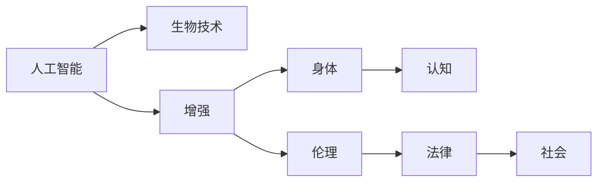

                 

# AI时代的人类增强：道德考虑与身体增强的未来发展机遇挑战分析

## 1. 背景介绍

在21世纪，人类正面临前所未有的技术变革，特别是人工智能（AI）和生物技术的飞速发展，使得我们能够重新思考和重塑人类的能力和身体极限。这些技术不仅在科技领域产生了深远影响，也在医学、体育、娱乐和军事等各个领域掀起新的浪潮。本文将从道德的角度出发，探讨身体增强技术的未来发展机遇和挑战，并结合AI时代的新特点，分析其在提升人类能力方面的潜力。

## 2. 核心概念与联系

### 2.1 核心概念概述

**人工智能**：使计算机能够执行通常需要人类智能的任务，例如视觉感知、语言理解、决策制定和自我修正。

**生物技术**：包括遗传工程、细胞治疗、组织工程和仿生学等，旨在通过科学手段改善和增强人类的身体功能。

**增强**：通过外部干预提升或强化个体的身体和认知功能，超越其先天或后天条件的限制。

**道德考虑**：在技术应用中，需考虑的伦理、社会和法律规范，以确保技术进步促进人类福祉，而非带来新的不平等和风险。

### 2.2 核心概念原理和架构的 Mermaid 流程图



这一流程图展示了人工智能和生物技术在增强人类能力和认知功能方面的联系，并引入了道德、法律和社会层面的考量。

## 3. 核心算法原理 & 具体操作步骤

### 3.1 算法原理概述

增强技术的核心在于将人工智能与生物技术相结合，通过AI算法分析和优化生物数据，进而指导生物工程的实施。例如，使用AI进行基因测序数据的分析，发现潜在的生物标记，指导个性化治疗；或使用AI辅助设计仿生假肢，提高肢体功能。这些技术通过算法和模型的训练，能够不断优化自身性能，并适应新的生物数据。

### 3.2 算法步骤详解

**数据收集与处理**：从医院、实验室和穿戴设备等来源收集生物数据，如基因组、细胞状态、肌肉力量等，并对数据进行清洗、标准化和标注。

**模型构建与训练**：选择适合的机器学习模型（如深度学习、强化学习等），并使用生物数据进行训练。优化模型以提高其预测和分类准确性，同时确保模型的可解释性和鲁棒性。

**结果验证与迭代**：在临床或实验环境中验证模型的预测效果，收集反馈并根据需要进行模型迭代。

**生物工程应用**：将模型应用于生物工程的实践中，指导个性化治疗方案的设计，或优化仿生假肢的设计和制造。

### 3.3 算法优缺点

**优点**：
- 能够通过大量生物数据的学习，快速识别和预测潜在的生物标记，加速疾病诊断和治疗。
- 利用AI的强大计算能力，优化仿生假肢等增强设备的设计和性能，提高应用效果。
- 通过模型迭代和优化，不断提高增强技术的精度和适应性。

**缺点**：
- 数据隐私和安全问题，生物数据的收集和处理可能涉及个人隐私，需谨慎处理。
- 伦理和法律争议，增强技术的应用可能引发关于生命伦理和人类身份的讨论。
- 技术和算法的局限性，模型的预测和优化效果受限于数据质量和算法设计。

### 3.4 算法应用领域

**医疗健康**：AI辅助的基因测序分析和个性化治疗方案设计，AI辅助的手术导航和机器人手术。

**运动和体能**：AI优化的运动训练计划，增强型运动装备和仿生假肢，以及基于生物反馈的康复训练。

**娱乐和教育**：增强现实（AR）和虚拟现实（VR）中的生物反馈训练，以及通过生物数据个性化定制的教育和训练内容。

## 4. 数学模型和公式 & 详细讲解 & 举例说明

### 4.1 数学模型构建

假设有一组生物数据集$D=\{(x_i, y_i)\}_{i=1}^N$，其中$x_i$代表第$i$个样本的生物特征向量，$y_i$代表与该特征相关的标签或结果。我们使用一个线性回归模型$f(x) = \theta^T x$来拟合这些数据，其中$\theta$为模型参数。模型的损失函数为均方误差：

$$
\mathcal{L}(\theta) = \frac{1}{2N} \sum_{i=1}^N (y_i - f(x_i))^2
$$

通过梯度下降算法优化$\theta$，最小化损失函数。

### 4.2 公式推导过程

对于每个样本$x_i$，模型的预测结果为：

$$
f(x_i) = \theta^T x_i
$$

预测误差为：

$$
e_i = y_i - f(x_i) = y_i - \theta^T x_i
$$

平均损失函数为：

$$
\mathcal{L}(\theta) = \frac{1}{2N} \sum_{i=1}^N e_i^2 = \frac{1}{2N} \sum_{i=1}^N (y_i - \theta^T x_i)^2
$$

对$\theta$求导，得到梯度：

$$
\frac{\partial \mathcal{L}(\theta)}{\partial \theta} = \frac{1}{N} \sum_{i=1}^N -2(x_i - \overline{x}) y_i
$$

其中$\overline{x}$为样本$x$的均值。

### 4.3 案例分析与讲解

以基因测序数据的分析为例，可以使用支持向量机（SVM）模型进行分类。将基因序列转化为特征向量$x$，并使用标签$y$表示基因与疾病的关联。通过SVM模型训练，可以识别出与疾病相关的生物标记。

## 5. 项目实践：代码实例和详细解释说明

### 5.1 开发环境搭建

为进行AI和生物技术的项目实践，需要搭建Python开发环境，并配置必要的深度学习库，如TensorFlow或PyTorch，以及数据处理库，如Pandas和NumPy。

### 5.2 源代码详细实现

以下是一个简化的基因测序数据分类示例，使用TensorFlow构建支持向量机模型：

```python
import tensorflow as tf
import pandas as pd
from sklearn.model_selection import train_test_split

# 读取基因数据
df = pd.read_csv('gene_data.csv')

# 分割训练集和测试集
train_df, test_df = train_test_split(df, test_size=0.2)

# 定义模型
model = tf.keras.Sequential([
    tf.keras.layers.Dense(64, activation='relu', input_shape=(len(df.columns),)),
    tf.keras.layers.Dense(1, activation='sigmoid')
])

# 编译模型
model.compile(optimizer='adam', loss='binary_crossentropy', metrics=['accuracy'])

# 训练模型
model.fit(train_df.drop('label', axis=1), train_df['label'], epochs=10, batch_size=32)

# 评估模型
loss, accuracy = model.evaluate(test_df.drop('label', axis=1), test_df['label'])
print('Test accuracy:', accuracy)
```

### 5.3 代码解读与分析

代码首先导入必要的库，然后读取基因数据集，并分割为训练集和测试集。接着定义一个简单的神经网络模型，并进行编译和训练。最后评估模型的准确率。

## 6. 实际应用场景

### 6.1 医疗健康

在医疗健康领域，AI和生物技术可以结合使用，例如：
- 使用AI对基因测序数据进行分析，发现潜在的疾病基因标记，指导个性化治疗方案的设计。
- 使用AI辅助设计仿生假肢，提高肢体功能，帮助患者恢复运动能力。

### 6.2 运动和体能

在运动和体能领域，AI和生物技术可以结合使用，例如：
- 使用AI分析运动员的身体数据，如心率、肌电信号等，优化训练计划和运动表现。
- 使用生物反馈技术，如肌肉电刺激，帮助运动员进行康复训练和恢复。

### 6.3 娱乐和教育

在娱乐和教育领域，AI和生物技术可以结合使用，例如：
- 使用AI生成的虚拟现实环境，结合生物反馈训练，提升用户体验和互动性。
- 使用生物数据个性化定制的教育和训练内容，提高学习效率和效果。

### 6.4 未来应用展望

随着AI和生物技术的进一步发展，未来在增强技术方面的应用前景广阔，包括：
- 增强现实和虚拟现实中的生物反馈训练，提升用户互动和体验。
- 通过AI优化运动装备设计，实现智能穿戴设备的功能增强。
- 基于生物数据的个性化健康管理，提升整体健康水平。

## 7. 工具和资源推荐

### 7.1 学习资源推荐

- **《人工智能：一种现代方法》**：提供AI的基本概念和算法，适合初学者。
- **《机器学习实战》**：通过Python实现各类机器学习算法，提供动手实践的案例。
- **Coursera和edX**：提供高质量的在线课程，涵盖从基础到高级的AI和生物技术知识。

### 7.2 开发工具推荐

- **Python**：简单易学，生态丰富，广泛用于AI和生物技术的开发。
- **TensorFlow和PyTorch**：两大主流深度学习框架，提供强大的计算能力和丰富的模型库。
- **Jupyter Notebook**：支持Python代码的交互式执行，方便进行算法和模型的迭代优化。

### 7.3 相关论文推荐

- **《深度学习在基因组学中的应用》**：讨论AI在基因测序和分析中的应用。
- **《增强现实技术在健康管理中的应用》**：研究AI在增强现实技术中的健康管理应用。
- **《生物反馈技术在运动训练中的应用》**：探讨生物反馈技术在运动训练中的应用和效果。

## 8. 总结：未来发展趋势与挑战

### 8.1 研究成果总结

AI和生物技术的结合，为增强技术的发展提供了广阔的前景。通过AI算法优化生物数据，可以加速疾病诊断和治疗，优化运动装备设计，提升用户体验和互动性。然而，技术的发展也带来了伦理和法律方面的挑战，需谨慎处理数据隐私和安全问题，避免技术滥用。

### 8.2 未来发展趋势

未来AI和生物技术将更加紧密结合，形成更强大的技术合力。增强技术将在医疗健康、运动体能和娱乐教育等多个领域发挥重要作用，推动人类能力的进一步提升。

### 8.3 面临的挑战

在技术发展的同时，需关注以下挑战：
- 数据隐私和安全问题，需确保数据的合法收集和使用。
- 伦理和法律争议，需明确技术应用的边界和规范。
- 算法的鲁棒性和公平性，需确保算法的准确性和公正性。

### 8.4 研究展望

未来的研究应关注：
- 多模态数据的整合，结合视觉、听觉、触觉等多种感官数据，提升AI和生物技术的融合效果。
- 跨学科合作，结合心理学、社会学等学科知识，提升技术的应用效果和普适性。
- 伦理和社会影响评估，通过跨领域研究，确保技术进步带来社会福祉。

## 9. 附录：常见问题与解答

**Q1：AI和生物技术结合的难点是什么？**

A: AI和生物技术结合的难点在于数据的质量和量级。生物数据通常复杂且多样，需进行大量的预处理和清洗工作。此外，生物数据的收集和使用涉及伦理和法律问题，需谨慎处理。

**Q2：增强技术的伦理和法律问题如何解决？**

A: 增强技术的伦理和法律问题需要通过多方合作解决，包括政府、企业和公众。政府应制定相应的法律法规，明确技术应用的范围和规范。企业应建立严格的数据隐私和安全保护机制，避免数据滥用。公众应参与技术应用的讨论和监督，确保技术的透明性和公正性。

**Q3：增强技术的发展对社会有什么影响？**

A: 增强技术的发展将带来新的社会机会和挑战。一方面，可以提升人类的能力，推动经济发展和技术进步。另一方面，可能加剧社会不平等，需确保技术的公平应用。

通过以上分析和讨论，我们看到了AI和生物技术结合在增强技术方面的广阔前景，同时也意识到了技术发展带来的挑战和风险。在未来的发展中，需注重技术的应用伦理和社会影响，确保技术的进步为人类带来真正的福祉。

