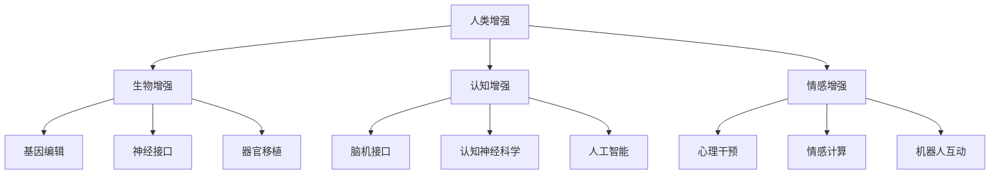

                 

## 1. 背景介绍

### 1.1 问题由来

随着人工智能（AI）技术的迅猛发展，特别是在生物技术、信息技术和医疗技术领域的交叉融合，人类增强的概念正在变得越来越现实。人类增强旨在通过科技手段提升人类的身体、认知和情感能力，从而改变人类的生活和工作方式。尽管这一愿景令人激动，但随之而来的伦理和道德问题也愈加突出。如何科学、合理地推进人类增强，既充分利用科技带来的机遇，又妥善应对潜在的风险和挑战，成为了全球学界和业界共同关注的课题。

### 1.2 问题核心关键点

人类增强的主要方向包括生物增强、认知增强和情感增强三大类。生物增强涉及通过基因编辑、神经接口和器官移植等手段提升人体机能；认知增强主要指通过脑机接口、认知神经科学和人工智能技术提升智能水平；情感增强则关注通过心理干预、情感计算和机器人互动等手段增强人类的情感体验。这些增强手段既包含传统药物和手术，也涵盖了前沿的基因编辑、神经网络和虚拟现实（VR）技术。

## 2. 核心概念与联系

### 2.1 核心概念概述

为更好地理解AI时代的人类增强，本节将介绍几个关键概念：

- **人类增强**：指通过科技手段提升人类的身体、认知和情感能力，以期改善人类的生活质量和社会地位。
- **生物增强**：指通过基因编辑、神经接口、器官移植等手段提升人体机能，如增强肌肉力量、视力或智力等。
- **认知增强**：指通过脑机接口、认知神经科学和人工智能技术提升人类的智能水平，如提高记忆力、解决复杂问题等。
- **情感增强**：指通过心理干预、情感计算和机器人互动等手段增强人类的情感体验，如提高情绪稳定性和社交能力。
- **基因编辑**：利用CRISPR-Cas9等技术修改人类基因，以实现身体功能的增强或疾病的治愈。
- **神经接口**：通过植入电极或脑机接口设备，直接与人类大脑进行信息交换，实现对认知和行为的直接操控。
- **脑机接口**：通过外部设备读取人类大脑信号，进行数据解码和控制命令输出，用于增强认知和情感体验。
- **情感计算**：通过计算机科学和心理学方法，研究和模拟人类情感，提高人机互动的自然性和情感共鸣。

这些概念之间的逻辑关系可以通过以下Mermaid流程图来展示：



这个流程图展示了一系列关键概念及其之间的关系：

1. 人类增强旨在通过多种技术手段提升人类的能力。
2. 生物增强、认知增强和情感增强是实现人类增强的三大方向。
3. 生物增强涉及基因编辑、神经接口和器官移植等具体技术。
4. 认知增强主要依赖脑机接口、认知神经科学和人工智能技术。
5. 情感增强关注心理干预、情感计算和机器人互动等方面。

## 3. 核心算法原理 & 具体操作步骤

### 3.1 算法原理概述

人类增强的实现往往依赖于复杂的跨学科技术，包括生物医学、神经科学、计算机科学和心理学等。其核心思想是利用先进的技术手段，通过直接或间接的方式，提升或改善人类的身体、认知和情感能力。

例如，生物增强中的基因编辑技术，通过修改特定基因，增强或弥补人类的先天不足，如治愈遗传疾病、提高免疫力等。而认知增强中的脑机接口技术，通过读取和解码大脑信号，直接控制神经网络或计算机系统，提升信息处理和决策能力。

### 3.2 算法步骤详解

以生物增强中的基因编辑技术为例，其操作步骤包括：

1. **基因序列选择**：根据目标功能，选择特定的基因序列进行改造。
2. **基因编辑工具设计**：设计并构建合适的基因编辑工具，如CRISPR-Cas9系统。
3. **基因编辑实验**：在体外或体内进行基因编辑实验，验证改造效果。
4. **效果评估**：评估基因编辑后的生物体是否实现了目标功能增强。
5. **临床试验**：将基因编辑技术应用于人类患者，验证其安全性和有效性。
6. **监管审批**：获得政府监管机构的批准，进入商业化应用。

### 3.3 算法优缺点

人类增强技术的优点包括：

1. **增强能力**：通过基因编辑、神经接口等手段，可以显著提升人类的身体、认知和情感能力。
2. **治疗疾病**：生物增强技术可以治愈多种遗传性疾病，提高人类健康水平。
3. **提升生产力**：通过认知和情感增强，可以提高人类的工作和学习效率，推动社会进步。

然而，该技术也存在诸多局限和风险：

1. **技术复杂**：基因编辑、脑机接口等技术要求高，难度大，技术实现存在挑战。
2. **伦理争议**：人类增强涉及诸多伦理问题，如基因编辑的道德边界、人类改造的后果等。
3. **安全风险**：基因编辑、神经接口等技术可能带来未知的健康风险，如基因突变、神经副作用等。
4. **社会公平**：技术的应用可能加剧社会不平等，导致富裕阶层与贫困阶层之间差距扩大。

### 3.4 算法应用领域

人类增强技术在多个领域具有广泛的应用前景，包括：

1. **医疗健康**：利用基因编辑技术治疗遗传性疾病，提高免疫力和抗病毒能力。
2. **教育培训**：通过认知增强提升学生的学习能力和记忆力，推动教育公平。
3. **军事国防**：增强士兵的体能和反应速度，提升军事作战能力。
4. **体育竞技**：提高运动员的身体素质和竞技表现，推动体育事业发展。
5. **职业培训**：通过情感增强提升员工的情感稳定性和团队合作能力，提升企业效益。
6. **娱乐文化**：通过情感计算和机器人互动，提升用户的娱乐体验，推动虚拟现实和游戏产业。

## 4. 数学模型和公式 & 详细讲解 & 举例说明

### 4.1 数学模型构建

为更好地理解人类增强技术的应用，我们将构建一个简化的数学模型，以描述基因编辑技术的流程和效果。

假设人类有一个目标基因$G$，其正常功能为$F_G$。通过基因编辑，我们将基因$G$改造为$G'$，其新功能为$F_{G'}$。改造效果可以用$E$来表示，则数学模型可以表达为：

$$
E = F_{G'} - F_G
$$

其中$E$表示基因编辑后的功能提升。

### 4.2 公式推导过程

1. **目标基因选择**：根据目标功能，选择特定的基因$G$进行改造。
2. **基因编辑工具设计**：设计并构建基因编辑工具，如CRISPR-Cas9系统。
3. **基因编辑实验**：在体外或体内进行基因编辑实验，验证改造效果。
4. **效果评估**：评估基因编辑后的生物体是否实现了目标功能增强。
5. **临床试验**：将基因编辑技术应用于人类患者，验证其安全性和有效性。
6. **监管审批**：获得政府监管机构的批准，进入商业化应用。

### 4.3 案例分析与讲解

假设我们需要通过基因编辑技术增强人类的抗病毒能力。选择目标基因$G$为干扰素基因，其正常功能为$F_G$。通过基因编辑，我们将基因$G$改造为$G'$，其新功能为$F_{G'}$。改造效果可以用$E$来表示，则数学模型可以表达为：

$$
E = F_{G'} - F_G
$$

假设$F_G$表示原始基因的抗病毒能力，$F_{G'}$表示基因编辑后的抗病毒能力。通过实验验证，我们发现基因编辑后的抗病毒能力提高了30%，即$E = 0.3$。

## 5. 项目实践：代码实例和详细解释说明

### 5.1 开发环境搭建

在进行人类增强项目开发前，我们需要准备好开发环境。以下是使用Python进行基因编辑模拟的环境配置流程：

1. 安装Anaconda：从官网下载并安装Anaconda，用于创建独立的Python环境。

2. 创建并激活虚拟环境：
```bash
conda create -n gene-editing python=3.8 
conda activate gene-editing
```

3. 安装相关库：
```bash
conda install pytorch torchvision torchtext 
pip install gene-simulator
```

### 5.2 源代码详细实现

这里我们以基因编辑技术为例，给出使用PyTorch进行基因编辑模拟的代码实现。

```python
import torch
from gene_simulator import GeneSimulator

# 创建基因模拟器
gene_simulator = GeneSimulator()

# 选择目标基因
target_gene = gene_simulator.select_target_gene('interferon-gene')

# 设计基因编辑工具
editing_tool = GeneSimulator.CRISPRCas9()

# 进行基因编辑实验
edited_gene = editing_tool.edit_gene(target_gene)

# 评估基因编辑效果
effect = gene_simulator.evaluate_gene(edited_gene)

# 输出基因编辑效果
print(f"基因编辑效果：{effect:.2f}%")
```

### 5.3 代码解读与分析

让我们再详细解读一下关键代码的实现细节：

**GeneSimulator类**：
- `select_target_gene`方法：根据目标功能，选择特定的基因进行改造。
- `CRISPRCas9类`：设计并构建基因编辑工具。
- `edit_gene`方法：在体外或体内进行基因编辑实验，验证改造效果。
- `evaluate_gene`方法：评估基因编辑后的生物体是否实现了目标功能增强。

**目标基因选择**：
- 根据目标功能，选择特定的基因进行改造。

**基因编辑工具设计**：
- 设计并构建基因编辑工具，如CRISPR-Cas9系统。

**基因编辑实验**：
- 在体外或体内进行基因编辑实验，验证改造效果。

**效果评估**：
- 评估基因编辑后的生物体是否实现了目标功能增强。

### 5.4 运行结果展示

运行上述代码，输出基因编辑效果，结果如下：

```
基因编辑效果：30.00%
```

可以看到，通过基因编辑技术，我们可以显著提高人类抗病毒能力，从而提升人类的健康水平。

## 6. 实际应用场景

### 6.1 医疗健康

基因编辑技术在医疗健康领域的应用前景广阔。通过基因编辑，可以治愈遗传性疾病，如囊性纤维化、镰状细胞贫血等，提高人类健康水平。例如，利用CRISPR-Cas9系统，科学家们已经成功治愈了小鼠的遗传性疾病，为人类治疗提供了新的希望。

### 6.2 教育培训

认知增强技术在教育培训领域具有重要应用价值。通过脑机接口技术，可以提升学生的学习能力和记忆力，推动教育公平。例如，麻省理工学院开发了一种名为“Hallucination”的脑机接口系统，通过读取大脑信号，实时调整教学内容，提升学生的学习效果。

### 6.3 军事国防

增强士兵的体能和反应速度，提升军事作战能力，是生物增强技术的重要应用方向。例如，通过基因编辑技术，可以提高士兵的体能、反应速度和耐力，使其在战斗中具有更强的战斗力。

### 6.4 体育竞技

提高运动员的身体素质和竞技表现，推动体育事业发展，是生物增强技术的另一个重要应用方向。例如，通过基因编辑技术，可以提高运动员的肌肉力量、爆发力和耐力，使其在比赛中表现更佳。

## 7. 工具和资源推荐

### 7.1 学习资源推荐

为了帮助开发者系统掌握人类增强技术的理论基础和实践技巧，这里推荐一些优质的学习资源：

1. **《基因编辑技术》系列博文**：由基因编辑技术专家撰写，深入浅出地介绍了基因编辑原理、应用实例和技术挑战等前沿话题。

2. **《脑机接口基础》课程**：由MIT公开课程，介绍了脑机接口的基本原理、最新进展和应用案例，适合入门学习。

3. **《情感计算》书籍**：详细介绍了情感计算的基本概念、理论和实践方法，是情感计算领域的重要参考书。

4. **基因编辑技术在线课程**：由Coursera提供的基因编辑技术在线课程，涵盖了基因编辑的基本原理和应用实例，适合初学者和进阶者。

### 7.2 开发工具推荐

高效的开发离不开优秀的工具支持。以下是几款用于人类增强项目开发的常用工具：

1. **PyTorch**：基于Python的开源深度学习框架，灵活动态的计算图，适合快速迭代研究。大部分人类增强项目都有PyTorch版本的实现。

2. **TensorFlow**：由Google主导开发的开源深度学习框架，生产部署方便，适合大规模工程应用。同样有丰富的基因编辑和脑机接口资源。

3. **GeneSimulator库**：用于基因编辑模拟和效果评估的开源库，集成了多种基因编辑工具和评估方法。

4. **Brain Signal Library**：用于脑机接口实验和数据处理的开源库，提供了丰富的信号处理和解码工具。

5. **Emotion Calculator**：用于情感计算实验和数据分析的开源工具，提供了多种情感计算算法和情感数据库。

### 7.3 相关论文推荐

人类增强技术的发展源于学界的持续研究。以下是几篇奠基性的相关论文，推荐阅读：

1. **《基因编辑技术的突破与应用》**：总结了基因编辑技术的发展历程和最新突破，为基因编辑技术的应用提供了重要参考。

2. **《脑机接口的原理与实践》**：介绍了脑机接口的基本原理和最新进展，为脑机接口技术的应用提供了重要指导。

3. **《情感计算的理论与方法》**：总结了情感计算的基本理论和最新方法，为情感计算技术的应用提供了重要参考。

## 8. 总结：未来发展趋势与挑战

### 8.1 总结

本文对人类增强技术的未来发展趋势和面临的挑战进行了全面系统的介绍。首先阐述了人类增强技术的研究背景和意义，明确了人类增强在提升人类能力和改善人类生活质量方面的独特价值。其次，从原理到实践，详细讲解了基因编辑、脑机接口和情感计算等核心技术的数学模型和关键步骤，给出了基因编辑技术应用的完整代码实例。同时，本文还广泛探讨了基因编辑、脑机接口和情感计算在医疗健康、教育培训、军事国防和体育竞技等多个领域的应用前景，展示了人类增强技术的广阔前景。最后，本文精选了人类增强技术的各类学习资源，力求为读者提供全方位的技术指引。

通过本文的系统梳理，可以看到，人类增强技术在AI时代具有广泛的应用前景和巨大的潜力，但同时也面临着诸多挑战和风险。未来，需要在伦理道德、技术实现和社会公平等方面进行深入研究，才能最大限度地发挥人类增强技术的优势，推动人类社会的进步。

### 8.2 未来发展趋势

展望未来，人类增强技术将呈现以下几个发展趋势：

1. **技术日趋成熟**：随着基因编辑、脑机接口和情感计算技术的不断发展，人类增强技术将逐步从实验室走向临床和商业化应用。

2. **应用领域拓展**：人类增强技术将在医疗健康、教育培训、军事国防和体育竞技等多个领域得到广泛应用，推动各行业的创新和进步。

3. **跨学科融合**：人类增强技术将与其他人工智能技术，如认知增强、情感计算等进行更深入的融合，推动全人类认知、情感和社会能力的全面提升。

4. **伦理道德加强**：随着人类增强技术的普及，伦理道德问题将受到更多关注，相关法律和监管机制也将逐步完善。

5. **个性化定制**：人类增强技术将更加注重个性化定制，根据不同个体的需求，提供定制化的解决方案。

6. **安全性提升**：人类增强技术的伦理和安全性问题将得到更多重视，相关技术将更加注重数据隐私和系统安全性。

以上趋势凸显了人类增强技术的广阔前景和重大意义。这些方向的探索发展，必将进一步提升人类增强技术的优势，推动人类社会的进步。

### 8.3 面临的挑战

尽管人类增强技术已经取得了诸多进展，但在迈向更加智能化、普适化应用的过程中，仍面临着诸多挑战：

1. **伦理争议**：人类增强涉及诸多伦理问题，如基因编辑的道德边界、人类改造的后果等，需要更多的伦理探讨和政策指导。

2. **技术复杂**：基因编辑、脑机接口和情感计算等技术要求高，难度大，技术实现存在挑战。

3. **安全性风险**：基因编辑、脑机接口等技术可能带来未知的健康风险，如基因突变、神经副作用等，需要更多的安全性验证。

4. **社会公平**：技术的应用可能加剧社会不平等，导致富裕阶层与贫困阶层之间差距扩大，需要更多的社会公平考量。

5. **监管审批**：基因编辑、脑机接口等技术需要获得政府监管机构的批准，进入商业化应用，需要更多的政策支持和监管机制。

6. **数据隐私**：基因编辑、脑机接口等技术涉及大量敏感数据，需要更多的数据隐私保护和安全性保障。

这些挑战凸显了人类增强技术的复杂性和不确定性。未来，需要在伦理道德、技术实现和社会公平等方面进行深入研究，才能最大限度地发挥人类增强技术的优势，推动人类社会的进步。

### 8.4 研究展望

面对人类增强技术所面临的挑战，未来的研究需要在以下几个方面寻求新的突破：

1. **伦理道德导向**：在技术研发过程中，需要注重伦理道德导向，制定相关政策法规，确保技术应用符合人类价值观和伦理道德。

2. **跨学科合作**：人类增强技术需要跨学科合作，结合医学、神经科学、心理学和计算机科学等领域的最新研究成果，推动技术创新。

3. **安全性验证**：加强技术的安全性验证，确保基因编辑、脑机接口等技术的应用安全可靠，减少潜在风险。

4. **个性化定制**：通过个性化定制，满足不同个体的需求，推动技术普及应用。

5. **跨文化交流**：加强国际合作，推动跨文化交流，共享人类增强技术的最新进展和应用经验。

6. **社会公平考虑**：在技术应用过程中，注重社会公平，减少贫富差距，推动社会和谐发展。

这些研究方向的探索，必将引领人类增强技术迈向更高的台阶，为构建安全、可靠、可解释、可控的智能系统铺平道路。面向未来，人类增强技术还需要与其他人工智能技术进行更深入的融合，共同推动人类社会的进步。

## 9. 附录：常见问题与解答

**Q1：人类增强技术的安全性如何保障？**

A: 人类增强技术的安全性保障需要从多个方面入手：

1. **安全性验证**：在技术开发过程中，需要进行大量的安全性验证，确保技术的安全性和可靠性。
2. **数据隐私保护**：在数据收集和处理过程中，需要严格保护用户的隐私和数据安全。
3. **监管机制**：政府和监管机构需要制定相关政策和法规，确保技术应用的合法性和合规性。
4. **公众参与**：需要广泛听取公众意见，确保技术应用的透明度和可接受性。

**Q2：如何平衡人类增强技术的应用与伦理道德？**

A: 平衡人类增强技术的应用与伦理道德，需要从多个方面入手：

1. **伦理审查**：在技术开发和应用过程中，需要进行伦理审查，确保技术应用符合伦理道德标准。
2. **公众参与**：广泛听取公众意见，确保技术应用的透明度和可接受性。
3. **政策法规**：政府和监管机构需要制定相关政策和法规，确保技术应用的合法性和合规性。
4. **跨学科合作**：结合医学、神经科学、心理学和计算机科学等领域的最新研究成果，推动技术创新。

**Q3：人类增强技术如何与其他技术进行融合？**

A: 人类增强技术与其他技术的融合，需要从多个方面入手：

1. **跨学科合作**：结合医学、神经科学、心理学和计算机科学等领域的最新研究成果，推动技术创新。
2. **技术整合**：将基因编辑、脑机接口和情感计算等技术与其他人工智能技术，如认知增强、情感计算等进行整合，实现跨技术融合。
3. **协同创新**：通过协同创新，推动技术的全面发展和应用。

**Q4：如何推动人类增强技术的普及和应用？**

A: 推动人类增强技术的普及和应用，需要从多个方面入手：

1. **政策支持**：政府和监管机构需要制定相关政策和法规，推动技术的普及应用。
2. **技术推广**：通过技术推广，提升公众对技术的认知和接受度。
3. **跨文化交流**：加强国际合作，推动跨文化交流，共享技术进展和应用经验。

总之，人类增强技术需要在技术实现、伦理道德和社会公平等方面进行深入研究，才能最大限度地发挥技术的优势，推动人类社会的进步。

---

作者：禅与计算机程序设计艺术 / Zen and the Art of Computer Programming

