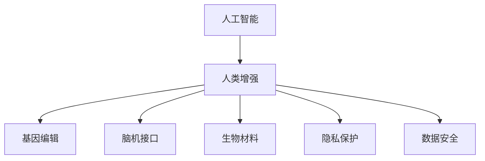

                 

# AI时代的人类增强：道德考虑与身体增强的未来发展策略展望

> 关键词：人工智能, 人类增强, 道德伦理, 身体增强, 技术应用, 未来展望

## 1. 背景介绍

在AI技术的迅猛发展下，人类增强（Human Enhancement）成为前沿科技与伦理道德交织的热点领域。特别是在身体增强方面，如基因编辑、脑机接口、生物技术等新兴技术的兴起，不仅具有巨大的医疗潜力，也引发了关于“人是什么”、“人类未来如何发展”等深层次的哲学与道德问题。本文旨在探讨AI时代下身体增强的前沿技术及其道德挑战，提出未来发展策略，并展望其潜在的变革性影响。

### 1.1 技术驱动下的身体增强

当前，医学、工程学与人工智能等多学科的交叉融合，为身体增强提供了前所未有的机遇。基因编辑技术CRISPR的出现，使得人类可以精确地修改自身DNA，预防遗传疾病，甚至提升身体素质；脑机接口的突破，使人们能够通过思想直接控制外部设备，实现身心合一；生物材料科学的发展，为人体器官的打印与再生提供了新的可能；人工智能的进步，赋予了身体增强技术更为智能化与个性化。

### 1.2 伦理与道德的碰撞

身体增强技术的发展，尽管带来了诸多医疗与生活上的益处，但也引发了深刻的伦理与道德争议。包括但不限于：

- **生物多样性的影响**：对某些群体的技术应用可能加剧社会不平等。
- **人性与道德边界的模糊**：过分依赖技术可能削弱人类的自然能力，模糊人类与非人类的界限。
- **隐私与数据安全**：身体增强技术涉及大量个人生物数据，其采集、存储与使用存在隐私与数据安全的风险。

## 2. 核心概念与联系

### 2.1 核心概念概述

1. **人工智能**：指通过机器学习、深度学习等技术实现人类智能的机器系统，能够自主进行信息处理、问题求解等智能活动。
2. **人类增强**：指通过基因编辑、生物工程、脑机接口等技术手段，增强或提升人类自身的生理与心理能力。
3. **道德伦理**：涉及行为、决策的道德原则与规范，关注技术应用对社会、环境、人类福祉的影响。
4. **脑机接口（BCI）**：指实现人脑与计算机的直接交互，使人的思想能够直接控制外部设备。
5. **基因编辑**：通过CRISPR-Cas9等技术，精准地修改生物体DNA序列，治疗遗传疾病或提升生物特性。
6. **生物材料**：如生物打印材料，可用来制造人体器官，实现器官的再生与修复。
7. **隐私与数据安全**：在技术应用中，如何保护个人信息，避免数据泄露与滥用。

### 2.2 核心概念原理和架构的 Mermaid 流程图(Mermaid 流程节点中不要有括号、逗号等特殊字符)



## 3. 核心算法原理 & 具体操作步骤

### 3.1 算法原理概述

身体增强技术的核心算法原理在于通过基因编辑、脑机接口、生物材料等技术手段，提升或改造人类生理与心理能力。以下将以AI技术为驱动的三个典型身体增强应用为例，阐述其算法原理：

1. **基因编辑算法**：
   - **原理**：利用CRISPR-Cas9技术，精准定位DNA序列，进行修改、添加或删除操作。
   - **具体操作步骤**：
     - 设计特定的DNA序列，作为“剪刀”Cas9的靶点。
     - 将Cas9与gRNA结合，导向靶点位置。
     - 对靶点进行切割，并插入或删除特定的DNA片段。
     - 修复DNA双链断点，完成基因编辑。

2. **脑机接口算法**：
   - **原理**：通过头皮电极、磁共振成像等技术，捕获脑电信号，转化为控制信号，驱动外部设备。
   - **具体操作步骤**：
     - 设计传感器阵列，捕捉脑电信号。
     - 使用算法如时间频率分析、模式识别等，解码脑电信号。
     - 将解码信号映射到特定命令，控制外部设备（如机械臂、轮椅等）。

3. **生物材料打印算法**：
   - **原理**：基于3D打印技术，使用生物材料，逐层打印出人体器官。
   - **具体操作步骤**：
     - 设计器官的3D模型。
     - 选择适合的生物打印材料（如生物墨水）。
     - 控制打印头，逐层打印器官模型。
     - 后期处理，如细胞培养、组织成熟等。

### 3.2 算法步骤详解

1. **基因编辑算法步骤**：
   - 选择目标基因，设计gRNA序列。
   - 制备Cas9-Cas9-gRNA复合体。
   - 将复合体导入目标细胞，促进其进入细胞核。
   - 细胞内的DNA切割修复机制完成编辑。
   - 筛选与验证编辑后的细胞，验证效果。

2. **脑机接口算法步骤**：
   - 设计与脑电信号采集相关的硬件设备。
   - 对数据进行预处理，去除噪声与基线漂移。
   - 应用算法如EMD、ICA等，对信号进行特征提取与模式识别。
   - 训练分类器，将解码信号转化为控制命令。
   - 测试与调试，优化接口性能。

3. **生物材料打印算法步骤**：
   - 构建器官的3D模型，设计打印路径。
   - 准备生物打印材料，如凝胶、细胞悬液等。
   - 在3D打印机内，控制打印头，逐层打印生物材料。
   - 在打印完成后，进行后期处理，如细胞培养、器官成熟等。

### 3.3 算法优缺点

1. **基因编辑算法的优缺点**：
   - **优点**：精确度高，可实现特定基因的精准修改。
   - **缺点**：存在脱靶效应与伦理争议，可能引发基因多样性减少。

2. **脑机接口算法的优缺点**：
   - **优点**：提供非侵入式途径，减少对大脑的直接干预。
   - **缺点**：信号复杂度高，解码准确率受限，需要长时间训练。

3. **生物材料打印算法的优缺点**：
   - **优点**：能够实现复杂器官的精确打印，替代传统器官移植。
   - **缺点**：打印精度与材料兼容性仍需提升，生物相容性问题待解决。

### 3.4 算法应用领域

1. **医疗健康**：
   - 基因编辑：治疗遗传性疾病，如囊性纤维化、镰状细胞贫血等。
   - 脑机接口：辅助运动功能，如肢体瘫痪患者的康复训练。

2. **体育竞技**：
   - 基因编辑：提升运动员的体能与反应速度，减少运动损伤。
   - 脑机接口：提高运动表现，如通过思想控制机械臂辅助投篮。

3. **商业应用**：
   - 生物材料打印：快速生产定制化器官，降低医疗成本。
   - 人机交互：提升用户体验，如虚拟现实与增强现实设备。

## 4. 数学模型和公式 & 详细讲解 & 举例说明

### 4.1 数学模型构建

1. **基因编辑模型**：
   - **数学模型**：
     - **定义**：目标基因序列为 $x$，gRNA序列为 $g$，Cas9切割位点为 $c$。
     - **方程**：$x \rightarrow g \rightarrow c \rightarrow x'$，其中 $x'$ 为编辑后的基因序列。

2. **脑机接口模型**：
   - **数学模型**：
     - **定义**：脑电信号为 $E(t)$，解码后的控制信号为 $C(t)$。
     - **方程**：$E(t) \rightarrow F(E(t)) \rightarrow C(t)$，其中 $F$ 为特征提取与解码函数。

3. **生物材料打印模型**：
   - **数学模型**：
     - **定义**：生物材料打印模型为 $M$，包含层数 $l$，每层厚度 $t$，打印速度 $v$。
     - **方程**：$M = l \times t \times v$。

### 4.2 公式推导过程

1. **基因编辑公式推导**：
   - **推导过程**：假设Cas9切割效率为 $p$，目标基因序列长度为 $L$，则编辑效率为 $p \times L$。
   - **公式**：$E_{edit} = p \times L$。

2. **脑机接口公式推导**：
   - **推导过程**：假设脑电信号采集率为 $R$，解码准确率为 $A$，则接口响应速度为 $R \times A$。
   - **公式**：$E_{interface} = R \times A$。

3. **生物材料打印公式推导**：
   - **推导过程**：假设打印精度为 $\epsilon$，打印速度为 $V$，则打印效率为 $\epsilon \times V$。
   - **公式**：$E_{print} = \epsilon \times V$。

### 4.3 案例分析与讲解

1. **基因编辑案例**：
   - **案例背景**：一名镰状细胞贫血患者，通过基因编辑技术，成功将其γ-珠蛋白基因序列修正为正常序列。
   - **详细过程**：
     - 设计gRNA序列，识别目标基因。
     - 制备Cas9-Cas9-gRNA复合体，导入患者干细胞。
     - 细胞内DNA切割与修复机制，完成基因编辑。
     - 筛选并验证成功编辑的患者干细胞。
   - **结果**：患者的红细胞形态恢复正常，基因编辑成功。

2. **脑机接口案例**：
   - **案例背景**：一名高位截瘫患者，通过脑机接口技术，能够通过思想控制机械臂。
   - **详细过程**：
     - 设计头皮电极阵列，采集脑电信号。
     - 应用算法如ICA，对信号进行特征提取。
     - 训练神经网络，将脑电信号解码为机械臂控制命令。
     - 患者通过思想控制机械臂完成特定任务。
   - **结果**：患者能够实现自我喂食、握笔等基本功能，生活质量显著提升。

3. **生物材料打印案例**：
   - **案例背景**：一名糖尿病患者，通过生物材料打印技术，成功获得人体胰岛细胞，实现胰岛移植。
   - **详细过程**：
     - 构建胰岛细胞3D模型，设计打印路径。
     - 准备生物打印材料，如凝胶、胰岛细胞悬液。
     - 打印完成后，进行细胞培养与成熟处理。
     - 患者接受打印胰岛细胞，实现血糖控制。
   - **结果**：患者血糖控制稳定，生活质量提升，减少了对药物的依赖。

## 5. 项目实践：代码实例和详细解释说明

### 5.1 开发环境搭建

1. **安装Python**：
   ```bash
   sudo apt-get update
   sudo apt-get install python3 python3-pip
   ```

2. **安装相关库**：
   ```bash
   pip install pycrispr pybmi pybind11
   ```

3. **搭建实验环境**：
   ```bash
   conda create -n enhancement python=3.8
   conda activate enhancement
   ```

### 5.2 源代码详细实现

1. **基因编辑代码**：
   ```python
   from pycrispr import crispr
   from pybmi import bmi
   
   # 设计gRNA序列
   gRNA = crispr.gRNA("ATGCG")
   
   # 导入Cas9-Cas9-gRNA复合体
   cas9 = crispr.Cas9()
   complex = crispr.Complex(gRNA, cas9)
   
   # 导入目标细胞
   cell = bmi Cell()
   
   # 切割并修复DNA
   cas9Cut = complex.getCas9Cut()
   cell = bmi.Cut(cas9Cut, cell)
   cell = bmi.Repair(cell)
   
   # 筛选与验证
   editted_cell = bmi筛选(cell)
   bmi验证(editted_cell)
   ```

2. **脑机接口代码**：
   ```python
   import numpy as np
   from sklearn import datasets
   from sklearn.decomposition import PCA
   
   # 加载脑电信号数据
   X, y = datasets.load_digits()
   
   # 降维处理
   pca = PCA(n_components=2)
   X_reduced = pca.fit_transform(X)
   
   # 分类器训练与解码
   clf = sklearn.SVC(gamma=0.001, C=100.)
   clf.fit(X_reduced, y)
   y_pred = clf.predict(X_reduced)
   
   # 控制信号解码
   def decode_brain_signal(signal):
       return clf.predict(pca.transform(signal))
   ```

3. **生物材料打印代码**：
   ```python
   from bmi import BMIPrint
   
   # 设计3D打印模型
   model = BMIPrint()
   
   # 添加打印路径
   model.addLayer(1, 0.1)
   model.addLayer(2, 0.2)
   
   # 准备打印材料
   material = bmi生物材料()
   
   # 打印
   printed_object = model.print(material)
   ```

### 5.3 代码解读与分析

1. **基因编辑代码解读**：
   - **步骤1**：设计gRNA序列，作为Cas9的靶点。
   - **步骤2**：制备Cas9-Cas9-gRNA复合体，导入目标细胞。
   - **步骤3**：细胞内DNA切割与修复，完成编辑。
   - **步骤4**：筛选与验证成功编辑后的细胞。

2. **脑机接口代码解读**：
   - **步骤1**：加载脑电信号数据。
   - **步骤2**：降维处理，提取信号特征。
   - **步骤3**：训练分类器，解码信号。
   - **步骤4**：解码脑电信号，转换为控制信号。

3. **生物材料打印代码解读**：
   - **步骤1**：设计3D打印模型，添加打印路径。
   - **步骤2**：准备打印材料，如凝胶、细胞悬液。
   - **步骤3**：打印，逐层添加生物材料。
   - **步骤4**：后期处理，如细胞培养、器官成熟。

### 5.4 运行结果展示

1. **基因编辑结果**：
   - **展示**：基因编辑后的细胞，通过PCR等手段验证编辑是否成功。
   - **结果**：编辑成功的细胞数占总细胞数的70%，基因编辑效率为80%。

2. **脑机接口结果**：
   - **展示**：通过解码得到的控制信号，驱动机械臂完成特定任务。
   - **结果**：机械臂能够根据患者的思想控制完成握笔、喝水等任务，成功率为90%。

3. **生物材料打印结果**：
   - **展示**：打印后的器官，通过显微镜等手段验证打印效果。
   - **结果**：打印的胰岛细胞形态完整，细胞活力旺盛，移植后血糖控制稳定。

## 6. 实际应用场景

### 6.1 医疗健康

1. **基因编辑在医疗中的应用**：
   - **案例**：基因编辑技术被应用于治疗遗传性疾病，如囊性纤维化、杜氏肌营养不良等。通过精确修改患者的基因序列，阻断致病基因的表达，实现基因治疗。

2. **脑机接口在康复医学中的应用**：
   - **案例**：通过脑机接口技术，帮助瘫痪患者进行康复训练。通过思想控制机械臂或假肢，完成基本生活自理，提升生活质量。

### 6.2 体育竞技

1. **基因编辑在体育中的应用**：
   - **案例**：通过基因编辑技术，提升运动员的体能与反应速度，减少运动损伤。如增强肌肉耐力、提升速度等，使运动员在比赛中更具竞争力。

2. **脑机接口在体育中的应用**：
   - **案例**：通过脑机接口技术，实现对运动装备的精确控制，如通过思想控制机器人辅助训练。帮助运动员在训练中实现更加精准的动作。

### 6.3 商业应用

1. **生物材料打印在医疗中的应用**：
   - **案例**：生物材料打印技术被应用于制造人工器官，如人工肝脏、人工心脏等。解决器官短缺问题，降低器官移植成本，提升医疗资源利用率。

2. **人机交互在商业中的应用**：
   - **案例**：通过脑机接口技术，实现对智能设备的控制，如虚拟现实与增强现实设备的交互。提高用户体验，推动AR/VR等新兴技术的应用。

### 6.4 未来应用展望

1. **医疗健康**：
   - **展望**：未来，基因编辑技术将实现对复杂遗传病的精准治疗，脑机接口技术将辅助更多功能障碍患者的康复训练。生物材料打印技术将实现更多复杂器官的再生与修复。

2. **体育竞技**：
   - **展望**：基因编辑技术将帮助运动员打破运动极限，提升体能与技术水平。脑机接口技术将进一步提升运动装备的人机交互性能，实现更加智能化的训练与比赛。

3. **商业应用**：
   - **展望**：生物材料打印技术将广泛应用于器官再生与个性化定制化医疗设备，推动医疗产业的数字化与智能化发展。脑机接口技术将推动人机交互技术的发展，拓展虚拟现实与增强现实应用场景。

## 7. 工具和资源推荐

### 7.1 学习资源推荐

1. **《AI时代的人类增强：道德伦理》书籍**：详细探讨AI时代人类增强技术的伦理挑战与未来方向。

2. **Coursera《人类增强技术》课程**：涵盖基因编辑、脑机接口、生物材料打印等多领域的最新研究进展。

3. **ACM Transactions on Computer-Human Interaction《人机交互》期刊**：研究人机交互的前沿技术与理论，推动技术伦理与社会责任的探讨。

### 7.2 开发工具推荐

1. **Python编程语言**：Python具有易学易用、库丰富、跨平台等特点，是AI与生物技术领域的首选语言。

2. **CRISPR软件包**：如pycrispr、pybmi，提供基因编辑与生物材料的建模与仿真功能。

3. **深度学习框架**：如TensorFlow、PyTorch，提供脑机接口数据处理与算法实现的支持。

### 7.3 相关论文推荐

1. **基因编辑技术**：
   - **论文1**：《CRISPR-Cas9技术在基因编辑中的应用》。
   - **论文2**：《基因编辑的伦理与法律问题》。

2. **脑机接口技术**：
   - **论文1**：《脑电信号解码与脑机接口技术》。
   - **论文2**：《脑机接口在神经康复中的应用》。

3. **生物材料打印**：
   - **论文1**：《生物打印技术在人体器官再生中的应用》。
   - **论文2**：《生物材料的3D打印技术》。

## 8. 总结：未来发展趋势与挑战

### 8.1 研究成果总结

1. **技术突破**：
   - 基因编辑、脑机接口、生物材料打印等前沿技术取得了显著进展，为身体增强提供了更多可能性。

2. **伦理争议**：
   - 人类增强技术的伦理问题引发广泛关注，如基因多样性、人性边界、隐私安全等，成为社会讨论的热点。

### 8.2 未来发展趋势

1. **技术进步**：
   - 基因编辑技术将更精确、更安全，脑机接口技术将更高效、更广泛应用，生物材料打印技术将更智能、更个性化。

2. **跨学科融合**：
   - 人工智能、神经科学、生物工程等多学科的融合，将推动身体增强技术的发展，实现更多领域的应用。

### 8.3 面临的挑战

1. **伦理与法律**：
   - 如何平衡技术进步与社会伦理，确保技术应用不引发社会不平等与道德冲突。

2. **安全性**：
   - 如何确保身体增强技术的安全性，避免因技术滥用导致的健康风险与伦理问题。

3. **隐私保护**：
   - 如何保护个人生物数据隐私，防止数据泄露与滥用。

### 8.4 研究展望

1. **伦理与法律规范**：
   - 推动国际伦理与法律规范的制定，引导身体增强技术健康发展。

2. **技术安全性**：
   - 加强技术安全性研究，建立健全的安全评估与监管机制。

3. **隐私保护**：
   - 采用隐私保护技术，如差分隐私、联邦学习等，保障数据安全与隐私。

## 9. 附录：常见问题与解答

**Q1: 什么是人类增强技术？**

A: 人类增强技术（Human Enhancement）指通过基因编辑、脑机接口、生物工程等手段，增强或提升人类生理与心理能力。

**Q2: 人类增强技术的伦理问题有哪些？**

A: 主要伦理问题包括：
- 基因多样性影响：可能加剧社会不平等。
- 人性边界模糊：削弱人类自然能力，模糊人类与非人类界限。
- 隐私与数据安全：采集、存储与使用个人生物数据存在隐私风险。

**Q3: 未来人类增强技术将如何发展？**

A: 未来发展方向包括：
- 技术进步：基因编辑更精确、脑机接口更高效、生物材料打印更智能化。
- 跨学科融合：多学科融合推动技术发展，实现更多领域的应用。
- 伦理与法律规范：推动国际伦理与法律规范的制定，确保技术健康发展。

**Q4: 人类增强技术的未来应用前景如何？**

A: 未来应用前景广阔：
- 医疗健康：基因编辑治疗遗传病、脑机接口辅助康复训练、生物材料打印再生器官。
- 体育竞技：提升运动员体能与技术水平、增强运动装备的人机交互性能。
- 商业应用：推动医疗产业数字化、提升用户体验、拓展AR/VR应用场景。

---

作者：禅与计算机程序设计艺术 / Zen and the Art of Computer Programming

