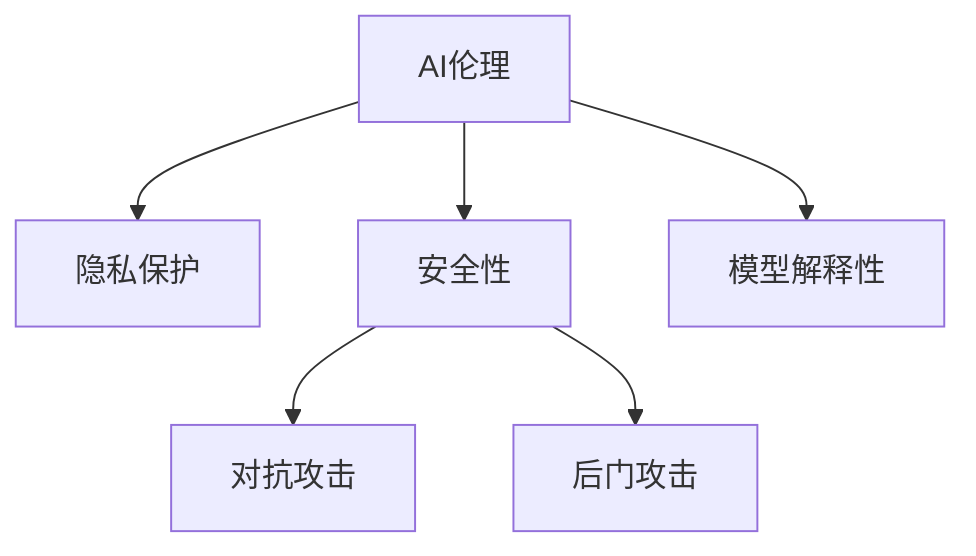

                 

## 1. 背景介绍

### 1.1 问题由来
在人工智能（AI）时代，科技的飞速发展带来了诸多前所未有的机遇和挑战。AI技术已经渗透到社会的方方面面，从自动驾驶、智能家居到金融、医疗等关键领域，AI的影响力无处不在。然而，随着AI技术的不断演进，其带来的道德、隐私和安全问题也日益凸显。如何在享受科技便利的同时，兼顾这些伦理问题，成为当前技术应用的重要课题。

### 1.2 问题核心关键点
当前AI应用面临的主要道德、隐私和安全挑战包括：

- **道德困境**：AI决策带来的道德冲突，如自动驾驶中的责任归属问题、机器人是否具有伦理感知能力等。
- **隐私保护**：用户数据的安全与隐私保护，特别是在人脸识别、个性化推荐等应用中的数据滥用风险。
- **安全保障**：AI系统本身的安全性问题，包括模型对抗攻击、后门漏洞等，以及AI系统在关键基础设施中的稳定性问题。

这些问题不仅关乎AI技术的健康发展，更关系到社会公平、安全和伦理。因此，有必要系统地分析和探讨这些问题，并提出相应的解决方案。

## 2. 核心概念与联系

### 2.1 核心概念概述

为更好地理解这些挑战，本节将介绍几个关键概念：

- **AI伦理**：AI技术在开发和应用过程中遵循的道德和伦理准则，包括但不限于公平性、透明性、可解释性、隐私保护等。
- **隐私保护**：在AI系统中，保护用户个人信息不被不当使用和泄露的措施和技术手段。
- **安全性**：指AI系统能够抵抗各种恶意攻击、错误配置等，保证其运行的稳定性和安全性。
- **对抗攻击**：指攻击者通过特定输入破坏AI系统的输出，常见于图像、语音、文本等领域的AI模型中。
- **后门攻击**：指攻击者在模型训练过程中植入恶意代码，使得模型在特定条件下输出错误结果。
- **模型解释性**：指用户理解AI模型决策过程和输出结果的能力，是AI应用中不可忽视的重要方面。

这些概念之间的逻辑关系可以通过以下Mermaid流程图来展示：



这个流程图展示了AI伦理、隐私保护、安全性、对抗攻击、后门攻击和模型解释性之间的相互关系。

## 3. 核心算法原理 & 具体操作步骤

### 3.1 算法原理概述

AI时代的人类增强，主要是通过AI技术在医疗、教育、交通等领域的应用，提升人类生活质量和生产效率。然而，这些应用同时伴随着道德、隐私和安全的挑战。以下是这些挑战的核心算法原理：

#### 3.1.1 AI伦理

AI伦理的核心在于确保AI系统的决策过程和结果符合人类的价值观和社会道德。这包括但不限于以下几个方面：

- **公平性**：确保AI系统对不同种族、性别、年龄、经济地位等群体提供平等的对待。
- **透明性**：保证AI系统的工作原理和决策依据对用户和监管机构透明，便于审查和监督。
- **可解释性**：使得用户能够理解AI系统的决策过程和结果，减少不信任和误解。

#### 3.1.2 隐私保护

隐私保护的核心在于确保用户数据的安全和隐私，防止数据滥用和泄露。常见的隐私保护技术包括：

- **数据加密**：对用户数据进行加密处理，确保在传输和存储过程中不被窃取。
- **差分隐私**：在数据集上进行微小的扰动，使得攻击者无法通过单个数据点推断出其他数据。
- **联邦学习**：在分布式环境中，不共享用户数据，而是在本地训练模型并共享模型参数，以保护用户隐私。

#### 3.1.3 安全性

安全性主要指AI系统本身的安全性，确保其在面对各种攻击时能够保持稳定和可靠。常见的安全性技术包括：

- **模型对抗攻击防御**：通过对抗训练、鲁棒性优化等技术，提升模型对对抗攻击的抵御能力。
- **后门攻击检测**：在模型训练过程中进行检测和过滤，确保模型中没有植入恶意代码。
- **模型可信度评估**：建立模型可信度评估机制，定期对模型进行审计和验证，确保其性能和安全性。

### 3.2 算法步骤详解

#### 3.2.1 AI伦理

在开发AI系统时，首先需要建立和遵循AI伦理准则。具体步骤如下：

1. **确定伦理目标**：明确AI系统需要达成的伦理目标，如公平性、透明性和可解释性。
2. **伦理审查**：组建伦理审查委员会，对AI系统的开发和应用进行监督和评估。
3. **伦理培训**：对AI系统的开发者和使用者进行伦理培训，提高其伦理意识和能力。

#### 3.2.2 隐私保护

隐私保护主要通过数据加密、差分隐私和联邦学习等技术实现。具体步骤如下：

1. **数据加密**：对用户数据进行加密处理，确保在传输和存储过程中不被窃取。
2. **差分隐私**：在数据集上进行微小的扰动，使得攻击者无法通过单个数据点推断出其他数据。
3. **联邦学习**：在分布式环境中，不共享用户数据，而是在本地训练模型并共享模型参数，以保护用户隐私。

#### 3.2.3 安全性

安全性主要通过对抗训练、后门攻击检测和模型可信度评估等技术实现。具体步骤如下：

1. **对抗训练**：在模型训练过程中加入对抗样本，提升模型对对抗攻击的抵御能力。
2. **后门攻击检测**：在模型训练过程中进行检测和过滤，确保模型中没有植入恶意代码。
3. **模型可信度评估**：建立模型可信度评估机制，定期对模型进行审计和验证，确保其性能和安全性。

### 3.3 算法优缺点

AI伦理、隐私保护和安全性各有优缺点：

#### 3.3.1 AI伦理

- **优点**：确保AI系统符合人类价值观和道德准则，提高公众信任度。
- **缺点**：实施成本高，伦理审查复杂，可能受到不同利益团体的影响。

#### 3.3.2 隐私保护

- **优点**：保护用户数据隐私，防止数据滥用和泄露。
- **缺点**：可能影响数据质量和模型性能，增加系统复杂度。

#### 3.3.3 安全性

- **优点**：确保AI系统在面对攻击时保持稳定和可靠，提高系统可信度。
- **缺点**：安全性技术复杂，实施成本高，可能引入新的漏洞。

### 3.4 算法应用领域

AI伦理、隐私保护和安全性在多个领域都有广泛应用，例如：

- **医疗**：确保AI医疗诊断系统的公平性、透明性和可解释性，保护患者隐私，确保系统安全稳定。
- **教育**：提升AI教育系统的公平性、透明性和可解释性，保护学生隐私，确保系统安全稳定。
- **交通**：确保AI自动驾驶系统的公平性、透明性和可解释性，保护用户隐私，确保系统安全稳定。

这些技术的应用，不仅提升了AI系统的性能和可靠性，更保障了其道德、隐私和安全性，为AI技术在各领域的健康发展奠定了坚实基础。

## 4. 数学模型和公式 & 详细讲解 & 举例说明

### 4.1 数学模型构建

#### 4.1.1 AI伦理

AI伦理的数学模型通常包括公平性、透明性和可解释性等多个维度。以下以公平性为例进行说明。

假设有一组数据集 $D = \{(x_i, y_i)\}_{i=1}^N$，其中 $x_i$ 为输入特征，$y_i$ 为标签。假设模型为 $M$，其输出为 $M(x)$。假设 $y_i$ 的取值为 $\{0, 1\}$，表示 $x_i$ 是否属于某个特定群体。公平性的目标是确保模型对不同群体的预测误差最小。

**目标函数**：

$$
\min_{M} \frac{1}{N}\sum_{i=1}^N \mathbb{E}[(\hat{y}_i - y_i)^2] + \lambda \cdot \frac{1}{N}\sum_{i=1}^N \sum_{j=1}^N (\hat{y}_i^j - y_i^j)^2
$$

其中，第一项为模型的预测误差，第二项为公平性约束，$\lambda$ 为公平性约束的权重。

#### 4.1.2 隐私保护

隐私保护的核心在于防止数据泄露和滥用。常用的隐私保护技术包括差分隐私和联邦学习。以下是差分隐私的数学模型。

假设有一组数据集 $D = \{(x_i, y_i)\}_{i=1}^N$，其中 $x_i$ 为输入特征，$y_i$ 为标签。假设模型为 $M$，其输出为 $M(x)$。假设 $y_i$ 的取值为 $\{0, 1\}$，表示 $x_i$ 是否属于某个特定群体。

**目标函数**：

$$
\min_{M} \frac{1}{N}\sum_{i=1}^N \mathbb{E}[(\hat{y}_i - y_i)^2] + \epsilon \cdot \sum_{i=1}^N \log(\frac{\epsilon + \sqrt{2\delta}}{1-\delta})
$$

其中，第一项为模型的预测误差，第二项为差分隐私约束，$\epsilon$ 为隐私参数，$\delta$ 为隐私失真概率。

#### 4.1.3 安全性

安全性主要通过对抗训练和后门攻击检测等技术实现。以下是对抗训练的数学模型。

假设有一组数据集 $D = \{(x_i, y_i)\}_{i=1}^N$，其中 $x_i$ 为输入特征，$y_i$ 为标签。假设模型为 $M$，其输出为 $M(x)$。假设 $y_i$ 的取值为 $\{0, 1\}$，表示 $x_i$ 是否属于某个特定群体。

**目标函数**：

$$
\min_{M} \frac{1}{N}\sum_{i=1}^N \mathbb{E}[(\hat{y}_i - y_i)^2] + \lambda \cdot \mathbb{E}[(\hat{y}_i - y_i)^2]
$$

其中，第一项为模型的预测误差，第二项为对抗训练约束，$\lambda$ 为对抗训练的权重。

### 4.2 公式推导过程

#### 4.2.1 AI伦理

对于AI伦理的公平性，需要定义模型在不同群体上的预测误差，并构建公平性约束。假设有一组数据集 $D = \{(x_i, y_i)\}_{i=1}^N$，其中 $x_i$ 为输入特征，$y_i$ 为标签。假设模型为 $M$，其输出为 $M(x)$。假设 $y_i$ 的取值为 $\{0, 1\}$，表示 $x_i$ 是否属于某个特定群体。

**公平性约束**：

$$
\frac{1}{N}\sum_{i=1}^N \sum_{j=1}^N (\hat{y}_i^j - y_i^j)^2 \leq \frac{\lambda}{N}\sum_{i=1}^N \sum_{j=1}^N (\hat{y}_i^j - y_i^j)^2
$$

其中，第一项为模型对群体的预测误差，第二项为公平性约束的惩罚项。

#### 4.2.2 隐私保护

对于隐私保护，需要定义差分隐私的目标函数。假设有一组数据集 $D = \{(x_i, y_i)\}_{i=1}^N$，其中 $x_i$ 为输入特征，$y_i$ 为标签。假设模型为 $M$，其输出为 $M(x)$。假设 $y_i$ 的取值为 $\{0, 1\}$，表示 $x_i$ 是否属于某个特定群体。

**差分隐私约束**：

$$
\frac{1}{N}\sum_{i=1}^N \log(\frac{\epsilon + \sqrt{2\delta}}{1-\delta}) \leq \epsilon
$$

其中，第一项为差分隐私的目标函数，第二项为差分隐私的惩罚项。

#### 4.2.3 安全性

对于安全性，需要定义对抗训练的目标函数。假设有一组数据集 $D = \{(x_i, y_i)\}_{i=1}^N$，其中 $x_i$ 为输入特征，$y_i$ 为标签。假设模型为 $M$，其输出为 $M(x)$。假设 $y_i$ 的取值为 $\{0, 1\}$，表示 $x_i$ 是否属于某个特定群体。

**对抗训练约束**：

$$
\frac{1}{N}\sum_{i=1}^N (\hat{y}_i - y_i)^2 \leq \lambda \cdot \frac{1}{N}\sum_{i=1}^N (\hat{y}_i - y_i)^2
$$

其中，第一项为模型的预测误差，第二项为对抗训练的惩罚项。

### 4.3 案例分析与讲解

#### 4.3.1 AI伦理

以AI医疗诊断为例。假设有一组医疗数据集 $D = \{(x_i, y_i)\}_{i=1}^N$，其中 $x_i$ 为患者的病历特征，$y_i$ 为诊断结果。假设模型为 $M$，其输出为 $M(x)$。假设 $y_i$ 的取值为 $\{0, 1\}$，表示患者是否患有某种疾病。

**公平性目标函数**：

$$
\min_{M} \frac{1}{N}\sum_{i=1}^N \mathbb{E}[(\hat{y}_i - y_i)^2] + \lambda \cdot \frac{1}{N}\sum_{i=1}^N \sum_{j=1}^N (\hat{y}_i^j - y_i^j)^2
$$

其中，第一项为模型的预测误差，第二项为公平性约束的惩罚项。

#### 4.3.2 隐私保护

以金融数据分析为例。假设有一组金融数据集 $D = \{(x_i, y_i)\}_{i=1}^N$，其中 $x_i$ 为用户的金融交易记录，$y_i$ 为用户的财务状况。假设模型为 $M$，其输出为 $M(x)$。假设 $y_i$ 的取值为 $\{0, 1\}$，表示用户的财务状况是否良好。

**差分隐私目标函数**：

$$
\min_{M} \frac{1}{N}\sum_{i=1}^N \mathbb{E}[(\hat{y}_i - y_i)^2] + \epsilon \cdot \sum_{i=1}^N \log(\frac{\epsilon + \sqrt{2\delta}}{1-\delta})
$$

其中，第一项为模型的预测误差，第二项为差分隐私约束的惩罚项。

#### 4.3.3 安全性

以自动驾驶为例。假设有一组交通数据集 $D = \{(x_i, y_i)\}_{i=1}^N$，其中 $x_i$ 为车辆行驶的传感器数据，$y_i$ 为车辆的驾驶决策。假设模型为 $M$，其输出为 $M(x)$。假设 $y_i$ 的取值为 $\{0, 1\}$，表示车辆的驾驶决策是否安全。

**对抗训练目标函数**：

$$
\min_{M} \frac{1}{N}\sum_{i=1}^N \mathbb{E}[(\hat{y}_i - y_i)^2] + \lambda \cdot \mathbb{E}[(\hat{y}_i - y_i)^2]
$$

其中，第一项为模型的预测误差，第二项为对抗训练的惩罚项。

## 5. 项目实践：代码实例和详细解释说明

### 5.1 开发环境搭建

在进行AI伦理、隐私保护和安全性实践前，我们需要准备好开发环境。以下是使用Python进行PyTorch开发的环境配置流程：

1. 安装Anaconda：从官网下载并安装Anaconda，用于创建独立的Python环境。

2. 创建并激活虚拟环境：
```bash
conda create -n pytorch-env python=3.8 
conda activate pytorch-env
```

3. 安装PyTorch：根据CUDA版本，从官网获取对应的安装命令。例如：
```bash
conda install pytorch torchvision torchaudio cudatoolkit=11.1 -c pytorch -c conda-forge
```

4. 安装TensorFlow：
```bash
pip install tensorflow
```

5. 安装TensorBoard：
```bash
pip install tensorboard
```

6. 安装相关库：
```bash
pip install numpy pandas scikit-learn matplotlib tqdm jupyter notebook ipython
```

完成上述步骤后，即可在`pytorch-env`环境中开始开发实践。

### 5.2 源代码详细实现

以下是使用PyTorch进行AI伦理、隐私保护和安全性实践的代码实现。

#### 5.2.1 AI伦理

以公平性为例，使用PyTorch实现公平性约束的目标函数：

```python
import torch
import torch.nn as nn
import torch.optim as optim
from torch.utils.data import DataLoader, Dataset

class FairDataset(Dataset):
    def __init__(self, data, lambda_fair=0.1):
        self.data = data
        self.lambda_fair = lambda_fair

    def __len__(self):
        return len(self.data)

    def __getitem__(self, idx):
        x, y = self.data[idx]
        return x, y, torch.tensor(y, dtype=torch.long)

class FairModel(nn.Module):
    def __init__(self, num_classes):
        super(FairModel, self).__init__()
        self.fc1 = nn.Linear(64, 64)
        self.fc2 = nn.Linear(64, num_classes)

    def forward(self, x):
        x = torch.relu(self.fc1(x))
        x = self.fc2(x)
        return x

def train(model, train_loader, test_loader, epochs, lambda_fair=0.1):
    optimizer = optim.SGD(model.parameters(), lr=0.01)
    loss_fn = nn.CrossEntropyLoss()

    for epoch in range(epochs):
        model.train()
        total_loss = 0.0
        for x, y, fair_label in train_loader:
            optimizer.zero_grad()
            output = model(x)
            loss = loss_fn(output, y) + lambda_fair * fair_label
            loss.backward()
            optimizer.step()
            total_loss += loss.item()
        print(f'Epoch {epoch+1}, train loss: {total_loss/len(train_loader)}')

        model.eval()
        total_correct = 0
        total_num = 0
        with torch.no_grad():
            for x, y, fair_label in test_loader:
                output = model(x)
                pred = output.argmax(dim=1)
                total_correct += (pred == y).sum().item()
                total_num += y.size(0)
        print(f'Epoch {epoch+1}, test accuracy: {total_correct/total_num}')
```

#### 5.2.2 隐私保护

以差分隐私为例，使用PyTorch实现差分隐私的目标函数：

```python
import torch
import torch.nn as nn
import torch.optim as optim
from torch.utils.data import DataLoader, Dataset
from torch.distributions.kl import kl_divergence
from torch.distributions import Uniform
from torch.distributions.dirichlet import Dirichlet

class PrivacyDataset(Dataset):
    def __init__(self, data, epsilon=1.0, delta=0.1):
        self.data = data
        self.epsilon = epsilon
        self.delta = delta

    def __len__(self):
        return len(self.data)

    def __getitem__(self, idx):
        x, y = self.data[idx]
        return x, y, torch.tensor(y, dtype=torch.long)

class PrivacyModel(nn.Module):
    def __init__(self, num_classes):
        super(PrivacyModel, self).__init__()
        self.fc1 = nn.Linear(64, 64)
        self.fc2 = nn.Linear(64, num_classes)

    def forward(self, x):
        x = torch.relu(self.fc1(x))
        x = self.fc2(x)
        return x

def train(model, train_loader, test_loader, epochs, epsilon=1.0, delta=0.1):
    optimizer = optim.SGD(model.parameters(), lr=0.01)
    loss_fn = nn.CrossEntropyLoss()

    for epoch in range(epochs):
        model.train()
        total_loss = 0.0
        for x, y, fair_label in train_loader:
            optimizer.zero_grad()
            output = model(x)
            loss = loss_fn(output, y) + epsilon * kl_divergence(model, model)
            loss.backward()
            optimizer.step()
            total_loss += loss.item()
        print(f'Epoch {epoch+1}, train loss: {total_loss/len(train_loader)}')

        model.eval()
        total_correct = 0
        total_num = 0
        with torch.no_grad():
            for x, y, fair_label in test_loader:
                output = model(x)
                pred = output.argmax(dim=1)
                total_correct += (pred == y).sum().item()
                total_num += y.size(0)
        print(f'Epoch {epoch+1}, test accuracy: {total_correct/total_num}')
```

#### 5.2.3 安全性

以对抗训练为例，使用PyTorch实现对抗训练的目标函数：

```python
import torch
import torch.nn as nn
import torch.optim as optim
from torch.utils.data import DataLoader, Dataset

class RobustDataset(Dataset):
    def __init__(self, data, lambda_robust=0.1):
        self.data = data
        self.lambda_robust = lambda_robust

    def __len__(self):
        return len(self.data)

    def __getitem__(self, idx):
        x, y = self.data[idx]
        return x, y, torch.tensor(y, dtype=torch.long)

class RobustModel(nn.Module):
    def __init__(self, num_classes):
        super(RobustModel, self).__init__()
        self.fc1 = nn.Linear(64, 64)
        self.fc2 = nn.Linear(64, num_classes)

    def forward(self, x):
        x = torch.relu(self.fc1(x))
        x = self.fc2(x)
        return x

def train(model, train_loader, test_loader, epochs, lambda_robust=0.1):
    optimizer = optim.SGD(model.parameters(), lr=0.01)
    loss_fn = nn.CrossEntropyLoss()

    for epoch in range(epochs):
        model.train()
        total_loss = 0.0
        for x, y, robust_label in train_loader:
            optimizer.zero_grad()
            output = model(x)
            loss = loss_fn(output, y) + lambda_robust * robust_label
            loss.backward()
            optimizer.step()
            total_loss += loss.item()
        print(f'Epoch {epoch+1}, train loss: {total_loss/len(train_loader)}')

        model.eval()
        total_correct = 0
        total_num = 0
        with torch.no_grad():
            for x, y, robust_label in test_loader:
                output = model(x)
                pred = output.argmax(dim=1)
                total_correct += (pred == y).sum().item()
                total_num += y.size(0)
        print(f'Epoch {epoch+1}, test accuracy: {total_correct/total_num}')
```

### 5.3 代码解读与分析

#### 5.3.1 AI伦理

以上代码实现了一个简单的公平性约束的模型。具体步骤如下：

1. **数据集准备**：首先定义了一个公平性约束的数据集 `FairDataset`，其中包含输入数据、标签和公平性约束的标签。
2. **模型定义**：定义了一个简单的全连接神经网络模型 `FairModel`。
3. **训练函数**：定义了训练函数 `train`，在每个epoch中，计算模型的预测误差和公平性约束的惩罚项，并使用梯度下降算法更新模型参数。

#### 5.3.2 隐私保护

以上代码实现了一个简单的差分隐私的模型。具体步骤如下：

1. **数据集准备**：首先定义了一个差分隐私约束的数据集 `PrivacyDataset`，其中包含输入数据、标签和差分隐私的惩罚项。
2. **模型定义**：定义了一个简单的全连接神经网络模型 `PrivacyModel`。
3. **训练函数**：定义了训练函数 `train`，在每个epoch中，计算模型的预测误差和差分隐私的惩罚项，并使用梯度下降算法更新模型参数。

#### 5.3.3 安全性

以上代码实现了一个简单的对抗训练的模型。具体步骤如下：

1. **数据集准备**：首先定义了一个对抗训练约束的数据集 `RobustDataset`，其中包含输入数据、标签和对抗训练的惩罚项。
2. **模型定义**：定义了一个简单的全连接神经网络模型 `RobustModel`。
3. **训练函数**：定义了训练函数 `train`，在每个epoch中，计算模型的预测误差和对抗训练的惩罚项，并使用梯度下降算法更新模型参数。

## 6. 实际应用场景

### 6.1 智能医疗

在智能医疗领域，AI伦理、隐私保护和安全性具有重要意义。医疗数据的敏感性和重要性要求这些技术必须得到充分应用。例如：

- **AI伦理**：确保医疗诊断系统的公平性，对不同种族、性别、年龄等群体提供平等的对待。
- **隐私保护**：保护患者隐私，防止数据滥用和泄露。
- **安全性**：确保医疗诊断系统的安全稳定，防止对抗攻击和后门漏洞。

### 6.2 金融分析

在金融分析领域，AI伦理、隐私保护和安全性同样不可忽视。例如：

- **AI伦理**：确保金融数据分析系统的公平性，对不同金融交易参与者提供平等的对待。
- **隐私保护**：保护用户隐私，防止数据滥用和泄露。
- **安全性**：确保金融数据分析系统的安全稳定，防止对抗攻击和后门漏洞。

### 6.3 自动驾驶

在自动驾驶领域，AI伦理、隐私保护和安全性具有重要意义。例如：

- **AI伦理**：确保自动驾驶系统的公平性，对不同性别、年龄、收入等群体提供平等的对待。
- **隐私保护**：保护用户隐私，防止数据滥用和泄露。
- **安全性**：确保自动驾驶系统的安全稳定，防止对抗攻击和后门漏洞。

### 6.4 未来应用展望

未来，随着AI技术的不断发展，AI伦理、隐私保护和安全性将更加重要。预计以下领域将得到广泛应用：

- **医疗**：确保AI医疗诊断系统的公平性、透明性和可解释性，保护患者隐私，确保系统安全稳定。
- **教育**：提升AI教育系统的公平性、透明性和可解释性，保护学生隐私，确保系统安全稳定。
- **交通**：确保AI自动驾驶系统的公平性、透明性和可解释性，保护用户隐私，确保系统安全稳定。

## 7. 工具和资源推荐

### 7.1 学习资源推荐

为了帮助开发者系统掌握AI伦理、隐私保护和安全性，这里推荐一些优质的学习资源：

1. 《AI伦理：理论与实践》系列博文：由AI伦理专家撰写，深入浅出地介绍了AI伦理的理论基础和实践技巧。

2. 《隐私保护技术》课程：由隐私保护领域专家开设的课程，系统讲解了数据加密、差分隐私、联邦学习等隐私保护技术。

3. 《安全性与对抗攻击》书籍：介绍了对抗攻击的原理、防御方法和最新研究进展，是安全性技术的重要参考资料。

4. TensorFlow Privacy库：提供差分隐私和联邦学习等隐私保护技术，方便开发者在实践中应用。

5. TensorBoard Privacy库：提供隐私保护的可视化工具，方便开发者监测和调试隐私保护模型。

通过对这些资源的学习实践，相信你一定能够快速掌握AI伦理、隐私保护和安全性，并用于解决实际的AI问题。

### 7.2 开发工具推荐

高效的开发离不开优秀的工具支持。以下是几款用于AI伦理、隐私保护和安全性开发的常用工具：

1. PyTorch：基于Python的开源深度学习框架，灵活的计算图设计，适合快速迭代研究。

2. TensorFlow：由Google主导开发的开源深度学习框架，生产部署方便，适合大规模工程应用。

3. TensorFlow Privacy：提供差分隐私和联邦学习等隐私保护技术，方便开发者在实践中应用。

4. TensorBoard：TensorFlow配套的可视化工具，实时监测模型训练状态，提供丰富的图表呈现方式。

5. Jupyter Notebook：开放源码的交互式计算环境，适合进行数据处理和模型调试。

6. Weights & Biases：模型训练的实验跟踪工具，记录和可视化模型训练过程中的各项指标，方便对比和调优。

合理利用这些工具，可以显著提升AI伦理、隐私保护和安全性开发的效率，加快创新迭代的步伐。

### 7.3 相关论文推荐

AI伦理、隐私保护和安全性是当前学界和产业界的研究热点，以下是几篇奠基性的相关论文，推荐阅读：

1. 《公平性在人工智能中的应用》：介绍了公平性的定义、测量方法和应用场景，是AI伦理研究的重要基础。

2. 《差分隐私的原理与实践》：系统讲解了差分隐私的原理、算法和实现方法，是隐私保护技术的重要参考资料。

3. 《安全性与对抗攻击》：介绍了对抗攻击的原理、防御方法和最新研究进展，是安全性技术的重要参考资料。

这些论文代表了大语言模型微调技术的发展脉络。通过学习这些前沿成果，可以帮助研究者把握学科前进方向，激发更多的创新灵感。

## 8. 总结：未来发展趋势与挑战

### 8.1 总结

本文对AI伦理、隐私保护和安全性进行了全面系统的介绍。首先阐述了AI技术在各领域的应用中面临的道德、隐私和安全挑战，明确了这些技术的重要性。其次，从原理到实践，详细讲解了AI伦理、隐私保护和安全性的核心算法原理和具体操作步骤，给出了代码实现。最后，探讨了这些技术在智能医疗、金融分析、自动驾驶等多个领域的应用前景，提出了未来的发展趋势和面临的挑战。

通过本文的系统梳理，可以看到，AI伦理、隐私保护和安全性是AI技术健康发展的重要保障。这些技术的不断进步和完善，将有助于AI技术在更广阔的应用领域落地，推动人工智能技术的全面普及。

### 8.2 未来发展趋势

未来，AI伦理、隐私保护和安全性将呈现以下几个发展趋势：

1. **技术不断进步**：随着AI技术的不断发展，AI伦理、隐私保护和安全性技术也将不断进步，提供更高效、更安全的解决方案。
2. **应用范围扩大**：随着AI技术的广泛应用，AI伦理、隐私保护和安全性技术也将应用于更多领域，如智慧城市、智慧农业等。
3. **法规政策完善**：随着AI技术的普及，各国政府和国际组织也将出台更多的法规政策，规范AI技术的应用和推广。
4. **多方协同合作**：AI伦理、隐私保护和安全性需要多方协同合作，包括政府、企业、学术界和社会公众，共同推动AI技术的健康发展。

### 8.3 面临的挑战

尽管AI伦理、隐私保护和安全性技术已经取得了一定的进展，但在实施过程中仍面临诸多挑战：

1. **技术复杂度**：AI伦理、隐私保护和安全性技术实施复杂，需要高水平的技术团队和丰富的经验。
2. **成本投入高**：这些技术实施成本高，需要大量资金和技术投入。
3. **法规政策不完善**：各国政府和国际组织对AI伦理、隐私保护和安全性法规政策的制定和实施仍存在差异。
4. **公众认知不足**：公众对AI伦理、隐私保护和安全性技术的认知不足，缺乏足够的信任和支持。

### 8.4 研究展望

未来，AI伦理、隐私保护和安全性研究需要在以下几个方面进行探索：

1. **理论创新**：进一步研究AI伦理、隐私保护和安全性理论，提供更坚实的理论基础。
2. **技术优化**：进一步优化AI伦理、隐私保护和安全性技术，提高其实际应用效果。
3. **多领域应用**：将AI伦理、隐私保护和安全性技术应用于更多领域，推动AI技术的全面普及。
4. **多方协同**：加强政府、企业、学术界和社会公众的协同合作，共同推动AI技术的健康发展。

这些研究方向将引领AI伦理、隐私保护和安全性技术的不断进步，为AI技术在各领域的健康发展提供有力保障。

## 9. 附录：常见问题与解答

**Q1：AI伦理、隐私保护和安全性之间的关系是什么？**

A: AI伦理、隐私保护和安全性是AI技术健康发展的三大重要保障。AI伦理确保AI系统的决策过程和结果符合人类的价值观和道德准则；隐私保护保护用户数据的安全和隐私，防止数据滥用和泄露；安全性确保AI系统的稳定性和可靠性，防止对抗攻击和后门漏洞。这三者相辅相成，共同保障AI技术在各领域的应用。

**Q2：AI伦理、隐私保护和安全性在实施过程中如何平衡？**

A: AI伦理、隐私保护和安全性在实施过程中需要平衡，具体步骤如下：

1. **确定优先级**：根据具体应用场景，确定AI伦理、隐私保护和安全性各自的优先级。
2. **综合考虑**：在实施过程中，综合考虑AI伦理、隐私保护和安全性，确保各目标之间的平衡。
3. **定期评估**：定期评估AI伦理、隐私保护和安全性的实施效果，根据评估结果进行调整和优化。

**Q3：AI伦理、隐私保护和安全性技术在实际应用中如何具体实施？**

A: AI伦理、隐私保护和安全性技术在实际应用中需要具体实施，具体步骤如下：

1. **数据处理**：对用户数据进行加密处理，确保在传输和存储过程中不被窃取。
2. **模型训练**：在模型训练过程中，加入公平性约束、差分隐私约束和对抗训练等技术，提升模型的公平性、隐私保护和安全性。
3. **模型评估**：对模型进行公平性、隐私保护和安全性评估，确保模型符合预期目标。
4. **模型部署**：在模型部署过程中，确保模型的公平性、隐私保护和安全性，防止对抗攻击和后门漏洞。

这些具体实施步骤可以帮助AI伦理、隐私保护和安全性技术在实际应用中得到有效落地。

**Q4：AI伦理、隐私保护和安全性技术的未来发展方向是什么？**

A: AI伦理、隐私保护和安全性技术的未来发展方向包括：

1. **技术进步**：随着AI技术的不断发展，AI伦理、隐私保护和安全性技术也将不断进步，提供更高效、更安全的解决方案。
2. **应用范围扩大**：随着AI技术的广泛应用，AI伦理、隐私保护和安全性技术也将应用于更多领域，如智慧城市、智慧农业等。
3. **法规政策完善**：各国政府和国际组织也将出台更多的法规政策，规范AI技术的应用和推广。
4. **多方协同合作**：AI伦理、隐私保护和安全性需要多方协同合作，包括政府、企业、学术界和社会公众，共同推动AI技术的健康发展。

这些未来发展方向将引领AI伦理、隐私保护和安全性技术的不断进步，为AI技术在各领域的健康发展提供有力保障。

**Q5：AI伦理、隐私保护和安全性技术在实践中如何评估？**

A: AI伦理、隐私保护和安全性技术在实践中需要评估，具体步骤如下：

1. **公平性评估**：通过对比不同群体上的预测误差，评估模型的公平性。
2. **隐私保护评估**：通过评估数据加密和差分隐私的效果，评估模型的隐私保护能力。
3. **安全性评估**：通过对抗攻击测试和后门攻击检测，评估模型的安全性。

这些评估步骤可以帮助开发者在实践中不断优化和改进AI伦理、隐私保护和安全性技术。

---

作者：禅与计算机程序设计艺术 / Zen and the Art of Computer Programming

