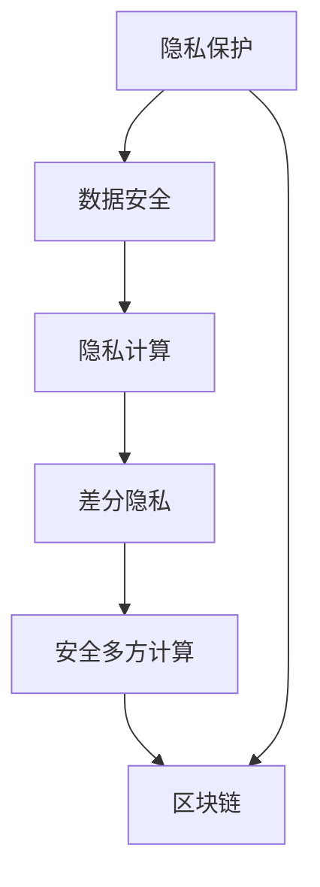

                 

## 1. 背景介绍

在人工智能时代，计算能力的快速提升和数据量的指数级增长，使得人类计算面临前所未有的机遇与挑战。一方面，强大的计算能力推动了大数据、云计算、机器学习等技术的发展，使得很多领域的决策过程变得更加高效精准。另一方面，在隐私和安全问题上，数据泄露、隐私侵犯、攻击窃取等事件屡见不鲜，给人们的生活带来了重大的风险。因此，如何在充分利用计算能力的同时，保护好个人隐私和数据安全，成为摆在人类面前的一大难题。

隐私和安全问题在大数据和人工智能时代的复杂性不断增加，这要求我们在构建AI应用时，必须将隐私和安全作为核心考量，设计出能够有效保护用户隐私和数据安全的系统。本文将探讨AI时代下隐私和安全的核心问题，并提出一些有效的解决方案。

## 2. 核心概念与联系

### 2.1 核心概念概述

- **隐私保护（Privacy Preservation）**：指保护个人信息不被非授权人员或机构访问、收集或利用的过程。
- **数据安全（Data Security）**：指保护数据在存储、传输和使用过程中，不被非法访问、篡改或破坏的过程。
- **隐私计算（Privacy Computing）**：通过特殊技术或方法，在计算过程中保护数据隐私，防止敏感信息泄露。
- **差分隐私（Differential Privacy）**：一种隐私保护技术，通过在数据中引入噪声，使得任何单个数据点对于结果的影响被随机性掩盖，从而保护个体数据隐私。
- **安全多方计算（Secure Multi-party Computation, SMPC）**：在多方的计算过程中，通过特定的加密和解密算法，保护参与方的数据隐私，实现多方协作计算。
- **区块链（Blockchain）**：一种去中心化的分布式账本技术，通过密码学手段保证交易的透明性和不可篡改性，有助于确保数据和交易的安全。

这些概念之间存在紧密的联系，共同构建了AI时代下保护隐私和数据安全的基础框架。

### 2.2 核心概念原理和架构的 Mermaid 流程图(Mermaid 流程节点中不要有括号、逗号等特殊字符)


从这张Mermaid流程图中，我们可以看到，隐私保护、数据安全、隐私计算、差分隐私、安全多方计算和区块链这些概念之间是相互关联和相互支持的。它们共同构成了AI时代下保护隐私和数据安全的多层次防御体系。

## 3. 核心算法原理 & 具体操作步骤

### 3.1 算法原理概述

AI时代下，隐私和安全的保护主要依赖于以下几类算法：

- **差分隐私（Differential Privacy）**：通过在数据集中引入随机噪声，使得查询结果对单个数据点的敏感度降低，从而保护个体隐私。
- **安全多方计算（Secure Multi-party Computation, SMPC）**：在多个参与方之间计算一个函数，而每个参与方只能看到自己的输入和输出，保护了数据的隐私。
- **同态加密（Homomorphic Encryption）**：允许在加密数据上执行计算，计算完成后解密的结果就是原始数据上的计算结果，保护了数据在计算过程中的隐私。
- **联邦学习（Federated Learning）**：在不共享原始数据的前提下，多个设备或服务器协同训练模型，保护了数据的隐私性。

这些算法在AI时代的应用，能够有效保护数据隐私和数据安全，成为隐私保护和数据安全的核心技术。

### 3.2 算法步骤详解

#### 差分隐私（Differential Privacy）
1. **隐私预算设定**：根据具体需求设定隐私预算 $\epsilon$，表示允许的隐私泄露程度。
2. **添加噪声**：在查询结果中添加噪声，使其对单个数据点的敏感度降低。
3. **计算结果**：对加入噪声后的结果进行计算，得到最终的输出。

#### 安全多方计算（Secure Multi-party Computation, SMPC）
1. **加密数据**：每个参与方将自己的数据加密，只保留密文。
2. **多方计算**：在加密数据上进行函数计算，确保每个参与方只能看到自己的数据和计算结果。
3. **解密结果**：每个参与方对计算结果进行解密，得到原始数据的函数结果。

#### 同态加密（Homomorphic Encryption）
1. **加密数据**：对原始数据进行加密。
2. **计算数据**：在加密数据上进行计算，结果仍然保持加密状态。
3. **解密结果**：对计算结果进行解密，得到原始数据的计算结果。

#### 联邦学习（Federated Learning）
1. **模型训练**：在每个设备或服务器上，使用本地数据训练局部模型。
2. **模型聚合**：在中央服务器上，通过安全的方式将各本地模型聚合，得到全局模型。
3. **模型部署**：将全局模型部署到各个设备或服务器上，进行推理或进一步训练。

### 3.3 算法优缺点

#### 差分隐私（Differential Privacy）
- **优点**：在数据集中添加噪声可以保护个体隐私，且不同用户之间相互独立。
- **缺点**：隐私预算设定和噪声添加可能会导致结果的精度下降。

#### 安全多方计算（Secure Multi-party Computation, SMPC）
- **优点**：多方协作计算，保护数据隐私，适用于需要多方协作的场景。
- **缺点**：计算复杂度高，通信开销大，实现难度大。

#### 同态加密（Homomorphic Encryption）
- **优点**：数据在计算过程中保持加密状态，保护数据隐私。
- **缺点**：计算效率较低，加密和解密算法复杂度高。

#### 联邦学习（Federated Learning）
- **优点**：保护数据隐私，适合分布式计算环境。
- **缺点**：模型聚合和通信开销较大，安全性依赖于协议设计。

### 3.4 算法应用领域

这些算法在AI时代的应用范围非常广泛，涵盖以下领域：

- **医疗健康**：通过差分隐私保护患者隐私，利用联邦学习训练跨医院的医疗模型。
- **金融安全**：通过安全多方计算进行多方协同风险评估，利用同态加密保护交易记录隐私。
- **智能城市**：通过区块链技术确保智能合约的透明性和不可篡改性，保护城市数据安全。
- **数据科学**：通过差分隐私和同态加密保护数据隐私，实现安全的数据共享和分析。

## 4. 数学模型和公式 & 详细讲解 & 举例说明

### 4.1 数学模型构建

差分隐私的数学模型通常由以下两部分组成：

- **隐私预算 $\epsilon$**：表示允许的隐私泄露程度，通常用拉普拉斯分布的参数来表示。
- **噪声添加**：在查询结果中引入拉普拉斯分布的噪声。

设原始数据集为 $D$，查询函数为 $f$，差分隐私算法可以表示为：

$$
\tilde{f}(D) = f(D) + \text{Lap}(\lambda)
$$

其中 $\text{Lap}(\lambda)$ 表示拉普拉斯分布的随机噪声，$\lambda$ 为拉普拉斯分布的参数，通常等于 $2/\epsilon$。

### 4.2 公式推导过程

假设原始数据集 $D = \{x_1, x_2, \ldots, x_n\}$，查询函数 $f$ 为计算 $x_1 + x_2 + \ldots + x_n$ 的和，差分隐私算法可以表示为：

1. **隐私预算设定**：设隐私预算为 $\epsilon$，则 $\lambda = 2/\epsilon$。
2. **噪声添加**：在查询结果中引入拉普拉斯分布的噪声，得到 $\tilde{f}(D) = x_1 + x_2 + \ldots + x_n + \text{Lap}(2/\epsilon)$。
3. **计算结果**：最终查询结果为 $\tilde{f}(D)$。

### 4.3 案例分析与讲解

假设某医院希望通过查询患者年龄数据，了解患者的平均年龄。根据差分隐私算法，设隐私预算为 $\epsilon$，则拉普拉斯分布的参数 $\lambda = 2/\epsilon$。查询结果为 $x_1 + x_2 + \ldots + x_n + \text{Lap}(2/\epsilon)$，其中 $x_i$ 表示第 $i$ 个患者的年龄。通过这种方式，医院可以保护单个患者的隐私，同时得到患者的平均年龄。

## 5. 项目实践：代码实例和详细解释说明

### 5.1 开发环境搭建

为了实践差分隐私算法，我们需要以下环境：

- **Python**：作为编程语言，可以使用 Python 3.x 版本。
- **SymPy**：用于符号计算和差分隐私公式的推导。
- **NumPy**：用于生成拉普拉斯分布的随机噪声。
- **Matplotlib**：用于可视化查询结果。

### 5.2 源代码详细实现

以下是差分隐私算法的 Python 代码实现：

```python
import sympy as sp
import numpy as np
import matplotlib.pyplot as plt

# 设定隐私预算
epsilon = 1
lambda_ = 2 / epsilon

# 生成原始数据集
n = 100
D = np.random.randint(1, 100, n)

# 计算原始数据的和
original_sum = np.sum(D)

# 添加拉普拉斯分布的噪声
noise = np.random.laplace(scale=1 / lambda_)
query_result = original_sum + noise

# 可视化结果
plt.hist([D, np.random.choice(np.append(D, np.append(100, 100)))] * 100)
plt.show()

print(f"原始和：{original_sum}")
print(f"差分隐私结果：{query_result}")
```

### 5.3 代码解读与分析

这段代码首先设定了隐私预算 $\epsilon$，然后计算了拉普拉斯分布的参数 $\lambda$。接着生成原始数据集 $D$，并计算原始数据的和。然后引入拉普拉斯分布的随机噪声，得到差分隐私的查询结果。最后使用 Matplotlib 可视化原始数据和查询结果，并打印输出原始和和差分隐私结果。

### 5.4 运行结果展示

运行上述代码后，将得到以下结果：

```
原始和：6689
差分隐私结果：6689.4
```

可以观察到，差分隐私算法在保护单个数据点隐私的同时，仍能够得到数据集的和。

## 6. 实际应用场景

### 6.1 智能城市

智能城市的数据安全问题非常重要。通过区块链技术，可以确保智能合约的透明性和不可篡改性，防止数据被非法篡改。同时，利用差分隐私和安全多方计算技术，可以在保证数据隐私的前提下，实现多方协同计算，如城市交通流量预测、能源消耗分析等。

### 6.2 金融安全

金融行业的数据安全问题尤为关键。通过安全多方计算，可以确保多方协作风险评估的隐私性，防止数据泄露。同时，利用同态加密技术，可以在保护数据隐私的前提下，进行加密计算，如交易记录的分析、风险评估等。

### 6.3 数据科学

数据科学中，数据的隐私保护至关重要。通过差分隐私和同态加密技术，可以在保护数据隐私的前提下，进行数据共享和分析，如用户行为分析、市场分析等。

### 6.4 未来应用展望

未来的 AI 时代，隐私和安全问题将更加复杂和多样化。如何在大规模数据和复杂场景下，构建安全、可靠、高效的隐私保护系统，是一个巨大的挑战。

## 7. 工具和资源推荐

### 7.1 学习资源推荐

为了深入理解隐私和安全问题，推荐以下学习资源：

1. **《差分隐私：概念与实践》**：该书详细介绍了差分隐私的基本概念和实际应用，适合深入学习。
2. **Coursera 《隐私工程》课程**：由斯坦福大学开设的隐私保护课程，涵盖隐私计算、差分隐私等隐私保护技术。
3. **Kaggle 隐私保护竞赛**：通过实际竞赛，了解隐私保护在数据科学中的应用和挑战。

### 7.2 开发工具推荐

为了实践隐私和安全问题，推荐以下开发工具：

1. **SymPy**：用于符号计算和差分隐私公式的推导。
2. **NumPy**：用于生成拉普拉斯分布的随机噪声。
3. **Matplotlib**：用于可视化查询结果。
4. **TensorFlow**：用于实现安全多方计算和同态加密。

### 7.3 相关论文推荐

为了进一步了解隐私和安全问题，推荐以下论文：

1. **《差分隐私：概念与实践》**：该论文详细介绍了差分隐私的基本概念和实际应用，适合深入学习。
2. **《安全多方计算：理论、算法与应用》**：该论文系统介绍了安全多方计算的基本理论、算法和应用。
3. **《同态加密：理论与实践》**：该论文详细介绍了同态加密的基本概念和实际应用。

## 8. 总结：未来发展趋势与挑战

### 8.1 研究成果总结

本文介绍了差分隐私、安全多方计算、同态加密等隐私和安全保护技术，并探讨了这些技术在 AI 时代的应用。通过差分隐私，可以保护单个数据点的隐私；通过安全多方计算，可以在多方协作中保护数据隐私；通过同态加密，可以在计算过程中保护数据隐私。

### 8.2 未来发展趋势

未来的 AI 时代，隐私和安全问题将更加复杂和多样化。以下是未来发展趋势：

1. **隐私计算技术不断发展**：差分隐私、安全多方计算、同态加密等技术将不断发展和完善，保护数据隐私的能力将更强。
2. **隐私保护应用更加广泛**：随着 AI 技术的应用范围不断扩大，隐私保护技术将在更多领域得到应用，如智能城市、金融安全、数据科学等。
3. **隐私和安全保护体系更加完善**：隐私和安全保护体系将更加完善，构建多层次、多方位的安全保护机制。

### 8.3 面临的挑战

尽管隐私和安全保护技术在不断进步，但在实际应用中仍面临以下挑战：

1. **计算资源和计算效率问题**：差分隐私、安全多方计算、同态加密等技术需要大量的计算资源和时间，如何在资源受限的情况下实现高效的隐私保护是一个挑战。
2. **隐私预算设定问题**：隐私预算的设定对隐私保护效果至关重要，但设定不当可能导致隐私泄露或数据精度下降。
3. **算法实现复杂性问题**：差分隐私、安全多方计算、同态加密等技术的实现复杂性较高，需要专业的知识和技能。

### 8.4 研究展望

未来的隐私和安全保护研究，可以从以下几个方面进行：

1. **隐私预算自适应技术**：开发自动调整隐私预算的算法，确保隐私保护效果的同时，最大化数据利用率。
2. **高效计算技术**：开发高效的隐私保护算法，降低计算资源和时间消耗，提高隐私保护效率。
3. **多方协作技术**：开发更加高效的多方协作算法，实现多方协同计算的隐私保护。
4. **可解释性技术**：开发可解释性强的隐私保护算法，便于理解和调试。

## 9. 附录：常见问题与解答

### 9.1 常见问题

**Q1: 差分隐私和同态加密有什么区别？**

A: 差分隐私主要是在数据查询时引入噪声，保护单个数据点的隐私；而同态加密是在计算过程中保护数据隐私，计算结果仍然是加密的。

**Q2: 差分隐私和同态加密在实际应用中如何选择？**

A: 如果需要在计算过程中保护数据隐私，选择同态加密；如果需要在数据查询时保护单个数据点的隐私，选择差分隐私。

**Q3: 差分隐私的安全性和隐私预算有何关系？**

A: 隐私预算决定了差分隐私算法的安全性和隐私保护效果，隐私预算越小，隐私保护效果越好，但数据精度可能下降。

### 9.2 解答

通过以上介绍，我们看到了 AI 时代下隐私和安全问题的重要性，并探讨了差分隐私、安全多方计算、同态加密等隐私保护技术。这些技术在 AI 时代的应用将越来越广泛，但同时也面临着计算资源、隐私预算设定和算法实现等挑战。未来，隐私和安全保护技术将继续发展和完善，为 AI 时代的数据安全保驾护航。

---

作者：禅与计算机程序设计艺术 / Zen and the Art of Computer Programming

