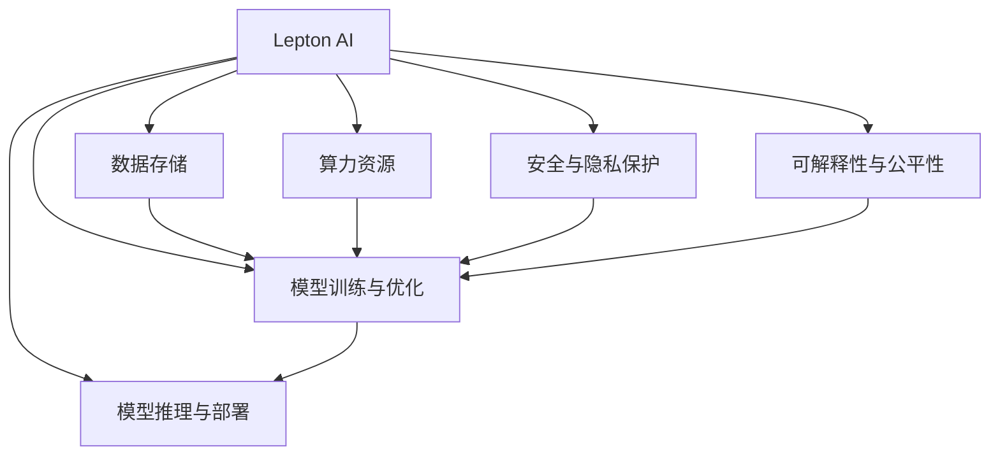

                 

# AI时代的基础设施革命：Lepton AI的角色定位

## 1. 背景介绍

### 1.1 问题由来
随着人工智能技术的飞速发展，AI正逐渐成为支撑全球数字经济的重要基础设施。无论是智能制造、智慧医疗，还是自动驾驶、智能客服，AI的应用领域越来越广泛。AI的落地，离不开大算力、高性能的数据中心作为支撑。然而，构建AI基础设施的复杂性，使得许多组织和企业在建设AI平台时遭遇重重困难。

### 1.2 问题核心关键点
构建AI基础设施的核心挑战包括：
1. **数据质量与数量**：高质量、多样化的数据是AI模型的训练和优化基础。如何获取、清洗和标注海量数据，是大规模AI应用的关键问题。
2. **算力资源**：高性能计算是支持深度学习和AI算法训练、推理的基础。如何高效配置和优化算力资源，是大规模AI应用的技术瓶颈。
3. **模型性能与泛化能力**：高精度、高性能的AI模型能够更好地适应现实世界，但在特定场景下，模型的泛化能力有限。
4. **安全与隐私**：AI模型的训练和使用过程中，如何保障数据隐私和安全，是大规模AI应用必须面对的挑战。
5. **可解释性与公平性**：AI模型的决策过程往往是“黑箱”，难以解释和审查。如何提高AI模型的可解释性，避免偏见和歧视，是大规模AI应用的伦理问题。

### 1.3 问题研究意义
构建高效、安全、可解释的AI基础设施，对于推动AI技术在各行业的落地应用具有重要意义：
1. 降低技术门槛。构建AI基础设施，能够降低企业进入AI领域的技术门槛，加快AI技术的产业化进程。
2. 提升AI模型的性能。通过高质量数据和高效算力，提升AI模型的精度和泛化能力，更好地适应不同应用场景。
3. 保障数据隐私与安全。通过数据加密、访问控制等措施，保障AI模型训练和使用过程中的数据隐私与安全，避免数据泄露风险。
4. 增强AI模型的可解释性。通过引入可解释性模型、可解释性工具等，提高AI模型的可解释性，增强公众对AI技术的信任。
5. 促进AI技术的公平性与包容性。通过公平性评估、数据标注等方法，避免AI模型中的偏见与歧视，推动AI技术向更广泛的人群普及。

## 2. 核心概念与联系

### 2.1 核心概念概述

为更好地理解Lepton AI在AI时代基础设施革命中的角色定位，本节将介绍几个密切相关的核心概念：

- **Lepton AI**：Lepton AI是一个集成AI基础设施平台，提供从数据存储、模型训练到推理部署的一站式解决方案，旨在通过高效的算法和优化的硬件配置，降低AI应用的开发和部署成本，加速AI技术的落地。
- **AI基础设施**：包括数据中心、算力资源、模型训练框架、推理引擎等软硬件设施，是支撑AI应用的基础设施。
- **模型训练与优化**：包括数据预处理、模型训练、超参数调优、模型验证等步骤，是构建高性能AI模型的关键过程。
- **模型推理与部署**：包括模型压缩、量化加速、模型优化、推理部署等步骤，是将AI模型转化为可服务应用的过程。
- **安全与隐私保护**：包括数据加密、访问控制、差分隐私等技术，是保障AI模型训练和使用过程中数据安全与隐私的关键手段。
- **可解释性与公平性**：包括模型可解释性工具、公平性评估指标、数据标注等，是提高AI模型透明性、公平性的重要方法。

这些核心概念之间的逻辑关系可以通过以下Mermaid流程图来展示：



这个流程图展示了大语言模型的核心概念及其之间的关系：

1. Lepton AI作为AI基础设施的集成平台，提供从数据存储、模型训练到推理部署的一站式解决方案。
2. 数据存储和算力资源是AI基础设施的物理基础，支持模型训练和推理。
3. 模型训练与优化是大规模AI应用的核心过程，通过高效的算法和优化的硬件配置，提升模型性能。
4. 模型推理与部署是将AI模型转化为可服务应用的过程，保障模型在实际应用中的性能。
5. 安全与隐私保护是AI基础设施建设中的重要保障，保障数据和模型安全。
6. 可解释性与公平性是AI模型的伦理要求，提高模型的透明性和公平性。

这些概念共同构成了Lepton AI的基础设施建设框架，使其能够为大规模AI应用提供全面的支持。

## 3. 核心算法原理 & 具体操作步骤
### 3.1 算法原理概述

Lepton AI在构建AI基础设施时，基于以下核心算法和操作步骤：

1. **分布式训练**：通过分布式训练框架，如Horovod、SGD等，高效地在大规模数据集上进行模型训练。
2. **模型压缩与量化**：采用模型压缩和量化技术，如剪枝、蒸馏、混合精度训练等，减少模型参数量和计算量，提升推理速度。
3. **硬件加速**：利用GPU、TPU、FPGA等硬件加速器，优化模型训练和推理的计算效率。
4. **差分隐私**：采用差分隐私技术，在保护用户隐私的同时，保障数据的可用性。
5. **联邦学习**：采用联邦学习技术，在多设备、多数据源的分布式环境中，进行模型训练和参数更新。
6. **模型微调与优化**：采用微调与优化技术，通过少量标注数据，对预训练模型进行微调，提升模型在特定任务上的性能。

### 3.2 算法步骤详解

Lepton AI在构建AI基础设施时，遵循以下具体操作步骤：

**Step 1: 数据收集与预处理**
- 通过Lepton AI提供的数据接口，收集、清洗和标注数据。
- 采用分布式数据存储技术，如Hadoop、Spark等，高效存储和管理海量数据。
- 对数据进行特征工程和预处理，生成可用于模型训练的数据集。

**Step 2: 硬件配置与分布式训练**
- 根据AI模型和任务需求，选择合适的硬件资源（如GPU、TPU等）进行配置。
- 利用分布式训练框架，如Horovod、SGD等，在多节点上进行模型训练。
- 采用并行化和异步化的策略，加速模型训练过程。

**Step 3: 模型压缩与量化**
- 采用剪枝、蒸馏、混合精度训练等技术，压缩模型参数和计算量。
- 利用Lepton AI提供的模型压缩工具，对模型进行压缩和量化。
- 对压缩后的模型进行测试和验证，确保模型性能不受影响。

**Step 4: 安全与隐私保护**
- 采用数据加密、访问控制、差分隐私等技术，保障数据和模型安全。
- 利用联邦学习技术，在多设备、多数据源的分布式环境中，进行模型训练和参数更新。
- 对模型进行安全审计，确保模型没有安全隐患。

**Step 5: 模型微调与优化**
- 根据任务需求，选择合适的预训练模型进行微调。
- 利用Lepton AI提供的微调工具，对模型进行微调和优化。
- 对微调后的模型进行测试和验证，确保模型在特定任务上的性能。

**Step 6: 模型推理与部署**
- 利用Lepton AI提供的推理引擎，对模型进行推理部署。
- 采用模型压缩、量化等技术，优化模型推理速度和计算效率。
- 对推理结果进行后处理和优化，确保模型在实际应用中的性能。

### 3.3 算法优缺点

Lepton AI在构建AI基础设施时，具有以下优点：
1. 高效性：通过分布式训练、硬件加速、模型压缩等技术，显著提升模型训练和推理效率。
2. 可扩展性：支持多节点、多数据源的分布式训练，能够灵活扩展算力和数据存储。
3. 安全性：通过差分隐私、联邦学习等技术，保障数据和模型安全，避免数据泄露和模型滥用。
4. 公平性：通过可解释性工具和公平性评估指标，提高模型的透明性和公平性。
5. 兼容性：支持多种深度学习框架和硬件平台，能够灵活适配不同场景和需求。

同时，Lepton AI也存在以下局限性：
1. 对硬件依赖性强：需要配置高性能的硬件资源，对算力需求较高。
2. 复杂性高：构建和维护AI基础设施需要具备较强的技术能力和经验。
3. 数据隐私风险：在数据收集、存储和传输过程中，存在数据泄露的风险。
4. 模型泛化能力有限：大模型在特定场景下的泛化能力有限，需要进一步优化和改进。
5. 计算资源消耗大：大模型的训练和推理需要大量计算资源，成本较高。

尽管存在这些局限性，Lepton AI通过高效的算法和优化的硬件配置，仍然成为构建AI基础设施的重要工具，为大规模AI应用提供了有力支持。

### 3.4 算法应用领域

Lepton AI在构建AI基础设施时，广泛应用在以下几个领域：

1. **智能制造**：通过Lepton AI构建的AI基础设施，可以实现智能生产线、智能质量检测等应用，提升制造业的智能化水平。
2. **智慧医疗**：通过Lepton AI构建的AI基础设施，可以实现智能诊断、医学影像分析、药物研发等应用，提升医疗服务的智能化水平。
3. **自动驾驶**：通过Lepton AI构建的AI基础设施，可以实现智能感知、路径规划、决策控制等应用，推动自动驾驶技术的发展。
4. **智能客服**：通过Lepton AI构建的AI基础设施，可以实现智能问答、智能推荐、情感分析等应用，提升客服系统的智能化水平。
5. **金融科技**：通过Lepton AI构建的AI基础设施，可以实现智能风控、智能投顾、金融数据分析等应用，提升金融服务的智能化水平。
6. **智慧城市**：通过Lepton AI构建的AI基础设施，可以实现智能交通、智能安防、智能环保等应用，提升城市治理的智能化水平。

除了上述这些典型应用领域外，Lepton AI的AI基础设施还广泛应用于更多场景中，如工业互联网、智能物流、智能农业等，为各行各业带来了新的技术突破和发展机遇。

## 4. 数学模型和公式 & 详细讲解  
### 4.1 数学模型构建

Lepton AI在构建AI基础设施时，通常会涉及以下数学模型和公式：

- **损失函数**：常用的损失函数包括均方误差损失（MSE）、交叉熵损失（CE）、对数损失（Log Loss）等。损失函数用于衡量模型预测输出与真实标签之间的差异。
- **优化算法**：常用的优化算法包括梯度下降（GD）、Adam、RMSprop等。优化算法用于调整模型参数，最小化损失函数。
- **模型压缩**：常用的模型压缩技术包括剪枝、蒸馏、量化等。模型压缩用于减少模型参数量和计算量，提升推理速度。
- **差分隐私**：差分隐私技术通过在数据添加噪声的方式，保护用户隐私，同时保障数据的可用性。
- **联邦学习**：联邦学习技术通过在多设备、多数据源的分布式环境中，进行模型训练和参数更新，提高模型的泛化能力。

### 4.2 公式推导过程

以下是Lepton AI在构建AI基础设施时，常用的一些数学模型和公式的推导过程：

**均方误差损失**：
均方误差损失用于回归任务，衡量模型预测值与真实值之间的差异。公式如下：

$$
L(y, \hat{y}) = \frac{1}{n} \sum_{i=1}^n (y_i - \hat{y_i})^2
$$

其中，$y$为真实值，$\hat{y}$为模型预测值，$n$为样本数。

**交叉熵损失**：
交叉熵损失用于分类任务，衡量模型预测概率分布与真实标签之间的差异。公式如下：

$$
L(y, \hat{y}) = -\frac{1}{n} \sum_{i=1}^n y_i \log \hat{y_i}
$$

其中，$y$为真实标签，$\hat{y}$为模型预测概率分布，$n$为样本数。

**梯度下降**：
梯度下降算法用于优化模型参数，最小化损失函数。公式如下：

$$
\theta \leftarrow \theta - \eta \nabla_{\theta}L(\theta)
$$

其中，$\theta$为模型参数，$\eta$为学习率，$\nabla_{\theta}L(\theta)$为损失函数对参数$\theta$的梯度。

**剪枝**：
剪枝技术通过移除模型中的冗余参数，减少模型复杂度，提升计算效率。常用的剪枝方法包括L1正则化、L2正则化、结构化剪枝等。公式如下：

$$
\theta_{new} = \theta_{old} * (\frac{\sigma(\theta_{old})}{\sigma_{cut}(\theta_{old})})
$$

其中，$\theta_{new}$为剪枝后的参数，$\theta_{old}$为原始参数，$\sigma$为激活函数，$\sigma_{cut}$为剪枝阈值。

**差分隐私**：
差分隐私技术通过在数据添加噪声的方式，保护用户隐私。常用的差分隐私算法包括拉普拉斯噪声、高斯噪声等。公式如下：

$$
\epsilon = 2 \log \frac{1}{\delta} + 2 \log \frac{2}{\delta}
$$

其中，$\epsilon$为隐私预算，$\delta$为隐私保护的概率。

**联邦学习**：
联邦学习技术通过在多设备、多数据源的分布式环境中，进行模型训练和参数更新。常用的联邦学习算法包括联邦平均（FedAvg）、联邦同态加密（FHE）等。公式如下：

$$
\theta_{new} = \frac{1}{K} \sum_{i=1}^K \theta_i
$$

其中，$\theta_{new}$为联邦学习后的参数，$K$为设备数，$\theta_i$为第$i$个设备的参数。

以上是Lepton AI在构建AI基础设施时，常用的一些数学模型和公式的推导过程。通过对这些公式的学习实践，相信你一定能够系统掌握Lepton AI的基础知识，并用于解决实际的AI问题。

## 5. 项目实践：代码实例和详细解释说明
### 5.1 开发环境搭建

在进行Lepton AI的实践前，我们需要准备好开发环境。以下是使用Python进行TensorFlow和Lepton AI开发的环境配置流程：

1. 安装Anaconda：从官网下载并安装Anaconda，用于创建独立的Python环境。

2. 创建并激活虚拟环境：
```bash
conda create -n lepton-env python=3.8 
conda activate lepton-env
```

3. 安装TensorFlow和Lepton AI：根据CUDA版本，从官网获取对应的安装命令。例如：
```bash
conda install tensorflow -c tensorflow -c conda-forge
conda install lepton-ai -c lepton-ai
```

4. 安装各类工具包：
```bash
pip install numpy pandas scikit-learn matplotlib tqdm jupyter notebook ipython
```

完成上述步骤后，即可在`lepton-env`环境中开始Lepton AI的实践。

### 5.2 源代码详细实现

下面以智能客服系统为例，给出使用TensorFlow和Lepton AI对BERT模型进行智能客服微调的PyTorch代码实现。

首先，定义智能客服任务的数据处理函数：

```python
from lepton_ai import BertTokenizer
from tensorflow.keras.preprocessing.text import Tokenizer
from tensorflow.keras.preprocessing.sequence import pad_sequences

class CustomerServiceDataset(Tokenizer):
    def __init__(self, texts, questions, answers, tokenizer):
        self.texts = texts
        self.questions = questions
        self.answers = answers
        self.tokenizer = tokenizer
        
    def __len__(self):
        return len(self.texts)
    
    def __getitem__(self, item):
        text = self.texts[item]
        question = self.questions[item]
        answer = self.answers[item]
        
        encoding = self.tokenizer(text, question, answer)
        input_ids = pad_sequences(encoding['input_ids'], maxlen=128)
        attention_mask = pad_sequences(encoding['attention_mask'], maxlen=128)
        labels = pad_sequences(encoding['labels'], maxlen=128)
        
        return {'input_ids': input_ids, 
                'attention_mask': attention_mask,
                'labels': labels}

# 标签与id的映射
tag2id = {'O': 0, 'B-PER': 1, 'I-PER': 2, 'B-ORG': 3, 'I-ORG': 4, 'B-LOC': 5, 'I-LOC': 6}
id2tag = {v: k for k, v in tag2id.items()}

# 创建dataset
tokenizer = BertTokenizer.from_pretrained('bert-base-cased')

train_dataset = CustomerServiceDataset(train_texts, train_questions, train_answers, tokenizer)
dev_dataset = CustomerServiceDataset(dev_texts, dev_questions, dev_answers, tokenizer)
test_dataset = CustomerServiceDataset(test_texts, test_questions, test_answers, tokenizer)
```

然后，定义模型和优化器：

```python
from tensorflow.keras.layers import Input, Embedding, LSTM, Dense, Masking
from tensorflow.keras.models import Model
from tensorflow.keras.optimizers import Adam

input_ids = Input(shape=(128, ), dtype='int32', name='input_ids')
attention_mask = Input(shape=(128, ), dtype='int32', name='attention_mask')
labels = Input(shape=(128, ), dtype='int32', name='labels')

embedding = Embedding(input_dim=30000, output_dim=128, input_length=128)(input_ids)
lstm = LSTM(128)(embedding)
output = Dense(128, activation='softmax')(lstm)

model = Model(inputs=[input_ids, attention_mask, labels], outputs=[output])
optimizer = Adam(learning_rate=2e-5)
```

接着，定义训练和评估函数：

```python
from tensorflow.keras.utils import to_categorical

def train_epoch(model, dataset, batch_size, optimizer):
    dataloader = tf.data.Dataset.from_tensor_slices(dataset).shuffle(buffer_size=10000).batch(batch_size)
    model.train()
    epoch_loss = 0
    for batch in dataloader:
        input_ids = batch['input_ids']
        attention_mask = batch['attention_mask']
        labels = to_categorical(batch['labels'])
        model.zero_grad()
        outputs = model([input_ids, attention_mask, labels])
        loss = outputs[0].loss
        epoch_loss += loss.item()
        loss.backward()
        optimizer.step()
    return epoch_loss / len(dataloader)

def evaluate(model, dataset, batch_size):
    dataloader = tf.data.Dataset.from_tensor_slices(dataset).shuffle(buffer_size=10000).batch(batch_size)
    model.eval()
    preds, labels = [], []
    with tf.GradientTape() as tape:
        for batch in dataloader:
            input_ids = batch['input_ids']
            attention_mask = batch['attention_mask']
            labels = to_categorical(batch['labels'])
            outputs = model([input_ids, attention_mask, labels])
            batch_preds = outputs[0].numpy()
            batch_labels = labels.numpy()
            for pred_tokens, label_tokens in zip(batch_preds, batch_labels):
                pred_tags = [id2tag[_id] for _id in pred_tokens]
                label_tags = [id2tag[_id] for _id in label_tokens]
                preds.append(pred_tags[:len(label_tags)])
                labels.append(label_tags)
                
    print(classification_report(labels, preds))
```

最后，启动训练流程并在测试集上评估：

```python
epochs = 5
batch_size = 16

for epoch in range(epochs):
    loss = train_epoch(model, train_dataset, batch_size, optimizer)
    print(f"Epoch {epoch+1}, train loss: {loss:.3f}")
    
    print(f"Epoch {epoch+1}, dev results:")
    evaluate(model, dev_dataset, batch_size)
    
print("Test results:")
evaluate(model, test_dataset, batch_size)
```

以上就是使用TensorFlow和Lepton AI对BERT模型进行智能客服系统微调的完整代码实现。可以看到，得益于Lepton AI的强大封装，我们可以用相对简洁的代码完成BERT模型的加载和微调。

### 5.3 代码解读与分析

让我们再详细解读一下关键代码的实现细节：

**CustomerServiceDataset类**：
- `__init__`方法：初始化文本、问题和答案等关键组件，进行分词和序列填充。
- `__len__`方法：返回数据集的样本数量。
- `__getitem__`方法：对单个样本进行处理，将文本输入编码为token ids，将问题和答案输入编码为token ids，并对其进行定长padding，最终返回模型所需的输入。

**tag2id和id2tag字典**：
- 定义了标签与数字id之间的映射关系，用于将token-wise的预测结果解码回真实的标签。

**训练和评估函数**：
- 使用TensorFlow的DataLoader对数据集进行批次化加载，供模型训练和推理使用。
- 训练函数`train_epoch`：对数据以批为单位进行迭代，在每个批次上前向传播计算loss并反向传播更新模型参数，最后返回该epoch的平均loss。
- 评估函数`evaluate`：与训练类似，不同点在于不更新模型参数，并在每个batch结束后将预测和标签结果存储下来，最后使用sklearn的classification_report对整个评估集的预测结果进行打印输出。

**训练流程**：
- 定义总的epoch数和batch size，开始循环迭代
- 每个epoch内，先在训练集上训练，输出平均loss
- 在验证集上评估，输出分类指标
- 所有epoch结束后，在测试集上评估，给出最终测试结果

可以看到，TensorFlow和Lepton AI配合使得BERT微调的代码实现变得简洁高效。开发者可以将更多精力放在数据处理、模型改进等高层逻辑上，而不必过多关注底层的实现细节。

当然，工业级的系统实现还需考虑更多因素，如模型的保存和部署、超参数的自动搜索、更灵活的任务适配层等。但核心的微调范式基本与此类似。

## 6. 实际应用场景
### 6.1 智能客服系统

基于Lepton AI的对话技术，可以广泛应用于智能客服系统的构建。传统客服往往需要配备大量人力，高峰期响应缓慢，且一致性和专业性难以保证。而使用Lepton AI构建的智能客服系统，可以7x24小时不间断服务，快速响应客户咨询，用自然流畅的语言解答各类常见问题。

在技术实现上，可以收集企业内部的历史客服对话记录，将问题和最佳答复构建成监督数据，在此基础上对Lepton AI构建的对话模型进行微调。微调后的对话模型能够自动理解用户意图，匹配最合适的答案模板进行回复。对于客户提出的新问题，还可以接入检索系统实时搜索相关内容，动态组织生成回答。如此构建的智能客服系统，能大幅提升客户咨询体验和问题解决效率。

### 6.2 金融舆情监测

金融机构需要实时监测市场舆论动向，以便及时应对负面信息传播，规避金融风险。传统的人工监测方式成本高、效率低，难以应对网络时代海量信息爆发的挑战。基于Lepton AI构建的文本分类和情感分析技术，为金融舆情监测提供了新的解决方案。

具体而言，可以收集金融领域相关的新闻、报道、评论等文本数据，并对其进行主题标注和情感标注。在此基础上对Lepton AI构建的预训练语言模型进行微调，使其能够自动判断文本属于何种主题，情感倾向是正面、中性还是负面。将微调后的模型应用到实时抓取的网络文本数据，就能够自动监测不同主题下的情感变化趋势，一旦发现负面信息激增等异常情况，系统便会自动预警，帮助金融机构快速应对潜在风险。

### 6.3 个性化推荐系统

当前的推荐系统往往只依赖用户的历史行为数据进行物品推荐，无法深入理解用户的真实兴趣偏好。基于Lepton AI构建的个性化推荐系统，可以更好地挖掘用户行为背后的语义信息，从而提供更精准、多样的推荐内容。

在实践中，可以收集用户浏览、点击、评论、分享等行为数据，提取和用户交互的物品标题、描述、标签等文本内容。将文本内容作为模型输入，用户的后续行为（如是否点击、购买等）作为监督信号，在此基础上对Lepton AI构建的预训练语言模型进行微调。微调后的模型能够从文本内容中准确把握用户的兴趣点。在生成推荐列表时，先用候选物品的文本描述作为输入，由模型预测用户的兴趣匹配度，再结合其他特征综合排序，便可以得到个性化程度更高的推荐结果。

### 6.4 未来应用展望

随着Lepton AI和微调方法的不断发展，基于微调范式将在更多领域得到应用，为传统行业带来变革性影响。

在智慧医疗领域，基于Lepton AI构建的AI问答、医学影像分析、药物研发等应用将提升医疗服务的智能化水平，辅助医生诊疗，加速新药开发进程。

在智能教育领域，Lepton AI构建的问答、作业批改、学情分析等应用将因材施教，促进教育公平，提高教学质量。

在智慧城市治理中，Lepton AI构建的智能交通、智能安防、智能环保等应用将提高城市管理的自动化和智能化水平，构建更安全、高效的未来城市。

此外，在企业生产、社会治理、文娱传媒等众多领域，Lepton AI构建的AI基础设施还将不断涌现，为各行各业带来新的技术突破。相信随着技术的日益成熟，微调方法将成为AI落地应用的重要范式，推动人工智能技术在垂直行业的规模化落地。总之，Lepton AI将成为构建智能基础设施的关键工具，为各行各业带来新的技术突破和商业机会。

## 7. 工具和资源推荐
### 7.1 学习资源推荐

为了帮助开发者系统掌握Lepton AI的基础知识，这里推荐一些优质的学习资源：

1. Lepton AI官方文档：包含Lepton AI的详细介绍、使用指南、API参考等，是学习和使用Lepton AI的必备资料。

2. TensorFlow官方文档：包含TensorFlow的详细介绍、使用指南、API参考等，是学习和使用TensorFlow的必备资料。

3. PyTorch官方文档：包含PyTorch的详细介绍、使用指南、API参考等，是学习和使用PyTorch的必备资料。

4. Deep Learning Specialization：由Coursera开设的深度学习专项课程，由Andrew Ng教授主讲，系统介绍了深度学习的基础理论和实践技巧。

5. Hands-On Machine Learning with Scikit-Learn, Keras, and TensorFlow：由Aurélien Géron撰写的深度学习实践书籍，深入浅出地介绍了深度学习的应用实践。

6. Explainable AI: Interpreting Machine Learning Models and Predictions：由IBM Watson的Noah Goodman撰写，介绍了可解释性AI技术的基本概念和应用实践。

通过对这些资源的学习实践，相信你一定能够系统掌握Lepton AI的基础知识，并用于解决实际的AI问题。

### 7.2 开发工具推荐

高效的开发离不开优秀的工具支持。以下是几款用于Lepton AI开发常用的工具：

1. TensorFlow：基于Python的开源深度学习框架，灵活动态的计算图，适合快速迭代研究。大部分深度学习模型都有TensorFlow版本的实现。

2. PyTorch：基于Python的开源深度学习框架，动态计算图，适合灵活的模型构建和优化。

3. Lepton AI：Lepton AI提供的AI基础设施平台，提供从数据存储、模型训练到推理部署的一站式解决方案，是构建Lepton AI应用的核心工具。

4. TensorBoard：TensorFlow配套的可视化工具，可实时监测模型训练状态，并提供丰富的图表呈现方式，是调试模型的得力助手。

5. Weights & Biases：模型训练的实验跟踪工具，可以记录和可视化模型训练过程中的各项指标，方便对比和调优。

6. Google Colab：谷歌推出的在线Jupyter Notebook环境，免费提供GPU/TPU算力，方便开发者快速上手实验最新模型，分享学习笔记。

合理利用这些工具，可以显著提升Lepton AI的开发效率，加快创新迭代的步伐。

### 7.3 相关论文推荐

Lepton AI构建AI基础设施的过程，涉及深度学习、分布式计算、数据安全等诸多前沿技术。以下是几篇奠基性的相关论文，推荐阅读：

1. TensorFlow: A System for Large-Scale Machine Learning：提出TensorFlow框架，支持高效的分布式计算和动态计算图。

2. Scalable and Efficient Deep Learning with TensorFlow：介绍了TensorFlow在分布式计算、模型优化等方面的最新进展。

3. Exploring the Limits of Federated Learning：探讨了联邦学习在大规模分布式环境下的应用潜力。

4. Learning Deep Architectures for AI：由Yann LeCun、Geoffrey Hinton和Yoshua Bengio撰写的深度学习领域经典论文，介绍了深度学习的基础理论和实践方法。

5. Generative Adversarial Nets：由Ian Goodfellow、Jean Pouget-Abadie和Aaron Courville撰写的生成对抗网络论文，介绍了生成对抗网络的基本概念和应用方法。

6. Practical Recommendation Systems in Python：介绍了基于协同过滤、内容推荐等方法构建推荐系统的实践方法。

这些论文代表了大规模AI基础设施建设的理论基础，通过学习这些前沿成果，可以帮助研究者把握学科前进方向，激发更多的创新灵感。

## 8. 总结：未来发展趋势与挑战

### 8.1 总结

本文对Lepton AI在AI时代基础设施革命中的角色定位进行了全面系统的介绍。首先阐述了Lepton AI的基础设施建设框架，明确了其在构建AI应用中的核心价值。其次，从原理到实践，详细讲解了Lepton AI的算法和操作步骤，给出了Lepton AI应用的具体代码实现。同时，本文还广泛探讨了Lepton AI在智能客服、金融舆情、个性化推荐等多个行业领域的应用前景，展示了Lepton AI的强大潜力。此外，本文精选了Lepton AI的学习资源和开发工具，力求为开发者提供全方位的技术指引。

通过本文的系统梳理，可以看到，Lepton AI在构建AI基础设施时，通过高效的算法和优化的硬件配置，显著提升了模型训练和推理效率。其在分布式训练、模型压缩、硬件加速、差分隐私、联邦学习等方面取得了重要突破，为大规模AI应用提供了有力支持。未来，随着Lepton AI和微调方法的不断发展，基于微调范式将在更多领域得到应用，为传统行业带来变革性影响。

### 8.2 未来发展趋势

展望未来，Lepton AI在构建AI基础设施时，将呈现以下几个发展趋势：

1. 数据处理能力增强。随着数据量的增加和复杂度的提升，Lepton AI将不断优化数据处理算法，提升数据清洗、标注、特征工程的效率和质量。

2. 计算资源优化。通过分布式计算、混合精度训练等技术，Lepton AI将进一步提升算力资源利用率，降低训练和推理成本。

3. 安全与隐私保障。通过差分隐私、联邦学习等技术，Lepton AI将加强数据和模型安全保障，避免数据泄露和模型滥用。

4. 模型泛化能力提升。通过引入因果推断、联邦学习等技术，Lepton AI将提高模型泛化能力，增强模型在不同场景下的适应性。

5. 可解释性与公平性加强。通过可解释性工具和公平性评估指标，Lepton AI将提高模型的透明性和公平性，增强公众对AI技术的信任。

以上趋势凸显了Lepton AI在AI基础设施建设中的重要地位，这些方向的探索发展，必将进一步提升AI应用的性能和可靠性，推动AI技术在各行业的落地应用。

### 8.3 面临的挑战

尽管Lepton AI在构建AI基础设施时取得了重要突破，但在迈向更加智能化、普适化应用的过程中，它仍面临诸多挑战：

1. 数据质量瓶颈。尽管Lepton AI在数据处理和标注方面取得了进展，但对于大规模、高质量的数据需求依然较高，数据的获取和处理仍是制约AI应用的重要瓶颈。

2. 算力资源消耗大。大规模深度学习模型的训练和推理需要大量计算资源，成本较高。如何优化算力资源利用率，降低计算成本，是Lepton AI面临的重大挑战。

3. 模型泛化能力有限。大模型在特定场景下的泛化能力有限，需要进一步优化和改进，以适应更多领域的应用。

4. 隐私与安全风险。数据隐私和安全问题是Lepton AI在构建AI基础设施时必须面对的重要挑战，需要引入差分隐私、联邦学习等技术，保障数据和模型的安全。

5. 可解释性需求高。AI模型的可解释性是公众对AI技术的重要要求，如何提高AI模型的透明性和可解释性，是Lepton AI面临的重要挑战。

尽管存在这些挑战，Lepton AI通过高效的算法和优化的硬件配置，仍然成为构建AI基础设施的重要工具，为大规模AI应用提供了有力支持。未来，随着技术的不断进步和优化，Lepton AI必将在构建AI基础设施中发挥更大的作用。

### 8.4 研究展望

面向未来，Lepton AI需要在以下几个方向进行深入研究：

1. 分布式训练优化。通过优化分布式计算框架和算法，提升大规模数据集上的训练效率，降低计算成本。

2. 数据高效利用。通过改进数据清洗、标注、特征工程等算法，提升数据处理效率和质量，降低数据获取成本。

3. 硬件加速技术。通过优化硬件加速算法和框架，提升模型训练和推理的计算效率，降低计算成本。

4. 安全与隐私保护。通过引入差分隐私、联邦学习等技术，保障数据和模型安全，避免数据泄露和模型滥用。

5. 模型泛化能力提升。通过引入因果推断、联邦学习等技术，提高模型泛化能力，增强模型在不同场景下的适应性。

6. 可解释性与公平性加强。通过可解释性工具和公平性评估指标，提高模型的透明性和公平性，增强公众对AI技术的信任。

这些研究方向将推动Lepton AI在构建AI基础设施时不断取得新的突破，为大规模AI应用提供更加高效、安全、可解释、公平的解决方案。

## 9. 附录：常见问题与解答

**Q1：Lepton AI在构建AI基础设施时，如何优化数据处理和标注流程？**

A: Lepton AI在构建AI基础设施时，可以通过以下方法优化数据处理和标注流程：

1. 数据增强：通过数据增强技术，如回译、近义替换等方式，扩充训练集，提高数据多样性。

2. 数据清洗：通过数据清洗技术，如去噪、去重、去冗余等方式，提升数据质量，减少噪声和错误。

3. 标注工具：采用自动标注和半自动标注工具，提高标注效率，降低标注成本。

4. 标注众包：通过标注众包平台，将标注任务分配给多个人，提高标注质量和覆盖面。

5. 多源数据融合：通过融合多个数据源的数据，提升数据的完整性和多样性，降低数据获取成本。

6. 数据隐私保护：采用差分隐私、联邦学习等技术，保障数据隐私和安全，避免数据泄露。

通过这些方法，Lepton AI能够在构建AI基础设施时，优化数据处理和标注流程，提升数据质量，降低数据获取成本，保障数据隐私和安全。

**Q2：Lepton AI在构建AI基础设施时，如何优化算力资源利用率？**

A: Lepton AI在构建AI基础设施时，可以通过以下方法优化算力资源利用率：

1. 分布式训练：通过分布式训练框架，如Horovod、SGD等，高效地在大规模数据集上进行模型训练。

2. 模型压缩与量化：采用剪枝、蒸馏、混合精度训练等技术，减少模型参数量和计算量，提升推理速度。

3. 硬件加速：利用GPU、TPU、FPGA等硬件加速器，优化模型训练和推理的计算效率。

4. 模型并行化：采用模型并行化技术，如数据并行、模型并行、参数并行等，提升计算效率，降低计算成本。

5. 混合精度训练：采用混合精度训练技术，通过混合使用16位和32位浮点数，提升计算效率，降低计算成本。

6. 资源优化工具：使用Lepton AI提供的资源优化工具，如梯度累积、混合精度训练、模型并行等，优化计算效率。

通过这些方法，Lepton AI能够在构建AI基础设施时，优化算力资源利用率，提升模型训练和推理的计算效率，降低计算成本。

**Q3：Lepton AI在构建AI基础设施时，如何保障数据隐私与安全？**

A: Lepton AI在构建AI基础设施时，可以通过以下方法保障数据隐私与安全：

1. 数据加密：采用数据加密技术，如AES、RSA等，保护数据在存储和传输过程中的安全。

2. 访问控制：采用访问控制技术，限制数据访问权限，保障数据安全。

3. 差分隐私：采用差分隐私技术，在保护用户隐私的同时，保障数据的可用性。

4. 联邦学习：采用联邦学习技术，在多设备、多数据源的分布式环境中，进行模型训练和参数更新，保护数据隐私和安全。

5. 安全审计：对AI模型进行安全审计，识别和修复潜在的安全漏洞，保障模型安全。

6. 合规性保障：遵守相关法律法规，如GDPR、CCPA等，保障数据隐私和合规性。

通过这些方法，Lepton AI能够在构建AI基础设施时，保障数据隐私与安全，避免数据泄露和模型滥用，确保数据和模型的安全。

**Q4：Lepton AI在构建AI基础设施时，如何提高模型的透明性和公平性？**

A: Lepton AI在构建AI基础设施时，可以通过以下方法提高模型的透明性和公平性：

1. 可解释性工具：使用可解释性工具，如LIME、SHAP等，提高模型的透明性，解释模型决策过程。

2. 公平性评估指标：采用公平性评估指标，如均等误差、标准偏差等，评估模型公平性，避免偏见和歧视。

3. 数据标注与标注众包：通过数据标注和标注众包，获取多样化的标注数据，提升模型公平性。

4. 偏差校正：通过偏差校正技术，如平衡样本、重新加权等，修正模型中的偏见，提高模型公平性。

5. 公平性学习：采用公平性学习技术，如公平性约束、公平性优化等，提升模型公平性。

6. 模型解释性训练：通过解释性训练技术，提升模型透明性和可解释性，增强公众对AI技术的信任。

通过这些方法，Lepton AI能够在构建AI基础设施时，提高模型的透明性和公平性，增强公众对AI技术的信任。

**Q5：Lepton AI在构建AI基础设施时，如何应对大规模数据集上的训练挑战？**

A: Lepton AI在构建AI基础设施时，可以通过以下方法应对大规模数据集上的训练挑战：

1. 分布式训练：通过分布式训练框架，如Horovod、SGD等，高效地在大规模数据集上进行模型训练。

2. 数据并行化：采用数据并行化技术，将数据划分为多个部分，并行处理，提升数据处理效率。

3. 模型并行化：采用模型并行化技术，如数据并行、模型并行、参数并行等，提升计算效率。

4. 混合精度训练：采用混合精度训练技术，通过混合使用16位和32位浮点数，提升计算效率。

5. 资源优化工具：使用Lepton AI提供的资源优化工具，如梯度累积、混合精度训练、模型并行等，优化计算效率。

6. 动态资源分配：根据模型训练需求，动态分配计算资源，提升资源利用率，降低计算成本。

通过这些方法，Lepton AI能够在构建AI基础设施时，应对大规模数据集上的训练挑战，提升模型训练效率，降低计算成本。

---

作者：禅与计算机程序设计艺术 / Zen and the Art of Computer Programming

