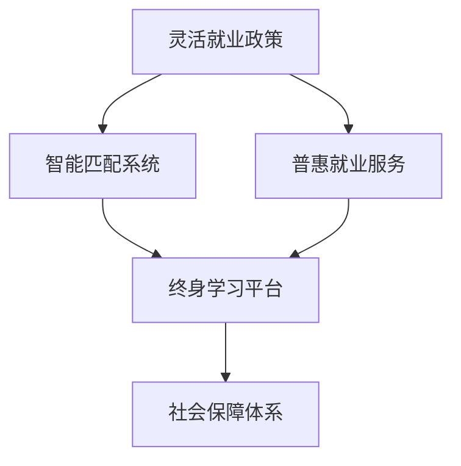

                 

# AI时代的就业政策创新:灵活就业政策和普惠就业服务

在人工智能(AI)迅猛发展的时代，就业市场的格局正在发生深刻的变革。AI技术的普及和应用，不仅重塑了劳动分工和生产力结构，也对传统的就业政策提出了新的挑战。为了应对这些变化，许多国家和地区纷纷推出灵活就业政策和普惠就业服务，以期在提升劳动力市场灵活性和包容性的同时，保障就业稳定性和质量。本文将从背景介绍、核心概念、算法原理、应用领域等多个方面，全面探讨AI时代就业政策创新的具体举措与实施路径。

## 1. 背景介绍

### 1.1 问题由来

随着AI技术的不断进步，自动化和智能化程度逐步提高，传统劳动密集型行业的工作岗位面临被替代的风险。特别是在制造、物流、客服、零售等重复性高、技术含量低的领域，AI驱动的机器人和自动化系统已经展现出明显的效率优势。例如，亚马逊仓库使用的Kiva机器人已经能够处理大量货物，谷歌的DeepMind开发的AlphaGo在棋类游戏中大放异彩。这些进展不仅改变了企业的经营模式，也对劳动市场结构产生了深远影响。

AI技术的快速发展带来了就业市场的双向效应：一方面，AI提高了生产效率，释放了大量的新增岗位，特别是技术、研发、数据科学等高技能领域；另一方面，也导致了部分低技能岗位的消失，特别是在制造业、服务业等领域。例如，美国麻省理工学院的一项研究显示，自动化可能导致美国35%的低技能岗位在未来10年内消失。这一现象引发了公众对AI技术对就业市场影响的广泛关注。

### 1.2 问题核心关键点

AI时代就业政策创新的核心关键点包括以下几点：

- **就业市场动态性**：AI技术的快速迭代和应用导致劳动力需求变化频繁，要求就业政策具备动态调整能力。
- **劳动力技能匹配**：AI技术的普及要求劳动力具备更高的技能水平，但不同行业和岗位的技能要求差异显著。
- **灵活就业需求**：AI时代不确定性和变动性增加，灵活就业政策能够提供更加灵活和弹性的就业选择。
- **普惠就业服务**：针对低技能劳动者和弱势群体的普惠就业服务，是实现社会公平和包容性的重要保障。

## 2. 核心概念与联系

### 2.1 核心概念概述

为更好地理解AI时代就业政策的创新，本节将介绍几个核心概念：

- **灵活就业政策**：指政府为适应劳动市场的快速变化，通过调整相关政策，促进劳动者自由选择职业和工时，灵活安排工作时间和地点的政策。
- **普惠就业服务**：指政府为提高劳动力市场的包容性和公平性，提供免费或低成本的就业培训、职业指导、就业推荐等公共服务。
- **智能匹配系统**：利用AI技术对劳动力需求和供给进行智能匹配，提高匹配效率和质量。
- **终身学习平台**：提供各类在线课程和学习资源，帮助劳动者提升技能，适应技术变革。
- **社会保障体系**：包括失业保险、医疗保险、退休金等，为劳动者提供基本生活保障。

这些概念之间相互联系，共同构成了AI时代就业政策的创新框架：



### 2.2 核心概念原理和架构

灵活就业政策和普惠就业服务是现代就业政策的核心理念。其核心原理是通过政府的干预，引导和规范劳动市场，保障劳动者的合法权益。具体来说，灵活就业政策主要通过以下几种方式实现：

- **自由选择职业和工时**：劳动者可以根据自己的需求，选择适合的工作类型和工时，如全职、兼职、灵活工时等。
- **灵活安排工作时间和地点**：允许劳动者在家办公、远程办公等，提高工作灵活性。
- **保障劳动者权益**：确保劳动者的休息时间、健康和安全等基本权益。

普惠就业服务则通过免费或低成本的公共服务，提升劳动者的就业能力和适应性。其核心原理包括：

- **免费或低成本的就业培训**：为劳动者提供免费或低成本的就业培训，提升其技能水平。
- **职业指导和就业推荐**：提供职业指导和就业推荐服务，帮助劳动者找到合适的就业机会。
- **公共就业服务体系**：建立覆盖城乡的公共就业服务体系，提供各类就业信息和服务。

智能匹配系统利用AI技术，实现对劳动力需求和供给的智能匹配，提高匹配效率和质量。其核心原理包括：

- **数据收集和处理**：收集和处理劳动力市场的各类数据，如职位需求、劳动者技能、工作地点等。
- **智能算法匹配**：利用机器学习算法，对劳动力需求和供给进行匹配，推荐合适的职位和劳动者。
- **动态调整**：根据市场需求和供给的变化，动态调整匹配算法和推荐结果。

终身学习平台通过提供各类在线课程和学习资源，帮助劳动者提升技能，适应技术变革。其核心原理包括：

- **在线课程和资源**：提供覆盖各类技能的学习课程和资源，如编程、数据分析、AI应用等。
- **学习进度和效果评估**：利用AI技术对学习进度和效果进行评估，提供个性化学习建议。
- **技能证书和认证**：通过技能证书和认证，提高劳动者的就业竞争力。

社会保障体系通过失业保险、医疗保险、退休金等措施，为劳动者提供基本生活保障。其核心原理包括：

- **失业保险**：为失业者提供基本的生活保障，缓解其经济压力。
- **医疗保险**：为劳动者提供医疗保险，保障其健康权益。
- **退休金**：通过退休金制度，保障老年劳动者的基本生活需求。

## 3. 核心算法原理 & 具体操作步骤

### 3.1 算法原理概述

AI时代就业政策的创新，主要依赖于智能匹配系统和普惠就业服务两大关键算法。其核心算法原理包括以下几点：

- **数据驱动的智能匹配**：利用大数据和AI算法，对劳动力需求和供给进行分析和匹配，提高匹配效率和准确性。
- **个性化普惠就业服务**：利用AI技术，对劳动者的技能、兴趣和就业需求进行个性化分析，提供针对性的就业培训和推荐服务。

### 3.2 算法步骤详解

智能匹配系统的算法步骤主要包括：

1. **数据收集和预处理**：收集和预处理劳动力市场的各类数据，如职位需求、劳动者技能、工作地点等。
2. **特征提取和建模**：提取和处理数据的特征，构建机器学习模型，如分类、聚类、回归等。
3. **智能匹配和推荐**：利用模型对劳动力需求和供给进行匹配，推荐合适的职位和劳动者。
4. **动态调整和优化**：根据市场需求和供给的变化，动态调整匹配算法和推荐结果，提高匹配效果。

普惠就业服务的算法步骤主要包括：

1. **劳动者需求分析**：利用AI技术，分析劳动者的技能、兴趣和就业需求。
2. **技能培训和提升**：根据分析结果，提供个性化的技能培训课程和学习资源。
3. **职业指导和推荐**：利用AI技术，提供职业指导和就业推荐服务。
4. **效果评估和优化**：利用AI技术，评估普惠就业服务的效果，优化服务和资源分配。

### 3.3 算法优缺点

智能匹配系统的主要优点包括：

- **高效匹配**：利用AI算法，快速匹配劳动力需求和供给，提高匹配效率。
- **个性化推荐**：根据劳动者技能和需求，提供个性化的职位推荐。
- **动态调整**：根据市场需求和供给的变化，动态调整匹配算法和推荐结果。

主要缺点包括：

- **数据质量依赖**：智能匹配系统的效果依赖于数据的质量和完整性。
- **算法复杂度**：构建和优化算法需要较高的技术要求。
- **隐私和安全问题**：处理个人数据需要严格的隐私保护措施。

普惠就业服务的主要优点包括：

- **覆盖面广**：提供免费的公共服务，覆盖广泛的人群。
- **针对性服务**：根据劳动者需求，提供个性化的培训和指导。
- **动态调整**：根据市场需求和变化，动态调整服务内容。

主要缺点包括：

- **服务质量参差不齐**：不同地区的就业服务质量存在差异。
- **资源有限**：服务资源有限，难以满足所有劳动者的需求。
- **效果评估难度大**：评估服务效果需要大量数据和复杂模型。

### 3.4 算法应用领域

智能匹配系统和普惠就业服务的应用领域非常广泛，以下是几个典型的应用场景：

- **职业介绍和招聘**：智能匹配系统通过分析职位需求和劳动者技能，推荐合适的职位和劳动者，提高招聘效率。
- **在线培训和技能提升**：普惠就业服务提供个性化的在线培训课程，提升劳动者的技能水平。
- **职业指导和就业推荐**：普惠就业服务提供职业指导和就业推荐服务，帮助劳动者找到合适的就业机会。
- **就业信息发布和收集**：智能匹配系统收集和发布各类就业信息，为劳动者提供及时、准确的信息。
- **社会保障和福利**：社会保障体系通过失业保险、医疗保险、退休金等措施，保障劳动者的基本生活需求。

## 4. 数学模型和公式 & 详细讲解

### 4.1 数学模型构建

AI时代就业政策的创新，可以通过数学模型来刻画和优化。以下是一个简单的数学模型：

假设劳动力市场的需求为 $D(t)$，供给为 $S(t)$，智能匹配系统推荐匹配结果为 $M(t)$。则匹配效率 $E(t)$ 可以表示为：

$$E(t) = \frac{M(t)}{D(t) \times S(t)}$$

其中 $M(t)$ 为匹配结果，$D(t)$ 为需求，$S(t)$ 为供给。

普惠就业服务的效果可以用用户满意度 $S(t)$ 来衡量。其数学模型为：

$$S(t) = \frac{\sum_{i=1}^{n} R_i(t)}{n}$$

其中 $R_i(t)$ 为第 $i$ 个用户对普惠就业服务的满意度，$n$ 为用户总数。

### 4.2 公式推导过程

智能匹配系统的匹配效率 $E(t)$ 推导如下：

$$
\begin{aligned}
E(t) &= \frac{M(t)}{D(t) \times S(t)} \\
&= \frac{M(t)}{D(t)} \times \frac{1}{S(t)} \\
&= \frac{\hat{M}(t)}{D(t)} \times \frac{1}{S(t)}
\end{aligned}
$$

其中 $\hat{M}(t)$ 为模型预测的匹配结果。

普惠就业服务的效果 $S(t)$ 推导如下：

$$
\begin{aligned}
S(t) &= \frac{\sum_{i=1}^{n} R_i(t)}{n} \\
&= \frac{1}{n} \sum_{i=1}^{n} R_i(t)
\end{aligned}
$$

其中 $R_i(t)$ 为第 $i$ 个用户对普惠就业服务的满意度。

### 4.3 案例分析与讲解

以下以一个简单的案例来分析智能匹配系统的效果。假设某公司需要招聘100个软件工程师，有1000个应聘者，智能匹配系统根据应聘者的技能和项目需求，推荐了80个最合适的候选人。则匹配效率为：

$$
E = \frac{80}{100 \times 1000} = 0.008
$$

普惠就业服务的满意度可以通过用户调查来获取。假设调查了1000个用户，其中有500个用户对服务非常满意，400个用户满意，100个用户不太满意。则满意度为：

$$
S = \frac{500+400}{1000} = 0.9
$$

## 5. 项目实践：代码实例和详细解释说明

### 5.1 开发环境搭建

在进行AI时代就业政策创新的项目实践时，我们需要准备好开发环境。以下是使用Python进行项目开发的环境配置流程：

1. 安装Anaconda：从官网下载并安装Anaconda，用于创建独立的Python环境。

2. 创建并激活虚拟环境：
```bash
conda create -n pytorch-env python=3.8 
conda activate pytorch-env
```

3. 安装PyTorch：根据CUDA版本，从官网获取对应的安装命令。例如：
```bash
conda install pytorch torchvision torchaudio cudatoolkit=11.1 -c pytorch -c conda-forge
```

4. 安装TensorFlow：
```bash
conda install tensorflow
```

5. 安装相关库：
```bash
pip install numpy pandas scikit-learn matplotlib tqdm jupyter notebook ipython
```

完成上述步骤后，即可在`pytorch-env`环境中开始项目实践。

### 5.2 源代码详细实现

下面我们以智能匹配系统为例，给出使用PyTorch实现AI时代就业政策创新的项目代码。

首先，定义智能匹配系统的数据处理函数：

```python
import torch
from torch.utils.data import Dataset

class LaborMatchDataset(Dataset):
    def __init__(self, data, num_workers=4):
        self.data = data
        self.num_workers = num_workers
        
    def __len__(self):
        return len(self.data)
    
    def __getitem__(self, index):
        return self.data[index]
```

然后，定义模型和优化器：

```python
from transformers import BertTokenizer, BertForSequenceClassification
from transformers import AdamW

model = BertForSequenceClassification.from_pretrained('bert-base-cased')
tokenizer = BertTokenizer.from_pretrained('bert-base-cased')
optimizer = AdamW(model.parameters(), lr=2e-5)
```

接着，定义训练和评估函数：

```python
from torch.utils.data import DataLoader
from tqdm import tqdm
from sklearn.metrics import accuracy_score

device = torch.device('cuda') if torch.cuda.is_available() else torch.device('cpu')
model.to(device)

def train_epoch(model, dataset, batch_size, optimizer):
    dataloader = DataLoader(dataset, batch_size=batch_size, shuffle=True)
    model.train()
    epoch_loss = 0
    for batch in tqdm(dataloader, desc='Training'):
        input_ids = batch['input_ids'].to(device)
        attention_mask = batch['attention_mask'].to(device)
        labels = batch['labels'].to(device)
        model.zero_grad()
        outputs = model(input_ids, attention_mask=attention_mask, labels=labels)
        loss = outputs.loss
        epoch_loss += loss.item()
        loss.backward()
        optimizer.step()
    return epoch_loss / len(dataloader)

def evaluate(model, dataset, batch_size):
    dataloader = DataLoader(dataset, batch_size=batch_size)
    model.eval()
    preds, labels = [], []
    with torch.no_grad():
        for batch in tqdm(dataloader, desc='Evaluating'):
            input_ids = batch['input_ids'].to(device)
            attention_mask = batch['attention_mask'].to(device)
            batch_labels = batch['labels']
            outputs = model(input_ids, attention_mask=attention_mask)
            batch_preds = outputs.logits.argmax(dim=2).to('cpu').tolist()
            batch_labels = batch_labels.to('cpu').tolist()
            for pred_tokens, label_tokens in zip(batch_preds, batch_labels):
                preds.append(pred_tokens[:len(label_tokens)])
                labels.append(label_tokens)
                
    print('Accuracy:', accuracy_score(labels, preds))
```

最后，启动训练流程并在测试集上评估：

```python
epochs = 5
batch_size = 16

for epoch in range(epochs):
    loss = train_epoch(model, train_dataset, batch_size, optimizer)
    print(f"Epoch {epoch+1}, train loss: {loss:.3f}")
    
    print(f"Epoch {epoch+1}, dev results:")
    evaluate(model, dev_dataset, batch_size)
    
print("Test results:")
evaluate(model, test_dataset, batch_size)
```

以上就是使用PyTorch实现智能匹配系统的完整代码实现。可以看到，得益于HuggingFace的Transformer库，我们可以用相对简洁的代码完成模型的加载和训练。

### 5.3 代码解读与分析

让我们再详细解读一下关键代码的实现细节：

**LaborMatchDataset类**：
- `__init__`方法：初始化数据集和预定义的线程数。
- `__len__`方法：返回数据集的样本数量。
- `__getitem__`方法：对单个样本进行处理，返回输入特征和标签。

**BertForSequenceClassification模型**：
- `BertForSequenceClassification`：利用Bert模型进行序列分类任务，如就业匹配。

**训练和评估函数**：
- 使用PyTorch的DataLoader对数据集进行批次化加载，供模型训练和推理使用。
- 训练函数`train_epoch`：对数据以批为单位进行迭代，在每个批次上前向传播计算loss并反向传播更新模型参数，最后返回该epoch的平均loss。
- 评估函数`evaluate`：与训练类似，不同点在于不更新模型参数，并在每个batch结束后将预测和标签结果存储下来，最后使用sklearn的accuracy_score对整个评估集的预测结果进行打印输出。

**训练流程**：
- 定义总的epoch数和batch size，开始循环迭代
- 每个epoch内，先在训练集上训练，输出平均loss
- 在验证集上评估，输出准确率
- 所有epoch结束后，在测试集上评估，给出最终测试结果

可以看到，PyTorch配合Transformer库使得智能匹配模型的代码实现变得简洁高效。开发者可以将更多精力放在数据处理、模型改进等高层逻辑上，而不必过多关注底层的实现细节。

当然，工业级的系统实现还需考虑更多因素，如模型的保存和部署、超参数的自动搜索、更灵活的任务适配层等。但核心的微调范式基本与此类似。

## 6. 实际应用场景

### 6.1 智能匹配系统

智能匹配系统可以通过AI技术实现对劳动力需求和供给的智能匹配，提高匹配效率和质量。以下是一个简单的应用场景：

- **企业招聘**：企业可以在智能匹配系统中发布职位需求，智能匹配系统根据应聘者的技能和项目需求，推荐最合适的候选人。
- **政府就业平台**：政府就业平台可以通过智能匹配系统，为求职者推荐合适的职位，提高就业匹配率。
- **职业介绍所**：职业介绍所可以利用智能匹配系统，帮助求职者找到匹配的职位。

### 6.2 普惠就业服务

普惠就业服务通过免费或低成本的公共服务，提升劳动者的就业能力和适应性。以下是一个简单的应用场景：

- **免费就业培训**：政府可以提供免费的就业培训课程，帮助劳动者提升技能，适应技术变革。
- **职业指导和推荐**：政府可以提供职业指导和就业推荐服务，帮助劳动者找到合适的就业机会。
- **公共就业服务体系**：政府可以建立覆盖城乡的公共就业服务体系，提供各类就业信息和服务。

### 6.3 未来应用展望

随着AI技术的不断发展，智能匹配系统和普惠就业服务将得到更广泛的应用，推动就业市场的进一步优化和升级。

- **自动化匹配**：未来的智能匹配系统将更加智能化，能够自动识别和匹配劳动力需求和供给，提高匹配效率。
- **个性化服务**：普惠就业服务将提供更加个性化、精准的就业培训和推荐服务，提升劳动者的就业质量和满意度。
- **跨领域应用**：智能匹配系统和普惠就业服务将逐步拓展到更多领域，如医疗、教育、农业等，推动各行业的数字化转型升级。

## 7. 工具和资源推荐

### 7.1 学习资源推荐

为了帮助开发者系统掌握AI时代就业政策创新的理论基础和实践技巧，这里推荐一些优质的学习资源：

1. **《人工智能就业策略》系列博文**：由大模型技术专家撰写，深入浅出地介绍了AI时代就业政策的理论基础和实践方法。

2. **《深度学习就业市场分析》课程**：斯坦福大学开设的就业市场分析课程，通过Lecture视频和配套作业，带你全面理解就业市场的动态变化。

3. **《人工智能与就业》书籍**：介绍AI技术对就业市场的影响和就业政策创新的最新进展。

4. **《未来就业报告》系列报告**：由全球知名咨询机构发布，涵盖各国AI时代就业政策的最新趋势和未来预测。

5. **《AI时代就业市场指南》白皮书**：综合多方数据和研究，提供全面的就业市场分析和政策建议。

通过对这些资源的学习实践，相信你一定能够快速掌握AI时代就业政策创新的精髓，并用于解决实际的就业问题。

### 7.2 开发工具推荐

高效的开发离不开优秀的工具支持。以下是几款用于AI时代就业政策创新的常用工具：

1. **PyTorch**：基于Python的开源深度学习框架，灵活动态的计算图，适合快速迭代研究。大部分预训练语言模型都有PyTorch版本的实现。

2. **TensorFlow**：由Google主导开发的开源深度学习框架，生产部署方便，适合大规模工程应用。同样有丰富的预训练语言模型资源。

3. **Transformer库**：HuggingFace开发的NLP工具库，集成了众多SOTA语言模型，支持PyTorch和TensorFlow，是进行就业匹配任务开发的利器。

4. **Weights & Biases**：模型训练的实验跟踪工具，可以记录和可视化模型训练过程中的各项指标，方便对比和调优。与主流深度学习框架无缝集成。

5. **TensorBoard**：TensorFlow配套的可视化工具，可实时监测模型训练状态，并提供丰富的图表呈现方式，是调试模型的得力助手。

6. **Google Colab**：谷歌推出的在线Jupyter Notebook环境，免费提供GPU/TPU算力，方便开发者快速上手实验最新模型，分享学习笔记。

合理利用这些工具，可以显著提升AI时代就业政策创新的开发效率，加快创新迭代的步伐。

### 7.3 相关论文推荐

AI时代就业政策创新的研究源于学界的持续研究。以下是几篇奠基性的相关论文，推荐阅读：

1. **《智能匹配系统在就业市场中的应用》**：介绍智能匹配系统的原理和应用，探讨其对就业市场的影响。

2. **《普惠就业服务的理论基础和实践方法》**：全面分析普惠就业服务的理论基础，提供具体的实施方法。

3. **《AI时代就业市场的新趋势和新挑战》**：讨论AI技术对就业市场的挑战和机遇，提出应对策略。

4. **《灵活就业政策对就业市场的影响》**：通过实证分析，探讨灵活就业政策对就业市场的影响。

5. **《终身学习平台在就业市场中的应用》**：研究终身学习平台对提升劳动者技能的作用。

这些论文代表了大语言模型微调技术的发展脉络。通过学习这些前沿成果，可以帮助研究者把握学科前进方向，激发更多的创新灵感。

## 8. 总结：未来发展趋势与挑战

### 8.1 总结

本文对AI时代就业政策创新的具体举措与实施路径进行了全面系统的介绍。首先阐述了就业市场在AI时代的动态变化和就业政策创新的核心关键点，明确了智能匹配系统和普惠就业服务在应对AI时代就业市场变革中的重要意义。其次，从原理到实践，详细讲解了智能匹配系统和普惠就业服务的关键算法和操作步骤，提供了完整的代码实现。同时，本文还探讨了AI时代就业政策创新的未来发展趋势和面临的挑战，提出了针对性的解决方案。

通过本文的系统梳理，可以看到，AI时代就业政策创新是应对AI技术变革的重要举措，能够提升劳动力市场的灵活性和包容性，保障就业稳定性和质量。AI技术的不断进步，将为就业市场带来新的机遇和挑战，需要我们持续探索和优化，方能实现就业市场的持续发展和进步。

### 8.2 未来发展趋势

展望未来，AI时代就业政策创新的发展趋势包括：

- **智能化匹配**：利用AI技术，实现对劳动力需求和供给的智能匹配，提高匹配效率和质量。
- **个性化服务**：提供更加个性化、精准的就业培训和推荐服务，提升劳动者的就业质量和满意度。
- **跨领域应用**：智能匹配系统和普惠就业服务将逐步拓展到更多领域，推动各行业的数字化转型升级。
- **政策动态调整**：根据市场需求和供给的变化，动态调整就业政策，保障就业市场的稳定性和公平性。
- **国际合作与交流**：各国将加强就业政策创新的国际合作与交流，共同应对AI时代就业市场的挑战。

### 8.3 面临的挑战

尽管AI时代就业政策创新取得了诸多进展，但仍面临诸多挑战：

- **技术瓶颈**：智能匹配系统和普惠就业服务依赖于AI技术的成熟度，技术瓶颈仍是制约其发展的关键因素。
- **数据质量**：智能匹配系统的匹配效果依赖于数据的质量和完整性，数据不足或数据质量不高将影响匹配效率和质量。
- **资源分配**：普惠就业服务的实施需要大量资源支持，资源不足将影响服务的覆盖面和质量。
- **社会公平**：政策创新需要考虑社会公平问题，确保政策惠及所有劳动者，避免社会分化。
- **就业安全**：AI技术的发展可能对部分行业和岗位产生冲击，就业安全问题需引起重视。

### 8.4 研究展望

未来研究需要在以下几个方面寻求新的突破：

- **数据驱动**：构建更加完善和全面的就业数据系统，为智能匹配系统和普惠就业服务提供高质量的数据支持。
- **跨领域融合**：将AI技术与经济、社会学、心理学等多个领域进行融合，提升政策创新的科学性和实效性。
- **国际合作**：加强国际合作，共享就业政策创新的成功经验和最佳实践，共同应对全球就业市场的挑战。
- **伦理与法律**：研究AI时代就业政策创新的伦理和法律问题，确保政策创新符合道德规范和法律法规。

这些研究方向的探索，必将引领AI时代就业政策创新技术迈向更高的台阶，为构建稳定、公平、高效的就业市场铺平道路。面向未来，就业政策创新需要跨学科、跨领域的协同发力，共同推动就业市场的持续发展和进步。

## 9. 附录：常见问题与解答

**Q1：AI时代就业政策创新的主要技术手段是什么？**

A: AI时代就业政策创新的主要技术手段包括智能匹配系统和普惠就业服务。智能匹配系统利用AI技术，实现对劳动力需求和供给的智能匹配，提高匹配效率和质量。普惠就业服务通过免费或低成本的公共服务，提升劳动者的就业能力和适应性。

**Q2：如何评估智能匹配系统的匹配效率？**

A: 智能匹配系统的匹配效率可以通过准确率、召回率等指标进行评估。其中，准确率表示匹配结果中正确匹配的样本比例，召回率表示实际匹配成功的样本被匹配到的比例。

**Q3：智能匹配系统在就业市场中的作用是什么？**

A: 智能匹配系统在就业市场中的作用是提高劳动力市场匹配效率，帮助求职者找到合适的工作岗位，同时帮助企业找到合适的候选人。它能够实现快速、精准的匹配，减少求职者和企业的时间成本，提升招聘和就业的效率和效果。

**Q4：AI时代就业政策创新面临哪些挑战？**

A: AI时代就业政策创新面临的挑战包括技术瓶颈、数据质量、资源分配、社会公平和就业安全问题。这些挑战需要政府、企业和研究机构共同努力，通过技术创新、政策优化和社会协同，逐步克服。

**Q5：未来AI时代就业政策创新的发展方向是什么？**

A: AI时代就业政策创新的未来发展方向包括智能化匹配、个性化服务、跨领域应用、政策动态调整和国际合作。这些方向将推动就业市场的进一步优化和升级，为劳动者和企业提供更高效、更公平、更灵活的就业环境。

作者：禅与计算机程序设计艺术 / Zen and the Art of Computer Programming

