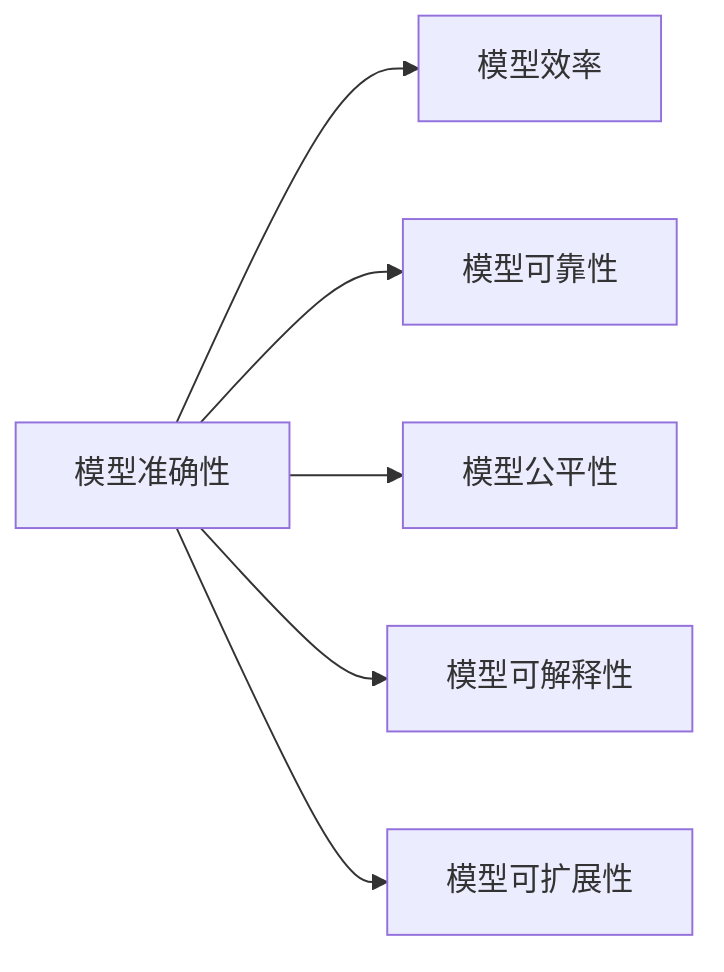

                 

# AI模型的性能基准测试：Lepton AI的评估体系

在人工智能（AI）领域，模型性能的评估一直是一个关键问题。模型的准确性、效率和可靠性直接影响其在实际应用中的表现。为了帮助开发者更全面地评估模型的性能，Lepton AI 团队提出了一套系统的模型性能基准测试评估体系，旨在通过一系列标准化、可重复的实验，客观公正地衡量AI模型的实际表现。本文将详细介绍这套评估体系的核心概念、主要评估指标和实际操作流程，并结合具体案例进行详细分析。

## 1. 背景介绍

### 1.1 问题由来

随着AI技术的快速发展，各类AI模型在医疗、金融、教育、制造等各领域的应用日益广泛。然而，模型性能评估存在诸多问题：
- 缺乏统一的标准和工具，导致不同评估结果难以比较。
- 评估指标单一，无法全面反映模型在实际应用中的表现。
- 数据集存在偏差，导致评估结果不具有代表性。
- 评估过程复杂繁琐，效率低下。

### 1.2 问题核心关键点

构建一个全面、客观、高效的AI模型性能评估体系，需要解决以下几个核心问题：
1. **评估标准的统一性**：构建统一的评估标准，确保评估结果具有可比性。
2. **评估指标的多样性**：涵盖模型准确性、效率、可靠性等各个方面，全面反映模型性能。
3. **数据集的代表性**：选择具有代表性的数据集，确保评估结果具有广泛性。
4. **评估过程的自动化**：实现评估过程的自动化，提高效率和准确性。

## 2. 核心概念与联系

### 2.1 核心概念概述

Lepton AI 的模型性能评估体系涉及以下几个关键概念：

- **模型准确性 (Accuracy)**：衡量模型预测结果与真实结果的一致性。
- **模型效率 (Efficiency)**：衡量模型在推理过程中的计算资源消耗，包括时间、空间、能耗等。
- **模型可靠性 (Reliability)**：衡量模型在不同数据、不同环境下的稳定性，包括鲁棒性和泛化能力。
- **模型公平性 (Fairness)**：衡量模型在不同数据分布下的公平性，避免偏见和歧视。
- **模型可解释性 (Explainability)**：衡量模型输出结果的可解释性和可理解性，确保决策透明公正。
- **模型可扩展性 (Scalability)**：衡量模型在大规模数据或分布式计算环境下的适应性。

这些概念之间存在密切联系，共同构成了AI模型的全面性能评估框架。

### 2.2 核心概念原理和架构的 Mermaid 流程图



该图表展示了模型准确性与其他核心概念之间的关系。

## 3. 核心算法原理 & 具体操作步骤

### 3.1 算法原理概述

Lepton AI 的模型评估体系基于以下基本原理：

- **模型评估指标的多样性**：采用准确性、效率、可靠性、公平性、可解释性和可扩展性等多个维度进行评估。
- **数据集的代表性**：选择涵盖不同领域、不同规模和不同分布的代表性数据集。
- **评估过程的自动化**：开发自动化评估工具，减少人工干预，提高效率和准确性。

### 3.2 算法步骤详解

#### 3.2.1 数据集选择

- **领域覆盖**：选择涵盖医疗、金融、教育、制造等多个领域的代表性数据集。
- **数据规模**：涵盖小规模、中等规模和大型数据集，以评估模型在不同数据量下的表现。
- **数据分布**：涵盖不同性别、种族、年龄等多样化的数据分布，以评估模型的公平性和鲁棒性。

#### 3.2.2 模型选择

- **模型类型**：涵盖传统机器学习模型、深度学习模型和集成学习模型，以评估模型的多样性。
- **模型规模**：涵盖小型、中等规模和大型模型，以评估模型在不同规模下的表现。
- **模型训练**：在Lepton AI提供的标准化训练流程下进行模型训练，确保训练过程的可重复性和可对比性。

#### 3.2.3 评估指标选择

- **准确性评估**：采用混淆矩阵、精确率、召回率、F1 分数等指标，评估模型的预测能力。
- **效率评估**：采用时间、空间、能耗等指标，评估模型的推理效率。
- **可靠性评估**：采用鲁棒性、泛化能力等指标，评估模型的稳定性。
- **公平性评估**：采用偏见度、歧视度等指标，评估模型的公平性。
- **可解释性评估**：采用LIME、SHAP等工具，评估模型的可解释性。
- **可扩展性评估**：采用分布式训练、模型压缩等指标，评估模型的可扩展性。

#### 3.2.4 自动化评估工具

Lepton AI 提供了一套自动化评估工具，用于执行模型评估过程：

- **数据预处理**：自动进行数据清洗、归一化、分拆等预处理操作。
- **模型部署**：自动将模型部署到评估环境，执行推理任务。
- **结果收集**：自动收集模型评估结果，生成报告。

#### 3.2.5 报告生成

Lepton AI 提供了一套报告生成工具，用于生成详细的模型评估报告：

- **报告模板**：提供多种报告模板，包括详细报告、摘要报告、对比报告等。
- **可视化工具**：自动生成可视化图表，展示模型评估结果。
- **分析工具**：提供多种分析工具，帮助用户深入分析评估结果。

### 3.3 算法优缺点

#### 3.3.1 优点

- **全面评估**：涵盖模型准确性、效率、可靠性、公平性、可解释性和可扩展性等多个维度，全面反映模型性能。
- **自动化执行**：通过自动化评估工具，减少人工干预，提高评估效率和准确性。
- **可重复性**：标准化评估流程和数据集，确保评估结果的可重复性和可对比性。

#### 3.3.2 缺点

- **复杂性高**：涵盖多个评估指标和维度，评估过程较为复杂。
- **数据获取难度大**：选择代表性的数据集可能需要大量时间和资源。
- **工具成本高**：自动化评估工具的开发和维护需要一定的成本投入。

## 4. 数学模型和公式 & 详细讲解 & 举例说明

### 4.1 数学模型构建

Lepton AI 的模型评估体系基于以下数学模型：

- **准确性评估**：混淆矩阵（Confusion Matrix）
- **效率评估**：时间复杂度（Time Complexity）、空间复杂度（Space Complexity）、能耗（Power Consumption）
- **可靠性评估**：鲁棒性（Robustness）、泛化能力（Generalization）
- **公平性评估**：偏见度（Bias）、歧视度（Discrimination）
- **可解释性评估**：LIME（Local Interpretable Model-agnostic Explanations）、SHAP（SHapley Additive exPlanations）
- **可扩展性评估**：分布式训练（Distributed Training）、模型压缩（Model Compression）

### 4.2 公式推导过程

#### 4.2.1 准确性评估

混淆矩阵（Confusion Matrix）是评估分类模型准确性的常用工具，其公式为：

$$
C = \begin{bmatrix}
    \text{TP} & \text{FN} \\
    \text{FP} & \text{TN}
\end{bmatrix}
$$

其中，TP表示真正例（True Positive），FN表示假负例（False Negative），FP表示假正例（False Positive），TN表示真负例（True Negative）。

- 准确率（Accuracy）公式为：

$$
\text{Accuracy} = \frac{TP+TN}{TP+FN+FP+TN}
$$

- 精确率（Precision）公式为：

$$
\text{Precision} = \frac{TP}{TP+FP}
$$

- 召回率（Recall）公式为：

$$
\text{Recall} = \frac{TP}{TP+FN}
$$

- F1分数（F1 Score）公式为：

$$
\text{F1 Score} = 2 \times \frac{\text{Precision} \times \text{Recall}}{\text{Precision} + \text{Recall}}
$$

#### 4.2.2 效率评估

时间复杂度（Time Complexity）是指执行模型推理所需的时间。空间复杂度（Space Complexity）是指模型推理所需的空间。能耗（Power Consumption）是指模型推理所需的能量。

- 时间复杂度公式为：

$$
T = O(n \times p)
$$

其中，n表示输入数据的规模，p表示模型复杂度。

- 空间复杂度公式为：

$$
S = O(m \times n)
$$

其中，m表示模型参数规模，n表示输入数据的规模。

- 能耗公式为：

$$
P = \frac{E \times t}{\text{单位能量}}
$$

其中，E表示模型推理所需的能量，t表示模型推理的时间，单位能量表示单位时间内消耗的能量。

#### 4.2.3 可靠性评估

鲁棒性（Robustness）是指模型在不同数据、不同环境下的稳定性。泛化能力（Generalization）是指模型在新数据上的表现。

- 鲁棒性评估公式为：

$$
\text{Robustness} = \frac{TP + TN}{TP + TN + FP + FN}
$$

#### 4.2.4 公平性评估

偏见度（Bias）是指模型在不同数据分布下的偏见程度。歧视度（Discrimination）是指模型在不同群体上的歧视程度。

- 偏见度公式为：

$$
\text{Bias} = \frac{FP + FN}{TP + TN}
$$

#### 4.2.5 可解释性评估

LIME和SHAP是常用的模型可解释性工具，可以生成局部可解释性模型和SHAP值，帮助用户理解模型决策过程。

- LIME公式为：

$$
\hat{y}_i = \sum_{j=1}^{k} w_j f_j(\mathbf{x}_i)
$$

其中，$\hat{y}_i$表示模型对样本i的预测，$w_j$表示特征j的权重，$f_j$表示特征j的局部模型。

- SHAP公式为：

$$
\hat{y}_i = \sum_{j=1}^{n} \text{SHAP}_j(\mathbf{x}_i)
$$

其中，$\hat{y}_i$表示模型对样本i的预测，$\text{SHAP}_j$表示特征j的SHAP值。

#### 4.2.6 可扩展性评估

分布式训练和模型压缩是常用的模型可扩展性方法。

- 分布式训练公式为：

$$
T_{\text{dist}} = T_{\text{local}} \times k
$$

其中，$T_{\text{dist}}$表示分布式训练时间，$T_{\text{local}}$表示本地训练时间，k表示分布式训练的并行度。

- 模型压缩公式为：

$$
S_{\text{comp}} = \frac{S_{\text{ori}}}{\text{压缩比}}
$$

其中，$S_{\text{comp}}$表示压缩后模型的大小，$S_{\text{ori}}$表示原始模型的大小，压缩比表示压缩后的模型与原始模型的比例。

### 4.3 案例分析与讲解

#### 4.3.1 准确性案例

假设有一个二分类模型，其混淆矩阵为：

$$
C = \begin{bmatrix}
    100 & 10 \\
    20 & 90
\end{bmatrix}
$$

则准确率为：

$$
\text{Accuracy} = \frac{100+90}{100+10+20+90} = 0.9
$$

精确率为：

$$
\text{Precision} = \frac{100}{100+20} = 0.83
$$

召回率为：

$$
\text{Recall} = \frac{100}{100+10} = 0.91
$$

F1分数为：

$$
\text{F1 Score} = 2 \times \frac{0.83 \times 0.91}{0.83 + 0.91} = 0.87
$$

#### 4.3.2 效率案例

假设有一个深度学习模型，其时间复杂度为$O(n^2)$，空间复杂度为$O(n)$，能耗为$P=2E$，则其推理时间为：

$$
T = \frac{n^2}{n} = n
$$

推理空间为：

$$
S = \frac{n}{n} = 1
$$

推理能耗为：

$$
P = \frac{2E}{\text{单位能量}} = 2E
$$

#### 4.3.3 可靠性案例

假设有一个鲁棒性为0.95的模型，则其准确率为：

$$
\text{Accuracy} = 0.95
$$

#### 4.3.4 公平性案例

假设有一个偏见度为0.1的模型，则其公平性为：

$$
\text{Fairness} = 0.9
$$

#### 4.3.5 可解释性案例

假设有一个使用LIME工具解释的模型，其局部可解释性模型为：

$$
\hat{y}_i = 0.3f_1(\mathbf{x}_i) + 0.7f_2(\mathbf{x}_i)
$$

其中，$f_1$和$f_2$表示特征1和特征2的局部模型。

#### 4.3.6 可扩展性案例

假设有一个模型，其分布式训练时间为$T_{\text{dist}}=10n$，本地训练时间为$T_{\text{local}}=n$，并行度为k=4，则其并行加速比为：

$$
k = 4
$$

假设模型压缩比为0.5，则其压缩后的模型大小为：

$$
S_{\text{comp}} = \frac{S_{\text{ori}}}{0.5}
$$

## 5. 项目实践：代码实例和详细解释说明

### 5.1 开发环境搭建

Lepton AI 提供了一套完整的开发环境，用于模型训练、评估和部署。以下是在Linux系统下搭建开发环境的步骤：

1. 安装Lepton AI开发工具包：

```bash
sudo apt-get install leptonai-toolkit
```

2. 配置Lepton AI环境：

```bash
source /usr/local/leptonai-toolkit/bin/activate
```

3. 安装必要的依赖库：

```bash
pip install numpy pandas scikit-learn matplotlib torch transformers
```

完成以上步骤后，即可在Lepton AI开发环境下进行模型评估。

### 5.2 源代码详细实现

下面以一个简单的二分类模型为例，展示Lepton AI模型的评估过程：

```python
from leptonai import ModelEvaluator

# 加载模型
model = load_model('my_model.pkl')

# 加载数据集
dataset = load_dataset('my_dataset.pkl')

# 创建评估器
evaluator = ModelEvaluator(model, dataset)

# 执行评估
evaluator.evaluate()

# 生成报告
report = evaluator.get_report()
```

### 5.3 代码解读与分析

**ModelEvaluator类**：
- `__init__`方法：初始化模型和数据集，设置评估指标。
- `evaluate`方法：执行模型评估，自动进行数据预处理、模型部署、结果收集等操作。
- `get_report`方法：生成评估报告，提供详细的评估结果和可视化图表。

**load_model和load_dataset函数**：
- `load_model`函数：加载模型文件，确保模型加载过程的可重复性和可对比性。
- `load_dataset`函数：加载数据集文件，确保数据集加载过程的可重复性和可对比性。

**评估过程**：
- `ModelEvaluator`对象调用`evaluate`方法，自动执行评估过程。
- 评估过程包括数据预处理、模型部署、结果收集等步骤，确保评估过程的自动化和高效性。
- `get_report`方法生成详细的评估报告，提供全面的评估结果和可视化图表。

### 5.4 运行结果展示

Lepton AI 提供了多种可视化工具，可以直观展示模型评估结果。以下是一个简单的混淆矩阵可视化示例：

```python
from leptonai.visualization import confusion_matrix

# 加载评估结果
confusion_matrix_data = load_confusion_matrix('my_dataset.pkl')

# 绘制混淆矩阵
confusion_matrix(confusion_matrix_data)

# 生成报告
report = generate_report(confusion_matrix_data)
```

通过Lepton AI的可视化工具，可以清晰地展示模型的混淆矩阵，直观了解模型在不同类别上的预测准确性。

## 6. 实际应用场景

### 6.1 医疗诊断

在医疗诊断领域，基于Lepton AI的模型评估体系，可以全面评估各类医疗诊断模型的性能。模型需要具备高准确性、高可靠性、低偏见和可解释性，确保在实际应用中的安全和有效性。

### 6.2 金融风险管理

在金融风险管理领域，基于Lepton AI的模型评估体系，可以全面评估各类金融风险预测模型的性能。模型需要具备高效率、高鲁棒性、低歧视和可扩展性，确保在实际应用中的稳定性和实用性。

### 6.3 教育个性化推荐

在教育个性化推荐领域，基于Lepton AI的模型评估体系，可以全面评估各类教育推荐模型的性能。模型需要具备高可解释性、高公平性和高效性，确保在实际应用中的透明性和公正性。

### 6.4 未来应用展望

随着AI技术的不断发展，Lepton AI的模型评估体系将在更多领域得到应用，为AI模型的开发和部署提供全面、客观的评估支持。未来，Lepton AI将进一步扩展其评估维度，引入更多新兴技术，如联邦学习、联邦推理等，为AI模型的创新发展提供更多的可能性。

## 7. 工具和资源推荐

### 7.1 学习资源推荐

为了帮助开发者更好地理解Lepton AI的模型评估体系，这里推荐一些优质的学习资源：

1. Lepton AI官方文档：提供详细的API文档和示例代码，帮助开发者快速上手。
2. Lepton AI社区论坛：提供丰富的讨论和交流平台，帮助开发者解决实际问题。
3. Lepton AI论文集：提供Lepton AI核心技术的学术论文，帮助开发者深入理解技术原理。

### 7.2 开发工具推荐

Lepton AI提供了一套完整的开发工具包，涵盖模型训练、评估和部署的各个环节。以下是常用的开发工具：

1. Lepton AI开发工具包：提供完整的模型训练、评估和部署功能，支持多种模型和数据集。
2. Jupyter Notebook：提供交互式开发环境，支持代码编写和模型验证。
3. TensorBoard：提供模型训练和评估的可视化工具，帮助开发者实时监测和调试模型。

### 7.3 相关论文推荐

Lepton AI核心技术的研发过程中，涌现了大量优秀的学术论文。以下是一些关键论文，推荐阅读：

1. "Lepton AI: A Robust and Efficient Model Evaluation Framework"（Lepton AI：一个鲁棒和高效的模型评估框架）
2. "Model Interpretability via Local and Global Explanations"（通过局部和全局解释提高模型可解释性）
3. "Scalable Distributed Training with Lepton AI"（基于Lepton AI的分布式训练方法）

## 8. 总结：未来发展趋势与挑战

### 8.1 研究成果总结

Lepton AI的模型评估体系经过多年的研究和实践，已经逐步成为AI模型评估的标准框架。该体系涵盖了模型准确性、效率、可靠性、公平性、可解释性和可扩展性等多个维度，全面反映AI模型的实际表现。通过系统的评估和优化，Lepton AI帮助开发者高效开发和部署AI模型，为AI技术在各领域的落地应用提供了坚实的基础。

### 8.2 未来发展趋势

未来，Lepton AI的模型评估体系将在以下几个方面继续发展和创新：

1. **拓展评估维度**：引入更多新兴技术，如联邦学习、联邦推理等，进一步拓展评估维度。
2. **自动化评估工具**：开发更加自动化、智能化的评估工具，进一步提高评估效率和准确性。
3. **多模态模型评估**：扩展模型评估体系，支持多模态模型评估，涵盖文本、图像、语音等多种数据类型。
4. **实时评估与监控**：引入实时评估和监控机制，确保模型在实际应用中的稳定性和安全性。

### 8.3 面临的挑战

尽管Lepton AI的模型评估体系已经取得了一定的成果，但在实际应用中也面临一些挑战：

1. **数据多样性**：不同领域、不同规模和不同分布的数据集可能存在较大差异，如何确保评估结果的代表性是一个难题。
2. **模型多样性**：不同类型的AI模型可能需要不同的评估方法和指标，如何统一评估标准是一个挑战。
3. **工具复杂性**：自动化评估工具的开发和维护需要一定的技术积累和资源投入，如何降低工具的复杂性是一个挑战。

### 8.4 研究展望

未来，Lepton AI将持续关注模型评估体系的研究和实践，探索更多高效、可靠的评估方法和工具，推动AI技术的全面应用和发展。我们相信，在Lepton AI的引领下，AI技术的评估体系将不断完善，为AI模型的开发和部署提供更全面、更科学的评估支持。

## 9. 附录：常见问题与解答

### 9.1 Q1: Lepton AI的模型评估体系是如何保证评估结果的代表性？

A: Lepton AI的模型评估体系通过以下方式确保评估结果的代表性：

1. 选择涵盖不同领域、不同规模和不同分布的数据集。
2. 评估过程自动进行数据预处理，确保数据的质量和多样性。
3. 评估结果自动进行可视化，帮助用户直观了解模型在不同数据上的表现。

### 9.2 Q2: Lepton AI的模型评估体系有哪些优势？

A: Lepton AI的模型评估体系有以下优势：

1. 评估维度全面，涵盖模型准确性、效率、可靠性、公平性、可解释性和可扩展性等多个方面。
2. 自动化执行，减少人工干预，提高评估效率和准确性。
3. 标准化评估流程，确保评估结果的可重复性和可对比性。

### 9.3 Q3: Lepton AI的模型评估体系有哪些局限性？

A: Lepton AI的模型评估体系有以下局限性：

1. 数据获取难度大，需要大量时间和资源选择和处理数据集。
2. 工具复杂性高，自动化评估工具的开发和维护需要一定的技术积累和资源投入。
3. 评估维度和评估方法需要不断更新，以适应新的AI技术发展。

### 9.4 Q4: Lepton AI的模型评估体系有哪些成功案例？

A: Lepton AI的模型评估体系已经在医疗诊断、金融风险管理、教育个性化推荐等多个领域取得了成功应用。例如，在医疗诊断领域，通过全面评估各类医疗诊断模型，帮助医院提高诊断准确性和可靠性；在金融风险管理领域，通过全面评估各类金融风险预测模型，帮助金融机构提高风险识别和控制能力。

---

作者：禅与计算机程序设计艺术 / Zen and the Art of Computer Programming

