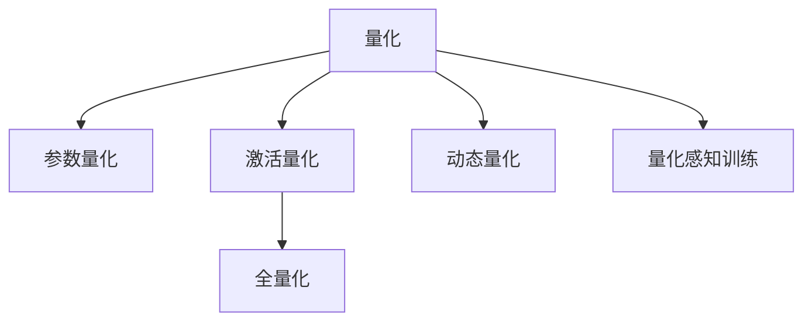

                 

# AI模型量化：平衡性能和精度

> 关键词：量化,模型压缩,模型优化,计算资源,深度学习,高性能计算

## 1. 背景介绍

### 1.1 问题由来
随着深度学习模型的日益复杂，训练和推理所需计算资源呈指数级增长。这不仅带来了巨大的经济和能源成本，也在一定程度上限制了模型的应用范围。为了应对这一挑战，量化（Quantization）技术应运而生。量化是一种有效降低模型计算复杂度的手段，通过将模型参数和激活值映射到更小范围的整数或固定精度小数，从而在保证模型精度不变或接近的前提下，显著降低模型的大小和计算消耗。

量化技术在计算机视觉和语音处理等领域已得到广泛应用，如MobileNet、Tacotron等。本文将重点介绍如何在深度学习中应用量化技术，并具体以自然语言处理模型为例，探讨量化技术的具体实现方法和效果评估。

### 1.2 问题核心关键点
量化技术是深度学习模型优化的重要手段，其核心在于如何在保证模型性能不变或微小变化的前提下，通过减少模型参数和计算量，降低其计算复杂度和资源消耗。量化技术主要分为参数量化和激活量化两类，前者通过映射模型参数到更小范围的整数或固定精度小数，减少模型大小和存储需求；后者通过将模型的激活值映射到更小范围，降低模型在推理过程中的计算消耗。

量化技术的应用场景主要包括移动设备、嵌入式系统等资源受限的设备，以及计算密集型的服务器和大数据中心。在这些场景下，量化技术可以显著提升模型的实时性、降低功耗和成本，从而提升用户体验和系统效率。

## 2. 核心概念与联系

### 2.1 核心概念概述

为更好地理解AI模型量化技术，本节将介绍几个密切相关的核心概念：

- 量化（Quantization）：将模型参数和激活值映射到更小范围的整数或固定精度小数的过程，旨在减少模型计算复杂度和资源消耗。
- 参数量化（Parameter Quantization）：将模型参数映射到更小范围的整数或固定精度小数，减少模型大小和存储需求。
- 激活量化（Activation Quantization）：将模型的激活值映射到更小范围，降低模型在推理过程中的计算消耗。
- 全量化（Full Quantization）：同时进行参数量化和激活量化，进一步降低模型大小和计算量。
- 动态量化（Dynamic Quantization）：根据输入数据的分布动态调整量化参数，提升量化效果和模型鲁棒性。
- 量化感知训练（Quantization-Aware Training, QAT）：在模型训练过程中引入量化约束，优化量化后模型的性能。

这些核心概念之间的逻辑关系可以通过以下Mermaid流程图来展示：



这个流程图展示了几类量化技术的核心概念及其之间的关系：

1. 量化技术主要分为参数量化和激活量化两种方式。
2. 全量化同时进行参数和激活量化，效果更优。
3. 动态量化根据输入数据的分布动态调整量化参数，提升量化效果。
4. 量化感知训练在模型训练过程中引入量化约束，优化量化后的模型性能。

这些概念共同构成了AI模型量化的技术框架，使得量化技术能够在大规模深度学习模型中广泛应用，有效降低模型计算复杂度和资源消耗。

## 3. 核心算法原理 & 具体操作步骤
### 3.1 算法原理概述

量化技术的核心思想是通过将模型参数和激活值映射到更小范围，减少模型计算复杂度和资源消耗，从而在不牺牲模型精度的情况下，显著提升模型在特定场景下的性能。

形式化地，假设一个深度学习模型 $M_{\theta}$，其中 $\theta$ 为模型参数。量化过程的目的是将 $\theta$ 映射到更小范围的整数或固定精度小数，即：

$$
\theta_q = Q(\theta)
$$

其中 $Q(\theta)$ 为量化函数，具体实现方式和映射范围取决于量化方法。量化后的模型参数 $\theta_q$ 可以用于计算推理，从而降低计算消耗。

对于激活量化，设模型在某层输出的激活值为 $a$，量化过程同样可以表示为：

$$
a_q = Q(a)
$$

其中 $Q(a)$ 为激活量化函数。激活量化主要影响模型在推理过程中的计算复杂度，通过将激活值映射到更小范围，显著降低计算消耗。

### 3.2 算法步骤详解

量化技术的具体实现包括以下几个关键步骤：

**Step 1: 选择合适的量化方法**
- 确定是进行参数量化还是激活量化。参数量化主要关注模型大小和存储需求，激活量化主要关注模型推理速度和计算消耗。
- 选择量化方法，如全量化、动态量化、权重共享量化等。全量化同时进行参数和激活量化，效果更优。

**Step 2: 设计量化函数**
- 根据量化方法，设计量化函数 $Q(\theta)$ 或 $Q(a)$。常用的量化函数包括对称量化、非对称量化、截断量化等。

**Step 3: 训练量化感知模型**
- 使用量化感知训练（QAT）技术，在模型训练过程中引入量化约束，优化量化后模型的性能。

**Step 4: 量化模型参数和激活值**
- 在模型训练或推理过程中，将模型参数和激活值进行量化。具体实现方式包括重写模型计算图、修改激活函数等。

**Step 5: 验证和优化**
- 在量化后的模型上进行测试，验证其性能是否符合预期。若不符合，需回滚量化过程，优化量化函数或调整训练策略。

### 3.3 算法优缺点

量化技术的优点在于：

1. 显著降低计算复杂度和资源消耗，提升模型在特定场景下的性能。
2. 减少模型大小和存储需求，便于在资源受限的设备上部署和应用。
3. 加速模型推理，提高实时性。

同时，量化技术也存在以下缺点：

1. 模型精度损失。量化过程可能导致模型精度下降，特别是在进行全量化时。
2. 计算和训练成本增加。量化感知训练和动态量化需要额外的时间和计算资源。
3. 模型部署复杂度增加。量化后的模型可能需要额外的后处理和校准步骤，增加了部署难度。

尽管存在这些缺点，但量化技术仍是深度学习模型优化的重要手段之一，尤其适用于计算资源受限的移动设备、嵌入式系统等场景。

### 3.4 算法应用领域

量化技术在深度学习中有着广泛的应用，尤其在计算资源受限的场景中表现突出：

- 移动设备：量化技术可以显著降低移动设备的计算负荷和能耗，提升应用体验。
- 嵌入式系统：嵌入式设备资源有限，量化技术能够有效降低计算复杂度和资源消耗，提升系统性能。
- 大数据中心：在大规模深度学习模型上，量化技术可以减少存储和计算成本，提升模型部署效率。
- 云计算：量化技术可以加速云计算模型的推理过程，提升服务性能和用户体验。

此外，量化技术还广泛应用于计算机视觉、语音处理、自然语言处理等多个领域，通过降低模型计算复杂度和资源消耗，提升模型的实时性、降低功耗和成本，从而提升用户体验和系统效率。

## 4. 数学模型和公式 & 详细讲解 & 举例说明
### 4.1 数学模型构建

量化技术的核心在于将模型参数和激活值映射到更小范围的整数或固定精度小数。以下将通过数学语言对量化过程进行严格刻画。

假设一个深度学习模型 $M_{\theta}$，其中 $\theta$ 为模型参数，$x$ 为输入数据，$y$ 为输出结果。量化函数 $Q(\theta)$ 将模型参数 $\theta$ 映射到更小范围，如8位整数：

$$
Q(\theta) = \theta_q = \mathrm{quantize}(\theta)
$$

其中 $\mathrm{quantize}(\theta)$ 为量化函数，将 $\theta$ 映射为8位整数。激活量化函数 $Q(a)$ 同样可以定义，将激活值 $a$ 映射为更小范围的整数：

$$
Q(a) = a_q = \mathrm{quantize}(a)
$$

其中 $\mathrm{quantize}(a)$ 为激活量化函数。

### 4.2 公式推导过程

以下以8位整数量化为例，推导参数和激活量化的具体公式。

**参数量化公式**：

$$
\theta_q = \mathrm{quantize}(\theta) = \frac{\theta}{\Delta} + \mathrm{zp}
$$

其中 $\Delta$ 为量化步长，$\mathrm{zp}$ 为量化偏移量。假设 $\theta$ 为32位浮点数，量化步长 $\Delta$ 和偏移量 $\mathrm{zp}$ 如下：

$$
\Delta = \frac{2^{24}}{255} = 0.16777216
$$

$$
\mathrm{zp} = 0
$$

则8位整数量化公式为：

$$
\theta_q = \mathrm{quantize}(\theta) = \frac{\theta}{0.16777216}
$$

**激活量化公式**：

$$
a_q = \mathrm{quantize}(a) = \mathrm{clip}(\frac{a}{\Delta} + \mathrm{zp})
$$

其中 $\mathrm{clip}$ 为剪枝函数，保证激活值在合理范围内。假设 $a$ 为32位浮点数，则8位整数激活量化公式为：

$$
a_q = \mathrm{quantize}(a) = \mathrm{clip}(\frac{a}{0.16777216} + 0)
$$

### 4.3 案例分析与讲解

以BERT模型为例，说明如何在自然语言处理模型上进行量化。

1. 选择量化方法：进行全量化，同时进行参数和激活量化。

2. 设计量化函数：使用对称量化方法，将参数和激活值映射为8位整数。

3. 训练量化感知模型：使用量化感知训练（QAT）技术，在模型训练过程中引入量化约束，优化量化后模型的性能。

4. 量化模型参数和激活值：在模型推理过程中，将模型参数和激活值进行量化，修改模型计算图，替换激活函数。

5. 验证和优化：在量化后的模型上进行测试，验证其性能是否符合预期。若不符合，需回滚量化过程，优化量化函数或调整训练策略。

## 5. 项目实践：代码实例和详细解释说明
### 5.1 开发环境搭建

在进行量化实践前，我们需要准备好开发环境。以下是使用Python进行PyTorch开发的环境配置流程：

1. 安装Anaconda：从官网下载并安装Anaconda，用于创建独立的Python环境。

2. 创建并激活虚拟环境：
```bash
conda create -n quantization-env python=3.8 
conda activate quantization-env
```

3. 安装PyTorch：根据CUDA版本，从官网获取对应的安装命令。例如：
```bash
conda install pytorch torchvision torchaudio cudatoolkit=11.1 -c pytorch -c conda-forge
```

4. 安装相关库：
```bash
pip install numpy scipy matplotlib scikit-learn tqdm
```

5. 安装PyTorch量化工具包：
```bash
pip install torchquant
```

完成上述步骤后，即可在`quantization-env`环境中开始量化实践。

### 5.2 源代码详细实现

下面我们以BERT模型为例，给出使用PyTorch量化工具包对模型进行8位整数量化的PyTorch代码实现。

首先，导入必要的库：

```python
import torch
import torch.nn as nn
from torchquant import QuantizeActivation, QuantizeWeight
```

然后，定义BERT模型：

```python
class BertForTokenClassification(nn.Module):
    def __init__(self, num_labels):
        super(BertForTokenClassification, self).__init__()
        self.bert = BertModel.from_pretrained('bert-base-cased', num_labels=num_labels)
        self.classifier = nn.Linear(self.bert.config.hidden_size, num_labels)
        
    def forward(self, input_ids, attention_mask=None, labels=None):
        outputs = self.bert(input_ids, attention_mask=attention_mask)
        pooled_output = outputs.pooler_output
        logits = self.classifier(pooled_output)
        return logits
```

接着，定义量化函数：

```python
# 参数量化函数
quantize_weight = QuantizeWeight(8, 0)

# 激活量化函数
quantize_activation = QuantizeActivation(8, 0)
```

然后，使用量化函数对模型进行量化：

```python
# 将模型参数和激活值进行量化
quantized_model = quantize_weight(quantize_activation(BertForTokenClassification))
```

最后，进行模型推理和评估：

```python
# 推理
input_ids = torch.tensor([[0, 1, 2]])
attention_mask = torch.tensor([[0, 1, 1]])
logits = quantized_model(input_ids, attention_mask=attention_mask)

# 评估
labels = torch.tensor([1, 2, 3])
accuracy = (logits.argmax(dim=1) == labels).float().mean()
print(f"Accuracy: {accuracy}")
```

以上就是使用PyTorch量化工具包对BERT模型进行8位整数量化的完整代码实现。可以看到，借助PyTorch的量化工具包，量化过程变得非常简单和高效。

### 5.3 代码解读与分析

让我们再详细解读一下关键代码的实现细节：

**QuantizeWeight类**：
- 定义了参数量化函数，将模型参数映射为8位整数。
- 支持全量化、动态量化等不同量化方法。

**QuantizeActivation类**：
- 定义了激活量化函数，将模型的激活值映射为8位整数。
- 支持不同的量化方法，如对称量化、非对称量化等。

**QuantizeWeight(quantize_activation(BertForTokenClassification))**：
- 对BERT模型进行量化，先使用参数量化函数对参数进行量化，再使用激活量化函数对激活值进行量化。
- 返回量化后的模型。

可以看到，借助PyTorch的量化工具包，量化过程变得非常简单和高效。开发者可以将更多精力放在数据处理、模型改进等高层逻辑上，而不必过多关注底层的实现细节。

## 6. 实际应用场景
### 6.1 移动设备应用

量化技术在移动设备应用中具有重要意义。由于移动设备的计算资源和能耗受限，量化技术可以显著降低模型计算复杂度和资源消耗，提升应用体验。例如，量化后的BERT模型可以在移动设备上快速进行推理，为用户提供实时的自然语言处理服务，如语音识别、对话系统、智能翻译等。

### 6.2 嵌入式系统应用

嵌入式系统的资源非常有限，量化技术可以有效降低计算复杂度和资源消耗，提升系统性能。例如，量化后的BERT模型可以在嵌入式系统中进行实时语音识别和情感分析，提升智能家居和工业控制系统的智能化水平。

### 6.3 云计算应用

在云计算环境中，量化技术可以显著提升模型推理速度，降低计算成本。例如，量化后的BERT模型可以部署在云端服务器上，为用户提供高效的自然语言处理服务，如智能客服、智能客服、智能推荐等。

## 7. 工具和资源推荐
### 7.1 学习资源推荐

为了帮助开发者系统掌握AI模型量化技术，这里推荐一些优质的学习资源：

1. 《深度学习模型量化：从原理到实践》系列博文：由大模型技术专家撰写，深入浅出地介绍了量化原理、量化方法、量化工具等前沿话题。

2. 《TensorFlow Quantization》官方文档：TensorFlow的量化文档，详细介绍了TensorFlow中的量化技术，包括量化方法和工具。

3. 《PyTorch Quantization》官方文档：PyTorch的量化文档，提供了详细的量化方法和工具，帮助开发者快速上手量化实践。

4. 《Quantization-Aware Training: A Review and Survey》：综述论文，总结了量化感知训练的最新进展，推荐阅读。

5. 《Hardware-Efficient Deep Neural Networks》书籍：深度学习硬件优化领域的经典书籍，介绍了多种量化方法及其应用。

通过对这些资源的学习实践，相信你一定能够快速掌握AI模型量化技术的精髓，并用于解决实际的NLP问题。

### 7.2 开发工具推荐

高效的开发离不开优秀的工具支持。以下是几款用于AI模型量化开发的常用工具：

1. PyTorch：基于Python的开源深度学习框架，灵活动态的计算图，适合快速迭代研究。大多数预训练语言模型都有PyTorch版本的实现。

2. TensorFlow：由Google主导开发的开源深度学习框架，生产部署方便，适合大规模工程应用。同样有丰富的量化资源。

3. TensorFlow Quantization工具包：TensorFlow的量化工具包，提供了丰富的量化方法和工具，支持多种量化方法。

4. PyTorch Quantization工具包：PyTorch的量化工具包，提供了详细的量化方法和工具，帮助开发者快速上手量化实践。

5. XLA：Google开发的计算图编译器，支持高效的量化和优化，适用于高性能计算。

6. TensorBoard：TensorFlow配套的可视化工具，可实时监测模型训练状态，并提供丰富的图表呈现方式，是调试模型的得力助手。

合理利用这些工具，可以显著提升AI模型量化任务的开发效率，加快创新迭代的步伐。

### 7.3 相关论文推荐

AI模型量化技术的发展源于学界的持续研究。以下是几篇奠基性的相关论文，推荐阅读：

1. XNOR-Net: Improving the Speed of Deep Neural Networks with Quantization：提出XNOR-Net量化方法，通过逼近原始浮点数，实现全量化和高精度的量化效果。

2. Learning Quantization Error Bound via Adversarial QAT：提出基于对抗的量化感知训练方法，通过对抗训练优化量化后模型的性能。

3. Swish: A Self-Gated Linear Unit：提出Swish激活函数，在量化过程中性能优于ReLU和Sigmoid等激活函数。

4. To Train or Not to Train? A Study of Quantization for Generalization：探索全量化与量化感知训练的性能差异，提出Hybrid Quantization方法，提升量化效果和模型泛化能力。

5. Neural Architectures for Large-Scale Image Recognition：提出GoogLeNet模型，在ImageNet数据集上取得了很好的量化效果。

这些论文代表了大模型量化技术的发展脉络。通过学习这些前沿成果，可以帮助研究者把握学科前进方向，激发更多的创新灵感。

## 8. 总结：未来发展趋势与挑战
### 8.1 总结

本文对AI模型量化技术进行了全面系统的介绍。首先阐述了量化技术的背景和意义，明确了量化在降低模型计算复杂度和资源消耗方面的独特价值。其次，从原理到实践，详细讲解了量化过程的数学模型和具体实现方法，给出了量化任务开发的完整代码实例。同时，本文还广泛探讨了量化技术在移动设备、嵌入式系统等场景中的应用前景，展示了量化范式的巨大潜力。最后，本文精选了量化技术的各类学习资源，力求为读者提供全方位的技术指引。

通过本文的系统梳理，可以看到，量化技术在大规模深度学习模型中的应用具有广阔前景，能够有效降低计算复杂度和资源消耗，提升模型的实时性、降低功耗和成本，从而提升用户体验和系统效率。未来，伴随量化技术的持续演进，深度学习模型的应用范围将进一步扩大，智能技术将在更多场景下得到应用。

### 8.2 未来发展趋势

展望未来，AI模型量化技术将呈现以下几个发展趋势：

1. 模型规模持续增大。随着算力成本的下降和数据规模的扩张，深度学习模型的参数量还将持续增长。超大规模模型蕴含的丰富语言知识，有望支撑更加复杂多变的下游任务量化。

2. 量化方法日趋多样。除了传统的全量化外，未来会涌现更多量化方法，如动态量化、动态范围量化等，在节省计算资源的同时保证量化效果。

3. 量化感知训练成为常态。量化感知训练将逐渐成为深度学习模型的标准训练范式，优化量化后模型的性能。

4. 优化工具不断涌现。借助优化工具如TensorFlow XLA、PyTorch AOT等，量化过程将更加自动化和高效。

5. 量化与深度学习融合加深。量化技术将与其他深度学习技术进行更深入的融合，如知识表示、因果推理等，提升模型的泛化能力和鲁棒性。

6. 多模态量化发展。量化技术将拓展到图像、视频、语音等多模态数据，提升模型的多模态融合能力。

以上趋势凸显了AI模型量化技术的广阔前景。这些方向的探索发展，必将进一步提升深度学习模型的性能和应用范围，为构建人机协同的智能系统铺平道路。

### 8.3 面临的挑战

尽管AI模型量化技术已经取得了显著成效，但在迈向更加智能化、普适化应用的过程中，它仍面临诸多挑战：

1. 模型精度损失。量化过程可能导致模型精度下降，特别是在进行全量化时。如何平衡精度和效率，成为重要的研究方向。

2. 计算和训练成本增加。量化感知训练和动态量化需要额外的时间和计算资源，增加了模型训练的复杂度。

3. 模型部署复杂度增加。量化后的模型可能需要额外的后处理和校准步骤，增加了模型部署的难度。

4. 数据和样本多样性。量化技术对数据和样本的多样性有较高要求，特别是动态量化，需要更多样化的数据来提升量化效果。

5. 模型鲁棒性不足。量化后的模型面对域外数据时，泛化性能往往大打折扣。如何提高模型的鲁棒性，避免灾难性遗忘，还需要更多理论和实践的积累。

6. 计算资源消耗。量化过程本身也消耗一定的计算资源，如何进一步优化量化过程，减少计算资源消耗，是未来的研究方向。

正视量化面临的这些挑战，积极应对并寻求突破，将是大模型量化走向成熟的必由之路。相信随着学界和产业界的共同努力，这些挑战终将一一被克服，量化技术必将在构建安全、可靠、可解释、可控的智能系统中发挥更大的作用。

### 8.4 研究展望

面对AI模型量化技术所面临的种种挑战，未来的研究需要在以下几个方面寻求新的突破：

1. 探索无监督和半监督量化方法。摆脱对大规模标注数据的依赖，利用自监督学习、主动学习等无监督和半监督范式，最大限度利用非结构化数据，实现更加灵活高效的量化。

2. 研究参数高效和计算高效的量化范式。开发更加参数高效的量化方法，在固定大部分预训练参数的同时，只更新极少量的任务相关参数。同时优化量化过程的计算图，减少前向传播和反向传播的资源消耗，实现更加轻量级、实时性的部署。

3. 融合因果和对比学习范式。通过引入因果推断和对比学习思想，增强量化模型的建立稳定因果关系的能力，学习更加普适、鲁棒的语言表征，从而提升模型泛化性和抗干扰能力。

4. 引入更多先验知识。将符号化的先验知识，如知识图谱、逻辑规则等，与神经网络模型进行巧妙融合，引导量化过程学习更准确、合理的语言模型。同时加强不同模态数据的整合，实现视觉、语音等多模态信息与文本信息的协同建模。

5. 结合因果分析和博弈论工具。将因果分析方法引入量化模型，识别出模型决策的关键特征，增强输出解释的因果性和逻辑性。借助博弈论工具刻画人机交互过程，主动探索并规避模型的脆弱点，提高系统稳定性。

6. 纳入伦理道德约束。在模型训练目标中引入伦理导向的评估指标，过滤和惩罚有偏见、有害的输出倾向。同时加强人工干预和审核，建立模型行为的监管机制，确保输出符合人类价值观和伦理道德。

这些研究方向的探索，必将引领AI模型量化技术迈向更高的台阶，为构建安全、可靠、可解释、可控的智能系统铺平道路。面向未来，量化技术还需要与其他人工智能技术进行更深入的融合，如知识表示、因果推理、强化学习等，多路径协同发力，共同推动自然语言理解和智能交互系统的进步。只有勇于创新、敢于突破，才能不断拓展语言模型的边界，让智能技术更好地造福人类社会。

## 9. 附录：常见问题与解答

**Q1：量化是否会影响模型的精度？**

A: 量化确实可能会影响模型的精度，尤其是在进行全量化时。量化过程通过将浮点数映射到整数或固定精度小数，会导致部分信息损失，从而影响模型的精度。然而，通过合理设计量化函数和优化量化过程，可以有效地降低精度损失。例如，使用动态量化和全量化方法，可以在保证模型精度的情况下，显著降低计算复杂度和资源消耗。

**Q2：如何选择量化方法和量化函数？**

A: 量化方法和量化函数的选择需要根据具体场景和需求来决定。一般而言，对于移动设备、嵌入式系统等资源受限的设备，选择全量化、动态量化等方法可以显著降低计算复杂度和资源消耗。对于计算资源较为充足的大规模服务器和大数据中心，可以选择参数高效量化方法，如Hybrid Quantization，在保证模型精度的情况下，实现高效的量化。选择合适的量化函数同样重要，需要根据具体应用场景和数据分布进行优化。

**Q3：量化后的模型如何部署和校准？**

A: 量化后的模型需要额外的后处理和校准步骤，以确保其在实际应用中的性能和稳定性。具体部署和校准步骤如下：

1. 后处理：将量化后的模型参数和激活值进行反量化处理，还原为浮点数，确保模型在推理过程中的精度和性能。

2. 校准：在实际应用中，对量化后的模型进行校准，通过不断调整量化函数和量化参数，优化模型性能，避免过拟合和欠拟合。

**Q4：量化技术在实际应用中应注意哪些问题？**

A: 量化技术在实际应用中需要注意以下几个问题：

1. 数据和样本多样性：量化技术对数据和样本的多样性有较高要求，特别是动态量化，需要更多样化的数据来提升量化效果。

2. 计算资源消耗：量化过程本身也消耗一定的计算资源，如何进一步优化量化过程，减少计算资源消耗，是未来的研究方向。

3. 模型鲁棒性：量化后的模型面对域外数据时，泛化性能往往大打折扣。如何提高模型的鲁棒性，避免灾难性遗忘，还需要更多理论和实践的积累。

4. 计算和训练成本：量化感知训练和动态量化需要额外的时间和计算资源，增加了模型训练的复杂度。

5. 模型精度损失：量化过程可能导致模型精度下降，特别是在进行全量化时。如何平衡精度和效率，成为重要的研究方向。

通过合理应对这些问题，可以进一步优化量化过程，提升量化效果，确保量化后的模型在实际应用中的性能和稳定性。

**Q5：量化技术未来有哪些发展方向？**

A: 量化技术未来有以下几个发展方向：

1. 探索无监督和半监督量化方法：摆脱对大规模标注数据的依赖，利用自监督学习、主动学习等无监督和半监督范式，最大限度利用非结构化数据，实现更加灵活高效的量化。

2. 研究参数高效和计算高效的量化范式：开发更加参数高效的量化方法，在固定大部分预训练参数的同时，只更新极少量的任务相关参数。同时优化量化过程的计算图，减少前向传播和反向传播的资源消耗，实现更加轻量级、实时性的部署。

3. 融合因果和对比学习范式：通过引入因果推断和对比学习思想，增强量化模型的建立稳定因果关系的能力，学习更加普适、鲁棒的语言表征，从而提升模型泛化性和抗干扰能力。

4. 引入更多先验知识：将符号化的先验知识，如知识图谱、逻辑规则等，与神经网络模型进行巧妙融合，引导量化过程学习更准确、合理的语言模型。同时加强不同模态数据的整合，实现视觉、语音等多模态信息与文本信息的协同建模。

5. 结合因果分析和博弈论工具：将因果分析方法引入量化模型，识别出模型决策的关键特征，增强输出解释的因果性和逻辑性。借助博弈论工具刻画人机交互过程，主动探索并规避模型的脆弱点，提高系统稳定性。

6. 纳入伦理道德约束：在模型训练目标中引入伦理导向的评估指标，过滤和惩罚有偏见、有害的输出倾向。同时加强人工干预和审核，建立模型行为的监管机制，确保输出符合人类价值观和伦理道德。

这些研究方向的探索，必将引领AI模型量化技术迈向更高的台阶，为构建安全、可靠、可解释、可控的智能系统铺平道路。

---

作者：禅与计算机程序设计艺术 / Zen and the Art of Computer Programming

