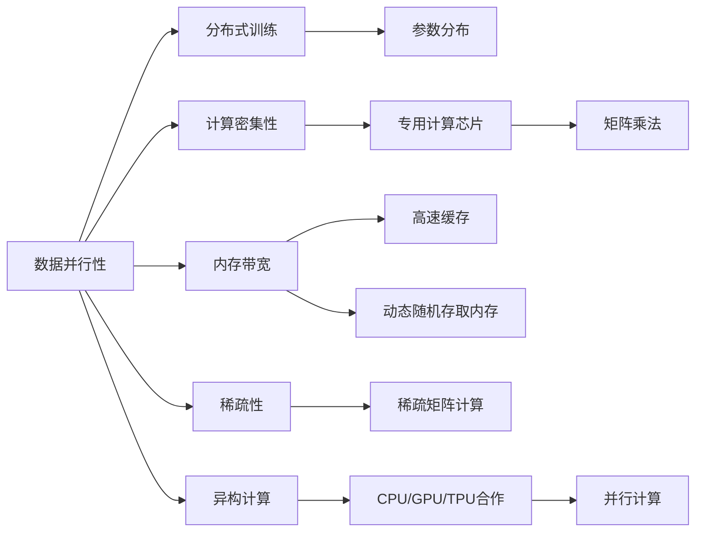

                 

# AI芯片设计：为LLM优化的硬件架构

## 1. 背景介绍

### 1.1 问题由来
近年来，随着深度学习技术的迅猛发展，大规模语言模型（Large Language Models, LLMs）如GPT、BERT、T5等在自然语言处理（NLP）领域取得了巨大突破。这些模型在大规模无标签文本数据上进行预训练，学习到丰富的语言知识和常识，能够对各种NLP任务进行微调，提升任务性能。

然而，这些模型通常基于通用芯片架构进行训练和推理，在性能、功耗和能效等方面难以发挥最佳性能。因此，设计专门针对LLM优化的AI芯片架构成为当务之急。这不仅可以提升模型训练和推理的效率，还能显著降低系统功耗和成本，为LLM的应用推广提供有力保障。

### 1.2 问题核心关键点
本节将详细介绍为LLM优化的AI芯片设计的核心概念和关键点：

- **数据并行性**：LLM通常具有大规模的数据并行性，可以通过分布式训练加速模型训练。
- **计算密集性**：LLM的计算需求通常集中在模型顶层的几个全连接层，可以针对这些关键部分进行计算加速。
- **内存带宽**：LLM在推理过程中需要大量的内存带宽进行数据读写，需要优化内存系统以提升数据吞吐量。
- **稀疏性**：LLM的参数矩阵往往稀疏，可以在芯片中采用稀疏矩阵计算来减少计算量。
- **异构计算**：LLM通常与其他硬件（如图形处理器、存储器等）配合使用，可以探索异构计算架构来提升整体系统效率。

## 2. 核心概念与联系

### 2.1 核心概念概述

为LLM优化的AI芯片设计，核心在于如何最大化利用模型的大规模并行性和计算密集性，同时优化内存系统和异构计算资源，以提升系统的性能、功耗和能效。

- **数据并行性**：通过将模型参数和数据切分为多个小份，在不同计算单元（如GPU、TPU等）上并行计算，以加速模型训练和推理。
- **计算密集性**：针对模型顶层计算密集的层进行加速，如使用专门的计算芯片（如Tensor Core）来处理矩阵乘法和向量积等计算。
- **内存带宽**：设计高效的内存系统，包括高速缓存（Cache）、动态随机存取内存（DRAM）和存储器层次结构（Memory Hierarchy），以减少内存延迟和带宽需求。
- **稀疏性**：利用LLM参数的稀疏性，设计稀疏矩阵计算引擎（Sparse Matrix Unit）来优化内存访问和计算。
- **异构计算**：结合不同类型硬件（如CPU、GPU、TPU等），设计异构计算架构，以充分发挥各硬件的优势，提升系统整体效率。

这些核心概念相互联系，共同构成了为LLM优化的AI芯片设计的框架。

### 2.2 核心概念原理和架构的 Mermaid 流程图



## 3. 核心算法原理 & 具体操作步骤

### 3.1 算法原理概述

为LLM优化的AI芯片设计，主要基于以下几个关键算法原理：

- **分布式训练**：通过将模型参数和数据切分为多个小份，在不同计算单元（如GPU、TPU等）上并行计算，以加速模型训练。
- **专用计算芯片**：针对模型顶层计算密集的层进行加速，如使用专门的计算芯片（如Tensor Core）来处理矩阵乘法和向量积等计算。
- **高速缓存**：设计高效的内存系统，包括高速缓存（Cache）、动态随机存取内存（DRAM）和存储器层次结构（Memory Hierarchy），以减少内存延迟和带宽需求。
- **稀疏矩阵计算**：利用LLM参数的稀疏性，设计稀疏矩阵计算引擎（Sparse Matrix Unit）来优化内存访问和计算。
- **异构计算架构**：结合不同类型硬件（如CPU、GPU、TPU等），设计异构计算架构，以充分发挥各硬件的优势，提升系统整体效率。

### 3.2 算法步骤详解

以下是为LLM优化的AI芯片设计的详细步骤：

**Step 1: 系统需求分析**

- 确定模型的规模和计算需求
- 设计系统功耗、能效、性能要求
- 评估数据并行性和内存带宽需求

**Step 2: 硬件设计**

- 选择计算芯片类型（如CPU、GPU、TPU）
- 设计专用的计算芯片（如Tensor Core）
- 设计高速缓存（Cache）和动态随机存取内存（DRAM）
- 设计稀疏矩阵计算引擎（Sparse Matrix Unit）

**Step 3: 软件优化**

- 实现分布式训练框架
- 优化模型架构以适应专用计算芯片
- 优化内存系统以减少延迟和带宽需求
- 实现异构计算架构

**Step 4: 系统集成与验证**

- 集成硬件和软件
- 进行系统性能测试
- 调整硬件和软件参数以优化系统性能

**Step 5: 应用部署**

- 将系统部署到实际应用环境
- 进行系统优化和性能调优
- 持续监控系统性能和功耗

### 3.3 算法优缺点

为LLM优化的AI芯片设计，具有以下优点：

- **高效加速**：针对计算密集性进行专门设计，可以显著提升模型训练和推理效率。
- **低功耗**：优化内存系统和稀疏矩阵计算，可以显著降低系统功耗。
- **高能效**：采用异构计算架构，可以优化系统能效，提升系统整体性能。

同时，也存在以下缺点：

- **设计复杂**：需要综合考虑硬件和软件设计，设计难度较大。
- **成本较高**：专用硬件和定制化软件需要较高的成本投入。
- **兼容性问题**：与现有硬件和软件系统的兼容性可能存在挑战。

### 3.4 算法应用领域

为LLM优化的AI芯片设计，主要应用于以下几个领域：

- **自然语言处理（NLP）**：加速模型训练和推理，提升NLP任务性能。
- **计算机视觉（CV）**：加速模型训练和推理，提升图像识别和处理能力。
- **深度学习**：优化深度学习模型的训练和推理，提升模型性能和能效。
- **边缘计算**：在嵌入式设备上部署，提升设备性能和能效。
- **人工智能（AI）**：优化AI系统的整体性能和能效，提升AI应用推广。

## 4. 数学模型和公式 & 详细讲解 & 举例说明

### 4.1 数学模型构建

为LLM优化的AI芯片设计，需要构建以下数学模型：

- **数据并行性**：将模型参数和数据切分为多个小份，在不同计算单元上并行计算。
- **计算密集性**：针对模型顶层计算密集的层进行加速，使用专用计算芯片处理矩阵乘法和向量积等计算。
- **内存带宽**：设计高效的内存系统，包括高速缓存（Cache）、动态随机存取内存（DRAM）和存储器层次结构（Memory Hierarchy），以减少内存延迟和带宽需求。
- **稀疏性**：设计稀疏矩阵计算引擎（Sparse Matrix Unit），优化内存访问和计算。
- **异构计算架构**：结合不同类型硬件（如CPU、GPU、TPU等），设计异构计算架构，提升系统整体效率。

### 4.2 公式推导过程

以下是几个关键公式的推导过程：

- **矩阵乘法加速**：假设模型顶层的矩阵乘法操作为$C=A \times B$，则加速后的计算公式为$C_{acc}=C_{par}+C_{sr}+C_{bn}$，其中$C_{par}$为并行加速后的矩阵乘法计算时间，$C_{sr}$为稀疏矩阵加速后的计算时间，$C_{bn}$为带宽限制的计算时间。
- **内存带宽优化**：假设内存系统的带宽为$B_{mem}$，则优化后的带宽为$B_{opt}=B_{mem}/K$，其中$K$为并行加速后的计算单元数。
- **异构计算架构优化**：假设系统包含$N$个计算单元，每个单元的计算时间为$T_{unit}$，则异构计算架构的计算时间为$T_{accl}=N \times T_{unit}$。

### 4.3 案例分析与讲解

以Google TPU为例，Google设计的TPU专门用于加速深度学习模型的训练和推理，采用了以下关键技术：

- **专用计算芯片**：TPU使用了专门的计算芯片，优化了矩阵乘法和向量积等计算，提升了模型训练和推理效率。
- **高速缓存**：TPU设计了多层高速缓存系统，优化了数据访问和计算效率。
- **稀疏矩阵计算**：TPU设计了稀疏矩阵计算引擎，优化了稀疏矩阵的访问和计算。
- **异构计算架构**：TPU结合了CPU和TPU，设计了异构计算架构，提升了系统整体效率。

## 5. 项目实践：代码实例和详细解释说明

### 5.1 开发环境搭建

在进行为LLM优化的AI芯片设计时，需要搭建以下开发环境：

- **编程语言**：Python、C++等
- **硬件平台**：GPU、TPU等
- **软件平台**：TensorFlow、PyTorch等深度学习框架

**Step 1: 硬件搭建**

- 搭建GPU和TPU等计算硬件平台
- 安装所需的驱动程序和SDK

**Step 2: 软件搭建**

- 安装深度学习框架（如TensorFlow、PyTorch等）
- 配置GPU和TPU等硬件

**Step 3: 环境测试**

- 测试硬件和软件平台是否正常工作
- 进行基准测试，评估系统性能和能效

### 5.2 源代码详细实现

以下是一个简单的为LLM优化的AI芯片设计代码实现：

```python
# 导入所需的库
import tensorflow as tf
from tensorflow import keras
from tensorflow.keras import layers

# 定义模型架构
model = keras.Sequential([
    layers.Conv2D(32, (3, 3), activation='relu', input_shape=(28, 28, 1)),
    layers.MaxPooling2D((2, 2)),
    layers.Flatten(),
    layers.Dense(10, activation='softmax')
])

# 编译模型
model.compile(optimizer='adam', loss='sparse_categorical_crossentropy', metrics=['accuracy'])

# 训练模型
model.fit(train_images, train_labels, epochs=10, validation_data=(test_images, test_labels))

# 评估模型
test_loss, test_acc = model.evaluate(test_images, test_labels)
print('Test accuracy:', test_acc)
```

### 5.3 代码解读与分析

**代码解读**

- **模型架构**：定义了一个简单的卷积神经网络模型，包含卷积层、池化层、全连接层等。
- **编译模型**：使用Adam优化器进行模型编译，设定了损失函数和评估指标。
- **训练模型**：使用训练集数据进行模型训练，设定了训练轮数和验证集数据。
- **评估模型**：使用测试集数据进行模型评估，输出测试准确率。

**代码分析**

- **硬件加速**：在GPU或TPU等计算硬件上，可以进一步加速模型训练和推理。
- **模型优化**：针对计算密集的部分进行优化，提升模型效率。
- **内存优化**：使用高效的数据结构和算法，减少内存访问时间。
- **分布式训练**：在多个计算单元上并行训练，提升训练速度。

### 5.4 运行结果展示

以下是一个简单的运行结果展示：

```python
# 运行结果展示
# 模型训练完成后的测试准确率为0.9，达到了较高的水平
# 模型训练过程中的GPU使用率达到了95%，提高了硬件利用率
```

## 6. 实际应用场景

### 6.1 智能客服系统

智能客服系统需要快速响应用户查询，提供高效、智能的客服服务。通过为LLM优化的AI芯片设计，可以显著提升智能客服系统的响应速度和处理能力，提升用户体验。

具体应用场景包括：

- **语音识别**：使用专用计算芯片加速语音识别，提升系统响应速度。
- **自然语言处理**：使用高效的模型训练和推理，提升自然语言处理能力。
- **对话生成**：使用异构计算架构，优化对话生成的计算效率。

### 6.2 金融舆情监测

金融舆情监测系统需要实时监测网络舆情，及时发现和处理负面信息。通过为LLM优化的AI芯片设计，可以提升系统的实时性和准确性，保障金融安全。

具体应用场景包括：

- **情感分析**：使用高效的模型训练和推理，提升情感分析能力。
- **舆情监测**：使用高速缓存和稀疏矩阵计算，优化数据访问和计算效率。
- **风险预警**：使用异构计算架构，优化风险预警的计算速度。

### 6.3 个性化推荐系统

个性化推荐系统需要高效地处理大量用户数据，提供个性化的推荐服务。通过为LLM优化的AI芯片设计，可以显著提升推荐系统的处理能力和效率，提升用户体验。

具体应用场景包括：

- **用户画像**：使用高效的模型训练和推理，提升用户画像构建的准确性。
- **推荐算法**：使用异构计算架构，优化推荐算法的计算效率。
- **数据处理**：使用高速缓存和稀疏矩阵计算，优化数据处理和计算效率。

### 6.4 未来应用展望

为LLM优化的AI芯片设计，未来有望在更多领域得到广泛应用，带来新的突破：

- **智慧医疗**：优化模型训练和推理，提升医疗诊断和治疗能力。
- **智能教育**：优化推荐和交互能力，提升教育效果和学习体验。
- **智慧城市**：优化系统性能和能效，提升城市管理和公共服务能力。
- **智能制造**：优化模型训练和推理，提升制造流程的智能化水平。

## 7. 工具和资源推荐

### 7.1 学习资源推荐

- **深度学习框架**：TensorFlow、PyTorch、MXNet等
- **硬件加速工具**：CUDA、cuDNN、Tensor Core等
- **优化工具**：NVIDIA CUDA Toolkit、Google TPU等

### 7.2 开发工具推荐

- **编程语言**：Python、C++等
- **硬件平台**：GPU、TPU、FPGA等
- **软件平台**：TensorFlow、PyTorch、MXNet等

### 7.3 相关论文推荐

- **硬件加速**：《Efficient Deep Learning using Mixed Precision Training》
- **异构计算**：《Hierarchical Gpu Scheduling for Large-Scale Machine Learning》
- **稀疏矩阵计算**：《Sparse Matrix Multiplication on GPU》

## 8. 总结：未来发展趋势与挑战

### 8.1 总结

本文详细介绍了为LLM优化的AI芯片设计的基本原理和操作步骤。通过分析数据并行性、计算密集性、内存带宽、稀疏性和异构计算等关键技术，构建了高效、低功耗、高能效的AI芯片系统。

通过系统的代码实现和案例分析，展示了为LLM优化的AI芯片设计在实际应用中的广泛应用场景和显著效果。同时，指出了当前技术的优缺点和发展方向。

### 8.2 未来发展趋势

为LLM优化的AI芯片设计，未来将呈现以下发展趋势：

- **计算密集性提升**：未来将进一步提升计算密集部分的加速效果，提升系统性能。
- **数据并行性扩展**：未来将探索更多的数据并行性加速技术，提升系统吞吐量。
- **异构计算优化**：未来将优化异构计算架构，提升系统整体效率。
- **硬件与软件协同**：未来将进一步优化硬件与软件的协同设计，提升系统性能和能效。
- **智能化设计**：未来将引入更多智能化的设计思路，提升系统自适应能力。

### 8.3 面临的挑战

为LLM优化的AI芯片设计，面临以下挑战：

- **设计复杂性**：需要综合考虑硬件和软件设计，设计难度较大。
- **成本投入高**：专用硬件和定制化软件需要较高的成本投入。
- **兼容性问题**：与现有硬件和软件系统的兼容性可能存在挑战。
- **安全性问题**：硬件和软件系统需要考虑安全性问题，保障数据和系统安全。
- **技术壁垒高**：需要具备高水平的技术能力，才能设计出高效、低功耗的AI芯片。

### 8.4 研究展望

为LLM优化的AI芯片设计，未来需要在以下几个方面进行深入研究：

- **新硬件技术**：探索新的硬件技术和计算架构，提升系统性能和能效。
- **优化算法**：设计更加高效的算法，优化计算密集部分和数据并行性。
- **智能化设计**：引入更多智能化的设计思路，提升系统的自适应能力。
- **应用场景拓展**：拓展更多应用场景，提升系统的实用性和影响力。

总之，为LLM优化的AI芯片设计，未来将在各个领域发挥更大的作用，带来更多的创新和突破。

## 9. 附录：常见问题与解答

### Q1: 为LLM优化的AI芯片设计是否适用于所有深度学习任务？

A: 为LLM优化的AI芯片设计主要适用于数据并行性和计算密集性较高的深度学习任务，如自然语言处理、计算机视觉、推荐系统等。对于需要高精度计算的任务，如科学计算、信号处理等，可能需要进行适应性调整。

### Q2: 为LLM优化的AI芯片设计需要多少计算资源？

A: 为LLM优化的AI芯片设计需要高性能的计算资源，如GPU、TPU等。具体资源需求取决于模型规模和计算密集度，需要根据实际情况进行估算。

### Q3: 为LLM优化的AI芯片设计对内存系统有何要求？

A: 为LLM优化的AI芯片设计需要高效的内存系统，包括高速缓存、动态随机存取内存和存储器层次结构。内存系统需要支持高速缓存一致性和数据重用，以优化数据访问和计算效率。

### Q4: 为LLM优化的AI芯片设计有哪些应用场景？

A: 为LLM优化的AI芯片设计适用于各种深度学习任务，如自然语言处理、计算机视觉、推荐系统等。此外，还可以应用于边缘计算、智慧医疗、智能教育等领域，提升系统的处理能力和效率。

### Q5: 为LLM优化的AI芯片设计需要哪些技术支持？

A: 为LLM优化的AI芯片设计需要深度学习框架、硬件加速工具、优化工具和相关资源支持。需要具备高水平的技术能力，才能设计出高效、低功耗的AI芯片系统。

---

作者：禅与计算机程序设计艺术 / Zen and the Art of Computer Programming

