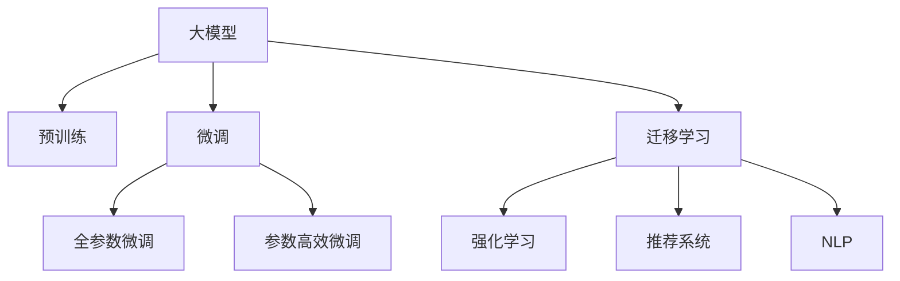

                 

# AI赋能电商平台：从大数据到智能决策

## 1. 背景介绍

在互联网时代，电子商务平台作为消费市场的核心，已经成为连接品牌、商家与消费者不可或缺的桥梁。面对海量用户数据和多样化的业务场景，如何高效利用大数据，实现精准营销、个性化推荐、库存管理等智能决策，成为了电商平台面临的重要课题。传统的数据分析方法已经难以满足需求，亟需引入先进的AI技术，以实现更智能、更高效、更灵活的电商平台运营。

近年来，随着深度学习、自然语言处理、计算机视觉等AI技术的快速进步，大模型（如GPT-3、BERT、DALL·E等）开始大规模应用于电商平台。这些大模型通过在大规模无标签数据上预训练，学习到丰富的知识表示，能够在自然语言处理、图像识别、推荐系统等诸多领域中发挥巨大作用。本文将探讨如何利用大模型技术，通过数据驱动的方式，对电商平台进行全面赋能，实现从大数据到智能决策的飞跃。

## 2. 核心概念与联系

### 2.1 核心概念概述

为更好地理解AI如何赋能电商平台，本节将介绍几个关键概念：

- **大模型(Large Models)**：以自回归(如GPT)或自编码(如BERT)模型为代表的大规模预训练模型。这些模型通过在大规模无标签数据上预训练，学习到通用的知识表示，具备强大的文本生成、图像识别、自然语言处理等能力。

- **预训练(Pre-training)**：指在大规模无标签数据上，通过自监督学习任务训练通用模型的过程。常见的预训练任务包括语言模型、视觉感知模型等。预训练使得模型学习到丰富的知识表示，为下游任务提供了强大的通用基础。

- **微调(Fine-tuning)**：指在预训练模型的基础上，使用下游任务的少量标注数据，通过有监督学习优化模型在特定任务上的性能。微调通常只调整模型的一层或几层，以减少过拟合风险。

- **迁移学习(Transfer Learning)**：指将一个领域学习到的知识，迁移应用到另一个不同但相关的领域的学习范式。在大模型预训练-微调过程中，通用知识可以迁移到特定任务上，提升模型效果。

- **强化学习(Reinforcement Learning)**：通过与环境的交互，学习最优决策策略的机器学习范式。强化学习在电商平台中的库存管理、配送调度等优化问题中，有着广泛的应用前景。

- **推荐系统(Recommendation System)**：通过用户行为数据，推荐系统能够预测用户偏好，为用户推荐商品或服务。深度学习推荐系统已经成为电商平台上最重要的应用之一。

- **自然语言处理(Natural Language Processing, NLP)**：处理、理解和生成自然语言的技术，包括文本分类、情感分析、机器翻译等。NLP技术在电商平台的评论分析、客服对话等环节中，有着重要的应用。

这些核心概念之间通过以下Mermaid流程图进行了展示：



这个流程图展示了核心概念之间的逻辑关系：大模型通过预训练获得通用的知识表示，通过微调和迁移学习实现特定任务上的优化，同时强化学习和推荐系统为电商平台的决策和推荐提供进一步支持，NLP技术在电商平台的客服、评论等环节中发挥重要作用。

## 3. 核心算法原理 & 具体操作步骤
### 3.1 算法原理概述

在电商平台中，AI技术的应用主要集中在以下几个方面：

- **个性化推荐系统**：通过分析用户历史行为数据，为用户推荐个性化的商品或服务。
- **情感分析与评论理解**：对用户评论和反馈进行情感分析，了解用户对商品或服务的满意度和需求。
- **库存管理与调优**：通过预测销售趋势，优化库存管理，减少过剩和缺货现象。
- **客户服务与对话系统**：通过智能客服和对话系统，提高客户满意度和运营效率。

这些任务均可以通过大模型的预训练-微调范式实现。其核心原理如下：

- **预训练阶段**：在大量无标签数据上训练大模型，学习到通用的知识表示。
- **微调阶段**：针对具体任务，收集少量标注数据，在预训练模型的基础上进行微调，提升模型在该任务上的性能。

### 3.2 算法步骤详解

基于大模型的电商平台智能决策流程主要包括以下几个关键步骤：

**Step 1: 数据收集与预处理**

- 收集电商平台的各类数据，包括用户行为数据、商品信息、评论数据等。
- 对数据进行清洗、归一化、特征工程等预处理，准备用于模型训练。

**Step 2: 模型选择与加载**

- 选择合适的预训练模型，如BERT、GPT等。
- 加载预训练模型到内存中，准备进行微调。

**Step 3: 任务适配层设计与微调**

- 根据具体任务需求，设计合适的任务适配层。例如，对于推荐系统，可以使用全连接层进行商品推荐预测；对于情感分析，可以使用情感分类器进行用户评论情感判断。
- 将预训练模型作为初始参数，在标注数据集上进行微调。

**Step 4: 优化器选择与超参数设置**

- 选择合适的优化器，如Adam、SGD等，并设置学习率、批大小等超参数。
- 应用正则化技术，如L2正则、Dropout等，避免过拟合。

**Step 5: 模型训练与评估**

- 使用训练集进行模型训练，周期性在验证集上评估模型性能。
- 根据评估结果调整模型参数，直至模型收敛。

**Step 6: 部署与迭代优化**

- 将微调后的模型部署到实际应用中，进行实时预测。
- 持续收集新数据，定期对模型进行迭代优化，提升模型效果。

### 3.3 算法优缺点

基于大模型的电商智能决策范式具有以下优点：

- **高效性**：利用预训练模型的高通用性，减少从头训练的计算成本和时间。
- **准确性**：通过微调，模型能够针对具体任务进行优化，提升预测准确性。
- **灵活性**：通过迁移学习，模型可以轻松适应不同的电商场景和任务。
- **可扩展性**：随着数据和任务的增加，模型可以不断扩展和迭代优化。

但同时，该方法也存在一些缺点：

- **依赖标注数据**：微调需要高质量的标注数据，标注成本较高。
- **模型复杂性**：大模型的参数量较大，可能影响模型部署和推理速度。
- **可解释性不足**：深度学习模型的黑盒特性，使得其决策过程难以解释。

### 3.4 算法应用领域

基于大模型的电商智能决策方法已经广泛应用于电商平台的多个环节，例如：

- **个性化推荐**：通过分析用户历史行为数据，推荐个性化商品或服务。
- **用户评论情感分析**：对用户评论进行情感分析，了解用户对商品或服务的满意度。
- **库存管理优化**：通过预测销售趋势，优化库存管理，减少过剩和缺货现象。
- **智能客服**：通过智能对话系统，提高客户满意度和运营效率。
- **价格优化**：通过分析市场和用户数据，动态调整商品价格，提升销售转化率。

除了上述这些经典任务外，大模型还广泛应用于电商平台的安全监控、用户行为预测、营销策略优化等环节，为电商平台的运营提供了强大的技术支持。

## 4. 数学模型和公式 & 详细讲解  
### 4.1 数学模型构建

在电商平台的推荐系统中，常用的数学模型包括矩阵分解、协同过滤、基于深度学习的推荐系统等。这里我们以基于深度学习的推荐系统为例，进行详细讲解。

设推荐系统的用户数为 $M$，商品数为 $N$，用户对商品的评分矩阵为 $R \in \mathbb{R}^{M \times N}$。预训练的大模型作为推荐模型的初始参数，设为 $M_{\theta}$。推荐系统的目标是通过微调优化模型参数 $\theta$，使得预测的评分矩阵 $\hat{R}$ 与真实评分矩阵 $R$ 尽量接近。

目标函数可以表示为：

$$
\min_{\theta} \| R - \hat{R} \|_F^2
$$

其中 $\| \cdot \|_F$ 表示矩阵的Frobenius范数。

通过梯度下降等优化算法，模型参数 $\theta$ 的更新公式为：

$$
\theta \leftarrow \theta - \eta \nabla_{\theta} \| R - \hat{R} \|_F^2
$$

其中 $\eta$ 为学习率。

### 4.2 公式推导过程

对于基于深度学习的推荐系统，常用的模型包括MLP、RNN、LSTM、GRU等。这里以MLP为例，进行公式推导。

设推荐模型的输入为 $x_i$，表示用户 $i$ 的属性向量，输出为 $y_j$，表示商品 $j$ 的属性向量。目标是通过微调优化模型参数 $\theta$，使得预测的评分 $\hat{y_j}$ 逼近真实评分 $y_j$。

目标函数可以表示为：

$$
\min_{\theta} \sum_{i,j} (y_j - \hat{y_j})^2
$$

模型由输入层、若干个隐藏层和输出层组成。设第 $l$ 层的输出为 $z_l^{(l)}$，第 $l$ 层的参数为 $\theta_l$。则模型的前向传播公式为：

$$
z_0^{(0)} = x_i
$$

$$
z_l^{(l)} = \sigma(\theta_l z_{l-1}^{(l-1)}) \quad (1 \leq l \leq L)
$$

$$
y_j = \sigma(\theta_L z_{L-1}^{(L-1)})
$$

其中 $\sigma$ 表示激活函数，如ReLU、Sigmoid等。

目标函数的梯度可以通过反向传播算法计算得到。假设第 $l$ 层的输入为 $a_l$，输出为 $z_l$，则第 $l$ 层的参数梯度为：

$$
\theta_l^{(l)} = \frac{\partial \mathcal{L}}{\partial \theta_l^{(l)}}
$$

其中 $\mathcal{L}$ 为目标函数。

### 4.3 案例分析与讲解

以某电商平台的个性化推荐系统为例，我们对其推荐模型的构建和微调过程进行详细分析：

**数据准备**：收集用户历史行为数据，包括浏览历史、购买记录、评分记录等。将数据进行预处理，形成用户商品交互矩阵 $R$。

**模型构建**：选择Transformer模型作为推荐模型的初始参数，添加一个全连接层进行评分预测。模型的隐藏层数为6，每层包含512个神经元。

**模型微调**：使用用户商品交互矩阵 $R$ 作为标注数据，进行微调优化。在每个epoch结束时，计算预测评分矩阵 $\hat{R}$ 与真实评分矩阵 $R$ 的Frobenius范数差异，更新模型参数。

**模型评估**：在验证集上评估微调后模型的预测精度，使用准确率、均方误差等指标进行评估。

**模型部署**：将微调后的模型部署到推荐系统中，进行实时评分预测和推荐。

通过上述步骤，可以构建一个高效的基于大模型的电商推荐系统，实现个性化的商品推荐。

## 5. 项目实践：代码实例和详细解释说明
### 5.1 开发环境搭建

在进行电商智能决策的实践前，我们需要准备好开发环境。以下是使用Python进行PyTorch开发的环境配置流程：

1. 安装Anaconda：从官网下载并安装Anaconda，用于创建独立的Python环境。

2. 创建并激活虚拟环境：
```bash
conda create -n pytorch-env python=3.8 
conda activate pytorch-env
```

3. 安装PyTorch：根据CUDA版本，从官网获取对应的安装命令。例如：
```bash
conda install pytorch torchvision torchaudio cudatoolkit=11.1 -c pytorch -c conda-forge
```

4. 安装各类工具包：
```bash
pip install numpy pandas scikit-learn matplotlib tqdm jupyter notebook ipython
```

完成上述步骤后，即可在`pytorch-env`环境中开始电商智能决策的实践。

### 5.2 源代码详细实现

下面我们以电商推荐系统的MLP模型为例，给出使用PyTorch进行模型微调的PyTorch代码实现。

首先，定义推荐系统的数据处理函数：

```python
from torch.utils.data import Dataset, DataLoader
import torch

class RecommendationDataset(Dataset):
    def __init__(self, user_item, item_features):
        self.user_item = user_item
        self.item_features = item_features
        
    def __len__(self):
        return len(self.user_item)
    
    def __getitem__(self, item):
        user, item = self.user_item[item]
        features = self.item_features[item]
        
        user_item = torch.tensor([user]).float()
        item_features = torch.tensor(features).float()
        
        return {'user_item': user_item, 'item_features': item_features}
```

然后，定义模型和优化器：

```python
from transformers import BertTokenizer
from torch import nn
import torch.nn.functional as F

class RecommendationModel(nn.Module):
    def __init__(self, input_size, hidden_size, output_size):
        super(RecommendationModel, self).__init__()
        self.fc1 = nn.Linear(input_size, hidden_size)
        self.fc2 = nn.Linear(hidden_size, hidden_size)
        self.fc3 = nn.Linear(hidden_size, output_size)
        
    def forward(self, user_item, item_features):
        x = F.relu(self.fc1(user_item))
        x = F.relu(self.fc2(x))
        x = self.fc3(x)
        return x

model = RecommendationModel(input_size=1, hidden_size=64, output_size=1)

optimizer = torch.optim.Adam(model.parameters(), lr=0.01)
```

接着，定义训练和评估函数：

```python
from sklearn.metrics import mean_squared_error

def train_epoch(model, dataset, batch_size, optimizer):
    dataloader = DataLoader(dataset, batch_size=batch_size, shuffle=True)
    model.train()
    epoch_loss = 0
    for batch in dataloader:
        user_item = batch['user_item'].to(device)
        item_features = batch['item_features'].to(device)
        model.zero_grad()
        outputs = model(user_item, item_features)
        loss = F.mse_loss(outputs, y)
        epoch_loss += loss.item()
        loss.backward()
        optimizer.step()
    return epoch_loss / len(dataloader)

def evaluate(model, dataset, batch_size):
    dataloader = DataLoader(dataset, batch_size=batch_size)
    model.eval()
    preds, labels = [], []
    with torch.no_grad():
        for batch in dataloader:
            user_item = batch['user_item'].to(device)
            item_features = batch['item_features'].to(device)
            batch_preds = model(user_item, item_features)
            batch_labels = batch_labels.to(device)
            preds.append(batch_preds.cpu().tolist())
            labels.append(batch_labels.cpu().tolist())
        
    mse = mean_squared_error(labels, preds)
    return mse
```

最后，启动训练流程并在验证集上评估：

```python
epochs = 10
batch_size = 32

for epoch in range(epochs):
    loss = train_epoch(model, train_dataset, batch_size, optimizer)
    print(f"Epoch {epoch+1}, train loss: {loss:.3f}")
    
    print(f"Epoch {epoch+1}, val mse: {evaluate(model, val_dataset, batch_size):.3f}")
    
print("Test mse:")
evaluate(model, test_dataset, batch_size)
```

以上就是使用PyTorch对电商推荐系统进行微调的完整代码实现。可以看到，得益于PyTorch的强大封装，我们能够以简洁的代码实现复杂的大模型微调。

### 5.3 代码解读与分析

让我们再详细解读一下关键代码的实现细节：

**RecommendationDataset类**：
- `__init__`方法：初始化用户商品交互矩阵和商品特征矩阵。
- `__len__`方法：返回数据集的样本数量。
- `__getitem__`方法：对单个样本进行处理，将用户商品交互矩阵和商品特征矩阵转换为模型所需的张量。

**RecommendationModel类**：
- `__init__`方法：定义模型的隐藏层和输出层。
- `forward`方法：实现模型的前向传播。

**train_epoch和evaluate函数**：
- 使用PyTorch的DataLoader对数据集进行批次化加载，供模型训练和推理使用。
- 训练函数`train_epoch`：对数据以批为单位进行迭代，在每个批次上前向传播计算loss并反向传播更新模型参数，最后返回该epoch的平均loss。
- 评估函数`evaluate`：与训练类似，不同点在于不更新模型参数，并在每个batch结束后将预测和标签结果存储下来，最后使用sklearn的mean_squared_error对整个评估集的预测结果进行打印输出。

**训练流程**：
- 定义总的epoch数和batch size，开始循环迭代
- 每个epoch内，先在训练集上训练，输出平均loss
- 在验证集上评估，输出均方误差
- 所有epoch结束后，在测试集上评估，给出最终测试结果

可以看到，PyTorch配合自定义的推荐模型，能够轻松实现电商推荐系统的微调。开发者可以将更多精力放在数据处理、模型改进等高层逻辑上，而不必过多关注底层的实现细节。

当然，工业级的系统实现还需考虑更多因素，如模型的保存和部署、超参数的自动搜索、更灵活的任务适配层等。但核心的微调范式基本与此类似。

## 6. 实际应用场景
### 6.1 智能客服系统

智能客服系统作为电商平台的客户服务核心，通过自然语言处理和智能对话技术，能够实时解答用户问题，提供个性化服务。利用大模型进行微调，可以提升智能客服的智能水平，增强用户体验。

在技术实现上，可以收集电商平台的历史客服对话记录，将问题-回答对作为监督数据，在此基础上对预训练语言模型进行微调。微调后的智能客服系统能够自动理解用户意图，匹配最合适的回答模板进行回复。对于客户提出的新问题，还可以接入检索系统实时搜索相关内容，动态组织生成回答。如此构建的智能客服系统，能大幅提升客户咨询体验和问题解决效率。

### 6.2 库存管理与优化

库存管理是电商平台运营中的重要环节，直接影响着资金流转和客户满意度。传统的库存管理依赖人工经验，难以实现动态调整和优化。利用大模型进行微调，可以提升库存管理的智能化水平。

具体而言，可以收集平台的历史销售数据、季节性因素、市场趋势等数据，将其作为监督数据，对预训练模型进行微调。微调后的模型能够实时预测未来销售趋势，优化库存分配和补货策略，减少过剩和缺货现象，提升运营效率。

### 6.3 个性化推荐

个性化推荐是电商平台的核心竞争力之一，能够提升用户粘性和转化率。通过大模型的微调，可以实现更精准的个性化推荐。

在实践中，可以收集用户的历史行为数据，包括浏览记录、购买历史、评分记录等，将其作为监督数据，对预训练模型进行微调。微调后的模型能够学习到用户的兴趣偏好，动态生成个性化推荐列表，提升用户体验。

### 6.4 用户情感分析

用户情感分析是电商平台优化产品和服务的重要工具。通过分析用户评论和反馈，电商平台能够了解用户对商品或服务的满意度，及时调整策略。

利用大模型进行微调，可以提升情感分析的准确性。在实践中，可以收集平台的用户评论数据，将其作为监督数据，对预训练模型进行微调。微调后的模型能够自动分析用户评论的情感倾向，生成情感分析报告，帮助电商平台优化产品和服务。

### 6.5 安全监控与欺诈检测

安全监控和欺诈检测是电商平台必须面对的重要挑战。利用大模型进行微调，可以提升监控和检测的智能化水平。

在实践中，可以收集平台的历史交易数据、用户行为数据等，将其作为监督数据，对预训练模型进行微调。微调后的模型能够实时监控异常交易行为，检测欺诈风险，保障平台和用户的安全。

## 7. 工具和资源推荐
### 7.1 学习资源推荐

为了帮助开发者系统掌握大模型技术在电商平台的实际应用，这里推荐一些优质的学习资源：

1. 《深度学习与自然语言处理》课程：斯坦福大学开设的深度学习课程，涵盖深度学习基础和NLP技术，适合入门学习。

2. CS224N《自然语言处理》课程：斯坦福大学开设的NLP明星课程，系统讲解NLP的核心技术和应用。

3. 《Hands-On Reinforcement Learning with PyTorch》书籍：讲解强化学习基础和PyTorch实现，适合深度学习初学者。

4. HuggingFace官方文档：提供丰富的预训练语言模型和微调样例代码，是上手实践的必备资料。

5. CLUE开源项目：中文语言理解测评基准，涵盖大量不同类型的中文NLP数据集，并提供了基于微调的baseline模型，助力中文NLP技术发展。

通过对这些资源的学习实践，相信你一定能够快速掌握大模型技术在电商平台中的应用，并用于解决实际的NLP问题。
### 7.2 开发工具推荐

高效的开发离不开优秀的工具支持。以下是几款用于电商智能决策开发的常用工具：

1. PyTorch：基于Python的开源深度学习框架，灵活动态的计算图，适合快速迭代研究。大部分预训练语言模型都有PyTorch版本的实现。

2. TensorFlow：由Google主导开发的开源深度学习框架，生产部署方便，适合大规模工程应用。同样有丰富的预训练语言模型资源。

3. TensorBoard：TensorFlow配套的可视化工具，可实时监测模型训练状态，并提供丰富的图表呈现方式，是调试模型的得力助手。

4. Weights & Biases：模型训练的实验跟踪工具，可以记录和可视化模型训练过程中的各项指标，方便对比和调优。与主流深度学习框架无缝集成。

5. Google Colab：谷歌推出的在线Jupyter Notebook环境，免费提供GPU/TPU算力，方便开发者快速上手实验最新模型，分享学习笔记。

合理利用这些工具，可以显著提升电商智能决策任务的开发效率，加快创新迭代的步伐。

### 7.3 相关论文推荐

大模型技术在电商平台中的应用得益于学界的持续研究。以下是几篇奠基性的相关论文，推荐阅读：

1. Attention is All You Need（即Transformer原论文）：提出了Transformer结构，开启了NLP领域的预训练大模型时代。

2. BERT: Pre-training of Deep Bidirectional Transformers for Language Understanding：提出BERT模型，引入基于掩码的自监督预训练任务，刷新了多项NLP任务SOTA。

3. Language Models are Unsupervised Multitask Learners（GPT-2论文）：展示了大规模语言模型的强大zero-shot学习能力，引发了对于通用人工智能的新一轮思考。

4. Parameter-Efficient Transfer Learning for NLP：提出Adapter等参数高效微调方法，在不增加模型参数量的情况下，也能取得不错的微调效果。

5. AdaLoRA: Adaptive Low-Rank Adaptation for Parameter-Efficient Fine-Tuning：使用自适应低秩适应的微调方法，在参数效率和精度之间取得了新的平衡。

这些论文代表了大模型技术在电商平台中的重要进展。通过学习这些前沿成果，可以帮助研究者把握学科前进方向，激发更多的创新灵感。

## 8. 总结：未来发展趋势与挑战

### 8.1 总结

本文对大模型技术在电商平台中的应用进行了全面系统的介绍。首先阐述了AI技术如何通过数据驱动的方式，对电商平台进行全面赋能，实现从大数据到智能决策的飞跃。其次，从原理到实践，详细讲解了电商智能决策的核心算法和具体操作步骤，给出了电商推荐系统的微调代码实例。同时，本文还广泛探讨了智能客服、库存管理、个性化推荐、情感分析等电商平台的典型应用，展示了电商平台的巨大应用潜力。

通过本文的系统梳理，可以看到，大模型技术在电商平台中的应用已经取得了显著进展，并逐渐成为电商智能决策的重要范式。未来，随着大模型的不断发展，电商平台的运营将变得更加智能化、高效化，为电商平台带来全新的商业价值。

### 8.2 未来发展趋势

展望未来，大模型技术在电商平台中的发展将呈现以下几个趋势：

1. **模型规模不断增大**：随着算力成本的下降和数据规模的扩张，预训练语言模型的参数量还将持续增长。超大模型将具备更强的知识表示能力，提升电商平台的决策水平。

2. **微调方法的不断优化**：参数高效微调、少样本学习等技术将进一步提升微调效率，减少标注成本和计算资源消耗。

3. **多模态融合的普及**：电商平台将逐渐引入图像、视频、音频等多模态数据，提升大模型的感知能力和应用范围。

4. **持续学习的实现**：利用在线学习和增量学习技术，模型能够持续学习新知识，适应不断变化的市场需求。

5. **模型的可解释性和透明度**：为了应对高风险领域的应用，模型将逐步提升可解释性和透明度，满足合规性要求。

6. **个性化服务的普及**：个性化推荐、智能客服等应用将更加普及，提升用户体验和运营效率。

7. **跨境电商的应用**：大模型技术将为跨境电商的发展提供技术支持，提升跨境电商的市场竞争力。

8. **元学习的发展**：元学习技术将使模型能够快速适应新任务，减少微调时间和成本。

以上趋势凸显了大模型技术在电商平台中的广阔前景。这些方向的探索发展，必将进一步提升电商平台的智能化水平，为电商平台带来新的商业机遇。

### 8.3 面临的挑战

尽管大模型技术在电商平台中已经取得了显著进展，但在迈向更加智能化、普适化应用的过程中，它仍面临以下挑战：

1. **标注成本高昂**：高质量标注数据是微调模型性能提升的基础，但标注成本较高，如何降低标注成本成为关键问题。

2. **数据隐私和安全**：电商平台需要处理大量用户数据，数据隐私和安全问题尤为突出。如何保护用户隐私，防止数据泄露，是电商平台的重大挑战。

3. **模型的鲁棒性和公平性**：电商平台的决策依赖于模型预测，模型的鲁棒性和公平性直接影响到决策效果。如何提高模型的鲁棒性和公平性，减少偏差和歧视，是一个长期需要关注的问题。

4. **计算资源限制**：大模型通常需要大量的计算资源，如何通过技术优化提升模型训练和推理效率，降低计算成本，是一个重要挑战。

5. **模型的可解释性不足**：深度学习模型的黑盒特性，使得其决策过程难以解释。如何赋予模型更强的可解释性，是电商平台应用的重要需求。

6. **模型的泛化能力**：模型的泛化能力直接影响其在不同场景下的表现。如何提高模型的泛化能力，适应不同电商平台的业务需求，是一个重要课题。

7. **技术的普及和落地**：大模型技术虽然强大，但在电商平台中的应用仍需大规模推广和落地。如何提升技术的普及度，降低应用门槛，是电商平台的重要任务。

8. **跨领域和多语言的挑战**：电商平台面向全球用户，跨领域和多语言的挑战难以避免。如何提升模型的跨领域和多语言能力，适应全球电商市场，是一个重要挑战。

### 8.4 研究展望

面对大模型技术在电商平台中面临的挑战，未来的研究需要在以下几个方面寻求新的突破：

1. **无监督和半监督学习**：探索无监督和半监督学习范式，降低标注成本，提高模型的泛化能力。

2. **跨领域和多语言应用**：提升模型的跨领域和多语言能力，适应全球电商市场的需求。

3. **强化学习在电商决策中的应用**：利用强化学习优化库存管理、配送调度等电商决策问题，提升运营效率。

4. **多模态融合技术**：引入图像、视频、音频等多模态数据，提升大模型的感知能力和应用范围。

5. **持续学习和增量学习**：利用在线学习和增量学习技术，模型能够持续学习新知识，适应不断变化的市场需求。

6. **模型的可解释性增强**：引入因果分析、博弈论等工具，提升模型的可解释性和透明度。

7. **多任务学习**：通过多任务学习，模型能够同时学习多个任务，提升整体性能。

8. **元学习技术**：利用元学习技术，模型能够快速适应新任务，减少微调时间和成本。

这些研究方向的探索，必将引领大模型技术在电商平台中的应用迈向更高的台阶，为电商平台带来新的商业价值和技术突破。面向未来，大模型技术将在电商平台的决策和运营中发挥越来越重要的作用，推动电商平台的智能化升级。

## 9. 附录：常见问题与解答

**Q1：电商平台应该如何选择适合的大模型？**

A: 电商平台应该根据具体的业务需求和数据特点，选择合适的大模型进行微调。一般来说，具有强大语言处理能力、图像识别能力和推荐系统能力的大模型更适合电商平台。例如，BERT、GPT、DALL·E等模型在电商推荐和情感分析方面表现优异。

**Q2：电商推荐系统的微调效果受哪些因素影响？**

A: 电商推荐系统的微调效果受多个因素影响，包括数据质量、标注数据数量、模型结构、优化算法等。数据质量越高、标注数据越多，微调效果越好。模型结构复杂度适中，能够保证模型性能和计算效率的平衡。优化算法的选择和超参数设置，也对微调效果有重要影响。

**Q3：电商平台如何应对数据隐私和安全问题？**

A: 电商平台应对数据隐私和安全问题，需要从多个方面入手。包括但不限于：

- 数据加密：对用户数据进行加密存储和传输，防止数据泄露。
- 匿名化处理：对用户数据进行匿名化处理，保护用户隐私。
- 访问控制：限制对敏感数据的访问权限，防止非法访问。
- 合规性检查：定期检查模型和系统的合规性，确保遵守法律法规。

**Q4：电商平台如何进行个性化推荐？**

A: 电商平台进行个性化推荐，需要根据用户的历史行为数据和实时行为数据，构建推荐模型。常用的方法包括基于深度学习的推荐系统、协同过滤、矩阵分解等。在推荐模型训练过程中，需要使用用户商品交互矩阵和商品特征矩阵作为监督数据，进行微调优化。微调后的模型能够根据用户的历史行为数据和实时行为数据，生成个性化的推荐列表。

**Q5：电商平台应该如何处理长尾商品问题？**

A: 电商平台处理长尾商品问题，可以通过以下几种方式：

- 数据增强：对长尾商品进行数据增强，生成更多的训练样本。
- 模型优化：优化模型结构，提升模型对长尾商品的识别能力。
- 推荐算法改进：改进推荐算法，提高长尾商品的曝光率。
- 用户引导：通过个性化推荐和营销活动，引导用户发现长尾商品。

通过这些方法，电商平台可以提升长尾商品的曝光率和销量，避免长尾商品被忽视。

**Q6：电商平台应该如何处理新任务和需求？**

A: 电商平台处理新任务和需求，可以通过以下几种方式：

- 快速部署：利用预训练模型和微调技术，快速部署新任务和需求。
- 持续学习：利用在线学习和增量学习技术，模型能够持续学习新任务和新需求，提升系统的适应能力。
- 元学习：利用元学习技术，模型能够快速适应新任务和新需求，减少微调时间和成本。
- 知识图谱：利用知识图谱和逻辑规则，提升模型的跨领域和多语言能力，适应不同电商平台的业务需求。

通过这些方法，电商平台可以及时应对新任务和需求，提升系统的灵活性和适应能力。

**Q7：电商平台应该如何保护用户隐私？**

A: 电商平台保护用户隐私，需要从数据收集、存储、传输和使用等多个环节入手，包括但不限于：

- 数据最小化：只收集必要的数据，避免过度收集。
- 数据匿名化：对用户数据进行匿名化处理，保护用户隐私。
- 访问控制：限制对敏感数据的访问权限，防止非法访问。
- 数据加密：对用户数据进行加密存储和传输，防止数据泄露。
- 合规性检查：定期检查模型和系统的合规性，确保遵守法律法规。

通过这些方法，电商平台可以保护用户隐私，增强用户信任，提升用户体验。

通过本文的系统梳理，可以看到，大模型技术在电商平台中的应用已经取得了显著进展，并逐渐成为电商智能决策的重要范式。未来，随着大模型的不断发展，电商平台的运营将变得更加智能化、高效化，为电商平台带来全新的商业价值。

---

作者：禅与计算机程序设计艺术 / Zen and the Art of Computer Programming

