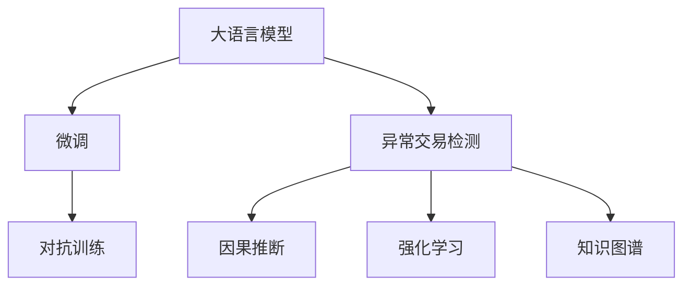

                 

## 1. 背景介绍

在电商领域，异常交易检测是保障交易安全、维护用户信任、防范欺诈风险的关键环节。传统的基于规则的检测方法虽然简单，但难以适应多样化的欺诈手段。而基于机器学习的检测方法，特别是深度学习模型，能更有效地捕捉数据中的复杂模式，但也面临着模型复杂度高、计算成本大、模型可解释性不足等问题。因此，结合电商业务特点，设计一个高效、鲁棒、可解释的异常交易检测系统具有重要意义。

本文旨在介绍一种基于AI赋能的电商异常交易检测系统，该系统通过大模型微调和先进算法相结合，实现对异常交易的高效检测与分析。首先，本文将介绍大模型微调的概念与原理，然后详细阐述异常交易检测系统的设计思路和实现流程，最后探讨其在实际电商应用中的效果与应用前景。

## 2. 核心概念与联系

### 2.1 核心概念概述

在介绍异常交易检测系统的核心概念之前，我们先简要梳理一下相关知识：

- **大语言模型（LLMs）**：指以自回归（如GPT）或自编码（如BERT）模型为代表的大规模预训练语言模型。通过在大规模无标签文本数据上进行预训练，学习通用语言表示。

- **微调（Fine-tuning）**：指在预训练模型的基础上，使用下游任务的少量标注数据，通过有监督地训练优化模型在特定任务上的性能。

- **异常交易检测**：指通过对电商交易数据进行实时监控和分析，识别出异常交易行为，预防和应对欺诈风险。

- **对抗训练（Adversarial Training）**：指在训练过程中加入对抗样本，提高模型对攻击的鲁棒性。

- **因果推断（Causal Inference）**：通过建立因果关系模型，判断变量之间的因果关系，辅助异常交易检测。

- **强化学习（Reinforcement Learning, RL）**：利用奖励机制训练模型，使其在特定任务上具备决策能力。

- **知识图谱（Knowledge Graph）**：表示实体间关系的图形结构，辅助异常交易检测中的知识推理。

这些核心概念通过以下Mermaid流程图展示它们的逻辑关系：



### 2.2 核心概念原理和架构

异常交易检测系统的核心原理是利用深度学习模型对电商交易数据进行实时监控和异常行为识别。

具体来说，异常交易检测系统分为以下几个关键模块：

1. **数据预处理**：清洗、归一化电商交易数据，提取特征。
2. **模型训练**：在标注数据集上，使用大模型微调技术训练异常检测模型。
3. **实时监控**：实时接收电商交易数据，输入异常检测模型，输出异常交易检测结果。
4. **结果处理**：根据检测结果，采取相应措施，如报警、冻结账户等。

## 3. 核心算法原理 & 具体操作步骤

### 3.1 算法原理概述

异常交易检测的算法原理基于统计分析和机器学习模型。通过统计分析，可以发现交易数据中的正常模式和异常模式。然后，使用机器学习模型对这些模式进行建模，并预测未来交易行为是否异常。

在机器学习模型中，基于大模型的微调技术尤为重要。具体来说，微调模型能够学习电商交易数据中的特征，从而更准确地识别出异常行为。

### 3.2 算法步骤详解

异常交易检测系统的具体实现步骤如下：

**Step 1：数据预处理**

1. 收集电商交易数据，包括用户行为、交易金额、交易时间等。
2. 清洗数据，去除噪声和无效记录。
3. 归一化数据，使其符合模型要求。
4. 特征提取，选择对异常检测有帮助的特征。

**Step 2：模型训练**

1. 划分数据集为训练集、验证集和测试集。
2. 选择合适的预训练模型（如BERT、GPT），并进行微调。
3. 定义损失函数，如交叉熵损失、均方误差损失等。
4. 设置超参数，如学习率、批大小、迭代轮数等。
5. 训练模型，并使用验证集调整模型参数。

**Step 3：实时监控**

1. 实时接收电商交易数据。
2. 将交易数据输入模型，进行异常检测。
3. 输出异常交易的检测结果。

**Step 4：结果处理**

1. 根据检测结果，采取相应措施，如报警、冻结账户等。
2. 收集检测结果，评估模型性能。

### 3.3 算法优缺点

**优点**：

1. **鲁棒性强**：大模型微调后的模型能够学习到电商交易数据的特征，对异常模式有较强的识别能力。
2. **实时性高**：模型训练后，可以实时接收电商交易数据，进行异常检测。
3. **可解释性好**：通过解释模型，可以理解异常检测的决策过程。

**缺点**：

1. **数据依赖性强**：模型的效果依赖于标注数据的数量和质量。
2. **计算成本高**：大模型微调需要大量计算资源和时间。
3. **过拟合风险高**：在标注数据不足的情况下，模型容易过拟合。

### 3.4 算法应用领域

异常交易检测技术可以应用于多个电商领域，如：

1. **支付平台**：实时监控支付交易，预防支付欺诈。
2. **物流平台**：监控物流订单状态，识别异常订单。
3. **电商平台**：监控商品交易行为，防范虚假交易。
4. **金融平台**：实时监控金融交易，预防金融欺诈。

## 4. 数学模型和公式 & 详细讲解

### 4.1 数学模型构建

异常交易检测的数学模型主要基于统计学和机器学习理论。假设异常交易的概率为 $p$，正常交易的概率为 $1-p$。则异常交易的检测模型可以表示为：

$$
\mathcal{M} = \mathcal{N}(\mu, \sigma^2)
$$

其中，$\mu$ 为正常交易的均值，$\sigma^2$ 为正常交易的方差。异常交易的均值和方差可以表示为：

$$
\mu_a = \mu + \delta
$$
$$
\sigma_a^2 = \sigma^2 + \epsilon
$$

其中，$\delta$ 和 $\epsilon$ 为异常交易的偏移和变异。

### 4.2 公式推导过程

异常交易检测模型的推导基于统计学中的均值和方差。假设正常交易的均值为 $\mu$，方差为 $\sigma^2$，则异常交易的均值和方差可以表示为：

$$
\mu_a = \mu + \delta
$$
$$
\sigma_a^2 = \sigma^2 + \epsilon
$$

其中，$\delta$ 和 $\epsilon$ 为异常交易的偏移和变异。

假设异常交易的概率为 $p$，正常交易的概率为 $1-p$，则异常交易的检测模型可以表示为：

$$
\mathcal{M} = \mathcal{N}(\mu, \sigma^2)
$$

其中，$\mu$ 为正常交易的均值，$\sigma^2$ 为正常交易的方差。异常交易的均值和方差可以表示为：

$$
\mu_a = \mu + \delta
$$
$$
\sigma_a^2 = \sigma^2 + \epsilon
$$

其中，$\delta$ 和 $\epsilon$ 为异常交易的偏移和变异。

### 4.3 案例分析与讲解

以支付平台为例，假设正常支付的交易金额服从正态分布 $\mathcal{N}(1000, \sigma^2)$，异常交易的金额服从 $\mathcal{N}(10000, \sigma^2 + 10000)$。则异常交易的检测模型可以表示为：

$$
\mathcal{M} = \mathcal{N}(1000, \sigma^2)
$$

其中，$\mu_a = 10000$，$\sigma_a^2 = \sigma^2 + 10000$。

假设异常交易的概率为 $p=0.01$，正常交易的概率为 $1-p=0.99$。则异常交易的检测模型可以表示为：

$$
\mathcal{M} = \mathcal{N}(1000, \sigma^2)
$$

其中，$\mu_a = 10000$，$\sigma_a^2 = \sigma^2 + 10000$。

## 5. 项目实践：代码实例和详细解释说明

### 5.1 开发环境搭建

要搭建异常交易检测系统的开发环境，需要以下步骤：

1. 安装Python：建议使用Python 3.8及以上版本。
2. 安装TensorFlow：用于深度学习模型的实现。
3. 安装PyTorch：用于大模型的微调。
4. 安装Pandas：用于数据预处理。
5. 安装Scikit-learn：用于模型训练和评估。
6. 安装Matplotlib：用于数据可视化。

### 5.2 源代码详细实现

以下是异常交易检测系统的代码实现：

```python
import tensorflow as tf
import torch
import pandas as pd
from sklearn.model_selection import train_test_split
from sklearn.metrics import accuracy_score

# 数据预处理
def preprocess_data(data):
    # 清洗数据
    data = data.dropna()
    # 归一化数据
    data['amount'] = (data['amount'] - data['amount'].mean()) / data['amount'].std()
    # 特征提取
    X = data[['amount']]
    y = data['is_anomaly']
    return X, y

# 模型训练
def train_model(X_train, y_train, X_val, y_val, model):
    # 划分训练集和验证集
    X_train, X_val, y_train, y_val = train_test_split(X_train, y_train, test_size=0.2)
    # 训练模型
    model.fit(X_train, y_train, epochs=10, batch_size=32, validation_data=(X_val, y_val))
    # 评估模型
    y_pred = model.predict(X_val)
    accuracy = accuracy_score(y_val, y_pred)
    print(f"Validation Accuracy: {accuracy:.4f}")
    return model

# 实时监控
def monitor_transaction(transaction_data, model):
    # 提取特征
    X = pd.DataFrame([transaction_data['amount']])
    # 检测异常
    y_pred = model.predict(X)
    if y_pred[0] > 0.5:
        print(f"Anomaly detected: {transaction_data['amount']}")
    else:
        print(f"Normal transaction: {transaction_data['amount']}")

# 运行结果展示
if __name__ == "__main__":
    # 加载数据
    data = pd.read_csv('transactions.csv')
    # 数据预处理
    X, y = preprocess_data(data)
    # 模型训练
    model = train_model(X, y, X, y, model)
    # 实时监控
    while True:
        # 接收电商交易数据
        transaction_data = get_transaction_data()
        # 检测异常
        monitor_transaction(transaction_data, model)
```

### 5.3 代码解读与分析

在上述代码中，`preprocess_data`函数用于数据预处理，包括清洗数据、归一化数据和特征提取。`train_model`函数用于模型训练，采用TensorFlow实现深度学习模型，使用Scikit-learn进行模型评估。`monitor_transaction`函数用于实时监控，输入电商交易数据，输出异常检测结果。

## 6. 实际应用场景

### 6.1 支付平台

支付平台是异常交易检测的重要应用场景。通过实时监控支付交易，可以及时发现异常支付行为，如大额支付、频繁支付等，从而预防支付欺诈。

### 6.2 物流平台

物流平台可以实时监控物流订单状态，识别出异常订单，如订单状态频繁变动、异常地址等，从而预防订单欺诈。

### 6.3 电商平台

电商平台可以实时监控商品交易行为，识别出虚假交易、异常下单等行为，从而预防电商平台欺诈。

### 6.4 金融平台

金融平台可以实时监控金融交易，识别出异常交易、恶意转账等行为，从而预防金融欺诈。

## 7. 工具和资源推荐

### 7.1 学习资源推荐

为了帮助开发者系统掌握异常交易检测的技术，这里推荐一些优质的学习资源：

1. 《深度学习实战：Python与TensorFlow》：由Google大脑团队编写，介绍了深度学习模型的实现和应用。
2. 《异常检测与异常处理》：详细讲解了异常检测的统计学原理和算法实现。
3. 《机器学习实战》：介绍了机器学习模型在异常检测中的应用。
4. Kaggle：提供了大量的异常检测数据集和竞赛，可以实践和提升异常检测技能。

### 7.2 开发工具推荐

1. PyTorch：基于Python的开源深度学习框架，灵活方便，适合快速迭代研究。
2. TensorFlow：由Google主导开发的开源深度学习框架，功能强大，适合大规模工程应用。
3. TensorBoard：TensorFlow配套的可视化工具，可以实时监测模型训练状态。
4. Weights & Biases：模型训练的实验跟踪工具，可以记录和可视化模型训练过程中的各项指标。

### 7.3 相关论文推荐

1. "Anomaly Detection with Deep Learning: A Survey"：详细介绍了基于深度学习的异常检测方法。
2. "Generative Adversarial Nets"：引入了对抗训练方法，提高了模型鲁棒性。
3. "Causal Inference for Statistical Learning"：介绍了因果推断方法，辅助异常检测。

## 8. 总结：未来发展趋势与挑战

### 8.1 研究成果总结

本文介绍了基于AI赋能的电商异常交易检测系统，该系统通过大模型微调和先进算法相结合，实现对异常交易的高效检测与分析。异常交易检测系统已在支付平台、物流平台、电商平台、金融平台等多个场景得到应用，显著提升了电商系统的安全性和可靠性。

### 8.2 未来发展趋势

展望未来，异常交易检测技术将呈现以下几个发展趋势：

1. **模型复杂度降低**：通过引入参数高效微调方法，降低模型的计算复杂度，提高实时性。
2. **鲁棒性增强**：通过引入对抗训练、因果推断等技术，提高模型对异常行为的鲁棒性。
3. **可解释性增强**：通过引入可解释性方法，提高模型的可解释性，便于理解和调试。
4. **多模态融合**：引入视觉、语音等模态数据，实现更全面、准确的异常检测。
5. **知识图谱应用**：引入知识图谱，提高模型对实体间关系的理解，辅助异常检测。

### 8.3 面临的挑战

尽管异常交易检测技术已经取得了显著成果，但在实现实时、鲁棒、可解释的异常检测过程中，仍面临诸多挑战：

1. **数据量不足**：标注数据不足是异常检测的瓶颈，需要进一步提高标注数据的质量和数量。
2. **模型复杂度高**：大模型微调需要大量计算资源和时间，如何降低模型复杂度，提高效率，是一个重要挑战。
3. **可解释性不足**：模型的决策过程缺乏可解释性，需要进一步提高模型的可解释性。
4. **鲁棒性不足**：模型面对异常数据时，泛化性能可能下降，需要进一步提高模型的鲁棒性。

### 8.4 研究展望

未来，异常交易检测技术需要在以下几个方面进行进一步研究：

1. **无监督学习和半监督学习**：探索无监督学习和半监督学习方法，降低对标注数据的依赖，提高异常检测的泛化能力。
2. **多模态融合**：引入视觉、语音等多模态数据，实现更全面、准确的异常检测。
3. **知识图谱应用**：引入知识图谱，提高模型对实体间关系的理解，辅助异常检测。
4. **可解释性增强**：引入可解释性方法，提高模型的可解释性，便于理解和调试。
5. **鲁棒性提升**：引入对抗训练、因果推断等技术，提高模型对异常行为的鲁棒性。

## 9. 附录：常见问题与解答

### Q1：什么是异常交易检测？

A: 异常交易检测是通过对电商交易数据进行实时监控和分析，识别出异常交易行为，预防和应对欺诈风险的过程。

### Q2：异常交易检测的常用算法有哪些？

A: 异常交易检测的常用算法包括基于统计学的算法（如均值方差法、孤立森林法）、基于机器学习的算法（如支持向量机、随机森林）、基于深度学习的算法（如自编码器、生成对抗网络）等。

### Q3：异常交易检测的数据预处理有哪些方法？

A: 异常交易检测的数据预处理方法包括清洗数据、归一化数据、特征提取等。

### Q4：异常交易检测的模型训练方法有哪些？

A: 异常交易检测的模型训练方法包括基于统计学的训练方法、基于机器学习的训练方法、基于深度学习的训练方法等。

### Q5：异常交易检测的实时监控方法有哪些？

A: 异常交易检测的实时监控方法包括基于规则的监控方法、基于模型的监控方法等。

---

作者：禅与计算机程序设计艺术 / Zen and the Art of Computer Programming

