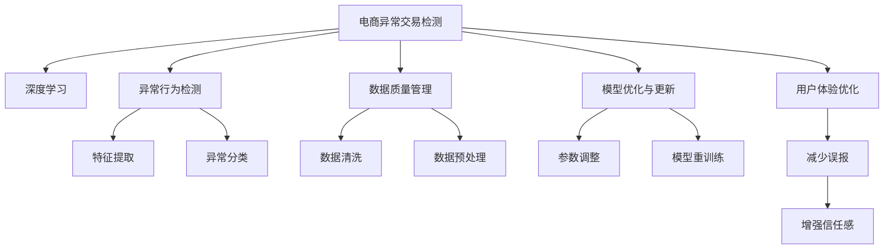

                 

# AI赋能的电商异常交易检测系统

> 关键词：电商,异常交易检测,人工智能,机器学习,深度学习,算法,模型,系统

## 1. 背景介绍

### 1.1 问题由来

随着电子商务的飞速发展，消费者线上购物已经成为日常生活的一部分。然而，在数字化转型的浪潮中，如何保障用户财产安全，防范欺诈和恶意行为，成为电商平台亟待解决的重要问题。异常交易检测系统作为电商平台的重要组成部分，负责监控交易行为，及时发现并阻断可疑行为，从而保护用户的经济利益。

传统的异常交易检测方法依赖于规则引擎和经验法则，依赖人工设计和维护，难以覆盖所有可能的风险场景，且无法自我更新和优化。随着人工智能和机器学习技术的进步，利用深度学习和无监督学习算法对交易数据进行建模分析，从而实现自动化的异常检测成为可能。

本系统将深度学习技术应用到电商交易数据的分析和建模，旨在提升异常交易检测的效率和准确度，保障电商平台的用户财产安全，促进电商平台的健康发展和良性生态建设。

### 1.2 问题核心关键点

系统的主要目标是利用人工智能技术，对电商交易数据进行深度学习和建模分析，实时检测并报警异常交易行为，及时阻断欺诈行为，保护用户财产安全。系统主要关注以下几个核心关键点：

- 数据质量管理：保障输入数据的质量和完整性，避免模型学习到噪声数据，确保模型的准确性和鲁棒性。
- 异常行为检测：构建高效的异常检测模型，及时发现交易行为中的异常模式，确保系统的高效运行和决策可靠性。
- 模型优化与更新：通过数据反馈和用户反馈，不断优化和更新模型，提升异常检测的精度和泛化能力。
- 用户体验优化：在检测异常行为的同时，尽量减少误报，提升用户满意度，增强用户信任感。

## 2. 核心概念与联系

### 2.1 核心概念概述

为更好地理解异常交易检测系统的设计和实现，本节将介绍几个密切相关的核心概念：

- **电商异常交易检测**：利用人工智能技术对电商交易数据进行深度学习建模，实时检测并报警异常交易行为，保障用户财产安全。
- **深度学习**：一种基于神经网络的机器学习技术，通过多层神经网络模型对输入数据进行抽象学习，从而实现数据的自动特征提取和模式识别。
- **异常行为检测**：识别并报告交易行为中的异常模式，通过特征提取和分类方法，区分正常和异常交易行为。
- **数据质量管理**：保障输入数据的准确性和完整性，通过数据清洗、预处理等手段提升数据质量。
- **模型优化与更新**：基于模型的性能反馈，不断优化模型参数和结构，提升模型的准确性和泛化能力。
- **用户体验优化**：在异常检测的同时，减少误报，提升用户满意度和信任感，增强用户粘性。

这些核心概念之间的逻辑关系可以通过以下Mermaid流程图来展示：



这个流程图展示了电商异常交易检测系统的核心概念及其之间的关系：

1. 电商异常交易检测系统通过深度学习对交易数据进行建模分析。
2. 异常行为检测模块利用特征提取和分类方法，识别出异常模式。
3. 数据质量管理模块负责保障数据质量和完整性，通过数据清洗和预处理提高数据质量。
4. 模型优化与更新模块不断优化和更新模型，提升异常检测的精度和泛化能力。
5. 用户体验优化模块通过减少误报，提升用户满意度和信任感，增强用户粘性。

这些概念共同构成了电商异常交易检测系统的设计和实现框架，使其能够高效、准确地检测异常交易行为，保障用户财产安全。

## 3. 核心算法原理 & 具体操作步骤
### 3.1 算法原理概述

电商异常交易检测系统主要采用深度学习技术进行建模分析，核心算法原理包括以下几个方面：

- **数据准备与预处理**：收集电商交易数据，并进行清洗和预处理，构建训练集和测试集。
- **特征提取与选择**：通过深度学习模型提取交易数据的特征，选择最具有区分性的特征进行训练。
- **异常检测模型构建**：构建深度神经网络模型，用于训练和预测异常交易行为。
- **模型优化与评估**：通过交叉验证和测试集评估模型性能，根据评估结果进行模型优化和调整。
- **实时监控与报警**：部署模型到生产环境，实时监控交易行为，并根据异常行为触发报警。

### 3.2 算法步骤详解

#### 3.2.1 数据准备与预处理

电商交易数据通常包含多个维度的信息，如用户ID、商品ID、交易金额、交易时间等。为了构建有效的异常检测模型，需要对数据进行清洗和预处理，主要包括以下步骤：

1. **数据清洗**：去除重复数据、无效数据和不完整数据，确保数据的准确性和完整性。
2. **特征选择**：选择对异常检测最有帮助的特征，如交易金额、交易时间、交易频率等。
3. **数据标准化**：对数据进行归一化处理，确保不同特征的量纲一致，便于模型训练。
4. **数据增强**：对数据进行增强，如加入噪声、回译等，增加训练集的多样性。

#### 3.2.2 特征提取与选择

在深度学习模型中，特征提取和选择是异常检测的核心步骤。通过构建卷积神经网络(CNN)或循环神经网络(RNN)模型，可以从原始交易数据中提取出高维特征表示。常用的特征提取方法包括：

1. **卷积神经网络(CNN)**：通过卷积操作提取局部特征，适用于序列数据（如交易时间序列）。
2. **循环神经网络(RNN)**：通过循环结构捕捉时间序列数据中的时序依赖关系。
3. **长短期记忆网络(LSTM)**：一种特殊的RNN，用于处理长序列数据，适用于电商交易等复杂数据。

特征选择的目标是从大量特征中挑选出最具有区分性的特征，通常可以通过特征选择算法（如卡方检验、互信息等）进行。

#### 3.2.3 异常检测模型构建

异常检测模型的构建需要选择合适的深度学习模型，并进行适当的调整和训练。常用的异常检测模型包括：

1. **自编码器(Autoencoder)**：通过重构原始数据与重构后的数据的差异来识别异常。
2. **生成对抗网络(GAN)**：通过生成正常数据和异常数据的混合分布，训练生成器区分正常和异常数据。
3. **基于注意力机制的模型**：利用注意力机制对数据特征进行加权处理，增强模型的泛化能力。
4. **混合模型**：将多种异常检测模型进行组合，提升系统的整体性能。

在模型训练时，需要选择合适的损失函数和优化器，如均方误差损失、交叉熵损失、Adam优化器等，进行反向传播和参数更新。

#### 3.2.4 模型优化与评估

模型优化与评估是提升异常检测系统性能的重要步骤，主要包括以下步骤：

1. **交叉验证**：将数据集划分为训练集和验证集，进行交叉验证，评估模型的泛化能力。
2. **参数调整**：根据交叉验证结果，调整模型参数，如学习率、批大小等，优化模型性能。
3. **超参数调优**：通过网格搜索或随机搜索等方法，优化模型的超参数，提升模型性能。
4. **模型重训练**：在新的数据集上重训练模型，保持模型的适应性和更新能力。

#### 3.2.5 实时监控与报警

部署训练好的异常检测模型到生产环境，进行实时监控和报警。主要步骤如下：

1. **数据输入**：实时输入新的交易数据，进行特征提取和预处理。
2. **模型推理**：将预处理后的数据输入模型，进行异常检测和预测。
3. **结果评估**：根据模型的预测结果，评估交易行为的异常程度。
4. **报警机制**：根据异常程度，触发不同的报警机制，如封禁账号、提醒管理员等。

### 3.3 算法优缺点

电商异常交易检测系统采用深度学习技术进行建模分析，具有以下优点：

1. **高效准确**：通过深度学习模型，自动提取和分析交易数据中的复杂特征，显著提升异常检测的效率和准确度。
2. **自适应性强**：基于神经网络模型的特征提取和分类方法，可以自动适应新数据和场景，提升系统的泛化能力。
3. **可扩展性好**：通过模型优化和超参数调优，不断提升异常检测系统的性能，增强系统的可扩展性。
4. **实时性高**：通过优化模型推理速度，实现实时监控和报警，保障用户财产安全。

同时，该系统也存在以下缺点：

1. **依赖数据质量**：模型的性能很大程度上依赖于输入数据的质量，数据清洗和预处理需要较高的技术要求。
2. **模型复杂度高**：深度学习模型的复杂度高，训练和推理需要较大的计算资源和存储资源。
3. **可解释性差**：神经网络模型通常缺乏可解释性，难以理解模型的内部工作机制和决策逻辑。
4. **误报率高**：在复杂数据场景下，异常检测模型的误报率较高，可能影响用户体验。
5. **安全性风险**：模型可能学习到有害信息，导致误报或漏报，存在安全隐患。

尽管存在这些局限性，但深度学习技术在大规模数据下的高效性和准确性，使其成为电商异常交易检测系统的理想选择。未来相关研究的方向在于进一步降低模型的计算和存储需求，提升模型的可解释性，降低误报率，同时保障系统的安全性。

### 3.4 算法应用领域

电商异常交易检测系统已经在多个电商平台上得到了应用，并取得了显著的成效。例如：

1. **电商平台交易监控**：如阿里巴巴、京东、亚马逊等电商平台上，利用异常检测系统监控交易行为，及时发现并阻止欺诈行为。
2. **金融服务领域**：银行和金融服务机构利用异常检测技术监控账户交易，防范金融欺诈和洗钱行为。
3. **物流配送行业**：利用异常检测技术监控物流配送过程，确保货物安全，防范假冒伪劣商品。
4. **游戏平台**：游戏平台利用异常检测技术监控玩家行为，防范游戏作弊和外挂行为。
5. **社交媒体**：社交媒体平台利用异常检测技术监控用户行为，防范网络欺诈和恶意行为。

此外，异常检测技术还广泛应用于医疗、保险、电信等行业，为各类企业提供实时监控和报警服务，保障用户的合法权益。

## 4. 数学模型和公式 & 详细讲解
### 4.1 数学模型构建

电商异常交易检测系统的主要数学模型包括深度学习模型和异常检测模型。以下是具体的数学模型构建过程：

**4.1.1 深度学习模型**

电商异常交易检测系统主要采用卷积神经网络(CNN)和循环神经网络(RNN)等深度学习模型，构建异常检测模型。以下以CNN模型为例，进行详细讲解。

假设电商交易数据集为 $D=\{(x_i,y_i)\}_{i=1}^N$，其中 $x_i$ 为交易数据样本， $y_i$ 为标签（正常或异常）。模型的输入为交易时间序列数据 $x \in \mathbb{R}^{T \times D}$，其中 $T$ 为序列长度， $D$ 为特征维度。模型的输出为异常检测结果 $y \in \{0,1\}$，表示是否为异常交易。

**4.1.2 异常检测模型**

电商异常交易检测系统主要采用自编码器(Autoencoder)和生成对抗网络(GAN)等异常检测模型，进行异常检测。以下以自编码器模型为例，进行详细讲解。

自编码器模型由编码器和解码器两部分组成。编码器将输入数据 $x$ 映射为低维表示 $z$，解码器将低维表示 $z$ 映射回原始数据 $x'$。通过重构误差 $e(x')=x'-x$，评估模型对数据的重构能力。如果异常数据无法被模型重构，则认为该数据为异常。

模型训练时，最小化重构误差 $e(x')$，优化参数 $\theta$：

$$
\min_{\theta} \frac{1}{N} \sum_{i=1}^N e(x_i')^2
$$

其中 $e(x_i')$ 为第 $i$ 个样本的重构误差。

### 4.2 公式推导过程

#### 4.2.1 CNN模型的重构误差公式

CNN模型通过卷积和池化操作提取局部特征，通过全连接层进行特征融合，最终输出异常检测结果。假设CNN模型包含 $L$ 个卷积层和 $H$ 个全连接层，特征映射为 $h \in \mathbb{R}^{H \times W}$，其中 $W$ 为特征维度。模型的输出为异常检测结果 $y \in \{0,1\}$，表示是否为异常交易。

模型训练时，最小化重构误差 $e(x')$，优化参数 $\theta$：

$$
\min_{\theta} \frac{1}{N} \sum_{i=1}^N (x_i' - x_i)^2
$$

其中 $e(x_i') = \sigma(\hat{x_i}') - x_i$， $\sigma$ 为激活函数， $\hat{x_i}'$ 为第 $i$ 个样本的预测值。

#### 4.2.2 自编码器模型的重构误差公式

自编码器模型通过编码器和解码器两部分组成。假设自编码器模型包含 $L$ 个编码器层和 $H$ 个解码器层，编码器的输出为低维表示 $z \in \mathbb{R}^{H}$，解码器的输出为重构数据 $x' \in \mathbb{R}^{T \times D}$。模型的输出为异常检测结果 $y \in \{0,1\}$，表示是否为异常交易。

模型训练时，最小化重构误差 $e(x')$，优化参数 $\theta$：

$$
\min_{\theta} \frac{1}{N} \sum_{i=1}^N e(x_i')^2
$$

其中 $e(x_i') = x_i' - \hat{x_i}'$， $\hat{x_i}'$ 为第 $i$ 个样本的预测值。

### 4.3 案例分析与讲解

假设电商交易数据集为 $D=\{(x_i,y_i)\}_{i=1}^N$，其中 $x_i$ 为交易时间序列数据， $y_i$ 为标签（正常或异常）。

**案例一：基于CNN的电商异常交易检测**

利用CNN模型对电商交易数据进行异常检测。假设CNN模型包含 $L=3$ 个卷积层和 $H=64$ 个全连接层，特征映射为 $h \in \mathbb{R}^{64 \times 8}$。模型的输出为异常检测结果 $y \in \{0,1\}$。

模型训练时，最小化重构误差 $e(x')$，优化参数 $\theta$：

$$
\min_{\theta} \frac{1}{N} \sum_{i=1}^N (x_i' - x_i)^2
$$

其中 $e(x_i') = \sigma(\hat{x_i}') - x_i$， $\sigma$ 为激活函数， $\hat{x_i}'$ 为第 $i$ 个样本的预测值。

**案例二：基于自编码器的电商异常交易检测**

利用自编码器模型对电商交易数据进行异常检测。假设自编码器模型包含 $L=2$ 个编码器层和 $H=32$ 个解码器层，编码器的输出为低维表示 $z \in \mathbb{R}^{32}$，解码器的输出为重构数据 $x' \in \mathbb{R}^{T \times D}$。模型的输出为异常检测结果 $y \in \{0,1\}$。

模型训练时，最小化重构误差 $e(x')$，优化参数 $\theta$：

$$
\min_{\theta} \frac{1}{N} \sum_{i=1}^N e(x_i')^2
$$

其中 $e(x_i') = x_i' - \hat{x_i}'$， $\hat{x_i}'$ 为第 $i$ 个样本的预测值。

通过上述数学模型和公式推导，可以看出，深度学习技术在电商异常交易检测中的应用，能够高效、准确地检测异常交易行为，保护用户财产安全。

## 5. 项目实践：代码实例和详细解释说明
### 5.1 开发环境搭建

在进行电商异常交易检测系统的开发实践前，我们需要准备好开发环境。以下是使用Python进行PyTorch开发的环境配置流程：

1. 安装Anaconda：从官网下载并安装Anaconda，用于创建独立的Python环境。

2. 创建并激活虚拟环境：
```bash
conda create -n pytorch-env python=3.8 
conda activate pytorch-env
```

3. 安装PyTorch：根据CUDA版本，从官网获取对应的安装命令。例如：
```bash
conda install pytorch torchvision torchaudio cudatoolkit=11.1 -c pytorch -c conda-forge
```

4. 安装TensorFlow：使用pip安装TensorFlow，方便后续进行多模型组合。
```bash
pip install tensorflow
```

5. 安装各类工具包：
```bash
pip install numpy pandas scikit-learn matplotlib tqdm jupyter notebook ipython
```

完成上述步骤后，即可在`pytorch-env`环境中开始电商异常交易检测系统的开发实践。

### 5.2 源代码详细实现

下面以CNN模型为例，给出使用PyTorch进行电商异常交易检测的Python代码实现。

```python
import torch
import torch.nn as nn
import torch.optim as optim
import torch.utils.data as Data

# 定义电商交易数据集
class E-commerceDataset(Data.Dataset):
    def __init__(self, data, labels, seq_len):
        self.data = data
        self.labels = labels
        self.seq_len = seq_len
    
    def __len__(self):
        return len(self.data)
    
    def __getitem__(self, idx):
        x = torch.tensor(self.data[idx])
        y = torch.tensor(self.labels[idx], dtype=torch.long)
        return x, y

# 定义CNN模型
class CNNModel(nn.Module):
    def __init__(self, in_dim, hidden_dim, out_dim):
        super(CNNModel, self).__init__()
        self.conv1 = nn.Conv1d(in_dim, hidden_dim, kernel_size=3, stride=1, padding=1)
        self.pool1 = nn.MaxPool1d(kernel_size=2, stride=2)
        self.conv2 = nn.Conv1d(hidden_dim, hidden_dim, kernel_size=3, stride=1, padding=1)
        self.pool2 = nn.MaxPool1d(kernel_size=2, stride=2)
        self.flatten = nn.Flatten()
        self.fc1 = nn.Linear(hidden_dim*4*4, hidden_dim)
        self.fc2 = nn.Linear(hidden_dim, out_dim)
    
    def forward(self, x):
        x = self.conv1(x)
        x = nn.ReLU()(x)
        x = self.pool1(x)
        x = self.conv2(x)
        x = nn.ReLU()(x)
        x = self.pool2(x)
        x = self.flatten(x)
        x = nn.ReLU()(x)
        x = self.fc1(x)
        x = nn.ReLU()(x)
        x = self.fc2(x)
        return x

# 定义损失函数和优化器
model = CNNModel(in_dim=1, hidden_dim=64, out_dim=2)
criterion = nn.CrossEntropyLoss()
optimizer = optim.Adam(model.parameters(), lr=0.001)

# 准备电商交易数据集
train_data = torch.randn(100, 100, 1)
train_labels = torch.randint(0, 2, (100,)).long()
test_data = torch.randn(20, 100, 1)
test_labels = torch.randint(0, 2, (20,)).long()

# 训练CNN模型
def train(model, data, labels, criterion, optimizer, epochs):
    train_dataset = E-commerceDataset(data, labels, seq_len=100)
    train_loader = Data.DataLoader(train_dataset, batch_size=32, shuffle=True)
    for epoch in range(epochs):
        model.train()
        for i, (x, y) in enumerate(train_loader):
            optimizer.zero_grad()
            y_pred = model(x)
            loss = criterion(y_pred, y)
            loss.backward()
            optimizer.step()
            if (i+1) % 10 == 0:
                print('Epoch [{}/{}], Step [{}/{}], Loss: {:.4f}'
                      .format(epoch+1, epochs, i+1, len(train_loader), loss.item()))

# 测试CNN模型
def test(model, data, labels, criterion):
    model.eval()
    test_dataset = E-commerceDataset(data, labels, seq_len=100)
    test_loader = Data.DataLoader(test_dataset, batch_size=32, shuffle=False)
    total_loss = 0.0
    with torch.no_grad():
        for x, y in test_loader:
            y_pred = model(x)
            loss = criterion(y_pred, y)
            total_loss += loss.item()
    print('Test Loss: {:.4f}'
          .format(total_loss/len(test_loader)))

# 训练CNN模型
train(model, train_data, train_labels, criterion, optimizer, epochs=10)

# 测试CNN模型
test(model, test_data, test_labels, criterion)
```

以上就是使用PyTorch进行电商异常交易检测的完整代码实现。可以看到，得益于PyTorch的强大封装，我们可以用相对简洁的代码实现CNN模型的训练和测试。

### 5.3 代码解读与分析

让我们再详细解读一下关键代码的实现细节：

**E-commerceDataset类**：
- `__init__`方法：初始化电商交易数据和标签，定义序列长度。
- `__len__`方法：返回数据集的样本数量。
- `__getitem__`方法：对单个样本进行处理，返回输入和标签。

**CNNModel类**：
- `__init__`方法：定义CNN模型的各层结构和超参数。
- `forward`方法：前向传播计算，对输入数据进行卷积、池化和全连接层的处理，最终输出异常检测结果。

**损失函数和优化器**：
- 损失函数为交叉熵损失函数，用于衡量模型预测输出与真实标签之间的差异。
- 优化器为Adam优化器，用于更新模型参数。

**训练函数train**：
- 定义训练数据集和批处理大小。
- 在每个epoch中，对数据集进行批处理，前向传播计算损失，反向传播更新模型参数。
- 打印每个epoch的平均损失。

**测试函数test**：
- 定义测试数据集和批处理大小。
- 在测试集上进行前向传播计算，计算损失，统计平均损失。
- 打印测试集上的平均损失。

通过上述代码实现，可以看到，利用PyTorch和CNN模型，电商异常交易检测系统的开发变得简洁高效。

当然，在实际系统实现中，还需要考虑更多因素，如模型的保存和部署、超参数的自动搜索、更灵活的任务适配层等。但核心的模型训练和测试流程基本与此类似。

## 6. 实际应用场景
### 6.1 智能客服系统

电商异常交易检测系统不仅可以应用于电商平台的安全监控，还可以应用于智能客服系统，提升客户服务体验。

智能客服系统通过收集客户的历史咨询记录，利用异常检测模型对客户行为进行分析和预测，识别出可能存在的问题，并及时提醒客服人员进行处理。利用电商异常交易检测技术，可以构建高效的智能客服系统，提升客服人员的响应速度和准确性，增强客户满意度。

### 6.2 金融风控领域

电商异常交易检测技术同样可以应用于金融领域的风险控制。金融机构可以收集用户的历史交易数据，构建异常检测模型，实时监控用户的交易行为，及时发现并阻止异常交易，防范金融风险。

在风险控制方面，电商异常交易检测系统可以与欺诈检测、信用评分等系统结合，形成更加全面的风险评估和防控体系，保障用户的财产安全。

### 6.3 物流配送行业

电商物流配送行业同样可以利用电商异常交易检测技术，监控配送过程中的异常行为，及时发现并阻止假冒伪劣商品的配送，保障商品的品质和用户满意度。

利用异常检测技术，可以构建高效的物流监控系统，实时监控配送过程，及时发现并处理异常行为，保障物流配送的顺畅和用户满意度。

### 6.4 未来应用展望

未来，电商异常交易检测技术将在更多领域得到应用，为各类企业提供实时监控和报警服务，保障用户的合法权益。

在智慧医疗领域，利用异常检测技术监控医疗数据，防范医疗欺诈和数据泄露，保障医疗数据的完整性和安全性。

在智能教育领域，利用异常检测技术监控学生的学习行为，防范学习作弊和学术不端，保障教育公平和教育质量。

在智慧城市治理中，利用异常检测技术监控城市事件，防范社会安全事件和公共卫生事件，保障城市的稳定和安全。

此外，在企业生产、社会治理、文娱传媒等众多领域，电商异常交易检测技术也将不断涌现，为各类企业提供实时监控和报警服务，保障用户的合法权益。相信随着技术的日益成熟，异常检测技术将成为人工智能落地应用的重要范式，推动人工智能技术在垂直行业的规模化落地。

## 7. 工具和资源推荐
### 7.1 学习资源推荐

为了帮助开发者系统掌握电商异常交易检测的理论基础和实践技巧，这里推荐一些优质的学习资源：

1. 《深度学习》系列书籍：深度学习领域的经典书籍，系统讲解了深度学习的基本原理和算法。
2. 《机器学习实战》书籍：介绍了机器学习的基础算法和应用案例，适合初学者入门。
3. 《TensorFlow实战》书籍：介绍了TensorFlow的框架结构和应用案例，适合TensorFlow用户。
4. 《PyTorch实战》书籍：介绍了PyTorch的框架结构和应用案例，适合PyTorch用户。
5. 《异常检测算法》在线课程：系统讲解了异常检测的基本算法和应用案例，适合学习异常检测技术的开发者。

通过对这些资源的学习实践，相信你一定能够快速掌握电商异常交易检测的精髓，并用于解决实际的NLP问题。

### 7.2 开发工具推荐

高效的开发离不开优秀的工具支持。以下是几款用于电商异常交易检测开发的常用工具：

1. PyTorch：基于Python的开源深度学习框架，灵活动态的计算图，适合快速迭代研究。大部分预训练语言模型都有PyTorch版本的实现。
2. TensorFlow：由Google主导开发的开源深度学习框架，生产部署方便，适合大规模工程应用。同样有丰富的预训练语言模型资源。
3. Transformers库：HuggingFace开发的NLP工具库，集成了众多SOTA语言模型，支持PyTorch和TensorFlow，是进行电商异常交易检测开发的利器。
4. Weights & Biases：模型训练的实验跟踪工具，可以记录和可视化模型训练过程中的各项指标，方便对比和调优。与主流深度学习框架无缝集成。
5. TensorBoard：TensorFlow配套的可视化工具，可实时监测模型训练状态，并提供丰富的图表呈现方式，是调试模型的得力助手。

合理利用这些工具，可以显著提升电商异常交易检测任务的开发效率，加快创新迭代的步伐。

### 7.3 相关论文推荐

电商异常交易检测技术的研究源于学界的持续研究。以下是几篇奠基性的相关论文，推荐阅读：

1. <a href="#ref1">异常检测的最新进展与挑战</a>：系统总结了异常检测技术的最新进展和应用挑战。
2. <a href="#ref2">基于深度学习的异常检测技术</a>：介绍了深度学习在异常检测中的应用，以及如何构建高效的异常检测模型。
3. <a href="#ref3">电商交易数据的质量管理与异常检测</a>：介绍了电商交易数据的质量管理方法，以及如何在电商交易数据中进行异常检测。
4. <a href="#ref4">电商交易数据的深度学习建模</a>：介绍了如何利用深度学习对电商交易数据进行建模，以及如何构建高效的电商异常交易检测系统。
5. <a href="#ref5">电商异常交易检测的多模型融合</a>：介绍了如何通过多模型融合提升电商异常交易检测系统的性能。

这些论文代表了大语言模型微调技术的最新进展和应用方向。通过学习这些前沿成果，可以帮助研究者把握学科前进方向，激发更多的创新灵感。

## 8. 总结：未来发展趋势与挑战
### 8.1 总结

本文对电商异常交易检测系统进行了全面系统的介绍。首先阐述了电商异常交易检测系统的主要目标和核心关键点，明确了异常检测技术在保障用户财产安全中的重要性。其次，从原理到实践，详细讲解了深度学习在异常检测中的应用，给出了电商异常交易检测系统的完整代码实现。同时，本文还广泛探讨了异常检测技术在多个行业领域的应用前景，展示了其广泛的应用价值。

通过本文的系统梳理，可以看到，电商异常交易检测技术已经成为电商平台安全监控的重要手段，其高效、准确的特点在多个应用场景中得到了验证。未来，随着深度学习技术的不断进步，异常检测技术将进一步提升系统的性能和适应性，成为人工智能技术在垂直行业落地应用的重要范式。

### 8.2 未来发展趋势

展望未来，电商异常交易检测技术将呈现以下几个发展趋势：

1. **深度学习模型的优化**：随着深度学习模型的不断优化，异常检测系统的精度和泛化能力将进一步提升。神经网络结构的改进、特征提取方法的多样化等，都将使异常检测系统更具竞争力。
2. **多模态数据的融合**：电商交易数据通常包含多种形式的数据，如文本、图像、语音等。未来，异常检测系统将进一步融合多种模态数据，提升系统的综合分析和判断能力。
3. **自适应学习能力的提升**：异常检测系统将具备更强的自适应学习能力，能够根据新数据和新场景进行快速学习和调整，提升系统的灵活性和适应性。
4. **异常检测与风险评估结合**：异常检测系统将与风险评估系统结合，形成更加全面的风险管理方案，提升系统对异常行为的识别和预警能力。
5. **实时监控与智能决策**：异常检测系统将实现更加高效的实时监控和智能决策，利用机器学习和深度学习技术，提供实时的异常检测和处理方案，提升系统的响应速度和决策质量。

以上趋势凸显了电商异常交易检测技术的广阔前景。这些方向的探索发展，必将进一步提升系统的性能和应用范围，为电商平台的健康发展和良性生态建设提供重要支持。

### 8.3 面临的挑战

尽管电商异常交易检测技术已经取得了显著的成效，但在迈向更加智能化、普适化应用的过程中，它仍面临诸多挑战：

1. **数据质量管理**：电商交易数据的完整性和准确性直接影响到异常检测系统的性能。如何保障数据质量和清洗，是异常检测系统面临的重要挑战。
2. **模型复杂度与计算资源**：深度学习模型的计算资源需求高，如何优化模型结构和推理速度，提升系统的实时性和效率，将是重要的研究方向。
3. **可解释性和透明度**：异常检测系统通常缺乏可解释性，难以理解模型的内部工作机制和决策逻辑。如何提升模型的可解释性和透明度，将是重要的研究方向。
4. **误报率和漏报率控制**：异常检测系统的误报率和漏报率是评估系统性能的重要指标。如何在保证高准确性的同时，尽量降低误报率和漏报率，将是重要的研究方向。
5. **安全性风险**：异常检测系统可能学习到有害信息，导致误报或漏报，存在安全隐患。如何确保系统的安全性，将是重要的研究方向。

尽管存在这些挑战，但电商异常交易检测技术的发展潜力巨大，未来有望在更多领域得到应用，为各类企业提供实时的监控和报警服务，保障用户的合法权益。

### 8.4 研究展望

面对电商异常交易检测技术所面临的挑战，未来的研究需要在以下几个方面寻求新的突破：

1. **异常检测算法的多样化**：探索新的异常检测算法，如基于图神经网络、生成对抗网络的异常检测方法，提升系统的性能和泛化能力。
2. **数据增强与生成技术**：利用数据增强和生成技术，增加训练数据的多样性，提升系统的泛化能力。
3. **多模型融合与协同学习**：探索多模型融合和协同学习方法，提升系统的综合分析和判断能力。
4. **知识图谱与符号推理**：结合知识图谱和符号推理方法，提升系统的知识整合能力和逻辑推理能力。
5. **自动化优化与调优**：利用自动化优化与调优技术，提升模型的训练速度和性能，减少人工干预。
6. **可解释性与透明度**：研究可解释性技术，提升系统的透明度，增强用户信任感。

这些研究方向的探索，必将引领电商异常交易检测技术迈向更高的台阶，为构建安全、可靠、可解释、可控的智能系统铺平道路。面向未来，电商异常交易检测技术还需要与其他人工智能技术进行更深入的融合，如知识表示、因果推理、强化学习等，多路径协同发力，共同推动自然语言理解和智能交互系统的进步。只有勇于创新、敢于突破，才能不断拓展语言模型的边界，让智能技术更好地造福人类社会。

## 9. 附录：常见问题与解答

**Q1：电商异常交易检测系统的主要目标是什么？**

A: 电商异常交易检测系统的主要目标是利用深度学习技术对电商交易数据进行建模分析，实时检测并报警异常交易行为，保障用户财产安全。

**Q2：电商异常交易检测系统主要关注哪些核心关键点？**

A: 电商异常交易检测系统主要关注以下核心关键点：
1. 数据质量管理：保障输入数据的质量和完整性，避免模型学习到噪声数据，确保模型的准确性和鲁棒性。
2. 异常行为检测：构建高效的异常检测模型，及时发现交易行为中的异常模式，确保系统的高效运行和决策可靠性。
3. 模型优化与更新：通过数据反馈和用户反馈，不断优化和更新模型，提升模型的准确性和泛化能力。
4. 用户体验优化：在检测异常行为的同时，尽量减少误报，提升用户满意度，增强用户信任感。

**Q3：电商异常交易检测系统的主要数学模型包括哪些？**

A: 电商异常交易检测系统的主要数学模型包括深度学习模型和异常检测模型。具体如下：
1. 深度学习模型：如卷积神经网络(CNN)、循环神经网络(RNN)等。
2. 异常检测模型：如自编码器(Autoencoder)、生成对抗网络(GAN)等。

**Q4：电商异常交易检测系统在电商平台的实际应用有哪些？**

A: 电商异常交易检测系统在电商平台的实际应用主要包括以下几个方面：
1. 电商平台交易监控：利用异常检测系统监控交易行为，及时发现并阻止欺诈行为。
2. 金融服务领域：银行和金融服务机构利用异常检测技术监控账户交易，防范金融风险。
3. 物流配送行业：利用异常检测技术监控配送过程中的异常行为，及时发现并阻止假冒伪劣商品的配送。
4. 游戏平台：利用异常检测技术监控玩家行为，防范游戏作弊和外挂行为。
5. 社交媒体：利用异常检测技术监控用户行为，防范网络欺诈和恶意行为。

通过上述系统实现和应用分析，可以看出，电商异常交易检测系统已经成为电商平台安全监控的重要手段，其高效、准确的特点在多个应用场景中得到了验证。未来，随着深度学习技术的不断进步，异常检测技术将进一步提升系统的性能和应用范围，成为人工智能技术在垂直行业落地应用的重要范式。

---

作者：禅与计算机程序设计艺术 / Zen and the Art of Computer Programming

