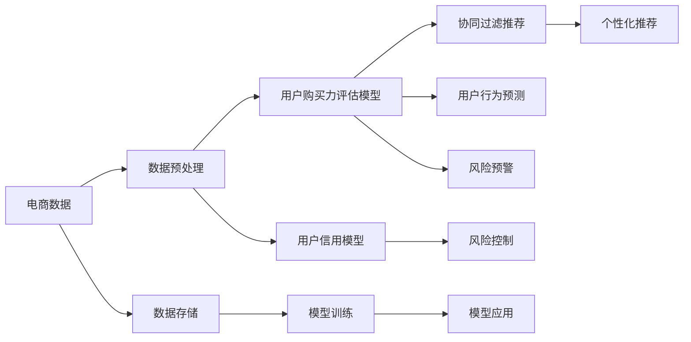

                 

# AI赋能的电商用户购买力评估与信用模型

> 关键词：AI赋能, 电商, 用户购买力评估, 信用模型, 协同过滤, 深度学习, 预测模型

## 1. 背景介绍

随着电商行业的快速发展，各大电商平台已不再仅仅关注交易量的增长，而是更加注重用户的全生命周期价值。用户购买力评估与信用模型的建设，成为了电商平台精细化运营的核心环节。传统基于规则或人工标签的用户画像模型存在精确度不高、特征维度有限等问题。而随着AI技术的不断进步，电商平台开始引入基于AI技术的用户画像模型，以期通过数据驱动的方式，更准确地刻画用户行为特征，评估用户购买力和信用等级。本文将详细介绍AI赋能的电商用户购买力评估与信用模型的构建方法、模型原理、实际应用和未来发展方向。

## 2. 核心概念与联系

### 2.1 核心概念概述

为更好地理解AI赋能的电商用户购买力评估与信用模型，本节将介绍几个密切相关的核心概念：

- **用户购买力评估**：指基于用户历史行为数据，通过机器学习模型预测用户未来的购买能力和消费潜力。
- **用户信用模型**：通过分析用户的历史交易数据和行为数据，建立用户信用风险评估模型，预测用户未来违约风险。
- **协同过滤**：通过分析用户和商品间的互动行为，推荐相似用户喜欢的商品或相似用户群体。
- **深度学习**：一种能够从数据中学习多层次抽象表示的机器学习方法，常用于大规模数据分析和预测。
- **预测模型**：通过训练数据集，学习用户行为模式，并应用于预测新用户的行为特征。

### 2.2 核心概念原理和架构的 Mermaid 流程图



## 3. 核心算法原理 & 具体操作步骤
### 3.1 算法原理概述

AI赋能的电商用户购买力评估与信用模型构建，基于数据驱动的机器学习框架。核心思想是通过对用户历史行为数据和交易数据的分析，建立用户行为特征与购买力和信用风险之间的关联模型。具体流程包括数据预处理、模型训练和模型应用等步骤。

### 3.2 算法步骤详解

**Step 1: 数据预处理**

电商数据通常包含用户行为数据、商品数据、交易数据等多种类型。首先，需要进行数据清洗和特征工程，构建用户行为特征集合。

1. **数据清洗**：去除噪声数据和缺失值，对异常值进行修正或删除。
2. **特征工程**：从电商数据中提取用户行为特征，如浏览次数、购买金额、评分、评价等。
3. **数据标准化**：将不同特征进行归一化处理，使不同特征具有可比性。

**Step 2: 模型训练**

基于预处理后的数据，训练用户购买力评估和信用模型。

1. **用户购买力评估模型**：通过历史交易数据和行为数据，训练预测模型，评估用户未来的购买能力和消费潜力。
2. **用户信用模型**：通过分析用户历史交易和行为数据，训练信用评估模型，预测用户未来违约风险。
3. **模型选择与优化**：选择适合的模型架构，如线性回归、决策树、随机森林、神经网络等，并通过交叉验证优化模型参数。

**Step 3: 模型应用**

在用户行为预测和信用评估的基础上，进行个性化推荐和风险控制。

1. **协同过滤推荐**：根据用户购买历史和行为特征，推荐用户可能感兴趣的商品或相似用户。
2. **风险预警**：基于信用模型评估，对高风险用户进行预警，防范潜在风险。
3. **模型更新与迭代**：定期更新模型参数，优化模型效果，以适应用户行为变化和数据分布变化。

### 3.3 算法优缺点

AI赋能的电商用户购买力评估与信用模型具有以下优点：
1. 数据驱动：基于电商平台的海量数据进行模型训练，具备更高的预测准确性和泛化能力。
2. 实时更新：通过实时数据流进行模型更新，保证模型效果的及时性和稳定性。
3. 用户画像精确：通过多维度特征和高级算法，精确刻画用户行为特征。
4. 应用场景广泛：可用于用户推荐、个性化营销、风险控制等多个电商场景。

同时，该方法也存在一定的局限性：
1. 数据质量依赖：模型效果依赖于高质量的数据输入，数据不完整或不准确将影响模型性能。
2. 计算资源需求高：训练复杂模型需大量计算资源，对硬件配置要求较高。
3. 模型复杂度高：高级模型（如深度学习）可能需要更多的训练时间和优化调试。
4. 隐私保护问题：需考虑用户数据隐私保护，避免数据泄露和滥用。

### 3.4 算法应用领域

AI赋能的电商用户购买力评估与信用模型，已在电商行业的多个领域得到应用，例如：

- **个性化推荐**：根据用户历史行为和特征，推荐商品或服务，提升用户体验和销售转化率。
- **风险管理**：评估用户信用风险，进行风险预警和防范，降低不良交易率。
- **市场营销**：通过用户画像，进行精准投放，提升广告效果和ROI。
- **库存管理**：预测用户需求，优化库存水平，避免缺货和积压。
- **客户服务**：预测用户投诉和退货风险，进行早期干预，提高客户满意度。

## 4. 数学模型和公式 & 详细讲解 & 举例说明
### 4.1 数学模型构建

AI赋能的电商用户购买力评估与信用模型通常基于机器学习算法，如线性回归、决策树、随机森林、神经网络等。这里以线性回归模型为例，介绍用户购买力评估模型的构建方法。

假设用户历史交易数据为 $x=\{(x_1, y_1), (x_2, y_2), \dots, (x_n, y_n)\}$，其中 $x$ 为特征向量，$y$ 为目标变量（购买力评分）。模型的目标是最小化预测值与真实值之间的误差，即最小化残差平方和（Residual Sum of Squares, RSS）。

目标函数为：
$$
\min \sum_{i=1}^{n} (y_i - \hat{y}_i)^2
$$

其中 $\hat{y}_i$ 为模型预测值，$y_i$ 为真实值。

### 4.2 公式推导过程

通过求解目标函数的最小值，可以得到线性回归模型的系数 $\beta$，即：
$$
\beta = \left(\sum_{i=1}^{n} x_i x_i^T \right)^{-1} \sum_{i=1}^{n} x_i y_i
$$

其中 $x_i x_i^T$ 为特征向量的协方差矩阵，$x_i y_i$ 为特征和目标变量的笛卡尔积向量。

### 4.3 案例分析与讲解

以电商平台用户购买力评估为例，假设有两个关键特征：用户月均浏览次数 $x_1$ 和用户平均消费金额 $x_2$。通过线性回归模型预测用户未来购买力评分 $y$。

根据数据集，可以计算得到特征向量的协方差矩阵和特征和目标变量的笛卡尔积向量。使用矩阵求逆和矩阵乘法计算出模型系数 $\beta$，最终得到预测模型为：
$$
\hat{y} = \beta_0 + \beta_1 x_1 + \beta_2 x_2
$$

其中 $\beta_0$ 为截距项，$\beta_1$ 和 $\beta_2$ 分别为特征 $x_1$ 和 $x_2$ 的系数。

## 5. 项目实践：代码实例和详细解释说明
### 5.1 开发环境搭建

在进行电商用户购买力评估与信用模型开发前，需要先准备好开发环境。以下是使用Python进行Pandas和Scikit-learn开发的环境配置流程：

1. 安装Anaconda：从官网下载并安装Anaconda，用于创建独立的Python环境。

2. 创建并激活虚拟环境：
```bash
conda create -n ai-env python=3.8 
conda activate ai-env
```

3. 安装相关库：
```bash
pip install pandas numpy scikit-learn seaborn matplotlib
```

完成上述步骤后，即可在`ai-env`环境中开始项目实践。

### 5.2 源代码详细实现

下面以电商用户购买力评估为例，给出使用Pandas和Scikit-learn进行线性回归模型开发的PyTorch代码实现。

```python
import pandas as pd
import numpy as np
from sklearn.linear_model import LinearRegression
from sklearn.metrics import mean_squared_error

# 读取数据集
df = pd.read_csv('user_behavior.csv')

# 数据预处理
X = df[['monthly_browsing', 'average_spending']]
y = df['purchase_power_score']

# 构建训练集和测试集
X_train, X_test, y_train, y_test = train_test_split(X, y, test_size=0.2, random_state=42)

# 构建模型
model = LinearRegression()
model.fit(X_train, y_train)

# 预测并评估
y_pred = model.predict(X_test)
rmse = np.sqrt(mean_squared_error(y_test, y_pred))
print(f'RMSE: {rmse:.2f}')
```

### 5.3 代码解读与分析

让我们再详细解读一下关键代码的实现细节：

**数据预处理**：
- `pd.read_csv()`方法：读取电商用户行为数据集。
- `train_test_split()`方法：将数据集划分为训练集和测试集。

**模型构建**：
- `LinearRegression()`类：创建线性回归模型。
- `fit()`方法：使用训练集数据拟合模型。

**预测与评估**：
- `predict()`方法：使用测试集数据进行预测。
- `mean_squared_error()`函数：计算预测值与真实值之间的均方误差。
- `np.sqrt()`函数：计算均方误差的平方根，得到RMSE（Root Mean Squared Error）。

可以看到，利用Pandas和Scikit-learn，我们可以用相对简洁的代码完成电商用户购买力评估模型的开发。

### 5.4 运行结果展示

运行上述代码，将输出预测模型的RMSE值，用于评估模型的预测效果。

## 6. 实际应用场景
### 6.1 个性化推荐

AI赋能的电商用户购买力评估与信用模型可以应用于个性化推荐系统，通过分析用户历史行为和交易数据，预测用户未来购买需求，推荐用户可能感兴趣的商品或服务。

在实际应用中，可以结合协同过滤算法，将用户分为兴趣相似组，进行个性化推荐。例如，根据用户浏览和购买历史，推荐用户可能感兴趣的商品，提升用户体验和销售转化率。

### 6.2 风险管理

电商平台的信用风险管理，也是AI赋能用户购买力评估与信用模型的重要应用场景。通过分析用户历史交易和行为数据，评估用户未来违约风险，进行风险预警和防范。

在风险管理中，信用模型可以对高风险用户进行预警，帮助平台提前采取措施，如调整用户权限、冻结账户等，降低不良交易率。

### 6.3 市场营销

基于用户画像的精准投放和广告效果评估，是电商营销的重要环节。通过AI赋能的购买力评估和信用模型，可以进行精准的用户行为预测，进行精准投放，提升广告效果和ROI。

例如，根据用户购买力和信用评分，将广告投放至高潜力用户，提升广告点击率和转化率。同时，可以通过模型评估广告效果，进行投放优化和调整。

## 7. 工具和资源推荐
### 7.1 学习资源推荐

为了帮助开发者系统掌握AI赋能的电商用户购买力评估与信用模型的理论基础和实践技巧，这里推荐一些优质的学习资源：

1. 《深度学习入门》系列博文：由深度学习领域专家撰写，深入浅出地介绍了深度学习的基本概念和常用算法，包括神经网络、线性回归等。
2. 《统计学习方法》课程：北京大学开设的统计学习经典课程，系统讲解了机器学习的基本原理和算法。
3. 《Python机器学习》书籍：由机器学习领域知名专家编写，详细介绍了机器学习模型的构建和应用，包括Pandas、Scikit-learn等工具的使用。
4. Kaggle平台：全球最大的数据科学竞赛平台，提供了丰富的电商数据集和相关竞赛，适合实践学习和经验积累。
5. GitHub代码库：提供了大量开源的电商数据分析和推荐系统代码，适合参考和借鉴。

通过对这些资源的学习实践，相信你一定能够快速掌握AI赋能的电商用户购买力评估与信用模型的精髓，并用于解决实际的电商问题。

### 7.2 开发工具推荐

高效的开发离不开优秀的工具支持。以下是几款用于电商用户购买力评估与信用模型开发的常用工具：

1. Jupyter Notebook：免费的交互式笔记本，支持Python代码编写和数据可视化，适合数据分析和模型开发。
2. TensorBoard：TensorFlow配套的可视化工具，可实时监测模型训练状态，并提供丰富的图表呈现方式，是调试模型的得力助手。
3. GitLab：代码管理和版本控制工具，适合团队协作和代码共享。
4. JupyterLab：Jupyter Notebook的升级版本，支持更丰富的插件和功能，适合大规模数据分析和模型开发。
5. PyCharm：强大的Python开发工具，支持代码编辑、调试和测试，适合开发复杂模型。

合理利用这些工具，可以显著提升AI赋能的电商用户购买力评估与信用模型的开发效率，加快创新迭代的步伐。

### 7.3 相关论文推荐

AI赋能的电商用户购买力评估与信用模型是近年来研究的热点领域，以下是几篇奠基性的相关论文，推荐阅读：

1. 《用户行为预测模型》：介绍用户行为预测的基本模型和方法，包括协同过滤、深度学习等。
2. 《电商信用风险评估模型》：系统介绍电商信用风险评估的方法和算法，包括线性回归、决策树等。
3. 《基于用户画像的精准投放》：介绍基于用户画像的精准投放模型，包括用户画像构建和投放策略优化。
4. 《电商个性化推荐系统》：系统介绍电商个性化推荐系统的设计和实现，包括用户行为分析和协同过滤推荐。
5. 《电商风险管理与预警系统》：介绍电商风险管理与预警系统的构建，包括信用风险评估和预警策略。

这些论文代表了大规模电商数据处理和用户行为预测的研究方向，通过学习这些前沿成果，可以帮助研究者把握学科前进方向，激发更多的创新灵感。

## 8. 总结：未来发展趋势与挑战
### 8.1 总结

本文对AI赋能的电商用户购买力评估与信用模型的构建方法、模型原理、实际应用和未来发展方向进行了全面系统的介绍。首先，介绍了电商用户购买力评估与信用模型的背景和意义，明确了AI技术在大规模数据分析和预测中的独特价值。其次，从原理到实践，详细讲解了AI模型的构建方法，包括数据预处理、模型训练和模型应用等关键步骤，给出了模型开发的完整代码实例。同时，本文还广泛探讨了模型在电商个性化推荐、风险管理等多个行业领域的应用前景，展示了AI模型的巨大潜力。最后，推荐了相关的学习资源和开发工具，以期为读者提供全方位的技术指引。

通过本文的系统梳理，可以看到，AI赋能的电商用户购买力评估与信用模型正成为电商数据分析和应用的核心技术，以数据驱动的方式提升了电商平台的运营效率和用户体验。未来，伴随AI技术的不断演进，电商领域的AI应用将更加广泛，为电商平台的持续创新和升级提供有力支撑。

### 8.2 未来发展趋势

展望未来，AI赋能的电商用户购买力评估与信用模型将呈现以下几个发展趋势：

1. 模型规模不断增大。随着深度学习和大数据技术的发展，模型规模将不断增大，具备更强的泛化能力和精度。
2. 实时化和高频化。通过实时数据流和流式计算技术，实现模型的实时化和高频化更新，提升模型效果和用户体验。
3. 多模态融合。将电商数据与多模态数据（如社交媒体、评价等）融合，提升用户行为预测的准确性和全面性。
4. 个性化推荐与风险管理结合。将个性化推荐和信用风险评估结合，实现更精准的用户画像和更有效的风险管理。
5. 元学习和自适应学习。通过元学习和自适应学习，提升模型的迁移能力和适应性，减少数据不平衡和模型过拟合风险。

这些趋势凸显了AI赋能电商模型的广阔前景，这些方向的探索发展，必将进一步提升电商平台的运营效率和用户体验，推动电商行业迈向更高的智能化水平。

### 8.3 面临的挑战

尽管AI赋能的电商用户购买力评估与信用模型已经取得了瞩目成就，但在迈向更加智能化、普适化应用的过程中，仍面临诸多挑战：

1. 数据质量和多样性。模型效果依赖于高质量的数据输入，电商平台的标签数据和特征维度有限，可能难以满足复杂模型的需求。
2. 计算资源消耗高。深度学习模型需要大量的计算资源，对硬件配置和数据存储提出了较高的要求。
3. 模型复杂度高。复杂的深度学习模型需要更多的训练时间和优化调试，可能难以在短时间内快速迭代和优化。
4. 隐私保护和公平性。用户数据隐私保护和模型公平性问题需要特别注意，避免数据泄露和模型偏见。

### 8.4 研究展望

面对AI赋能电商模型的挑战，未来的研究需要在以下几个方面寻求新的突破：

1. 数据增强和数据工程。通过数据增强和特征工程，提升电商数据的丰富度和多样性，满足复杂模型的需求。
2. 模型优化与高效计算。开发高效计算架构和模型优化方法，降低计算资源消耗，提升模型训练和推理效率。
3. 模型解释与公平性。开发可解释性强的模型，增强模型公平性和透明度，提升用户信任度。
4. 实时化和流式计算。探索实时化和流式计算技术，实现模型的实时化和高频化更新，提升模型效果和用户体验。
5. 多模态融合与跨领域应用。探索多模态数据融合和跨领域应用场景，提升模型的普适性和适应性。

这些研究方向将推动AI赋能的电商用户购买力评估与信用模型的发展，使其在更广泛的应用场景中发挥更大价值。

## 9. 附录：常见问题与解答
**Q1：AI赋能的电商用户购买力评估与信用模型是否适用于所有电商平台？**

A: AI赋能的电商用户购买力评估与信用模型适用于大多数电商平台，但需要根据平台的具体业务特点进行优化和调整。例如，针对B2B电商和C2C电商，需要分别构建适合的用户画像和评估模型。

**Q2：电商数据的多样性和准确性如何保证？**

A: 电商数据的多样性和准确性是模型效果的关键，通常通过以下方法保证：
1. 数据清洗和预处理：去除噪声数据和异常值，进行数据标准化和归一化。
2. 数据标注和标注质量控制：通过人工标注和质量控制，提升数据准确性。
3. 多数据源融合：结合不同数据源的数据，提升数据的丰富性和多样性。

**Q3：如何避免模型过拟合？**

A: 避免模型过拟合的方法包括：
1. 数据增强：通过数据增强技术，扩充训练集，提升模型泛化能力。
2. 正则化：使用L2正则化、Dropout等正则化技术，避免过拟合。
3. 模型复杂度控制：选择适合的模型架构，避免过度复杂化。
4. 超参数调优：通过交叉验证和网格搜索，优化模型超参数。

**Q4：电商数据的时效性和更新频率如何保证？**

A: 电商数据的时效性和更新频率是模型的关键性能指标，通常通过以下方法保证：
1. 实时数据流：通过实时数据流和流式计算技术，实现模型的实时化和高频化更新。
2. 数据同步机制：建立数据同步机制，及时更新模型参数和特征向量。
3. 分布式计算：使用分布式计算框架，提升数据处理和模型更新的效率。

**Q5：如何将电商数据和AI模型结合？**

A: 电商数据和AI模型的结合需要考虑以下几个关键点：
1. 数据采集和清洗：采集电商平台的数据，进行数据清洗和预处理。
2. 特征工程：提取电商数据中的关键特征，构建用户行为特征集合。
3. 模型训练和评估：使用训练集数据训练模型，在测试集上进行评估和优化。
4. 模型应用和部署：将训练好的模型应用于实际电商场景，进行用户画像、推荐和风险管理等应用。

通过系统化的方法，将电商数据和AI模型结合，可以显著提升电商平台的运营效率和用户体验。

---

作者：禅与计算机程序设计艺术 / Zen and the Art of Computer Programming

