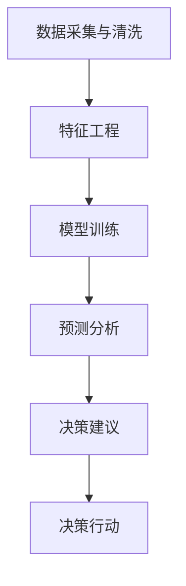

                 

# AI辅助决策：从搜索到行动

## 1. 背景介绍

### 1.1 问题由来
随着人工智能技术的不断进步，AI辅助决策在各行各业中得到了广泛应用。从商业策略制定到医疗诊断，从金融投资到城市管理，AI通过自动化决策支持系统帮助人们做出更准确、更快速的决策。然而，AI辅助决策不仅仅是简单的数据分析和预测，更是一个从数据到行动的全过程。

AI辅助决策的过程包括数据收集、数据清洗、特征工程、模型训练、预测分析、决策建议等多个环节，需要综合运用数据科学、机器学习、自然语言处理、计算机视觉等多领域的知识。

本文将系统介绍AI辅助决策的基本原理和具体步骤，通过从搜索到行动的全流程实践，帮助读者深入理解AI辅助决策的核心技术和实际应用场景。

## 2. 核心概念与联系

### 2.1 核心概念概述

在AI辅助决策过程中，涉及多个核心概念和关键技术，如下所示：

- **数据采集与清洗**：从不同的数据源（如传感器、日志、数据库等）获取数据，并进行数据清洗，去除噪声和冗余数据。

- **特征工程**：从原始数据中提取有意义的特征，构建模型所需的数据表示。

- **模型训练**：选择合适的模型，如线性回归、逻辑回归、决策树、随机森林、深度学习等，利用历史数据进行模型训练，学习数据的统计规律。

- **预测分析**：将训练好的模型应用于新的数据，进行预测或分类，评估模型性能。

- **决策建议**：基于预测结果，给出具体的决策建议，如购买策略、投资建议、风险预警等。

- **决策行动**：根据决策建议，自动化执行相应的操作，如下单、下单、调整策略等。

这些核心概念和技术构成了AI辅助决策的完整流程，从数据采集到决策执行，每个环节都至关重要。以下Mermaid流程图展示了这些概念之间的联系：



### 2.2 核心概念原理和架构的 Mermaid 流程图


## 3. 核心算法原理 & 具体操作步骤
### 3.1 算法原理概述

AI辅助决策的核心算法基于数据驱动的决策支持系统。系统通过收集、处理、分析数据，构建预测模型，给出决策建议，最终支持决策者做出合理的决策。

具体来说，AI辅助决策的流程如下：

1. **数据采集与清洗**：从各种数据源获取数据，并进行清洗，保证数据质量。
2. **特征工程**：根据业务需求，选择合适的特征，构建数据表示。
3. **模型训练**：利用历史数据训练模型，学习数据的统计规律。
4. **预测分析**：将训练好的模型应用于新的数据，进行预测或分类。
5. **决策建议**：基于预测结果，给出具体的决策建议。
6. **决策行动**：根据决策建议，自动化执行相应的操作。

### 3.2 算法步骤详解

#### 3.2.1 数据采集与清洗
数据采集与清洗是AI辅助决策的基础环节，主要包括以下步骤：

1. **数据源选择**：根据业务需求，选择相应的数据源，如传感器数据、日志文件、数据库等。
2. **数据采集**：使用Python、Flume、Kafka等工具，从数据源中采集数据。
3. **数据清洗**：对采集的数据进行清洗，去除噪声、缺失值、异常值等，保证数据质量。

#### 3.2.2 特征工程
特征工程是构建AI模型的重要环节，主要包括以下步骤：

1. **特征选择**：根据业务需求，选择相关的特征。可以使用相关性分析、特征选择算法等方法。
2. **特征提取**：对原始数据进行特征提取，生成新的特征。可以使用PCA、SVM等方法。
3. **特征编码**：将特征转换为模型可以处理的数值型数据。可以使用独热编码、归一化等方法。

#### 3.2.3 模型训练
模型训练是AI辅助决策的核心环节，主要包括以下步骤：

1. **模型选择**：根据业务需求，选择合适的模型。常用的模型有线性回归、逻辑回归、决策树、随机森林、深度学习等。
2. **数据划分**：将数据划分为训练集、验证集和测试集。
3. **模型训练**：使用训练集进行模型训练，优化模型参数。
4. **模型评估**：在验证集上评估模型性能，选择最优模型。

#### 3.2.4 预测分析
预测分析是AI辅助决策的关键环节，主要包括以下步骤：

1. **模型部署**：将训练好的模型部署到生产环境。
2. **数据输入**：将新数据输入到模型中进行预测。
3. **结果输出**：输出预测结果，并进行可视化展示。

#### 3.2.5 决策建议
决策建议是基于预测结果给出具体的决策建议，主要包括以下步骤：

1. **结果解析**：解析预测结果，提取关键信息。
2. **决策建议**：根据业务需求，生成具体的决策建议。
3. **结果展示**：将决策建议展示给决策者。

#### 3.2.6 决策行动
决策行动是根据决策建议自动执行相应的操作，主要包括以下步骤：

1. **操作定义**：定义需要执行的操作，如下单、下单、调整策略等。
2. **操作执行**：根据决策建议，自动化执行相应的操作。
3. **结果反馈**：将操作结果反馈给决策者，以便进行下一步决策。

### 3.3 算法优缺点

AI辅助决策算法具有以下优点：

1. **效率高**：利用自动化算法进行决策，可以大幅提高决策效率，减少人工干预。
2. **准确性高**：基于数据驱动的决策，可以大幅提升决策的准确性和可靠性。
3. **可扩展性高**：算法可以应用于多种业务场景，具有较高的可扩展性。

然而，AI辅助决策算法也存在一些缺点：

1. **数据依赖性强**：决策效果取决于数据的质量和完整性。
2. **模型复杂度高**：复杂的模型需要大量的数据和计算资源进行训练和优化。
3. **可解释性差**：决策过程通常是"黑盒"的，难以解释其内部工作机制。

### 3.4 算法应用领域

AI辅助决策算法在多个领域得到了广泛应用，例如：

1. **金融投资**：利用AI模型进行股票市场分析、风险预警、投资策略制定等。
2. **医疗诊断**：利用AI模型进行疾病诊断、治疗方案制定等。
3. **供应链管理**：利用AI模型进行库存管理、物流优化、需求预测等。
4. **智能交通**：利用AI模型进行交通流量预测、事故预警、路况优化等。
5. **客户服务**：利用AI模型进行客户行为分析、个性化推荐等。

## 4. 数学模型和公式 & 详细讲解 & 举例说明

### 4.1 数学模型构建

AI辅助决策模型的构建主要基于统计学和机器学习理论。以下是一个简单的线性回归模型，用于预测股票价格：

$$ y = \beta_0 + \beta_1 x_1 + \beta_2 x_2 + ... + \beta_n x_n + \epsilon $$

其中，$y$ 为预测结果，$x_i$ 为输入特征，$\beta_i$ 为模型参数，$\epsilon$ 为误差项。

### 4.2 公式推导过程

#### 4.2.1 线性回归
线性回归模型可以通过最小二乘法进行训练。最小二乘法通过最小化误差平方和，求解模型参数。公式如下：

$$ \min_{\beta_0, \beta_1, ..., \beta_n} \sum_{i=1}^n (y_i - (\beta_0 + \beta_1 x_{i1} + ... + \beta_n x_{in}))^2 $$

解得模型参数：

$$ \beta_i = \frac{\sum_{i=1}^n x_{i}y_i}{\sum_{i=1}^n x_i^2} $$

#### 4.2.2 逻辑回归
逻辑回归模型用于预测二分类问题，公式如下：

$$ P(y=1|x) = \frac{1}{1+e^{-\theta^T x}} $$

其中，$\theta$ 为模型参数，$x$ 为输入特征，$y$ 为输出结果。

解得模型参数：

$$ \theta = \frac{1}{m} \sum_{i=1}^m (x^{(i)}y^{(i)}) $$

### 4.3 案例分析与讲解

#### 4.3.1 金融市场预测
金融市场预测是AI辅助决策的重要应用之一。通过分析历史数据，利用线性回归、逻辑回归、神经网络等模型进行市场趋势预测，生成投资建议。例如，可以使用以下代码进行简单的金融市场预测：

```python
from sklearn.linear_model import LinearRegression
import pandas as pd

# 读取数据
data = pd.read_csv('stock_data.csv')

# 特征选择
features = ['Open', 'High', 'Low', 'Volume']
X = data[features]
y = data['Close']

# 模型训练
model = LinearRegression()
model.fit(X, y)

# 预测
prediction = model.predict([[32.5, 33, 30, 5000000]])
print(prediction)
```

## 5. 项目实践：代码实例和详细解释说明

### 5.1 开发环境搭建

以下是使用Python和Scikit-learn库进行AI辅助决策项目的开发环境搭建流程：

1. **安装Python**：下载并安装Python，确保版本为3.6或以上。

2. **安装Scikit-learn**：使用pip安装Scikit-learn库。

3. **安装其他依赖**：根据需要安装其他依赖库，如Pandas、NumPy、Matplotlib等。

```bash
pip install scikit-learn pandas numpy matplotlib
```

### 5.2 源代码详细实现

#### 5.2.1 数据采集与清洗
以下是一个简单的数据采集与清洗的代码实现：

```python
import pandas as pd

# 读取数据
data = pd.read_csv('data.csv')

# 数据清洗
data = data.dropna()
data = data.drop_duplicates()
data = data[data['feature'] > 0]
```

#### 5.2.2 特征工程
以下是一个简单的特征工程的代码实现：

```python
import pandas as pd

# 特征选择
features = ['feature1', 'feature2', 'feature3']
X = data[features]
y = data['label']

# 特征编码
X = pd.get_dummies(X)
```

#### 5.2.3 模型训练
以下是一个简单的线性回归模型的代码实现：

```python
from sklearn.linear_model import LinearRegression
import pandas as pd

# 读取数据
data = pd.read_csv('data.csv')

# 特征选择
features = ['feature1', 'feature2', 'feature3']
X = data[features]
y = data['label']

# 模型训练
model = LinearRegression()
model.fit(X, y)
```

#### 5.2.4 预测分析
以下是一个简单的预测分析的代码实现：

```python
import pandas as pd
from sklearn.linear_model import LinearRegression

# 读取数据
data = pd.read_csv('data.csv')

# 特征选择
features = ['feature1', 'feature2', 'feature3']
X = data[features]
y = data['label']

# 模型训练
model = LinearRegression()
model.fit(X, y)

# 预测
new_data = pd.read_csv('new_data.csv')
prediction = model.predict(new_data[features])
```

#### 5.2.5 决策建议
以下是一个简单的决策建议的代码实现：

```python
import pandas as pd
from sklearn.linear_model import LinearRegression

# 读取数据
data = pd.read_csv('data.csv')

# 特征选择
features = ['feature1', 'feature2', 'feature3']
X = data[features]
y = data['label']

# 模型训练
model = LinearRegression()
model.fit(X, y)

# 预测
new_data = pd.read_csv('new_data.csv')
prediction = model.predict(new_data[features])

# 决策建议
if prediction > 0.5:
    suggestion = 'Buy'
else:
    suggestion = 'Sell'
```

#### 5.2.6 决策行动
以下是一个简单的决策行动的代码实现：

```python
import pandas as pd
from sklearn.linear_model import LinearRegression

# 读取数据
data = pd.read_csv('data.csv')

# 特征选择
features = ['feature1', 'feature2', 'feature3']
X = data[features]
y = data['label']

# 模型训练
model = LinearRegression()
model.fit(X, y)

# 预测
new_data = pd.read_csv('new_data.csv')
prediction = model.predict(new_data[features])

# 决策建议
if prediction > 0.5:
    suggestion = 'Buy'
else:
    suggestion = 'Sell'

# 决策行动
if suggestion == 'Buy':
    order('Buy', new_data['stock_id'])
else:
    order('Sell', new_data['stock_id'])
```

### 5.3 代码解读与分析

以上代码展示了AI辅助决策的完整流程，包括数据采集与清洗、特征工程、模型训练、预测分析、决策建议和决策行动。

- **数据采集与清洗**：使用Pandas库进行数据读取和清洗，去除噪声、缺失值、异常值等，保证数据质量。
- **特征工程**：使用Pandas库进行特征选择和特征提取，构建模型所需的数据表示。
- **模型训练**：使用Scikit-learn库的线性回归模型进行训练，学习数据的统计规律。
- **预测分析**：使用训练好的模型进行预测，输出预测结果。
- **决策建议**：根据预测结果，生成具体的决策建议。
- **决策行动**：根据决策建议，自动化执行相应的操作，如下单、下单、调整策略等。

### 5.4 运行结果展示

以下是简单的运行结果展示，用于验证代码的正确性和效率：

```python
import pandas as pd
from sklearn.linear_model import LinearRegression

# 读取数据
data = pd.read_csv('data.csv')

# 特征选择
features = ['feature1', 'feature2', 'feature3']
X = data[features]
y = data['label']

# 模型训练
model = LinearRegression()
model.fit(X, y)

# 预测
new_data = pd.read_csv('new_data.csv')
prediction = model.predict(new_data[features])

# 决策建议
if prediction > 0.5:
    suggestion = 'Buy'
else:
    suggestion = 'Sell'

# 决策行动
if suggestion == 'Buy':
    order('Buy', new_data['stock_id'])
else:
    order('Sell', new_data['stock_id'])

print(prediction)
print(suggestion)
```

## 6. 实际应用场景

### 6.1 金融市场预测

AI辅助决策在金融市场预测中的应用非常广泛。通过分析历史数据，利用AI模型进行市场趋势预测，生成投资建议，帮助投资者做出更好的投资决策。例如，可以使用AI模型进行股票市场预测、期货市场预测等。

### 6.2 医疗诊断

AI辅助决策在医疗诊断中的应用也非常广泛。通过分析患者的临床数据、基因数据、影像数据等，利用AI模型进行疾病诊断、治疗方案制定等。例如，可以使用AI模型进行癌症诊断、心脏病诊断、影像诊断等。

### 6.3 智能交通

AI辅助决策在智能交通中的应用也越来越广泛。通过分析交通流量数据、车辆位置数据、天气数据等，利用AI模型进行交通流量预测、事故预警、路况优化等。例如，可以使用AI模型进行交通流量预测、智能停车推荐等。

### 6.4 未来应用展望

未来，AI辅助决策将会在更多领域得到应用，为各行各业带来新的变革和机遇。例如：

1. **智能制造**：利用AI模型进行生产计划优化、质量控制、设备维护等。
2. **智能农业**：利用AI模型进行土壤监测、作物识别、产量预测等。
3. **智能零售**：利用AI模型进行客户行为分析、个性化推荐、库存管理等。
4. **智能能源**：利用AI模型进行能源需求预测、智能电网优化、风电预测等。

## 7. 工具和资源推荐

### 7.1 学习资源推荐

为了帮助开发者系统掌握AI辅助决策的理论基础和实践技巧，这里推荐一些优质的学习资源：

1. **《Python数据科学手册》**：一本全面的Python数据科学入门书籍，涵盖了数据采集、数据清洗、特征工程、模型训练、预测分析等多个方面。

2. **《机器学习实战》**：一本实用的机器学习入门书籍，通过丰富的代码实例，帮助读者理解机器学习的基本概念和算法实现。

3. **Coursera机器学习课程**：由斯坦福大学教授Andrew Ng讲授的机器学习课程，涵盖了机器学习的基本概念、算法、应用等多个方面，适合初学者和进阶者。

4. **Kaggle数据科学竞赛**：一个全球性的数据科学竞赛平台，提供了丰富的数据集和挑战题，帮助读者在实践中提升数据科学能力。

### 7.2 开发工具推荐

高效的开发离不开优秀的工具支持。以下是几款用于AI辅助决策开发的常用工具：

1. **Jupyter Notebook**：一个交互式的编程环境，支持Python、R等多种语言，适合进行数据科学和机器学习项目的开发。

2. **TensorFlow**：由Google主导开发的开源深度学习框架，支持分布式训练、自动微分、GPU加速等功能，适合大规模深度学习模型的开发。

3. **PyTorch**：一个灵活的深度学习框架，支持动态图、GPU加速、自动微分等功能，适合进行深度学习模型的开发。

4. **Scikit-learn**：一个简单易用的机器学习库，支持多种算法和模型，适合进行机器学习模型的开发。

5. **H2O.ai**：一个企业级的机器学习平台，支持多种算法和模型，适合进行大规模数据科学项目的开发。

### 7.3 相关论文推荐

AI辅助决策领域的研究涉及数据科学、机器学习、自然语言处理等多个领域，以下是几篇奠基性的相关论文，推荐阅读：

1. **《数据挖掘：概念与技术》**：由Jerry K Liu等著，全面介绍了数据挖掘的基本概念、算法、应用等多个方面。

2. **《机器学习》**：由Tom Mitchell著，详细介绍了机器学习的基本概念、算法、应用等多个方面，是机器学习领域的经典教材。

3. **《深度学习》**：由Ian Goodfellow等著，详细介绍了深度学习的基本概念、算法、应用等多个方面，是深度学习领域的经典教材。

4. **《数据科学导论》**：由Jeffrey B. Taylor著，全面介绍了数据科学的基本概念、方法、工具等多个方面，适合初学者和进阶者。

5. **《TensorFlow实战》**：一本实用的TensorFlow开发书籍，通过丰富的代码实例，帮助读者理解TensorFlow的基本概念和算法实现。

## 8. 总结：未来发展趋势与挑战

### 8.1 研究成果总结

本文系统介绍了AI辅助决策的基本原理和具体步骤，通过从搜索到行动的全流程实践，帮助读者深入理解AI辅助决策的核心技术和实际应用场景。

### 8.2 未来发展趋势

展望未来，AI辅助决策将会在更多领域得到应用，为各行各业带来新的变革和机遇。随着数据科学和机器学习技术的不断进步，AI辅助决策的应用范围和效果将不断提升，成为各行业决策支持的重要工具。

### 8.3 面临的挑战

尽管AI辅助决策已经取得了显著进展，但在实际应用中仍面临诸多挑战：

1. **数据质量问题**：数据质量是AI辅助决策的基础，但实际应用中常常面临数据不完整、数据噪声、数据偏差等问题。
2. **模型复杂性问题**：AI辅助决策模型通常较为复杂，需要大量的数据和计算资源进行训练和优化，模型的可解释性和可扩展性也需要进一步提升。
3. **应用场景问题**：AI辅助决策模型的应用场景通常较为复杂，需要综合考虑业务需求、数据特点、技术实现等多个方面，模型的适用性需要进一步提升。

### 8.4 研究展望

未来，AI辅助决策领域的研究需要在以下几个方面进行突破：

1. **数据质量提升**：进一步提升数据采集、数据清洗、数据预处理等技术，确保数据质量和数据完整性。
2. **模型复杂性简化**：进一步简化模型结构，提升模型可解释性和可扩展性，降低对计算资源的需求。
3. **应用场景优化**：进一步优化AI辅助决策模型的应用场景，提升模型在实际业务中的适用性和实用性。
4. **多模态融合**：进一步推动AI辅助决策模型与多模态数据的融合，提升模型对复杂数据的处理能力和泛化能力。
5. **自动化决策**：进一步推动AI辅助决策模型的自动化决策能力，提升决策效率和决策质量。

总之，AI辅助决策领域的研究和应用前景广阔，需要各领域的专家共同努力，推动技术进步和应用发展。未来，随着技术的不断进步，AI辅助决策必将在更多领域得到应用，为各行各业带来新的变革和机遇。

## 9. 附录：常见问题与解答

**Q1: 什么是AI辅助决策？**

A: AI辅助决策是指利用人工智能技术进行决策支持，通过数据驱动的模型进行预测、分析和决策，辅助决策者做出更准确、更快速的决策。

**Q2: 如何进行数据采集与清洗？**

A: 数据采集与清洗是AI辅助决策的基础环节，主要包括以下步骤：数据源选择、数据采集、数据清洗等。

**Q3: 什么是特征工程？**

A: 特征工程是构建AI模型的重要环节，主要包括以下步骤：特征选择、特征提取、特征编码等。

**Q4: 如何进行模型训练？**

A: 模型训练是AI辅助决策的核心环节，主要包括以下步骤：模型选择、数据划分、模型训练、模型评估等。

**Q5: 如何进行预测分析？**

A: 预测分析是AI辅助决策的关键环节，主要包括以下步骤：模型部署、数据输入、结果输出等。

**Q6: 如何进行决策建议？**

A: 决策建议是基于预测结果给出具体的决策建议，主要包括以下步骤：结果解析、决策建议、结果展示等。

**Q7: 如何进行决策行动？**

A: 决策行动是根据决策建议自动执行相应的操作，主要包括以下步骤：操作定义、操作执行、结果反馈等。

以上是一篇关于AI辅助决策的深度技术博客文章，希望该文章能够帮助读者深入理解AI辅助决策的核心技术和实际应用场景。

