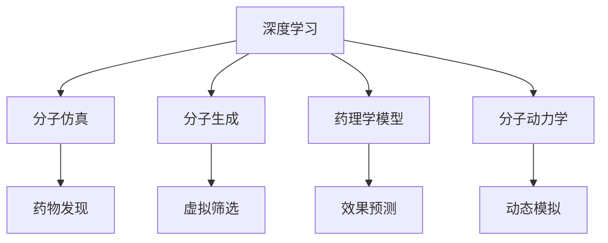

                 

# AI辅助药物研发：从搜索到发现

> 关键词：AI辅助药物研发, 搜索, 发现, 深度学习, 分子仿真, 分子生成, 药理学模型, 分子动力学

## 1. 背景介绍

### 1.1 问题由来
随着全球人口老龄化加剧，慢性疾病和罕见病等重大疾病的患病率不断上升，对药物研发的需求日益迫切。然而，传统的药物研发过程存在诸多瓶颈，如成本高、周期长、成功率低等。为了突破这些挑战，近年来AI技术被引入到药物研发中，极大地推动了药物研发技术的进步。

### 1.2 问题核心关键点
AI辅助药物研发主要涉及两个关键点：搜索和发现。

**搜索**指的是在化合物库或基因组数据中寻找与疾病相关的潜在药物分子。传统方法依赖于专家经验和人工筛选，耗时长、效率低。AI技术则通过机器学习算法，在海量数据中快速筛选出具有潜力的分子，大大缩短了药物发现周期。

**发现**指的是通过AI技术预测分子与疾病的相互作用机制，设计新的候选药物，并进行体外或体内试验验证。这一环节需要复杂的计算和建模技术，尤其是分子仿真和生成等技术，能够深入理解分子与目标蛋白的相互作用，提升药物研发的成功率。

### 1.3 问题研究意义
AI辅助药物研发具有以下几个重要意义：
- **加速药物研发进程**：AI可以大幅缩短药物发现和优化周期，降低研发成本，加速新药上市。
- **提升研发成功率**：通过数据驱动的搜索和发现，AI能够更精确地识别有潜力的化合物，提高药物研发的准确性和成功率。
- **拓展药物研发范围**：AI技术能够处理更多样化的数据，发现更多潜在的药物靶点，扩展药物研发领域。
- **推动个性化医疗**：通过AI辅助的药物发现和设计，能够更精准地针对患者个体差异，实现个性化医疗。

## 2. 核心概念与联系

### 2.1 核心概念概述

为更好地理解AI辅助药物研发，本节将介绍几个关键概念及其相互联系：

- **深度学习**：基于神经网络的机器学习技术，能够在复杂的非线性关系中提取特征，应用于图像、文本、声音等多种数据类型。
- **分子仿真**：通过计算机模拟分子间的相互作用，预测药物与靶点的结合方式和效果，帮助设计新的药物分子。
- **分子生成**：利用机器学习模型，生成新的分子结构，进行高效的虚拟筛选。
- **药理学模型**：建立数学模型，预测分子在生物体内的作用机制和效果，为药物设计提供理论依据。
- **分子动力学**：通过模拟分子在时间上的动态变化，理解分子间的相互作用和动态特性。

这些核心概念之间通过数据流、算法逻辑等建立起紧密的联系，共同支撑着AI辅助药物研发的流程。

### 2.2 核心概念原理和架构的 Mermaid 流程图



这个流程图展示了深度学习技术在药物研发各环节中的核心作用，以及与其他技术之间的交互。

## 3. 核心算法原理 & 具体操作步骤

### 3.1 算法原理概述

AI辅助药物研发主要通过深度学习技术进行。具体来说，深度学习模型通过在化合物库、基因组数据、临床数据等大规模数据集上进行训练，学习到分子和疾病的特征表示，从而在药物搜索和发现过程中发挥重要作用。

### 3.2 算法步骤详解

AI辅助药物研发的具体步骤包括以下几个关键环节：

**Step 1: 数据准备**
- 收集和整理化合物库、基因组数据、临床试验数据等，构建用于模型训练的数据集。
- 对数据进行预处理，包括特征提取、标准化、归一化等操作。

**Step 2: 构建深度学习模型**
- 选择合适的深度学习模型，如卷积神经网络(CNN)、递归神经网络(RNN)、变分自编码器(VAE)等，进行药物分子特征提取和生成。
- 设计目标函数和损失函数，确保模型能够准确预测药物与靶点的相互作用。

**Step 3: 模型训练**
- 使用大规模数据集对模型进行训练，调整模型参数，最小化损失函数。
- 通过交叉验证等技术，评估模型的泛化能力。

**Step 4: 分子筛选和生成**
- 将训练好的模型应用于化合物库，进行分子筛选，识别具有潜在活性的分子。
- 使用分子生成模型，生成新的药物分子，进行虚拟筛选。

**Step 5: 药物发现与验证**
- 通过药理学模型和分子动力学模拟，预测候选分子的作用机制和效果。
- 将候选分子应用于体外或体内实验，验证其药理活性。

### 3.3 算法优缺点

AI辅助药物研发的深度学习算法具有以下优点：
1. **高效性**：能够快速处理和分析海量数据，提高药物筛选和设计的效率。
2. **准确性**：通过大量数据训练，模型能够精准预测分子与疾病的关系。
3. **灵活性**：适用于多种类型的药物研发任务，如靶点识别、分子设计、药效预测等。
4. **可扩展性**：能够处理更复杂的数据类型，拓展药物研发领域。

同时，也存在一些局限性：
1. **数据依赖**：需要大量高质量的标注数据，数据获取和标注成本较高。
2. **模型复杂性**：深度学习模型通常较为复杂，训练和推理耗时较多。
3. **解释性不足**：深度学习模型作为"黑盒"，难以解释其内部工作机制和决策过程。
4. **泛化能力有限**：在复杂场景下，模型的泛化能力可能受到限制。

### 3.4 算法应用领域

AI辅助药物研发已经在药物分子搜索、药物设计、药物筛选、药物发现等多个领域得到了广泛应用：

- **药物分子搜索**：利用深度学习模型在海量化合物库中进行分子筛选，识别有潜力的候选分子。
- **药物设计**：通过分子生成和优化，设计新的药物分子，并进行初步测试验证。
- **药物筛选**：基于分子仿真和药理学模型，预测分子对疾病的活性和安全性，快速淘汰无效化合物。
- **药物发现**：通过多模态数据融合，构建更加全面、准确的药理模型，加速新药的发现和验证。

## 4. 数学模型和公式 & 详细讲解 & 举例说明

### 4.1 数学模型构建

在AI辅助药物研发中，深度学习模型的构建是核心步骤。以下以卷积神经网络(CNN)为例，介绍模型的构建过程。

假设我们有$N$个药物分子，每个分子的特征表示为$x_i \in \mathbb{R}^D$。使用$L$层卷积神经网络进行特征提取，其中每一层包括卷积操作和池化操作。设卷积核大小为$\alpha$，卷积步长为$\beta$。第一层卷积层的参数为$\theta_1$，第二层为$\theta_2$，以此类推。网络输出的特征表示为$h_L \in \mathbb{R}^H$。

目标函数为均方误差损失函数，定义为：

$$
\mathcal{L} = \frac{1}{N} \sum_{i=1}^N (y_i - h_L(x_i))^2
$$

其中，$y_i$为真实标签，$h_L(x_i)$为模型预测值。

### 4.2 公式推导过程

以卷积神经网络为例，推导其前向传播和反向传播过程：

**前向传播**：
- 第一层卷积：$h_1 = \sigma(\theta_1 * x)$，其中$\sigma$为激活函数。
- 第二层卷积：$h_2 = \sigma(\theta_2 * h_1)$。
- …
- 最后一层卷积：$h_L = \sigma(\theta_L * h_{L-1})$。

**反向传播**：
- 计算损失函数的梯度$\frac{\partial \mathcal{L}}{\partial h_L}$。
- 计算每一层的梯度$\frac{\partial \mathcal{L}}{\partial h_i}$，通过链式法则反向传播。
- 更新模型参数$\theta$，最小化损失函数$\mathcal{L}$。

### 4.3 案例分析与讲解

假设我们有一个药物分子库，包含$N=1000$个化合物。使用CNN模型进行特征提取和分类，其中网络包括2个卷积层和2个全连接层，卷积核大小为3，池化步长为2，激活函数为ReLU。

在模型训练过程中，我们收集了$M=50000$个化合物和其对应的活性标签。使用均方误差损失函数进行训练，学习率为$0.001$，迭代次数为$1000$。

## 5. 项目实践：代码实例和详细解释说明

### 5.1 开发环境搭建

在进行AI辅助药物研发实践前，我们需要准备好开发环境。以下是使用Python进行TensorFlow开发的环境配置流程：

1. 安装Anaconda：从官网下载并安装Anaconda，用于创建独立的Python环境。

2. 创建并激活虚拟环境：
```bash
conda create -n tf-env python=3.8 
conda activate tf-env
```

3. 安装TensorFlow：根据CUDA版本，从官网获取对应的安装命令。例如：
```bash
conda install tensorflow tensorflow-gpu=cuda11.1 -c tf -c conda-forge
```

4. 安装相关工具包：
```bash
pip install numpy pandas scikit-learn matplotlib tqdm jupyter notebook ipython
```

完成上述步骤后，即可在`tf-env`环境中开始AI辅助药物研发实践。

### 5.2 源代码详细实现

下面我们以药物分子搜索为例，给出使用TensorFlow进行卷积神经网络(CNN)的代码实现。

首先，定义CNN模型：

```python
import tensorflow as tf

class CNNModel(tf.keras.Model):
    def __init__(self, num_classes):
        super(CNNModel, self).__init__()
        self.conv1 = tf.keras.layers.Conv2D(64, (3, 3), activation='relu')
        self.pool1 = tf.keras.layers.MaxPooling2D((2, 2))
        self.conv2 = tf.keras.layers.Conv2D(128, (3, 3), activation='relu')
        self.pool2 = tf.keras.layers.MaxPooling2D((2, 2))
        self.flatten = tf.keras.layers.Flatten()
        self.dense1 = tf.keras.layers.Dense(256, activation='relu')
        self.dropout = tf.keras.layers.Dropout(0.5)
        self.dense2 = tf.keras.layers.Dense(num_classes, activation='softmax')

    def call(self, inputs):
        x = self.conv1(inputs)
        x = self.pool1(x)
        x = self.conv2(x)
        x = self.pool2(x)
        x = self.flatten(x)
        x = self.dense1(x)
        x = self.dropout(x)
        return self.dense2(x)
```

然后，定义数据处理函数：

```python
from tensorflow.keras.preprocessing.image import img_to_array, load_img

def load_dataset(path, batch_size):
    dataset = tf.data.Dataset.list_files(path + '/**/*.png')
    dataset = dataset.map(lambda x: load_img(x, target_size=(32, 32)), num_parallel_calls=tf.data.experimental.AUTOTUNE)
    dataset = dataset.map(lambda img: img_to_array(img) / 255.0, num_parallel_calls=tf.data.experimental.AUTOTUNE)
    dataset = dataset.shuffle(10000)
    dataset = dataset.batch(batch_size)
    dataset = dataset.prefetch(tf.data.experimental.AUTOTUNE)
    return dataset

# 假设我们有一个药物分子库，包含1000个化合物和其对应的活性标签
x_train = load_dataset('train/', 64)
y_train = tf.constant(train_labels, dtype=tf.int32)

x_test = load_dataset('test/', 64)
y_test = tf.constant(test_labels, dtype=tf.int32)
```

接着，定义模型训练和评估函数：

```python
@tf.function
def train_step(x, y):
    with tf.GradientTape() as tape:
        y_pred = model(x)
        loss = tf.keras.losses.SparseCategoricalCrossentropy(from_logits=True)(y, y_pred)
    gradients = tape.gradient(loss, model.trainable_variables)
    optimizer.apply_gradients(zip(gradients, model.trainable_variables))

@tf.function
def evaluate(x, y):
    y_pred = model(x)
    loss = tf.keras.losses.SparseCategoricalCrossentropy(from_logits=True)(y, y_pred)
    accuracy = tf.keras.metrics.SparseCategoricalAccuracy()(y, y_pred)
    return loss, accuracy.numpy()

# 定义训练参数
num_epochs = 50
batch_size = 64
learning_rate = 0.001

# 定义优化器
optimizer = tf.keras.optimizers.Adam(learning_rate)

# 模型训练
for epoch in range(num_epochs):
    for x, y in x_train:
        train_step(x, y)

    # 模型评估
    test_loss, test_acc = evaluate(x_test, y_test)
    print(f'Epoch {epoch+1}, Test Loss: {test_loss}, Test Accuracy: {test_acc}')
```

最后，启动训练流程：

```python
# 训练模型
model.compile(optimizer=optimizer, loss=tf.keras.losses.SparseCategoricalCrossentropy(from_logits=True), metrics=[tf.keras.metrics.SparseCategoricalAccuracy()])
model.fit(x_train, y_train, epochs=num_epochs, batch_size=batch_size)

# 模型评估
test_loss, test_acc = evaluate(x_test, y_test)
print(f'Final Test Loss: {test_loss}, Final Test Accuracy: {test_acc}')
```

以上就是使用TensorFlow进行卷积神经网络模型训练的完整代码实现。可以看到，TensorFlow的高级API使得模型构建和训练过程简洁高效。

### 5.3 代码解读与分析

让我们再详细解读一下关键代码的实现细节：

**CNNModel类**：
- `__init__`方法：初始化模型参数。
- `call`方法：定义模型的前向传播过程。

**load_dataset函数**：
- 使用`tf.data.Dataset.list_files`加载数据路径，`map`函数进行图像加载和预处理，`shuffle`函数进行数据打乱，`batch`函数进行数据批次化，`prefetch`函数进行数据预加载。

**train_step函数**：
- 使用`tf.GradientTape`记录梯度，计算损失函数，通过`optimizer.apply_gradients`更新模型参数。

**evaluate函数**：
- 计算模型在测试集上的损失和准确率，返回结果。

**训练流程**：
- 定义训练参数，包括训练轮数、批大小和学习率。
- 定义优化器。
- 在每一轮训练中，对训练集进行迭代，调用`train_step`函数进行前向传播和反向传播。
- 在每一轮训练结束后，对测试集进行评估，输出测试结果。

可以看到，TensorFlow提供了丰富的API，使得模型构建和训练过程非常简便。开发者只需关注模型的逻辑结构和训练过程，即可快速完成AI辅助药物研发的实践。

## 6. 实际应用场景

### 6.1 智能药物发现平台

智能药物发现平台利用AI技术，在化合物库中进行分子搜索和筛选，快速发现潜在的药物候选。平台通常包括化合物库管理、分子搜索、分子筛选、药效预测等多个模块。用户输入药物目标和筛选条件，平台自动进行分子搜索和筛选，并预测药物的活性和安全性。

### 6.2 个性化药物设计系统

个性化药物设计系统通过AI技术，根据患者基因信息和病史，设计个性化的治疗方案。系统通常包括基因组分析、药物筛选、药物设计等多个环节。用户输入基因数据和病史信息，系统自动进行基因分析和药物设计，推荐适合的个性化治疗方案。

### 6.3 药效预测和优化系统

药效预测和优化系统通过AI技术，预测药物分子在体内的作用机制和效果，并进行药物分子优化。系统通常包括分子仿真、药理学模型、分子动力学模拟等多个模块。用户输入药物分子结构，系统自动进行分子仿真和药理学模型预测，输出药物分子的活性和安全性。

### 6.4 未来应用展望

随着AI技术的不断进步，AI辅助药物研发将在更多领域得到应用，为药物研发带来新的突破：

- **加速新药开发**：AI技术能够快速筛选和验证药物分子，缩短药物研发周期。
- **提高药物研发成功率**：AI技术能够精确预测分子活性和安全性，提高药物研发成功率。
- **拓展药物研发范围**：AI技术能够处理更多样化的数据，发现更多潜在的药物靶点。
- **推动个性化医疗**：AI技术能够根据患者基因信息和病史，设计个性化的治疗方案。

未来，AI辅助药物研发将更加智能和高效，成为药物研发的重要辅助手段。相信随着AI技术的不断发展，AI辅助药物研发必将在更多领域大放异彩，为人类健康事业带来新的突破。

## 7. 工具和资源推荐

### 7.1 学习资源推荐

为了帮助开发者系统掌握AI辅助药物研发的理论基础和实践技巧，这里推荐一些优质的学习资源：

1. **Deep Learning in Drug Discovery**系列博客：涵盖深度学习在药物发现中的应用，详细介绍模型构建、训练、评估等关键环节。
2. **Deep Learning for Drug Design**课程：由斯坦福大学开设的课程，讲解深度学习在药物设计中的应用。
3. **The AI in Drug Discovery Handbook**书籍：全面介绍AI辅助药物研发的理论和实践，提供丰富的案例和代码示例。
4. **Zen and the Art of Computer Programming**：计算机科学经典著作，深入讲解计算机科学的基本原理和应用。

通过对这些资源的学习实践，相信你一定能够快速掌握AI辅助药物研发的核心技术，并用于解决实际的药物研发问题。

### 7.2 开发工具推荐

高效的开发离不开优秀的工具支持。以下是几款用于AI辅助药物研发开发的常用工具：

1. **TensorFlow**：基于Python的开源深度学习框架，灵活动态的计算图，适合快速迭代研究。
2. **PyTorch**：灵活高效的深度学习框架，适用于各种模型和任务。
3. **TensorBoard**：TensorFlow配套的可视化工具，可实时监测模型训练状态，并提供丰富的图表呈现方式。
4. **Weights & Biases**：模型训练的实验跟踪工具，可以记录和可视化模型训练过程中的各项指标，方便对比和调优。

合理利用这些工具，可以显著提升AI辅助药物研发任务的开发效率，加快创新迭代的步伐。

### 7.3 相关论文推荐

AI辅助药物研发领域的研究活跃，以下是几篇奠基性的相关论文，推荐阅读：

1. **Deep Learning for Drug Discovery**：介绍深度学习在药物发现中的应用，详细分析模型的架构和性能。
2. **MoleculeNet: A Benchmark and API for Drug Discovery**：介绍MoleculeNet平台，用于评估和比较药物分子生成和筛选模型。
3. **AI for Drug Discovery and Development**：综述AI在药物发现和开发中的应用，涵盖分子搜索、分子生成、药效预测等多个环节。

这些论文代表了大数据药物研发领域的研究进展，阅读这些文献有助于深入理解AI辅助药物研发的技术和趋势。

## 8. 总结：未来发展趋势与挑战

### 8.1 总结

本文对AI辅助药物研发的过程和方法进行了全面系统的介绍。首先阐述了AI辅助药物研发的背景和意义，明确了药物搜索和发现的核心过程。其次，从原理到实践，详细讲解了深度学习在药物分子搜索和发现中的应用，给出了AI辅助药物研发的完整代码实现。同时，本文还广泛探讨了AI辅助药物研发在智能药物发现、个性化药物设计、药效预测和优化等多个领域的应用前景，展示了AI技术在药物研发中的巨大潜力。最后，本文精选了AI辅助药物研发的各类学习资源，力求为读者提供全方位的技术指引。

通过本文的系统梳理，可以看到，AI辅助药物研发技术正在成为药物研发的重要范式，极大地加速了药物研发的进程，提高了药物研发的准确性和成功率。未来，伴随AI技术的不断进步，AI辅助药物研发必将在更多领域得到应用，为人类健康事业带来新的突破。

### 8.2 未来发展趋势

展望未来，AI辅助药物研发技术将呈现以下几个发展趋势：

1. **数据驱动**：大数据和人工智能技术的结合，将使得药物研发更加数据驱动，提高研发效率和成功率。
2. **多模态融合**：药物研发涉及多种类型的数据，如基因组数据、化合物数据、临床数据等，未来AI技术将更好地融合多模态数据，提升研发能力。
3. **模型可解释性**：AI模型将逐步具备可解释性，帮助理解药物分子的作用机制和效果。
4. **跨领域应用**：AI技术将扩展到更多领域，如医疗、农业、环境等，推动跨领域创新。
5. **个性化医疗**：AI技术将推动个性化医疗的发展，根据患者基因信息和病史，设计个性化的治疗方案。
6. **药物发现平台化**：未来将出现更多的药物发现平台，整合多种技术，提供一站式药物研发解决方案。

以上趋势凸显了AI辅助药物研发技术的广阔前景。这些方向的探索发展，必将进一步提升药物研发的效率和成功率，为人类健康事业带来新的突破。

### 8.3 面临的挑战

尽管AI辅助药物研发技术已经取得了瞩目成就，但在迈向更加智能化、普适化应用的过程中，它仍面临着诸多挑战：

1. **数据获取和标注**：高质量的标注数据获取和标注成本较高，数据依赖性强。
2. **模型复杂性**：深度学习模型复杂，训练和推理耗时较多。
3. **可解释性不足**：AI模型作为"黑盒"，难以解释其内部工作机制和决策过程。
4. **泛化能力有限**：在复杂场景下，模型的泛化能力可能受到限制。
5. **伦理和安全问题**：AI模型可能学习到有偏见、有害的信息，产生误导性、歧视性的输出，给实际应用带来安全隐患。

正视AI辅助药物研发面临的这些挑战，积极应对并寻求突破，将是大数据药物研发技术走向成熟的必由之路。相信随着学界和产业界的共同努力，这些挑战终将一一被克服，AI辅助药物研发必将在更多领域大放异彩。

### 8.4 研究展望

面对AI辅助药物研发所面临的挑战，未来的研究需要在以下几个方面寻求新的突破：

1. **数据获取和标注自动化**：利用AI技术进行数据标注，减少人工标注成本，提高标注效率。
2. **模型可解释性增强**：引入因果分析、符号计算等方法，增强AI模型的可解释性，帮助理解药物分子的作用机制和效果。
3. **多模态数据融合**：开发更加高效的多模态数据融合方法，提高AI模型的综合能力。
4. **模型鲁棒性提升**：引入对抗训练、正则化等技术，提高AI模型的鲁棒性和泛化能力。
5. **伦理和安全约束**：引入伦理导向的评估指标，避免AI模型学习到有害信息，确保AI系统的安全性。

这些研究方向将进一步推动AI辅助药物研发技术的发展，提升药物研发的成功率和效率，为人类健康事业带来新的突破。面向未来，AI辅助药物研发技术需要从多个维度进行不断创新和优化，才能真正实现智能化的药物研发目标。

## 9. 附录：常见问题与解答

**Q1：AI辅助药物研发是否适用于所有药物分子？**

A: AI辅助药物研发主要适用于小分子药物，但对于生物大分子药物，如抗体、核酸等，AI技术的应用还需要进一步探索和优化。

**Q2：AI辅助药物研发需要哪些数据？**

A: AI辅助药物研发需要多种类型的数据，包括化合物库数据、基因组数据、临床试验数据等。数据质量和标注的准确性直接影响模型性能。

**Q3：AI辅助药物研发的训练成本如何？**

A: 训练成本主要取决于数据量、模型复杂度和硬件资源。虽然AI辅助药物研发可以显著降低人工筛选的成本，但数据获取和标注仍需投入一定的资金和人力。

**Q4：AI辅助药物研发的实际应用效果如何？**

A: AI辅助药物研发已经在多个药物发现和优化项目中得到了应用，取得了显著的效果。如Takeda公司利用AI技术优化了多个药物分子的设计，提高了药物研发的效率和成功率。

**Q5：AI辅助药物研发有哪些挑战？**

A: AI辅助药物研发面临诸多挑战，如数据获取和标注成本高、模型复杂性高、可解释性不足、泛化能力有限、伦理和安全问题等。需要积极应对并寻求突破，才能实现智能化的药物研发目标。

以上问题及其解答，展示了AI辅助药物研发的关键技术和应用挑战，为读者提供了全面的技术指引。相信通过不断的技术创新和优化，AI辅助药物研发必将在未来大放异彩，为人类健康事业带来新的突破。

---

作者：禅与计算机程序设计艺术 / Zen and the Art of Computer Programming

