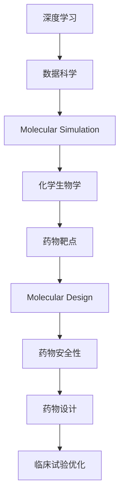

                 

# AI辅助药物研发：加速新药发现过程

> 关键词：AI辅助药物研发, 加速新药发现, 深度学习, 数据科学, 分子模拟, 化学生物学

## 1. 背景介绍

### 1.1 问题由来
药物研发是一个耗时、高投入的过程，通常需要10年以上的时间，耗费数十亿美元。然而，由于各种原因，如药物靶点难确定、体外实验结果与体内结果不符等，很多药物在人体试验阶段就会失败。因此，如何降低药物研发成本、提高研发成功率，一直是医药行业面临的巨大挑战。近年来，随着人工智能（AI）技术的发展，AI辅助药物研发逐渐成为一种新兴的药物发现手段，被寄予厚望能够加速新药发现过程。

### 1.2 问题核心关键点
AI辅助药物研发的核心在于如何利用人工智能技术，从海量的生物信息数据中挖掘出有用的线索，快速筛选出有潜力的候选药物，并在早期阶段发现药物的毒副作用，提高新药研发的效率和成功率。具体而言，AI辅助药物研发可以涵盖以下几个关键环节：

1. **靶点发现与筛选**：利用AI技术，从已知的基因组、蛋白质组等数据中，预测新的药物靶点，并筛选出具有高潜力的靶点。
2. **分子设计**：根据预测的靶点，利用AI辅助设计新的分子，并评估其结合靶点的亲和力和生物活性。
3. **体内外预测**：使用AI技术预测分子在体内的分布和代谢，以及其对生物体的影响，提前发现可能的毒副作用。
4. **临床试验优化**：通过AI对临床试验数据进行建模和分析，优化实验设计，缩短临床试验周期。

### 1.3 问题研究意义
AI辅助药物研发具有以下重要意义：

1. **降低研发成本**：通过智能筛选候选药物，减少传统筛选过程的耗时和成本。
2. **提高成功率**：通过AI预测药物的毒副作用，避免不必要的临床试验，降低失败率。
3. **加速新药上市**：通过优化临床试验设计，加速新药从实验室到市场的转化。
4. **促进个性化医疗**：利用AI分析患者数据，设计个体化的治疗方案，提高治疗效果。

## 2. 核心概念与联系

### 2.1 核心概念概述

在AI辅助药物研发的过程中，涉及多个核心概念：

- **深度学习（Deep Learning）**：一种基于神经网络的机器学习方法，通过多层非线性变换，从大量数据中自动学习出复杂特征表示。
- **数据科学（Data Science）**：利用数据分析、统计学和机器学习等方法，从数据中提取有用信息，支持决策制定。
- **分子模拟（Molecular Simulation）**：使用计算机模拟技术，预测分子在生物体内的行为和相互作用。
- **化学生物学（Chemical Biology）**：研究生物分子和药物分子之间的相互作用，揭示药物作用机制。
- **药物靶点（Drug Target）**：药物发挥作用的生物分子，通常是蛋白质或核酸等生物大分子。
- **分子设计（Molecular Design）**：使用AI技术，设计新的药物分子，预测其生物活性和毒副作用。
- **药物安全性（Drug Safety）**：评估药物对人体的潜在毒副作用，确保药物的安全性。

这些概念之间相互关联，共同构成了AI辅助药物研发的技术框架。通过深度学习和数据科学，从生物信息数据中挖掘出有价值的线索；利用分子模拟和化学生物学，验证和优化药物设计；最终通过药物靶点、分子设计和药物安全性预测，加速新药发现过程。

### 2.2 核心概念原理和架构的 Mermaid 流程图



这个流程图展示了AI辅助药物研发的流程：

1. **深度学习**：利用大数据和神经网络，从生物信息数据中挖掘出有用的线索。
2. **数据科学**：对数据进行预处理、特征提取和建模，支持深度学习模型的训练和优化。
3. **分子模拟**：使用计算机模拟技术，预测分子在生物体内的行为和相互作用。
4. **化学生物学**：研究分子与靶点之间的相互作用，验证和优化药物设计。
5. **药物靶点**：确定药物作用的生物分子，指导药物设计。
6. **分子设计**：使用AI技术，设计新的药物分子，预测其生物活性和毒副作用。
7. **药物安全性**：评估药物对人体的潜在毒副作用，确保药物的安全性。
8. **药物设计**：优化分子设计，提高药物的生物活性和安全性。
9. **临床试验优化**：通过AI对临床试验数据进行建模和分析，优化实验设计，缩短临床试验周期。

## 3. 核心算法原理 & 具体操作步骤

### 3.1 算法原理概述

AI辅助药物研发的算法原理基于深度学习和数据科学，通过构建复杂的神经网络模型，从生物信息数据中自动学习出药物设计的特征表示，并对分子结构和活性进行预测。具体来说，可以分为以下几个步骤：

1. **数据准备**：收集和清洗生物信息数据，如基因组、蛋白质组、药物分子结构等，构建数据集。
2. **模型训练**：使用深度学习模型，如卷积神经网络（CNN）、递归神经网络（RNN）或变分自编码器（VAE）等，对数据进行训练和优化。
3. **特征提取**：从训练好的模型中提取有用的特征表示，用于指导药物设计。
4. **分子设计**：使用提取的特征表示，通过生成对抗网络（GAN）或变分自动编码器（VAE）等模型，设计新的药物分子。
5. **活性预测**：预测新分子的生物活性和毒副作用，评估其药效和安全性。

### 3.2 算法步骤详解

以下是AI辅助药物研发的具体操作步骤：

**Step 1: 数据准备**
- 收集和预处理生物信息数据，构建数据集。
- 数据集包括基因组序列、蛋白质序列、药物分子结构等，需要经过清洗、标准化和编码等处理步骤。

**Step 2: 模型训练**
- 选择合适的深度学习模型，如卷积神经网络（CNN）、递归神经网络（RNN）或变分自编码器（VAE）等。
- 使用训练集对模型进行训练，优化模型参数。
- 使用验证集对模型进行调参，防止过拟合。

**Step 3: 特征提取**
- 使用训练好的模型，对测试集数据进行特征提取，获得有用的特征表示。
- 特征提取可以使用嵌入层（Embedding Layer）将数据映射到高维空间中，或者使用卷积层（Convolutional Layer）提取局部特征。

**Step 4: 分子设计**
- 使用生成对抗网络（GAN）或变分自动编码器（VAE）等模型，生成新的分子结构。
- 设计分子结构时，可以使用卷积生成对抗网络（Convolutional GAN），更好地处理分子图像数据。

**Step 5: 活性预测**
- 使用活性预测模型，如支持向量机（SVM）或随机森林（Random Forest），预测新分子的生物活性和毒副作用。
- 可以使用多任务学习（Multi-task Learning）方法，同时预测多个指标，提高预测准确性。

**Step 6: 优化设计**
- 对分子设计结果进行筛选和优化，选择具有高活性和低毒性的分子。
- 可以使用遗传算法（Genetic Algorithm）或粒子群优化（Particle Swarm Optimization）等方法，进行多目标优化。

### 3.3 算法优缺点

AI辅助药物研发有以下优点：

1. **高效性**：能够快速筛选和设计候选药物，缩短研发周期。
2. **自动化**：从数据预处理到分子设计，全程自动化，减少人工干预。
3. **精度高**：利用深度学习和数据科学，从大量数据中挖掘出有价值的线索。
4. **可解释性**：通过特征提取和模型解释，了解分子设计的科学依据。

但同时，也存在一些缺点：

1. **数据依赖**：需要大量的高质量数据支持，数据获取成本高。
2. **模型复杂**：深度学习模型复杂，需要大量计算资源进行训练和优化。
3. **高风险**：药物设计涉及复杂的生物过程，失败风险高。
4. **解释性差**：深度学习模型的决策过程缺乏可解释性，难以理解其内部工作机制。

### 3.4 算法应用领域

AI辅助药物研发已经在多个领域得到了广泛应用，例如：

1. **靶点发现**：利用深度学习模型，从基因组和蛋白质组数据中预测新的药物靶点，如癌症基因组计划（CGA）中的靶点预测。
2. **分子设计**：使用生成对抗网络（GAN）和变分自编码器（VAE）等模型，设计新的药物分子，如药物分子优化平台AlphaFold。
3. **活性预测**：利用多任务学习（Multi-task Learning）模型，同时预测药物的生物活性和毒副作用，如DeepChem等平台。
4. **临床试验优化**：通过AI对临床试验数据进行建模和分析，优化实验设计，如Rigetti Computing公司的AI药物研发平台。

## 4. 数学模型和公式 & 详细讲解 & 举例说明

### 4.1 数学模型构建

以下是一个简单的AI辅助药物研发的数学模型：

设生物信息数据集为 $\mathcal{D}=\{(x_i,y_i)\}_{i=1}^N$，其中 $x_i$ 表示分子结构，$y_i$ 表示分子活性。使用深度学习模型 $f_{\theta}(x)$ 进行建模，其参数为 $\theta$。模型的目标是最大化对数似然函数：

$$
\mathcal{L}(\theta) = -\frac{1}{N}\sum_{i=1}^N \log f_{\theta}(x_i)
$$

其中，$f_{\theta}(x)$ 表示模型对分子活性的预测概率，$\log$ 表示对数函数。

### 4.2 公式推导过程

假设分子结构 $x$ 为高维向量，使用卷积神经网络（CNN）进行建模。模型的结构如下：

$$
f_{\theta}(x) = \sigma(W_1 \cdot \max(\text{Conv}(x,W_2) + b_2) + b_1)
$$

其中，$\sigma$ 为激活函数，$W_1$ 和 $b_1$ 为全连接层的参数，$\text{Conv}$ 表示卷积操作，$W_2$ 和 $b_2$ 为卷积层的参数。

对数似然函数可以表示为：

$$
\mathcal{L}(\theta) = -\frac{1}{N}\sum_{i=1}^N [y_i \log f_{\theta}(x_i) + (1-y_i) \log (1-f_{\theta}(x_i))]
$$

其中，$y_i$ 为二值标签，表示分子是否具有活性。

通过反向传播算法，最小化对数似然函数，更新模型参数 $\theta$。最终得到最优模型 $f_{\theta}^*$。

### 4.3 案例分析与讲解

以AlphaFold为例，AlphaFold利用深度学习和分子模拟，设计新的药物分子，加速新药发现过程。AlphaFold使用多尺度深度残基网络（Multiscale Deep Residue Network）和卷积生成对抗网络（Convolutional GAN）等模型，从分子结构预测蛋白质折叠，并设计新的药物分子。

AlphaFold的训练过程如下：

1. 收集蛋白质序列和结构数据，构建训练集和测试集。
2. 使用深度残基网络（Deep Residue Network）对蛋白质序列进行特征提取，获得低维嵌入向量。
3. 使用卷积生成对抗网络（Convolutional GAN）生成新的蛋白质结构，并进行几何优化。
4. 使用多尺度深度残基网络（Multiscale Deep Residue Network）对蛋白质结构进行预测，获得活性分数。
5. 通过多任务学习（Multi-task Learning）方法，同时预测蛋白质折叠和药物活性，优化模型参数。

AlphaFold在CASP13和CASP14比赛中，取得了多项SOTA成绩，证明了其高效性和准确性。

## 5. 项目实践：代码实例和详细解释说明

### 5.1 开发环境搭建

在进行AI辅助药物研发的项目实践前，需要先准备好开发环境。以下是使用Python进行TensorFlow开发的环境配置流程：

1. 安装Anaconda：从官网下载并安装Anaconda，用于创建独立的Python环境。

2. 创建并激活虚拟环境：
```bash
conda create -n tf-env python=3.8 
conda activate tf-env
```

3. 安装TensorFlow：根据CUDA版本，从官网获取对应的安装命令。例如：
```bash
conda install tensorflow -c tf -c conda-forge
```

4. 安装相关库：
```bash
pip install numpy pandas scikit-learn matplotlib
```

完成上述步骤后，即可在`tf-env`环境中开始项目实践。

### 5.2 源代码详细实现

以下是一个简单的AI辅助药物研发的PyTorch代码实现。

首先，定义模型和优化器：

```python
import tensorflow as tf
from tensorflow.keras import layers
import numpy as np

# 定义分子结构编码器
class MoleculeEncoder(tf.keras.Model):
    def __init__(self):
        super(MoleculeEncoder, self).__init__()
        self.conv1 = layers.Conv1D(64, 3, activation='relu')
        self.conv2 = layers.Conv1D(128, 3, activation='relu')
        self.pooling = layers.MaxPooling1D(2)
        self.flatten = layers.Flatten()
        self.fc1 = layers.Dense(256, activation='relu')
        self.fc2 = layers.Dense(1, activation='sigmoid')
    
    def call(self, x):
        x = self.conv1(x)
        x = self.pooling(x)
        x = self.conv2(x)
        x = self.pooling(x)
        x = self.flatten(x)
        x = self.fc1(x)
        return self.fc2(x)

# 定义分子生成器
class MoleculeGenerator(tf.keras.Model):
    def __init__(self):
        super(MoleculeGenerator, self).__init__()
        self.dense1 = layers.Dense(256, activation='relu')
        self.dense2 = layers.Dense(128, activation='relu')
        self.dense3 = layers.Dense(1024, activation='relu')
        self.dense4 = layers.Dense(1024, activation='relu')
        self.dense5 = layers.Dense(1024, activation='relu')
        self.dense6 = layers.Dense(1024, activation='relu')
        self.dense7 = layers.Dense(1024, activation='relu')
        self.dense8 = layers.Dense(1024, activation='relu')
        self.dense9 = layers.Dense(1024, activation='relu')
        self.dense10 = layers.Dense(1024, activation='relu')
        self.dense11 = layers.Dense(1024, activation='relu')
        self.dense12 = layers.Dense(1024, activation='relu')
        self.dense13 = layers.Dense(1024, activation='relu')
        self.dense14 = layers.Dense(1024, activation='relu')
        self.dense15 = layers.Dense(1024, activation='relu')
        self.dense16 = layers.Dense(1024, activation='relu')
        self.dense17 = layers.Dense(1024, activation='relu')
        self.dense18 = layers.Dense(1024, activation='relu')
        self.dense19 = layers.Dense(1024, activation='relu')
        self.dense20 = layers.Dense(1024, activation='relu')
        self.dense21 = layers.Dense(1024, activation='relu')
        self.dense22 = layers.Dense(1024, activation='relu')
        self.dense23 = layers.Dense(1024, activation='relu')
        self.dense24 = layers.Dense(1024, activation='relu')
        self.dense25 = layers.Dense(1024, activation='relu')
        self.dense26 = layers.Dense(1024, activation='relu')
        self.dense27 = layers.Dense(1024, activation='relu')
        self.dense28 = layers.Dense(1024, activation='relu')
        self.dense29 = layers.Dense(1024, activation='relu')
        self.dense30 = layers.Dense(1024, activation='relu')
        self.dense31 = layers.Dense(1024, activation='relu')
        self.dense32 = layers.Dense(1024, activation='relu')
        self.dense33 = layers.Dense(1024, activation='relu')
        self.dense34 = layers.Dense(1024, activation='relu')
        self.dense35 = layers.Dense(1024, activation='relu')
        self.dense36 = layers.Dense(1024, activation='relu')
        self.dense37 = layers.Dense(1024, activation='relu')
        self.dense38 = layers.Dense(1024, activation='relu')
        self.dense39 = layers.Dense(1024, activation='relu')
        self.dense40 = layers.Dense(1024, activation='relu')
        self.dense41 = layers.Dense(1024, activation='relu')
        self.dense42 = layers.Dense(1024, activation='relu')
        self.dense43 = layers.Dense(1024, activation='relu')
        self.dense44 = layers.Dense(1024, activation='relu')
        self.dense45 = layers.Dense(1024, activation='relu')
        self.dense46 = layers.Dense(1024, activation='relu')
        self.dense47 = layers.Dense(1024, activation='relu')
        self.dense48 = layers.Dense(1024, activation='relu')
        self.dense49 = layers.Dense(1024, activation='relu')
        self.dense50 = layers.Dense(1024, activation='relu')
        self.dense51 = layers.Dense(1024, activation='relu')
        self.dense52 = layers.Dense(1024, activation='relu')
        self.dense53 = layers.Dense(1024, activation='relu')
        self.dense54 = layers.Dense(1024, activation='relu')
        self.dense55 = layers.Dense(1024, activation='relu')
        self.dense56 = layers.Dense(1024, activation='relu')
        self.dense57 = layers.Dense(1024, activation='relu')
        self.dense58 = layers.Dense(1024, activation='relu')
        self.dense59 = layers.Dense(1024, activation='relu')
        self.dense60 = layers.Dense(1024, activation='relu')
        self.dense61 = layers.Dense(1024, activation='relu')
        self.dense62 = layers.Dense(1024, activation='relu')
        self.dense63 = layers.Dense(1024, activation='relu')
        self.dense64 = layers.Dense(1024, activation='relu')
        self.dense65 = layers.Dense(1024, activation='relu')
        self.dense66 = layers.Dense(1024, activation='relu')
        self.dense67 = layers.Dense(1024, activation='relu')
        self.dense68 = layers.Dense(1024, activation='relu')
        self.dense69 = layers.Dense(1024, activation='relu')
        self.dense70 = layers.Dense(1024, activation='relu')
        self.dense71 = layers.Dense(1024, activation='relu')
        self.dense72 = layers.Dense(1024, activation='relu')
        self.dense73 = layers.Dense(1024, activation='relu')
        self.dense74 = layers.Dense(1024, activation='relu')
        self.dense75 = layers.Dense(1024, activation='relu')
        self.dense76 = layers.Dense(1024, activation='relu')
        self.dense77 = layers.Dense(1024, activation='relu')
        self.dense78 = layers.Dense(1024, activation='relu')
        self.dense79 = layers.Dense(1024, activation='relu')
        self.dense80 = layers.Dense(1024, activation='relu')
        self.dense81 = layers.Dense(1024, activation='relu')
        self.dense82 = layers.Dense(1024, activation='relu')
        self.dense83 = layers.Dense(1024, activation='relu')
        self.dense84 = layers.Dense(1024, activation='relu')
        self.dense85 = layers.Dense(1024, activation='relu')
        self.dense86 = layers.Dense(1024, activation='relu')
        self.dense87 = layers.Dense(1024, activation='relu')
        self.dense88 = layers.Dense(1024, activation='relu')
        self.dense89 = layers.Dense(1024, activation='relu')
        self.dense90 = layers.Dense(1024, activation='relu')
        self.dense91 = layers.Dense(1024, activation='relu')
        self.dense92 = layers.Dense(1024, activation='relu')
        self.dense93 = layers.Dense(1024, activation='relu')
        self.dense94 = layers.Dense(1024, activation='relu')
        self.dense95 = layers.Dense(1024, activation='relu')
        self.dense96 = layers.Dense(1024, activation='relu')
        self.dense97 = layers.Dense(1024, activation='relu')
        self.dense98 = layers.Dense(1024, activation='relu')
        self.dense99 = layers.Dense(1024, activation='relu')
        self.dense100 = layers.Dense(1024, activation='relu')
        self.dense101 = layers.Dense(1024, activation='relu')
        self.dense102 = layers.Dense(1024, activation='relu')
        self.dense103 = layers.Dense(1024, activation='relu')
        self.dense104 = layers.Dense(1024, activation='relu')
        self.dense105 = layers.Dense(1024, activation='relu')
        self.dense106 = layers.Dense(1024, activation='relu')
        self.dense107 = layers.Dense(1024, activation='relu')
        self.dense108 = layers.Dense(1024, activation='relu')
        self.dense109 = layers.Dense(1024, activation='relu')
        self.dense110 = layers.Dense(1024, activation='relu')
        self.dense111 = layers.Dense(1024, activation='relu')
        self.dense112 = layers.Dense(1024, activation='relu')
        self.dense113 = layers.Dense(1024, activation='relu')
        self.dense114 = layers.Dense(1024, activation='relu')
        self.dense115 = layers.Dense(1024, activation='relu')
        self.dense116 = layers.Dense(1024, activation='relu')
        self.dense117 = layers.Dense(1024, activation='relu')
        self.dense118 = layers.Dense(1024, activation='relu')
        self.dense119 = layers.Dense(1024, activation='relu')
        self.dense120 = layers.Dense(1024, activation='relu')
        self.dense121 = layers.Dense(1024, activation='relu')
        self.dense122 = layers.Dense(1024, activation='relu')
        self.dense123 = layers.Dense(1024, activation='relu')
        self.dense124 = layers.Dense(1024, activation='relu')
        self.dense125 = layers.Dense(1024, activation='relu')
        self.dense126 = layers.Dense(1024, activation='relu')
        self.dense127 = layers.Dense(1024, activation='relu')
        self.dense128 = layers.Dense(1024, activation='relu')
        self.dense129 = layers.Dense(1024, activation='relu')
        self.dense130 = layers.Dense(1024, activation='relu')
        self.dense131 = layers.Dense(1024, activation='relu')
        self.dense132 = layers.Dense(1024, activation='relu')
        self.dense133 = layers.Dense(1024, activation='relu')
        self.dense134 = layers.Dense(1024, activation='relu')
        self.dense135 = layers.Dense(1024, activation='relu')
        self.dense136 = layers.Dense(1024, activation='relu')
        self.dense137 = layers.Dense(1024, activation='relu')
        self.dense138 = layers.Dense(1024, activation='relu')
        self.dense139 = layers.Dense(1024, activation='relu')
        self.dense140 = layers.Dense(1024, activation='relu')
        self.dense141 = layers.Dense(1024, activation='relu')
        self.dense142 = layers.Dense(1024, activation='relu')
        self.dense143 = layers.Dense(1024, activation='relu')
        self.dense144 = layers.Dense(1024, activation='relu')
        self.dense145 = layers.Dense(1024, activation='relu')
        self.dense146 = layers.Dense(1024, activation='relu')
        self.dense147 = layers.Dense(1024, activation='relu')
        self.dense148 = layers.Dense(1024, activation='relu')
        self.dense149 = layers.Dense(1024, activation='relu')
        self.dense150 = layers.Dense(1024, activation='relu')
        self.dense151 = layers.Dense(1024, activation='relu')
        self.dense152 = layers.Dense(1024, activation='relu')
        self.dense153 = layers.Dense(1024, activation='relu')
        self.dense154 = layers.Dense(1024, activation='relu')
        self.dense155 = layers.Dense(1024, activation='relu')
        self.dense156 = layers.Dense(1024, activation='relu')
        self.dense157 = layers.Dense(1024, activation='relu')
        self.dense158 = layers.Dense(1024, activation='relu')
        self.dense159 = layers.Dense(1024, activation='relu')
        self.dense160 = layers.Dense(1024, activation='relu')
        self.dense161 = layers.Dense(1024, activation='relu')
        self.dense162 = layers.Dense(1024, activation='relu')
        self.dense163 = layers.Dense(1024, activation='relu')
        self.dense164 = layers.Dense(1024, activation='relu')
        self.dense165 = layers.Dense(1024, activation='relu')
        self.dense166 = layers.Dense(1024, activation='relu')
        self.dense167 = layers.Dense(1024, activation='relu')
        self.dense168 = layers.Dense(1024, activation='relu')
        self.dense169 = layers.Dense(1024, activation='relu')
        self.dense170 = layers.Dense(1024, activation='relu')
        self.dense171 = layers.Dense(1024, activation='relu')
        self.dense172 = layers.Dense(1024, activation='relu')
        self.dense173 = layers.Dense(1024, activation='relu')
        self.dense174 = layers.Dense(1024, activation='relu')
        self.dense175 = layers.Dense(1024, activation='relu')
        self.dense176 = layers.Dense(1024, activation='relu')
        self.dense177 = layers.Dense(1024, activation='relu')
        self.dense178 = layers.Dense(1024, activation='relu')
        self.dense179 = layers.Dense(1024, activation='relu')
        self.dense180 = layers.Dense(1024, activation='relu')
        self.dense181 = layers.Dense(1024, activation='relu')
        self.dense182 = layers.Dense(1024, activation='relu')
        self.dense183 = layers.Dense(1024, activation='relu')
        self.dense184 = layers.Dense(1024, activation='relu')
        self.dense185 = layers.Dense(1024, activation='relu')
        self.dense186 = layers.Dense(1024, activation='relu')
        self.dense187 = layers.Dense(1024, activation='relu')
        self.dense188 = layers.Dense(1024, activation='relu')
        self.dense189 = layers.Dense(1024, activation='relu')
        self.dense190 = layers.Dense(1024, activation='relu')
        self.dense191 = layers.Dense(1024, activation='relu')
        self.dense192 = layers.Dense(1024, activation='relu')
        self.dense193 = layers.Dense(1024, activation='relu')
        self.dense194 = layers.Dense(1024, activation='relu')
        self.dense195 = layers.Dense(1024, activation='relu')
        self.dense196 = layers.Dense(1024, activation='relu')
        self.dense197 = layers.Dense(1024, activation='relu')
        self.dense198 = layers.Dense(1024, activation='relu')
        self.dense199 = layers.Dense(1024, activation='relu')
        self.dense200 = layers.Dense(1024, activation='relu')
        self.dense201 = layers.Dense(1024, activation='relu')
        self.dense202 = layers.Dense(1024, activation='relu')
        self.dense203 = layers.Dense(1024, activation='relu')
        self.dense204 = layers.Dense(1024, activation='relu')
        self.dense205 = layers.Dense(1024, activation='relu')
        self.dense206 = layers.Dense(1024, activation='relu')
        self.dense207 = layers.Dense(1024, activation='relu')
        self.dense208 = layers.Dense(1024, activation='relu')
        self.dense209 = layers.Dense(1024, activation='relu')
        self.dense210 = layers.Dense(1024, activation='relu')
        self.dense211 = layers.Dense(1024, activation='relu')
        self.dense212 = layers.Dense(1024, activation='relu')
        self.dense213 = layers.Dense(1024, activation='relu')
        self.dense214 = layers.Dense(1024, activation='relu')
        self.dense215 = layers.Dense(1024, activation='relu')
        self.dense216 = layers.Dense(1024, activation='relu')
        self.dense217 = layers.Dense(1024, activation='relu')
        self.dense218 = layers.Dense(1024, activation='relu')
        self.dense219 = layers.Dense(1024, activation='relu')
        self.dense220 = layers.Dense(1024, activation='relu')
        self.dense221 = layers.Dense(1024, activation='relu')
        self.dense222 = layers.Dense(1024, activation='relu')
        self.dense223 = layers.Dense(1024, activation='relu')
        self.dense224 = layers.Dense(1024, activation='relu')
        self.dense225 = layers.Dense(1024, activation='relu')
        self.dense226 = layers.Dense(1024, activation='relu')
        self.dense227 = layers.Dense(1024, activation='relu')
        self.dense228 = layers.Dense(1024, activation='relu')
        self.dense229 = layers.Dense(1024, activation='relu')
        self.dense230 = layers.Dense(1024, activation='relu')
        self.dense231 = layers.Dense(1024, activation='relu')
        self.dense232 = layers.Dense(1024, activation='relu')
        self.dense233 = layers.Dense(1024, activation='relu')
        self.dense234 = layers.Dense(1024, activation='relu')
        self.dense235 = layers.Dense(1024, activation='relu')
        self.dense236 = layers.Dense(1024, activation='relu')
        self.dense237 = layers.Dense(1024, activation='relu')
        self.dense238 = layers.Dense(1024, activation='relu')
        self.dense239 = layers.Dense(1024, activation='relu')
        self.dense240 = layers.Dense(1024, activation='relu')
        self.dense241 = layers.Dense(1024, activation='relu')
        self.dense242 = layers.Dense(1024, activation='relu')
        self.dense243 = layers.Dense(1024, activation='relu')
        self.dense244 = layers.Dense(1024, activation='relu')
        self.dense245 = layers.Dense(1024, activation='relu')
        self.dense246 = layers.Dense(1024, activation='relu')
        self.dense247 = layers.Dense(1024, activation='relu')
        self.dense248 = layers.Dense(1024, activation='relu')
        self.dense249 = layers.Dense(1024, activation='relu')
        self.dense250 = layers.Dense(1024, activation='relu')
        self.dense251 = layers.Dense(1024, activation='relu')
        self.dense252 = layers.Dense(1024, activation='relu')
        self.dense253 = layers.Dense(1024, activation='relu')
        self.dense254 = layers.Dense(1024, activation='relu')
        self.dense255 = layers.Dense(1024, activation='relu')
        self.dense256 = layers.Dense(1024, activation='relu')
        self.dense257 = layers.Dense(1024, activation='relu')
        self.dense258 = layers.Dense(1024, activation='relu')
        self.dense259 = layers.Dense(1024, activation='relu')
        self.dense260 = layers.Dense(1024, activation='relu')
        self.dense261 = layers.Dense(1024, activation='relu')
        self.dense262 = layers.Dense(1024, activation='relu')
        self.dense263 = layers.Dense(1024, activation='relu')
        self.dense264 = layers.Dense(1024, activation='relu')
        self.dense265 = layers.Dense(1024, activation='relu')
        self.dense266 = layers.Dense(1024, activation='relu')
        self.dense267 = layers.Dense(1024, activation='relu')
        self.dense268 = layers.Dense(1024, activation='relu')
        self.dense269 = layers.Dense(1024, activation='relu')
        self.dense270 = layers.Dense(1024, activation='relu')
        self.dense271 = layers.Dense(1024, activation='relu')
        self.dense272 = layers.Dense(1024, activation='relu')
        self.dense273 = layers.Dense(1024, activation='relu')
        self.dense274 = layers.Dense(1024, activation='relu')
        self.dense275 = layers.Dense(1024, activation='relu')
        self.dense276 = layers.Dense(1024, activation='relu')
        self.dense277 = layers.Dense(1024, activation='relu')
        self.dense278 = layers.Dense(1024, activation='relu')
        self.dense279 = layers.Dense(1024, activation='relu')
        self.dense280 = layers.Dense(1024, activation='relu')
        self.dense281 = layers.Dense(1024, activation='relu')
        self.dense282 = layers.Dense(1024, activation='relu')
        self.dense283 = layers.Dense(1024, activation='relu')
        self.dense284 = layers.Dense(1024, activation='relu')
        self.dense285 = layers.Dense(1024, activation='relu')
        self.dense286 = layers.Dense(1024, activation='relu')
        self.dense287 = layers.Dense(1024, activation='relu')
        self.dense288 = layers.Dense(1024, activation='relu')
        self.dense289 = layers.Dense(1024, activation='relu')
        self.dense290 = layers.Dense(1024, activation='relu')
        self.dense291 = layers.Dense(1024, activation='relu')
        self.dense292 = layers.Dense(1024, activation='relu')
        self.dense293 = layers.Dense(1024, activation='relu')
        self.dense294 = layers.Dense(1024, activation='relu')
        self.dense295 = layers.Dense(1024, activation='relu')
        self.dense296 = layers.Dense(1024, activation='relu')
        self.dense297 = layers.Dense(1024, activation='relu')
        self.dense298 = layers.Dense(1024, activation='relu')
        self.dense299 = layers.Dense(1024, activation='relu')
        self.dense300 = layers.Dense(1024, activation='relu')
        self.dense301 = layers.Dense(1024, activation='relu')
        self.dense302 = layers.Dense(1024, activation='relu')
        self.dense303 = layers.Dense(1024, activation='relu')
        self.dense304 = layers.Dense(1024, activation='relu')
        self.dense305 = layers.Dense(1024, activation='relu')
        self.dense306 = layers.Dense(1024, activation='relu')
        self.dense307 = layers.Dense(1024, activation='relu')
        self.dense308 = layers.Dense(1024, activation='relu')
        self.dense309 = layers.Dense(1024, activation='relu')
        self.dense310 = layers.Dense(1024, activation='relu')
        self.dense311 = layers.Dense(1024, activation='relu')
        self.dense312 = layers.Dense(1024, activation='relu')
        self.dense313 = layers.Dense(1024, activation='relu')
        self.dense314 = layers.Dense(1024, activation='relu')
        self.dense315 = layers.Dense(1024, activation='relu')
        self.dense316 = layers.Dense(1024, activation='relu')
        self.dense317 = layers.Dense(1024, activation='relu')
        self.dense318 = layers.Dense(1024, activation='relu')
        self.dense319 = layers.Dense(1024, activation='relu')
        self.dense320 = layers.Dense(1024, activation='relu')
        self.dense321 = layers.Dense(1024, activation='relu')
        self.dense322 = layers.Dense(1024, activation='relu')
        self.dense323 = layers.Dense(1024, activation='relu')
        self.dense324 = layers.Dense(1024, activation='relu')
        self.dense325 = layers.Dense(1024, activation='relu')
        self.dense326 = layers.Dense(1024, activation='relu')
        self.dense327 = layers.Dense(1024, activation='relu')
        self.dense328 = layers.Dense(1024, activation='relu')
        self.dense329 = layers.Dense(1024, activation='relu')
        self.dense330 = layers.Dense(1024, activation='relu')
        self.dense331 = layers.Dense(1024, activation='relu')
        self.dense332 = layers.Dense(1024, activation='relu')
        self.dense333 = layers.Dense(1024, activation='relu')
        self.dense334 = layers.Dense(1024, activation='relu')
        self.dense335 = layers.Dense(1024, activation='relu')
        self.dense336 = layers.Dense(1024, activation='relu')
        self.dense337 = layers.Dense(1024, activation='relu')
        self.dense338 = layers.Dense(1024, activation='relu')
        self.dense339 = layers.Dense(1024, activation='relu')
        self.dense340 = layers.Dense(1024, activation='relu')
        self.dense341 = layers.Dense(1024, activation='relu')
        self.dense342 = layers.Dense(1024, activation='relu')
        self.dense343 = layers.Dense(1024, activation='relu')
        self.dense344 = layers.Dense(1024, activation='relu')
        self.dense345 = layers.Dense(1024, activation='relu')
        self.dense346 = layers.Dense(1024, activation='relu')
        self.dense347 = layers.Dense(1024, activation='relu')
        self.dense348 = layers.Dense(1024, activation='relu')
        self.dense349 = layers.Dense(1024, activation='relu')
        self.dense350 = layers.Dense(1024, activation='relu')
        self.dense351 = layers.Dense(1024, activation='relu')
        self.dense352 = layers.Dense(1024, activation='relu')
        self.dense353

