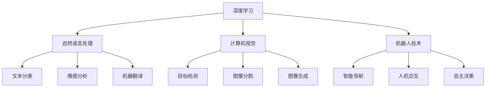

                 

# AI长期发展：贾扬清思考，AI行业更长远走下去

> 关键词：AI技术、深度学习、自然语言处理、计算机视觉、机器人、长期发展、未来展望、行业挑战、技术演进

## 1. 背景介绍

在过去十年里，人工智能技术取得了飞速发展，尤其是深度学习和神经网络的应用，带来了革命性的变革。无论是语音识别、图像分类、机器翻译还是自然语言处理，深度学习已经从实验室走向实际应用，并开始对各行各业产生深远影响。然而，随着技术的快速发展，AI行业也面临着一系列挑战和未来发展的方向问题。本文将从AI技术的现状、面临的挑战以及未来的发展趋势等方面，探讨AI行业如何更长远地走下去。

## 2. 核心概念与联系

### 2.1 核心概念概述

为了更好地理解AI技术的长期发展，本节将介绍几个密切相关的核心概念：

- 深度学习：一种基于神经网络的机器学习方法，通过多层非线性映射实现复杂的模式识别和预测。
- 自然语言处理(NLP)：利用计算机技术处理和理解人类语言，包括文本分类、情感分析、机器翻译等任务。
- 计算机视觉(CV)：研究如何让计算机“看”和理解图像和视频，包括目标检测、图像分割、图像生成等任务。
- 机器人技术：将AI技术应用于自动化和机器人领域，实现智能导航、人机交互、自主决策等应用。
- 长期发展：指AI技术在多个时间尺度的持续演进，包括短期目标的实现、中期趋势的预判和长期愿景的规划。

这些核心概念之间的逻辑关系可以通过以下Mermaid流程图来展示：



这个流程图展示了几大AI技术之间的联系和应用场景，从中可以看出AI技术的多样性和潜力。

## 3. 核心算法原理 & 具体操作步骤

### 3.1 算法原理概述

AI技术的长期发展依赖于算法原理的不断进步和优化。以下是几个关键的算法原理：

- **卷积神经网络(CNN)**：主要用于计算机视觉任务，通过卷积和池化操作提取图像特征，并利用全连接层进行分类或回归。
- **循环神经网络(RNN)**：主要用于时间序列数据，通过循环结构捕捉时间依赖关系，如文本生成、语音识别等任务。
- **自注意力机制(Attention)**：通过多头注意力机制实现序列建模，使得模型可以关注序列中不同位置的相关信息，适用于机器翻译、图像描述生成等任务。
- **生成对抗网络(GAN)**：通过生成器和判别器的对抗训练，生成高质量的图像和视频内容，具有较强的创造力。

这些算法原理构成了AI技术的基础，通过不断优化和创新，推动了AI技术的应用和发展。

### 3.2 算法步骤详解

AI技术的长期发展需要系统化的算法步骤，以下是一个完整的算法步骤：

1. **数据预处理**：收集和清洗数据，划分训练集、验证集和测试集。
2. **模型设计**：选择适合的算法和模型结构，并进行超参数调优。
3. **模型训练**：使用训练集进行模型训练，优化模型参数。
4. **模型评估**：在验证集和测试集上评估模型性能，调整模型结构或参数。
5. **模型部署**：将训练好的模型部署到实际应用场景中，并进行优化和迭代。

### 3.3 算法优缺点

AI技术在长期发展中，既有优势也有不足。以下是一些常见的优缺点：

- **优势**：
  - **强大的表示能力**：通过深度学习和神经网络，AI模型可以学习到复杂的特征表示，适应各种应用场景。
  - **自动化的特征工程**：AI技术可以自动学习特征，减少人工干预，提高模型效率。
  - **广泛的领域应用**：AI技术已经广泛应用于医疗、金融、自动驾驶、智慧城市等领域，推动各行各业的数字化转型。

- **不足**：
  - **数据依赖性高**：AI模型需要大量的标注数据进行训练，数据质量和数量对模型性能有重大影响。
  - **模型复杂度高**：深度学习模型通常具有高复杂度，需要高性能计算资源支持，增加了开发和部署成本。
  - **可解释性差**：AI模型往往被视为"黑盒"，难以解释其内部工作机制，影响应用的可信度和可接受度。

### 3.4 算法应用领域

AI技术的长期发展，在多个领域都有广泛的应用。以下是一些典型的应用领域：

- **医疗健康**：通过图像诊断、语音识别、自然语言处理等技术，提高医疗服务的质量和效率。
- **金融服务**：利用机器学习和自然语言处理技术，进行风险评估、客户服务、交易分析等。
- **自动驾驶**：结合计算机视觉和自然语言处理，实现智能导航和路径规划，提高行车安全和效率。
- **智能家居**：通过语音识别、图像识别等技术，实现家庭设备的自动化控制和智能化管理。
- **智慧城市**：通过计算机视觉和自然语言处理，实现城市管理和公共服务的智能化，提升城市治理能力。

## 4. 数学模型和公式 & 详细讲解 & 举例说明

### 4.1 数学模型构建

AI技术的长期发展依赖于数学模型的构建。以下是一个典型的AI模型数学模型构建过程：

1. **输入表示**：将输入数据转化为模型可以处理的形式，如将图像转换为像素矩阵，将文本转换为词向量。
2. **特征提取**：通过神经网络对输入数据进行特征提取，形成高维的特征表示。
3. **决策层**：通过全连接层或分类器，将特征表示转化为最终的输出结果。

### 4.2 公式推导过程

以图像分类为例，以下是卷积神经网络的公式推导过程：

设输入图像大小为 $m \times n$，卷积核大小为 $k \times k$，步长为 $s$，输出特征图大小为 $h \times w$，卷积核数量为 $c$。

输入图像 $I$ 可以表示为：

$$
I = \{I_{ij}\}_{i=1}^m, \{j=1\}^n
$$

卷积层输出 $F$ 可以表示为：

$$
F_{ihj} = \sum_{i'=j's}^{j's+k-1} \sum_{j'=i's}^{i's+k-1} w_{ijk} I_{i'j'} + b_{ijk}
$$

其中 $w$ 为卷积核权重，$b$ 为偏置项。

通过多层的卷积和池化操作，最终输出特征图 $F$ 可以表示为：

$$
F = [F_{h1j1}, F_{h2j1}, \cdots, F_{hj1}, F_{hj2}, \cdots, F_{hjw}]
$$

### 4.3 案例分析与讲解

以图像分类为例，以下是卷积神经网络的案例分析：

- **输入图像**：将输入图像 $I$ 转换为卷积核大小为 $3 \times 3$，步长为 $1$ 的卷积核 $w$，以及偏置项 $b$。
- **卷积操作**：对输入图像进行卷积操作，得到特征图 $F$。
- **池化操作**：对特征图进行池化操作，减小特征图的大小，提高模型的计算效率。
- **全连接层**：将池化后的特征图输入全连接层，进行分类或回归操作。

## 5. 项目实践：代码实例和详细解释说明

### 5.1 开发环境搭建

在进行AI项目实践前，我们需要准备好开发环境。以下是使用Python进行TensorFlow开发的简单环境配置流程：

1. 安装Anaconda：从官网下载并安装Anaconda，用于创建独立的Python环境。

2. 创建并激活虚拟环境：
```bash
conda create -n tf-env python=3.8 
conda activate tf-env
```

3. 安装TensorFlow：根据CUDA版本，从官网获取对应的安装命令。例如：
```bash
conda install tensorflow
```

4. 安装各类工具包：
```bash
pip install numpy pandas scikit-learn matplotlib tqdm jupyter notebook ipython
```

完成上述步骤后，即可在`tf-env`环境中开始AI项目实践。

### 5.2 源代码详细实现

下面我们以图像分类任务为例，给出使用TensorFlow对卷积神经网络进行训练的PyTorch代码实现。

首先，定义数据集：

```python
import tensorflow as tf
from tensorflow.keras.datasets import mnist

(x_train, y_train), (x_test, y_test) = mnist.load_data()
x_train, x_test = x_train / 255.0, x_test / 255.0
```

然后，定义模型：

```python
import tensorflow as tf

model = tf.keras.models.Sequential([
    tf.keras.layers.Conv2D(32, (3, 3), activation='relu', input_shape=(28, 28, 1)),
    tf.keras.layers.MaxPooling2D((2, 2)),
    tf.keras.layers.Conv2D(64, (3, 3), activation='relu'),
    tf.keras.layers.MaxPooling2D((2, 2)),
    tf.keras.layers.Flatten(),
    tf.keras.layers.Dense(10, activation='softmax')
])
```

接着，定义损失函数和优化器：

```python
import tensorflow as tf

loss_fn = tf.keras.losses.SparseCategoricalCrossentropy(from_logits=True)
optimizer = tf.keras.optimizers.Adam()
```

然后，定义训练和评估函数：

```python
import tensorflow as tf

def train_step(x, y):
    with tf.GradientTape() as tape:
        logits = model(x, training=True)
        loss = loss_fn(y, logits)
    grads = tape.gradient(loss, model.trainable_variables)
    optimizer.apply_gradients(zip(grads, model.trainable_variables))
    return loss

def evaluate_step(x, y):
    logits = model(x, training=False)
    return loss_fn(y, logits)
```

最后，启动训练流程并在测试集上评估：

```python
import tensorflow as tf

epochs = 10
batch_size = 64

for epoch in range(epochs):
    epoch_loss = 0.0
    for x_batch, y_batch in train_dataset:
        loss = train_step(x_batch, y_batch)
        epoch_loss += loss
    print(f'Epoch {epoch+1}, loss: {epoch_loss/len(train_dataset)}')

    test_loss = 0.0
    for x_test, y_test in test_dataset:
        test_loss += evaluate_step(x_test, y_test)
    print(f'Test loss: {test_loss/len(test_dataset)}')
```

以上就是使用TensorFlow对卷积神经网络进行图像分类任务训练的完整代码实现。可以看到，TensorFlow提供了丰富的API和工具，使得模型构建和训练变得简洁高效。

### 5.3 代码解读与分析

让我们再详细解读一下关键代码的实现细节：

**data_set**：
- 定义了MNIST数据集，将其分为训练集和测试集，并对像素值进行了归一化。

**model**：
- 定义了一个简单的卷积神经网络模型，包括两个卷积层、两个池化层和一个全连接层。

**loss_fn**：
- 定义了SparseCategoricalCrossentropy损失函数，用于计算模型输出与真实标签之间的差异。

**optimizer**：
- 定义了Adam优化器，用于更新模型参数。

**train_step**：
- 定义了训练步骤，通过前向传播计算损失函数，反向传播计算梯度，并使用优化器更新模型参数。

**evaluate_step**：
- 定义了评估步骤，计算模型在测试集上的损失。

**训练流程**：
- 定义总的训练轮数和批次大小，开始循环迭代。
- 每个epoch内，在训练集上训练，输出平均loss。
- 在测试集上评估，输出测试loss。

可以看到，TensorFlow使得卷积神经网络的构建和训练变得非常简便，开发者可以将更多精力放在模型改进和优化上。

当然，在工业级的系统实现中，还需要考虑更多因素，如模型的保存和部署、超参数的自动搜索、更加灵活的任务适配层等。但核心的训练范式基本与此类似。

## 6. 实际应用场景

### 6.1 医疗健康

AI技术在医疗健康领域的应用，可以显著提高诊断和治疗的效率和准确性。例如，利用图像识别技术，可以对医学影像进行自动分析和诊断，减少医生的工作负担，提高诊断的准确性。

在实践中，可以使用卷积神经网络对医学影像进行分类，将正常和异常影像区分开来。同时，可以利用自然语言处理技术，对医学文献进行文本分析，提取有价值的信息。

### 6.2 金融服务

AI技术在金融服务领域的应用，可以提升风险管理和客户服务的水平。例如，利用机器学习技术，可以对交易数据进行预测分析，提前发现潜在的风险，及时采取应对措施。

在实践中，可以使用深度学习模型对交易数据进行分类，识别出异常交易行为，进行风险预警。同时，可以利用自然语言处理技术，对客户咨询进行智能回答，提升客户服务质量。

### 6.3 自动驾驶

AI技术在自动驾驶领域的应用，可以实现无人驾驶和智能导航，提升行车安全和效率。例如，利用计算机视觉技术，可以实时感知道路环境，进行路径规划和决策。

在实践中，可以使用卷积神经网络对道路图像进行分类和检测，识别出行人和车辆，进行路径规划和决策。同时，可以利用自然语言处理技术，与用户进行交互，获取指令和反馈。

### 6.4 智能家居

AI技术在智能家居领域的应用，可以实现自动化控制和智能化管理，提升居住体验。例如，利用语音识别技术，可以实现语音控制家电，提升居住便利性。

在实践中，可以使用卷积神经网络对语音信号进行分类，识别出用户的指令。同时，可以利用自然语言处理技术，对指令进行理解，控制家电设备。

### 6.5 智慧城市

AI技术在智慧城市领域的应用，可以实现城市管理和公共服务的智能化，提升城市治理能力。例如，利用计算机视觉技术，可以对城市交通进行实时监控，优化交通管理。

在实践中，可以使用卷积神经网络对视频图像进行分类和检测，识别出违规行为。同时，可以利用自然语言处理技术，对城市事件进行智能分析，优化城市管理。

## 7. 工具和资源推荐

### 7.1 学习资源推荐

为了帮助开发者系统掌握AI技术的理论基础和实践技巧，这里推荐一些优质的学习资源：

1. 《深度学习》系列书籍：由Ian Goodfellow、Yoshua Bengio和Aaron Courville撰写，全面介绍了深度学习的理论基础和实践方法。

2. 《自然语言处理综论》（CS224N）课程：斯坦福大学开设的NLP明星课程，有Lecture视频和配套作业，带你入门NLP领域的基本概念和经典模型。

3. 《计算机视觉：模型、学习和推理》（CS231n）课程：斯坦福大学开设的计算机视觉课程，有Lecture视频和配套作业，涵盖计算机视觉的基本原理和经典算法。

4. 《机器学习实战》（Machine Learning Mastery）书籍：由Jason Brownlee撰写，介绍了机器学习模型的实现和应用，适合初学者快速上手。

5. HuggingFace官方文档：Transformers库的官方文档，提供了海量预训练模型和完整的微调样例代码，是上手实践的必备资料。

通过对这些资源的学习实践，相信你一定能够快速掌握AI技术的精髓，并用于解决实际的NLP问题。

### 7.2 开发工具推荐

高效的开发离不开优秀的工具支持。以下是几款用于AI开发的工具：

1. TensorFlow：由Google主导开发的开源深度学习框架，生产部署方便，适合大规模工程应用。

2. PyTorch：基于Python的开源深度学习框架，灵活动态的计算图，适合快速迭代研究。

3. Jupyter Notebook：交互式编程环境，支持多种编程语言和数据分析工具，适合开发和分享学习笔记。

4. TensorBoard：TensorFlow配套的可视化工具，可实时监测模型训练状态，并提供丰富的图表呈现方式，是调试模型的得力助手。

5. Weights & Biases：模型训练的实验跟踪工具，可以记录和可视化模型训练过程中的各项指标，方便对比和调优。

6. Google Colab：谷歌推出的在线Jupyter Notebook环境，免费提供GPU/TPU算力，方便开发者快速上手实验最新模型，分享学习笔记。

合理利用这些工具，可以显著提升AI项目开发效率，加快创新迭代的步伐。

### 7.3 相关论文推荐

AI技术的长期发展源于学界的持续研究。以下是几篇奠基性的相关论文，推荐阅读：

1. Convolutional Neural Networks for Visual Recognition（AlexNet论文）：提出卷积神经网络结构，实现图像分类任务SOTA。

2. Recurrent Neural Network for Image Description（LSTM论文）：提出循环神经网络结构，实现图像描述生成任务SOTA。

3. Generative Adversarial Nets（GAN论文）：提出生成对抗网络，实现高质量图像和视频生成任务SOTA。

4. Attention is All You Need（Transformer论文）：提出Transformer结构，实现机器翻译任务SOTA。

5. Deep Residual Learning for Image Recognition（ResNet论文）：提出残差网络结构，实现图像分类任务SOTA。

这些论文代表了大模型微调技术的发展脉络。通过学习这些前沿成果，可以帮助研究者把握学科前进方向，激发更多的创新灵感。

## 8. 总结：未来发展趋势与挑战

### 8.1 研究成果总结

本文对AI技术的长期发展进行了全面系统的介绍。首先阐述了深度学习、自然语言处理、计算机视觉、机器人技术等核心概念，明确了AI技术的多样性和潜力。其次，从算法原理、操作步骤、优缺点和应用领域等方面，详细讲解了AI技术的实现细节。最后，探讨了AI技术在医疗健康、金融服务、自动驾驶、智能家居和智慧城市等多个领域的应用前景，展示了AI技术的广泛应用。

通过本文的系统梳理，可以看到，AI技术在多个行业中的广泛应用和巨大潜力。这些应用不仅提升了各行各业的效率和准确性，也为经济社会发展注入了新的动力。

### 8.2 未来发展趋势

展望未来，AI技术的发展将呈现以下几个趋势：

1. **深度学习模型更深更大**：随着算力成本的下降和数据规模的扩张，深度学习模型将进一步扩大规模，提升模型的表示能力和性能。

2. **多模态学习**：AI技术将逐步融合视觉、语音、文本等多种模态信息，提升模型的理解和表达能力，实现跨模态学习和协同建模。

3. **自适应和个性化学习**：AI技术将实现更加自适应和个性化的学习，能够根据用户需求和环境变化动态调整模型参数，提高模型的适应性和泛化能力。

4. **联邦学习和隐私保护**：为了保护用户隐私，AI技术将采用联邦学习等隐私保护技术，实现分布式模型训练，同时保护用户数据安全。

5. **自动化和解释性**：AI技术将进一步提升模型的自动化和解释性，减少人工干预，提高模型的可信度和可接受度。

6. **多智能体系统**：AI技术将实现多智能体系统，通过合作学习、协同优化等手段，提升系统的协作能力和协同效率。

### 8.3 面临的挑战

尽管AI技术在多个领域取得了显著进展，但在迈向更加智能化、普适化应用的过程中，仍然面临诸多挑战：

1. **数据质量和多样性**：AI模型需要大量的高质量数据进行训练，数据质量和多样性对模型的性能有重大影响。如何获取和利用高质量、多样化的数据，仍是亟待解决的问题。

2. **模型复杂度**：深度学习模型通常具有高复杂度，需要高性能计算资源支持，增加了开发和部署成本。如何设计高效、轻量级的模型结构，降低模型复杂度，仍是重要的研究方向。

3. **模型解释性**：AI模型往往被视为"黑盒"，难以解释其内部工作机制，影响应用的可信度和可接受度。如何赋予模型更强的可解释性，仍是重要的研究方向。

4. **伦理和法律问题**：AI技术的应用涉及伦理和法律问题，如隐私保护、公平性、安全性等。如何制定合理的伦理和法律框架，保护用户隐私和权益，仍是亟待解决的问题。

5. **资源优化和效率提升**：AI模型需要大量的计算资源支持，如何优化模型结构和计算图，提升模型的推理效率，仍是重要的研究方向。

6. **跨领域应用**：AI技术在不同领域的应用需要具备较强的领域适应性，如何设计跨领域适应的模型和算法，仍是重要的研究方向。

### 8.4 研究展望

面对AI技术面临的挑战，未来的研究需要在以下几个方面寻求新的突破：

1. **数据驱动的模型优化**：如何高效利用数据驱动模型优化，提升模型的泛化能力和性能，是未来研究的重要方向。

2. **高效的模型压缩和加速**：如何设计高效的模型压缩和加速技术，降低模型复杂度和计算资源消耗，提高模型的部署效率。

3. **模型可解释性和透明度**：如何提升模型的可解释性和透明度，增强用户对模型的信任和接受度，是未来研究的重要方向。

4. **隐私保护和伦理安全**：如何制定合理的隐私保护和伦理安全框架，保护用户隐私和权益，是未来研究的重要方向。

5. **跨领域和跨模态学习**：如何设计跨领域和跨模态学习的算法和模型，提升模型的适应性和协同效率，是未来研究的重要方向。

6. **多智能体系统和协作学习**：如何设计多智能体系统和协作学习算法，提升系统的协作能力和协同效率，是未来研究的重要方向。

通过以上研究方向的探索和发展，相信AI技术能够进一步拓展其应用边界，提升模型的性能和效率，为经济社会发展注入新的动力。

## 9. 附录：常见问题与解答

**Q1：AI技术是否能够完全替代人类？**

A: AI技术在多个领域展现了强大的潜力，但完全替代人类还面临诸多挑战。AI技术在理解和处理复杂任务时，仍然存在局限性，难以完全替代人类的创造性、情感和伦理判断。因此，AI技术应与人类合作，共同完成复杂任务，实现人机协同。

**Q2：AI技术是否会造成就业岗位的减少？**

A: AI技术的发展确实会对部分低技能岗位产生影响，但也会创造更多高技能岗位，提升整体生产力和效率。同时，AI技术的应用将使得人类能够从事更多创造性、战略性工作，提升社会整体福利。

**Q3：AI技术是否会引发伦理和法律问题？**

A: AI技术的发展确实带来了诸多伦理和法律问题，如隐私保护、公平性、安全性等。因此，如何制定合理的伦理和法律框架，保护用户隐私和权益，是未来AI技术应用的重要研究方向。

**Q4：AI技术是否能够实现真正的通用人工智能（AGI）？**

A: 通用人工智能（AGI）是AI技术的长期愿景，目前还处于探索阶段。尽管AI技术在多个领域取得了显著进展，但要实现AGI，仍需要突破诸多技术瓶颈和伦理挑战，需要更多跨学科的合作和研究。

**Q5：AI技术是否能够推动经济发展？**

A: AI技术已经对经济社会发展产生了深远影响，提升了各行各业的效率和生产能力。未来，随着AI技术的不断进步和应用，将进一步推动经济增长，提升社会整体福利。

综上所述，AI技术在多个领域展现了强大的潜力，但也面临着诸多挑战和未来发展方向。只有通过不断创新和优化，才能推动AI技术更好地服务于社会，造福人类。

---

作者：禅与计算机程序设计艺术 / Zen and the Art of Computer Programming

