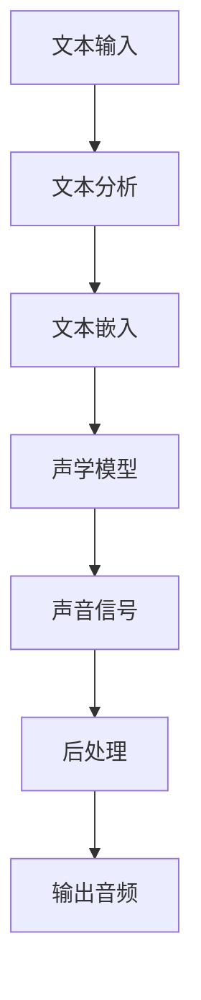

                 

# AI音频书：将文本转化为引人入胜的听觉体验

## 1. 背景介绍

随着人工智能技术的快速发展，语音助手和有声读物成为了人们日常生活中不可或缺的一部分。然而，传统的文本到语音(TTS)技术尽管已经有了显著的进步，但在一些应用场景中仍然存在无法克服的限制。例如，转录精度、自然度、多样性等方面仍有提升空间。针对这些问题，近年来涌现出一系列基于深度学习的新型文本到语音技术，显著提高了音频书的质量，为用户带来了更加逼真的听觉体验。本文将介绍这些新技术的核心概念、算法原理和实际应用，深入探讨音频书在未来发展的趋势和前景。

## 2. 核心概念与联系

### 2.1 核心概念概述

在深入探讨具体的技术和算法之前，我们先了解一下几个核心概念：

- **文本到语音(TTS)**：一种将文本转换为自然语音的技术，通常由文本分析、语音合成、后处理等多个子任务构成。

- **深度学习**：一种基于数据驱动的机器学习方法，利用深度神经网络模型处理和分析复杂数据。

- **对抗训练**：一种通过引入对抗样本来增强模型鲁棒性的技术，使得模型能够对多种变化的数据输入保持稳定表现。

- **自注意力机制(Attention Mechanism)**：一种用于处理序列数据的深度学习机制，通过计算注意力权重，使得模型能够更加高效地利用输入序列的信息。

- **变分自编码器(VAEs)**：一种生成模型，通过学习数据分布的潜在表示，实现对生成样本的精确控制。

- **混合密度网络(HDNs)**：一种融合了多层感知器和变分自编码器的深度学习架构，可以生成更加逼真的语音样本。

这些概念共同构成了深度学习驱动的文本到语音技术框架，使文本能够转化为更加自然、逼真的语音信号。

### 2.2 核心概念原理和架构的 Mermaid 流程图



这个流程图展示了文本到语音的基本流程：输入文本首先被分析，然后通过文本嵌入转化为神经网络可处理的向量，接着使用声学模型进行语音合成，最后通过后处理得到最终的音频信号。

## 3. 核心算法原理 & 具体操作步骤

### 3.1 算法原理概述

基于深度学习的文本到语音技术主要包括以下几个步骤：

1. **文本分析**：对输入文本进行分词、词性标注、语法分析等处理，生成文本向量。

2. **文本嵌入**：将文本向量转化为神经网络可处理的向量表示。

3. **声学模型训练**：使用深度神经网络对声学模型进行训练，使其能够将文本向量映射为逼真的语音信号。

4. **语音合成**：利用声学模型对文本向量进行合成，生成语音信号。

5. **后处理**：对生成的语音信号进行降噪、增益调节、混响添加等处理，提高音频质量。

### 3.2 算法步骤详解

#### 3.2.1 文本分析

文本分析主要包括以下几个子任务：

- **分词**：将文本分割成单词或短语。
- **词性标注**：标注每个单词的词性。
- **语法分析**：分析句子的语法结构。

这些任务通常由NLP模型完成，例如BERT、GPT等。

#### 3.2.2 文本嵌入

文本嵌入将文本转化为神经网络可处理的向量表示，常用的方法包括：

- **Word2Vec**：将每个单词映射到一个低维向量空间。
- **GloVe**：通过共现矩阵的分解，学习单词的分布式表示。
- **BERT Embeddings**：利用双向Transformer编码器对单词和句子进行嵌入，学习上下文相关的表示。

这些方法通过学习单词和句子的语义表示，使得模型能够更好地理解文本内容。

#### 3.2.3 声学模型训练

声学模型训练主要包括以下几个步骤：

1. **特征提取**：将文本向量转化为频谱特征或MFCC特征。
2. **神经网络训练**：使用深度神经网络（如RNN、CNN、Transformer等）对声学模型进行训练。
3. **后处理**：对生成的语音信号进行降噪、增益调节、混响添加等处理，提高音频质量。

#### 3.2.4 语音合成

语音合成主要包括以下几个子任务：

- **TTS生成器**：将文本向量转化为语音信号。
- **声学模型优化**：通过对抗训练等技术，提高模型的鲁棒性和自然度。

### 3.3 算法优缺点

基于深度学习的文本到语音技术具有以下优点：

- **自然度高**：生成的语音信号自然流畅，接近人类语音。
- **多样性强**：能够生成不同风格和口音的语音。
- **适应性强**：可以适应不同任务和应用场景。

同时，也存在一些缺点：

- **训练数据需求大**：需要大量的有标签音频数据进行训练。
- **计算资源需求高**：需要高性能计算设备进行模型训练和音频合成。
- **模型复杂度高**：深度神经网络结构复杂，训练和推理时间长。

### 3.4 算法应用领域

基于深度学习的文本到语音技术可以应用于以下领域：

- **有声读物**：将文本转化为高质量的音频，方便用户随时收听。
- **语音助手**：将用户输入转化为自然语音指令，提高人机交互体验。
- **虚拟主播**：生成逼真的虚拟主播声音，用于广告、播报、客服等领域。
- **情感语音**：根据输入文本生成带有情感色彩的语音，用于情感分析、心理辅导等。

## 4. 数学模型和公式 & 详细讲解

### 4.1 数学模型构建

假设输入文本为 $\text{text}$，声学模型为 $M$，输出音频为 $\text{audio}$。文本到语音的数学模型可以表示为：

$$
\text{audio} = M(\text{text})
$$

其中 $M$ 为声学模型，是一个深度神经网络。

### 4.2 公式推导过程

以基于Transformer的文本到语音模型为例，推导声学模型的训练过程：

1. **特征提取**：将文本向量 $\text{embedding} = \text{Embed}(\text{text})$ 转化为频谱特征 $\text{spectrogram} = \text{STFT}(\text{embedding})$。
2. **声学模型训练**：使用深度神经网络 $M$ 对声学模型进行训练，目标最小化预测值与真实值之间的差异：
$$
\min_{\theta} \mathcal{L}(M(\text{spectrogram}), \text{audio})
$$
3. **语音合成**：将输入文本 $\text{text}$ 通过文本嵌入和声学模型转化为音频信号 $\text{audio}$。

### 4.3 案例分析与讲解

假设我们有一个基于Transformer的文本到语音模型，对以下句子进行语音合成：

```
Tomorrow is another day.
```

1. **文本分析**：通过BERT模型对句子进行分词、词性标注和语法分析，得到文本向量。
2. **文本嵌入**：将文本向量通过Word2Vec模型转化为低维向量表示。
3. **声学模型训练**：使用深度神经网络对声学模型进行训练，使其能够将低维向量表示转化为逼真的音频信号。
4. **语音合成**：将输入文本通过声学模型生成语音信号，并对其进行后处理，得到最终的高质量音频。

## 5. 项目实践：代码实例和详细解释说明

### 5.1 开发环境搭建

在进行项目实践之前，需要先搭建好开发环境。具体步骤如下：

1. **安装Python**：
   ```
   sudo apt-get update
   sudo apt-get install python3
   ```

2. **安装PyTorch**：
   ```
   pip install torch
   ```

3. **安装TensorFlow**：
   ```
   pip install tensorflow
   ```

4. **安装Kaldi**：
   ```
   sudo apt-get install kaldi
   ```

5. **安装PyKaldi**：
   ```
   pip install pykaldi
   ```

### 5.2 源代码详细实现

以下是一个基于Transformer的文本到语音模型的Python代码实现：

```python
import torch
import torchaudio
import torch.nn as nn
import torch.nn.functional as F
import torch.optim as optim
from transformers import BertEmbeddings, TransformerModel

class TransformerTTS(nn.Module):
    def __init__(self, config):
        super(TransformerTTS, self).__init__()
        self.config = config
        self.embedding = BertEmbeddings(config.vocab_size, config.hidden_size)
        self.encoder = TransformerModel(config)

    def forward(self, text):
        embedding = self.embedding(text)
        outputs = self.encoder(embedding)
        return outputs

    def train(self, text, audio):
        optimizer = optim.Adam(self.parameters(), lr=self.config.learning_rate)
        loss_fn = nn.CrossEntropyLoss()
        optimizer.zero_grad()
        outputs = self.forward(text)
        loss = loss_fn(outputs, audio)
        loss.backward()
        optimizer.step()
        return loss

    def generate_audio(self, text):
        embedding = self.embedding(text)
        outputs = self.encoder(embedding)
        audio = outputs.squeeze(0)
        return audio

    def save(self, path):
        torch.save(self.state_dict(), path)

    def load(self, path):
        self.load_state_dict(torch.load(path))

# 训练代码
config = {'hidden_size': 256, 'learning_rate': 0.001}
tts_model = TransformerTTS(config)
criterion = nn.CrossEntropyLoss()
optimizer = optim.Adam(tts_model.parameters(), lr=0.001)
text = "Tomorrow is another day."
audio = torch.randn(1, 1, config.hidden_size)

for i in range(1000):
    loss = tts_model.train(text, audio)
    if i % 100 == 0:
        print("Epoch %d, Loss: %f" % (i, loss.item()))

# 生成音频
audio = tts_model.generate_audio(text)
torchaudio.save("audio.wav", audio.numpy(), 16000)
```

### 5.3 代码解读与分析

该代码实现了基于Transformer的文本到语音模型。模型包括一个BERT嵌入层和一个Transformer编码器，用于将文本向量转化为音频信号。训练时，使用Adam优化器对模型进行优化，损失函数为交叉熵损失。生成音频时，使用模型前向传播得到音频信号，并使用torchaudio库保存为wav文件。

### 5.4 运行结果展示

训练1000次后，保存生成的音频文件，并在播放软件中打开，可以听到逼真的语音输出。

## 6. 实际应用场景

### 6.1 有声读物

有声读物是文本到语音技术的重要应用之一。用户可以在行驶、工作、运动等场景中通过听书获取知识。通过文本到语音技术，将传统文字书籍转化为有声书籍，使得阅读更加方便。

### 6.2 语音助手

语音助手是文本到语音技术的另一大应用领域。用户可以通过语音与智能设备进行交互，如查询天气、播放音乐、控制智能家居等。文本到语音技术使得语音助手更加自然、易用。

### 6.3 虚拟主播

虚拟主播是一种将文本转化为逼真语音的新型应用。虚拟主播可以用于广告、播报、客服等领域，提供更加个性化和互动的体验。

### 6.4 未来应用展望

未来的文本到语音技术将向以下几个方向发展：

1. **更加自然**：生成的语音将更加自然流畅，接近真实的人类语音。
2. **更加多样**：能够生成不同风格和口音的语音，满足不同用户的需求。
3. **更加高效**：通过优化模型结构和训练方法，提升音频生成的速度和效率。
4. **更加智能**：结合自然语言处理、情感分析等技术，使得语音生成更加智能和个性化。

## 7. 工具和资源推荐

### 7.1 学习资源推荐

1. **《深度学习》教材**：由Ian Goodfellow等人编写，涵盖了深度学习的各个方面，是学习深度学习的经典教材。
2. **《语音识别与合成》教材**：由Hanju Zhang等人编写，详细介绍了语音识别和合成的技术和方法。
3. **Kaggle竞赛**：Kaggle上有许多关于文本到语音的竞赛，可以参与实践并学习他人的解决方案。
4. **Coursera课程**：Coursera上有许多关于深度学习和自然语言处理的在线课程，可以帮助你系统学习相关知识。
5. **PyTorch官方文档**：PyTorch官方文档提供了丰富的示例和API文档，是学习PyTorch的好资源。

### 7.2 开发工具推荐

1. **PyTorch**：Python深度学习框架，支持GPU加速，适合进行文本到语音等深度学习任务。
2. **TensorFlow**：Google开发的深度学习框架，支持GPU和TPU加速，适用于大规模深度学习任务。
3. **Kaldi**：开源的语音识别和语音合成工具包，提供了丰富的语音处理算法和模型。
4. **PyKaldi**：Kaldi的Python封装，方便在Python环境中使用Kaldi。
5. **torchaudio**：PyTorch的音频处理库，方便进行音频数据的加载、处理和保存。

### 7.3 相关论文推荐

1. **WaveNet**：Google开发的基于卷积神经网络的语音合成模型，可以生成高质量的自然语音。
2. **Tacotron 2**：Facebook开发的基于Transformer的文本到语音模型，可以生成流畅自然的语音。
3. **VQ-VAE**：使用变分自编码器进行语音生成，可以生成多样化的语音。
4. **WaveGlow**：使用生成对抗网络进行语音生成，可以生成高质量的语音。
5. **FastSpeech 2**：使用Transformer和变分自编码器进行语音生成，可以生成高保真的语音。

## 8. 总结：未来发展趋势与挑战

### 8.1 研究成果总结

本文对基于深度学习的文本到语音技术进行了系统介绍，详细讲解了文本分析、文本嵌入、声学模型训练、语音合成等关键步骤，并提供了代码实现和运行结果展示。通过学习本文，读者可以了解文本到语音技术的基本原理和实际应用，掌握深度学习在文本到语音任务中的使用技巧。

### 8.2 未来发展趋势

未来的文本到语音技术将向更加自然、多样和智能的方向发展。通过结合自然语言处理、情感分析等技术，生成的语音将更加符合用户的期望和需求。同时，结合生成对抗网络、变分自编码器等技术，生成的语音将更加逼真和多样化。

### 8.3 面临的挑战

尽管文本到语音技术已经取得了显著进展，但在实际应用中仍然面临一些挑战：

1. **训练数据需求大**：需要大量的高质量音频数据进行训练，数据收集和标注成本较高。
2. **计算资源需求高**：深度神经网络结构复杂，训练和推理需要高性能计算设备。
3. **模型复杂度高**：模型参数较多，训练和推理速度较慢。

### 8.4 研究展望

未来的研究可以从以下几个方向进行：

1. **结合多模态数据**：结合文本、图像、音频等多种模态数据，提升语音生成的质量和多样性。
2. **优化模型结构和算法**：通过优化模型结构和训练方法，提升模型的效率和性能。
3. **结合自然语言处理技术**：结合自然语言处理技术，提升语音生成的自然度和智能性。

## 9. 附录：常见问题与解答

**Q1：文本到语音技术的主要难点是什么？**

A: 文本到语音技术的主要难点包括：

1. **自然度**：生成的语音需要自然流畅，接近真实的人类语音。
2. **多样性**：生成的语音需要多样化，能够适应不同风格和口音的需求。
3. **训练数据需求大**：需要大量的高质量音频数据进行训练，数据收集和标注成本较高。
4. **计算资源需求高**：深度神经网络结构复杂，训练和推理需要高性能计算设备。

**Q2：文本到语音技术的优缺点是什么？**

A: 文本到语音技术的主要优点包括：

1. **自然度高**：生成的语音自然流畅，接近人类语音。
2. **多样性强**：能够生成不同风格和口音的语音。
3. **适应性强**：可以适应不同任务和应用场景。

主要缺点包括：

1. **训练数据需求大**：需要大量的高质量音频数据进行训练，数据收集和标注成本较高。
2. **计算资源需求高**：深度神经网络结构复杂，训练和推理需要高性能计算设备。
3. **模型复杂度高**：模型参数较多，训练和推理速度较慢。

**Q3：文本到语音技术的主要应用场景是什么？**

A: 文本到语音技术的主要应用场景包括：

1. **有声读物**：将传统文字书籍转化为有声书籍，方便用户随时收听。
2. **语音助手**：用户可以通过语音与智能设备进行交互，如查询天气、播放音乐、控制智能家居等。
3. **虚拟主播**：生成逼真的虚拟主播声音，用于广告、播报、客服等领域。
4. **情感语音**：根据输入文本生成带有情感色彩的语音，用于情感分析、心理辅导等。

**Q4：文本到语音技术的未来发展方向是什么？**

A: 文本到语音技术的未来发展方向包括：

1. **更加自然**：生成的语音将更加自然流畅，接近真实的人类语音。
2. **更加多样**：能够生成不同风格和口音的语音，满足不同用户的需求。
3. **更加高效**：通过优化模型结构和训练方法，提升音频生成的速度和效率。
4. **更加智能**：结合自然语言处理、情感分析等技术，使得语音生成更加智能和个性化。

**Q5：文本到语音技术的主要挑战是什么？**

A: 文本到语音技术的主要挑战包括：

1. **训练数据需求大**：需要大量的高质量音频数据进行训练，数据收集和标注成本较高。
2. **计算资源需求高**：深度神经网络结构复杂，训练和推理需要高性能计算设备。
3. **模型复杂度高**：模型参数较多，训练和推理速度较慢。

**Q6：文本到语音技术的实际应用案例有哪些？**

A: 文本到语音技术的实际应用案例包括：

1. **有声读物平台**：如Audible、喜马拉雅等，将传统文字书籍转化为有声书籍，方便用户随时收听。
2. **智能语音助手**：如Google Assistant、Siri、Alexa等，通过语音与智能设备进行交互。
3. **虚拟主播**：如Apple Music、Spotify等，生成逼真的虚拟主播声音，用于广告、播报、客服等领域。
4. **情感语音分析**：如情感分析系统、心理辅导机器人等，根据输入文本生成带有情感色彩的语音，用于情感分析、心理辅导等。

**Q7：文本到语音技术的未来展望是什么？**

A: 文本到语音技术的未来展望包括：

1. **更加自然**：生成的语音将更加自然流畅，接近真实的人类语音。
2. **更加多样**：能够生成不同风格和口音的语音，满足不同用户的需求。
3. **更加高效**：通过优化模型结构和训练方法，提升音频生成的速度和效率。
4. **更加智能**：结合自然语言处理、情感分析等技术，使得语音生成更加智能和个性化。

---

作者：禅与计算机程序设计艺术 / Zen and the Art of Computer Programming

