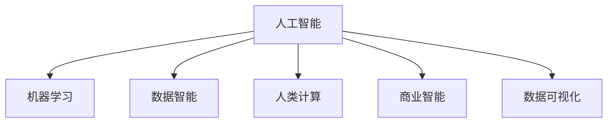

                 

# AI驱动的创新：人类计算在商业中的新趋势

> 关键词：人工智能,人类计算,商业创新,数据智能,机器学习,决策支持

## 1. 背景介绍

### 1.1 问题由来

在信息化时代，数据已经成为了一种重要的生产要素，对企业的战略决策和运营管理产生了深刻影响。然而，传统的数据处理方式面临诸多瓶颈，如数据量庞大、维度高、结构复杂等，仅靠人力难以高效处理。这就需要一种全新的计算模式——人类计算，以适应数据驱动的商业环境。

### 1.2 问题核心关键点

人类计算，即利用人工智能技术，辅助人类进行数据处理、决策分析等计算任务。这种计算模式能够大幅提升数据处理效率，缩短决策时间，减少错误和偏差，是人工智能在商业应用中的重要方向。

具体来说，人类计算的核心关键点包括：

- 利用人工智能算法处理海量数据，提取有价值的信息和知识。
- 结合人类专业知识，对机器分析结果进行人工验证和修正。
- 实现智能决策支持系统，辅助人类做出更好的商业决策。

通过在商业中引入人工智能和人类计算，企业可以更加有效地利用数据资源，提高决策质量和效率，从而实现更高层次的商业创新。

### 1.3 问题研究意义

研究人类计算在商业中的应用，对于推动数据智能技术的发展，提升企业竞争力，具有重要意义：

1. 提升数据处理效率。通过自动化、智能化手段，大幅减少数据处理的耗时和人力成本。
2. 提高决策质量。结合人类经验和知识，提升决策的准确性和可靠性。
3. 增强业务洞察。利用机器学习算法，发现数据中的潜在模式和趋势，为企业提供更具前瞻性的洞察。
4. 促进创新发展。在数据驱动的决策环境中，企业能够更加灵活地应对市场变化，实现持续创新。

## 2. 核心概念与联系

### 2.1 核心概念概述

为更好地理解人类计算在商业中的应用，本节将介绍几个密切相关的核心概念：

- 人工智能(AI)：通过模拟人类智能，实现机器对数据的自动分析和处理。
- 机器学习(ML)：利用数据训练模型，使其能够自动识别模式和规律，进行预测和决策。
- 数据智能：通过算法和技术手段，从大量数据中提取有价值的信息和知识，辅助决策和运营。
- 人类计算：将机器智能与人类智慧结合，高效处理数据，提升决策质量。
- 商业智能(BI)：利用数据和分析技术，为企业提供支持决策的智能服务。
- 数据可视化：将复杂的数据信息转化为直观的图表和报表，辅助决策分析。

这些核心概念之间的逻辑关系可以通过以下Mermaid流程图来展示：



这个流程图展示了几类关键概念之间的联系：

1. 人工智能是基础，通过机器学习算法处理数据，生成数据智能。
2. 人类计算结合机器智能和人类智慧，实现高效的数据处理。
3. 商业智能基于数据智能，辅助决策分析。
4. 数据可视化是数据智能的一种形式，通过图表报表直观展示数据分析结果。

这些概念共同构成了数据驱动的商业计算框架，使得企业能够更好地利用数据资源，提升业务决策和运营管理水平。

## 3. 核心算法原理 & 具体操作步骤

### 3.1 算法原理概述

人类计算的核心算法原理主要基于人工智能和机器学习技术，具体步骤如下：

1. **数据采集与预处理**：收集与业务相关的数据，进行清洗和预处理，如去重、缺失值填补、数据标准化等。

2. **特征工程**：对数据进行特征提取和选择，生成更有意义的输入特征。

3. **模型训练**：使用机器学习算法对特征数据进行训练，得到预测模型。

4. **模型评估**：通过交叉验证、测试集等方法评估模型性能，进行调参优化。

5. **结果应用**：将训练好的模型应用于实际业务场景，辅助决策分析。

### 3.2 算法步骤详解

以客户流失预测为例，介绍人类计算的核心算法步骤：

**Step 1: 数据采集与预处理**

- 采集客户历史行为数据，如购买记录、服务投诉、互动频率等。
- 进行数据清洗，去除异常值和噪声数据。
- 对时间序列数据进行归一化处理，便于后续分析。

**Step 2: 特征工程**

- 提取客户基本信息，如年龄、性别、消费金额等。
- 计算客户的流失概率，如流失率、流失时间等。
- 使用TF-IDF等技术提取文本特征，如客户反馈文本中的情感倾向。

**Step 3: 模型训练**

- 选择适当的机器学习算法，如随机森林、神经网络等。
- 使用训练集对模型进行训练，通过交叉验证调整超参数。
- 对训练好的模型进行评估，如准确率、召回率、ROC曲线等。

**Step 4: 模型评估**

- 使用测试集对模型进行验证，评估其在未见过的数据上的表现。
- 进行调参优化，提高模型精度和泛化能力。

**Step 5: 结果应用**

- 将训练好的模型应用到实时数据流中，进行客户流失预测。
- 结合专家知识，对模型预测结果进行人工验证和修正。
- 根据预测结果，制定客户保留策略，优化客户服务。

### 3.3 算法优缺点

人类计算基于人工智能和机器学习，具有以下优点：

1. 高效处理大规模数据。机器学习算法可以自动处理海量数据，提取有价值的信息。
2. 提升决策质量。结合人类智慧和经验，对机器分析结果进行人工验证和修正，提高决策的准确性。
3. 减少人力成本。自动化处理数据，减少了人工干预和处理，降低人力成本。

然而，人类计算也存在以下缺点：

1. 依赖高质量数据。机器学习算法的性能很大程度上取决于数据的质量和数量。
2. 需要人工干预。虽然机器算法能够处理数据，但最终决策仍需结合人类专业知识。
3. 算法偏见。机器学习模型可能会学习到数据中的偏见，需要人工干预进行校正。
4. 模型解释性不足。复杂的机器学习模型难以解释其内部工作机制，缺乏可解释性。

### 3.4 算法应用领域

人类计算在商业中具有广泛的应用领域，以下是几个典型应用场景：

1. **客户关系管理**：利用机器学习算法分析客户行为数据，预测客户流失风险，提升客户保留率。
2. **市场分析**：使用数据分析技术挖掘市场趋势和模式，制定更具前瞻性的营销策略。
3. **供应链管理**：通过数据智能技术优化供应链流程，降低成本，提升效率。
4. **财务分析**：利用人工智能算法分析财务数据，进行风险评估和投资决策。
5. **人力资源管理**：结合机器学习算法和专家知识，优化招聘和员工绩效管理。

除了上述这些经典应用外，人类计算还被创新性地应用到更多场景中，如智能客服、智能推荐、风险控制等，为商业运营带来了全新的突破。

## 4. 数学模型和公式 & 详细讲解  
### 4.1 数学模型构建

本节将使用数学语言对人类计算的算法步骤进行更加严格的刻画。

记原始数据集为 $D=\{(x_i,y_i)\}_{i=1}^N$，其中 $x_i$ 为输入特征，$y_i$ 为输出标签。

定义机器学习模型的训练过程如下：

1. **数据预处理**：对原始数据进行标准化和归一化，得到预处理后的数据集 $D'=\{x_i'\}_{i=1}^N$。
2. **特征工程**：对预处理后的数据进行特征提取，得到特征集 $X=\{x_i'\}_{i=1}^N$。
3. **模型训练**：使用机器学习算法对特征集进行训练，得到模型 $f: X \rightarrow Y$。
4. **模型评估**：使用测试集 $D_t$ 对模型进行评估，得到评估指标 $\hat{L}(f,D_t)$。

其中 $L(f,D_t)$ 为模型在测试集上的损失函数，如均方误差、交叉熵等。

### 4.2 公式推导过程

以回归问题为例，推导机器学习模型的最小化损失函数：

假设模型的损失函数为均方误差 $L(f,X,Y) = \frac{1}{N}\sum_{i=1}^N (y_i - f(x_i'))^2$，模型的输出为 $f(x_i') = \theta_0 + \theta_1 x_i'$。

则损失函数可展开为：

$$
L(f,X,Y) = \frac{1}{N}\sum_{i=1}^N (\theta_0 + \theta_1 x_i' - y_i)^2
$$

对模型参数 $\theta_0$ 和 $\theta_1$ 求偏导数，得：

$$
\frac{\partial L(f,X,Y)}{\partial \theta_0} = -\frac{2}{N}\sum_{i=1}^N (\theta_0 + \theta_1 x_i' - y_i)
$$

$$
\frac{\partial L(f,X,Y)}{\partial \theta_1} = -\frac{2}{N}\sum_{i=1}^N (\theta_0 + \theta_1 x_i' - y_i)x_i'
$$

因此，模型参数的更新公式为：

$$
\theta_0 \leftarrow \theta_0 - \eta \frac{\partial L(f,X,Y)}{\partial \theta_0}
$$

$$
\theta_1 \leftarrow \theta_1 - \eta \frac{\partial L(f,X,Y)}{\partial \theta_1}
$$

其中 $\eta$ 为学习率，用于控制模型参数的更新步长。

### 4.3 案例分析与讲解

以客户流失预测为例，分析人类计算的数学模型和推导过程：

假设客户流失的概率模型为 $f(x_i') = \theta_0 + \theta_1 x_{age_i'} + \theta_2 x_{income_i'} + \theta_3 x_{complaints_i'}$，其中 $x_{age_i'}$、$x_{income_i'}$、$x_{complaints_i'}$ 为特征，$\theta_0$、$\theta_1$、$\theta_2$、$\theta_3$ 为模型参数。

将模型应用于测试集 $D_t$，得到预测结果 $\hat{y}_i = f(x_i')$，其中 $x_i'$ 为预处理后的客户行为特征。

使用均方误差损失函数对模型进行评估，即：

$$
L(f,D_t) = \frac{1}{N_t}\sum_{i=1}^{N_t} (y_i - \hat{y}_i)^2
$$

其中 $N_t$ 为测试集样本数量。

通过最小化损失函数，不断更新模型参数 $\theta_0$、$\theta_1$、$\theta_2$、$\theta_3$，使模型输出逼近真实标签 $y_i$。

## 5. 项目实践：代码实例和详细解释说明
### 5.1 开发环境搭建

在进行人类计算项目实践前，我们需要准备好开发环境。以下是使用Python进行Scikit-Learn开发的环境配置流程：

1. 安装Anaconda：从官网下载并安装Anaconda，用于创建独立的Python环境。

2. 创建并激活虚拟环境：
```bash
conda create -n sklearn-env python=3.8 
conda activate sklearn-env
```

3. 安装Scikit-Learn：
```bash
conda install scikit-learn
```

4. 安装各类工具包：
```bash
pip install numpy pandas matplotlib seaborn scikit-learn
```

完成上述步骤后，即可在`sklearn-env`环境中开始人类计算实践。

### 5.2 源代码详细实现

下面我们以客户流失预测为例，给出使用Scikit-Learn进行机器学习的PyTorch代码实现。

首先，定义数据处理函数：

```python
from sklearn.model_selection import train_test_split
from sklearn.preprocessing import StandardScaler

def preprocess_data(X, y):
    X_train, X_test, y_train, y_test = train_test_split(X, y, test_size=0.2, random_state=42)
    scaler = StandardScaler()
    X_train = scaler.fit_transform(X_train)
    X_test = scaler.transform(X_test)
    return X_train, X_test, y_train, y_test
```

然后，定义模型和评估函数：

```python
from sklearn.linear_model import LogisticRegression
from sklearn.metrics import accuracy_score

def train_model(X_train, y_train, X_test, y_test):
    model = LogisticRegression(solver='liblinear', C=1.0)
    model.fit(X_train, y_train)
    y_pred = model.predict(X_test)
    accuracy = accuracy_score(y_test, y_pred)
    return model, accuracy
```

最后，启动训练流程并在测试集上评估：

```python
X_train, X_test, y_train, y_test = preprocess_data(X, y)
model, accuracy = train_model(X_train, y_train, X_test, y_test)
print(f"Accuracy: {accuracy:.2f}")
```

以上就是使用Scikit-Learn对客户流失预测模型进行训练的完整代码实现。可以看到，Scikit-Learn的封装使得模型训练过程简洁高效。

### 5.3 代码解读与分析

让我们再详细解读一下关键代码的实现细节：

**preprocess_data函数**：
- `train_test_split`方法：将数据集划分为训练集和测试集。
- `StandardScaler`方法：对特征数据进行标准化处理，使不同特征在同一量级下比较。

**train_model函数**：
- `LogisticRegression`模型：使用逻辑回归算法进行训练。
- `accuracy_score`方法：计算模型在测试集上的准确率。

**训练流程**：
- 首先进行数据预处理，包括特征提取和标准化。
- 然后定义并训练模型，返回模型和准确率。
- 最后输出模型在测试集上的准确率。

可以看到，Scikit-Learn提供了丰富的模型和工具，使得数据处理和模型训练过程变得简洁高效。开发者可以将更多精力放在模型设计和优化上，而不必过多关注底层的实现细节。

当然，工业级的系统实现还需考虑更多因素，如模型的保存和部署、超参数的自动搜索、更灵活的任务适配层等。但核心的训练过程基本与此类似。

## 6. 实际应用场景

### 6.1 智能客服系统

基于人类计算的对话技术，可以广泛应用于智能客服系统的构建。传统客服往往需要配备大量人力，高峰期响应缓慢，且一致性和专业性难以保证。使用人类计算，可以7x24小时不间断服务，快速响应客户咨询，用自然流畅的语言解答各类常见问题。

在技术实现上，可以收集企业内部的历史客服对话记录，将问题和最佳答复构建成监督数据，在此基础上对预训练语言模型进行微调。微调后的语言模型能够自动理解用户意图，匹配最合适的答案模板进行回复。对于客户提出的新问题，还可以接入检索系统实时搜索相关内容，动态组织生成回答。如此构建的智能客服系统，能大幅提升客户咨询体验和问题解决效率。

### 6.2 金融舆情监测

金融机构需要实时监测市场舆论动向，以便及时应对负面信息传播，规避金融风险。传统的人工监测方式成本高、效率低，难以应对网络时代海量信息爆发的挑战。基于人类计算的文本分类和情感分析技术，为金融舆情监测提供了新的解决方案。

具体而言，可以收集金融领域相关的新闻、报道、评论等文本数据，并对其进行主题标注和情感标注。在此基础上对预训练语言模型进行微调，使其能够自动判断文本属于何种主题，情感倾向是正面、中性还是负面。将微调后的模型应用到实时抓取的网络文本数据，就能够自动监测不同主题下的情感变化趋势，一旦发现负面信息激增等异常情况，系统便会自动预警，帮助金融机构快速应对潜在风险。

### 6.3 个性化推荐系统

当前的推荐系统往往只依赖用户的历史行为数据进行物品推荐，无法深入理解用户的真实兴趣偏好。基于人类计算的个性化推荐系统可以更好地挖掘用户行为背后的语义信息，从而提供更精准、多样的推荐内容。

在实践中，可以收集用户浏览、点击、评论、分享等行为数据，提取和用户交互的物品标题、描述、标签等文本内容。将文本内容作为模型输入，用户的后续行为（如是否点击、购买等）作为监督信号，在此基础上微调预训练语言模型。微调后的模型能够从文本内容中准确把握用户的兴趣点。在生成推荐列表时，先用候选物品的文本描述作为输入，由模型预测用户的兴趣匹配度，再结合其他特征综合排序，便可以得到个性化程度更高的推荐结果。

### 6.4 未来应用展望

随着人类计算技术的发展，其在商业应用中的潜力将进一步得到释放。未来，人类计算将在更多领域得到应用，为传统行业带来变革性影响：

1. **智慧医疗**：基于人类计算的诊断和治疗方案推荐系统，能够辅助医生进行高效诊断和个性化治疗。
2. **智能教育**：使用人类计算进行作业批改、学情分析、知识推荐，因材施教，促进教育公平。
3. **智慧城市**：通过人类计算技术，实现城市事件监测、舆情分析、应急指挥等，提高城市管理的自动化和智能化水平。
4. **金融科技**：结合人类计算技术，实现风险评估、智能投顾、量化交易等，提升金融决策的科学性和效率。
5. **智能制造**：使用人类计算进行生产流程优化、设备预测维护，提高生产效率和设备利用率。

随着人类计算技术的不断发展，其在商业领域的应用前景将更加广阔，为各行各业带来新的发展机遇。

## 7. 工具和资源推荐

### 7.1 学习资源推荐

为了帮助开发者系统掌握人类计算的理论基础和实践技巧，这里推荐一些优质的学习资源：

1. **《机器学习实战》**：由斯坦福大学教授撰写，深入浅出地介绍了机器学习的基本概念和实践方法。
2. **Coursera《机器学习》课程**：由斯坦福大学提供，系统讲解了机器学习的原理和应用。
3. **Kaggle**：数据科学竞赛平台，提供大量开源数据集和实践项目，有助于练习和提高机器学习技能。
4. **Github**：代码托管平台，可以找到丰富的开源机器学习项目和代码示例，方便学习和参考。
5. **ArXiv**：学术论文库，提供最新的机器学习研究成果和论文，便于跟踪学科前沿。

通过对这些资源的学习实践，相信你一定能够快速掌握人类计算的精髓，并用于解决实际的商业问题。

### 7.2 开发工具推荐

高效的开发离不开优秀的工具支持。以下是几款用于人类计算开发的常用工具：

1. **Python**：灵活的动态语言，拥有丰富的第三方库和框架，支持机器学习模型的开发和应用。
2. **Scikit-Learn**：基于Python的开源机器学习库，提供了丰富的模型和工具，支持数据预处理、特征工程、模型训练等。
3. **TensorFlow**：由Google主导开发的开源深度学习框架，支持多种机器学习模型，提供了高效的计算图和分布式训练功能。
4. **PyTorch**：基于Python的开源深度学习框架，支持动态计算图和自动微分，提供了灵活的模型构建和训练方式。
5. **Jupyter Notebook**：开源的交互式计算环境，支持Python代码的在线编写和执行，方便快速迭代和验证模型。

合理利用这些工具，可以显著提升人类计算任务的开发效率，加快创新迭代的步伐。

### 7.3 相关论文推荐

人类计算技术的发展源于学界的持续研究。以下是几篇奠基性的相关论文，推荐阅读：

1. **《机器学习：一种算法与应用》**：周志华撰写，全面介绍了机器学习的理论和实践，适合初学者入门。
2. **《深度学习》**：Ian Goodfellow等撰写，介绍了深度学习的原理和应用，是深度学习领域的经典著作。
3. **《大规模在线学习：算法和系统》**：Andrew Ng等撰写，介绍了大规模机器学习系统的设计和管理。
4. **《基于人类计算的智能系统》**：Meekhof等撰写，介绍了人类计算的理论基础和实际应用。
5. **《机器学习系统》**：Ng等撰写，介绍了机器学习系统设计的原理和实践。

这些论文代表了大规模数据驱动的商业计算的最新研究进展，阅读这些论文将有助于深入理解人类计算的核心思想和应用场景。

## 8. 总结：未来发展趋势与挑战

### 8.1 研究成果总结

本文对人类计算在商业中的应用进行了全面系统的介绍。首先阐述了人类计算的核心理念和商业价值，明确了其在提高数据处理效率、提升决策质量等方面的独特优势。其次，从原理到实践，详细讲解了机器学习模型的构建和训练过程，给出了人类计算任务开发的完整代码实例。同时，本文还广泛探讨了人类计算在智能客服、金融舆情、个性化推荐等多个行业领域的应用前景，展示了人类计算范式的巨大潜力。

通过本文的系统梳理，可以看到，人类计算技术正在成为商业智能的重要支撑，极大地提升了数据处理和决策分析的效率，为企业的智能化转型提供了新的动力。

### 8.2 未来发展趋势

展望未来，人类计算技术将呈现以下几个发展趋势：

1. **智能化水平提升**：结合深度学习和大数据分析技术，提升机器学习模型的复杂度和准确性。
2. **泛化能力增强**：通过迁移学习和多任务学习，提升模型在不同领域和任务上的泛化能力。
3. **实时性提升**：使用分布式计算和在线学习技术，提高模型的实时处理和在线更新能力。
4. **可解释性增强**：通过模型解释方法和可视化工具，增强模型的可解释性和透明性。
5. **安全性提升**：引入隐私保护和安全性技术，保障数据的隐私和安全。

以上趋势凸显了人类计算技术的广阔前景。这些方向的探索发展，将进一步提升商业计算的智能化水平，为企业的决策分析和运营管理提供更强有力的支持。

### 8.3 面临的挑战

尽管人类计算技术已经取得了瞩目成就，但在迈向更加智能化、普适化应用的过程中，仍面临诸多挑战：

1. **数据隐私和安全**：大规模数据处理过程中，如何保护数据的隐私和安全，避免数据泄露和滥用，是需要解决的重要问题。
2. **模型复杂性**：复杂的机器学习模型难以解释其内部工作机制，需要结合人类专业知识进行人工验证和修正。
3. **算法偏见**：机器学习模型可能会学习到数据中的偏见，需要引入反偏见技术进行校正。
4. **计算资源消耗**：大规模数据处理和模型训练需要大量计算资源，如何优化计算效率，减少资源消耗，是亟待解决的难题。
5. **模型泛化能力**：在多领域、多任务应用中，如何提高模型的泛化能力，避免过拟合，是未来研究的重点。

### 8.4 研究展望

面对人类计算面临的挑战，未来的研究需要在以下几个方面寻求新的突破：

1. **隐私保护和数据安全**：引入隐私保护和安全性技术，保障数据的隐私和安全。
2. **可解释性增强**：通过模型解释方法和可视化工具，增强模型的可解释性和透明性。
3. **多模态融合**：结合多种数据源和多模态信息，提升模型的泛化能力和鲁棒性。
4. **实时性提升**：使用分布式计算和在线学习技术，提高模型的实时处理和在线更新能力。
5. **跨领域应用**：研究人类计算在不同领域的应用场景，如医疗、金融、教育等，推广人类计算技术的普适性。

这些研究方向将进一步推动人类计算技术的发展，使其在更多领域得到应用，为商业计算和智能化转型提供更强大、更可靠的技术支撑。

## 9. 附录：常见问题与解答

**Q1：人类计算是否适用于所有商业场景？**

A: 人类计算在大多数商业场景中都能取得不错的效果，但对于一些特定领域，如医学、法律等，仅靠通用算法可能难以很好地适应。此时需要在特定领域数据上进一步预训练和微调，才能获得理想效果。

**Q2：如何选择适合的机器学习算法？**

A: 选择适合的机器学习算法需要考虑数据类型、业务需求等因素。对于分类问题，可以选择逻辑回归、决策树等算法；对于回归问题，可以选择线性回归、随机森林等算法；对于异常检测问题，可以选择孤立森林、GBDT等算法。在选择算法时，还需要注意算法的复杂度和可解释性。

**Q3：如何在模型训练中避免过拟合？**

A: 避免过拟合可以采取以下措施：
1. 数据增强：通过数据扩充、数据生成等技术，增加数据的多样性。
2. 正则化：使用L2正则、Dropout等技术，防止模型过拟合。
3. 交叉验证：使用交叉验证方法，评估模型在未见过的数据上的表现，选择最优模型。
4. 集成学习：使用模型集成技术，如Bagging、Boosting等，提升模型的泛化能力。

**Q4：如何评估机器学习模型的性能？**

A: 评估机器学习模型的性能通常使用以下指标：
1. 准确率（Accuracy）：预测正确的样本数与总样本数之比。
2. 精确率（Precision）：预测为正类的样本中，真正为正类的样本数与预测为正类的样本数之比。
3. 召回率（Recall）：真正为正类的样本中，预测为正类的样本数与真正为正类的样本数之比。
4. F1分数（F1 Score）：精确率和召回率的调和平均数。
5. ROC曲线和AUC值：用于评估二分类模型的性能，ROC曲线下的面积（AUC）表示模型在不同阈值下的性能表现。

**Q5：如何在模型训练中优化超参数？**

A: 超参数的优化通常使用以下方法：
1. 网格搜索（Grid Search）：在预定义的超参数空间中，遍历所有可能的组合，选择最优的超参数。
2. 随机搜索（Random Search）：在预定义的超参数空间中，随机选择超参数的组合进行训练和评估，选择最优的超参数。
3. 贝叶斯优化（Bayesian Optimization）：利用贝叶斯方法，根据已有数据对超参数空间进行建模，选择最优的超参数组合。

这些方法可以帮助我们高效地优化模型超参数，提升模型性能。

---

作者：禅与计算机程序设计艺术 / Zen and the Art of Computer Programming

