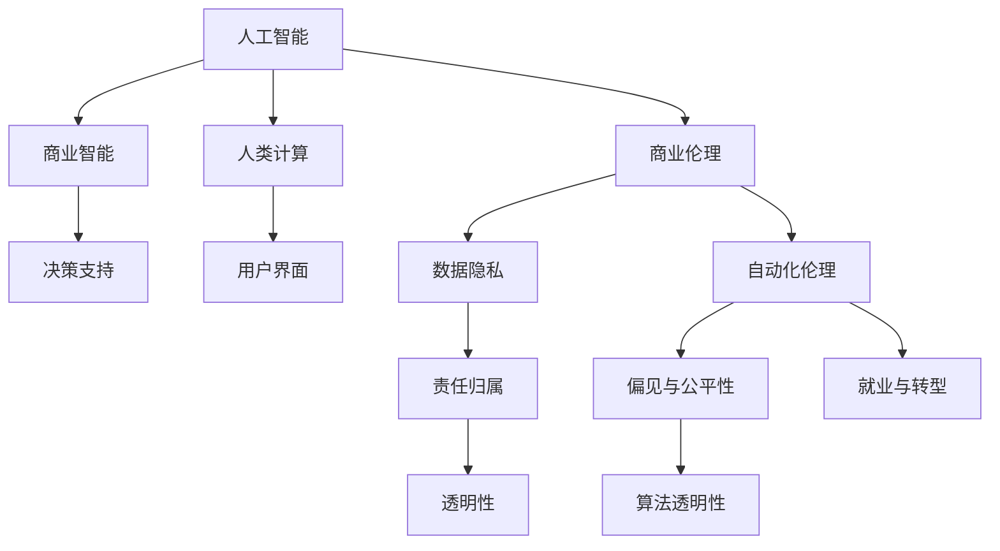

                 

# AI驱动的创新：人类计算在商业中的道德考虑因素与应用前景展望

> 关键词：人工智能,商业道德,人类计算,商业智能,自动化伦理

## 1. 背景介绍

### 1.1 问题由来

随着人工智能（AI）技术的飞速发展，AI驱动的创新在商业中扮演着越来越重要的角色。从自动化流程优化、智能客户服务到精准市场分析，AI正在深刻改变各行各业的运营模式。然而，这些技术进步也引发了一系列道德、法律和社会问题。这些问题不仅影响着技术的接受度和可信度，更关乎AI的长期可持续发展。

### 1.2 问题核心关键点

当前，AI技术在商业中的运用主要集中在以下几个方面：

- **自动化流程优化**：通过机器学习算法自动化业务流程，提高效率和准确性。
- **智能客户服务**：利用自然语言处理和机器学习技术，提供个性化、高效的客户支持。
- **精准市场分析**：通过数据分析和预测模型，帮助企业做出更明智的商业决策。
- **自动化伦理审查**：引入AI技术进行数据隐私保护和伦理审查，确保技术使用的合规性。

这些问题涉及的核心关键点包括：

1. **数据隐私与安全**：如何确保用户数据在AI处理过程中的安全性和隐私性。
2. **算法偏见与公平性**：如何避免AI算法中的偏见，确保对所有用户的公平对待。
3. **责任归属与透明性**：在AI系统做出决策时，如何明确责任归属，保证系统的透明性和可解释性。
4. **就业与职业转型**：AI自动化对劳动力市场的影响，以及如何应对由此产生的社会问题。

### 1.3 问题研究意义

研究AI在商业中的道德考虑因素与应用前景，具有重要意义：

1. **提升公众信任**：通过明确AI系统的道德边界，增强用户对AI技术的信任和接受度。
2. **规范技术应用**：确保AI技术的合规使用，避免潜在的法律和社会风险。
3. **促进技术进步**：通过引入道德和伦理考量，推动AI技术向更加智能和负责任的方向发展。
4. **推动社会责任**：帮助企业履行社会责任，平衡技术创新与社会福祉。

## 2. 核心概念与联系

### 2.1 核心概念概述

为更好地理解AI在商业中的道德考虑因素与应用前景，本节将介绍几个密切相关的核心概念：

- **人工智能（AI）**：利用算法、计算能力和大数据，使计算机系统能够模拟人类智能的领域。
- **商业智能（BI）**：将商业数据分析和可视化技术应用于商业决策过程中，帮助企业提升决策效率和质量。
- **人类计算（Human-Computer Interaction, HCI）**：研究如何设计用户界面和交互技术，以增强人机交互的自然性和效率。
- **商业伦理（Business Ethics）**：在商业决策和实践中，应用伦理原则和道德标准，确保行为符合社会和法律规范。
- **自动化伦理（Automation Ethics）**：探讨自动化技术对社会、经济和伦理的影响，确保技术的应用符合道德标准。

这些核心概念之间的逻辑关系可以通过以下Mermaid流程图来展示：



这个流程图展示了许多核心概念之间的关系：

1. AI技术通过BI应用于商业决策，提供数据驱动的决策支持。
2. 人类计算技术设计用户界面，提升人机交互效率。
3. 商业伦理指导AI和BI的道德应用，确保行为的合规性。
4. 自动化伦理关注AI对社会的影响，确保技术的道德应用。
5. 数据隐私、责任归属、透明性等概念，是商业伦理和自动化伦理的关键组成部分。
6. 偏见与公平性、算法透明性等概念，是自动化伦理的具体实践方向。
7. 就业与转型问题，是自动化伦理需考虑的长期社会影响。

## 3. 核心算法原理 & 具体操作步骤
### 3.1 算法原理概述

AI在商业中的应用，往往基于大量的数据和复杂的算法。其核心算法原理主要包括：

- **机器学习**：通过数据分析和模型训练，使计算机能够从数据中学习规律和模式，进行预测和决策。
- **深度学习**：利用多层神经网络模型，处理大规模复杂数据，实现更高级别的任务。
- **自然语言处理（NLP）**：使计算机能够理解和处理人类语言，应用于客户服务、信息检索等领域。
- **计算机视觉**：使计算机能够理解和处理图像和视频，应用于产品推荐、监控分析等领域。

### 3.2 算法步骤详解

AI在商业中的应用流程通常包括以下几个关键步骤：

1. **数据采集与预处理**：收集相关的业务数据，并进行清洗、格式化和标准化，确保数据质量。
2. **模型训练与优化**：使用历史数据训练AI模型，并根据业务需求和反馈不断优化模型。
3. **模型部署与监控**：将训练好的模型部署到实际应用中，并实时监控模型性能，及时调整参数。
4. **结果分析与反馈**：根据模型输出结果进行业务分析，评估模型效果，并根据业务反馈不断改进。

### 3.3 算法优缺点

AI在商业中的应用具有以下优点：

1. **效率提升**：自动化流程优化和精准市场分析，提高了业务效率和决策质量。
2. **成本节约**：通过AI技术减少人力成本，提升资源利用率。
3. **个性化服务**：智能客户服务和产品推荐，提供了更个性化的用户体验。

然而，AI技术在商业中的应用也存在一些缺点：

1. **技术依赖**：过度依赖AI技术，可能忽视人的直觉和判断。
2. **数据隐私问题**：AI处理大量用户数据，可能带来数据泄露和安全问题。
3. **算法偏见**：模型训练过程中可能引入偏见，导致决策不公平。
4. **透明度不足**：AI模型决策过程不透明，难以解释和调试。

### 3.4 算法应用领域

AI技术在商业中的应用领域非常广泛，主要包括以下几个方面：

1. **供应链管理**：通过数据分析和预测模型，优化库存管理和物流调度。
2. **金融服务**：利用机器学习和自然语言处理技术，提供智能投顾和风险评估。
3. **医疗健康**：通过数据分析和预测模型，辅助疾病诊断和治疗方案推荐。
4. **客户服务**：利用自然语言处理和机器学习技术，提供智能客服和虚拟助理。
5. **市场营销**：通过数据分析和预测模型，优化广告投放和市场细分。

## 4. 数学模型和公式 & 详细讲解  
### 4.1 数学模型构建

AI在商业中的模型构建通常基于以下数学模型：

- **回归模型**：通过线性回归或非线性回归模型，预测连续变量。
- **分类模型**：通过逻辑回归、支持向量机等模型，预测离散变量。
- **聚类模型**：通过K-Means、层次聚类等模型，将数据分成若干个群组。
- **神经网络模型**：通过多层神经网络模型，处理复杂数据和任务。

### 4.2 公式推导过程

以线性回归模型为例，其数学公式如下：

$$
y = \beta_0 + \beta_1 x_1 + \beta_2 x_2 + \cdots + \beta_n x_n + \epsilon
$$

其中，$y$ 表示目标变量，$\beta_0$ 和 $\beta_1$ 等表示模型参数，$x_1, x_2, \cdots, x_n$ 表示自变量，$\epsilon$ 表示误差项。

### 4.3 案例分析与讲解

以金融服务领域的信用评分为例，线性回归模型可以用于预测客户的信用风险。具体步骤如下：

1. **数据收集**：收集客户的信用历史数据，包括贷款金额、还款记录、信用评分等。
2. **特征工程**：对数据进行特征提取和处理，选择合适的特征变量。
3. **模型训练**：使用历史数据训练线性回归模型，得到模型参数。
4. **模型评估**：在测试集上评估模型效果，根据业务需求不断优化模型。
5. **模型应用**：将训练好的模型应用于新客户的信用评分预测。

## 5. 项目实践：代码实例和详细解释说明
### 5.1 开发环境搭建

在进行AI项目实践前，我们需要准备好开发环境。以下是使用Python进行Scikit-Learn开发的环境配置流程：

1. 安装Anaconda：从官网下载并安装Anaconda，用于创建独立的Python环境。

2. 创建并激活虚拟环境：
```bash
conda create -n sklearn-env python=3.8 
conda activate sklearn-env
```

3. 安装Scikit-Learn：
```bash
conda install scikit-learn
```

4. 安装各类工具包：
```bash
pip install numpy pandas matplotlib scikit-learn seaborn
```

完成上述步骤后，即可在`sklearn-env`环境中开始AI项目实践。

### 5.2 源代码详细实现

下面我们以金融服务领域的信用评分预测为例，给出使用Scikit-Learn进行线性回归模型训练的Python代码实现。

```python
from sklearn.linear_model import LinearRegression
from sklearn.metrics import mean_squared_error
from sklearn.model_selection import train_test_split
import pandas as pd

# 加载数据集
data = pd.read_csv('credit_data.csv')

# 选择特征和目标变量
X = data[['loan_amount', 'loan_term', 'credit_score', 'income']]
y = data['default']

# 分割数据集
X_train, X_test, y_train, y_test = train_test_split(X, y, test_size=0.2, random_state=42)

# 初始化模型
model = LinearRegression()

# 训练模型
model.fit(X_train, y_train)

# 评估模型
y_pred = model.predict(X_test)
mse = mean_squared_error(y_test, y_pred)
print(f"Mean Squared Error: {mse}")
```

以上代码实现了线性回归模型的训练和评估。可以看到，Scikit-Learn提供了简单易用的接口，使得模型训练过程变得非常便捷。

### 5.3 代码解读与分析

让我们再详细解读一下关键代码的实现细节：

**数据加载**：
```python
data = pd.read_csv('credit_data.csv')
```
使用Pandas库读取CSV格式的数据集。

**特征选择**：
```python
X = data[['loan_amount', 'loan_term', 'credit_score', 'income']]
y = data['default']
```
选择用于预测的特征变量和目标变量。

**数据分割**：
```python
X_train, X_test, y_train, y_test = train_test_split(X, y, test_size=0.2, random_state=42)
```
将数据集分割为训练集和测试集，比例为80%训练集、20%测试集。

**模型初始化**：
```python
model = LinearRegression()
```
初始化线性回归模型。

**模型训练**：
```python
model.fit(X_train, y_train)
```
在训练集上训练模型。

**模型评估**：
```python
y_pred = model.predict(X_test)
mse = mean_squared_error(y_test, y_pred)
print(f"Mean Squared Error: {mse}")
```
在测试集上评估模型，并计算均方误差。

可以看到，Scikit-Learn的代码实现非常简洁，使得数据预处理、模型训练和评估等步骤都非常容易操作。这大大降低了AI项目的开发门槛。

## 6. 实际应用场景
### 6.1 金融服务

在金融服务领域，AI技术被广泛应用于信用评分、风险评估、投资决策等场景。AI通过分析历史数据，预测客户的信用风险，帮助金融机构做出更精准的决策。

具体而言，AI系统可以收集客户的各类金融交易数据，利用机器学习模型分析客户的还款能力、信用历史等信息，预测其未来是否会违约。根据预测结果，金融机构可以决定是否批准贷款、调整利率等。这种基于数据的决策方式，大大提升了金融服务的效率和精准度。

### 6.2 医疗健康

AI在医疗健康领域的应用，主要集中在疾病诊断、治疗方案推荐和患者管理等方面。AI系统通过分析大量的医疗数据，辅助医生做出更准确的诊断和治疗决策。

例如，AI可以通过分析患者的病历、检查报告等数据，预测其可能患有的疾病。医生可以根据AI的诊断建议，结合自身经验进行诊断和治疗。AI还可以根据患者的病情和历史数据，推荐最适合的治疗方案，帮助医生制定个性化的治疗计划。

### 6.3 智能制造

AI技术在智能制造领域的应用，主要体现在生产线优化、质量控制和设备维护等方面。AI系统可以通过分析生产数据，预测设备故障、优化生产流程，提升生产效率和产品质量。

例如，AI系统可以实时监控生产设备的运行状态，预测可能出现的故障。一旦发现异常，系统会立即通知维护人员进行检修，避免生产中断。同时，AI系统还可以优化生产流程，提高生产线的运行效率，降低生产成本。

## 7. 工具和资源推荐
### 7.1 学习资源推荐

为了帮助开发者系统掌握AI在商业中的道德考虑因素与应用前景，这里推荐一些优质的学习资源：

1. **《人工智能伦理》**：介绍AI技术在商业中的道德应用，讨论数据隐私、算法偏见、透明性等问题。
2. **Coursera的《商业伦理学》**：由斯坦福大学教授讲授，涵盖商业伦理的基本概念和应用。
3. **《数据科学与人工智能》**：全面介绍数据科学和人工智能的基础知识，帮助理解AI技术在商业中的应用。
4. **Kaggle的机器学习竞赛**：通过实际项目，学习如何应用AI技术解决商业问题，提升实战能力。
5. **AI伦理社区**：提供AI伦理的最新研究动态和实践案例，促进技术交流和讨论。

通过对这些资源的学习实践，相信你一定能够全面掌握AI在商业中的道德考量，并应用于实际项目中。

### 7.2 开发工具推荐

高效的开发离不开优秀的工具支持。以下是几款用于AI开发常用的工具：

1. **Jupyter Notebook**：免费的开源笔记本工具，支持Python和其他语言，适合数据分析和模型训练。
2. **TensorFlow**：由Google主导开发的深度学习框架，生产部署方便，适合大规模工程应用。
3. **PyTorch**：Facebook开发的深度学习框架，灵活易用，适合研究和原型开发。
4. **Scikit-Learn**：Python的科学计算库，提供了简单易用的机器学习算法和工具。
5. **MATLAB**：商业化的科学计算软件，支持广泛的数学和工程计算。

合理利用这些工具，可以显著提升AI项目的开发效率，加快创新迭代的步伐。

### 7.3 相关论文推荐

AI技术在商业中的应用，源于学界的持续研究。以下是几篇奠基性的相关论文，推荐阅读：

1. **《机器学习在金融中的应用》**：介绍机器学习在信用评分、风险评估等金融领域的应用。
2. **《人工智能在医疗中的伦理考量》**：探讨AI技术在医疗领域的应用及其伦理问题。
3. **《自动化伦理与社会影响》**：讨论自动化技术对社会、经济和伦理的影响，提出解决方案。
4. **《AI在智能制造中的应用》**：介绍AI技术在智能制造领域的应用及其挑战。
5. **《商业智能与人工智能的结合》**：讨论商业智能和人工智能的结合，提升企业决策质量。

这些论文代表了大规模AI在商业中的应用方向和前沿思考，通过学习这些研究成果，可以更好地理解AI技术在商业中的道德考量和应用前景。

## 8. 总结：未来发展趋势与挑战
### 8.1 总结

本文对AI在商业中的应用及其道德考虑因素进行了全面系统的介绍。首先阐述了AI在商业中的核心概念和应用场景，明确了AI技术在提升业务效率、优化决策过程等方面的独特价值。其次，从原理到实践，详细讲解了AI在商业中的核心算法和技术步骤，给出了AI项目开发的完整代码实例。同时，本文还广泛探讨了AI技术在金融服务、医疗健康、智能制造等多个行业领域的应用前景，展示了AI技术在商业中的广阔应用前景。最后，本文精选了AI技术的各类学习资源，力求为读者提供全方位的技术指引。

通过本文的系统梳理，可以看到，AI在商业中的应用已经深入到各个领域，其带来的变革效应不可忽视。未来，伴随AI技术的不断进步和应用，商业智能将变得更加智能化和自动化，助力企业实现更高质量的发展。

### 8.2 未来发展趋势

展望未来，AI在商业中的应用将呈现以下几个发展趋势：

1. **深度学习的应用将更加广泛**：深度学习技术在图像识别、自然语言处理等领域将得到更广泛的应用，提升AI系统的智能水平。
2. **自动化伦理将逐步完善**：AI系统的自动化伦理将得到更多关注，确保技术应用符合道德和法律规范。
3. **人机协同将更加普及**：AI系统将与人类合作，共同完成更复杂的任务，提升人机协同效率。
4. **跨领域应用将更加深入**：AI技术将深入到更多领域，如智能制造、智能农业等，推动各行各业的数字化转型。
5. **AI赋能平台将崛起**：AI技术将与云计算、大数据等平台结合，形成更强大的AI赋能平台，提供更丰富的AI服务。

这些趋势凸显了AI在商业中的巨大潜力，其带来的变革效应将进一步拓展。

### 8.3 面临的挑战

尽管AI技术在商业中的应用已经取得了显著进展，但在迈向更加智能化、普适化应用的过程中，仍面临诸多挑战：

1. **技术复杂性**：AI系统的实现和部署需要高水平的技术，增加了企业的技术门槛。
2. **数据隐私问题**：大量用户数据的收集和使用，可能带来数据隐私和安全风险。
3. **算法偏见问题**：AI模型可能引入偏见，导致决策不公平，影响用户体验。
4. **责任归属问题**：AI系统的决策过程不透明，难以明确责任归属。
5. **社会影响问题**：AI技术的普及可能对就业、社会结构产生深远影响，需要政策引导和监管。

这些挑战需要企业和社会共同努力，才能确保AI技术在商业中的健康发展。

### 8.4 研究展望

面对AI在商业中的挑战，未来的研究需要在以下几个方面寻求新的突破：

1. **提升AI系统的透明性和可解释性**：开发更加透明和可解释的AI系统，帮助用户理解AI的决策过程。
2. **解决数据隐私问题**：采用数据加密、匿名化等技术，确保用户数据的安全性。
3. **避免算法偏见**：通过公平性约束和算法设计，确保AI模型的公正性和公平性。
4. **优化责任归属机制**：引入法律和政策手段，明确AI系统的责任归属，确保用户权益。
5. **引导社会共识**：通过教育和宣传，提高社会对AI技术的理解和接受度，促进AI技术的普及应用。

这些研究方向将进一步推动AI技术在商业中的应用，确保AI技术的健康发展和广泛应用。

## 9. 附录：常见问题与解答

**Q1：AI技术在商业中的优势和劣势是什么？**

A: AI技术在商业中的优势包括：

- **效率提升**：自动化流程优化和精准市场分析，提高了业务效率和决策质量。
- **成本节约**：通过AI技术减少人力成本，提升资源利用率。
- **个性化服务**：智能客户服务和产品推荐，提供了更个性化的用户体验。

劣势包括：

- **技术依赖**：过度依赖AI技术，可能忽视人的直觉和判断。
- **数据隐私问题**：AI处理大量用户数据，可能带来数据泄露和安全问题。
- **算法偏见**：模型训练过程中可能引入偏见，导致决策不公平。
- **透明度不足**：AI模型决策过程不透明，难以解释和调试。

**Q2：如何确保AI系统的透明性和可解释性？**

A: 确保AI系统的透明性和可解释性，可以通过以下方法：

- **模型解释技术**：使用模型解释技术，如LIME、SHAP等，帮助用户理解AI的决策过程。
- **可解释模型**：选择可解释的模型，如决策树、线性回归等，便于解释和调试。
- **数据透明度**：确保数据的来源和处理过程透明，增加用户信任。
- **模型评估**：定期评估AI系统的性能和公平性，及时发现和解决问题。

**Q3：如何处理AI系统中的数据隐私问题？**

A: 处理AI系统中的数据隐私问题，可以通过以下方法：

- **数据加密**：使用数据加密技术，保护用户数据的隐私性。
- **数据匿名化**：对用户数据进行匿名化处理，避免数据泄露。
- **访问控制**：设置严格的访问控制，确保只有授权人员才能访问数据。
- **隐私保护算法**：采用隐私保护算法，如差分隐私、联邦学习等，保护用户隐私。

**Q4：如何避免AI系统中的算法偏见？**

A: 避免AI系统中的算法偏见，可以通过以下方法：

- **公平性约束**：在模型训练中引入公平性约束，确保模型对所有用户的公平对待。
- **数据多样性**：使用多样化的训练数据，避免数据偏见。
- **偏见检测**：使用偏见检测工具，发现和消除模型中的偏见。
- **透明性**：提高模型的透明性，便于发现和纠正偏见。

**Q5：如何应对AI技术在商业中的挑战？**

A: 应对AI技术在商业中的挑战，可以通过以下方法：

- **技术培训**：提高员工的技术水平，降低技术门槛。
- **隐私保护**：采用数据加密、匿名化等技术，确保用户数据的安全性。
- **算法优化**：优化算法设计，避免偏见和公平性问题。
- **政策引导**：制定相关政策和法律，明确责任归属，确保合规性。
- **社会教育**：通过教育和宣传，提高社会对AI技术的理解和接受度，促进AI技术的普及应用。

通过这些措施，可以更好地应对AI技术在商业中的挑战，确保AI技术的健康发展。

---

作者：禅与计算机程序设计艺术 / Zen and the Art of Computer Programming

