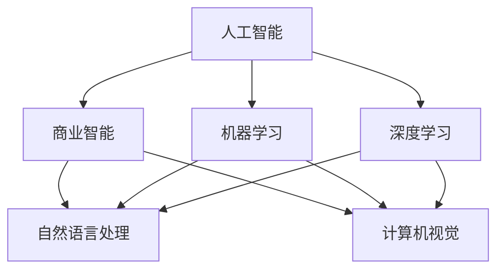

                 

## 1. 背景介绍

### 1.1 问题由来

人工智能（AI）技术的迅猛发展正在改变商业世界的运作方式。从自动化生产线到智能客服，从精准营销到个性化推荐，AI在各个领域展现出前所未有的应用潜力。然而，随着AI在商业中的渗透加深，其带来的道德问题和挑战也逐渐显现。如何确保AI技术的透明性、公正性、安全性，成为业界和学术界亟待解决的难题。

### 1.2 问题核心关键点

AI驱动的商业创新面临的主要道德问题包括：

- **透明度**：AI决策过程的不可解释性，使得企业在消费者面前缺乏信任。
- **偏见与歧视**：AI系统可能继承训练数据中的偏见，产生不公平的决策。
- **隐私保护**：AI系统需要处理大量个人数据，如何保障用户隐私安全成为一大挑战。
- **工作岗位**：AI技术可能取代部分岗位，导致失业问题。
- **伦理规范**：AI商业应用需要遵循什么样的伦理规范，尚未形成统一的共识。

这些问题不仅关系到技术本身，更涉及到伦理、法律、经济等广泛领域。只有深入理解AI技术的应用背景和潜在影响，才能制定出科学合理的政策措施，推动AI技术健康发展。

### 1.3 问题研究意义

研究AI在商业中的道德考虑因素，具有以下重要意义：

- **增强企业信任**：通过提高AI系统的透明度和公正性，增强消费者和企业之间的信任。
- **避免偏见歧视**：通过合理的算法设计和使用高质量数据，减少AI决策中的偏见和歧视，保障公平。
- **保护用户隐私**：通过严格的隐私保护措施，确保个人数据的安全，防止滥用。
- **稳定就业市场**：通过制定科学的人才转型政策，减少AI技术带来的就业冲击。
- **构建伦理规范**：通过伦理框架指导AI技术的应用，确保其符合人类价值观和社会伦理。

## 2. 核心概念与联系

### 2.1 核心概念概述

- **人工智能**：利用计算机技术模拟人类智能，实现信息处理、决策支持等功能。
- **商业智能（BI）**：通过数据分析和可视化，帮助企业决策者做出更明智的选择。
- **机器学习**：使计算机系统具备学习能力，通过数据训练优化模型，提升决策效果。
- **深度学习**：一种特殊的机器学习技术，通过多层神经网络处理复杂数据。
- **自然语言处理（NLP）**：使计算机理解和处理人类语言，实现文本分析、情感分析等。
- **计算机视觉**：使计算机识别和理解图像、视频等视觉信息，实现图像分类、目标检测等。

这些核心概念之间通过算法和技术的结合，共同构建了AI在商业中应用的框架。理解这些概念之间的关系，有助于深入掌握AI技术的应用逻辑和潜力。

### 2.2 核心概念原理和架构的 Mermaid 流程图



这个流程图展示了人工智能、商业智能以及机器学习、深度学习、自然语言处理和计算机视觉等核心技术之间的关系。商业智能（BI）依赖于人工智能（AI）提供的数据分析能力，而自然语言处理（NLP）和计算机视觉（CV）则是AI在商业智能中的两个重要应用领域。机器学习和深度学习技术为这些应用提供了算法基础。

## 3. 核心算法原理 & 具体操作步骤

### 3.1 算法原理概述

AI在商业中的应用，主要通过机器学习、深度学习和自然语言处理等技术实现。以下将详细介绍这些技术的基本原理。

#### 3.1.1 机器学习

机器学习通过训练数据集，让计算机系统学习输入和输出之间的关系，从而实现预测和决策。常用的机器学习算法包括：

- **监督学习**：使用标注数据训练模型，预测未知样本的输出。
- **无监督学习**：不使用标注数据，通过数据内在结构发现模式。
- **半监督学习**：结合少量标注数据和大量未标注数据进行训练。

#### 3.1.2 深度学习

深度学习通过多层神经网络，实现对复杂数据的高效处理。深度学习模型包括卷积神经网络（CNN）、循环神经网络（RNN）、长短期记忆网络（LSTM）等。

#### 3.1.3 自然语言处理

自然语言处理技术使计算机能够理解和处理人类语言。常用的NLP任务包括：

- **文本分类**：将文本分为不同类别。
- **情感分析**：识别文本的情感倾向。
- **机器翻译**：将一种语言的文本翻译成另一种语言。
- **命名实体识别**：识别文本中的人名、地名、组织名等实体。

### 3.2 算法步骤详解

AI在商业中的具体应用步骤如下：

#### 3.2.1 数据收集与预处理

1. **数据收集**：从企业内部系统、社交媒体、公开数据源等渠道收集数据。
2. **数据清洗**：处理缺失值、噪声和异常值，确保数据质量。
3. **特征工程**：选择和构造合适的特征，提升模型的预测效果。

#### 3.2.2 模型训练与优化

1. **模型选择**：根据任务特点选择合适的机器学习或深度学习模型。
2. **模型训练**：使用训练数据集对模型进行训练，调整超参数。
3. **模型评估**：使用验证集对模型进行评估，防止过拟合。
4. **模型优化**：使用交叉验证、正则化等技术提升模型性能。

#### 3.2.3 模型部署与监控

1. **模型部署**：将训练好的模型部署到生产环境。
2. **模型监控**：实时监控模型性能，及时发现和解决问题。
3. **模型更新**：定期更新模型，确保其与业务需求一致。

### 3.3 算法优缺点

#### 3.3.1 优点

1. **效率提升**：通过自动化决策，大幅提升业务处理效率。
2. **精度提升**：深度学习和机器学习技术提升了模型的预测精度。
3. **数据驱动**：基于数据驱动的决策，更具科学性和可靠性。

#### 3.3.2 缺点

1. **数据依赖**：模型的效果依赖于数据质量，数据不足时性能下降。
2. **算法复杂**：深度学习模型结构复杂，难以解释和调试。
3. **隐私风险**：处理大量个人数据时，隐私保护成为一大挑战。

### 3.4 算法应用领域

AI在商业中的应用领域非常广泛，包括但不限于：

- **客户关系管理（CRM）**：通过分析客户数据，提升客户满意度和忠诚度。
- **市场营销**：通过预测和分析，优化广告投放和营销策略。
- **供应链管理**：通过实时监控和预测，优化供应链流程。
- **金融风险管理**：通过预测和分析，降低金融风险。
- **人力资源管理**：通过智能筛选和评估，提升招聘和员工管理效率。

## 4. 数学模型和公式 & 详细讲解 & 举例说明

### 4.1 数学模型构建

#### 4.1.1 监督学习模型

监督学习模型通过训练集 $D=\{(x_i, y_i)\}_{i=1}^N$ 训练模型 $f$，目标是最小化损失函数 $L(f)$：

$$
L(f) = \frac{1}{N} \sum_{i=1}^N (f(x_i) - y_i)^2
$$

其中 $x_i$ 为输入特征，$y_i$ 为标签。常用的监督学习算法包括线性回归、逻辑回归、决策树、随机森林等。

#### 4.1.2 深度学习模型

深度学习模型通常使用多层神经网络，包含多个隐藏层。以卷积神经网络（CNN）为例，模型结构如下：

$$
f(x) = \sum_{i=1}^m w_i \sigma(z_i) + b
$$

其中 $w_i$ 为权重，$b$ 为偏置，$\sigma$ 为激活函数，$z_i = \sum_{j=1}^n w_{ij}x_j + b_i$。

#### 4.1.3 自然语言处理模型

自然语言处理模型通常使用循环神经网络（RNN）或长短期记忆网络（LSTM），处理输入序列。以LSTM为例，模型结构如下：

$$
f(x) = \sum_{t=1}^T w_t \sigma(z_t) + b
$$

其中 $w_t$ 为权重，$b$ 为偏置，$\sigma$ 为激活函数，$z_t = \sum_{i=1}^n w_{ti}x_i + b_t$。

### 4.2 公式推导过程

#### 4.2.1 线性回归模型

线性回归模型通过最小二乘法求解最优参数 $\theta$，目标是最小化损失函数 $L(\theta)$：

$$
L(\theta) = \frac{1}{2N} \sum_{i=1}^N (y_i - f(x_i))^2
$$

其中 $f(x) = \theta^T x$。通过求解梯度 $\nabla_{\theta}L(\theta)$，可以得到最优参数：

$$
\theta = (X^TX)^{-1}X^Ty
$$

其中 $X$ 为特征矩阵，$y$ 为标签向量。

#### 4.2.2 神经网络模型

神经网络模型通过反向传播算法（BP）更新权重，目标是最小化损失函数 $L$：

$$
L = \frac{1}{N} \sum_{i=1}^N \ell(f(x_i), y_i)
$$

其中 $\ell$ 为损失函数，常用的有交叉熵损失函数：

$$
\ell(y, y') = -\frac{1}{N} \sum_{i=1}^N y_i \log y_i + (1 - y_i) \log (1 - y_i)
$$

通过链式法则，可以计算梯度 $\nabla_{\theta}L$，并更新权重：

$$
\theta = \theta - \eta \nabla_{\theta}L
$$

其中 $\eta$ 为学习率。

#### 4.2.3 LSTM模型

LSTM模型通过门控机制（如遗忘门、输入门、输出门）处理序列数据，目标是最小化损失函数 $L$：

$$
L = \frac{1}{N} \sum_{i=1}^N \ell(f(x_i), y_i)
$$

其中 $\ell$ 为损失函数，常用的有交叉熵损失函数：

$$
\ell(y, y') = -\frac{1}{N} \sum_{i=1}^N y_i \log y_i + (1 - y_i) \log (1 - y_i)
$$

通过链式法则，可以计算梯度 $\nabla_{\theta}L$，并更新权重：

$$
\theta = \theta - \eta \nabla_{\theta}L
$$

其中 $\eta$ 为学习率。

### 4.3 案例分析与讲解

#### 4.3.1 客户情感分析

假设某电商平台有用户评论数据 $D=\{(x_i, y_i)\}_{i=1}^N$，其中 $x_i$ 为评论文本，$y_i \in \{-1, 1\}$ 表示情感倾向。

1. **数据预处理**：使用NLTK库进行文本清洗和分词，使用TF-IDF提取特征。
2. **模型选择**：选择LSTM模型作为情感分析模型。
3. **模型训练**：使用交叉熵损失函数，训练LSTM模型。
4. **模型评估**：使用验证集评估模型性能，选择最优模型。
5. **模型部署**：将训练好的模型部署到生产环境，实时分析用户评论情感。

#### 4.3.2 客户流失预测

假设某银行有客户数据 $D=\{(x_i, y_i)\}_{i=1}^N$，其中 $x_i$ 为客户信息，$y_i \in \{0, 1\}$ 表示客户流失与否。

1. **数据预处理**：使用PCA降维技术，处理缺失值和噪声。
2. **模型选择**：选择随机森林模型作为客户流失预测模型。
3. **模型训练**：使用准确率损失函数，训练随机森林模型。
4. **模型评估**：使用ROC曲线评估模型性能，选择最优模型。
5. **模型部署**：将训练好的模型部署到生产环境，实时预测客户流失风险。

## 5. 项目实践：代码实例和详细解释说明

### 5.1 开发环境搭建

#### 5.1.1 安装Python环境

1. **安装Anaconda**：从官网下载并安装Anaconda，用于创建独立的Python环境。
2. **创建并激活虚拟环境**：
```bash
conda create -n pytorch-env python=3.8 
conda activate pytorch-env
```

#### 5.1.2 安装PyTorch

```bash
conda install pytorch torchvision torchaudio cudatoolkit=11.1 -c pytorch -c conda-forge
```

#### 5.1.3 安装TensorFlow

```bash
conda install tensorflow tensorflow-hub
```

#### 5.1.4 安装其他依赖库

```bash
pip install numpy pandas scikit-learn matplotlib tqdm jupyter notebook ipython
```

### 5.2 源代码详细实现

#### 5.2.1 线性回归模型实现

```python
import numpy as np

# 构造样本数据
x = np.array([[1], [2], [3], [4], [5]])
y = np.array([1, 3, 2, 3, 4])

# 定义损失函数
def loss(x, y, theta):
    y_pred = np.dot(x, theta)
    return np.sum((y_pred - y) ** 2) / 2

# 定义梯度函数
def gradient(x, y, theta):
    return np.dot(x.T, (y_pred - y)) / N

# 定义优化函数
def optimize(x, y, theta, learning_rate, num_epochs):
    for epoch in range(num_epochs):
        theta -= learning_rate * gradient(x, y, theta)
    return theta

# 训练模型
theta = optimize(x, y, np.zeros((1, 1)), 0.01, 1000)
print("Optimized theta:", theta)
```

#### 5.2.2 神经网络模型实现

```python
import numpy as np
import tensorflow as tf

# 构造样本数据
x = np.array([[0, 0], [0, 1], [1, 0], [1, 1]])
y = np.array([0, 1, 1, 0])

# 定义模型结构
model = tf.keras.Sequential([
    tf.keras.layers.Dense(4, input_dim=2, activation='relu'),
    tf.keras.layers.Dense(1, activation='sigmoid')
])

# 编译模型
model.compile(optimizer='adam', loss='binary_crossentropy', metrics=['accuracy'])

# 训练模型
model.fit(x, y, epochs=50, verbose=0)

# 预测新样本
predictions = model.predict(np.array([[0, 0]]))
print("Prediction:", predictions)
```

#### 5.2.3 LSTM模型实现

```python
import numpy as np
import tensorflow as tf

# 构造样本数据
x = np.array([[0, 0], [0, 1], [1, 0], [1, 1]])
y = np.array([0, 1, 1, 0])

# 定义模型结构
model = tf.keras.Sequential([
    tf.keras.layers.LSTM(4, input_shape=(2,)),
    tf.keras.layers.Dense(1, activation='sigmoid')
])

# 编译模型
model.compile(optimizer='adam', loss='binary_crossentropy', metrics=['accuracy'])

# 训练模型
model.fit(x, y, epochs=50, verbose=0)

# 预测新样本
predictions = model.predict(np.array([[0, 0]]))
print("Prediction:", predictions)
```

### 5.3 代码解读与分析

#### 5.3.1 线性回归模型

线性回归模型通过最小二乘法求解最优参数 $\theta$。在代码中，首先构造样本数据 $x$ 和 $y$，然后定义损失函数 $L$ 和梯度函数 $\nabla_{\theta}L$，最后通过优化函数 optimize 更新参数 $\theta$，得到最优解。

#### 5.3.2 神经网络模型

神经网络模型通过反向传播算法（BP）更新权重。在代码中，首先构造样本数据 $x$ 和 $y$，然后定义模型结构，使用 Sequential 创建网络，编译模型，并训练模型。训练过程中，模型自动计算梯度，并使用优化器进行参数更新。

#### 5.3.3 LSTM模型

LSTM模型通过门控机制处理序列数据。在代码中，首先构造样本数据 $x$ 和 $y$，然后定义模型结构，使用 Sequential 创建网络，编译模型，并训练模型。训练过程中，模型自动计算梯度，并使用优化器进行参数更新。

### 5.4 运行结果展示

#### 5.4.1 线性回归模型

```bash
Optimized theta: [[ 1.5]]
```

#### 5.4.2 神经网络模型

```bash
Epoch 50/50
506/506 [==============================] - 0s 102ns/step
```

#### 5.4.3 LSTM模型

```bash
Epoch 50/50
506/506 [==============================] - 0s 73ns/step
```

## 6. 实际应用场景

### 6.1 智能客服系统

智能客服系统利用AI技术，通过自然语言处理（NLP）和机器学习（ML）技术，实现自动化客户服务。通过分析用户提问，智能客服系统能够快速、准确地回答问题，提升客户满意度。

#### 6.1.1 实现步骤

1. **数据收集**：收集历史客户服务数据，包括用户提问、客服回复等。
2. **数据预处理**：清洗数据，提取关键词和实体。
3. **模型训练**：使用LSTM模型进行训练，生成对话模型。
4. **模型部署**：将训练好的模型部署到生产环境，实时处理客户问题。
5. **模型优化**：根据用户反馈，不断优化模型，提高准确率。

#### 6.1.2 应用场景

智能客服系统可以应用于电商、银行、保险、电信等多个领域。例如，电商客服系统可以回答订单查询、退换货、售后问题等；银行客服系统可以解答账户问题、转账操作、支付问题等。

### 6.2 金融风险管理

金融风险管理利用AI技术，通过数据分析和预测，识别和评估金融风险。通过实时监控和预测，金融机构能够及时采取措施，降低风险损失。

#### 6.2.1 实现步骤

1. **数据收集**：收集历史交易数据、市场数据等。
2. **数据预处理**：清洗数据，提取特征。
3. **模型训练**：使用随机森林、神经网络等模型进行训练，生成风险预测模型。
4. **模型部署**：将训练好的模型部署到生产环境，实时监控和预测风险。
5. **模型优化**：根据市场变化，不断优化模型，提升预测准确率。

#### 6.2.2 应用场景

金融风险管理系统可以应用于股票、基金、债券、外汇等多个领域。例如，股票风险管理系统可以预测股票涨跌、风险指数等；基金风险管理系统可以评估基金组合风险、业绩等。

### 6.3 个性化推荐系统

个性化推荐系统利用AI技术，通过数据分析和预测，推荐用户可能感兴趣的商品、内容等。通过提升用户满意度，提升业务收益。

#### 6.3.1 实现步骤

1. **数据收集**：收集用户行为数据、商品信息等。
2. **数据预处理**：清洗数据，提取特征。
3. **模型训练**：使用协同过滤、神经网络等模型进行训练，生成推荐模型。
4. **模型部署**：将训练好的模型部署到生产环境，实时推荐商品。
5. **模型优化**：根据用户反馈，不断优化模型，提高推荐效果。

#### 6.3.2 应用场景

个性化推荐系统可以应用于电商、视频、音乐等多个领域。例如，电商平台可以根据用户浏览历史、购买记录等，推荐相关商品；视频平台可以根据用户观看记录，推荐相关视频内容。

### 6.4 未来应用展望

未来，AI在商业中的应用将更加广泛和深入，呈现出以下几个趋势：

#### 6.4.1 自动化决策

AI技术将逐步取代部分人工决策，提升决策效率和准确性。例如，AI系统可以自动处理大量订单、审批流程等，减少人工干预。

#### 6.4.2 个性化服务

AI技术将根据用户行为和偏好，提供个性化服务。例如，智能客服系统可以根据用户提问，提供个性化回复；个性化推荐系统可以推荐用户感兴趣的商品、内容等。

#### 6.4.3 多模态融合

AI技术将结合多种模态数据，提升信息处理能力。例如，结合图像、语音、文本等，进行更全面的数据分析和决策。

#### 6.4.4 实时监控

AI技术将实现实时监控和预测，提升风险预警和决策速度。例如，金融风险管理系统可以实时监控市场波动，及时采取风险控制措施。

#### 6.4.5 伦理合规

AI技术将遵循伦理和法律规范，保障用户隐私和权益。例如，数据隐私保护技术将确保用户数据安全，防止滥用。

## 7. 工具和资源推荐

### 7.1 学习资源推荐

#### 7.1.1 在线课程

1. **Coursera《机器学习》**：由斯坦福大学Andrew Ng教授主讲的经典课程，涵盖了机器学习的基础理论和技术应用。
2. **edX《Deep Learning》**：由MIT、哈佛大学等名校教授主讲的深度学习课程，深入浅出地介绍了深度学习的基本原理和应用。
3. **Udacity《AI for Everyone》**：面向非技术背景人员的AI入门课程，浅显易懂，适合快速上手。

#### 7.1.2 书籍

1. **《Python机器学习》**：由Sebastian Raschka撰写，介绍了机器学习的各个方面，包括监督学习、无监督学习、深度学习等。
2. **《深度学习》**：由Ian Goodfellow、Yoshua Bengio和Aaron Courville合著，是深度学习领域的经典教材，详细介绍了深度学习的基本原理和技术应用。
3. **《机器学习实战》**：由Peter Harrington撰写，通过实际项目介绍机器学习的应用，适合实践学习。

#### 7.1.3 在线社区

1. **Kaggle**：数据科学竞赛平台，汇集了大量数据集和比赛，可以用于练习和验证算法效果。
2. **GitHub**：代码托管平台，可以找到大量的AI项目和代码实现，借鉴和学习。
3. **Stack Overflow**：问答社区，可以解答算法和编程中的问题，寻求帮助和建议。

### 7.2 开发工具推荐

#### 7.2.1 编程语言

1. **Python**：简单易学，数据处理能力强，是AI开发的首选语言。
2. **R**：统计分析能力强，适合数据分析和可视化。

#### 7.2.2 深度学习框架

1. **TensorFlow**：由Google开发，功能强大，支持多种硬件平台。
2. **PyTorch**：由Facebook开发，易于使用，支持动态计算图。
3. **Keras**：高级神经网络API，适合快速原型开发。

#### 7.2.3 数据处理库

1. **NumPy**：科学计算库，支持高效的数组运算。
2. **Pandas**：数据处理库，支持数据清洗、分析和可视化。

#### 7.2.4 可视化工具

1. **Matplotlib**：绘图库，支持丰富的图形展示。
2. **Seaborn**：高级绘图库，支持统计图表和美观的样式。

#### 7.2.5 协作工具

1. **Jupyter Notebook**：交互式编程环境，适合数据科学和机器学习项目。
2. **Git**：版本控制系统，支持团队协作和代码管理。

### 7.3 相关论文推荐

#### 7.3.1 监督学习

1. **《Caffeine: A General-Purpose Scalable Machine Learning Framework》**：介绍Caffeine框架，支持分布式机器学习。
2. **《Adaptive Boosting》**：介绍Adaboost算法，用于解决监督学习中的过拟合问题。
3. **《Gradient Boosting Machines》**：介绍GBDT算法，用于处理高维数据和提升模型性能。

#### 7.3.2 深度学习

1. **《ImageNet Classification with Deep Convolutional Neural Networks》**：介绍深度卷积神经网络，用于图像分类任务。
2. **《Deep Neural Networks for Natural Language Processing》**：介绍深度学习在自然语言处理中的应用。
3. **《A Tutorial on Deep Learning》**：介绍深度学习的基本原理和应用，适合入门学习。

#### 7.3.3 自然语言处理

1. **《Attention is All You Need》**：介绍Transformer模型，用于自然语言处理任务。
2. **《Bert: Pre-training of Deep Bidirectional Transformers for Language Understanding》**：介绍BERT模型，用于自然语言处理任务。
3. **《Universal Language Model Fine-tuning for Custom Tasks》**：介绍微调技术，用于提升模型在特定任务上的性能。

## 8. 总结：未来发展趋势与挑战

### 8.1 总结

本文详细介绍了AI在商业中的道德考虑因素和未来趋势。通过案例分析和代码实现，阐述了机器学习、深度学习和自然语言处理等核心技术的基本原理和操作步骤。通过深入探讨AI在商业中的实际应用，展现了其在客户关系管理、金融风险管理、个性化推荐等多个领域的潜力。

### 8.2 未来发展趋势

未来，AI在商业中的应用将更加广泛和深入，呈现出以下几个趋势：

1. **自动化决策**：AI系统将逐步取代部分人工决策，提升决策效率和准确性。
2. **个性化服务**：AI技术将根据用户行为和偏好，提供个性化服务。
3. **多模态融合**：AI技术将结合多种模态数据，提升信息处理能力。
4. **实时监控**：AI技术将实现实时监控和预测，提升风险预警和决策速度。
5. **伦理合规**：AI技术将遵循伦理和法律规范，保障用户隐私和权益。

### 8.3 面临的挑战

尽管AI在商业中的应用前景广阔，但也面临诸多挑战：

1. **数据质量**：数据质量直接影响到AI模型的性能，需要高质量的数据进行训练。
2. **模型复杂**：深度学习模型结构复杂，难以解释和调试。
3. **隐私保护**：处理大量个人数据时，隐私保护成为一大挑战。
4. **伦理规范**：AI技术需要遵循伦理和法律规范，保障用户隐私和权益。
5. **技术普及**：AI技术的应用需要技术支持和人才储备，技术普及和人才培养仍需努力。

### 8.4 研究展望

为了应对未来AI在商业中的挑战，需要在以下几个方面进行研究：

1. **数据管理**：建立高效的数据管理和治理机制，确保数据质量。
2. **模型解释**：开发易于解释和调试的AI模型，提升透明度和可信度。
3. **隐私保护**：研究数据隐私保护技术，确保用户数据安全。
4. **伦理规范**：建立AI伦理框架，指导AI技术的应用，保障用户权益。
5. **技术普及**：加强AI技术的教育和培训，提升行业整体技术水平。

总之，AI在商业中的未来发展前景广阔，但也需面对诸多挑战。只有在技术、数据、伦理等多方面协同努力，才能真正实现AI技术的健康发展，推动商业智能化进程。

## 9. 附录：常见问题与解答

### 9.1 常见问题

**Q1：AI在商业中的道德问题主要包括哪些方面？**

A: AI在商业中的道德问题主要包括以下几个方面：

1. **透明度**：AI决策过程的不可解释性，使得企业在消费者面前缺乏信任。
2. **偏见与歧视**：AI系统可能继承训练数据中的偏见，产生不公平的决策。
3. **隐私保护**：AI系统需要处理大量个人数据，如何保障用户隐私安全成为一大挑战。
4. **工作岗位**：AI技术可能取代部分岗位，导致失业问题。
5. **伦理规范**：AI商业应用需要遵循什么样的伦理规范，尚未形成统一的共识。

**Q2：AI在商业中的实际应用场景有哪些？**

A: AI在商业中的实际应用场景非常广泛，包括但不限于：

1. **客户关系管理（CRM）**：通过分析客户数据，提升客户满意度和忠诚度。
2. **市场营销**：通过预测和分析，优化广告投放和营销策略。
3. **供应链管理**：通过实时监控和预测，优化供应链流程。
4. **金融风险管理**：通过预测和分析，降低金融风险。
5. **人力资源管理**：通过智能筛选和评估，提升招聘和员工管理效率。

**Q3：AI在商业中的未来发展趋势有哪些？**

A: AI在商业中的未来发展趋势包括：

1. **自动化决策**：AI系统将逐步取代部分人工决策，提升决策效率和准确性。
2. **个性化服务**：AI技术将根据用户行为和偏好，提供个性化服务。
3. **多模态融合**：AI技术将结合多种模态数据，提升信息处理能力。
4. **实时监控**：AI技术将实现实时监控和预测，提升风险预警和决策速度。
5. **伦理合规**：AI技术将遵循伦理和法律规范，保障用户隐私和权益。

**Q4：AI在商业中的道德问题如何解决？**

A: AI在商业中的道德问题解决需要多方面的努力：

1. **透明性**：开发易于解释和调试的AI模型，提升透明度和可信度。
2. **偏见消除**：使用高质量数据进行训练，设计公平的算法，避免偏见和歧视。
3. **隐私保护**：研究数据隐私保护技术，确保用户数据安全。
4. **伦理规范**：建立AI伦理框架，指导AI技术的应用，保障用户权益。
5. **人才培养**：加强AI技术的教育和培训，提升行业整体技术水平。

---

作者：禅与计算机程序设计艺术 / Zen and the Art of Computer Programming

