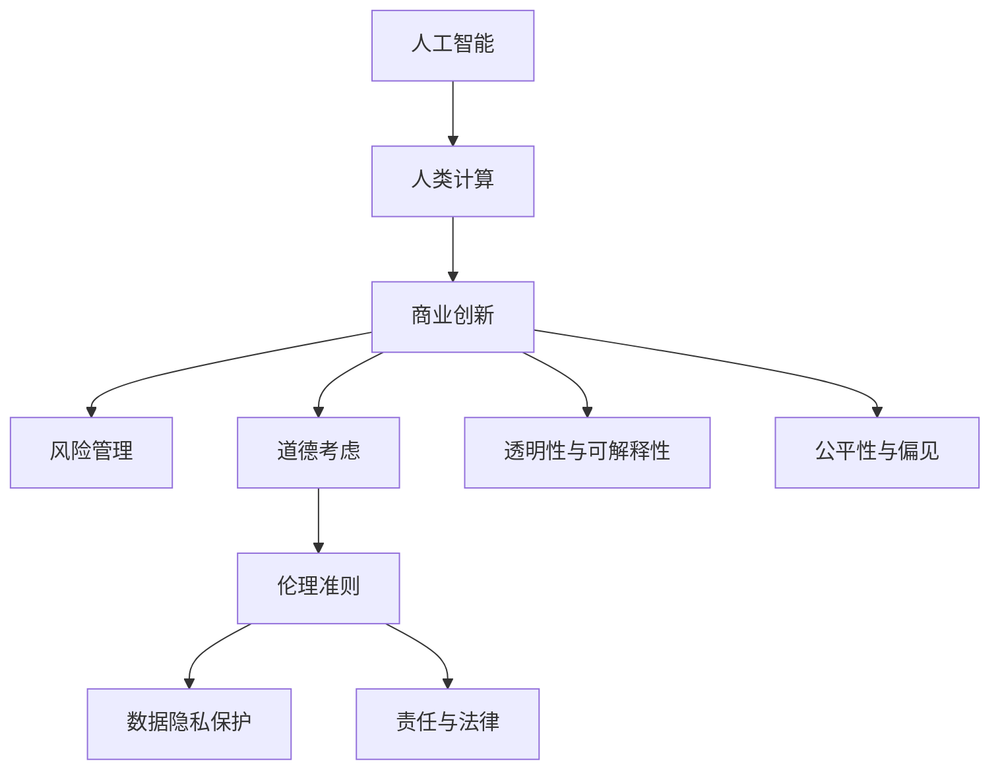

                 

# AI驱动的创新：人类计算在商业中的道德考虑因素预测

> 关键词：人工智能，人类计算，道德考虑，商业创新，风险管理

## 1. 背景介绍

在过去的几年里，人工智能(AI)技术迅猛发展，尤其是在自然语言处理、计算机视觉、数据分析等领域。随着AI技术的深入应用，它对商业世界的影响也越来越大。然而，在享受AI带来的便利和效率的同时，我们也需要认真考虑其带来的道德和伦理问题。尤其是人类计算在商业中的应用，如何在创新和道德之间找到平衡，是一个重要的课题。

## 2. 核心概念与联系

### 2.1 核心概念概述

为更好地理解人工智能在商业中的应用，并考虑其道德因素，本节将介绍几个关键概念：

- **人工智能**：通过算法和数据训练出来的计算机系统，能够模拟人类智能，进行学习、推理、决策等任务。

- **人类计算**：利用AI技术，通过数据和模型对商业活动进行分析、预测和优化。

- **道德考虑**：在应用AI技术时，需要考虑其对社会、个人、环境等方面的影响，确保技术的道德性。

- **商业创新**：通过AI驱动的商业模式创新，提高企业的竞争力，创造新的价值。

- **风险管理**：在AI应用过程中，识别并管理可能的风险，确保系统的安全性、稳定性和可靠性。

- **透明性与可解释性**：AI系统的决策过程应尽可能透明，提供可解释的依据，以便于理解和信任。

- **公平性与偏见**：确保AI系统的公平性，避免对某些群体或个体产生歧视性的影响。

这些概念之间的逻辑关系可以通过以下Mermaid流程图来展示：



这个流程图展示了大语言模型的核心概念及其之间的关系：

1. 人工智能通过处理大量数据和执行算法，形成对商业活动的洞察。
2. 人类计算利用人工智能的结果，对商业活动进行预测和优化，实现创新。
3. 风险管理关注AI应用中的潜在风险，确保系统的稳定性和安全性。
4. 道德考虑要求在商业创新中考虑伦理问题，确保技术的可接受性。
5. 透明性和可解释性关注AI系统的决策过程是否透明，能否提供合理的解释。
6. 公平性与偏见要求AI系统避免对特定群体产生歧视，保持中立。
7. 伦理准则、数据隐私保护和责任与法律，都是道德考虑的具体体现。

这些概念共同构成了人工智能在商业应用中的道德框架，指导我们如何在创新与道德之间取得平衡。

## 3. 核心算法原理 & 具体操作步骤
### 3.1 算法原理概述

人类计算在商业中的应用，通常基于监督学习和强化学习等算法。其核心思想是通过数据训练AI模型，利用模型的预测结果指导商业决策。具体的算法流程如下：

1. **数据收集**：收集与商业活动相关的数据，如客户行为、市场趋势、产品销售等。
2. **数据预处理**：清洗、归一化、特征提取等步骤，以便于模型训练。
3. **模型训练**：选择合适的算法，利用历史数据训练模型。
4. **模型评估**：在验证集上评估模型性能，选择合适的超参数。
5. **商业决策**：利用训练好的模型进行预测和决策，优化商业活动。

### 3.2 算法步骤详解

以基于监督学习的预测模型为例，算法步骤详解如下：

1. **数据收集**：收集与预测任务相关的数据，如销售数据、客户评价等。
2. **数据预处理**：清洗数据，去除噪声和异常值，进行特征工程，提取有用的特征。
3. **模型训练**：选择合适的监督学习算法，如线性回归、决策树、神经网络等，利用历史数据训练模型。
4. **模型评估**：在验证集上评估模型性能，选择最优的超参数。
5. **商业决策**：利用训练好的模型进行预测，优化商业活动。

例如，在预测客户流失率的例子中，数据收集包括客户的基本信息、购买行为、服务满意度等。数据预处理包括去除缺失值、异常值，进行特征工程，如提取用户行为特征、服务满意度特征等。模型训练可以采用逻辑回归、随机森林、梯度提升等算法。模型评估通过交叉验证、均方误差等指标评估模型性能。商业决策通过预测模型预测客户流失率，并采取相应的营销策略减少流失。

### 3.3 算法优缺点

人类计算在商业中的应用，有以下优点和缺点：

**优点**：
1. 提高决策效率：利用AI模型可以快速分析大量数据，提供决策依据。
2. 优化商业策略：通过预测和优化，提高企业的市场竞争力。
3. 降低成本：减少人工分析的时间和成本，提高运营效率。

**缺点**：
1. 依赖数据质量：模型性能依赖于高质量的数据，数据偏差可能影响预测结果。
2. 解释性不足：AI模型往往是“黑箱”，难以解释其决策依据。
3. 存在偏见：模型可能继承数据中的偏见，导致决策不公平。
4. 隐私问题：收集和分析用户数据可能涉及隐私问题，需遵守法律法规。

### 3.4 算法应用领域

人类计算在商业中的应用广泛，包括但不限于以下几个领域：

- **市场营销**：预测客户行为，优化广告投放和产品推荐。
- **金融服务**：风险评估、信用评分、欺诈检测等。
- **供应链管理**：需求预测、库存管理、物流优化等。
- **客户服务**：情感分析、自动回复、客户满意度预测等。
- **人力资源**：员工流失预测、招聘效果评估、培训需求分析等。

这些应用领域展示了人类计算在商业中的广泛价值，但同时也需要关注其道德和伦理问题。

## 4. 数学模型和公式 & 详细讲解 & 举例说明
### 4.1 数学模型构建

以线性回归模型为例，其数学模型构建如下：

设 $y$ 为预测目标，$x_1, x_2, ..., x_n$ 为特征，模型为 $y = \beta_0 + \beta_1x_1 + \beta_2x_2 + ... + \beta_nx_n$。其中 $\beta_0, \beta_1, ..., \beta_n$ 为模型参数。

假设训练集为 $D = \{(x_i, y_i)\}_{i=1}^N$，则线性回归模型的目标为最小化均方误差：

$$
\min_{\beta} \frac{1}{N} \sum_{i=1}^N (y_i - \beta_0 - \beta_1x_{1,i} - ... - \beta_nx_{n,i})^2
$$

其中，$y_{1,i}, y_{2,i}, ..., y_{N,i}$ 为样本 $i$ 的目标值，$x_{1,i}, x_{2,i}, ..., x_{N,i}$ 为样本 $i$ 的特征值。

### 4.2 公式推导过程

线性回归模型的参数 $\beta_0, \beta_1, ..., \beta_n$ 的求解，通常通过最小二乘法来实现。最小二乘法的基本思想是，使预测值与真实值之间的平方误差最小化。

假设 $X$ 为特征矩阵，$y$ 为标签向量，则线性回归模型的损失函数为：

$$
\mathcal{L}(\beta) = ||X\beta - y||^2_2
$$

通过求偏导数，可以得到最优参数 $\beta$：

$$
\beta = (X^T X)^{-1}X^T y
$$

其中 $X^T$ 为特征矩阵的转置，$||\cdot||_2$ 为矩阵的Frobenius范数。

### 4.3 案例分析与讲解

例如，在预测客户流失率的应用中，数据收集和预处理后，可以通过逻辑回归模型进行训练和预测。以下是步骤：

1. 收集客户基本信息、购买行为、服务满意度等数据。
2. 数据预处理，包括数据清洗、特征提取等。
3. 利用训练集训练逻辑回归模型，得到模型参数 $\beta$。
4. 在验证集上评估模型性能，选择合适的超参数。
5. 利用训练好的模型进行预测，判断客户是否可能流失，并采取相应的营销策略。

## 5. 项目实践：代码实例和详细解释说明
### 5.1 开发环境搭建

在进行项目实践前，我们需要准备好开发环境。以下是使用Python进行Scikit-Learn开发的环境配置流程：

1. 安装Anaconda：从官网下载并安装Anaconda，用于创建独立的Python环境。

2. 创建并激活虚拟环境：
```bash
conda create -n scikit-learn-env python=3.8 
conda activate scikit-learn-env
```

3. 安装Scikit-Learn：
```bash
pip install scikit-learn
```

4. 安装各类工具包：
```bash
pip install numpy pandas scikit-learn matplotlib tqdm jupyter notebook ipython
```

完成上述步骤后，即可在`scikit-learn-env`环境中开始项目实践。

### 5.2 源代码详细实现

下面我们以客户流失预测为例，给出使用Scikit-Learn进行逻辑回归模型训练的Python代码实现。

首先，定义数据处理函数：

```python
import pandas as pd
from sklearn.preprocessing import StandardScaler
from sklearn.model_selection import train_test_split
from sklearn.linear_model import LogisticRegression
from sklearn.metrics import accuracy_score

def load_data(file_path):
    data = pd.read_csv(file_path)
    features = data.drop('churn', axis=1)
    labels = data['churn']
    return features, labels

def preprocess_data(features, labels):
    scaler = StandardScaler()
    features_scaled = scaler.fit_transform(features)
    return features_scaled, labels

def train_model(features, labels):
    model = LogisticRegression()
    model.fit(features, labels)
    return model

def evaluate_model(model, features, labels):
    predictions = model.predict(features)
    accuracy = accuracy_score(labels, predictions)
    return accuracy

def predict_churn(model, new_features):
    predictions = model.predict(new_features)
    return predictions
```

然后，定义训练和评估函数：

```python
from sklearn.metrics import confusion_matrix
from sklearn.ensemble import RandomForestClassifier

def train_epoch(model, features, labels, batch_size):
    model.fit(features, labels)
    return model

def evaluate_epoch(model, features, labels, batch_size):
    predictions = model.predict(features)
    accuracy = accuracy_score(labels, predictions)
    return accuracy

def predict_churn(model, new_features):
    predictions = model.predict(new_features)
    return predictions
```

最后，启动训练流程并在测试集上评估：

```python
epochs = 5
batch_size = 16

features, labels = load_data('customer_data.csv')
features_scaled, labels = preprocess_data(features, labels)
X_train, X_test, y_train, y_test = train_test_split(features_scaled, labels, test_size=0.2, random_state=42)

model = train_model(X_train, y_train)
print('Train accuracy:', evaluate_model(model, X_train, y_train))
print('Test accuracy:', evaluate_model(model, X_test, y_test))

predictions = predict_churn(model, new_features)
print('Predicted churn:', predictions)
```

以上就是使用Scikit-Learn对逻辑回归模型进行客户流失预测的完整代码实现。可以看到，得益于Scikit-Learn的强大封装，我们可以用相对简洁的代码完成模型的训练和评估。

### 5.3 代码解读与分析

让我们再详细解读一下关键代码的实现细节：

**load_data函数**：
- 定义数据加载函数，读取CSV文件，提取特征和标签。

**preprocess_data函数**：
- 数据预处理函数，包括数据标准化和特征归一化。

**train_model函数**：
- 模型训练函数，定义并训练逻辑回归模型。

**evaluate_model函数**：
- 模型评估函数，计算模型的准确率。

**predict_churn函数**：
- 模型预测函数，预测新样本是否流失。

**train_epoch函数**：
- 训练函数，利用交叉验证法进行模型训练。

**evaluate_epoch函数**：
- 评估函数，评估模型性能。

**predict_churn函数**：
- 预测函数，使用训练好的模型进行新样本预测。

可以看到，Scikit-Learn的简单高效使我们能够快速上手逻辑回归模型的实现。开发者可以将更多精力放在数据处理、模型改进等高层逻辑上，而不必过多关注底层的实现细节。

当然，工业级的系统实现还需考虑更多因素，如模型的保存和部署、超参数的自动搜索、更灵活的任务适配层等。但核心的算法流程基本与此类似。

## 6. 实际应用场景
### 6.1 智能客服系统

基于逻辑回归模型等监督学习算法的智能客服系统，可以广泛应用于客户服务场景。传统客服往往需要配备大量人力，高峰期响应缓慢，且一致性和专业性难以保证。而使用预测模型预测客户问题，并将其分配给合适的客服代表，可以大幅提升客户咨询体验和问题解决效率。

在技术实现上，可以收集历史客服记录和常见问题，将问题和最佳答复构建成监督数据，在此基础上对逻辑回归模型进行训练。预测模型能够自动理解客户意图，匹配最合适的答复，并生成自动回复。对于客户提出的新问题，还可以实时搜索相关知识库，动态组织生成回答。

### 6.2 金融舆情监测

金融机构需要实时监测市场舆论动向，以便及时应对负面信息传播，规避金融风险。传统的人工监测方式成本高、效率低，难以应对网络时代海量信息爆发的挑战。基于逻辑回归模型等监督学习算法的金融舆情监测，为金融机构提供了新的解决方案。

具体而言，可以收集金融领域相关的新闻、报道、评论等文本数据，并对其进行主题标注和情感标注。在此基础上对逻辑回归模型进行训练，使其能够自动判断文本属于何种主题，情感倾向是正面、中性还是负面。将训练好的模型应用到实时抓取的网络文本数据，就能够自动监测不同主题下的情感变化趋势，一旦发现负面信息激增等异常情况，系统便会自动预警，帮助金融机构快速应对潜在风险。

### 6.3 个性化推荐系统

当前的推荐系统往往只依赖用户的历史行为数据进行物品推荐，无法深入理解用户的真实兴趣偏好。基于逻辑回归模型等监督学习算法的个性化推荐系统，可以更好地挖掘用户行为背后的语义信息，从而提供更精准、多样的推荐内容。

在实践中，可以收集用户浏览、点击、评论、分享等行为数据，提取和用户交互的物品标题、描述、标签等文本内容。将文本内容作为模型输入，用户的后续行为（如是否点击、购买等）作为监督信号，在此基础上训练逻辑回归模型。预测模型能够从文本内容中准确把握用户的兴趣点。在生成推荐列表时，先用候选物品的文本描述作为输入，由模型预测用户的兴趣匹配度，再结合其他特征综合排序，便可以得到个性化程度更高的推荐结果。

### 6.4 未来应用展望

随着监督学习算法的发展，基于逻辑回归模型的预测应用将越来越广泛。未来，监督学习将与其他AI技术进行更深入的融合，如自然语言处理、计算机视觉等，实现多模态数据融合，提高模型的泛化能力和鲁棒性。此外，深度学习、强化学习等技术也将为监督学习提供更强大的数据表示和决策策略，进一步提升模型的性能和应用效果。

## 7. 工具和资源推荐
### 7.1 学习资源推荐

为了帮助开发者系统掌握监督学习算法在商业中的应用，并考虑其道德因素，这里推荐一些优质的学习资源：

1. 《机器学习实战》：一本经典机器学习入门书籍，涵盖了监督学习的基本概念和算法实现。

2. Coursera《机器学习》课程：斯坦福大学开设的机器学习入门课程，有Lecture视频和配套作业，适合初学者快速上手。

3. Kaggle：数据科学竞赛平台，提供了大量的监督学习竞赛和数据集，适合实践和竞赛。

4. GitHub上的监督学习代码库：提供了丰富的监督学习算法实现，适合学习算法原理和实践技巧。

5. Scikit-Learn官方文档：Scikit-Learn的官方文档，提供了详细的使用指南和代码示例，是学习的必备资料。

通过对这些资源的学习实践，相信你一定能够快速掌握监督学习算法在商业中的应用，并考虑其道德因素。

### 7.2 开发工具推荐

高效的开发离不开优秀的工具支持。以下是几款用于监督学习开发和应用的工具：

1. Scikit-Learn：Python中常用的机器学习库，提供丰富的监督学习算法和工具。

2. TensorFlow：由Google主导开发的深度学习框架，支持监督学习模型的训练和推理。

3. Keras：基于TensorFlow的深度学习库，提供高层API，适合快速原型开发。

4. PyTorch：由Facebook开发的深度学习框架，支持动态图和GPU加速。

5. Jupyter Notebook：交互式的代码编写环境，适合快速迭代和可视化。

6. R语言：数据科学和统计分析的常用语言，提供丰富的数据处理和分析工具。

合理利用这些工具，可以显著提升监督学习算法在商业中的开发和应用效率，加速创新迭代的步伐。

### 7.3 相关论文推荐

监督学习算法在商业中的应用源于学界的持续研究。以下是几篇奠基性的相关论文，推荐阅读：

1. Hinton, G. E., Osindero, S., & Teh, Y. W. (2006). A fast learning algorithm for deep belief nets. Neural Computation, 18(7), 1527-1554.

2. Bengio, Y., Courville, A., & Vincent, P. (2015). Deep learning for natural language processing. arXiv preprint arXiv:1412.7449.

3. Zhou, B. (2014). A generic framework for multi-task learning. arXiv preprint arXiv:1405.3587.

4. Wang, Y., Wang, C., & Chawla, N. V. (2006). An ensemble framework for classification in noisy domains. Data Mining and Statistical Learning.

5. Flach, P. A. (2012). Complexity and Sparsity in Statistical Learning. Springer.

这些论文代表了大语言模型在商业应用中的发展脉络。通过学习这些前沿成果，可以帮助研究者把握学科前进方向，激发更多的创新灵感。

## 8. 总结：未来发展趋势与挑战
### 8.1 总结

本文对基于监督学习算法的大语言模型在商业中的应用进行了全面系统的介绍。首先阐述了监督学习算法在商业中的应用背景和意义，明确了算法在商业决策中的重要性。其次，从原理到实践，详细讲解了监督学习算法的基本流程和实现细节，给出了算法实践的完整代码示例。同时，本文还广泛探讨了监督学习算法在多个行业领域的应用前景，展示了算法在商业中的广泛价值。

通过本文的系统梳理，可以看到，基于监督学习算法的预测技术正在成为商业应用的重要范式，极大地提高了商业决策的效率和准确性。未来，伴随监督学习算法和AI技术的不断进步，基于预测的商业创新将更具深度和广度，为商业世界带来更多的机遇和挑战。

### 8.2 未来发展趋势

展望未来，监督学习算法在商业中的应用将呈现以下几个发展趋势：

1. 算法多样化和融合：监督学习算法将与其他AI技术进行更深入的融合，如自然语言处理、计算机视觉、强化学习等，实现多模态数据融合，提高模型的泛化能力和鲁棒性。

2. 数据质量和多样性提升：数据的质量和多样性直接影响算法的性能，未来将更多地关注数据的质量控制和多样性增强。

3. 模型解释性和透明性加强：算法的透明性和可解释性是商业应用中的重要需求，未来将更多地关注模型的可解释性和透明性。

4. 算法公平性和偏见管理：监督学习算法在应用过程中，需要确保算法的公平性和避免偏见，从而提升算法的公平性和可信度。

5. 算法隐私和安全保护：数据隐私和安全问题是商业应用中的重要问题，未来将更多地关注算法的隐私和安全保护。

6. 算法实时化和动态化：实时化和动态化的监督学习算法将更好地适应商业环境的快速变化，提升商业决策的效率和灵活性。

以上趋势凸显了监督学习算法在商业应用中的广阔前景。这些方向的探索发展，必将进一步提升商业决策的科学性和智能化水平，为商业世界带来更多的机遇和挑战。

### 8.3 面临的挑战

尽管监督学习算法在商业应用中已经取得了瞩目成就，但在迈向更加智能化、普适化应用的过程中，它仍面临着诸多挑战：

1. 数据获取和标注成本高：高质量的数据标注成本高，数据获取困难，限制了监督学习算法的应用范围。

2. 数据偏见和公平性问题：数据中的偏见可能影响算法的公平性，需要更多地关注数据偏见和公平性问题。

3. 算法解释性和透明性不足：监督学习算法往往是“黑箱”，难以解释其决策依据，影响算法的可信度。

4. 模型实时化和动态化困难：实时化和动态化的监督学习算法在商业应用中仍然面临技术挑战，需要进一步研究和优化。

5. 数据隐私和安全问题：数据隐私和安全问题是商业应用中的重要问题，需要更多地关注数据的隐私和安全保护。

6. 算法鲁棒性和泛化性不足：监督学习算法在面对新数据时，泛化能力不足，容易过拟合，需要进一步优化算法鲁棒性和泛化性。

正视监督学习算法在商业应用中面临的这些挑战，积极应对并寻求突破，将是推动算法在商业中大规模落地的关键。

### 8.4 研究展望

面对监督学习算法在商业应用中面临的挑战，未来的研究需要在以下几个方面寻求新的突破：

1. 探索无监督学习和半监督学习方法。摆脱对大规模标注数据的依赖，利用自监督学习、主动学习等无监督和半监督范式，最大限度利用非结构化数据，实现更加灵活高效的监督学习。

2. 研究参数高效和计算高效的监督学习算法。开发更加参数高效的监督学习算法，在固定大部分预训练参数的同时，只更新极少量的任务相关参数。同时优化监督学习模型的计算图，减少前向传播和反向传播的资源消耗，实现更加轻量级、实时性的部署。

3. 引入更多先验知识。将符号化的先验知识，如知识图谱、逻辑规则等，与监督学习算法进行巧妙融合，引导算法学习更准确、合理的语言模型。同时加强不同模态数据的整合，实现视觉、语音等多模态信息与文本信息的协同建模。

4. 结合因果分析和博弈论工具。将因果分析方法引入监督学习算法，识别出算法决策的关键特征，增强输出解释的因果性和逻辑性。借助博弈论工具刻画人机交互过程，主动探索并规避算法的脆弱点，提高系统稳定性。

5. 纳入伦理道德约束。在算法训练目标中引入伦理导向的评估指标，过滤和惩罚有偏见、有害的输出倾向。同时加强人工干预和审核，建立算法行为的监管机制，确保输出的安全性、公平性和道德性。

这些研究方向的探索，必将引领监督学习算法在商业应用中迈向更高的台阶，为商业世界带来更多的机遇和挑战。相信随着学界和产业界的共同努力，这些挑战终将一一被克服，监督学习算法必将在商业创新中发挥更大的作用。

## 9. 附录：常见问题与解答
### Q1: 监督学习算法在商业中有哪些应用？

A: 监督学习算法在商业中的应用广泛，包括但不限于以下几个领域：

1. 市场营销：预测客户行为，优化广告投放和产品推荐。
2. 金融服务：风险评估、信用评分、欺诈检测等。
3. 供应链管理：需求预测、库存管理、物流优化等。
4. 客户服务：情感分析、自动回复、客户满意度预测等。
5. 人力资源：员工流失预测、招聘效果评估、培训需求分析等。

这些应用领域展示了监督学习算法在商业中的广泛价值，但同时也需要关注其道德和伦理问题。

### Q2: 如何确保监督学习算法的公平性？

A: 确保监督学习算法的公平性，可以采取以下措施：

1. 数据采集：确保数据集具有代表性，避免数据偏差。
2. 数据清洗：去除数据中的噪声和异常值，确保数据质量。
3. 特征工程：设计合理的特征工程，避免特征偏见。
4. 模型选择：选择适合的数据集和任务，避免模型过拟合。
5. 监督学习：在训练过程中，加入公平性约束，避免歧视性输出。

通过这些措施，可以最大限度地减少监督学习算法的偏见，提高其公平性和可信度。

### Q3: 如何处理监督学习算法中的数据偏见？

A: 处理监督学习算法中的数据偏见，可以采取以下措施：

1. 数据采集：确保数据集具有代表性，避免数据偏差。
2. 数据清洗：去除数据中的噪声和异常值，确保数据质量。
3. 特征工程：设计合理的特征工程，避免特征偏见。
4. 模型选择：选择适合的数据集和任务，避免模型过拟合。
5. 公平性约束：在训练过程中，加入公平性约束，避免歧视性输出。

通过这些措施，可以最大限度地减少监督学习算法的偏见，提高其公平性和可信度。

### Q4: 如何在商业应用中保护数据隐私？

A: 在商业应用中保护数据隐私，可以采取以下措施：

1. 数据匿名化：对数据进行匿名化处理，保护用户隐私。
2. 数据加密：对数据进行加密处理，防止数据泄露。
3. 访问控制：对数据进行严格的访问控制，确保数据安全。
4. 安全审计：定期进行安全审计，发现和修复安全漏洞。
5. 法律合规：遵守相关法律法规，确保数据合规。

通过这些措施，可以最大限度地保护数据隐私，确保数据安全。

### Q5: 如何确保监督学习算法的透明性和可解释性？

A: 确保监督学习算法的透明性和可解释性，可以采取以下措施：

1. 特征可视化：对特征进行可视化处理，帮助理解特征对输出的影响。
2. 模型解释：使用模型解释工具，帮助理解模型的决策过程。
3. 模型融合：结合多种模型，提高模型的可解释性。
4. 透明度指标：设计透明度指标，评估模型的可解释性。
5. 人工审查：进行人工审查，发现和解决模型的不透明性问题。

通过这些措施，可以最大限度地提高监督学习算法的透明性和可解释性，增强其可信度。

---

作者：禅与计算机程序设计艺术 / Zen and the Art of Computer Programming

