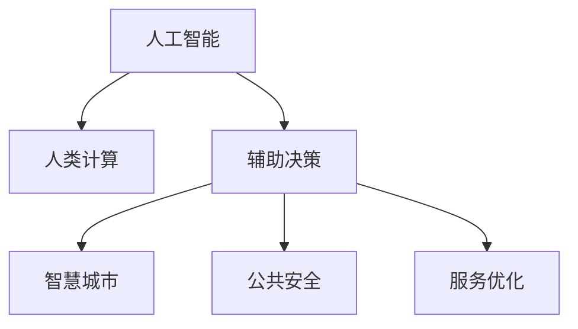

                 

# AI驱动的创新：人类计算在政府中的应用场景

> 关键词：人工智能,政府管理,人类计算,AI辅助决策,公共安全,智慧城市

## 1. 背景介绍

### 1.1 问题由来
在当今数字化时代，政府部门面临着前所未有的挑战：公共服务需求的快速增长、公共资源的合理分配、公共安全的有效维护、社会事务的高效管理等。如何借助最新的技术手段，提升政府治理水平和公共服务效率，是各级政府部门亟需解决的重大课题。

人工智能(AI)技术的崛起，为这一问题提供了全新的解决方案。AI能够通过分析海量数据，发现隐藏在数据背后的规律和趋势，辅助决策者制定更加科学合理的政策。特别是在人类计算(Human Computation)技术的加持下，AI不仅能提供更精准的预测和决策支持，还能实现自动化、智能化、高效化的办公模式，极大地提升政府工作的质量和效率。

### 1.2 问题核心关键点
人类计算是指利用人类在认知和决策方面的优势，与AI机器算力相结合，共同解决问题的新兴技术范式。在大数据、云计算、物联网、AI等技术的支撑下，人类计算的应用场景不断拓宽，为政府管理带来了巨大的变革潜力。

1. **数据处理与分析**：通过利用人类计算，政府部门可以高效处理海量数据，发现并提炼出有价值的信息和知识。
2. **辅助决策**：AI结合人类计算，可以在大规模数据和复杂环境中提供多角度、多层次、多维度的决策支持。
3. **提升服务质量**：人类计算可以辅助优化政府服务流程，提升服务效率和质量，实现个性化、精准化服务。
4. **加强安全防范**：通过AI与人类计算的结合，可以实现对复杂环境和场景的安全监控、风险预警和应急响应。
5. **推动社会治理**：人类计算可以辅助政府进行智慧城市建设，推动社会治理的智能化、精准化、精细化。

## 2. 核心概念与联系

### 2.1 核心概念概述

为更好地理解人类计算在政府中的应用，本节将介绍几个关键概念：

- **人工智能**：利用计算机模拟人类智能行为，实现机器学习、推理、规划等智能任务。
- **人类计算**：利用人类的认知、判断、经验等优势，辅助AI机器算力，解决复杂问题。
- **辅助决策**：通过AI和人类计算结合，为政府决策提供科学依据和优化建议。
- **智慧城市**：利用大数据、云计算、物联网、AI等技术，构建智能、高效、可持续的城市管理模式。
- **公共安全**：通过AI和人类计算的结合，实现对公共环境的动态监测、预警和响应。
- **服务优化**：通过AI和人类计算结合，实现政府服务的流程优化、效率提升和体验改善。

这些概念之间通过以下Mermaid流程图来展示：



这个流程图展示了人工智能和人类计算之间的内在联系，以及各自在政府管理中的应用场景。

## 3. 核心算法原理 & 具体操作步骤
### 3.1 算法原理概述

人类计算与AI结合，共同应用于政府管理的过程，通常包括以下几个关键步骤：

1. **数据采集与清洗**：利用传感器、互联网、社交媒体等渠道，采集政府管理所需的海量数据。对数据进行去重、清洗、预处理，确保数据的质量和完整性。
2. **数据建模与分析**：构建机器学习模型，对数据进行特征提取、训练和预测。通过AI和人类计算的结合，发现数据背后的模式和规律。
3. **辅助决策与优化**：将分析结果反馈给决策者，辅助其进行多角度、多层次、多维度的决策。利用人类计算的优势，优化政府服务流程，提升服务效率和质量。
4. **安全监控与预警**：利用AI和人类计算，实现对公共环境的安全监控、风险预警和应急响应。通过数据驱动，提高公共安全的预防能力和响应速度。
5. **智慧城市建设**：结合AI和人类计算，推动智慧城市建设，实现城市管理、服务、交通、环境等各方面的智能化和精准化。

### 3.2 算法步骤详解

以下详细描述人类计算在政府管理中应用的各个步骤：

**Step 1: 数据采集与清洗**
- 利用传感器、互联网、社交媒体等渠道，采集各类数据。
- 对数据进行预处理，如去重、去噪、填补缺失值等。
- 进行数据标注，确保数据的质量和一致性。

**Step 2: 数据建模与分析**
- 选择合适的算法，如回归分析、聚类分析、时序分析等，对数据进行建模和分析。
- 利用机器学习技术，对数据进行特征提取、训练和预测。
- 结合人类计算，对AI的预测结果进行验证和优化，确保预测的准确性和合理性。

**Step 3: 辅助决策与优化**
- 将分析结果汇总，形成决策支持报告。
- 利用人类计算，进行多角度、多层次、多维度的决策分析。
- 优化政府服务流程，提升服务效率和质量。

**Step 4: 安全监控与预警**
- 利用AI和人类计算，实现对公共环境的动态监测、预警和响应。
- 结合数据驱动，提高公共安全的预防能力和响应速度。

**Step 5: 智慧城市建设**
- 结合AI和人类计算，推动智慧城市建设，实现城市管理、服务、交通、环境等各方面的智能化和精准化。

### 3.3 算法优缺点

人类计算与AI结合，共同应用于政府管理的方法具有以下优点：

1. **高效性**：AI和人类计算的结合，可以在较短时间内处理海量数据，发现其中的规律和趋势。
2. **准确性**：结合人类计算的优势，AI的预测和决策结果更加准确和可靠。
3. **灵活性**：人类计算和AI的结合，可以灵活应对各种复杂场景和问题，适应性强。
4. **可解释性**：人类计算的优势在于能够提供决策过程的逻辑和依据，增强AI的透明性和可解释性。
5. **辅助决策**：人类计算和AI的结合，可以辅助决策者进行多角度、多层次、多维度的决策，提升决策质量。

同时，这种结合方法也存在一定的局限性：

1. **技术门槛高**：AI和人类计算的结合，需要一定的技术背景和专业知识，对技术人才的需求较高。
2. **数据质量要求高**：数据的采集、清洗和标注需要高质量的流程和工具，否则会影响分析结果的准确性。
3. **资源投入大**：AI和人类计算的结合，需要大量的硬件设备和软件工具，投入成本较高。
4. **隐私和安全问题**：数据的采集、存储和分析需要严格遵守隐私和安全法规，否则可能带来法律风险。
5. **道德和伦理问题**：AI和人类计算的结合，需要考虑道德和伦理问题，确保决策的公正性和合理性。

## 4. 数学模型和公式 & 详细讲解 & 举例说明
### 4.1 数学模型构建

人类计算在政府管理中的应用，通常涉及以下几个数学模型：

- **回归模型**：用于分析变量之间的关系，预测未来趋势。
- **聚类模型**：用于将数据划分为不同的类别，发现数据中的分组规律。
- **时序模型**：用于分析时间序列数据，预测未来的变化趋势。
- **决策树模型**：用于进行多层次、多维度的决策分析。

这些模型通常通过机器学习算法实现，如线性回归、K-means聚类、ARIMA时序模型、决策树等。

### 4.2 公式推导过程

以线性回归模型为例，假设我们有一组数据点 $(x_1, y_1), (x_2, y_2), \ldots, (x_n, y_n)$，其中 $x_i$ 为自变量，$y_i$ 为因变量。我们希望找到一条直线 $y=\beta_0+\beta_1x+\epsilon_i$ 来拟合这些数据点。

根据最小二乘法，我们可以最小化残差平方和 $\sum_{i=1}^n (y_i - (\beta_0 + \beta_1 x_i))^2$，求解出最优的 $\beta_0$ 和 $\beta_1$。求解过程如下：

$$
\hat{\beta}_0 = \frac{\sum_{i=1}^n (y_i - \bar{y}) + \frac{\sum_{i=1}^n x_i^2 - \frac{\left(\sum_{i=1}^n x_i\right)^2}{n}}{2\sum_{i=1}^n x_i^2 - \frac{\left(\sum_{i=1}^n x_i\right)^2}{n}}
$$

$$
\hat{\beta}_1 = \frac{\sum_{i=1}^n x_i(y_i - \bar{y})}{2\sum_{i=1}^n x_i^2 - \frac{\left(\sum_{i=1}^n x_i\right)^2}{n}}
$$

其中 $\bar{y} = \frac{1}{n}\sum_{i=1}^n y_i$。

### 4.3 案例分析与讲解

假设某市政府希望预测下一年度的城市空气质量，通过采集过去几年的空气质量数据，利用线性回归模型进行建模分析。

**Step 1: 数据采集与清洗**
- 利用传感器采集城市空气质量数据，包括PM2.5、SO2、NOx等指标。
- 对数据进行去重、去噪、填补缺失值等预处理操作。
- 对数据进行标注，确保数据的质量和一致性。

**Step 2: 数据建模与分析**
- 选择合适的线性回归模型，对数据进行建模和分析。
- 利用机器学习技术，对数据进行特征提取、训练和预测。
- 结合人类计算，对AI的预测结果进行验证和优化，确保预测的准确性和合理性。

**Step 3: 辅助决策与优化**
- 将分析结果汇总，形成决策支持报告。
- 利用人类计算，进行多角度、多层次、多维度的决策分析。
- 优化政府服务流程，提升服务效率和质量。

**Step 4: 安全监控与预警**
- 利用AI和人类计算，实现对公共环境的动态监测、预警和响应。
- 结合数据驱动，提高公共安全的预防能力和响应速度。

**Step 5: 智慧城市建设**
- 结合AI和人类计算，推动智慧城市建设，实现城市管理、服务、交通、环境等各方面的智能化和精准化。

## 5. 项目实践：代码实例和详细解释说明
### 5.1 开发环境搭建

在进行人类计算与AI结合的应用开发前，我们需要准备好开发环境。以下是使用Python进行机器学习开发的环境配置流程：

1. 安装Anaconda：从官网下载并安装Anaconda，用于创建独立的Python环境。

2. 创建并激活虚拟环境：
```bash
conda create -n ml-env python=3.8 
conda activate ml-env
```

3. 安装必要的库：
```bash
pip install pandas numpy scikit-learn seaborn matplotlib
```

4. 安装机器学习框架：
```bash
pip install tensorflow keras
```

5. 安装必要的Python包：
```bash
pip install requests beautifulsoup4
```

完成上述步骤后，即可在`ml-env`环境中开始项目开发。

### 5.2 源代码详细实现

下面以线性回归模型为例，给出Python代码实现。

```python
import numpy as np
from sklearn.linear_model import LinearRegression
import pandas as pd

# 加载数据
data = pd.read_csv('air_quality_data.csv')

# 数据预处理
X = data[['temperature', 'humidity', 'wind_speed', 'CO2_concentration']]
y = data['PM2.5']

# 数据标准化
scaler = StandardScaler()
X_scaled = scaler.fit_transform(X)

# 训练模型
model = LinearRegression()
model.fit(X_scaled, y)

# 预测结果
y_pred = model.predict(X_scaled)

# 输出结果
print('预测结果：', y_pred)
```

### 5.3 代码解读与分析

让我们再详细解读一下关键代码的实现细节：

**数据加载与预处理**
- 使用`pandas`库加载数据集，并进行必要的预处理操作。

**模型训练**
- 使用`sklearn`库中的`LinearRegression`类，训练线性回归模型。
- 对数据进行标准化处理，以提高模型的收敛速度和精度。

**预测结果**
- 使用训练好的模型，对新数据进行预测。
- 输出预测结果，供后续分析和应用。

## 6. 实际应用场景
### 6.1 智慧城市建设

人类计算在智慧城市建设中的应用，可以显著提升城市管理水平和居民生活质量。通过利用AI和人类计算，可以实现以下功能：

- **智能交通**：通过实时采集和分析交通流量数据，优化交通信号灯，减少拥堵，提高通行效率。
- **智慧能源**：通过分析电力、燃气、供水等能源数据，优化能源分配，减少浪费，提高能源利用效率。
- **智能医疗**：通过分析居民健康数据，预测疾病流行趋势，提供个性化的医疗服务。
- **环境监测**：通过实时监测环境数据，预测环境变化趋势，提高环境保护水平。
- **安全监控**：通过视频监控、传感器数据等，实现对公共环境的动态监测、预警和响应。

### 6.2 公共安全

人类计算在公共安全中的应用，可以显著提升公共安全的预防和响应能力。通过利用AI和人类计算，可以实现以下功能：

- **风险预警**：通过分析各类数据，预测自然灾害、公共卫生事件等风险，提前预警，减少损失。
- **应急响应**：通过实时监测数据，快速响应突发事件，提高应急处置能力。
- **安全监控**：通过视频监控、传感器数据等，实现对公共环境的动态监测、预警和响应。

### 6.3 智慧医疗

人类计算在智慧医疗中的应用，可以显著提升医疗服务水平和医疗资源利用效率。通过利用AI和人类计算，可以实现以下功能：

- **疾病预测**：通过分析居民健康数据，预测疾病流行趋势，提供个性化的医疗服务。
- **医疗资源优化**：通过分析医院运营数据，优化医疗资源配置，提高医疗服务质量。
- **远程医疗**：通过视频、语音等技术，实现远程医疗咨询，提高医疗服务的覆盖范围。

### 6.4 未来应用展望

随着AI和人类计算技术的不断进步，未来在政府管理中的应用场景将更加广泛和深入。以下是几个可能的应用方向：

1. **智能公共服务**：通过AI和人类计算，实现对公共服务的自动化、智能化、高效化，提升服务质量和效率。
2. **智慧社会治理**：通过AI和人类计算，实现社会治理的智能化、精准化、精细化，提升社会治理能力。
3. **智慧环境监测**：通过AI和人类计算，实现对环境的动态监测、预警和响应，提升环境保护水平。
4. **智能政府决策**：通过AI和人类计算，实现政府决策的科学化、合理化、透明化，提升政府治理水平。
5. **智能城市运营**：通过AI和人类计算，实现城市运营的智能化、高效化、可持续化，提升城市管理水平。

## 7. 工具和资源推荐
### 7.1 学习资源推荐

为了帮助开发者系统掌握人类计算在政府中的应用技术，这里推荐一些优质的学习资源：

1. **《Python机器学习》**：由机器学习专家Sebastian Raschka和Vahid Mirjalili所著，全面介绍了机器学习算法及其在实际应用中的实现方法。
2. **《深度学习入门》**：由深度学习专家斋藤康毅所著，全面介绍了深度学习算法及其在实际应用中的实现方法。
3. **Kaggle竞赛平台**：提供丰富的机器学习竞赛资源，通过实际项目训练，提升实践能力。
4. **Coursera在线课程**：提供机器学习、深度学习、人工智能等领域的在线课程，系统学习相关知识。
5. **TensorFlow官方文档**：提供详细的机器学习框架API文档，帮助开发者进行模型实现和调参。

通过这些学习资源，相信你一定能够快速掌握人类计算在政府中的应用技术，并用于解决实际的政府管理问题。

### 7.2 开发工具推荐

高效的开发离不开优秀的工具支持。以下是几款用于人类计算与AI结合开发的常用工具：

1. **Jupyter Notebook**：免费的交互式编程环境，支持Python、R等多种语言，适合进行模型开发和数据分析。
2. **Kaggle平台**：提供丰富的数据集和竞赛资源，适合进行数据探索和模型训练。
3. **TensorBoard**：TensorFlow配套的可视化工具，可实时监测模型训练状态，提供丰富的图表呈现方式。
4. **Weights & Biases**：模型训练的实验跟踪工具，记录和可视化模型训练过程中的各项指标，方便对比和调优。
5. **Google Colab**：谷歌推出的在线Jupyter Notebook环境，免费提供GPU/TPU算力，适合进行高效计算和模型训练。

合理利用这些工具，可以显著提升人类计算与AI结合应用的开发效率，加快创新迭代的步伐。

### 7.3 相关论文推荐

人类计算与AI结合技术的发展源于学界的持续研究。以下是几篇奠基性的相关论文，推荐阅读：

1. **《Human Computer Interaction: Concepts and Paradigms》**：由Human Computer Interaction领域权威人士Jane Westwood所著，全面介绍了人类计算的基本概念和设计原则。
2. **《Human Computation in Government》**：介绍了人类计算在政府管理中的应用案例，探讨了其潜力和前景。
3. **《Augmented Cognition: Towards Cognitive Enhancement and Cognitive Assistance》**：探讨了增强认知辅助技术，如何利用AI和人类计算结合，提升决策能力。
4. **《Human-Centered Machine Learning》**：介绍了人类计算在机器学习中的应用，探讨了其对算法设计和应用的影响。
5. **《Crowdsourcing for Improved Decision-Making》**：介绍了众包技术在政府管理中的应用，探讨了其潜力和前景。

这些论文代表了大数据、云计算、AI等技术在政府管理中的应用方向，通过学习这些前沿成果，可以帮助研究者把握学科前进方向，激发更多的创新灵感。

## 8. 总结：未来发展趋势与挑战
### 8.1 总结

本文对人类计算与AI结合在政府管理中的应用进行了全面系统的介绍。首先阐述了人类计算和AI结合的研究背景和意义，明确了其在提升政府治理水平和公共服务效率方面的独特价值。其次，从原理到实践，详细讲解了人类计算与AI结合的数学模型和关键步骤，给出了具体的代码实例。同时，本文还广泛探讨了人类计算在智慧城市、公共安全、智慧医疗等多个领域的应用前景，展示了其在提升社会治理能力方面的巨大潜力。此外，本文精选了人类计算技术的各类学习资源，力求为读者提供全方位的技术指引。

通过本文的系统梳理，可以看到，人类计算与AI结合技术正在成为政府管理的重要范式，极大地拓展了AI技术的应用边界，催生了更多的落地场景。受益于大数据、云计算、AI等技术的持续演进，人类计算与AI结合必将在更广泛的领域得到应用，为政府管理带来深远的变革。

### 8.2 未来发展趋势

展望未来，人类计算与AI结合技术将呈现以下几个发展趋势：

1. **技术融合深入**：AI和人类计算的结合将更加深入和全面，实现从数据采集、分析到决策的全程智能化。
2. **数据驱动决策**：通过大数据分析，政府决策将更加科学化和合理化，提升决策质量和效率。
3. **智慧城市建设**：通过AI和人类计算的结合，推动智慧城市建设，实现城市管理、服务、交通、环境等各方面的智能化和精准化。
4. **智能社会治理**：通过AI和人类计算的结合，实现社会治理的智能化、精准化、精细化，提升社会治理能力。
5. **智能公共服务**：通过AI和人类计算的结合，实现公共服务的自动化、智能化、高效化，提升服务质量和效率。

以上趋势凸显了人类计算与AI结合技术的广阔前景。这些方向的探索发展，必将进一步提升政府管理的智能化和精准化水平，为政府服务和社会治理带来深远的影响。

### 8.3 面临的挑战

尽管人类计算与AI结合技术已经取得了瞩目成就，但在迈向更加智能化、普适化应用的过程中，它仍面临着诸多挑战：

1. **技术门槛高**：AI和人类计算的结合，需要一定的技术背景和专业知识，对技术人才的需求较高。
2. **数据质量要求高**：数据的采集、清洗和标注需要高质量的流程和工具，否则会影响分析结果的准确性。
3. **资源投入大**：AI和人类计算的结合，需要大量的硬件设备和软件工具，投入成本较高。
4. **隐私和安全问题**：数据的采集、存储和分析需要严格遵守隐私和安全法规，否则可能带来法律风险。
5. **道德和伦理问题**：AI和人类计算的结合，需要考虑道德和伦理问题，确保决策的公正性和合理性。

## 8.4 研究展望

面对人类计算与AI结合所面临的挑战，未来的研究需要在以下几个方面寻求新的突破：

1. **数据质量提升**：提高数据采集、清洗和标注的自动化水平，确保数据的高质量和高可靠性。
2. **模型优化与融合**：开发更加高效、通用的AI和人类计算结合模型，提升模型性能和泛化能力。
3. **智能决策系统**：研究智能决策系统的设计方法，实现从数据采集、分析到决策的全程智能化。
4. **隐私保护技术**：研究隐私保护技术，确保数据的隐私和安全，防止数据滥用和泄露。
5. **伦理和道德问题**：研究伦理和道德问题，确保AI和人类计算结合系统的公正性和合理性。

通过这些研究方向的探索，相信人类计算与AI结合技术将进一步成熟，为政府管理和社会治理带来更加全面和深入的变革，为人类社会的持续发展和进步贡献力量。

## 9. 附录：常见问题与解答

**Q1：人类计算与AI结合是否适用于所有政府管理任务？**

A: 人类计算与AI结合在大多数政府管理任务上都能取得不错的效果，特别是对于数据量较小的任务。但对于一些特定领域的任务，如军事、外交等，AI和人类计算的结合可能面临更多的复杂性和挑战。

**Q2：如何进行有效的数据采集与清洗？**

A: 数据采集与清洗是人类计算与AI结合的基础，以下是一些关键步骤：
1. 确定数据采集方式：通过传感器、互联网、社交媒体等渠道，采集各类数据。
2. 进行数据预处理：对数据进行去重、去噪、填补缺失值等预处理操作。
3. 数据标注：对数据进行标注，确保数据的质量和一致性。

**Q3：如何进行高效的数据建模与分析？**

A: 数据建模与分析是AI和人类计算结合的核心，以下是一些关键步骤：
1. 选择合适的算法：根据任务类型，选择回归分析、聚类分析、时序分析等算法。
2. 利用机器学习技术，对数据进行特征提取、训练和预测。
3. 结合人类计算，对AI的预测结果进行验证和优化，确保预测的准确性和合理性。

**Q4：如何进行智能决策与优化？**

A: 智能决策与优化是AI和人类计算结合的目标，以下是一些关键步骤：
1. 将分析结果汇总，形成决策支持报告。
2. 利用人类计算，进行多角度、多层次、多维度的决策分析。
3. 优化政府服务流程，提升服务效率和质量。

**Q5：如何进行智能安全监控与预警？**

A: 智能安全监控与预警是AI和人类计算结合的重要应用场景，以下是一些关键步骤：
1. 利用AI和人类计算，实现对公共环境的动态监测、预警和响应。
2. 结合数据驱动，提高公共安全的预防能力和响应速度。

**Q6：如何进行智慧城市建设？**

A: 智慧城市建设是AI和人类计算结合的重要应用场景，以下是一些关键步骤：
1. 结合AI和人类计算，推动智慧城市建设，实现城市管理、服务、交通、环境等各方面的智能化和精准化。
2. 利用AI和人类计算，实现对城市数据的动态监测、预警和响应。
3. 优化城市资源配置，提升城市管理水平。

总之，人类计算与AI结合技术的应用，需要结合具体任务和场景，灵活运用算法和技术，进行全面优化和调整。通过不断探索和实践，相信未来在政府管理中的应用将更加广泛和深入。

---

作者：禅与计算机程序设计艺术 / Zen and the Art of Computer Programming

