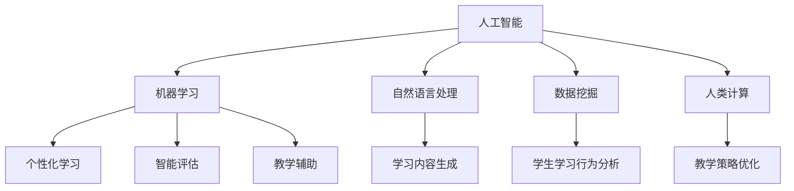

                 

# AI驱动的创新：人类计算在教育中的作用

## 1. 背景介绍

### 1.1 问题由来

随着人工智能（AI）技术的快速发展，其在教育领域的应用已经展现出广阔的前景。AI可以提供个性化的学习体验，帮助教师更高效地管理课堂，同时提供辅助决策支持，使得教育更加智能、精准和可扩展。然而，AI教育技术的发展也面临一系列挑战，如数据隐私保护、模型可解释性、教育伦理等。如何利用AI技术，实现教育资源的高效配置和个性化的教育，已经成为教育技术发展的重要方向。

### 1.2 问题核心关键点

本主题探讨的核心问题是如何利用AI技术，通过“人类计算”（Human-Centric Computing）的方式，促进教育的创新和发展。人类计算是指以人为中心的设计理念，旨在通过智能算法和决策支持系统，帮助教师和学生实现更好的教学和学习效果。人类计算在教育中的作用主要体现在以下几个方面：

1. **个性化学习**：通过数据分析和机器学习，为每个学生量身定制个性化的学习路径和资源。
2. **教学辅助**：利用AI辅助教学，提高教师的教学效率和课堂管理能力。
3. **学习分析**：实时监控学生的学习行为和表现，提供即时反馈和改进建议。
4. **智能评估**：自动评估学生的学习成果，减轻教师的工作负担。

### 1.3 问题研究意义

研究AI在教育中的作用，对于推动教育技术的创新和应用，具有重要意义：

1. **提高教育效率**：通过智能化的教学工具，提升课堂效率，节省教师和学生的时间。
2. **促进教育公平**：利用AI提供个性化学习，帮助弱势群体获得更好的教育资源。
3. **推动教育创新**：通过数据分析和机器学习，发现新的教学方法和学习模式，推动教育理念的创新。
4. **提升教育质量**：实时监控和评估学生的学习表现，及时调整教学策略，提升整体教学质量。
5. **适应未来教育需求**：随着技术的发展，AI在教育中的应用将越来越广泛，成为未来教育的重要组成部分。

## 2. 核心概念与联系

### 2.1 核心概念概述

为更好地理解AI在教育中的作用，本节将介绍几个密切相关的核心概念：

- **人工智能**：一种通过算法、规则和数据模拟人类智能的技术。在教育领域，人工智能可以用于个性化学习、智能评估、教学辅助等多个方面。
- **机器学习**：一种基于数据的算法，通过不断学习来提高性能。在教育领域，机器学习可以用于学生的学习行为预测、个性化学习路径规划等。
- **自然语言处理**：一种使计算机理解、处理和生成自然语言的技术。在教育领域，自然语言处理可以用于智能评估、学习内容生成等。
- **数据挖掘**：从大规模数据中提取有用信息和知识的技术。在教育领域，数据挖掘可以用于学生学习行为的分析、教学策略的优化等。
- **人类计算**：一种以人为中心的设计理念，旨在通过智能算法和决策支持系统，提高教育的质量和效率。

这些核心概念之间的逻辑关系可以通过以下Mermaid流程图来展示：



这个流程图展示了几大核心概念及其之间的关系：

1. 人工智能通过机器学习和自然语言处理技术，支持个性化学习、智能评估和教学辅助。
2. 数据挖掘从学生学习行为中提取有用信息，支持人类计算中的教学策略优化。
3. 人类计算作为中心理念，整合了人工智能和数据挖掘的成果，提升教育的整体质量。

## 3. 核心算法原理 & 具体操作步骤
### 3.1 算法原理概述

AI在教育中的应用，主要依赖于机器学习和数据挖掘算法。以机器学习为例，其核心思想是通过数据分析和模型训练，从学生历史数据中学习规律，预测其学习行为和结果。算法原理和具体操作步骤如下：

### 3.2 算法步骤详解

AI在教育中的应用，一般包括以下几个关键步骤：

**Step 1: 数据收集与预处理**
- 收集学生的基本信息、学习行为数据、测试成绩等。
- 对数据进行清洗、去重、归一化等预处理，确保数据的质量和可用性。

**Step 2: 特征工程**
- 根据教育任务的特点，选择合适的特征，如学生的学习时间、考试成绩、兴趣爱好等。
- 应用特征选择和降维技术，提取有用的特征，减少计算量和模型复杂度。

**Step 3: 模型训练与优化**
- 选择合适的机器学习模型，如线性回归、决策树、随机森林、神经网络等。
- 利用历史数据进行模型训练，不断调整模型参数，提高模型的泛化能力和预测精度。
- 采用交叉验证、正则化等技术，防止过拟合，提高模型的鲁棒性。

**Step 4: 模型应用与评估**
- 将训练好的模型应用于新的学生数据，进行预测和评估。
- 根据评估结果，调整教学策略，提升教育效果。

**Step 5: 持续学习与优化**
- 定期收集学生新的学习数据，不断训练和优化模型，保持其时效性和准确性。

### 3.3 算法优缺点

AI在教育中的应用，具有以下优点：
1. **提高个性化教育**：通过数据分析和机器学习，实现个性化学习路径的规划和推荐。
2. **提升教学效率**：利用智能评估和教学辅助工具，减轻教师的工作负担，提高课堂效率。
3. **实时监控与反馈**：通过学习分析系统，实时监控学生学习行为，提供即时反馈和改进建议。
4. **减轻教师负担**：自动评估和批改作业，减轻教师的批改工作量。

同时，AI在教育中也存在一些局限性：
1. **数据隐私和安全**：学生数据涉及个人隐私，如何保护数据安全是一个重要问题。
2. **模型可解释性**：AI模型的决策过程难以解释，教师和学生难以理解其逻辑。
3. **教育伦理**：AI在教育中的应用可能带来偏见和歧视，需注意伦理问题。
4. **技术门槛高**：AI技术的应用需要一定的技术支持和资源投入。

尽管存在这些局限性，AI在教育中的应用前景依然广阔。通过不断优化和改进，AI有望在教育领域发挥更大的作用。

### 3.4 算法应用领域

AI在教育中的应用，涵盖了从基础教育到高等教育的各个阶段。具体应用领域包括：

- **基础教育**：智能评估、个性化学习、教学辅助、学习内容生成等。
- **高等教育**：学习行为分析、课程推荐、学术研究支持等。
- **职业培训**：技能评估、职业路径规划、学习效果评估等。

## 4. 数学模型和公式 & 详细讲解 & 举例说明

### 4.1 数学模型构建

本节将使用数学语言对AI在教育中的应用进行更加严格的刻画。

设学生的基本信息为 $X$，学习行为数据为 $Y$，历史考试成绩为 $Z$。AI模型 $M$ 的目标是建立一个预测函数 $f(X, Y, Z)$，用于预测学生的学习成果。

假设模型 $M$ 为一个线性回归模型，其表达式为：

$$
f(X, Y, Z) = \beta_0 + \beta_1X_1 + \beta_2X_2 + \cdots + \beta_nX_n
$$

其中，$\beta_i$ 为模型参数，$X_i$ 为输入特征。

模型的目标是最小化预测误差 $\epsilon$，即：

$$
\min_{\beta} \sum_{i=1}^n (\epsilon_i)^2
$$

其中，$\epsilon_i = f(X_i, Y_i, Z_i) - Y_i$。

### 4.2 公式推导过程

以下我们以线性回归模型为例，推导其训练和优化过程。

假设模型 $M$ 在输入 $X$ 上的预测为 $\hat{Y}=M(X)$。定义模型 $M$ 在数据样本 $(x,y)$ 上的损失函数为 $\ell(M(x),y)$，则在数据集 $D$ 上的经验风险为：

$$
\mathcal{L}(\theta) = \frac{1}{N} \sum_{i=1}^N \ell(M(x_i),y_i)
$$

以均方误差为例，损失函数为：

$$
\ell(M(x),y) = \frac{1}{2}(y-M(x))^2
$$

将损失函数对参数 $\theta$ 求导，得：

$$
\frac{\partial \mathcal{L}(\theta)}{\partial \theta} = \frac{1}{N} \sum_{i=1}^N \frac{\partial \ell(M(x_i),y_i)}{\partial \theta}
$$

其中，$\frac{\partial \ell(M(x_i),y_i)}{\partial \theta} = (M(x_i)-y_i)(M'(x_i))$。

在得到损失函数的梯度后，即可带入梯度下降等优化算法，更新模型参数，完成模型的训练和优化。

### 4.3 案例分析与讲解

以学生学习行为预测为例，假设收集了学生的学习时间 $X_1$、考试成绩 $X_2$ 和兴趣爱好 $X_3$，将这些数据输入线性回归模型 $M$，预测学生未来的考试成绩 $Y$。

首先，对数据进行标准化处理，将 $X_1, X_2, X_3$ 转化为标准正态分布的变量 $Z_1, Z_2, Z_3$。

然后，建立线性回归模型 $M$，训练模型参数 $\beta$，使其最小化预测误差。

最后，将新的学生数据 $Z_1', Z_2', Z_3'$ 输入模型 $M$，预测其学习成果 $Y'$。

## 5. 项目实践：代码实例和详细解释说明

### 5.1 开发环境搭建

在进行AI教育应用开发前，我们需要准备好开发环境。以下是使用Python进行Scikit-learn开发的环境配置流程：

1. 安装Anaconda：从官网下载并安装Anaconda，用于创建独立的Python环境。

2. 创建并激活虚拟环境：
```bash
conda create -n ai-env python=3.8 
conda activate ai-env
```

3. 安装Scikit-learn：
```bash
pip install scikit-learn
```

4. 安装各类工具包：
```bash
pip install pandas numpy scikit-learn matplotlib seaborn
```

完成上述步骤后，即可在`ai-env`环境中开始AI教育应用开发的实践。

### 5.2 源代码详细实现

下面以学生学习行为预测为例，给出使用Scikit-learn库进行线性回归模型训练和优化的PyTorch代码实现。

首先，定义数据处理函数：

```python
import pandas as pd
from sklearn.preprocessing import StandardScaler
from sklearn.linear_model import LinearRegression
from sklearn.model_selection import train_test_split

def preprocess_data(dataset):
    # 加载数据集
    df = pd.read_csv(dataset)
    # 标准化处理
    scaler = StandardScaler()
    X = scaler.fit_transform(df[['X1', 'X2', 'X3']])
    y = df['Y']
    return X, y

# 加载数据集
X, y = preprocess_data('student_data.csv')
```

然后，定义模型和训练函数：

```python
from sklearn.linear_model import LinearRegression
from sklearn.metrics import mean_squared_error

# 定义线性回归模型
model = LinearRegression()

# 划分训练集和测试集
X_train, X_test, y_train, y_test = train_test_split(X, y, test_size=0.2, random_state=42)

# 训练模型
model.fit(X_train, y_train)

# 评估模型
mse = mean_squared_error(y_test, model.predict(X_test))
print(f"测试集均方误差: {mse:.3f}")
```

最后，运行训练和评估代码，得到模型训练结果和评估指标：

```python
# 训练模型
model.fit(X_train, y_train)

# 评估模型
mse = mean_squared_error(y_test, model.predict(X_test))
print(f"测试集均方误差: {mse:.3f}")
```

以上就是使用Scikit-learn库进行学生学习行为预测的完整代码实现。可以看到，Scikit-learn库的强大封装使得模型训练过程变得简洁高效。

### 5.3 代码解读与分析

让我们再详细解读一下关键代码的实现细节：

**preprocess_data函数**：
- `load_data`方法：加载数据集。
- `StandardScaler`：对数据进行标准化处理，将特征变量转化为标准正态分布的变量。

**LinearRegression模型**：
- 定义线性回归模型，用于预测学生未来的学习成果。

**train_test_split方法**：
- 将数据集划分为训练集和测试集，设置测试集占总数据的20%。

**fit方法**：
- 使用训练数据集拟合模型，计算模型的参数。

**predict方法**：
- 使用训练好的模型对新的学生数据进行预测，返回预测结果。

**mean_squared_error函数**：
- 计算测试集均方误差，评估模型的预测精度。

**训练流程**：
- 先训练模型，再使用测试集评估模型的预测误差。

可以看到，Scikit-learn库提供了丰富的机器学习算法和工具，使得模型的开发和应用变得简洁高效。

当然，工业级的系统实现还需考虑更多因素，如模型的保存和部署、超参数的自动搜索、模型的可解释性等。但核心的机器学习算法基本与此类似。

## 6. 实际应用场景

### 6.1 智能评估系统

智能评估系统是AI在教育中应用最广泛的场景之一。传统的评估方法依赖于教师的主观评分，难以保证评分标准的一致性和公平性。通过智能评估系统，可以有效减少教师的工作负担，提升评估的客观性和公正性。

在技术实现上，可以收集学生的作业、测试、考试等数据，利用机器学习算法对学生的学习表现进行量化评估。智能评估系统可以自动批改作业，提供即时反馈，帮助学生及时了解自己的学习状况，进行改进。

### 6.2 个性化学习平台

个性化学习平台旨在为每个学生量身定制个性化的学习路径和资源。传统的教育模式往往采用“一刀切”的教学方式，难以满足学生的个性化需求。通过AI技术，可以分析学生的学习行为和特点，推荐适合的学习资源，提供个性化的学习路径。

在技术实现上，可以收集学生在学习平台上的浏览记录、点击次数、学习时长等数据，利用机器学习算法对学生的学习行为进行分析和预测，推荐合适的学习资源和路径。个性化学习平台可以自动调整学习内容和难度，提升学习效果。

### 6.3 智能推荐系统

智能推荐系统是AI在教育中应用的另一重要场景。传统的推荐系统依赖于学生的历史行为数据，难以发现新的学习兴趣和需求。通过智能推荐系统，可以更好地利用学生的非结构化数据，发现新的学习兴趣和需求，提升学习效果。

在技术实现上，可以收集学生在学习平台上的浏览记录、评论、反馈等数据，利用机器学习算法对学生的学习行为进行分析和预测，推荐合适的学习资源和路径。智能推荐系统可以自动调整学习内容和难度，提升学习效果。

### 6.4 未来应用展望

随着AI技术的不断发展，其在教育领域的应用将越来越广泛。未来，AI在教育中的应用将呈现以下几个趋势：

1. **更加个性化的学习**：通过深度学习和数据挖掘技术，实现更加个性化的学习体验，提升学生的学习效果。
2. **更加智能化的评估**：利用自然语言处理和机器学习技术，实现更加智能化的评估方法，提升评估的客观性和公正性。
3. **更加灵活的教学辅助**：通过智能推荐系统和个性化学习平台，实现更加灵活的教学辅助，提升教学效果。
4. **更加全面的学习分析**：利用数据挖掘技术，实现更加全面的学习行为分析，为教师提供科学的教学决策支持。
5. **更加智能化的课程设计**：通过机器学习技术，实现更加智能化的课程设计，提升课程的有效性和趣味性。

AI在教育中的应用，将带来更加智能化、个性化和高效的学习体验，提升教育质量，促进教育公平，推动教育创新。

## 7. 工具和资源推荐
### 7.1 学习资源推荐

为了帮助开发者系统掌握AI在教育中的应用，这里推荐一些优质的学习资源：

1. **《深度学习》课程**：斯坦福大学开设的深度学习经典课程，涵盖深度学习的理论基础和实践技术，是入门深度学习的必备资源。
2. **Scikit-learn官方文档**：Scikit-learn库的官方文档，提供了丰富的机器学习算法和工具，是进行AI教育应用开发的必备资源。
3. **Coursera AI教育应用课程**：Coursera平台上开设的AI教育应用课程，涵盖机器学习、自然语言处理、数据挖掘等多个方面，适合全面了解AI在教育中的应用。
4. **Kaggle数据集**：Kaggle平台上收集的教育数据集，适合进行机器学习算法的实践和优化。
5. **edX教育技术课程**：edX平台上开设的教育技术课程，涵盖AI在教育中的应用、评估、学习平台等多个方面，适合系统学习教育技术。

通过对这些资源的学习实践，相信你一定能够快速掌握AI在教育中的应用，并用于解决实际的AI教育问题。

### 7.2 开发工具推荐

高效的开发离不开优秀的工具支持。以下是几款用于AI教育应用开发的常用工具：

1. **PyTorch**：基于Python的开源深度学习框架，灵活的计算图，适合快速迭代研究。大部分机器学习模型都有PyTorch版本的实现。
2. **TensorFlow**：由Google主导开发的开源深度学习框架，生产部署方便，适合大规模工程应用。同样有丰富的机器学习模型资源。
3. **Scikit-learn**：Python机器学习库，提供了丰富的机器学习算法和工具，适合进行机器学习算法的实践和优化。
4. **Jupyter Notebook**：开源的交互式编程环境，支持Python、R等语言，适合进行数据处理和算法验证。
5. **Kaggle**：数据科学竞赛平台，提供了丰富的数据集和社区资源，适合进行机器学习算法的实践和优化。

合理利用这些工具，可以显著提升AI教育应用开发的效率，加快创新迭代的步伐。

### 7.3 相关论文推荐

AI在教育中的应用源于学界的持续研究。以下是几篇奠基性的相关论文，推荐阅读：

1. **《AI in Education: A Review and Future Directions》**：综述了AI在教育中的应用，展望了未来的发展方向。
2. **《Deep Learning in Education: A Survey》**：介绍了深度学习在教育中的应用，包括个性化学习、智能评估等多个方面。
3. **《Intelligent Tutoring Systems: A Survey》**：综述了智能辅导系统的研究进展，介绍了其应用和效果。
4. **《Machine Learning and Data Mining for Personalized Education》**：介绍了机器学习和数据挖掘在个性化教育中的应用，包括学生学习行为的预测和分析。
5. **《AI-Powered Assessment in Education》**：介绍了AI在智能评估中的应用，包括作业批改、学习效果评估等多个方面。

这些论文代表了大语言模型微调技术的发展脉络。通过学习这些前沿成果，可以帮助研究者把握学科前进方向，激发更多的创新灵感。

## 8. 总结：未来发展趋势与挑战

### 8.1 总结

本文对AI在教育中的应用进行了全面系统的介绍。首先阐述了AI在教育中的作用和意义，明确了智能评估、个性化学习、智能推荐等重要应用场景。其次，从原理到实践，详细讲解了机器学习在教育中的应用，给出了学生学习行为预测的完整代码实现。同时，本文还广泛探讨了AI在教育中的应用前景，展示了其广阔的前景。

通过本文的系统梳理，可以看到，AI在教育中的应用前景广阔，具有提高教育效率、促进教育公平、推动教育创新等重要作用。未来，伴随AI技术的持续发展，其在教育领域的应用将越来越广泛，成为推动教育变革的重要力量。

### 8.2 未来发展趋势

展望未来，AI在教育中的应用将呈现以下几个趋势：

1. **更加智能化的评估**：利用自然语言处理和机器学习技术，实现更加智能化的评估方法，提升评估的客观性和公正性。
2. **更加个性化的学习**：通过深度学习和数据挖掘技术，实现更加个性化的学习体验，提升学生的学习效果。
3. **更加灵活的教学辅助**：通过智能推荐系统和个性化学习平台，实现更加灵活的教学辅助，提升教学效果。
4. **更加全面的学习分析**：利用数据挖掘技术，实现更加全面的学习行为分析，为教师提供科学的教学决策支持。
5. **更加智能化的课程设计**：通过机器学习技术，实现更加智能化的课程设计，提升课程的有效性和趣味性。

以上趋势凸显了AI在教育中的广阔前景。这些方向的探索发展，必将进一步提升教育系统的质量，推动教育公平，促进教育创新。

### 8.3 面临的挑战

尽管AI在教育中的应用前景广阔，但在迈向更加智能化、普适化应用的过程中，仍面临诸多挑战：

1. **数据隐私和安全**：学生数据涉及个人隐私，如何保护数据安全是一个重要问题。
2. **模型可解释性**：AI模型的决策过程难以解释，教师和学生难以理解其逻辑。
3. **教育伦理**：AI在教育中的应用可能带来偏见和歧视，需注意伦理问题。
4. **技术门槛高**：AI技术的应用需要一定的技术支持和资源投入。
5. **个性化需求多样**：学生的个性化需求多样，如何设计灵活的AI教育应用，满足不同学生的需求，仍是一个挑战。

尽管存在这些挑战，AI在教育中的应用前景依然广阔。通过不断优化和改进，AI有望在教育领域发挥更大的作用。

### 8.4 研究展望

面对AI在教育中的应用面临的挑战，未来的研究需要在以下几个方面寻求新的突破：

1. **探索无监督和半监督学习算法**：摆脱对大规模标注数据的依赖，利用自监督学习、主动学习等无监督和半监督范式，最大限度利用非结构化数据，实现更加灵活高效的AI教育应用。
2. **研究参数高效和计算高效的算法**：开发更加参数高效和计算高效的算法，在固定大部分预训练参数的情况下，只更新极少量的任务相关参数，减小计算资源消耗。
3. **引入更多先验知识**：将符号化的先验知识，如知识图谱、逻辑规则等，与神经网络模型进行巧妙融合，引导AI教育应用学习更准确、合理的知识。
4. **结合因果分析和博弈论工具**：将因果分析方法引入AI教育应用，识别出模型决策的关键特征，增强输出解释的因果性和逻辑性。
5. **纳入伦理道德约束**：在模型训练目标中引入伦理导向的评估指标，过滤和惩罚有偏见、有害的输出倾向，确保AI教育应用的公平性和安全性。

这些研究方向的探索，必将引领AI在教育中的应用走向更加智能化、普适化和可解释的方向，为构建安全、可靠、可控的智能教育系统铺平道路。

## 9. 附录：常见问题与解答

**Q1：AI在教育中的应用是否需要大规模数据支持？**

A: AI在教育中的应用，确实需要一定规模的数据支持。特别是对于深度学习模型，需要大量的标注数据来训练模型，以获取较好的性能。然而，通过数据增强、迁移学习等技术，可以在一定程度上缓解数据不足的问题，提高AI教育应用的效果。

**Q2：AI在教育中的应用是否会带来新的问题？**

A: AI在教育中的应用，确实可能带来一些新的问题。如数据隐私和安全问题、模型可解释性问题、教育伦理问题等。需要多方合作，共同解决这些问题，确保AI教育应用的公平性和安全性。

**Q3：AI在教育中的应用是否会对教师和学生带来负担？**

A: 初期AI教育应用的部署和维护确实需要一定的时间和资源投入。然而，随着技术的不断进步和应用推广，AI教育应用将逐渐成熟，其对教师和学生的负担将逐渐减轻，带来更加智能化、高效的学习体验。

**Q4：AI在教育中的应用是否会影响学生的学习效果？**

A: 研究表明，适当的AI辅助教育可以提升学生的学习效果，特别是在个性化学习、智能评估等方面。然而，AI教育应用的设计和应用，仍需要不断优化，以确保其对学生的学习效果产生积极影响。

**Q5：AI在教育中的应用是否会替代传统教育？**

A: AI在教育中的应用，是为了辅助传统教育，提升教育质量和效率。AI技术无法完全替代传统教育，但可以弥补其不足，促进教育的创新和发展。

通过本文的系统梳理，可以看到，AI在教育中的应用前景广阔，具有提高教育效率、促进教育公平、推动教育创新等重要作用。未来，伴随AI技术的持续发展，其在教育领域的应用将越来越广泛，成为推动教育变革的重要力量。

