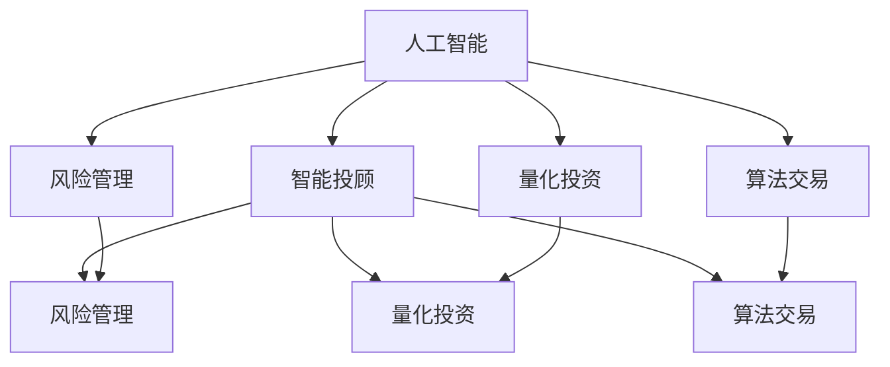

                 

# AI驱动的创新：人类计算在金融行业的价值创造

> 关键词：AI, 人类计算, 金融行业, 价值创造, 智能投顾, 风险管理, 量化投资, 算法交易

## 1. 背景介绍

### 1.1 问题由来

金融行业长期以来高度依赖人类智慧与经验，通过人工分析财务数据、行业动态和市场情绪，做出决策。然而，随着大数据、人工智能（AI）技术的发展，传统的金融决策模式开始面临挑战。AI技术的融入不仅提升了决策的效率与精度，还带来了全新的商业模式和竞争格局。人类计算与AI技术的结合，正在为金融行业的价值创造开辟新的道路。

### 1.2 问题核心关键点

人工智能，特别是机器学习、深度学习和强化学习技术，正在金融行业得到广泛应用。基于这些技术的算法可以在高复杂度和高维度的数据中找出规律，实现自动化的决策和交易，极大地提高了金融服务的效率和准确性。然而，AI在金融行业的价值创造并不局限于此。人类计算与AI技术的结合，通过深度协作，能够在风险管理、智能投顾、量化投资、算法交易等多个领域创造出前所未有的价值。

## 2. 核心概念与联系

### 2.1 核心概念概述

- **人工智能（AI）**：指模拟、延伸和扩展人的智能的技术，涵盖机器学习、深度学习、自然语言处理、计算机视觉等多个子领域。
- **人类计算**：指人类在专业领域内，通过逻辑思维和经验积累，对问题进行深度分析并做出决策的过程。
- **金融行业**：包括银行、保险、证券、投资、理财等多个子行业，以提供金融产品和服务为核心业务。
- **价值创造**：指通过技术创新、业务模式优化、效率提升等方式，为公司、客户和社会带来经济利益的过程。
- **智能投顾（Robo-Advisor）**：基于AI技术的智能投资顾问，通过算法和数据分析提供个性化的投资建议。
- **风险管理**：识别、评估和管理金融风险的过程，包括信用风险、市场风险、操作风险等。
- **量化投资**：利用数学模型和统计分析方法进行投资决策，以量化分析和算法交易为核心。
- **算法交易**：通过计算机程序自动进行交易决策，以追求高频交易、套利等策略。

这些核心概念之间的逻辑关系可以通过以下Mermaid流程图来展示：



这个流程图展示了大语言模型的核心概念及其之间的关系：

1. 人工智能技术通过深度学习、强化学习等方法，从海量数据中提取模式，实现自动化决策和交易。
2. 智能投顾基于AI技术，提供个性化的投资建议，降低投资门槛，提高投资效率。
3. 量化投资和算法交易则通过AI技术进行高效的数据分析，实现高频交易和套利等策略。
4. 风险管理与智能投顾、量化投资、算法交易紧密相连，通过AI技术进行风险评估和控制。

## 3. 核心算法原理 & 具体操作步骤
### 3.1 算法原理概述

基于AI技术的金融创新主要通过以下几类算法实现：

1. **监督学习**：通过标注数据训练模型，预测新数据。
2. **无监督学习**：在没有标注数据的情况下，通过数据的内在关联学习模式。
3. **强化学习**：通过试错，不断优化决策策略，达到最优状态。
4. **生成模型**：通过概率模型生成新数据，可用于数据补全和生成对抗网络（GAN）。
5. **自适应算法**：根据环境变化自动调整模型参数，如在线学习、梯度下降等。

这些算法在大数据和复杂金融问题的处理中展现出了巨大优势，帮助金融机构实现自动化决策、精准风险管理、个性化服务等。

### 3.2 算法步骤详解

基于AI技术的金融创新一般包括以下几个关键步骤：

**Step 1: 数据准备**
- 收集海量历史交易数据、财务报表、市场新闻等数据。
- 清洗、去重、标准化处理，构建标注数据集。

**Step 2: 算法选择**
- 根据具体任务选择合适的AI算法，如决策树、神经网络、集成学习等。
- 进行算法调参，选择最优模型和参数。

**Step 3: 模型训练**
- 使用历史数据训练AI模型。
- 利用验证集评估模型性能，调整参数。
- 在测试集上验证模型泛化能力。

**Step 4: 部署应用**
- 将训练好的模型集成到交易系统中，实时计算和决策。
- 持续监测模型性能，定期更新模型参数。

**Step 5: 反馈优化**
- 根据实时交易结果和用户反馈，不断优化AI模型。
- 引入新的数据，更新模型参数，提升模型精度。

### 3.3 算法优缺点

基于AI技术的金融创新有以下优点：

1. **效率提升**：AI算法能够处理海量数据，快速做出决策，提高交易和风险管理的效率。
2. **精度提高**：AI算法可以挖掘出数据的内在关联，提升预测和决策的准确性。
3. **成本降低**：AI算法自动化执行交易和决策，减少人力成本。
4. **灵活性增强**：AI算法可以根据环境变化自动调整策略，适应复杂多变的市场情况。

然而，这些算法也存在一些缺点：

1. **复杂性增加**：AI算法模型复杂，需要大量数据和计算资源，难以解释和调试。
2. **风险集中**：过度依赖AI算法可能忽视人类经验，带来潜在的风险。
3. **数据隐私问题**：大量数据收集和处理可能涉及用户隐私保护问题。
4. **技术门槛高**：需要专业的AI工程师和技术团队，投入较高。
5. **模型偏见**：AI算法可能继承数据中的偏见，导致决策不公。

## 4. 数学模型和公式 & 详细讲解 & 举例说明

### 4.1 数学模型构建

假设金融市场的风险可以用随机变量 $X$ 描述，其概率分布为 $P(X)$。在金融风险管理中，常用的数学模型包括：

- **均值方差模型**：假设资产价格服从正态分布，计算期望收益和波动率。
- **CAPM模型**：基于资本资产定价模型，计算股票的期望收益率和风险溢价。
- **Black-Scholes模型**：用于计算欧式期权的价格，假设股票价格服从几何布朗运动。

### 4.2 公式推导过程

以均值方差模型为例，假设资产 $X$ 的价格服从正态分布 $N(\mu, \sigma^2)$，其中 $\mu$ 为期望收益，$\sigma$ 为波动率。风险 $R$ 可以用方差 $\sigma^2$ 描述，期望收益 $E[X]$ 为 $\mu$。风险与期望收益的组合可以用马科威茨（Markowitz）的有效前沿来描述，通过最大化期望收益并约束风险，得到最优投资组合。

**公式推导**：
$$
R(X) = \sigma^2 \\
E[X] = \mu
$$

根据马科威茨有效前沿的推导，最优投资组合可以通过最大化下式得到：
$$
E[R] = E[E[X] - \mu] = E[X] - \mu = \mu - \mu = 0
$$

**案例分析**：
在股票投资组合管理中，假设我们有三只股票 $A$、$B$、$C$，其期望收益和波动率分别为 $\mu_A = 0.08, \sigma_A = 0.2$，$\mu_B = 0.06, \sigma_B = 0.1$，$\mu_C = 0.02, \sigma_C = 0.08$。我们希望构建一个最优投资组合，使其期望收益最大且风险最小。

通过求解该优化问题，可以得出最优投资组合中各资产的比例。假设 $w_A$、$w_B$、$w_C$ 分别为股票 $A$、$B$、$C$ 在组合中的权重，则：
$$
w_A = \frac{1}{\sigma^2} \begin{bmatrix} \mu_A & \mu_B & \mu_C \\ \sigma_A & \sigma_B & \sigma_C \end{bmatrix} \begin{bmatrix} \sigma_A^{-1} \\ \sigma_B^{-1} \\ \sigma_C^{-1} \end{bmatrix} = \frac{1}{0.02} \begin{bmatrix} 0.2 & 0.1 & 0.08 \\ 0.08 & 0.1 & 0.02 \end{bmatrix} \begin{bmatrix} 0.2 \\ 0.1 \\ 0.08 \end{bmatrix} = \begin{bmatrix} 0.25 \\ 0.25 \\ 0.5 \end{bmatrix}
$$

因此，最优投资组合中股票 $A$ 和 $C$ 的权重较大，股票 $B$ 的权重较小。

### 4.3 案例分析与讲解

以量化投资为例，假设我们有一只股票 $X$ 的价格变化可以用随机变量 $Y$ 描述，$Y \sim N(0, \sigma^2)$。我们的目标是通过策略 $S$，使得在时间 $T$ 内的期望收益最大化。设 $S_t$ 为时间 $t$ 的策略，$\Delta X_t$ 为时间 $t$ 到 $t+1$ 的股票价格变化。则目标函数可以表示为：
$$
E\left[\sum_{t=0}^{T-1} S_t \Delta X_t\right] = E\left[\int_{0}^{T} S_t dX_t\right]
$$

最优策略可以通过求解下列贝尔曼方程得到：
$$
v(s) = \max_{a} [u(s,a) + \beta E\left[v(s',a')\right]]
$$

其中 $v(s)$ 为时间 $t$ 的期望收益，$u(s,a)$ 为时间 $t$ 的即时收益，$s$ 为状态，$a$ 为行动，$\beta$ 为贴现率，$s'$ 和 $a'$ 分别为下一个状态和行动。

## 5. 项目实践：代码实例和详细解释说明
### 5.1 开发环境搭建

在进行金融领域的AI项目实践前，我们需要准备好开发环境。以下是使用Python进行TensorFlow开发的环境配置流程：

1. 安装Anaconda：从官网下载并安装Anaconda，用于创建独立的Python环境。

2. 创建并激活虚拟环境：
```bash
conda create -n tf-env python=3.7 
conda activate tf-env
```

3. 安装TensorFlow：根据CUDA版本，从官网获取对应的安装命令。例如：
```bash
conda install tensorflow=2.7-cu116-cudnn8-20230227
```

4. 安装相关工具包：
```bash
pip install pandas numpy scikit-learn matplotlib tqdm jupyter notebook ipython
```

完成上述步骤后，即可在`tf-env`环境中开始AI实践。

### 5.2 源代码详细实现

我们以量化投资为例，使用TensorFlow和Keras实现基于神经网络的量化交易策略。

首先，定义神经网络的模型结构：

```python
import tensorflow as tf
from tensorflow import keras

model = keras.Sequential([
    keras.layers.Dense(64, activation='relu', input_shape=(3,)),
    keras.layers.Dense(64, activation='relu'),
    keras.layers.Dense(1, activation='sigmoid')
])

model.compile(optimizer='adam', loss='binary_crossentropy', metrics=['accuracy'])
```

然后，加载并预处理训练数据：

```python
data = tf.keras.datasets.boston_housing.load_data()
x_train = data[0][0]  # 特征数据
y_train = data[1]     # 目标数据

x_train = x_train.reshape((len(x_train), 3))  # 将数据重新整理成合适格式
x_train = x_train / 10.0                   # 归一化数据
```

接着，训练模型并进行预测：

```python
model.fit(x_train, y_train, epochs=50, batch_size=32)

x_test = data[0][1]  # 测试数据
x_test = x_test.reshape((len(x_test), 3))  # 将数据重新整理成合适格式
x_test = x_test / 10.0                      # 归一化数据

predictions = model.predict(x_test)
```

最后，评估模型效果：

```python
test_loss, test_accuracy = model.evaluate(x_test, y_test)
print(f"Test loss: {test_loss:.4f}")
print(f"Test accuracy: {test_accuracy:.4f}")
```

以上就是使用TensorFlow实现量化投资策略的完整代码实现。可以看到，通过神经网络模型，我们可以在有限的历史交易数据上进行学习，并预测未来的市场变化。

### 5.3 代码解读与分析

让我们再详细解读一下关键代码的实现细节：

**Sequential模型定义**：
- `Sequential` 是Keras中的模型序列化器，用来构建序列化的神经网络模型。
- 通过 `Dense` 层定义了三个全连接层，每个层有64个神经元，使用ReLU激活函数。
- 最后一层输出层有1个神经元，使用sigmoid激活函数，输出0-1之间的概率值，代表买入或卖出的决策。

**模型编译**：
- 使用 `adam` 优化器，`binary_crossentropy` 损失函数，以及 `accuracy` 评估指标。
- `adam` 优化器具有自适应学习率的特点，能够快速收敛。

**数据预处理**：
- 使用 `boston_housing` 数据集，其中包含波士顿房价的历史数据。
- 特征数据 $x$ 分为三列，即`CRIM`, `ZN`, `INDUS`。
- 将数据从二维数组转换成适合神经网络输入的格式，即 $(x_{1,0}, x_{1,1}, x_{1,2})$，$(x_{2,0}, x_{2,1}, x_{2,2})$，$\dots$，$(x_{n-1,0}, x_{n-1,1}, x_{n-1,2})$。
- 数据归一化处理，使得数据范围在0-1之间，避免数值过大或过小。

**模型训练**：
- 使用 `fit` 方法训练模型，设置训练轮数为50，批次大小为32。
- `fit` 方法返回训练过程中的损失和准确度指标。

**模型评估**：
- 使用 `evaluate` 方法评估模型在测试集上的性能。
- `evaluate` 方法返回模型在测试集上的损失和准确度。

**预测结果**：
- 使用 `predict` 方法对测试数据进行预测，返回概率值。

可以看到，TensorFlow和Keras的结合，大大简化了神经网络的构建和训练过程，使得金融领域的AI实践更加高效。开发者可以利用丰富的深度学习库，快速实现各种AI算法和模型。

## 6. 实际应用场景
### 6.1 智能投顾系统

基于AI技术的智能投顾系统，可以为投资者提供个性化的投资建议，降低投资门槛，提高投资效率。智能投顾系统通过收集用户的历史交易数据、风险偏好等信息，构建用户画像，并利用AI算法进行策略优化和风险控制。

在技术实现上，智能投顾系统可以采用多模型集成的方法，综合多种策略的结果，提供更稳健的投资建议。同时，智能投顾系统还可以通过不断学习用户行为和市场数据，动态调整策略，实现个性化服务。

### 6.2 风险管理系统

金融风险管理是金融行业的重要任务之一。传统的人工分析方法效率低下，难以应对复杂多变的市场情况。基于AI技术的风险管理系统，可以自动化地进行风险评估和控制。

具体而言，风险管理系统可以采用以下技术：

1. **数据收集与清洗**：收集历史交易数据、市场数据、新闻等，清洗、去重、标准化处理。
2. **风险评估**：通过深度学习算法，如卷积神经网络（CNN）、长短期记忆网络（LSTM）等，评估金融产品的风险。
3. **风险控制**：利用强化学习算法，动态调整投资组合，控制风险敞口。
4. **风险预警**：根据风险评估结果，设置预警阈值，及时提示管理人员进行干预。

### 6.3 量化投资系统

量化投资系统通过深度学习算法，从历史交易数据中挖掘规律，生成交易策略。量化投资系统通常包含以下模块：

1. **数据收集与预处理**：收集历史交易数据、财务报表、新闻等，进行清洗和归一化处理。
2. **特征提取**：通过深度学习算法，提取数据中的关键特征，如技术指标、市场情绪等。
3. **策略设计**：设计量化交易策略，如均值-方差策略、动量策略、套利策略等。
4. **模型训练与测试**：在历史数据上训练模型，评估模型性能，调整策略参数。
5. **回测与优化**：通过历史回测验证策略效果，进行策略优化。
6. **实时交易**：根据策略进行实时交易，生成交易信号。

### 6.4 未来应用展望

随着AI技术的不断进步，基于AI技术的金融创新将拓展到更多领域，带来更高的价值创造。

1. **智能投顾与客户体验**：智能投顾系统可以结合自然语言处理技术，通过聊天机器人进行客户互动，提升客户体验。同时，智能投顾系统可以整合多渠道数据，提供全方位服务。
2. **量化投资与高频交易**：量化投资系统可以采用更复杂的深度学习算法，实现高频交易策略。同时，量化投资系统可以通过多模态数据融合，提升策略效果。
3. **算法交易与智能合约**：算法交易系统可以结合智能合约技术，实现自动执行和清算。同时，算法交易系统可以采用分布式计算，提升交易效率。
4. **风险管理与智能监控**：风险管理系统可以结合AI技术，实时监测市场动态，及时预警风险。同时，风险管理系统可以整合外部数据源，提供更全面的风险评估。

未来，金融行业将在AI技术的推动下，实现智能化、自动化、个性化服务，提升金融服务的质量和效率。

## 7. 工具和资源推荐
### 7.1 学习资源推荐

为了帮助开发者系统掌握AI技术在金融行业的应用，这里推荐一些优质的学习资源：

1. **《深度学习》书籍**：Ian Goodfellow等著，系统介绍了深度学习的基本概念和算法。
2. **Coursera金融工程课程**：由纽约大学、哥伦比亚大学等名校开设，涵盖量化投资、风险管理等主题。
3. **Kaggle量化投资竞赛**：通过参加量化投资竞赛，实践金融领域的AI技术。
4. **AlphaVantage API**：提供股票、货币、加密货币等金融数据，支持Python接口。
5. **PyTorch金融库**：提供金融领域的深度学习框架和工具。

通过对这些资源的学习实践，相信你一定能够快速掌握AI技术在金融行业的应用，并用于解决实际的金融问题。
###  7.2 开发工具推荐

高效的开发离不开优秀的工具支持。以下是几款用于AI技术在金融领域开发的常用工具：

1. **TensorFlow**：由Google主导开发的深度学习框架，支持分布式计算和GPU加速。
2. **PyTorch**：Facebook开发的深度学习框架，支持动态计算图和自动微分。
3. **Keras**：Google开发的高级神经网络API，简单易用，适合快速原型开发。
4. **Jupyter Notebook**：Python开发常用的交互式开发环境，支持代码编辑和结果展示。
5. **Matplotlib**：Python绘图库，支持绘制各类图表。

合理利用这些工具，可以显著提升AI技术在金融领域的开发效率，加快创新迭代的步伐。

### 7.3 相关论文推荐

金融领域的AI技术研究始于上世纪80年代，以下是几篇奠基性的相关论文，推荐阅读：

1. **《Artificial Intelligence in Finance》**：Auerbach、Murnighan等著，总结了AI在金融领域的应用，涵盖量化投资、风险管理等主题。
2. **《Machine Learning in Finance》**：Mullainathan、Raghuwanshi等著，介绍了机器学习在金融领域的应用，如信用评分、算法交易等。
3. **《High-Frequency Trading with Machine Learning》**：Cremers、Kacperczyk等著，总结了机器学习在高频交易中的应用，涵盖策略设计、回测等主题。
4. **《Intelligent Investing with AI》**：Khan、Shamsuzzaman等著，介绍了AI在智能投顾中的应用，涵盖用户画像、个性化服务等。

这些论文代表了大语言模型微调技术的发展脉络。通过学习这些前沿成果，可以帮助研究者把握学科前进方向，激发更多的创新灵感。

## 8. 总结：未来发展趋势与挑战

### 8.1 总结

本文对基于AI技术的金融创新进行了全面系统的介绍。首先阐述了AI技术在金融行业的发展背景和重要意义，明确了AI技术在智能投顾、风险管理、量化投资等多个领域的实际应用。其次，从原理到实践，详细讲解了金融创新的数学模型和算法步骤，给出了完整的金融AI项目代码实现。同时，本文还广泛探讨了AI技术在金融行业的未来应用场景，展示了AI技术的广阔前景。

通过本文的系统梳理，可以看到，基于AI技术的金融创新正在引领金融行业进入智能化、自动化、个性化服务的新时代，为金融服务的质量和效率带来了革命性变化。未来，金融行业将在AI技术的推动下，实现智能化、自动化、个性化服务，提升金融服务的质量和效率。

### 8.2 未来发展趋势

展望未来，AI技术在金融行业的价值创造将呈现以下几个发展趋势：

1. **智能化提升**：AI技术将进一步深入金融行业的各个环节，实现自动化决策、精准风险管理、个性化服务等。
2. **多模态融合**：金融数据将从单一的数值型数据，拓展到多模态数据，如文本、图像、语音等，提升模型的预测精度和泛化能力。
3. **跨领域应用**：AI技术将从单一的金融领域，拓展到医疗、教育、保险等多个领域，实现跨领域协同创新。
4. **技术创新**：深度学习、强化学习、生成对抗网络（GAN）等技术将不断涌现，推动金融领域的AI创新。
5. **数据融合**：AI技术将从单一数据源，拓展到多数据源融合，提升模型的稳定性和鲁棒性。
6. **模型优化**：AI模型将从单一模型，拓展到多模型融合、模型自适应，提升模型的精度和泛化能力。

以上趋势凸显了AI技术在金融行业的广阔前景。这些方向的探索发展，必将进一步提升金融服务的质量和效率，为金融行业带来新的发展机遇。

### 8.3 面临的挑战

尽管AI技术在金融行业的价值创造取得了显著进展，但在迈向更加智能化、普适化应用的过程中，仍面临诸多挑战：

1. **数据隐私保护**：大量数据收集和处理可能涉及用户隐私保护问题，需要在技术和管理层面加强保护。
2. **模型偏见与公平性**：AI模型可能继承数据中的偏见，导致决策不公。需要建立模型公平性评估和干预机制。
3. **技术门槛高**：需要专业的AI工程师和技术团队，投入较高。需要进一步降低技术门槛，普及AI技术。
4. **模型稳定性**：AI模型在复杂多变的环境下可能出现波动，需要不断优化模型和策略，提高稳定性。
5. **伦理道德问题**：AI技术可能带来新的伦理道德问题，如算法透明性、数据隐私等。需要建立伦理道德约束机制。

### 8.4 研究展望

未来，金融领域的AI研究需要在以下几个方面寻求新的突破：

1. **AI与金融领域的深度融合**：将AI技术与金融领域深度融合，提升金融服务的质量和效率。
2. **多模型融合与优化**：将多种AI模型进行融合，提升模型的精度和泛化能力。
3. **跨领域协同创新**：实现跨领域协同创新，提升AI技术的普适性和应用范围。
4. **技术与管理相结合**：将技术与管理相结合，提升AI技术在金融行业的应用效果。
5. **伦理与公平性研究**：加强AI技术的伦理与公平性研究，确保技术的普适性和公平性。

这些研究方向的探索，必将引领AI技术在金融行业迈向更高的台阶，为构建安全、可靠、可解释、可控的智能系统铺平道路。面向未来，金融领域的AI研究还需要与其他人工智能技术进行更深入的融合，如知识表示、因果推理、强化学习等，多路径协同发力，共同推动金融行业的智能化、自动化、个性化服务。只有勇于创新、敢于突破，才能不断拓展金融AI的边界，让智能技术更好地造福金融行业。

## 9. 附录：常见问题与解答

**Q1：AI技术在金融行业是否存在道德和伦理问题？**

A: AI技术在金融行业的应用确实存在道德和伦理问题。例如，AI模型可能继承数据中的偏见，导致决策不公。此外，AI技术的透明度和可解释性不足，可能带来算法不透明性问题。因此，需要在技术和管理层面加强伦理约束，确保AI技术的普适性和公平性。

**Q2：AI技术在金融行业的安全问题如何防范？**

A: AI技术在金融行业的应用，需要考虑数据安全和算法安全问题。例如，AI模型可能受到恶意攻击，导致数据泄露或决策失误。因此，需要在技术和管理层面加强安全防护，如数据加密、模型检测等，确保系统的安全性和稳定性。

**Q3：AI技术在金融行业的应用如何确保数据隐私？**

A: 数据隐私保护是AI技术在金融行业应用的重要问题。需要采用加密技术、匿名化技术等方法，保护用户数据的隐私。同时，需要建立数据使用的合规机制，确保数据使用的透明性和合法性。

**Q4：AI技术在金融行业的应用如何确保算法的公平性？**

A: 算法的公平性是AI技术在金融行业应用的重要问题。需要建立公平性评估和干预机制，确保AI模型不会因数据偏见而歧视某些用户或群体。同时，需要在算法设计阶段引入公平性约束，提升模型的公平性。

**Q5：AI技术在金融行业的应用如何确保透明性？**

A: 算法的透明性是AI技术在金融行业应用的重要问题。需要建立算法透明性评估和披露机制，确保用户了解AI模型的决策逻辑和依据。同时，需要在算法设计阶段引入透明性约束，提升模型的可解释性和可理解性。

---

作者：禅与计算机程序设计艺术 / Zen and the Art of Computer Programming

