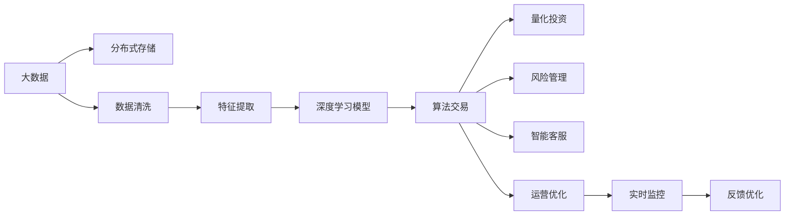

                 

# AI驱动的创新：人类计算在金融行业的潜力释放

> 关键词：AI, 金融, 人类计算, 深度学习, 大数据, 算法交易, 量化投资

## 1. 背景介绍

### 1.1 问题由来

金融行业长期以来依赖于人类分析师的经验和直觉，通过人工筛选和分析海量市场数据，制定投资决策和风险控制策略。然而，这种传统的工作方式存在诸多不足：

- 效率低下：人类分析师难以处理海量实时数据，决策过程耗时较长。
- 主观偏见：人类分析师可能受到情绪、经验等因素的影响，产生偏差决策。
- 可解释性差：人工决策难以追踪和解释，难以构建透明、可控的系统。

为应对这些问题，金融行业亟需引入更为高效、客观、可解释的新型技术。AI技术，特别是基于深度学习和大数据处理的人机协同计算，提供了全新的解决方案。通过利用AI驱动的分析、决策和监控，金融行业能够大幅提升效率、降低风险、优化策略，从而释放巨大潜力。

### 1.2 问题核心关键点

人工智能在金融行业的潜在应用，主要体现在以下几个方面：

- **算法交易**：利用AI算法自动化执行交易策略，降低人为干预，提高交易效率。
- **量化投资**：通过AI模型进行大规模数据分析，挖掘历史数据中的规律和模式，辅助投资决策。
- **风险管理**：运用AI技术进行风险预测和监控，实时调整投资组合，防止损失。
- **客户服务**：通过AI驱动的智能客服、个性化推荐等，提升客户体验和满意度。
- **运营优化**：利用AI进行运营流程的自动化和智能化，提高运营效率和质量。

这些应用场景共同构成了金融行业利用AI技术的核心架构，旨在通过机器学习和深度学习技术，全面提升金融行业的智能化水平。

### 1.3 问题研究意义

人工智能在金融行业的深度应用，对于推动金融科技的进步和金融产业的转型，具有重要意义：

- **提升效率**：通过AI自动化和智能化操作，大幅降低人工操作成本和时间，提高工作效率。
- **增强决策质量**：利用AI模型进行数据分析和预测，提供客观、准确的决策支持，降低人为错误。
- **改善客户体验**：基于AI的个性化服务和智能客服，提升客户满意度和忠诚度。
- **创新产品与服务**：AI技术能够发掘新的业务模式和应用场景，创新金融产品和服务。
- **防范风险**：AI在风险预测和管理中的应用，有助于早期发现和应对潜在风险，保障金融稳定。

人工智能的引入，将金融行业带入了一个更为智能、高效、透明的新时代。通过这篇文章，我们将系统介绍基于AI的创新在金融行业的具体应用，包括关键技术和实现方法。

## 2. 核心概念与联系

### 2.1 核心概念概述

为更好地理解基于AI的金融创新，我们将介绍几个核心概念：

- **人工智能(AI)**：基于算法和数据的计算机系统，能够模拟和扩展人类的认知和决策能力。
- **深度学习(Deep Learning)**：一种基于神经网络的机器学习技术，能够自动学习复杂模式和规律。
- **大数据(大数据)**：指规模庞大、类型多样的数据集，通常需要采用分布式处理技术来分析。
- **算法交易(Algorithmic Trading)**：利用计算机程序自动化执行交易策略，基于AI模型优化交易决策。
- **量化投资(Quantitative Investment)**：通过数学和统计模型进行投资分析，实现基于数据的量化决策。
- **风险管理(Risk Management)**：通过AI进行风险预测、量化和监控，制定风险控制策略。
- **智能客服(Intelligent Customer Service)**：利用自然语言处理和机器学习技术，实现智能对话和客户问题解答。
- **运营优化(Operational Optimization)**：通过AI自动化流程和数据分析，优化金融机构的运营效率和质量。

这些概念之间通过深度学习和大数据处理技术紧密相连，共同构成了基于AI的金融创新的技术架构。

### 2.2 核心概念原理和架构的 Mermaid 流程图



这个流程图展示了基于AI的金融创新中各核心概念之间的联系和交互。大数据首先被存储和管理，然后经过清洗和特征提取，进入深度学习模型的训练和推理阶段。深度学习模型在算法交易、量化投资、风险管理、智能客服和运营优化等多个应用中得到广泛应用，并不断通过实时监控和反馈优化，提升AI系统的性能和效果。

## 3. 核心算法原理 & 具体操作步骤

### 3.1 算法原理概述

基于AI的金融创新主要通过深度学习和大数据处理技术，构建智能化的分析、决策和监控系统。其核心思想是通过大量历史数据的训练，使AI模型学习到市场动态和投资规律，进而自动化执行交易策略、辅助投资决策、预测和监控风险。

形式化地，假设有一组历史交易数据 $\mathcal{D}=\{(x_i,y_i)\}_{i=1}^N$，其中 $x_i$ 为历史交易特征，$y_i$ 为交易结果。我们的目标是通过深度学习模型 $f$ 学习一个映射函数，将输入特征 $x$ 映射到输出结果 $y$：

$$
f(x) \approx y
$$

具体而言，我们通常使用多层感知机(MLP)或卷积神经网络(CNN)等深度学习模型，通过反向传播算法进行模型训练，最小化预测误差。一旦模型训练完成，我们就可以利用其进行实时预测和决策。

### 3.2 算法步骤详解

基于AI的金融创新算法步骤通常包括以下几个关键环节：

**Step 1: 数据准备与预处理**

- 收集历史交易数据和相关市场数据，进行清洗和预处理。
- 进行特征工程，提取和构造反映市场动态和交易特征的指标。
- 将数据集划分为训练集、验证集和测试集，便于模型训练和评估。

**Step 2: 模型构建与训练**

- 选择合适的深度学习模型，如MLP、CNN、RNN等，构建模型架构。
- 定义损失函数和优化器，如均方误差(MSE)、交叉熵(Cross Entropy)、AdamW等，进行模型训练。
- 通过反向传播算法和梯度下降等优化技术，最小化预测误差，优化模型参数。

**Step 3: 模型评估与优化**

- 在验证集上评估模型性能，计算准确率、精确率、召回率等指标。
- 根据评估结果调整模型参数，优化模型结构。
- 在测试集上进一步测试模型性能，确保模型泛化能力和鲁棒性。

**Step 4: 模型应用与监控**

- 将训练好的模型应用于实时交易和投资决策中，自动执行交易策略。
- 通过实时监控系统，及时发现和应对异常情况，调整模型参数和策略。
- 定期更新模型，重新训练和评估，确保模型性能和数据时效性。

### 3.3 算法优缺点

基于AI的金融创新算法具有以下优点：

- **高效自动化**：通过AI自动化执行交易和投资决策，降低人工干预，提高效率。
- **客观公正**：AI模型基于数据和规律，决策过程客观公正，避免人为偏见。
- **实时响应**：利用大数据和实时计算技术，AI系统能够快速响应市场变化，及时调整策略。
- **数据分析能力强**：AI模型能够处理大规模复杂数据，挖掘数据中的隐藏规律和模式。

同时，该算法也存在一些局限性：

- **数据质量依赖**：模型的性能高度依赖于数据的完整性和质量，数据清洗和预处理工作量大。
- **模型复杂度高**：深度学习模型通常参数众多，训练复杂度较高，对计算资源要求高。
- **解释性不足**：AI模型的决策过程难以解释，难以追踪和理解模型决策依据。
- **风险管理难度**：市场动态复杂多变，AI模型难以预测所有潜在的风险。
- **技术门槛高**：深度学习和大数据处理技术需要较高的专业技能，门槛较高。

尽管存在这些局限性，但AI驱动的金融创新已经成为行业发展的趋势，带来了显著的效率和效益提升。

### 3.4 算法应用领域

基于AI的金融创新技术已经广泛应用于多个领域，包括但不限于：

- **算法交易**：通过深度学习模型自动执行交易策略，降低交易成本，提升收益率。
- **量化投资**：利用AI模型分析市场数据，量化投资决策，优化资产配置。
- **风险管理**：使用AI模型预测市场风险，实时监控和调整投资组合，规避风险。
- **智能客服**：利用自然语言处理技术，实现智能客服系统，提升客户服务质量。
- **运营优化**：通过AI进行运营流程的自动化和智能化，提升运营效率和质量。

## 4. 数学模型和公式 & 详细讲解 & 举例说明

### 4.1 数学模型构建

假设有一组历史交易数据 $\mathcal{D}=\{(x_i,y_i)\}_{i=1}^N$，其中 $x_i \in \mathbb{R}^d$ 为交易特征向量，$y_i \in \mathbb{R}$ 为交易结果。我们的目标是构建一个深度学习模型 $f$，将输入特征 $x$ 映射到输出结果 $y$：

$$
f(x) \approx y
$$

常用的深度学习模型包括多层感知机(MLP)和卷积神经网络(CNN)。以MLP为例，其基本结构如下图所示：

```mermaid
graph LR
    A[输入层] --> B[隐藏层] --> C[输出层]
    B[0] --> |*| --> B[1]
    B[1] --> |*| --> B[2]
    B[2] --> |*| --> B[3]
    B[3] --> |*| --> B[4]
    B[4] --> |*| --> C[输出层]
    C[0] --> |*| --> C[1]
    C[1] --> |*| --> C[2]
    C[2] --> |*| --> C[3]
```

模型参数 $\theta$ 包括所有层的权重和偏置。模型的目标是最小化预测误差，即损失函数：

$$
\mathcal{L}(\theta) = \frac{1}{N} \sum_{i=1}^N (y_i - f(x_i))^2
$$

### 4.2 公式推导过程

我们以线性回归为例，推导基于深度学习模型的训练过程。假设模型为线性回归模型：

$$
f(x) = \theta^T x
$$

其中 $\theta \in \mathbb{R}^d$ 为模型参数，$x \in \mathbb{R}^d$ 为输入特征。目标是最小化均方误差损失函数：

$$
\mathcal{L}(\theta) = \frac{1}{N} \sum_{i=1}^N (y_i - f(x_i))^2
$$

对 $\theta$ 求导，得：

$$
\frac{\partial \mathcal{L}(\theta)}{\partial \theta} = \frac{2}{N} \sum_{i=1}^N (y_i - f(x_i))x_i
$$

利用梯度下降算法更新模型参数：

$$
\theta \leftarrow \theta - \eta \frac{\partial \mathcal{L}(\theta)}{\partial \theta}
$$

其中 $\eta$ 为学习率。通过不断迭代更新模型参数，最小化损失函数，训练完成后即可用于预测和决策。

### 4.3 案例分析与讲解

以量化投资为例，利用深度学习模型进行投资策略构建和回测。

假设我们收集了一组历史股票交易数据，包含股票价格、交易量、市场情绪等特征。通过特征工程和模型训练，构建一个预测股票未来价格变化的深度学习模型。模型训练完成后，利用回测数据进行策略评估和优化，验证模型的预测能力和风险控制能力。

具体步骤如下：

- **数据准备**：收集历史交易数据，进行清洗和预处理，提取特征。
- **模型训练**：使用随机梯度下降(SGD)算法，训练深度学习模型，优化参数。
- **策略评估**：在回测数据集上评估模型性能，计算收益率、风险指标等。
- **策略优化**：根据评估结果调整模型参数，优化策略。
- **策略应用**：在实际交易中应用优化后的策略，进行投资决策。

## 5. 项目实践：代码实例和详细解释说明

### 5.1 开发环境搭建

在进行AI驱动的金融创新实践前，我们需要准备好开发环境。以下是使用Python进行PyTorch和TensorFlow开发的环境配置流程：

1. 安装Anaconda：从官网下载并安装Anaconda，用于创建独立的Python环境。

2. 创建并激活虚拟环境：
```bash
conda create -n ai-env python=3.8 
conda activate ai-env
```

3. 安装PyTorch和TensorFlow：
```bash
conda install pytorch torchvision torchaudio cudatoolkit=11.1 -c pytorch -c conda-forge
conda install tensorflow -c conda-forge
```

4. 安装TensorBoard：
```bash
conda install tensorboard -c conda-forge
```

5. 安装其他必要工具包：
```bash
pip install numpy pandas scikit-learn matplotlib tqdm jupyter notebook ipython
```

完成上述步骤后，即可在`ai-env`环境中开始AI驱动的金融创新实践。

### 5.2 源代码详细实现

这里我们以算法交易为例，使用TensorFlow构建一个简单的深度学习模型，对股票价格进行预测。

首先，定义数据处理函数：

```python
import tensorflow as tf
import pandas as pd
import numpy as np

def load_data(filename, lookback=1):
    data = pd.read_csv(filename)
    data = data.dropna().reset_index(drop=True)
    data = data.drop(columns=['Date'])
    data = data.values.reshape(-1, 1)
    data = data[:,:lookback] - data[:-lookback]
    data = np.expand_dims(data, axis=1)
    return data
```

然后，定义深度学习模型：

```python
class Model(tf.keras.Model):
    def __init__(self, input_size, output_size):
        super(Model, self).__init__()
        self.dense1 = tf.keras.layers.Dense(64, activation='relu', input_shape=(input_size, output_size))
        self.dense2 = tf.keras.layers.Dense(64, activation='relu')
        self.dense3 = tf.keras.layers.Dense(output_size)
    
    def call(self, x):
        x = self.dense1(x)
        x = self.dense2(x)
        x = self.dense3(x)
        return x
```

接着，定义训练函数：

```python
def train_model(model, data, batch_size, epochs):
    data = data / 255.0
    data = np.reshape(data, (data.shape[0], 1, data.shape[1]))
    
    train_dataset = tf.data.Dataset.from_tensor_slices((data[:, :lookback], data[:, lookback:])).shuffle(1000).batch(batch_size)
    
    model.compile(optimizer=tf.keras.optimizers.Adam(), loss='mse', metrics=['mae'])
    
    history = model.fit(train_dataset, epochs=epochs, validation_split=0.2)
    
    return history
```

最后，启动训练流程：

```python
lookback = 20
epochs = 100
batch_size = 32

data = load_data('stock_prices.csv', lookback=lookback)

model = Model(input_size=lookback, output_size=1)
history = train_model(model, data, batch_size, epochs)
```

以上就是使用TensorFlow构建一个简单的深度学习模型的完整代码实现。可以看到，TensorFlow提供了丰富的API，使得模型构建和训练过程简洁高效。

### 5.3 代码解读与分析

让我们再详细解读一下关键代码的实现细节：

**load_data函数**：
- 从CSV文件中加载股票价格数据，并进行预处理。
- 去除缺失值，重置索引，删除日期列，转换为numpy数组。
- 对数据进行定长padding，构建输入输出序列。

**Model类**：
- 定义了多层感知机模型，包括两个隐藏层和一个输出层。
- 使用tf.keras.layers模块定义各层结构。
- 实现模型的前向传播过程。

**train_model函数**：
- 对数据进行预处理，将其转换为模型可用的张量。
- 使用tf.data.Dataset从序列中创建可迭代的数据集。
- 定义优化器、损失函数和评估指标。
- 使用fit方法进行模型训练，记录训练过程。

**训练流程**：
- 定义模型参数，包括lookback、epochs和batch_size。
- 加载数据，定义模型。
- 调用train_model函数进行模型训练，记录训练过程中的损失和误差指标。

可以看到，TensorFlow提供了高效的深度学习框架，使得模型构建和训练过程简单快捷。开发者可以灵活运用TensorFlow的API，构建适合具体需求的深度学习模型。

当然，工业级的系统实现还需考虑更多因素，如模型的保存和部署、超参数的自动搜索、更灵活的任务适配层等。但核心的模型构建和训练方法基本与此类似。

## 6. 实际应用场景

### 6.1 算法交易

基于深度学习模型的算法交易系统，可以在高频交易中显著提升交易效率和收益率。通过实时处理和分析市场数据，算法交易模型能够快速响应市场变化，执行预设的交易策略。

以股票交易为例，构建一个基于深度学习模型的算法交易系统，包括数据收集、特征工程、模型训练和策略回测等步骤。模型训练完成后，即可应用于实时交易，自动执行买卖操作。

### 6.2 量化投资

量化投资通过深度学习模型进行大规模数据分析，挖掘历史数据中的规律和模式，辅助投资决策。例如，构建一个基于深度学习模型的量化选股系统，对历史股票数据进行分析，预测未来股价变化，进行组合优化和投资决策。

具体实现步骤如下：

- **数据准备**：收集历史股票数据，进行清洗和预处理。
- **特征工程**：提取反映市场动态和公司基本面的特征。
- **模型训练**：使用深度学习模型对历史数据进行拟合，训练预测模型。
- **策略回测**：在历史数据集上评估模型性能，验证策略的有效性。
- **策略优化**：根据评估结果调整模型参数，优化投资策略。
- **策略应用**：在实际投资中应用优化后的策略，进行资产配置和交易。

### 6.3 风险管理

风险管理是金融行业的重要环节，通过深度学习模型进行风险预测和监控，可以提前发现和应对潜在风险，保障投资安全。例如，构建一个基于深度学习模型的风险预警系统，对市场波动和金融事件进行实时监控，预测市场风险，制定应对策略。

具体实现步骤如下：

- **数据准备**：收集历史市场数据和金融事件数据，进行清洗和预处理。
- **模型训练**：使用深度学习模型进行风险预测，训练预警模型。
- **实时监控**：通过实时计算和数据流处理，实时监控市场动态。
- **风险预警**：根据模型预测结果，及时发出风险预警，调整投资策略。

### 6.4 未来应用展望

随着深度学习和大数据技术的不断发展，基于AI的金融创新将带来更多创新应用，推动金融科技的进步和金融产业的转型。

- **智能客服**：利用自然语言处理技术，实现智能客服系统，提升客户服务质量。
- **个性化推荐**：通过深度学习模型，实现个性化金融产品推荐，提高客户满意度。
- **信用评估**：构建基于深度学习模型的信用评分系统，提升信用评估准确性和效率。
- **金融欺诈检测**：使用深度学习模型进行金融欺诈检测，保护金融安全。

此外，基于AI的金融创新还将在区块链、智能合约、数字货币等新兴领域得到广泛应用，为金融科技带来新的突破。相信随着技术的日益成熟，AI驱动的金融创新必将在更广阔的领域展现其巨大潜力，推动金融科技的全面升级。

## 7. 工具和资源推荐

### 7.1 学习资源推荐

为了帮助开发者系统掌握基于AI的金融创新的理论和实践，这里推荐一些优质的学习资源：

1. **《深度学习》书籍**：Ian Goodfellow等人所著的《深度学习》，全面介绍了深度学习的基础理论和应用。
2. **Coursera《深度学习》课程**：Andrew Ng在Coursera开设的深度学习课程，讲解深度学习的基本概念和经典模型。
3. **Kaggle金融数据集**：Kaggle提供的各类金融数据集，包括股票、基金、外汇等，可用于深度学习模型的训练和测试。
4. **TensorFlow官方文档**：TensorFlow官方文档，提供详细的API文档和示例代码，方便开发者学习和实践。
5. **PyTorch官方文档**：PyTorch官方文档，提供丰富的深度学习框架和模型实现，支持多种GPU和CPU平台。

通过对这些资源的学习实践，相信你一定能够快速掌握基于AI的金融创新的精髓，并用于解决实际的金融问题。

### 7.2 开发工具推荐

高效的开发离不开优秀的工具支持。以下是几款用于AI驱动的金融创新开发的常用工具：

1. **Jupyter Notebook**：一个开源的交互式计算环境，支持Python、R等语言，方便开发者进行实验和交流。
2. **TensorBoard**：TensorFlow配套的可视化工具，可实时监测模型训练状态，并提供丰富的图表呈现方式。
3. **PyCharm**：一款功能强大的Python IDE，支持Python开发和调试，集成众多深度学习框架和库。
4. **Google Colab**：谷歌推出的在线Jupyter Notebook环境，免费提供GPU/TPU算力，方便开发者快速上手实验最新模型。
5. **AWS SageMaker**：亚马逊提供的云端机器学习平台，支持深度学习模型训练、部署和监控。

合理利用这些工具，可以显著提升AI驱动的金融创新任务的开发效率，加快创新迭代的步伐。

### 7.3 相关论文推荐

基于AI的金融创新的研究始于学界的持续探索，以下是几篇奠基性的相关论文，推荐阅读：

1. **《金融市场中的深度学习》**：Jianbo Lian等人所著，探讨了深度学习在金融市场预测和投资中的应用。
2. **《基于深度学习的量化投资策略》**：Huang Qing等人所著，详细介绍了深度学习在量化投资中的方法。
3. **《金融风险管理中的深度学习》**：Xu Xiong等人所著，讨论了深度学习在金融风险预测和监控中的应用。
4. **《基于自然语言处理的金融智能客服》**：Wu Wei等人所著，研究了自然语言处理技术在智能客服中的应用。
5. **《基于深度学习的金融产品推荐》**：Zhang Zhi等人所著，探讨了深度学习在个性化金融产品推荐中的应用。

这些论文代表了大数据与深度学习在金融领域的研究进展，提供了丰富的理论和实践指导。

## 8. 总结：未来发展趋势与挑战

### 8.1 总结

本文对基于AI的金融创新进行了系统介绍。首先阐述了AI在金融行业的背景和意义，明确了AI驱动的金融创新的核心应用场景。其次，从原理到实践，详细讲解了深度学习模型在金融创新中的应用方法，给出了完整的代码实例。同时，本文还探讨了AI驱动的金融创新在实际应用中的多种场景，展示了其广泛的应用前景。

通过本文的系统梳理，可以看到，基于AI的金融创新正在全面改变金融行业的运营模式和决策方式。AI驱动的金融创新不仅提升了效率、降低了风险，还提供了更客观、公正的决策支持。未来，随着AI技术的不断进步，基于AI的金融创新将带来更多创新应用，推动金融科技的全面升级。

### 8.2 未来发展趋势

展望未来，基于AI的金融创新将呈现以下几个发展趋势：

1. **智能化升级**：AI技术将全面渗透到金融行业的各个环节，实现智能化升级。从客户服务到运营管理，再到风险控制，AI驱动的金融创新将提升整个行业的智能化水平。
2. **数据驱动决策**：基于大数据和深度学习模型的决策支持系统，将替代传统的人类决策模式，实现更加客观、公正的决策。
3. **自动化交易**：算法交易将更加广泛应用，大幅提升交易效率和收益率。AI驱动的算法交易系统将能够快速响应市场变化，执行最优交易策略。
4. **个性化服务**：通过深度学习模型进行个性化分析和推荐，实现更为精准的客户服务和产品推荐。
5. **跨界融合**：AI驱动的金融创新将与其他新兴技术进行更多交叉融合，如区块链、智能合约、数字货币等，形成更加全面、高效的金融科技生态系统。

以上趋势凸显了基于AI的金融创新的广阔前景，其应用领域将进一步拓展，带来更多的创新应用和商业价值。

### 8.3 面临的挑战

尽管基于AI的金融创新带来了诸多好处，但在其发展过程中仍面临诸多挑战：

1. **数据质量**：金融数据的复杂性和多样性，导致数据清洗和预处理工作量大，数据质量难以保证。
2. **模型复杂性**：深度学习模型的复杂度较高，训练和调参难度大，对计算资源要求高。
3. **鲁棒性问题**：金融市场波动性大，AI模型难以预测所有潜在风险。
4. **解释性不足**：深度学习模型的决策过程难以解释，难以追踪和理解模型决策依据。
5. **技术门槛高**：深度学习和大数据处理技术需要较高的专业技能，门槛较高。
6. **伦理和隐私问题**：金融数据的隐私保护和伦理道德问题需要重视。

这些挑战需要进一步研究解决，以推动基于AI的金融创新技术的成熟和应用。

### 8.4 研究展望

面对基于AI的金融创新面临的挑战，未来的研究需要在以下几个方面寻求新的突破：

1. **数据治理**：制定规范化的数据治理标准，确保数据质量和安全。
2. **模型简化**：开发更加参数高效和计算高效的深度学习模型，降低复杂度。
3. **鲁棒性提升**：引入对抗训练和鲁棒性增强技术，提高模型的鲁棒性和泛化能力。
4. **解释性增强**：发展可解释的深度学习模型，增强模型的透明度和可理解性。
5. **隐私保护**：研究隐私保护技术，确保数据隐私和伦理安全。
6. **跨领域应用**：探索跨领域的应用场景，推动AI技术在更多行业的落地应用。

这些研究方向的研究突破，将进一步推动基于AI的金融创新技术的成熟和应用，构建更为智能、高效的金融科技生态系统。

## 9. 附录：常见问题与解答

**Q1：基于AI的金融创新有哪些具体应用场景？**

A: 基于AI的金融创新在金融行业中的应用场景非常广泛，包括但不限于：

- **算法交易**：利用AI算法自动化执行交易策略，降低交易成本，提升收益率。
- **量化投资**：通过深度学习模型进行投资策略构建和回测，优化资产配置。
- **风险管理**：使用AI模型进行风险预测和监控，实时调整投资组合，规避风险。
- **智能客服**：利用自然语言处理技术，实现智能客服系统，提升客户服务质量。
- **运营优化**：通过AI自动化流程和数据分析，提升运营效率和质量。

**Q2：基于AI的金融创新需要哪些技术支持？**

A: 基于AI的金融创新需要以下关键技术支持：

- **深度学习**：通过神经网络模型，从海量数据中提取特征和规律。
- **大数据**：处理和分析大规模金融数据，提取有价值的信息。
- **自然语言处理**：处理和理解自然语言文本，实现智能客服和推荐系统。
- **分布式计算**：处理海量数据和高复杂度模型，提供高效的计算能力。
- **强化学习**：通过智能算法优化交易策略和投资决策。

这些技术共同构成了基于AI的金融创新的技术基础。

**Q3：AI驱动的金融创新在实际应用中需要注意哪些问题？**

A: 在实际应用中，基于AI的金融创新需要注意以下问题：

- **数据质量**：确保数据的完整性和准确性，进行数据清洗和预处理。
- **模型鲁棒性**：设计鲁棒性强的模型，应对市场波动和异常情况。
- **解释性不足**：增强模型的可解释性，提高透明度和可理解性。
- **隐私保护**：保护金融数据的隐私和伦理安全，遵循相关法律法规。
- **技术门槛**：提高技术门槛，确保从业人员具备专业技能和知识。

这些问题是基于AI的金融创新在实际应用中必须考虑的关键因素。

**Q4：如何评估基于AI的金融创新的效果？**

A: 基于AI的金融创新的效果评估可以从以下几个方面进行：

- **准确率**：评估模型的预测准确率和误差。
- **收益率**：评估策略的收益率和风险控制效果。
- **实时性**：评估系统的响应速度和延迟时间。
- **鲁棒性**：评估模型的鲁棒性和泛化能力。
- **客户满意度**：评估客户服务的质量和体验。

通过对这些指标的综合评估，可以全面了解基于AI的金融创新的效果和优化方向。

**Q5：基于AI的金融创新在实际部署中需要注意哪些问题？**

A: 在实际部署中，基于AI的金融创新需要注意以下问题：

- **模型部署**：选择合适的部署平台和工具，确保模型的可扩展性和可维护性。
- **系统集成**：将AI系统集成到现有业务系统中，实现无缝对接。
- **监控和优化**：实时监控系统性能，及时发现和解决问题。
- **安全防护**：确保系统的安全性，防止恶意攻击和数据泄露。

合理解决这些问题，可以保障基于AI的金融创新的平稳部署和稳定运行。

