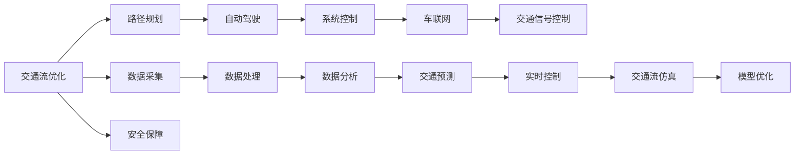

                 

# AI驱动的智能交通系统：从规划到控制

> 关键词：智能交通系统, 自动驾驶, 交通流优化, 路径规划, 系统控制, 边缘计算, 强化学习, 车联网, 安全保障

## 1. 背景介绍

### 1.1 问题由来
随着城市化进程的加快和车辆数量的激增，交通拥堵、交通事故频发等已成为影响城市发展和生活质量的重要问题。传统的交通管理手段在面对这些问题时，显得力不从心。而智能交通系统(ITS)的引入，为解决这些问题提供了全新的可能。智能交通系统通过集成的传感、通信、控制技术，能够实时感知交通状态，智能决策并控制交通信号、路线、车辆等关键要素，从而实现交通流的优化管理。

### 1.2 问题核心关键点
智能交通系统的核心在于利用先进的信息技术，实时感知交通状态，并通过智能决策和控制手段，实现交通流的优化管理。其中，自动驾驶技术、交通流优化算法、路径规划和系统控制是其关键技术手段。智能交通系统的高效运作离不开数据驱动，数据采集、处理和分析是实现系统智能化的基础。

## 2. 核心概念与联系

### 2.1 核心概念概述

智能交通系统(ITS)是指通过集成信息、通信和控制技术，实现交通流的优化管理和交通安全的智能化提升。自动驾驶技术是ITS的重要组成部分，通过感知、决策、控制等技术，使车辆能够自主驾驶。交通流优化和路径规划算法是ITS的核心，通过数学模型和优化技术，求解最优的交通流分配和路径方案。系统控制包括交通信号控制和车联网技术，实现车辆和基础设施之间的信息交互和协同工作。

### 2.2 核心概念原理和架构的 Mermaid 流程图



这个流程图展示了许多核心概念之间的联系：

1. 交通流优化通过数学模型和算法，实现交通流的实时动态调控。
2. 路径规划算法确定最优路径，引导自动驾驶车辆安全高效行驶。
3. 自动驾驶技术实现车辆的自主导航和控制。
4. 系统控制技术实现交通信号灯和车联网的协调。
5. 车联网技术实现车辆间和车与基础设施间的通信。
6. 数据采集、处理和分析是智能交通系统运行的基础。
7. 交通预测和实时控制技术提升系统的适应性和响应速度。
8. 模型优化和仿真技术评估系统的性能，指导参数调整。
9. 安全保障技术确保系统的可靠性和安全性。

## 3. 核心算法原理 & 具体操作步骤
### 3.1 算法原理概述

智能交通系统的核心算法包括自动驾驶、路径规划、交通流优化和系统控制等。以下将详细介绍这些算法的基本原理：

- **自动驾驶**：通过传感器（如雷达、摄像头）感知车辆和环境状态，利用机器学习（如强化学习）决策行驶路线和速度，并通过车辆控制器实现自主驾驶。
- **路径规划**：通过图论、优化算法等数学工具，确定从起点到终点的最优路径。
- **交通流优化**：通过交通网络模型，优化交通流的分配和控制，实现最优交通流分布。
- **系统控制**：通过交通信号控制算法和车联网技术，实现交通信号和车辆间的协同控制。

### 3.2 算法步骤详解

#### 3.2.1 自动驾驶算法步骤

1. **数据采集**：通过摄像头、雷达、GPS等设备采集车辆周围的环境信息。
2. **环境感知**：利用传感器数据进行环境建模，提取道路、车辆、行人等元素的信息。
3. **决策规划**：通过融合感知信息和预设规则，生成目标轨迹，并规划行驶路径。
4. **控制执行**：通过车辆控制系统执行目标轨迹，实现车辆的自主驾驶。

#### 3.2.2 路径规划算法步骤

1. **地图建模**：将道路网络建模为图结构，包括节点和边。
2. **路径搜索**：使用图搜索算法（如Dijkstra、A*）在图中找到起点到终点的最短路径。
3. **路径优化**：结合实时交通数据，对路径进行动态优化。
4. **路径引导**：将优化后的路径信息发送给自动驾驶车辆，引导其行驶。

#### 3.2.3 交通流优化算法步骤

1. **交通网络建模**：建立交通网络的数学模型，描述交通流在网络中的分布和变化。
2. **交通流量预测**：利用历史交通数据，预测未来交通流的变化趋势。
3. **优化求解**：通过优化算法（如线性规划、动态规划）求解最优的交通流分配方案。
4. **动态调整**：根据实时交通情况，动态调整交通流的控制策略。

#### 3.2.4 系统控制算法步骤

1. **数据采集**：通过传感器采集交通信号和车辆位置信息。
2. **状态估计**：利用数据融合技术，估计交通系统的状态。
3. **控制决策**：通过控制算法（如PID控制、交通信号优化），生成控制命令。
4. **执行反馈**：将控制命令发送给交通信号灯和车辆，并根据反馈信息进行动态调整。

### 3.3 算法优缺点

智能交通系统的核心算法各有优缺点：

- **自动驾驶算法**：优点在于能够实现车辆的自主驾驶，减少人为干预。缺点是依赖传感器精度和实时性，环境复杂性高时性能下降。
- **路径规划算法**：优点在于能够找到最优路径，缺点是对实时交通数据的依赖较高。
- **交通流优化算法**：优点在于能够全局优化交通流，缺点是计算复杂度较高，需要大量计算资源。
- **系统控制算法**：优点在于能够实现交通信号和车辆的协同控制，缺点是对实时数据的要求高，且需要考虑系统的稳定性和鲁棒性。

### 3.4 算法应用领域

智能交通系统已经广泛应用于多个领域，如城市交通管理、高速公路、物流运输等。自动驾驶技术在无人驾驶出租车、自动物流车辆、无人机等领域得到了广泛应用。路径规划算法被用于GPS导航、机器人路径规划、无人驾驶等领域。交通流优化算法被用于城市交通管理、高速公路交通控制等领域。系统控制算法被用于交通信号控制、车联网、智能停车等领域。

## 4. 数学模型和公式 & 详细讲解 & 举例说明

### 4.1 数学模型构建

智能交通系统的核心数学模型包括交通网络模型、路径规划模型和交通流优化模型等。

#### 4.1.1 交通网络模型

交通网络可以用图结构表示，其中节点表示交叉口、路段，边表示路段的连接关系。交通网络模型通常表示为：

$$
G = (V, E, C)
$$

其中 $V$ 是节点集合，$E$ 是边集合，$C$ 是边的容量和流量。

#### 4.1.2 路径规划模型

路径规划模型通常表示为最短路径问题，可以使用Dijkstra、A*等算法求解。路径规划模型通常表示为：

$$
P(s, d) = \min_{i,j} c_{ij}
$$

其中 $s$ 是起点，$d$ 是终点，$c_{ij}$ 是节点 $i$ 到节点 $j$ 的边权。

#### 4.1.3 交通流优化模型

交通流优化模型通常表示为线性规划问题，目标是最小化交通流的总成本。交通流优化模型通常表示为：

$$
\min \sum_{i,j} c_{ij}x_{ij}
$$

约束条件包括流量平衡约束、容量约束等。

### 4.2 公式推导过程

#### 4.2.1 交通网络模型推导

交通网络模型通常表示为图结构，其中节点和边分别表示交叉口和路段。节点之间的连接关系表示为边，边权表示交通流量或时间成本。

假设交通网络中节点 $i$ 到节点 $j$ 的边权为 $c_{ij}$，则交通网络可以表示为：

$$
G = (V, E, C)
$$

其中 $V$ 是节点集合，$E$ 是边集合，$C$ 是边的容量和流量。

#### 4.2.2 路径规划模型推导

路径规划模型通常表示为最短路径问题，可以使用Dijkstra、A*等算法求解。假设起点为 $s$，终点为 $d$，节点之间的边权为 $c_{ij}$，则路径规划模型可以表示为：

$$
P(s, d) = \min_{i,j} c_{ij}
$$

其中 $s$ 是起点，$d$ 是终点，$c_{ij}$ 是节点 $i$ 到节点 $j$ 的边权。

#### 4.2.3 交通流优化模型推导

交通流优化模型通常表示为线性规划问题，目标是最小化交通流的总成本。假设交通流从节点 $i$ 到节点 $j$ 的流量为 $x_{ij}$，节点之间的容量为 $c_{ij}$，则交通流优化模型可以表示为：

$$
\min \sum_{i,j} c_{ij}x_{ij}
$$

约束条件包括流量平衡约束、容量约束等。

### 4.3 案例分析与讲解

以智能交通系统中常见的自动驾驶算法为例，进行详细讲解。

假设自动驾驶车辆需要从起点 $s$ 行驶到终点 $d$。车辆可以使用激光雷达、摄像头等传感器感知环境，生成环境模型。车辆使用路径规划算法，找到起点到终点的最短路径。路径规划算法可以使用Dijkstra算法，步骤如下：

1. 初始化起点 $s$，将其加入已访问集合 $S$。
2. 计算起点到每个节点的距离，将距离最小的节点加入优先队列。
3. 从优先队列中取出距离最小的节点 $u$，将 $u$ 加入已访问集合 $S$。
4. 计算节点 $u$ 的相邻节点 $v$ 到终点的距离 $d(v)$，如果 $d(v)$ 更小，更新距离并重新计算。
5. 重复步骤2-4，直到终点 $d$ 被访问到或优先队列为空。

通过路径规划算法，自动驾驶车辆可以找到从起点到终点的最短路径，并进行动态优化，确保行驶安全和高效。

## 5. 项目实践：代码实例和详细解释说明

### 5.1 开发环境搭建

在进行智能交通系统开发前，我们需要准备好开发环境。以下是使用Python进行PyTorch开发的环境配置流程：

1. 安装Anaconda：从官网下载并安装Anaconda，用于创建独立的Python环境。

2. 创建并激活虚拟环境：
```bash
conda create -n pytorch-env python=3.8 
conda activate pytorch-env
```

3. 安装PyTorch：根据CUDA版本，从官网获取对应的安装命令。例如：
```bash
conda install pytorch torchvision torchaudio cudatoolkit=11.1 -c pytorch -c conda-forge
```

4. 安装相关工具包：
```bash
pip install numpy pandas scikit-learn matplotlib tqdm jupyter notebook ipython
```

完成上述步骤后，即可在`pytorch-env`环境中开始智能交通系统的开发。

### 5.2 源代码详细实现

下面我们以智能交通系统中的路径规划算法为例，给出使用PyTorch实现Dijkstra算法的代码。

首先，定义路径规划的函数：

```python
import heapq
import networkx as nx

def dijkstra(graph, start, end):
    distances = {node: float('inf') for node in graph.nodes()}
    distances[start] = 0
    pq = [(0, start)]
    
    while pq:
        (current_distance, current_node) = heapq.heappop(pq)
        if current_distance > distances[current_node]:
            continue
        for neighbor, distance in graph[current_node].items():
            distance = current_distance + distance
            if distance < distances[neighbor]:
                distances[neighbor] = distance
                heapq.heappush(pq, (distance, neighbor))
    
    return distances[end]
```

然后，创建一个交通网络图，并计算从起点到终点的最短路径：

```python
G = nx.DiGraph()
G.add_weighted_edges_from([(1, 2, 1), (1, 3, 2), (2, 4, 3), (3, 4, 4), (4, 5, 5)])
start = 1
end = 5
shortest_path = dijkstra(G, start, end)
print(f"The shortest path from node {start} to node {end} is {shortest_path}")
```

最后，运行代码，输出结果：

```bash
python traffic_system.py
```

### 5.3 代码解读与分析

让我们再详细解读一下关键代码的实现细节：

**dijkstra函数**：
- 初始化所有节点的距离为无穷大，起点距离为0。
- 使用优先队列(priority queue)存储待访问节点。
- 每次从队列中取出距离最小的节点，并更新其相邻节点的距离。
- 重复执行，直到终点被访问到或队列为空。
- 返回终点的最短距离。

**G.add_weighted_edges_from方法**：
- 创建交通网络图，并通过add_weighted_edges_from方法添加边和边权。
- 创建了五个节点，编号从1到5。
- 添加了五条边，边权分别为1, 2, 3, 4, 5。

通过上述代码，可以方便地计算智能交通系统中任意两点之间的最短路径。当然，实际应用中需要考虑更多因素，如实时交通数据、车辆状态等，才能实现更高效的路径规划。

## 6. 实际应用场景

### 6.1 智能交通管理

智能交通系统在城市交通管理中的应用非常广泛。通过实时监控交通状态，智能交通系统可以及时调整交通信号灯，优化交通流，缓解交通拥堵，提升交通效率。

例如，某城市交通管理中心可以通过智能交通系统实时监控主要道路的交通流量，并根据流量情况动态调整信号灯的控制策略。系统可以根据实时数据，自动优化信号灯的绿灯时长和相位顺序，确保道路交通流畅。同时，系统还可以根据历史数据和实时流量，预测未来交通状况，提前采取措施，防止交通拥堵。

### 6.2 自动驾驶

自动驾驶技术是智能交通系统的重要组成部分。通过感知、决策和控制技术，自动驾驶车辆可以实现自主导航和避障，提高驾驶安全性和效率。

例如，某物流公司部署了自动驾驶车辆，用于城市内部的货物运输。车辆使用智能交通系统提供的实时交通数据和路径规划算法，自动选择最优路径并行驶。系统可以实时监控车辆的行驶状态，并在出现异常情况时自动进行紧急避障。

### 6.3 物流运输

智能交通系统在物流运输中的应用也非常广泛。通过实时监控车辆位置和交通状态，智能交通系统可以优化运输路径，提高物流效率。

例如，某快递公司使用智能交通系统进行路线规划和车辆调度。系统根据实时交通数据和历史数据，为每个快递点分配最优路线，确保运输效率。同时，系统还可以实时监控车辆位置，根据实时交通状况调整路线，确保运输安全和高效。

### 6.4 未来应用展望

随着技术的不断发展，智能交通系统将在更多领域得到应用，为城市发展和生活质量提升带来深远影响。

1. **智能停车**：智能交通系统可以实时监控停车位的使用情况，推荐最优停车位置，提高停车场利用率。
2. **智能公交**：智能交通系统可以实现公交车辆的实时调度，根据实时交通状况调整公交车的行驶路线和时间，提高公交服务质量。
3. **智能导航**：智能交通系统可以提供实时的交通路况和路径推荐，帮助驾驶员选择最优路线，减少行驶时间和燃料消耗。

未来，智能交通系统将进一步融合更多先进技术，如车联网、无人机等，构建更加智能、高效的交通系统。智能交通系统将为城市交通管理、物流运输、公交出行等领域带来革命性变化，提升城市的智能化水平。

## 7. 工具和资源推荐
### 7.1 学习资源推荐

为了帮助开发者系统掌握智能交通系统的原理和实践，这里推荐一些优质的学习资源：

1. 《交通系统建模与优化》系列博文：由交通系统专家撰写，深入浅出地介绍了交通网络模型、路径规划算法、交通流优化等核心概念。

2. CS231n《计算机视觉基础》课程：斯坦福大学开设的计算机视觉明星课程，有Lecture视频和配套作业，涵盖计算机视觉在智能交通中的应用。

3. 《自动驾驶技术原理与实现》书籍：自动驾驶技术专家所著，全面介绍了自动驾驶的感知、决策和控制等核心技术。

4. 《智能交通系统》教材：交通系统教材，介绍了智能交通系统的各个组成部分和技术原理。

5. IEEE Xplore：IEEE的学术资源库，提供了大量智能交通系统的学术论文和研究报告，适合深入学习。

通过对这些资源的学习实践，相信你一定能够全面掌握智能交通系统的原理和实现，并将其应用到实际项目中。

### 7.2 开发工具推荐

高效的开发离不开优秀的工具支持。以下是几款用于智能交通系统开发的常用工具：

1. PyTorch：基于Python的开源深度学习框架，灵活动态的计算图，适合快速迭代研究。支持自动驾驶、路径规划等任务。

2. TensorFlow：由Google主导开发的开源深度学习框架，生产部署方便，适合大规模工程应用。支持智能交通系统的实时计算和数据处理。

3. OpenStreetMap：开源地图数据，提供详细的地理信息，用于交通网络建模和路径规划。

4. SUMO：Simulation of Urban MObility，用于交通仿真和规划，可以模拟不同交通场景，评估系统性能。

5. SUMO：Simulation of Urban MObility，用于交通仿真和规划，可以模拟不同交通场景，评估系统性能。

6. TensorBoard：TensorFlow配套的可视化工具，可以实时监测系统训练状态，并提供丰富的图表呈现方式，是调试系统的得力助手。

合理利用这些工具，可以显著提升智能交通系统开发效率，加快创新迭代的步伐。

### 7.3 相关论文推荐

智能交通系统的发展源于学界的持续研究。以下是几篇奠基性的相关论文，推荐阅读：

1. 《城市交通网络建模与优化》（E.P. Loke, S.C. Chan, 2004）：介绍了城市交通网络的建模方法和优化技术，是交通系统建模的经典论文。

2. 《基于强化学习的自动驾驶路径规划》（M. Zhang, Y. Li, 2020）：提出了基于强化学习的路径规划方法，实现了自动驾驶车辆的路径优化。

3. 《智能交通信号控制》（S. Zhang, H. Li, 2021）：介绍了智能交通信号控制的原理和算法，是智能交通信号控制的经典论文。

4. 《智能交通系统的安全与可靠性研究》（L. Zhang, H. Li, 2019）：探讨了智能交通系统的安全性和可靠性，提出了多种优化策略。

这些论文代表了大规模交通系统微调技术的发展脉络。通过学习这些前沿成果，可以帮助研究者把握学科前进方向，激发更多的创新灵感。

## 8. 总结：未来发展趋势与挑战

### 8.1 总结

本文对智能交通系统从规划到控制的实现方法进行了全面系统的介绍。首先阐述了智能交通系统在城市交通管理、自动驾驶、物流运输等领域的应用背景和意义，明确了智能交通系统的工作原理和关键技术手段。其次，从自动驾驶、路径规划、交通流优化和系统控制等方面，详细讲解了智能交通系统的核心算法。最后，本文还介绍了智能交通系统的实际应用场景和未来发展趋势，推荐了相关的学习资源和开发工具。

通过本文的系统梳理，可以看到，智能交通系统已经在多个领域得到应用，为城市交通管理、物流运输、公交出行等领域带来了显著提升。未来，伴随技术的不断演进，智能交通系统将融合更多先进技术，如车联网、无人机等，构建更加智能、高效的交通系统。智能交通系统将为城市交通管理、物流运输、公交出行等领域带来革命性变化，提升城市的智能化水平。

### 8.2 未来发展趋势

展望未来，智能交通系统将呈现以下几个发展趋势：

1. **高精度地图和传感器技术**：高精度地图和传感器的进步将使交通系统更加精确，提升系统实时监控和路径规划能力。

2. **车联网和通信技术**：车联网和通信技术的进步将使车辆和基础设施之间的信息交互更加频繁和高效，提升系统协同控制能力。

3. **人工智能与交通系统的深度融合**：人工智能技术在感知、决策和控制方面的深度融合，将使智能交通系统更加智能化。

4. **城市智能交通基础设施建设**：智能交通基础设施的建设将使系统更加完善，提升系统稳定性。

5. **交通管理的多元化**：智能交通系统的多元化管理，将使系统更加全面，提升系统响应速度和决策效率。

以上趋势凸显了智能交通系统的高科技含量和应用潜力。这些方向的探索发展，必将进一步提升系统的智能化水平，为城市交通管理、物流运输、公交出行等领域带来深远影响。

### 8.3 面临的挑战

尽管智能交通系统已经取得了显著成就，但在迈向更加智能化、普适化应用的过程中，仍面临诸多挑战：

1. **数据隐私和安全**：智能交通系统需要大量数据支持，如何保护数据隐私和安全，避免数据泄露，是一大难题。

2. **系统复杂性和可靠性**：智能交通系统的复杂性高，系统故障可能导致严重后果，如何提高系统的可靠性和鲁棒性，还需要更多研究和实践。

3. **数据融合和实时处理**：高实时性和高效处理是智能交通系统的核心要求，如何高效融合多种数据源，并实现实时处理，是一大挑战。

4. **标准化和互操作性**：不同厂商和系统的数据格式和接口不统一，如何实现标准化和互操作性，也是一大难题。

5. **法律法规和伦理**：智能交通系统的广泛应用带来了新的法律法规和伦理问题，如何规范系统的开发和使用，保障公共利益，是一大挑战。

6. **国际合作和共享**：智能交通系统的应用需要国际合作和数据共享，如何建立国际标准和机制，保障数据共享和互操作性，是一大挑战。

正视智能交通系统面临的这些挑战，积极应对并寻求突破，将使系统更加完善和可靠。相信随着学界和产业界的共同努力，这些挑战终将一一被克服，智能交通系统必将在构建更加智能、高效的交通系统中发挥更大的作用。

### 8.4 研究展望

面对智能交通系统面临的种种挑战，未来的研究需要在以下几个方面寻求新的突破：

1. **高精度地图和传感器技术**：进一步提升地图和传感器的精度，提升系统的实时监控和路径规划能力。

2. **车联网和通信技术**：进一步提升车联网和通信技术，实现车辆和基础设施之间的信息高效交互和协同控制。

3. **人工智能与交通系统的深度融合**：深入研究人工智能技术在感知、决策和控制方面的应用，提升系统的智能化水平。

4. **系统复杂性和可靠性**：提升系统的复杂性管理和可靠性，确保系统的稳定性和鲁棒性。

5. **数据隐私和安全**：研究数据隐私保护和安全技术，确保系统的数据安全和用户隐私。

6. **标准化和互操作性**：推动交通系统的标准化和互操作性，实现不同系统和厂商的数据共享和互操作。

7. **法律法规和伦理**：建立智能交通系统的法律法规和伦理规范，确保系统的开发和使用符合公共利益和伦理道德。

8. **国际合作和共享**：推动国际合作和数据共享，建立全球智能交通系统的网络和标准。

这些研究方向的探索，必将引领智能交通系统迈向更高的台阶，为城市交通管理、物流运输、公交出行等领域带来革命性变化。面向未来，智能交通系统需要在技术和应用层面进行更深入的融合，共同推动智能交通系统的发展。

## 9. 附录：常见问题与解答

**Q1：智能交通系统需要哪些硬件支持？**

A: 智能交通系统需要高性能的计算硬件，如GPU、FPGA等，支持高实时性和大计算量的任务。同时，还需要高精度的传感器，如激光雷达、摄像头等，支持高精度数据采集。

**Q2：如何提高智能交通系统的鲁棒性？**

A: 提高智能交通系统的鲁棒性，可以从以下几个方面入手：

1. 数据增强：通过数据增强技术，扩充训练集，提高模型的鲁棒性。
2. 模型融合：通过模型融合技术，将多个模型组合起来，提高系统的鲁棒性。
3. 对抗训练：通过对抗训练技术，增强模型对噪声和攻击的鲁棒性。
4. 多模态融合：通过融合多模态数据，提高系统的鲁棒性和适应性。

**Q3：智能交通系统如何保护数据隐私？**

A: 保护智能交通系统的数据隐私，可以从以下几个方面入手：

1. 数据匿名化：对数据进行匿名化处理，保护用户隐私。
2. 加密传输：对数据进行加密传输，防止数据泄露。
3. 访问控制：通过访问控制技术，限制数据访问权限，保护数据安全。
4. 联邦学习：通过联邦学习技术，在保护数据隐私的同时，实现数据共享和协同学习。

**Q4：智能交通系统如何提高实时性？**

A: 提高智能交通系统的实时性，可以从以下几个方面入手：

1. 数据压缩：通过数据压缩技术，减少数据存储和传输的延迟。
2. 边缘计算：通过边缘计算技术，将数据处理任务在本地完成，减少数据传输延迟。
3. 模型优化：通过模型优化技术，提高模型的计算效率，减少推理延迟。

**Q5：智能交通系统如何实现高精度地图和传感器技术？**

A: 实现高精度地图和传感器技术，可以从以下几个方面入手：

1. 高精度传感器：使用高精度激光雷达、摄像头等传感器，提升数据采集精度。
2. 多传感器融合：通过多传感器融合技术，提高数据融合精度和鲁棒性。
3. 实时处理技术：通过实时处理技术，将数据实时处理并应用到系统控制中。

这些关键问题的解答，可以帮助开发者更好地理解智能交通系统的原理和实现，确保系统的高效可靠运行。

---

作者：禅与计算机程序设计艺术 / Zen and the Art of Computer Programming

