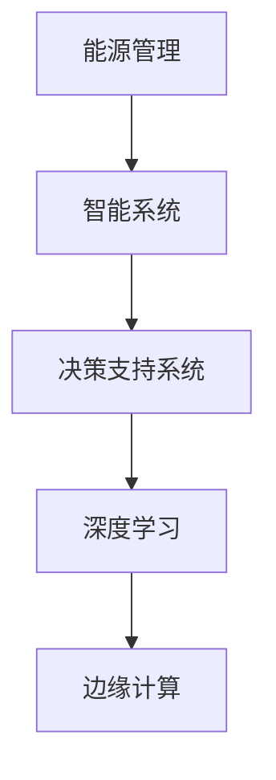

                 

# AI驱动的智能能源管理系统

> 关键词：人工智能,能源管理,智能系统,决策支持,数据分析,机器学习,深度学习,边缘计算

## 1. 背景介绍

### 1.1 问题由来
能源管理是现代社会面对的重要挑战之一，直接影响经济、环境和社会发展。传统能源管理系统依赖人工决策，效率低下且无法及时响应需求波动。随着人工智能技术的发展，AI驱动的智能能源管理系统应运而生，通过智能算法和大数据分析，实现能源使用的优化和预测，提高能源管理效率和可靠性。

### 1.2 问题核心关键点
智能能源管理系统以人工智能为核心，通过集成传感器、智能终端、通信网络和云平台等基础设施，实时采集和分析能源数据，利用机器学习、深度学习和数据分析技术，实现能源的智能调度、优化配置和故障诊断等功能。其核心在于：

- **数据采集与存储**：收集实时能源数据，存储于云平台，为后续分析提供数据基础。
- **智能分析与决策**：通过算法模型对能源数据进行分析，预测能源需求和供应，优化能源配置，支持决策制定。
- **可视化与监控**：通过仪表盘和实时监控系统，提供直观的能源使用情况展示，帮助管理人员及时响应能源波动。
- **优化与预测**：使用深度学习模型进行能源需求预测，优化能源分配，减少浪费。
- **自适应与自学习**：通过学习历史数据和实时反馈，系统能够自适应环境变化，优化运行策略。

### 1.3 问题研究意义
AI驱动的智能能源管理系统对能源管理有着深远的意义：

1. **提高能源利用效率**：通过智能调度和优化配置，减少能源浪费，提升能源利用率。
2. **降低能源成本**：通过预测和优化，降低能源需求高峰期的能源购买和运输成本。
3. **促进可再生能源发展**：支持可再生能源的接入和优化，促进清洁能源的应用。
4. **增强能源系统韧性**：通过故障诊断和自适应调整，提高系统抵抗外部干扰的能力。
5. **支持决策支持**：为能源管理提供数据驱动的决策支持，提升决策科学性。

## 2. 核心概念与联系

### 2.1 核心概念概述

为更好地理解AI驱动的智能能源管理系统，本节将介绍几个关键概念：

- **能源管理**：对能源的采集、传输、存储、使用、配送等全过程进行规划、调度、控制和优化，确保能源的高效、稳定和可持续供应。
- **智能系统**：利用人工智能技术，通过数据驱动、算法驱动实现智能感知、智能决策和智能执行的系统。
- **决策支持系统**：通过数据分析和算法模型，为决策者提供数据支持和方案建议的系统。
- **深度学习**：一种利用深度神经网络进行学习，能够处理大规模数据和复杂模式识别的机器学习方法。
- **边缘计算**：在靠近数据源的本地设备上进行数据处理和分析，减少数据传输和计算负担。

这些概念之间的逻辑关系可以通过以下Mermaid流程图来展示：



这个流程图展示了几大核心概念及其之间的关系：

1. 能源管理是智能系统的基础，通过智能系统实现能源的高效管理。
2. 决策支持系统为智能系统提供数据和算法支持，辅助决策。
3. 深度学习是智能系统中的重要组成部分，用于处理复杂的数据模式。
4. 边缘计算则通过在本地设备上进行数据处理，减少网络传输负荷，优化系统性能。

## 3. 核心算法原理 & 具体操作步骤
### 3.1 算法原理概述

AI驱动的智能能源管理系统涉及多个核心算法，包括数据预处理、特征提取、模型训练和预测等。核心算法原理如下：

1. **数据预处理**：清洗、标准化和归一化能源数据，减少噪声和异常值，提高模型训练效果。
2. **特征提取**：从原始数据中提取有意义的特征，如时间序列、温度、湿度等，用于后续的模型训练和预测。
3. **模型训练**：通过监督学习、无监督学习和强化学习等算法，训练模型以捕捉数据中的规律和模式。
4. **预测与优化**：利用训练好的模型进行能源需求预测和优化配置，支持决策制定。

### 3.2 算法步骤详解

以下是AI驱动的智能能源管理系统的主要算法步骤：

**Step 1: 数据采集与预处理**
- 部署传感器和智能终端，采集能源使用数据，包括电压、电流、功率、温度等。
- 数据清洗：去除噪声和异常值，填补缺失数据。
- 数据标准化：对数据进行归一化处理，便于模型训练。
- 数据分割：将数据集划分为训练集、验证集和测试集。

**Step 2: 特征提取与选择**
- 选择和提取重要的特征，如时间序列、温度、湿度等。
- 使用PCA等降维技术，减少特征维度，提高模型训练效率。
- 特征工程：创建新的特征，如日周期性特征、季节性特征等。

**Step 3: 模型训练与优化**
- 选择合适的算法，如深度学习、支持向量机等，进行模型训练。
- 调整超参数，如学习率、批大小、迭代轮数等，以提高模型性能。
- 应用正则化技术，如L2正则、Dropout等，防止过拟合。
- 使用交叉验证等技术，评估模型性能。

**Step 4: 预测与优化配置**
- 利用训练好的模型进行能源需求预测，生成优化配置策略。
- 基于预测结果，进行能源调度和优化，实现节能降耗。
- 实时监控系统运行状态，及时调整运行策略。

**Step 5: 可视化与监控**
- 设计仪表盘和实时监控系统，展示能源使用情况。
- 使用可视化工具，如Tableau、Grafana等，提供直观的数据展示。

### 3.3 算法优缺点

AI驱动的智能能源管理系统具有以下优点：
1. 高效：通过自动化和智能化算法，提高能源管理效率。
2. 准确：利用数据分析和机器学习，提高预测和决策的准确性。
3. 自适应：通过学习历史数据和实时反馈，系统能够自适应环境变化。
4. 优化配置：通过算法优化，实现能源的合理分配和利用。

同时，该方法也存在一些局限性：
1. 数据依赖：模型性能依赖于数据的质量和数量，数据采集和处理环节可能存在误差。
2. 计算成本：训练深度学习模型需要大量计算资源和时间，成本较高。
3. 技术复杂：系统涉及多个子系统，技术复杂性较高，开发和维护难度大。
4. 鲁棒性不足：模型可能对数据分布变化敏感，鲁棒性有待提升。

### 3.4 算法应用领域

AI驱动的智能能源管理系统广泛应用于多个领域，如工业、商业、住宅等，具体包括：

- **工业能源管理**：优化工厂的生产能源使用，减少能源浪费，降低能耗成本。
- **商业建筑能源管理**：管理商场、酒店、办公楼的能源使用，实现节能降耗。
- **住宅能源管理**：优化家庭能源使用，提供个性化节能方案，提高生活质量。
- **城市能源管理**：管理城市电网、供热、供水等能源系统，提高城市能源效率。
- **数据中心能源管理**：优化数据中心的能源使用，提高计算效率和能效比。

## 4. 数学模型和公式 & 详细讲解
### 4.1 数学模型构建

本节将使用数学语言对AI驱动的智能能源管理系统进行更加严格的刻画。

记能源数据为 $D=\{x_i,y_i\}_{i=1}^N$，其中 $x_i$ 为输入特征，$y_i$ 为能源需求标签。定义模型为 $f_{\theta}(x)$，其中 $\theta$ 为模型参数。

假设训练集为 $D=\{(x_i,y_i)\}_{i=1}^N$，目标函数为最小化经验风险，即：

$$
\mathcal{L}(\theta) = \frac{1}{N} \sum_{i=1}^N \ell(f_{\theta}(x_i),y_i)
$$

其中 $\ell$ 为损失函数，如均方误差、交叉熵等。

### 4.2 公式推导过程

以深度学习模型为例，假设使用神经网络进行预测，输出层为 $f_{\theta}(x)$。

对于均方误差损失函数，有：

$$
\ell(y,f_{\theta}(x)) = \frac{1}{2}(y-f_{\theta}(x))^2
$$

模型训练的优化目标为：

$$
\theta^* = \mathop{\arg\min}_{\theta} \frac{1}{N} \sum_{i=1}^N \frac{1}{2}(y_i-f_{\theta}(x_i))^2
$$

使用梯度下降等优化算法，更新模型参数 $\theta$：

$$
\theta \leftarrow \theta - \eta \nabla_{\theta} \frac{1}{N} \sum_{i=1}^N \frac{1}{2}(y_i-f_{\theta}(x_i))^2
$$

其中 $\eta$ 为学习率，$\nabla_{\theta}$ 为梯度运算符。

### 4.3 案例分析与讲解

以工业能源管理为例，假设目标是对工业设备的能源使用进行预测和优化配置。

**数据预处理**：
- 收集工业设备的历史能源数据，包括时间、温度、湿度等。
- 数据清洗：去除异常值和噪声。
- 数据标准化：对能源使用量进行归一化处理。

**特征提取**：
- 提取时间序列特征：日周期性特征、季节性特征等。
- 创建新的特征：设备状态、环境参数等。

**模型训练**：
- 选择深度学习模型，如LSTM、GRU等，进行训练。
- 调整超参数，如学习率、批大小等。
- 应用正则化技术，如L2正则、Dropout等。

**预测与优化配置**：
- 利用训练好的模型进行能源需求预测，生成优化配置策略。
- 根据预测结果，调整设备运行参数，实现节能降耗。

**可视化与监控**：
- 设计仪表盘，展示能源使用情况。
- 使用可视化工具，如Tableau、Grafana等，提供直观的数据展示。

## 5. 项目实践：代码实例和详细解释说明
### 5.1 开发环境搭建

在进行智能能源管理系统开发前，我们需要准备好开发环境。以下是使用Python进行TensorFlow开发的流程：

1. 安装Anaconda：从官网下载并安装Anaconda，用于创建独立的Python环境。

2. 创建并激活虚拟环境：
```bash
conda create -n tf-env python=3.8 
conda activate tf-env
```

3. 安装TensorFlow：根据CUDA版本，从官网获取对应的安装命令。例如：
```bash
conda install tensorflow-gpu=2.5.0 -c conda-forge
```

4. 安装相关库：
```bash
pip install pandas numpy matplotlib scikit-learn tensorflow h5py
```

完成上述步骤后，即可在`tf-env`环境中开始开发实践。

### 5.2 源代码详细实现

这里我们以工业能源管理为例，给出使用TensorFlow进行深度学习模型训练的代码实现。

首先，定义模型结构和超参数：

```python
import tensorflow as tf
from tensorflow.keras.layers import Input, LSTM, Dense
from tensorflow.keras.models import Model

# 定义模型输入层
input_layer = Input(shape=(timesteps, input_dim))

# 定义LSTM层
lstm_layer = LSTM(units=64, return_sequences=True)(input_layer)

# 定义输出层
output_layer = Dense(units=1, activation='sigmoid')(lstm_layer)

# 定义模型
model = Model(inputs=input_layer, outputs=output_layer)

# 定义优化器和损失函数
optimizer = tf.keras.optimizers.Adam(lr=0.001)
loss_function = tf.keras.losses.BinaryCrossentropy()
```

然后，定义数据预处理和模型训练函数：

```python
def preprocess_data(data):
    # 数据清洗和标准化
    # 数据分割
    # 特征提取
    # 返回预处理后的数据
    pass

def train_model(model, training_data, validation_data, epochs):
    # 编译模型
    model.compile(optimizer=optimizer, loss=loss_function)

    # 训练模型
    history = model.fit(training_data, epochs=epochs, validation_data=validation_data)

    # 保存模型
    model.save('energy_management_model.h5')
```

接着，训练模型并进行可视化：

```python
# 获取数据集
training_data = preprocess_data(training_data)
validation_data = preprocess_data(validation_data)

# 训练模型
train_model(model, training_data, validation_data, epochs=100)

# 加载模型
loaded_model = tf.keras.models.load_model('energy_management_model.h5')

# 预测和可视化
actual_values = ...
predicted_values = loaded_model.predict(test_data)

# 使用可视化工具，如Tableau、Grafana等展示预测结果
```

以上就是使用TensorFlow进行工业能源管理深度学习模型训练的完整代码实现。可以看到，TensorFlow提供了方便的API，使得模型的构建和训练过程非常直观。

### 5.3 代码解读与分析

让我们再详细解读一下关键代码的实现细节：

**模型定义**：
- `Input`层定义模型的输入维度。
- `LSTM`层定义长短期记忆网络，用于处理时间序列数据。
- `Dense`层定义输出层，输出能源需求预测值。
- `Model`层将输入和输出层组合成完整的模型。

**超参数定义**：
- 学习率 `lr`：优化算法中的学习率。
- 损失函数 `loss_function`：用于计算模型预测值与实际值之间的误差。

**数据预处理**：
- 数据清洗：去除异常值和噪声。
- 数据标准化：对数据进行归一化处理。
- 数据分割：将数据集划分为训练集、验证集和测试集。

**模型训练**：
- 编译模型：指定优化器和损失函数。
- 训练模型：使用`fit`函数进行模型训练，指定训练轮数和验证集。
- 保存模型：使用`save`函数保存训练好的模型。

**模型加载**：
- 使用`load_model`函数加载保存的模型。
- 进行预测：使用`predict`函数对测试数据进行预测。

**可视化**：
- 使用可视化工具如Tableau、Grafana等展示预测结果。

## 6. 实际应用场景

### 6.1 智能建筑能源管理

智能建筑能源管理系统通过实时监测建筑内部的能源使用情况，自动调整灯光、空调、暖通等设备，实现能源的高效利用和智能控制。例如，在商业办公楼内，系统可以根据实时监控到的温度、湿度、人流等数据，自动调节空调和照明系统的运行状态，减少能源浪费。

**具体实现**：
- 部署传感器和智能终端，采集建筑内部的能源使用数据。
- 使用深度学习模型进行能源需求预测，生成优化配置策略。
- 根据预测结果，自动调整设备运行参数，实现节能降耗。
- 实时监控系统运行状态，及时调整运行策略。

### 6.2 智能电网

智能电网通过实时监控和管理电网中的能源数据，实现电网的优化运行和故障检测。系统可以预测电力需求，平衡供需关系，提高电网稳定性和可靠性。

**具体实现**：
- 部署传感器和智能终端，采集电网的能源数据。
- 使用深度学习模型进行电力需求预测，生成优化配置策略。
- 根据预测结果，调整发电和输电策略，实现电网稳定运行。
- 实时监控电网运行状态，及时发现并解决故障。

### 6.3 智能工厂

智能工厂通过实时监控和管理工厂内部的能源使用情况，优化生产流程和设备运行，减少能源浪费。系统可以根据实时监控到的生产数据，自动调整设备参数，提高生产效率和能效比。

**具体实现**：
- 部署传感器和智能终端，采集工厂内部的能源使用数据。
- 使用深度学习模型进行能源需求预测，生成优化配置策略。
- 根据预测结果，调整设备运行参数，实现节能降耗。
- 实时监控系统运行状态，及时调整运行策略。

### 6.4 未来应用展望

随着AI技术的不断发展，智能能源管理系统的应用场景将更加广泛，技术水平也将不断提高。未来展望如下：

1. **多能源融合管理**：实现多种能源（如电力、燃气、水等）的智能管理和优化配置。
2. **能源市场参与**：系统参与能源交易市场，通过优化配置策略，获取能源市场收益。
3. **需求响应管理**：根据实时需求响应政策，自动调整能源使用策略，提高需求响应效率。
4. **边缘计算**：在本地设备上进行数据处理和分析，减少网络传输负荷，优化系统性能。
5. **自学习与自适应**：通过学习历史数据和实时反馈，系统能够自适应环境变化，优化运行策略。

## 7. 工具和资源推荐
### 7.1 学习资源推荐

为了帮助开发者系统掌握智能能源管理系统的理论基础和实践技巧，这里推荐一些优质的学习资源：

1. **《能源系统建模与优化》**：系统介绍能源系统的建模方法和优化技术，适合能源领域研究人员和从业者学习。
2. **《深度学习》**：吴恩达教授的深度学习课程，涵盖深度学习的基本概念和常用算法。
3. **《TensorFlow实战》**：Google官方发布的TensorFlow实战指南，提供大量实践案例和代码示例。
4. **《智能电网技术》**：详细介绍智能电网的技术框架和应用场景，适合智能电网领域从业者学习。
5. **《智能建筑技术》**：介绍智能建筑的设计和实现方法，适合智能建筑领域从业人员学习。

通过对这些资源的学习实践，相信你一定能够快速掌握智能能源管理系统的精髓，并用于解决实际的能源管理问题。

### 7.2 开发工具推荐

高效的开发离不开优秀的工具支持。以下是几款用于智能能源管理系统开发的常用工具：

1. **TensorFlow**：基于Python的开源深度学习框架，灵活高效，适合复杂深度学习模型的开发。
2. **TensorBoard**：TensorFlow配套的可视化工具，实时监测模型训练状态，提供丰富的图表展示。
3. **Jupyter Notebook**：Python开发和数据分析的常用工具，支持代码运行和可视化展示。
4. **Tableau**：数据可视化工具，支持复杂的数据报表和仪表盘设计。
5. **Grafana**：开源的数据可视化平台，支持多种数据源的接入和展示。

合理利用这些工具，可以显著提升智能能源管理系统开发的效率，加快创新迭代的步伐。

### 7.3 相关论文推荐

智能能源管理系统的发展源于学界的持续研究。以下是几篇奠基性的相关论文，推荐阅读：

1. **《深度学习在能源管理中的应用》**：介绍深度学习在能源管理中的各种应用场景和效果。
2. **《基于深度学习的智能电网负荷预测模型》**：提出基于深度学习的智能电网负荷预测模型，提升负荷预测精度。
3. **《能源系统智能调度与优化》**：探讨智能调度与优化方法，提升能源系统的高效运行。
4. **《智能建筑能源管理系统的设计与实现》**：介绍智能建筑能源管理系统的设计与实现方法。
5. **《工业能源管理系统》**：分析工业能源管理系统的架构与技术实现。

这些论文代表了大规模能源管理系统的发展脉络。通过学习这些前沿成果，可以帮助研究者把握学科前进方向，激发更多的创新灵感。

## 8. 总结：未来发展趋势与挑战
### 8.1 研究成果总结

本文对AI驱动的智能能源管理系统进行了全面系统的介绍。首先阐述了智能能源管理系统的背景和研究意义，明确了其在提高能源效率、降低能源成本等方面的重要价值。其次，从原理到实践，详细讲解了智能能源管理系统的核心算法和具体操作步骤，给出了系统开发的完整代码实例。同时，本文还广泛探讨了智能能源管理系统在智能建筑、智能电网、智能工厂等领域的实际应用场景，展示了系统的广泛应用前景。此外，本文精选了系统开发所需的各类学习资源和开发工具，力求为开发者提供全方位的技术指引。

通过本文的系统梳理，可以看到，AI驱动的智能能源管理系统在能源管理领域具有广阔的应用前景。智能能源管理系统的部署和运行，不仅能够大幅提升能源利用效率，降低能源成本，还能有效支持可再生能源的利用，提升能源系统的稳定性和韧性。未来，伴随技术的不断发展，智能能源管理系统必将在更广泛的领域得到应用，进一步推动能源管理智能化水平的提升。

### 8.2 未来发展趋势

展望未来，智能能源管理系统将呈现以下几个发展趋势：

1. **多能源融合管理**：实现多种能源（如电力、燃气、水等）的智能管理和优化配置。
2. **能源市场参与**：系统参与能源交易市场，通过优化配置策略，获取能源市场收益。
3. **需求响应管理**：根据实时需求响应政策，自动调整能源使用策略，提高需求响应效率。
4. **边缘计算**：在本地设备上进行数据处理和分析，减少网络传输负荷，优化系统性能。
5. **自学习与自适应**：通过学习历史数据和实时反馈，系统能够自适应环境变化，优化运行策略。

### 8.3 面临的挑战

尽管智能能源管理系统已经取得了瞩目成就，但在迈向更加智能化、普适化应用的过程中，它仍面临诸多挑战：

1. **数据质量与获取**：模型性能依赖于数据的质量和数量，数据采集和处理环节可能存在误差。
2. **计算成本**：训练深度学习模型需要大量计算资源和时间，成本较高。
3. **技术复杂性**：系统涉及多个子系统，技术复杂性较高，开发和维护难度大。
4. **鲁棒性不足**：模型可能对数据分布变化敏感，鲁棒性有待提升。

### 8.4 研究展望

面对智能能源管理系统所面临的挑战，未来的研究需要在以下几个方面寻求新的突破：

1. **数据采集与处理**：开发高效的数据采集和处理技术，确保数据的实时性和准确性。
2. **模型优化与压缩**：开发高效的模型优化和压缩技术，降低计算成本，提高系统性能。
3. **多能源融合管理**：实现多种能源的智能融合管理，提升能源利用效率。
4. **自学习与自适应**：通过学习历史数据和实时反馈，系统能够自适应环境变化，优化运行策略。
5. **多模态融合**：将视觉、语音等多种模态数据与文本数据结合，提升系统的感知能力和决策准确性。

这些研究方向的探索，必将引领智能能源管理系统迈向更高的台阶，为构建更智能、更高效的能源管理系统提供技术支撑。相信随着技术的不断进步和应用的不断拓展，智能能源管理系统必将在能源管理领域发挥更加重要的作用，推动能源产业的绿色转型和可持续发展。

## 9. 附录：常见问题与解答

**Q1：智能能源管理系统是否适用于所有能源类型？**

A: 智能能源管理系统主要适用于电能管理，但也支持水、燃气等其他能源类型。通过部署相应的传感器和智能终端，可以实时采集和监测不同类型能源的数据，进行统一管理和优化。

**Q2：智能能源管理系统如何实现实时预测？**

A: 智能能源管理系统通过深度学习模型进行能源需求预测，实时采集和处理能源数据，更新模型参数，进行动态预测。预测模型通常使用LSTM、GRU等时间序列预测模型，结合实时环境数据进行预测。

**Q3：智能能源管理系统如何提高鲁棒性？**

A: 提高鲁棒性的主要方法包括数据增强、正则化、对抗训练等。数据增强可以丰富数据集，减少噪声和异常值；正则化可以防止模型过拟合；对抗训练可以提高模型对数据扰动的鲁棒性。

**Q4：智能能源管理系统如何实现多能源融合管理？**

A: 多能源融合管理可以通过建立统一的能源管理系统平台，将电力、燃气、水等不同能源类型的数据进行统一管理和优化配置。系统可以根据不同能源的需求和供应情况，动态调整能源分配策略，提高能源利用效率。

**Q5：智能能源管理系统如何实现自学习与自适应？**

A: 自学习与自适应可以通过建立在线学习系统，不断更新模型参数，学习最新的能源数据和用户行为，优化能源配置策略。系统可以根据环境变化和用户需求，动态调整运行策略，提高系统适应性。

---

作者：禅与计算机程序设计艺术 / Zen and the Art of Computer Programming

