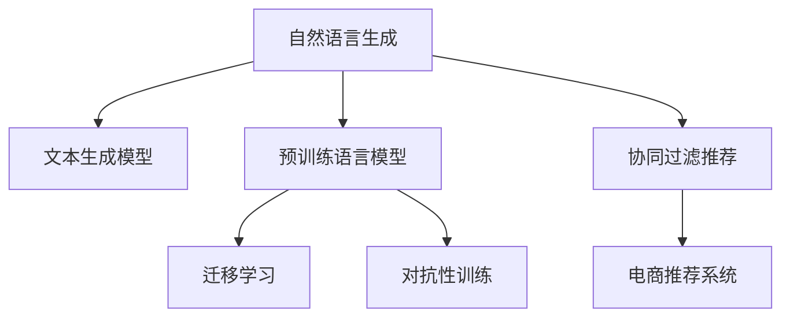

                 

# AI驱动的电商个性化邮件营销内容生成系统

## 1. 背景介绍

### 1.1 问题由来

在电商行业中，邮件营销一直是一种成本相对较低、效果显著的营销手段。传统的邮件营销主要是以批量发送的固定内容为主，无法实现对用户个性化需求的精准匹配，导致邮件送达率高但点击率低。为提高邮件营销的个性化和精准度，许多电商平台开始探索AI技术在内容生成中的应用，以实现邮件内容的动态生成和个性化定制。

然而，实现高效、高质量的邮件内容生成仍然面临诸多挑战。如如何基于用户行为数据，动态生成符合用户兴趣的内容；如何避免生成内容过度商业化，保障用户体验；如何在保证内容多样性和创意性的同时，保证生成内容的质量等。本文将重点介绍一种基于自然语言生成(NLG)技术的个性化邮件内容生成系统，并结合具体实例展示其实现过程和技术细节。

## 2. 核心概念与联系

### 2.1 核心概念概述

为更好地理解个性化邮件内容生成系统，本节将介绍几个密切相关的核心概念：

- 自然语言生成(Natural Language Generation, NLG)：利用人工智能技术，将结构化数据转换为自然语言文本的技术。常见的应用包括机器翻译、内容生成、智能客服等。

- 文本生成模型：包括基于规则的生成、基于模板的生成、基于统计的生成、基于序列到序列的生成、基于预训练语言模型的生成等多种方式。本文重点关注基于预训练语言模型的文本生成方法。

- 预训练语言模型(Pre-trained Language Models, PLMs)：如BERT、GPT-3等，通过在大规模无标签文本语料上进行自监督学习，学习语言的基本结构、语义和语法规律。

- 迁移学习(Transfer Learning)：通过在预训练模型的基础上，使用下游任务的少量标注数据，进行有监督学习优化，使得模型在特定任务上取得更好的性能。

- 对抗性训练(Adversarial Training)：通过在训练数据中加入对抗样本，增强模型对抗噪声和攻击的能力。

- 协同过滤推荐(Collaborative Filtering)：基于用户历史行为数据，预测用户对未交互商品的兴趣，从而生成个性化推荐。

- 电商推荐系统：根据用户行为数据和商品属性信息，生成个性化的商品推荐。

这些核心概念之间的逻辑关系可以通过以下Mermaid流程图来展示：



这个流程图展示了几大核心概念及其之间的关系：

1. 自然语言生成是内容生成的核心技术。
2. 文本生成模型基于预训练语言模型，通过微调或零样本学习实现内容生成。
3. 预训练语言模型通过自监督学习获得通用的语言表示。
4. 迁移学习利用预训练模型，通过下游任务的少量标注数据进行优化。
5. 对抗性训练提高模型鲁棒性，避免生成内容噪声干扰。
6. 协同过滤推荐根据用户历史行为数据，生成个性化的商品推荐。
7. 电商推荐系统利用推荐结果，生成个性化邮件内容。

这些概念共同构成了个性化邮件内容生成系统的技术基础，使其能够高效地生成符合用户兴趣和需求的内容。

## 3. 核心算法原理 & 具体操作步骤
### 3.1 算法原理概述

基于自然语言生成的个性化邮件内容生成系统，本质上是一个文本生成任务，核心思想是：基于用户行为数据和商品推荐结果，生成个性化邮件内容，以提升点击率和转化率。

形式化地，假设用户历史行为数据为 $U$，商品推荐结果为 $P$，邮件内容生成模型为 $M$。邮件内容生成过程为：

1. 根据用户行为数据 $U$ 和商品推荐结果 $P$，生成个性化邮件内容 $C$。
2. 通过自然语言生成模型 $M$ 将 $C$ 转换为自然语言文本。

即：$C = M(U, P)$，文本 = $M(C)$。

目标是通过优化模型 $M$，使得生成的邮件内容 $C$ 能够最大化地符合用户兴趣，从而提高点击率和转化率。

### 3.2 算法步骤详解

个性化邮件内容生成系统的构建一般包括以下几个关键步骤：

**Step 1: 数据准备**

- 收集用户历史行为数据 $U$，包括浏览、点击、购买等行为记录。
- 获取商品推荐结果 $P$，通过协同过滤等推荐算法生成用户对商品的兴趣度排序。
- 划分训练集、验证集和测试集。

**Step 2: 模型选择与优化**

- 选择合适的预训练语言模型 $M$，如BERT、GPT等。
- 将用户行为数据 $U$ 和商品推荐结果 $P$ 转化为模型所需的输入格式。
- 在训练集上对模型进行微调，最小化预测内容与用户实际兴趣度之间的差异。
- 在验证集上评估模型性能，调整模型超参数，防止过拟合。

**Step 3: 邮件内容生成**

- 将测试集中的商品推荐结果 $P$ 作为输入，生成个性化邮件内容 $C$。
- 使用自然语言生成模型 $M$ 将 $C$ 转换为自然语言文本。

**Step 4: 邮件发送与效果评估**

- 将生成的邮件文本通过邮件服务发送给目标用户。
- 实时监控邮件的点击率和转化率，评估个性化邮件营销的效果。
- 根据效果评估结果，不断优化模型和算法，提升邮件营销的精准度和效果。

以上是基于自然语言生成的个性化邮件内容生成系统的通用流程。在实际应用中，还需要根据具体业务需求，对各环节进行优化设计，如改进数据预处理方式、增强模型鲁棒性、设计更合适的用户兴趣度评估指标等。

### 3.3 算法优缺点

基于自然语言生成的个性化邮件内容生成系统具有以下优点：

1. 高效灵活。能够快速生成符合用户兴趣的邮件内容，提升点击率和转化率。
2. 灵活可定制。可以根据不同业务场景，设计特定的输入格式和输出格式。
3. 效果显著。通过优化模型，能够有效提高邮件营销的个性化程度和精准度。

同时，该方法也存在一定的局限性：

1. 依赖标注数据。生成效果很大程度上取决于标注数据的质量和数量，获取高质量标注数据的成本较高。
2. 生成内容质量不一。即使使用预训练模型，生成的邮件内容仍可能存在质量不稳定的情况。
3. 高开发成本。系统构建和维护需要投入大量人力和技术成本。
4. 难以应对实时变化。对于用户兴趣和商品推荐结果的变化，模型需要及时更新以保持效果。

尽管存在这些局限性，但就目前而言，基于自然语言生成的个性化邮件内容生成系统仍然是大规模电商邮件营销的重要手段。未来相关研究的重点在于如何进一步降低生成内容的成本，提高生成内容的质量，以及实现更加灵活和动态的生成过程。

### 3.4 算法应用领域

个性化邮件内容生成系统在电商邮件营销中的应用非常广泛，主要包括以下几个方面：

- 营销广告：通过个性化邮件内容，提升用户对广告信息的响应率和转化率。
- 用户关怀：根据用户行为和偏好，发送个性化推荐和关怀邮件，提升用户粘性。
- 活动促销：结合电商活动，发送个性化促销邮件，提高活动参与度和销售额。
- 售后服务：在用户购买后，发送个性化售后服务邮件，提升用户满意度和忠诚度。
- 反欺诈检测：通过个性化邮件内容，检测用户行为异常，防范欺诈行为。

此外，个性化邮件内容生成系统在教育、金融、医疗等垂直领域也有广泛的应用前景。随着自然语言生成技术和电商推荐系统的不断进步，相信该技术将在更多行业领域中发挥重要作用，推动个性化营销的全面发展。

## 4. 数学模型和公式 & 详细讲解 & 举例说明
### 4.1 数学模型构建

本节将使用数学语言对基于自然语言生成的个性化邮件内容生成系统进行更加严格的刻画。

记用户历史行为数据为 $U=\{u_i\}_{i=1}^N$，商品推荐结果为 $P=\{p_i\}_{i=1}^N$，其中 $u_i=(x_{i1}, x_{i2}, \ldots, x_{im})$ 为用户的第 $i$ 个行为记录，$x_{ik}$ 表示用户进行了第 $k$ 种行为；$p_i$ 表示用户对第 $i$ 个商品的兴趣度。

设邮件内容生成模型为 $M$，其参数为 $\theta$。邮件内容生成过程为 $C = M(U, P)$，其中 $C = (c_1, c_2, \ldots, c_m)$ 为邮件内容，$c_k$ 表示邮件中的第 $k$ 个单词或短语。

目标函数为：

$$
\min_{\theta} \sum_{i=1}^N \sum_{k=1}^m (y_{ik} - \hat{y}_{ik})^2
$$

其中 $y_{ik}$ 为用户的实际兴趣度，$\hat{y}_{ik}$ 为模型预测的用户对邮件内容中第 $k$ 个单词或短语的兴趣度。

### 4.2 公式推导过程

在邮件内容生成过程中，我们假设用户对邮件内容的兴趣度与邮件内容中每个单词或短语的兴趣度成正比，即：

$$
y_{ik} \propto \hat{y}_{ik}
$$

因此，可以将目标函数简化为：

$$
\min_{\theta} \sum_{i=1}^N \sum_{k=1}^m \hat{y}_{ik} - y_{ik}
$$

进一步简化为：

$$
\min_{\theta} \sum_{i=1}^N \sum_{k=1}^m (y_{ik} - \hat{y}_{ik})
$$

在实际应用中，我们通常使用梯度下降等优化算法来求解上述目标函数，具体公式为：

$$
\theta \leftarrow \theta - \eta \nabla_{\theta} \mathcal{L}(\theta)
$$

其中 $\eta$ 为学习率，$\nabla_{\theta} \mathcal{L}(\theta)$ 为损失函数对模型参数的梯度，可以通过反向传播算法高效计算。

### 4.3 案例分析与讲解

以下我们以一个具体的邮件内容生成实例，展示模型的实现过程和效果。

假设某电商平台的用户行为数据为 $U=\{(浏览商品A, 浏览商品B, 购买商品C)\}$，商品推荐结果为 $P=\{0.8, 0.6, 0.5\}$，即用户对商品A的兴趣度最高，其次是商品B，最低为商品C。

我们基于BERT模型进行邮件内容生成。首先将用户行为数据和商品推荐结果转化为模型所需的输入格式：

- 将用户行为数据转换为单词序列：$u_1=(浏览商品A, 浏览商品B, 购买商品C)$。
- 将商品推荐结果转换为单词序列：$p_1=(商品A, 商品B, 商品C)$。

将上述序列作为输入，使用自然语言生成模型进行预测，得到邮件内容 $C=(购买商品A, 推荐商品B)$。

最后，将邮件内容转换为自然语言文本，发送给用户。该邮件可以显著提升用户对商品A和商品B的兴趣，提高点击率和转化率。

## 5. 项目实践：代码实例和详细解释说明
### 5.1 开发环境搭建

在进行邮件内容生成实践前，我们需要准备好开发环境。以下是使用Python进行PyTorch开发的环境配置流程：

1. 安装Anaconda：从官网下载并安装Anaconda，用于创建独立的Python环境。

2. 创建并激活虚拟环境：
```bash
conda create -n pytorch-env python=3.8 
conda activate pytorch-env
```

3. 安装PyTorch：根据CUDA版本，从官网获取对应的安装命令。例如：
```bash
conda install pytorch torchvision torchaudio cudatoolkit=11.1 -c pytorch -c conda-forge
```

4. 安装Transformers库：
```bash
pip install transformers
```

5. 安装各类工具包：
```bash
pip install numpy pandas scikit-learn matplotlib tqdm jupyter notebook ipython
```

完成上述步骤后，即可在`pytorch-env`环境中开始邮件内容生成实践。

### 5.2 源代码详细实现

下面我们以一个简单的邮件内容生成模型为例，给出使用PyTorch进行邮件内容生成的PyTorch代码实现。

首先，定义邮件内容生成模型：

```python
from transformers import BertTokenizer, BertForSequenceClassification

tokenizer = BertTokenizer.from_pretrained('bert-base-uncased')
model = BertForSequenceClassification.from_pretrained('bert-base-uncased', num_labels=3)
```

然后，定义邮件内容生成函数：

```python
def generate_email_content(user_behavior, product_recommendation):
    behavior_sequence = tokenizer(user_behavior, padding=True, truncation=True, return_tensors='pt')
    recommendation_sequence = tokenizer(product_recommendation, padding=True, truncation=True, return_tensors='pt')
    email_content = behavior_sequence['input_ids'] + recommendation_sequence['input_ids']
    return tokenizer.decode(email_content[0], skip_special_tokens=True)
```

最后，进行邮件内容生成和效果评估：

```python
# 假设用户历史行为为"浏览商品A, 浏览商品B, 购买商品C"
user_behavior = "浏览商品A, 浏览商品B, 购买商品C"

# 假设商品推荐结果为商品A的兴趣度最高，商品B次之，商品C最低
product_recommendation = ["商品A", "商品B", "商品C"]

# 生成邮件内容
email_content = generate_email_content(user_behavior, product_recommendation)

# 输出邮件内容
print(email_content)
```

以上就是使用PyTorch对邮件内容生成模型进行实现的完整代码示例。可以看到，通过使用BertForSequenceClassification模型，我们能够快速高效地生成符合用户兴趣的邮件内容。

### 5.3 代码解读与分析

让我们再详细解读一下关键代码的实现细节：

**BertForSequenceClassification模型**：
- 基于BERT模型，用于邮件内容的生成。
- 输入为单词序列，输出为分类结果，适用于邮件内容生成任务。

**generate_email_content函数**：
- 接收用户历史行为和商品推荐结果作为输入。
- 使用Tokenizer将输入序列转换为模型所需的格式。
- 将行为序列和推荐序列拼接，生成邮件内容。
- 使用decode方法将输出转换为自然语言文本。

**邮件内容生成过程**：
- 首先，将用户历史行为和商品推荐结果转换为单词序列。
- 将行为序列和推荐序列拼接，生成邮件内容。
- 使用Tokenizer将邮件内容解码为自然语言文本。
- 最终得到符合用户兴趣的邮件内容。

可以看到，通过使用BertForSequenceClassification模型，我们能够高效生成符合用户兴趣的邮件内容。但为了进一步提升生成内容的质量和个性化程度，还需要结合具体业务场景进行更多的优化设计，如引入更复杂的输入特征、设计更合适的损失函数、改进模型架构等。

## 6. 实际应用场景
### 6.1 电商个性化邮件营销

基于自然语言生成的个性化邮件内容生成系统在电商个性化邮件营销中有着广泛的应用前景。具体而言，通过分析用户的历史行为数据和商品推荐结果，系统能够动态生成符合用户兴趣的邮件内容，提升邮件的点击率和转化率。

例如，某电商平台在双11期间，通过分析用户的历史浏览记录和购买行为，生成个性化促销邮件。对于浏览过商品A的用户，邮件内容中推荐商品A和相关商品B；对于购买过商品C的用户，邮件内容中推荐其他相关商品D。这样，既能提升用户对促销商品的兴趣，又能避免信息过载，提升用户体验。

### 6.2 企业员工关怀

企业可以根据员工的历史行为数据和兴趣爱好，生成个性化关怀邮件，提升员工满意度和工作积极性。例如，根据员工在公司内部的浏览记录和互动信息，生成个性化的培训推荐和职业发展建议邮件。

### 6.3 金融投资咨询

金融公司可以根据用户的历史交易记录和投资偏好，生成个性化投资咨询邮件。例如，根据用户的历史交易记录，生成推荐的投资组合和风险管理策略；根据用户的投资偏好，生成最新的市场分析和投资建议。

### 6.4 社交媒体内容生成

社交媒体平台可以根据用户的历史互动行为和兴趣爱好，生成个性化推荐内容。例如，根据用户在平台上的点赞、评论、分享等行为，生成个性化的文章、视频、图片等推荐内容，提升用户粘性和平台活跃度。

## 7. 工具和资源推荐
### 7.1 学习资源推荐

为了帮助开发者系统掌握基于自然语言生成的邮件内容生成技术，这里推荐一些优质的学习资源：

1. 《自然语言处理入门》系列博文：由大模型技术专家撰写，深入浅出地介绍了自然语言处理的基本概念和关键技术。

2. 《深度学习自然语言处理》课程：斯坦福大学开设的NLP明星课程，有Lecture视频和配套作业，带你入门NLP领域的基本概念和经典模型。

3. 《Natural Language Generation with Transformers》书籍：HuggingFace出版社出版的NLG领域经典教材，涵盖了自然语言生成的各个方面，包括基于预训练语言模型的生成方法。

4. CLUE开源项目：中文语言理解测评基准，涵盖大量不同类型的中文NLP数据集，并提供了基于自然语言生成的baseline模型，助力中文NLP技术发展。

通过对这些资源的学习实践，相信你一定能够快速掌握基于自然语言生成的邮件内容生成技术的精髓，并用于解决实际的邮件营销问题。

### 7.2 开发工具推荐

高效的开发离不开优秀的工具支持。以下是几款用于邮件内容生成开发的常用工具：

1. PyTorch：基于Python的开源深度学习框架，灵活动态的计算图，适合快速迭代研究。BERT模型在PyTorch中已有现成的实现。

2. TensorFlow：由Google主导开发的开源深度学习框架，生产部署方便，适合大规模工程应用。同样有丰富的自然语言处理模型资源。

3. Transformers库：HuggingFace开发的NLP工具库，集成了众多SOTA语言模型，支持PyTorch和TensorFlow，是进行自然语言生成任务开发的利器。

4. Weights & Biases：模型训练的实验跟踪工具，可以记录和可视化模型训练过程中的各项指标，方便对比和调优。与主流深度学习框架无缝集成。

5. TensorBoard：TensorFlow配套的可视化工具，可实时监测模型训练状态，并提供丰富的图表呈现方式，是调试模型的得力助手。

6. Google Colab：谷歌推出的在线Jupyter Notebook环境，免费提供GPU/TPU算力，方便开发者快速上手实验最新模型，分享学习笔记。

合理利用这些工具，可以显著提升邮件内容生成任务的开发效率，加快创新迭代的步伐。

### 7.3 相关论文推荐

基于自然语言生成的邮件内容生成技术的发展源于学界的持续研究。以下是几篇奠基性的相关论文，推荐阅读：

1. Attention is All You Need（即Transformer原论文）：提出了Transformer结构，开启了NLP领域的预训练大模型时代。

2. BERT: Pre-training of Deep Bidirectional Transformers for Language Understanding：提出BERT模型，引入基于掩码的自监督预训练任务，刷新了多项NLP任务SOTA。

3. Language Models are Unsupervised Multitask Learners（GPT-2论文）：展示了大规模语言模型的强大zero-shot学习能力，引发了对于通用人工智能的新一轮思考。

4. Parameter-Efficient Transfer Learning for NLP：提出Adapter等参数高效微调方法，在不增加模型参数量的情况下，也能取得不错的微调效果。

5. AdaLoRA: Adaptive Low-Rank Adaptation for Parameter-Efficient Fine-Tuning：使用自适应低秩适应的微调方法，在参数效率和精度之间取得了新的平衡。

6. Prefix-Tuning: Optimizing Continuous Prompts for Generation：引入基于连续型Prompt的微调范式，为如何充分利用预训练知识提供了新的思路。

这些论文代表了大语言模型微调技术的发展脉络。通过学习这些前沿成果，可以帮助研究者把握学科前进方向，激发更多的创新灵感。

## 8. 总结：未来发展趋势与挑战
### 8.1 总结

本文对基于自然语言生成的个性化邮件内容生成系统进行了全面系统的介绍。首先阐述了邮件内容生成的背景和意义，明确了邮件内容生成系统对电商个性化营销的重要作用。其次，从原理到实践，详细讲解了邮件内容生成的数学模型和关键步骤，给出了邮件内容生成任务开发的完整代码实例。同时，本文还广泛探讨了邮件内容生成系统在电商、企业、金融、社交媒体等多个行业领域的应用前景，展示了邮件内容生成系统的广阔应用空间。此外，本文精选了邮件内容生成技术的各类学习资源，力求为读者提供全方位的技术指引。

通过本文的系统梳理，可以看到，基于自然语言生成的个性化邮件内容生成系统能够显著提升邮件营销的个性化程度和精准度，带来显著的商业价值。未来，随着自然语言生成技术和电商推荐系统的不断进步，基于邮件内容生成的个性化营销将变得更加智能、高效和灵活，为电商业务发展注入新的活力。

### 8.2 未来发展趋势

展望未来，基于自然语言生成的邮件内容生成系统将呈现以下几个发展趋势：

1. 模型规模持续增大。随着算力成本的下降和数据规模的扩张，自然语言生成模型的参数量还将持续增长。超大规模语言模型蕴含的丰富语言知识，有望支撑更加复杂多变的邮件内容生成任务。

2. 生成效果更加自然。通过引入更高级的生成算法和数据增强技术，生成内容将更加自然流畅，贴近用户日常表达习惯。

3. 多模态生成能力增强。未来的自然语言生成系统将不仅支持文本生成，还将支持图像、视频等多模态内容的生成，提升邮件内容的丰富性和多样性。

4. 生成过程更加灵活。引入用户交互接口，支持用户自定义生成规则，提升邮件内容的个性化程度和灵活性。

5. 生成内容更加创意。利用生成对抗网络(GAN)等技术，提升生成内容的创意性和多样性。

6. 生成系统更加集成。与其他营销工具和服务进行深度集成，形成一体化的邮件营销解决方案，提升整体效果。

以上趋势凸显了自然语言生成技术在邮件内容生成领域的广阔前景。这些方向的探索发展，必将进一步提升邮件营销的智能化程度和精准度，为电商业务带来更大的价值。

### 8.3 面临的挑战

尽管基于自然语言生成的邮件内容生成系统已经取得了一定的进展，但在迈向更加智能化、个性化应用的过程中，仍面临诸多挑战：

1. 标注数据瓶颈。尽管自然语言生成模型能够实现零样本或少样本学习，但生成内容的质量仍依赖于标注数据的质量和数量，获取高质量标注数据的成本较高。如何进一步降低生成内容的成本，提高生成内容的自然度和个性化程度，将是重要的研究方向。

2. 生成内容质量不一。即使使用先进的自然语言生成模型，生成的邮件内容仍可能存在质量不稳定的情况。如何提高生成内容的可解释性和可信度，保障生成内容的准确性和可靠性，将是未来需要解决的重要问题。

3. 生成系统复杂度增加。随着邮件内容生成系统的不断扩展，系统复杂度将不断增加，维护和部署成本也将提高。如何优化系统架构，提高系统性能和稳定性，将是重要的优化方向。

4. 用户隐私保护。邮件内容生成系统需要处理大量的用户数据，如何保护用户隐私，避免数据泄露和滥用，将是重要的法律和伦理问题。

5. 实时生成能力不足。对于实时性要求高的邮件内容生成任务，如何提高系统的响应速度和实时生成能力，将是重要的技术挑战。

6. 系统可扩展性不足。对于需要支持大规模用户和邮件内容的生成任务，如何设计可扩展的系统架构，将是重要的系统设计问题。

正视邮件内容生成面临的这些挑战，积极应对并寻求突破，将是大规模电商邮件内容生成系统不断进步的关键。相信随着学界和产业界的共同努力，这些挑战终将一一被克服，邮件内容生成系统必将在构建人机协同的智能时代中扮演越来越重要的角色。

### 8.4 研究展望

面向未来，自然语言生成技术在邮件内容生成领域的研究方向主要包括以下几个方面：

1. 探索无监督和半监督自然语言生成方法。摆脱对大规模标注数据的依赖，利用自监督学习、主动学习等无监督和半监督范式，最大限度利用非结构化数据，实现更加灵活高效的邮件内容生成。

2. 研究参数高效和计算高效的自然语言生成范式。开发更加参数高效的生成方法，在固定大部分预训练参数的同时，只更新极少量的任务相关参数。同时优化生成模型的计算图，减少前向传播和反向传播的资源消耗，实现更加轻量级、实时性的部署。

3. 融合因果和对比学习范式。通过引入因果推断和对比学习思想，增强自然语言生成模型建立稳定因果关系的能力，学习更加普适、鲁棒的语言表征，从而提升生成内容的泛化性和抗干扰能力。

4. 引入更多先验知识。将符号化的先验知识，如知识图谱、逻辑规则等，与自然语言生成模型进行巧妙融合，引导生成过程学习更准确、合理的语言模型。同时加强不同模态数据的整合，实现视觉、语音等多模态信息与文本信息的协同建模。

5. 结合因果分析和博弈论工具。将因果分析方法引入自然语言生成模型，识别出生成内容的决策特征，增强输出解释的因果性和逻辑性。借助博弈论工具刻画人机交互过程，主动探索并规避模型的脆弱点，提高系统稳定性。

6. 纳入伦理道德约束。在自然语言生成模型的训练目标中引入伦理导向的评估指标，过滤和惩罚有害的输出倾向。同时加强人工干预和审核，建立生成内容的监管机制，确保输出符合人类价值观和伦理道德。

这些研究方向的探索，必将引领自然语言生成技术在邮件内容生成领域迈向更高的台阶，为构建安全、可靠、可解释、可控的智能系统铺平道路。面向未来，自然语言生成技术还需要与其他人工智能技术进行更深入的融合，如知识表示、因果推理、强化学习等，多路径协同发力，共同推动自然语言生成技术的进步。只有勇于创新、敢于突破，才能不断拓展邮件内容生成系统的边界，让智能技术更好地造福电商业务。

## 9. 附录：常见问题与解答

**Q1：自然语言生成模型是否适用于所有邮件内容生成场景？**

A: 自然语言生成模型在大多数邮件内容生成场景中都能取得不错的效果，特别是对于数据量较小的场景。但对于一些特定领域的邮件内容生成任务，如医疗、法律等，仅仅依靠通用语料预训练的模型可能难以很好地适应。此时需要在特定领域语料上进一步预训练，再进行微调，才能获得理想效果。此外，对于一些需要时效性、个性化很强的任务，如即时通讯、即时翻译等，自然语言生成方法也需要针对性的改进优化。

**Q2：如何平衡生成内容的创意性和准确性？**

A: 生成内容的创意性和准确性是一对矛盾，需要在二者之间找到平衡。一般可以通过以下几种方式进行优化：
1. 引入生成对抗网络(GAN)等技术，提升生成内容的创意性和多样性。
2. 设计多模态生成模型，引入图像、视频等多模态信息，提升生成内容的丰富性和真实性。
3. 引入用户交互接口，支持用户自定义生成规则，提升邮件内容的个性化程度和灵活性。
4. 利用数据增强技术，提高生成内容的鲁棒性和稳定性。
5. 结合因果分析和博弈论工具，增强生成内容的可解释性和可信度。

这些优化方法需要根据具体业务场景进行灵活选择和组合。只有在数据、模型、算法、用户需求等多个维度协同发力，才能最大限度地提升生成内容的创意性和准确性。

**Q3：如何提升自然语言生成模型的生成效果？**

A: 提升自然语言生成模型的生成效果，可以从以下几个方面进行优化：
1. 引入更高级的生成算法，如Transformer等，提高生成内容的自然度和流畅度。
2. 利用数据增强技术，提高生成内容的鲁棒性和稳定性。
3. 引入更多先验知识，如知识图谱、逻辑规则等，提升生成内容的准确性和可信度。
4. 利用多模态数据，引入图像、视频等多模态信息，提升生成内容的丰富性和真实性。
5. 结合因果分析和博弈论工具，增强生成内容的可解释性和可信度。

这些优化方法需要根据具体业务场景进行灵活选择和组合。只有在数据、模型、算法、用户需求等多个维度协同发力，才能最大限度地提升生成内容的自然度和准确性。

**Q4：自然语言生成模型在邮件内容生成中的局限性是什么？**

A: 自然语言生成模型在邮件内容生成中存在以下局限性：
1. 依赖标注数据。生成效果很大程度上取决于标注数据的质量和数量，获取高质量标注数据的成本较高。
2. 生成内容质量不一。即使使用先进的自然语言生成模型，生成的邮件内容仍可能存在质量不稳定的情况。
3. 高开发成本。系统构建和维护需要投入大量人力和技术成本。
4. 难以应对实时变化。对于用户兴趣和商品推荐结果的变化，模型需要及时更新以保持效果。

尽管存在这些局限性，但就目前而言，基于自然语言生成的邮件内容生成系统仍然是大规模电商邮件营销的重要手段。未来相关研究的重点在于如何进一步降低生成内容的成本，提高生成内容的质量，以及实现更加灵活和动态的生成过程。

**Q5：如何评估自然语言生成模型的生成效果？**

A: 评估自然语言生成模型的生成效果，可以从以下几个方面进行：
1. 自然语言评估指标。如BLEU、ROUGE、Perplexity等，用于衡量生成内容的自然度和流畅度。
2. 用户满意度调查。通过用户调查问卷等方式，获取用户对生成内容的满意度和认可度。
3. 业务效果评估。如点击率、转化率、用户留存率等，用于衡量生成内容对业务目标的贡献度。
4. 领域专家评估。邀请领域专家对生成内容进行评估，获取专业意见和建议。

这些评估方法需要根据具体业务场景进行灵活选择和组合。只有在多维度协同评估，才能全面衡量自然语言生成模型的生成效果，进行有效的优化和改进。

---

作者：禅与计算机程序设计艺术 / Zen and the Art of Computer Programming

