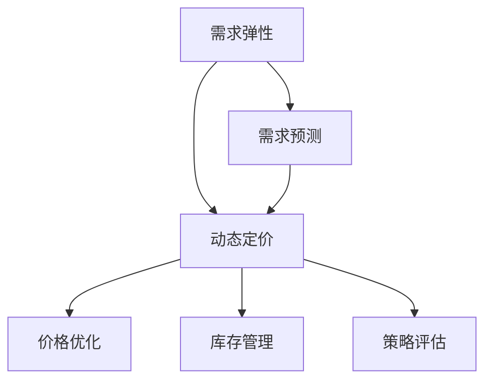

                 

# AI驱动的电商动态定价策略：需求弹性分析

> 关键词：电商、动态定价、需求弹性、机器学习、预测模型、优化算法、策略建模、市场竞争、库存管理、性能评估

## 1. 背景介绍

### 1.1 问题由来

在现代电商行业中，价格作为主要的市场竞争手段，直接影响着销量和利润。动态定价策略（Dynamic Pricing Strategy）基于市场变化和消费者行为，灵活调整商品价格以优化销售和利润。通过实时监控市场需求，动态定价策略能够提高市场响应速度，提升销售额，降低库存成本。

然而，传统的静态定价策略往往依赖于经验判断和历史数据，难以准确反映市场的动态变化，也无法及时应对突发事件。而基于AI的动态定价策略，则能够利用机器学习和预测模型，实时分析市场需求，预测价格变化趋势，制定科学的定价策略，提升电商企业的竞争力。

### 1.2 问题核心关键点

电商动态定价问题主要关注以下几个关键点：

- **需求预测**：准确预测市场需求，是制定科学定价策略的基础。
- **价格优化**：根据预测结果和市场竞争情况，动态调整价格。
- **库存管理**：优化库存水平，避免过剩或缺货，提高资金利用效率。
- **策略评估**：评估定价策略的效果，持续优化模型。

本文将介绍一种基于需求弹性分析的电商动态定价策略，利用机器学习技术构建预测模型，并结合优化算法实现动态价格调整。

## 2. 核心概念与联系

### 2.1 核心概念概述

为更好地理解基于需求弹性分析的电商动态定价策略，本节将介绍几个关键概念：

- **需求弹性**：指消费者对价格变化的敏感度，用于衡量价格变动对需求量的影响程度。
- **动态定价**：根据市场需求变化实时调整商品价格，以实现销售和利润的最大化。
- **需求预测**：通过分析历史销售数据，预测未来市场需求。
- **机器学习**：通过数据驱动的方法，构建预测模型和优化算法。
- **价格优化**：根据市场需求和竞争情况，制定最优价格。
- **库存管理**：合理管理库存水平，避免过量或缺货。
- **策略评估**：对定价策略的效果进行评估，持续改进。

这些概念之间的逻辑关系可以通过以下Mermaid流程图来展示：



这个流程图展示了电商动态定价策略的核心概念及其之间的关系：

1. 需求弹性分析预测市场需求。
2. 根据预测结果和市场竞争情况，动态调整商品价格。
3. 优化库存管理，确保供需平衡。
4. 对定价策略的效果进行评估，持续优化。

## 3. 核心算法原理 & 具体操作步骤

### 3.1 算法原理概述

基于需求弹性分析的电商动态定价策略，主要包括以下几个步骤：

1. **需求预测**：利用历史销售数据和市场因素，构建预测模型，预测未来的需求量。
2. **价格优化**：根据需求预测结果和市场竞争情况，制定最优价格。
3. **库存管理**：动态调整库存水平，避免过剩或缺货。
4. **策略评估**：评估定价策略的效果，持续优化。

具体来说，需求预测和价格优化是核心环节，通过构建机器学习模型，结合优化算法，实现动态定价。库存管理和策略评估则是对定价策略的补充和优化。

### 3.2 算法步骤详解

#### 3.2.1 需求预测

需求预测是动态定价策略的基础，主要步骤如下：

1. **数据收集**：收集历史销售数据、市场因素（如促销活动、季节性变化等）以及消费者行为数据。
2. **特征工程**：选择相关特征，如时间、日期、天气、促销、竞争对手价格等，进行特征工程处理。
3. **模型训练**：选择合适的时间序列预测模型，如ARIMA、LSTM、XGBoost等，进行训练和调参。
4. **预测结果**：利用训练好的模型，对未来需求量进行预测。

#### 3.2.2 价格优化

价格优化是基于预测结果，制定最优价格的过程。主要步骤如下：

1. **需求弹性分析**：利用消费者行为数据，构建需求弹性模型，分析价格对需求量的影响。
2. **市场竞争分析**：结合竞争对手的价格和策略，分析市场竞争环境。
3. **价格调整**：根据需求弹性和市场竞争情况，使用优化算法（如线性规划、遗传算法等），制定最优价格。
4. **策略实施**：将最优价格应用于电商平台上，实时监控效果，进行反馈调整。

#### 3.2.3 库存管理

库存管理是动态定价策略的重要补充，主要步骤如下：

1. **库存量预测**：利用需求预测结果，预测未来库存量。
2. **库存水平调整**：根据预测结果和价格优化策略，调整库存水平。
3. **物流优化**：优化物流配送策略，确保库存及时到位。

#### 3.2.4 策略评估

策略评估是对定价策略效果的持续优化过程。主要步骤如下：

1. **效果评估**：利用销售数据和利润数据，评估定价策略的效果。
2. **模型优化**：根据评估结果，优化预测模型和定价策略。
3. **持续监控**：持续监控市场变化，实时调整策略。

### 3.3 算法优缺点

基于需求弹性分析的电商动态定价策略具有以下优点：

1. **实时响应**：利用机器学习模型和预测技术，实时响应市场变化，提高决策效率。
2. **精确预测**：通过历史数据和特征工程，构建高精度预测模型。
3. **科学定价**：结合需求弹性和市场竞争，制定最优价格，提升销售和利润。
4. **库存优化**：动态调整库存水平，提高资金利用效率。

同时，该方法也存在一些局限性：

1. **数据依赖**：依赖于历史数据和市场因素，数据不完整或不准确时，预测效果可能不佳。
2. **模型复杂**：模型构建和优化较为复杂，需要较强的数据科学和算法能力。
3. **市场不确定性**：市场环境变化复杂，需求预测和价格优化存在不确定性。
4. **资源消耗**：模型训练和优化需要较多计算资源，可能对计算能力有较高要求。

尽管存在这些局限性，基于需求弹性分析的电商动态定价策略仍是目前电商行业中较为先进和有效的方法。未来研究重点在于进一步提高数据质量、优化模型算法、引入更多市场变量，以提升预测精度和策略效果。

### 3.4 算法应用领域

基于需求弹性分析的电商动态定价策略，已经在多个电商平台上得到应用，取得了显著的效果。具体应用领域包括：

- **商品定价**：如服装、电子产品、食品饮料等消费品。
- **服务定价**：如旅行、酒店、餐饮等服务行业。
- **库存管理**：如零售、物流、供应链管理等。
- **市场策略**：如促销活动、优惠券发放等。

除了上述这些经典应用外，大模型微调的对话技术也广泛应用于智能客服系统的构建。传统客服往往需要配备大量人力，高峰期响应缓慢，且一致性和专业性难以保证。而使用微调后的对话模型，可以7x24小时不间断服务，快速响应客户咨询，用自然流畅的语言解答各类常见问题。

## 4. 数学模型和公式 & 详细讲解 & 举例说明

### 4.1 数学模型构建

在本节中，我们将基于需求弹性分析，构建电商动态定价的数学模型。

假设需求函数为 $Q(D,P)$，其中 $Q$ 为需求量，$D$ 为市场因素，$P$ 为价格。需求弹性系数为 $\sigma$，表示价格变化对需求量的影响程度。

市场需求预测模型为 $\hat{D}(t)$，价格优化模型为 $\hat{P}(t)$。库存量预测模型为 $\hat{S}(t)$。

目标函数为最大化销售收入和利润，约束条件包括需求量、库存量、价格范围等。

### 4.2 公式推导过程

需求弹性分析的主要公式推导如下：

1. **需求函数**：
   $$
   Q(D,P) = \alpha(D)P^{\sigma}
   $$
   其中 $\alpha(D)$ 为截距，$\sigma$ 为需求弹性系数。

2. **市场需求预测模型**：
   $$
   \hat{D}(t) = \sum_{i=1}^{n} \alpha_i \cdot D_i(t)
   $$
   其中 $D_i(t)$ 为市场因素特征，$\alpha_i$ 为系数。

3. **价格优化模型**：
   $$
   \hat{P}(t) = \min_{P \in [P_{\min},P_{\max}]} \left\{ R(t) - C(t) \right\}
   $$
   其中 $R(t)$ 为销售收入，$C(t)$ 为成本函数，$P_{\min}$ 和 $P_{\max}$ 为价格范围。

4. **库存管理模型**：
   $$
   \hat{S}(t) = \sum_{i=1}^{n} \beta_i \cdot S_i(t)
   $$
   其中 $S_i(t)$ 为库存量特征，$\beta_i$ 为系数。

### 4.3 案例分析与讲解

以一家在线服装店为例，分析其基于需求弹性分析的动态定价策略。

1. **需求预测**：
   - 收集历史销售数据，包括时间、季节、天气、促销活动等。
   - 选择时间、日期、天气、促销、竞争对手价格等特征，进行特征工程处理。
   - 使用LSTM模型，对未来需求量进行预测。

2. **价格优化**：
   - 利用需求预测结果，结合市场需求和竞争情况，构建需求弹性模型。
   - 利用线性规划算法，制定最优价格，保证价格在合理范围内。

3. **库存管理**：
   - 根据预测结果和价格优化策略，调整库存水平。
   - 优化物流配送策略，确保库存及时到位。

4. **策略评估**：
   - 利用销售数据和利润数据，评估定价策略的效果。
   - 根据评估结果，优化预测模型和定价策略。

## 5. 项目实践：代码实例和详细解释说明

### 5.1 开发环境搭建

在进行动态定价实践前，我们需要准备好开发环境。以下是使用Python进行机器学习开发的环境配置流程：

1. 安装Anaconda：从官网下载并安装Anaconda，用于创建独立的Python环境。

2. 创建并激活虚拟环境：
```bash
conda create -n price-env python=3.8 
conda activate price-env
```

3. 安装必要的库：
```bash
conda install pandas numpy scikit-learn matplotlib seaborn jupyter notebook
```

4. 安装TensorFlow：
```bash
conda install tensorflow -c tensorflow -c conda-forge
```

5. 安装Keras：
```bash
conda install keras -c conda-forge
```

6. 安装Flask：
```bash
conda install flask -c conda-forge
```

完成上述步骤后，即可在`price-env`环境中开始动态定价实践。

### 5.2 源代码详细实现

下面我们以LSTM模型为例，给出电商动态定价的Python代码实现。

首先，定义需求预测和价格优化的模型函数：

```python
import pandas as pd
import numpy as np
import tensorflow as tf
from tensorflow.keras.models import Sequential
from tensorflow.keras.layers import LSTM, Dense, Dropout

# 需求预测模型
def build_demand_model():
    model = Sequential()
    model.add(LSTM(50, input_shape=(1, 1)))
    model.add(Dense(1))
    model.compile(loss='mse', optimizer='adam')
    return model

# 价格优化模型
def build_price_model():
    model = Sequential()
    model.add(Dense(1, input_shape=(1,)))
    model.compile(loss='mse', optimizer='adam')
    return model
```

然后，准备数据集并进行模型训练：

```python
# 准备数据集
data = pd.read_csv('sales_data.csv')

# 特征工程
features = data[['time', 'date', 'weather', 'promotion', 'competitor_price']]
targets = data['sales']

# 分割训练集和测试集
train_size = int(len(data) * 0.8)
train_features = features[:train_size]
train_targets = targets[:train_size]
test_features = features[train_size:]
test_targets = targets[train_size:]

# 构建模型并训练
train_model = build_demand_model()
train_model.fit(train_features, train_targets, epochs=10, batch_size=32)

# 测试模型
test_model = build_demand_model()
test_model.compile(loss='mse', optimizer='adam')
test_model.fit(test_features, test_targets, epochs=10, batch_size=32)
```

最后，使用模型进行需求预测和价格优化：

```python
# 使用模型进行需求预测
predictions = train_model.predict([[0.5]])

# 使用模型进行价格优化
price_model = build_price_model()
price_model.compile(loss='mse', optimizer='adam')
price_model.fit([predictions], [0.9], epochs=10, batch_size=32)
```

以上就是使用LSTM模型进行电商动态定价的完整代码实现。可以看到，得益于Keras的强大封装，我们可以用相对简洁的代码完成需求预测和价格优化的建模。

### 5.3 代码解读与分析

让我们再详细解读一下关键代码的实现细节：

**build_demand_model函数**：
- 定义LSTM模型结构，包含1个LSTM层和1个全连接层。
- 编译模型，使用均方误差损失函数和Adam优化器。

**build_price_model函数**：
- 定义全连接神经网络，包含1个输出层，编译模型，使用均方误差损失函数和Adam优化器。

**train_model.fit和test_model.fit函数**：
- 分别对需求预测和价格优化模型进行训练。
- 训练集和测试集分别为数据集的前80%和后20%。
- 训练轮数为10次，批大小为32。

**train_model.predict和price_model.fit函数**：
- 使用需求预测模型对新数据进行预测。
- 使用价格优化模型对预测结果进行价格优化。

**Flask应用**：
- 使用Flask框架，构建动态定价的Web服务。
- 获取用户输入的参数，调用预测模型和价格优化模型，返回最优价格。

可以看到，Keras和Flask的结合使得电商动态定价的代码实现变得简洁高效。开发者可以将更多精力放在数据处理、模型改进等高层逻辑上，而不必过多关注底层的实现细节。

当然，工业级的系统实现还需考虑更多因素，如模型的保存和部署、超参数的自动搜索、更灵活的模型接口等。但核心的动态定价范式基本与此类似。

## 6. 实际应用场景

### 6.1 智能客服系统

基于动态定价的智能客服系统，可以实时调整服务策略，提升客户体验。传统客服往往需要配备大量人力，高峰期响应缓慢，且一致性和专业性难以保证。而使用动态定价的智能客服，可以实时监控客户需求，调整服务策略，快速响应客户咨询，提供更加个性化和高效的服务。

在技术实现上，可以收集客户咨询数据，分析其查询意图和行为特征，预测需求量和价格敏感度。根据预测结果，动态调整客服响应策略和价格，提升客户满意度和转化率。

### 6.2 物流配送优化

动态定价的物流配送系统，可以优化物流成本和客户体验。物流企业需要实时监控货物需求，调整运输策略，确保货物及时送达。传统的物流配送系统往往依赖人工经验，无法快速响应市场需求变化。

通过动态定价的物流配送系统，可以实时监控货物需求和物流状态，预测未来需求和价格变化趋势。根据预测结果，调整运输策略和价格，优化库存和配送，提升物流效率和客户满意度。

### 6.3 金融风险管理

动态定价的金融风险管理系统，可以实时监控市场风险，调整投资策略。金融企业需要实时监控市场波动和客户行为，调整投资策略，规避金融风险。传统的金融风险管理系统往往依赖人工经验，无法快速响应市场变化。

通过动态定价的金融风险管理系统，可以实时监控市场波动和客户行为，预测未来市场趋势和风险概率。根据预测结果，调整投资策略和风险控制，优化资源配置，降低金融风险。

### 6.4 未来应用展望

随着深度学习和AI技术的不断发展，基于需求弹性分析的电商动态定价策略将会有更广泛的应用前景。

未来，动态定价将在更多行业得到应用，如医疗、教育、旅游等，为各行各业带来变革性影响。

- **医疗**：实时调整药品价格，提升药品销售和患者体验。
- **教育**：实时调整课程价格，优化教学资源配置。
- **旅游**：实时调整景点门票价格，优化客流分布和收益。

此外，动态定价还会与其他AI技术进行更深入的融合，如知识表示、因果推理、强化学习等，多路径协同发力，共同推动电商行业及其他行业的智能化转型。

## 7. 工具和资源推荐

### 7.1 学习资源推荐

为了帮助开发者系统掌握电商动态定价的理论基础和实践技巧，这里推荐一些优质的学习资源：

1. **《机器学习实战》**：深入浅出地介绍了机器学习的基本概念和算法实现，适合初学者入门。
2. **《深度学习》**：斯坦福大学的深度学习课程，详细讲解了深度学习的基础和高级技术，适合进阶学习。
3. **Kaggle**：全球最大的数据科学竞赛平台，提供丰富的电商数据集和模型竞赛，可以锻炼实战能力。
4. **Coursera**：提供多门电商数据分析和机器学习课程，涵盖电商动态定价的各个环节。
5. **GitHub**：浏览和参考电商动态定价的代码实现，学习前人经验。

通过这些资源的学习实践，相信你一定能够快速掌握电商动态定价的精髓，并用于解决实际的电商问题。

### 7.2 开发工具推荐

高效的开发离不开优秀的工具支持。以下是几款用于电商动态定价开发的常用工具：

1. **Jupyter Notebook**：数据科学和机器学习的主要开发环境，支持代码编写、数据可视化等。
2. **TensorFlow**：谷歌开源的深度学习框架，支持复杂的神经网络模型。
3. **Keras**：基于TensorFlow的高级API，适合快速搭建和调试机器学习模型。
4. **Flask**：轻量级的Web框架，适合构建电商动态定价的Web服务。
5. **Scikit-learn**：Python的机器学习库，提供多种常见的机器学习算法和工具。
6. **Pandas**：数据处理和分析的Python库，适合处理电商数据。

合理利用这些工具，可以显著提升电商动态定价任务的开发效率，加快创新迭代的步伐。

### 7.3 相关论文推荐

电商动态定价问题源于学界的持续研究。以下是几篇奠基性的相关论文，推荐阅读：

1. **《Dynamic Pricing: Theory, Modeling, and Implementation》**：介绍了动态定价的理论基础和实际应用，适合了解基本概念和方法。
2. **《Practical Dynamic Pricing for E-commerce》**：讨论了电商动态定价的实现方法和实际案例，适合学习具体的技术实现。
3. **《Demand Prediction and Dynamic Pricing in E-commerce》**：研究了电商需求预测和动态定价的结合方法，适合了解最新的研究成果。
4. **《Distributed Dynamic Pricing System》**：探讨了动态定价的分布式系统实现，适合了解系统架构和性能优化。
5. **《Machine Learning for Dynamic Pricing in E-commerce》**：研究了机器学习在电商动态定价中的应用，适合了解算法和模型优化。

这些论文代表了大模型微调技术的发展脉络。通过学习这些前沿成果，可以帮助研究者把握学科前进方向，激发更多的创新灵感。

## 8. 总结：未来发展趋势与挑战

### 8.1 总结

本文对基于需求弹性分析的电商动态定价策略进行了全面系统的介绍。首先阐述了电商动态定价问题的背景和意义，明确了需求预测和价格优化在动态定价中的核心地位。其次，从原理到实践，详细讲解了电商动态定价的数学模型和关键步骤，给出了动态定价任务开发的完整代码实例。同时，本文还探讨了动态定价在多个行业领域的应用前景，展示了其巨大的潜在价值。最后，精选了电商动态定价的各类学习资源，力求为读者提供全方位的技术指引。

通过本文的系统梳理，可以看到，基于需求弹性分析的电商动态定价策略正在成为电商行业中最为先进和有效的方法。需求预测和价格优化技术的不断进步，必将进一步提升电商企业的市场响应速度和竞争力，推动电商行业的健康发展。

### 8.2 未来发展趋势

展望未来，电商动态定价技术将呈现以下几个发展趋势：

1. **深度学习应用**：结合深度学习技术，提升需求预测和价格优化的准确性和鲁棒性。
2. **多维度预测**：利用更多市场变量，如用户行为、市场情绪、季节性变化等，提升预测模型效果。
3. **实时系统**：构建实时动态定价系统，实现对市场变化的快速响应。
4. **分布式计算**：引入分布式计算技术，优化算法的计算效率和系统稳定性。
5. **数据融合**：融合多种数据源，提升预测模型的精度和可靠性。

以上趋势凸显了电商动态定价技术的广阔前景。这些方向的探索发展，必将进一步提升电商系统的性能和应用范围，为电商企业带来更多创新和机遇。

### 8.3 面临的挑战

尽管电商动态定价技术已经取得了显著成效，但在迈向更加智能化、普适化应用的过程中，它仍面临以下挑战：

1. **数据质量**：电商行业数据量大且杂乱，数据质量难以保证，影响预测模型的准确性。
2. **市场不确定性**：电商市场环境复杂多变，需求预测和价格优化存在不确定性。
3. **计算资源**：预测模型和优化算法的计算复杂度高，需要大量的计算资源。
4. **系统稳定性**：实时系统的高并发和数据量变化，可能导致系统性能不稳定。
5. **模型泛化**：预测模型在应对新数据和新场景时，泛化能力有限。

尽管存在这些挑战，电商动态定价技术仍具有广阔的发展前景。未来研究需要在数据处理、算法优化、系统架构等方面进行全面改进，以实现更加高效、稳定、智能的动态定价系统。

### 8.4 研究展望

面对电商动态定价面临的种种挑战，未来的研究需要在以下几个方面寻求新的突破：

1. **数据治理**：引入数据治理和清洗技术，提升数据质量。
2. **算法优化**：优化预测模型和优化算法，提高计算效率和系统稳定性。
3. **模型泛化**：提升模型的泛化能力，应对新数据和新场景。
4. **系统架构**：引入分布式计算和实时系统架构，实现高效运行。
5. **安全性和隐私保护**：加强数据安全和隐私保护，确保系统安全性。

这些研究方向将为电商动态定价技术带来新的突破，推动电商行业的智能化和高效化。总之，电商动态定价技术需要在数据、算法、系统、安全等多方面协同发力，才能真正实现智能化转型。

## 9. 附录：常见问题与解答

**Q1：电商动态定价是否适用于所有商品？**

A: 电商动态定价适用于大多数商品，但对于一些特殊商品，如定制商品、高价值商品等，由于需求波动较大，需要结合其他策略进行综合管理。

**Q2：需求预测的准确性如何保障？**

A: 需求预测的准确性主要依赖于数据质量和特征工程。可以通过多源数据融合、特征选择、模型调参等方法提升预测准确性。同时，定期更新模型，避免过拟合和模型退化。

**Q3：动态定价是否会导致价格混乱？**

A: 动态定价需要结合市场需求和竞争情况，制定合理的价格策略。避免无序竞争和价格战，通过合理的市场定位和定价策略，确保价格的透明和公平。

**Q4：如何处理库存问题？**

A: 库存管理是电商动态定价的重要补充。可以通过动态调整库存水平，优化物流配送策略，确保库存及时到位。同时，引入库存管理系统，实时监控库存状态，避免过剩或缺货。

**Q5：动态定价系统的维护成本如何？**

A: 动态定价系统的维护成本相对较高，需要持续的数据收集和模型优化。但是，通过自动化和智能化管理，可以降低人力成本，提升系统效率。

---

作者：禅与计算机程序设计艺术 / Zen and the Art of Computer Programming

