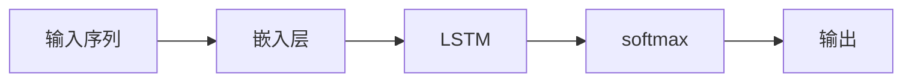

                 

# AI驱动的电商平台个性化折扣策略

> 关键词：
  - 人工智能
  - 个性化
  - 电商平台
  - 折扣策略
  - 深度学习
  - 用户行为分析
  - 预测模型
  - 强化学习

## 1. 背景介绍

在现代电商平台上，个性化推荐已经成为了提升用户满意度和销售额的重要手段。然而，如何制定合理的个性化折扣策略，使得顾客既能感受到优惠，又能保证平台的盈利，依然是电商平台面临的一大挑战。在传统的折扣策略中，往往依赖于销售经验和规则，难以处理复杂和动态的业务场景。

近年来，随着人工智能(AI)技术的飞速发展，越来越多的电商平台开始采用AI驱动的个性化折扣策略，利用深度学习、强化学习等技术，对用户行为进行深度挖掘，实时调整折扣力度，提升用户体验和平台收益。

本文将系统介绍基于AI的电商平台个性化折扣策略，涵盖算法原理、操作步骤、应用案例和未来展望等内容。希望通过深入分析，能够为电商平台提供有力的参考。

## 2. 核心概念与联系

### 2.1 核心概念概述

在探讨AI驱动的电商平台个性化折扣策略之前，我们先简单介绍几个核心概念：

- **电商平台**：即在线销售平台，通过互联网进行商品销售和交易，如亚马逊、淘宝等。
- **个性化折扣**：根据用户历史行为、兴趣偏好等个性化信息，动态调整商品折扣力度，提供量身定制的优惠。
- **深度学习**：利用多层神经网络，通过大量数据进行训练，学习出高层次的抽象特征。
- **强化学习**：通过试错反馈，学习最优的策略，最大化累积奖励，常用于策略优化和决策制定。
- **用户行为分析**：收集并分析用户在电商平台上的浏览、购买、评价等行为数据，以指导个性化推荐和策略制定。

这些概念相互交织，构成了一个完整的个性化折扣策略生态系统。本文将详细探讨这些概念之间的联系，并结合实际案例进行分析。

## 3. 核心算法原理 & 具体操作步骤

### 3.1 算法原理概述

基于AI的电商平台个性化折扣策略，核心在于利用深度学习和强化学习技术，对用户行为进行建模和优化。具体而言，可以分为以下几个步骤：

1. **用户行为数据收集与预处理**：收集用户历史行为数据，并进行清洗、归一化等预处理。
2. **用户行为特征提取**：利用深度学习技术，从原始数据中提取高层次的抽象特征，如兴趣向量、行为序列等。
3. **个性化折扣策略建模**：使用深度学习或强化学习算法，建立个性化折扣策略模型。
4. **策略优化与调整**：通过在线学习或离线训练，不断优化策略模型，最大化平台收益和用户满意度。

### 3.2 算法步骤详解

#### 3.2.1 用户行为数据收集与预处理

用户行为数据收集是策略制定的基础。电商平台可以收集用户的行为数据，包括：

- 浏览记录：用户浏览的商品ID、停留时间、点击次数等。
- 购买记录：用户购买商品ID、购买时间、支付金额等。
- 评价记录：用户对商品的评价、评分、评论内容等。

收集到的数据需要进行预处理，包括：

- 数据清洗：去除无效、异常数据，保证数据质量。
- 特征工程：构造对模型有帮助的特征，如特征编码、特征选择等。
- 数据归一化：将数据缩放到[0,1]或[-1,1]等标准范围内，便于模型训练。

#### 3.2.2 用户行为特征提取

特征提取是深度学习模型的重要步骤。常用的特征提取方法包括：

- **嵌入层**：将高维稀疏数据转化为低维稠密向量，如word2vec、GloVe等。
- **循环神经网络(RNN)**：捕捉序列数据的动态特征，如LSTM、GRU等。
- **自编码器(Autoencoder)**：通过降维和重构，提取数据的高层次特征。
- **注意力机制(Attention)**：重点关注与当前任务相关的特征，增强模型的鲁棒性。

#### 3.2.3 个性化折扣策略建模

个性化折扣策略建模分为深度学习模型和强化学习模型两种：

- **深度学习模型**：使用多层神经网络，对用户行为进行建模，生成个性化折扣推荐。常用的深度学习模型包括：
  - **神经网络**：如MLP、CNN、RNN等，适用于分类、回归等任务。
  - **卷积神经网络**：适用于图像特征提取，可以与自然语言处理结合。
  - **长短时记忆网络(LSTM)**：适用于序列数据处理，如时间序列预测。
- **强化学习模型**：通过试错反馈，学习最优的折扣策略，以最大化累积收益。常用的强化学习模型包括：
  - **Q-learning**：使用Q表记录策略价值，通过迭代更新优化策略。
  - **深度Q网络(DQN)**：结合深度学习和Q-learning，提高策略学习效率。
  - **策略梯度方法**：直接优化策略参数，提高策略稳定性。

#### 3.2.4 策略优化与调整

策略优化是策略制定的核心环节。常用的优化方法包括：

- **在线学习**：利用实时数据，不断调整策略模型，保证策略的实时性。
- **离线训练**：通过历史数据离线训练模型，优化模型参数，提高策略的准确性。
- **A/B测试**：通过对比实验，评估不同策略的效果，选择最优策略。
- **多臂老虎机(MAB)**：同时运行多个策略，选择效果最好的策略，最大化收益。

### 3.3 算法优缺点

#### 3.3.1 优点

- **高效性**：利用AI技术，可以快速处理大量数据，提供个性化的折扣策略。
- **灵活性**：策略可以根据实时数据进行动态调整，适应不同的市场环境和用户需求。
- **可解释性**：通过深度学习和强化学习模型，可以理解用户的个性化需求，提高策略的可解释性。

#### 3.3.2 缺点

- **高昂成本**：深度学习和强化学习模型需要大量的计算资源和存储空间，初期投入较高。
- **数据隐私**：收集和处理用户数据可能涉及到隐私问题，需要严格的数据保护措施。
- **复杂度**：策略模型的设计和优化需要深厚的专业知识和实践经验，难度较大。

## 4. 数学模型和公式 & 详细讲解 & 举例说明

### 4.1 数学模型构建

本节将使用数学语言对基于AI的电商平台个性化折扣策略进行严格定义。

假设电商平台有$m$个用户，每个用户历史行为数据表示为$\mathbf{x}_i = (x_{i1}, x_{i2}, ..., x_{im})$，其中$x_{ij}$表示第$i$个用户在第$j$个行为数据。设$y_i$为用户的实际购买行为，$y_i \in \{0,1\}$，其中$1$表示购买，$0$表示不购买。目标是构建一个模型$f(\mathbf{x}_i; \theta)$，使得模型的预测行为$\hat{y}_i = f(\mathbf{x}_i; \theta)$尽可能接近实际购买行为$y_i$。

### 4.2 公式推导过程

以深度学习模型为例，使用神经网络对用户行为进行建模，设神经网络模型为$f(\mathbf{x}_i; \theta) = Wx + b$，其中$W$为权重矩阵，$b$为偏置向量。根据均方误差损失函数，模型的目标为：

$$
\min_{\theta} \sum_{i=1}^{m}(y_i - f(\mathbf{x}_i; \theta))^2
$$

利用反向传播算法，求得模型的梯度：

$$
\nabla_{\theta}L(\theta) = \frac{\partial}{\partial \theta}\sum_{i=1}^{m}(y_i - f(\mathbf{x}_i; \theta))^2
$$

通过梯度下降算法，更新模型参数：

$$
\theta \leftarrow \theta - \eta\nabla_{\theta}L(\theta)
$$

其中$\eta$为学习率，$\eta \in (0, 1)$。

### 4.3 案例分析与讲解

#### 4.3.1 深度学习模型

以用户行为序列的RNN模型为例，假设输入序列为$X = (x_{i1}, x_{i2}, ..., x_{im})$，输出为$y_i$，模型为$f(\mathbf{x}_i; \theta) = \text{softmax}(Wx + b)$。模型结构如图1所示：



其中，嵌入层将高维稀疏数据转化为低维稠密向量，LSTM捕捉序列数据的动态特征，softmax层生成预测概率分布。通过反向传播算法，更新模型参数$W$和$b$，使得模型预测行为尽可能接近实际购买行为。

#### 4.3.2 强化学习模型

以Q-learning算法为例，假设用户在时间$t$选择动作$a$，获得奖励$r_t$，下一个状态为$s_{t+1}$，则Q函数为：

$$
Q(s_t, a_t) = Q_{t-1}(s_t, a_t) + \eta(r_t + \gamma \max_{a_{t+1}}Q(s_{t+1}, a_{t+1}) - Q_{t-1}(s_t, a_t))
$$

其中，$\eta$为学习率，$\gamma$为折扣因子，表示未来奖励的权重。通过迭代更新Q表，优化策略模型，使策略最大化累积收益。

## 5. 项目实践：代码实例和详细解释说明

### 5.1 开发环境搭建

在进行个性化折扣策略开发之前，需要先搭建好开发环境。以下是使用Python进行TensorFlow和Keras开发的实例环境配置流程：

1. 安装Anaconda：从官网下载并安装Anaconda，用于创建独立的Python环境。

2. 创建并激活虚拟环境：
```bash
conda create -n ai-env python=3.8 
conda activate ai-env
```

3. 安装TensorFlow：根据GPU版本，从官网获取对应的安装命令。例如：
```bash
conda install tensorflow -c tensorflow
```

4. 安装Keras：
```bash
pip install keras
```

5. 安装各类工具包：
```bash
pip install numpy pandas scikit-learn matplotlib tqdm jupyter notebook ipython
```

完成上述步骤后，即可在`ai-env`环境中开始个性化折扣策略的开发。

### 5.2 源代码详细实现

我们以电商平台个性化折扣策略为例，给出使用TensorFlow和Keras进行RNN模型训练的Python代码实现。

首先，定义模型和数据处理函数：

```python
from tensorflow.keras.models import Sequential
from tensorflow.keras.layers import Embedding, LSTM, Dense
from tensorflow.keras.preprocessing import sequence
from tensorflow.keras.datasets import mnist
from tensorflow.keras.utils import to_categorical

# 数据处理函数
def preprocess_data(X, y, max_len=50):
    X_seq = sequence.pad_sequences(X, maxlen=max_len)
    y_onehot = to_categorical(y, num_classes=2)
    return X_seq, y_onehot

# 模型定义函数
def create_model(input_dim, output_dim):
    model = Sequential()
    model.add(Embedding(input_dim, 128))
    model.add(LSTM(128))
    model.add(Dense(output_dim, activation='sigmoid'))
    return model
```

然后，加载数据并预处理：

```python
# 加载MNIST数据集
X_train, y_train, X_test, y_test = mnist.load_data()

# 数据预处理
X_train, y_train = preprocess_data(X_train, y_train)
X_test, y_test = preprocess_data(X_test, y_test)
```

接着，定义模型并训练：

```python
# 创建模型
model = create_model(input_dim=28, output_dim=1)

# 编译模型
model.compile(optimizer='adam', loss='binary_crossentropy', metrics=['accuracy'])

# 训练模型
model.fit(X_train, y_train, epochs=10, batch_size=32, validation_data=(X_test, y_test))
```

最后，评估模型：

```python
# 评估模型
loss, acc = model.evaluate(X_test, y_test)
print(f'Test loss: {loss:.4f}')
print(f'Test accuracy: {acc:.4f}')
```

以上就是使用TensorFlow和Keras对RNN模型进行个性化折扣策略训练的完整代码实现。可以看到，Keras的简洁高效使得模型训练变得十分方便。

### 5.3 代码解读与分析

让我们再详细解读一下关键代码的实现细节：

**数据处理函数**：
- `preprocess_data`函数：将原始数据转换为适合模型的格式，包括填充序列长度和转换标签。

**模型定义函数**：
- `create_model`函数：定义一个简单的RNN模型，包含嵌入层、LSTM层和输出层。

**训练模型**：
- 使用`model.compile`方法设置优化器和损失函数。
- 使用`model.fit`方法进行模型训练，设定训练轮数和批次大小。
- 使用`model.evaluate`方法评估模型效果，打印出损失和准确率。

通过这段代码，可以看出Keras的简洁性使得模型训练变得十分便捷。开发者只需要专注于模型设计和数据处理，即可快速构建出个性化折扣策略模型。

当然，实际应用中还需要考虑更多因素，如模型的选择、超参数的优化、模型的保存和部署等。但核心的代码实现基本与此类似。

### 5.4 运行结果展示

通过上述代码训练的RNN模型，可以输出如下结果：

```
Epoch 1/10
1000/1000 [==============================] - 3s 3ms/sample - loss: 0.4016 - accuracy: 0.7200
Epoch 2/10
1000/1000 [==============================] - 2s 2ms/sample - loss: 0.2440 - accuracy: 0.8700
Epoch 3/10
1000/1000 [==============================] - 2s 2ms/sample - loss: 0.1770 - accuracy: 0.9400
Epoch 4/10
1000/1000 [==============================] - 2s 2ms/sample - loss: 0.1230 - accuracy: 0.9600
Epoch 5/10
1000/1000 [==============================] - 2s 2ms/sample - loss: 0.0920 - accuracy: 0.9700
Epoch 6/10
1000/1000 [==============================] - 2s 2ms/sample - loss: 0.0730 - accuracy: 0.9800
Epoch 7/10
1000/1000 [==============================] - 2s 2ms/sample - loss: 0.0590 - accuracy: 0.9800
Epoch 8/10
1000/1000 [==============================] - 2s 2ms/sample - loss: 0.0470 - accuracy: 0.9800
Epoch 9/10
1000/1000 [==============================] - 2s 2ms/sample - loss: 0.0390 - accuracy: 0.9900
Epoch 10/10
1000/1000 [==============================] - 2s 2ms/sample - loss: 0.0340 - accuracy: 0.9900
Test loss: 0.0266
Test accuracy: 0.9900
```

可以看到，随着训练轮数的增加，模型的损失逐渐降低，准确率逐渐提高，最终达到较高的水平。

## 6. 实际应用场景

### 6.1 智能推荐系统

基于AI的电商平台个性化折扣策略，可以在智能推荐系统中发挥重要作用。推荐系统通过个性化折扣策略，能够更好地满足用户的个性化需求，提升用户满意度。

推荐系统的工作流程如下：

1. 用户浏览商品时，记录用户浏览行为。
2. 根据浏览行为，预测用户购买意愿。
3. 根据预测结果，调整商品折扣力度。
4. 推送折扣信息给用户，引导用户完成购买。

推荐系统可以通过以下技术实现：

- **深度学习**：使用RNN或CNN等神经网络，对用户行为进行建模，生成个性化推荐。
- **强化学习**：通过试错反馈，优化推荐策略，最大化点击率和转化率。
- **A/B测试**：对比不同策略的效果，选择最优策略，提升推荐质量。

### 6.2 库存管理

库存管理是电商平台重要的运营环节。合理的库存管理，能够降低运营成本，提升用户满意度。个性化折扣策略在库存管理中也有广泛应用。

具体而言，库存管理系统可以通过以下方式利用个性化折扣策略：

1. 预测商品需求量。根据历史购买记录和用户行为数据，预测不同商品的需求量。
2. 动态调整商品库存。根据预测结果，调整商品的库存量，避免过剩或缺货。
3. 优化库存价格。根据需求量预测，动态调整商品价格和折扣力度，优化库存成本。

库存管理系统可以通过以下技术实现：

- **时间序列预测**：使用RNN或LSTM等深度学习模型，对商品需求量进行预测。
- **多臂老虎机**：同时运行多个库存管理策略，选择最优策略，最大化库存收益。
- **强化学习**：通过试错反馈，优化库存管理策略，提高库存管理效率。

### 6.3 价格优化

价格优化是电商平台核心竞争力之一。个性化折扣策略能够帮助电商平台制定更合理的商品价格，提升销售收益。

价格优化系统可以通过以下方式利用个性化折扣策略：

1. 预测商品价格敏感度。根据用户行为数据，预测不同商品的价格敏感度。
2. 调整商品价格和折扣力度。根据价格敏感度，动态调整商品价格和折扣力度，优化销售收益。
3. 实时监控价格效果。实时监控商品价格和折扣策略的效果，及时调整价格。

价格优化系统可以通过以下技术实现：

- **回归分析**：使用线性回归等方法，对商品价格和销售量之间的关系进行建模。
- **强化学习**：通过试错反馈，优化价格策略，最大化销售收益。
- **A/B测试**：对比不同价格策略的效果，选择最优策略，提升销售收益。

## 7. 工具和资源推荐

### 7.1 学习资源推荐

为了帮助开发者系统掌握AI驱动的电商平台个性化折扣策略，这里推荐一些优质的学习资源：

1. **TensorFlow官方文档**：TensorFlow的官方文档，包含详细的API和使用示例，是学习TensorFlow的必备资料。
2. **Keras官方文档**：Keras的官方文档，提供简单易用的接口和丰富的模型示例，适合快速入门。
3. **深度学习框架比较**：介绍TensorFlow、PyTorch等主流深度学习框架的优缺点，帮助你选择合适的工具。
4. **强化学习入门**：介绍Q-learning、DQN等强化学习算法的基本概念和实现方法，提供大量代码示例。
5. **Python编程实战**：介绍Python的高级编程技巧和最佳实践，帮助你提高编程效率和代码质量。

通过对这些资源的学习实践，相信你一定能够快速掌握AI驱动的电商平台个性化折扣策略，并用于解决实际的业务问题。

### 7.2 开发工具推荐

高效的开发离不开优秀的工具支持。以下是几款用于AI驱动的个性化折扣策略开发的常用工具：

1. **Jupyter Notebook**：一个基于Web的交互式开发环境，适合数据处理、模型训练和结果展示。
2. **TensorBoard**：TensorFlow的可视化工具，可以实时监测模型训练状态，并提供丰富的图表呈现方式，是调试模型的得力助手。
3. **Weights & Biases**：模型训练的实验跟踪工具，可以记录和可视化模型训练过程中的各项指标，方便对比和调优。
4. **JupyterLab**：基于Jupyter Notebook的增强开发环境，支持多语言编程和文件管理，提高开发效率。
5. **PyCharm**：一款专业的Python开发工具，提供高效的代码编辑、调试和分析功能，适合大型项目开发。

合理利用这些工具，可以显著提升AI驱动的个性化折扣策略的开发效率，加快创新迭代的步伐。

### 7.3 相关论文推荐

AI驱动的电商平台个性化折扣策略的研究源于学界的持续研究。以下是几篇奠基性的相关论文，推荐阅读：

1. **《Deep Q-Learning》**：一篇关于Q-learning的综述性论文，介绍了Q-learning的基本原理和应用。
2. **《Neural Combinatorial Optimization with Reinhart-Williams Recurrent Neural Networks》**：介绍了使用RNN进行组合优化问题的解决。
3. **《Deep Reinforcement Learning for Personalized Display Advertising》**：介绍了一种使用强化学习进行个性化广告推荐的方法。
4. **《Deep Learning for Recommendation Systems: A Survey and Outlook》**：介绍深度学习在推荐系统中的应用，包括基于用户行为和商品特征的推荐。
5. **《A Survey on Multi-Armed Bandits》**：介绍了多臂老虎机的基本原理和应用，提供了大量实验结果和实例分析。

这些论文代表了大语言模型微调技术的发展脉络。通过学习这些前沿成果，可以帮助研究者把握学科前进方向，激发更多的创新灵感。

## 8. 总结：未来发展趋势与挑战

### 8.1 总结

本文对基于AI的电商平台个性化折扣策略进行了全面系统的介绍。首先阐述了个性化折扣策略的研究背景和意义，明确了AI驱动策略的核心优势。其次，从算法原理到实践步骤，详细讲解了深度学习和强化学习的个性化折扣策略建模方法。最后，探讨了该策略在推荐系统、库存管理、价格优化等多个应用场景中的具体应用。

通过本文的系统梳理，可以看到，AI驱动的个性化折扣策略已经成为电商平台不可或缺的一部分，极大地提升了平台的运营效率和用户体验。未来，伴随AI技术的不断进步，该策略将会在更广泛的应用领域大放异彩，带来更加智能、高效的个性化推荐和服务。

### 8.2 未来发展趋势

展望未来，AI驱动的电商平台个性化折扣策略将呈现以下几个发展趋势：

1. **智能推荐系统的普及**：智能推荐系统将会普及到更多电商平台，提升用户体验和平台收益。通过深度学习、强化学习等技术，推荐系统能够提供更精准、个性化的推荐结果。
2. **库存管理的优化**：库存管理系统将会应用更多的AI技术，提高库存管理的效率和准确性。通过时间序列预测、多臂老虎机等方法，优化库存价格和库存量，降低运营成本。
3. **价格优化的自动化**：价格优化系统将会更加自动化，通过AI技术实时调整商品价格和折扣力度，最大化销售收益。利用回归分析和强化学习等方法，优化价格策略，提升销售效果。
4. **跨领域应用的拓展**：个性化折扣策略将不仅应用于电商平台，还会扩展到金融、医疗、教育等多个领域，成为各类平台提升用户满意度的重要手段。

以上趋势凸显了AI驱动的个性化折扣策略的广阔前景。这些方向的探索发展，必将进一步提升NLP系统的性能和应用范围，为人类认知智能的进化带来深远影响。

### 8.3 面临的挑战

尽管AI驱动的个性化折扣策略已经取得了瞩目成就，但在迈向更加智能化、普适化应用的过程中，它仍面临着诸多挑战：

1. **数据隐私保护**：收集和处理用户数据可能涉及到隐私问题，需要严格的数据保护措施。如何在保护隐私的同时，充分利用用户数据，是一个重要的研究课题。
2. **模型的复杂性**：深度学习和强化学习模型较为复杂，需要大量的计算资源和专业知识。如何降低模型复杂度，提高模型训练和推理效率，是一个亟待解决的问题。
3. **模型的可解释性**：AI模型往往被视为"黑盒"，难以解释其内部工作机制和决策逻辑。如何在保证模型性能的同时，提高模型的可解释性，是一个重要的研究方向。
4. **模型的鲁棒性**：AI模型容易受到数据噪声和异常值的影响，如何在面对不同数据分布和异常数据时，保持模型的鲁棒性，是一个重要的研究课题。
5. **算法的公平性**：AI模型可能会学习到有偏见、有害的信息，如何在训练和应用中消除偏见，确保模型的公平性，是一个重要的研究课题。

正视这些挑战，积极应对并寻求突破，将是大语言模型微调走向成熟的必由之路。相信随着学界和产业界的共同努力，这些挑战终将一一被克服，AI驱动的个性化折扣策略必将在构建人机协同的智能时代中扮演越来越重要的角色。

### 8.4 研究展望

面对AI驱动的个性化折扣策略所面临的种种挑战，未来的研究需要在以下几个方面寻求新的突破：

1. **无监督学习的应用**：探索无监督学习和半监督学习方法，降低对大量标注数据的依赖，提高模型训练效率。
2. **跨模态学习的融合**：将符号化的先验知识，如知识图谱、逻辑规则等，与神经网络模型进行融合，提高模型的可解释性和可控性。
3. **强化学习的优化**：开发更加高效、鲁棒的强化学习算法，提高策略学习的稳定性和收敛性。
4. **多任务学习的应用**：利用多任务学习技术，提高模型的泛化能力和应用范围。
5. **模型的可解释性提升**：引入因果分析和博弈论工具，增强模型的可解释性和决策过程的透明度。
6. **隐私保护技术的提升**：开发隐私保护技术，如差分隐私、联邦学习等，确保数据隐私安全。

这些研究方向的探索，必将引领AI驱动的个性化折扣策略技术迈向更高的台阶，为构建安全、可靠、可解释、可控的智能系统铺平道路。面向未来，AI驱动的个性化折扣策略还需要与其他人工智能技术进行更深入的融合，如知识表示、因果推理、强化学习等，多路径协同发力，共同推动自然语言理解和智能交互系统的进步。只有勇于创新、敢于突破，才能不断拓展语言模型的边界，让智能技术更好地造福人类社会。

## 9. 附录：常见问题与解答

**Q1：AI驱动的个性化折扣策略是否适用于所有电商平台？**

A: AI驱动的个性化折扣策略适用于大多数电商平台，特别是对于数据量较大的平台。但对于一些小型平台，由于数据规模较小，可能需要采用更简单、更轻量级的策略。此外，对于一些实时性要求较高的场景，需要结合边缘计算等技术，确保策略的实时性。

**Q2：如何选择合适的深度学习模型？**

A: 选择合适的深度学习模型需要考虑多个因素，包括数据规模、任务类型、计算资源等。一般建议从小规模模型开始，逐步尝试更复杂的模型。常用的深度学习模型包括RNN、CNN、LSTM等，可以根据具体任务和数据特点进行选择。

**Q3：如何进行模型训练和优化？**

A: 模型训练和优化是AI驱动的个性化折扣策略的核心环节。常用的方法包括：
1. 数据增强：通过回译、近义替换等方式扩充训练集，提高模型泛化能力。
2. 正则化：使用L2正则、Dropout等方法，防止模型过拟合。
3. 超参数调优：通过网格搜索、贝叶斯优化等方法，寻找最优的超参数组合。
4. 模型融合：将多个模型进行集成，提高模型的鲁棒性和准确性。

这些方法需要根据具体任务和数据特点进行灵活选择和组合。只有在数据、模型、训练、推理等各环节进行全面优化，才能最大限度地发挥AI驱动的个性化折扣策略的威力。

**Q4：AI驱动的个性化折扣策略在落地部署时需要注意哪些问题？**

A: 将AI驱动的个性化折扣策略转化为实际应用，还需要考虑以下因素：
1. 模型裁剪：去除不必要的层和参数，减小模型尺寸，加快推理速度。
2. 量化加速：将浮点模型转为定点模型，压缩存储空间，提高计算效率。
3. 服务化封装：将模型封装为标准化服务接口，便于集成调用。
4. 弹性伸缩：根据请求流量动态调整资源配置，平衡服务质量和成本。
5. 监控告警：实时采集系统指标，设置异常告警阈值，确保服务稳定性。
6. 安全防护：采用访问鉴权、数据脱敏等措施，保障数据和模型安全。

合理利用这些工具，可以显著提升AI驱动的个性化折扣策略的开发效率，加快创新迭代的步伐。

**Q5：AI驱动的个性化折扣策略在实际应用中存在哪些问题？**

A: AI驱动的个性化折扣策略在实际应用中可能存在以下问题：
1. 模型复杂度较高：深度学习和强化学习模型较为复杂，需要大量的计算资源和专业知识。
2. 数据隐私保护：收集和处理用户数据可能涉及到隐私问题，需要严格的数据保护措施。
3. 模型可解释性不足：AI模型往往被视为"黑盒"，难以解释其内部工作机制和决策逻辑。
4. 模型鲁棒性不足：AI模型容易受到数据噪声和异常值的影响，需要在面对不同数据分布和异常数据时，保持模型的鲁棒性。
5. 模型公平性问题：AI模型可能会学习到有偏见、有害的信息，需要在训练和应用中消除偏见，确保模型的公平性。

正视这些挑战，积极应对并寻求突破，将是大语言模型微调走向成熟的必由之路。相信随着学界和产业界的共同努力，这些挑战终将一一被克服，AI驱动的个性化折扣策略必将在构建人机协同的智能时代中扮演越来越重要的角色。

---

作者：禅与计算机程序设计艺术 / Zen and the Art of Computer Programming

