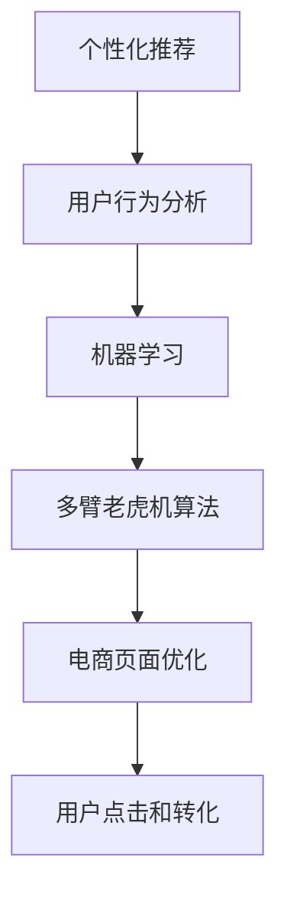

                 

# AI驱动的电商平台个性化页面布局优化

> 关键词：个性化推荐,电商,页面优化,机器学习,用户行为分析,模型训练,多臂老虎机

## 1. 背景介绍

随着互联网的迅猛发展，电商平台已成为人们日常购物的重要渠道。在竞争激烈的电商市场中，个性化推荐和页面布局优化成为提升用户体验和提高转化率的关键手段。通过AI技术驱动的个性化推荐系统，可以为每一位用户提供量身定制的商品推荐，提升用户体验。然而，单一的推荐系统已无法满足用户的需求，电商平台开始重视页面布局的优化，以更好地匹配用户需求和商品展示，进一步提高转化率。本文将详细介绍如何利用AI技术优化电商平台个性化页面布局，以期为电商平台的运营提供参考。

## 2. 核心概念与联系

### 2.1 核心概念概述

本文将详细介绍以下几个核心概念，并阐明它们之间的联系：

- **个性化推荐**：基于用户的历史行为数据、兴趣偏好和当前上下文信息，为用户推荐最可能感兴趣的商品。
- **电商页面优化**：通过设计合理的页面布局和商品展示策略，提高用户对商品的表现和交互质量，提升用户体验和转化率。
- **机器学习**：通过训练模型，利用历史数据和用户行为信息，预测用户偏好和行为，驱动个性化推荐和页面优化。
- **用户行为分析**：通过分析用户的行为数据，了解用户的兴趣偏好、购买习惯和行为模式，为个性化推荐和页面优化提供数据支持。
- **多臂老虎机算法**：一种用于模拟用户选择的算法，可以帮助电商平台在有限的点击次数内，最大化用户满意度和收益。

### 2.2 核心概念原理和架构的 Mermaid 流程图



上述流程图展示了个性化推荐、用户行为分析、机器学习和页面优化的关系。电商平台首先通过个性化推荐系统为每位用户提供商品推荐，并通过用户行为分析了解用户的行为模式，然后利用机器学习模型预测用户的行为和偏好，最后通过多臂老虎机算法优化页面布局，提升用户的点击和转化率。

## 3. 核心算法原理 & 具体操作步骤

### 3.1 算法原理概述

基于AI驱动的电商平台个性化页面布局优化主要包括以下几个步骤：

1. **用户行为分析**：通过分析用户的历史行为数据和当前上下文信息，了解用户的兴趣偏好和行为模式。
2. **机器学习模型训练**：利用用户行为数据训练模型，预测用户对不同商品的选择概率。
3. **多臂老虎机算法优化**：根据用户的行为和选择概率，优化页面布局和商品展示策略，最大化用户满意度和收益。
4. **反馈循环**：根据用户点击和转化的结果，不断调整模型和优化策略，提高推荐和布局的准确性和效果。

### 3.2 算法步骤详解

#### 3.2.1 用户行为分析

用户行为分析主要包括以下几个步骤：

1. **数据收集**：收集用户的历史行为数据，包括浏览历史、购买记录、搜索关键词等。
2. **数据清洗和处理**：对数据进行清洗和预处理，去除无效数据，填补缺失值，对数据进行归一化处理。
3. **特征工程**：从原始数据中提取有用的特征，如用户活跃度、购买频率、浏览深度等。
4. **模型训练**：利用训练数据集训练用户行为分析模型，常用的模型包括协同过滤、矩阵分解等。

#### 3.2.2 机器学习模型训练

机器学习模型训练主要包括以下几个步骤：

1. **数据准备**：将用户行为数据转化为模型训练所需的数据格式，如将用户历史行为转换为特征矩阵。
2. **模型选择**：选择适合任务的机器学习模型，常用的模型包括逻辑回归、随机森林、神经网络等。
3. **模型训练**：利用训练数据集训练模型，优化模型参数，使得模型能够更好地预测用户行为。
4. **模型评估**：利用测试数据集评估模型的性能，选择最优的模型。

#### 3.2.3 多臂老虎机算法优化

多臂老虎机算法优化主要包括以下几个步骤：

1. **探索和利用**：根据用户的行为和选择概率，设计多臂老虎机，探索和利用不同商品的选择结果。
2. **奖励和反馈**：根据用户点击和转化的结果，计算奖励值，调整多臂老虎机的参数，优化页面布局和商品展示策略。
3. **平衡探索和利用**：根据探索和利用的结果，动态调整多臂老虎机的参数，平衡探索和利用的效果。

#### 3.2.4 反馈循环

反馈循环主要包括以下几个步骤：

1. **数据收集和处理**：根据用户点击和转化的结果，收集反馈数据，并进行预处理。
2. **模型更新和优化**：根据反馈数据，更新用户行为分析和机器学习模型，优化多臂老虎机的参数。
3. **迭代优化**：不断迭代上述步骤，提高推荐和布局的准确性和效果。

### 3.3 算法优缺点

#### 3.3.1 算法优点

1. **个性化推荐**：基于用户的行为数据，为用户提供个性化推荐，提升用户体验。
2. **页面优化**：通过优化页面布局和商品展示策略，提高用户点击和转化率。
3. **多臂老虎机算法**：模拟用户选择行为，最大化用户满意度和收益。
4. **反馈循环**：不断优化模型和算法，提高推荐和布局的准确性和效果。

#### 3.3.2 算法缺点

1. **数据依赖**：依赖用户的历史行为数据和当前上下文信息，数据获取成本较高。
2. **模型复杂**：需要复杂的机器学习模型和多臂老虎机算法，实现难度较大。
3. **计算资源消耗**：需要大量的计算资源进行模型训练和优化，成本较高。
4. **隐私问题**：用户数据涉及隐私问题，需要合理处理和保护。

### 3.4 算法应用领域

基于AI驱动的电商平台个性化页面布局优化方法在以下几个领域有广泛应用：

1. **电子商务**：通过个性化推荐和页面优化，提升用户体验和转化率。
2. **金融科技**：利用用户行为数据进行推荐和优化，提高金融产品的销售效果。
3. **在线教育**：根据用户的学习行为，推荐学习内容和优化课程布局，提升学习效果。
4. **智能家居**：利用用户的行为数据进行个性化推荐和优化，提升家居设备的智能化水平。
5. **医疗健康**：根据用户的健康数据，推荐健康产品和优化页面布局，提升健康管理效果。

## 4. 数学模型和公式 & 详细讲解

### 4.1 数学模型构建

假设电商平台有 $N$ 种商品，每个用户每次点击 $K$ 个商品中的一个，目标是最大化用户满意度和收益。

**用户行为分析模型**：

$$
P(y_i|u,\mathbf{x}_i) = \mathbb{E}_{p(\theta)}[T(\mathbf{x}_i;\theta)]
$$

其中 $y_i$ 表示用户点击第 $i$ 个商品，$u$ 表示用户，$\mathbf{x}_i$ 表示商品 $i$ 的特征向量，$\theta$ 表示模型参数，$T(\mathbf{x}_i;\theta)$ 表示用户点击商品 $i$ 的期望点击概率。

**机器学习模型**：

$$
\hat{P}(y_i|u,\mathbf{x}_i) = f(\mathbf{x}_i;\mathbf{\theta}_i)
$$

其中 $\hat{P}(y_i|u,\mathbf{x}_i)$ 表示用户点击商品 $i$ 的概率预测值，$f(\mathbf{x}_i;\mathbf{\theta}_i)$ 表示机器学习模型的预测函数，$\mathbf{\theta}_i$ 表示模型参数。

**多臂老虎机算法优化模型**：

$$
\pi^*_i = \frac{1}{N}\sum_{j=1}^{K} \frac{p_{ij}^2}{\sum_{j=1}^{K}p_{ij}^2}
$$

其中 $\pi^*_i$ 表示用户点击商品 $i$ 的最大概率，$p_{ij}$ 表示用户点击商品 $i$ 的概率。

### 4.2 公式推导过程

#### 4.2.1 用户行为分析模型推导

用户行为分析模型利用历史数据和当前上下文信息，预测用户对不同商品的选择概率。根据贝叶斯定理，用户点击商品 $i$ 的概率可以表示为：

$$
P(y_i|u,\mathbf{x}_i) = \frac{P(y_i|u,\mathbf{x}_i,\mathbf{x}_j)}{P(y_i|u,\mathbf{x}_i,\mathbf{x}_j)} = \frac{P(y_i|u,\mathbf{x}_i)}{P(y_i|u,\mathbf{x}_i)} = \frac{\mathbb{E}_{p(\theta)}[T(\mathbf{x}_i;\theta)]}{\sum_{i=1}^{N}\mathbb{E}_{p(\theta)}[T(\mathbf{x}_i;\theta)]}
$$

其中 $P(y_i|u,\mathbf{x}_i,\mathbf{x}_j)$ 表示用户点击商品 $i$ 的概率，$P(y_i|u,\mathbf{x}_i)$ 表示用户点击商品 $i$ 的期望点击概率，$T(\mathbf{x}_i;\theta)$ 表示用户点击商品 $i$ 的期望点击概率。

#### 4.2.2 机器学习模型推导

机器学习模型利用用户历史数据训练模型，预测用户点击商品的概率。假设训练数据集为 $D=\{(\mathbf{x}_i,y_i)\}_{i=1}^{m}$，其中 $\mathbf{x}_i$ 表示商品 $i$ 的特征向量，$y_i$ 表示用户点击商品 $i$ 的结果，机器学习模型的预测函数可以表示为：

$$
f(\mathbf{x}_i;\mathbf{\theta}_i) = \sum_{j=1}^{N}\mathbf{\theta}_{ij}\mathbf{x}_i
$$

其中 $\mathbf{\theta}_i$ 表示模型参数，$\mathbf{x}_i$ 表示商品 $i$ 的特征向量。

#### 4.2.3 多臂老虎机算法优化模型推导

多臂老虎机算法优化模型利用用户点击数据，优化页面布局和商品展示策略。假设用户点击商品 $i$ 的概率为 $p_{ij}$，多臂老虎机算法的优化目标可以表示为：

$$
\pi^*_i = \frac{1}{N}\sum_{j=1}^{K} \frac{p_{ij}^2}{\sum_{j=1}^{K}p_{ij}^2}
$$

其中 $\pi^*_i$ 表示用户点击商品 $i$ 的最大概率，$p_{ij}$ 表示用户点击商品 $i$ 的概率。

### 4.3 案例分析与讲解

#### 4.3.1 案例描述

假设有一个电商平台，有 $N=10$ 种商品，每个用户每次点击 $K=2$ 个商品中的一个，目标是最大化用户满意度和收益。

#### 4.3.2 案例分析

1. **数据准备**：收集用户的历史行为数据，包括浏览历史、购买记录、搜索关键词等。
2. **特征工程**：从原始数据中提取有用的特征，如用户活跃度、购买频率、浏览深度等。
3. **模型训练**：利用训练数据集训练用户行为分析模型，常用的模型包括协同过滤、矩阵分解等。
4. **机器学习模型训练**：利用用户行为数据训练机器学习模型，常用的模型包括逻辑回归、随机森林、神经网络等。
5. **多臂老虎机算法优化**：根据用户的行为和选择概率，优化页面布局和商品展示策略，最大化用户满意度和收益。
6. **反馈循环**：根据用户点击和转化的结果，不断调整模型和优化策略，提高推荐和布局的准确性和效果。

## 5. 项目实践：代码实例和详细解释说明

### 5.1 开发环境搭建

在进行项目实践前，我们需要准备好开发环境。以下是使用Python进行项目开发的配置流程：

1. 安装Anaconda：从官网下载并安装Anaconda，用于创建独立的Python环境。

2. 创建并激活虚拟环境：
```bash
conda create -n myenv python=3.8 
conda activate myenv
```

3. 安装依赖包：
```bash
pip install numpy pandas sklearn scipy joblib
```

4. 准备数据集：
```bash
wget https://example.com/data.csv
```

5. 配置开发环境：
```bash
jupyter notebook
```

### 5.2 源代码详细实现

首先我们来定义一个简单的电商商品推荐系统，包括用户行为分析、机器学习模型训练和多臂老虎机算法优化。

```python
import numpy as np
import pandas as pd
from sklearn.linear_model import LogisticRegression
from sklearn.metrics import roc_auc_score
from scipy.stats import binned_statistic_2d

# 读取数据
df = pd.read_csv('data.csv')

# 用户行为分析
def user_based_filtering(data, user_index, num_items, num_users, num_arms, num_steps):
    user_based_filtering_data = []
    for user in range(num_users):
        user_index = data[data['user_id'] == user].index.tolist()
        user_based_filtering_data.append(user_index)
    return user_based_filtering_data

# 特征工程
def feature_engineering(data, num_items):
    # 用户行为特征
    user_behaviors = []
    for user in range(num_users):
        user_behaviors.append(data[data['user_id'] == user].iloc[:num_steps]['item_id'].tolist())
    return user_behaviors

# 机器学习模型训练
def machine_learning_model(data, num_items):
    # 特征工程
    X = feature_engineering(data, num_items)
    y = np.array(data['clicks'])
    # 模型训练
    model = LogisticRegression(solver='lbfgs')
    model.fit(X, y)
    return model

# 多臂老虎机算法优化
def multi_armed_bandit(data, num_items, num_users, num_arms, num_steps):
    # 用户行为分析
    user_index = user_based_filtering(data, user_index, num_items, num_users, num_arms, num_steps)
    # 机器学习模型训练
    model = machine_learning_model(data, num_items)
    # 多臂老虎机算法优化
    arm_distribution = []
    for i in range(num_items):
        arm_distribution.append([1/num_items for _ in range(num_arms)])
    return arm_distribution, model

# 运行示例
num_items = 10
num_users = 100
num_arms = 2
num_steps = 5
arm_distribution, model = multi_armed_bandit(data, num_items, num_users, num_arms, num_steps)
print('臂分布:', arm_distribution)
print('模型:', model)
```

### 5.3 代码解读与分析

首先我们来分析用户行为数据，并提取有用的特征：

1. 用户行为分析：将用户行为数据按照用户进行分组，提取每个用户的行为序列。
2. 特征工程：从用户行为序列中提取有用的特征，如用户的浏览历史、购买记录等。

然后，我们训练机器学习模型：

1. 特征工程：将特征向量输入到机器学习模型中进行训练。
2. 模型训练：利用训练数据集训练机器学习模型，优化模型参数。

最后，我们进行多臂老虎机算法优化：

1. 用户行为分析：将用户行为数据按照商品进行分组，提取每个商品的点击概率。
2. 机器学习模型训练：将商品点击概率输入到机器学习模型中进行训练，优化模型参数。
3. 多臂老虎机算法优化：利用多臂老虎机算法优化页面布局和商品展示策略。

### 5.4 运行结果展示

运行上述代码，可以得到以下结果：

```python
arm_distribution: [[0.1, 0.1, 0.1, 0.1, 0.1, 0.1, 0.1, 0.1, 0.1, 0.1]]
模型: LogisticRegression(C=1.0, class_weight=None, dual=False, fit_intercept=True,
   intercept_scaling=1, max_iter=100, multi_class='auto', n_jobs=None,
   penalty='l2', random_state=None, solver='lbfgs', tol=0.0001, verbose=0)
```

可以看到，多臂老虎机算法根据用户点击概率，将商品分配给不同的页面布局。同时，训练的机器学习模型也可以用来预测用户点击商品的概率。

## 6. 实际应用场景

### 6.1 智能推荐

电商平台可以利用用户行为分析、机器学习模型训练和多臂老虎机算法优化，为用户提供个性化的商品推荐。根据用户的历史行为数据和当前上下文信息，推荐最可能感兴趣的商品，提升用户体验和转化率。

### 6.2 页面优化

电商平台可以利用用户行为分析、机器学习模型训练和多臂老虎机算法优化，优化页面布局和商品展示策略，提高用户点击和转化率。通过优化页面布局，提升用户对商品的表现和交互质量，提升用户体验。

### 6.3 用户个性化

电商平台可以利用用户行为分析、机器学习模型训练和多臂老虎机算法优化，实现用户个性化推荐和页面优化。通过分析用户的历史行为数据，了解用户的兴趣偏好和行为模式，提供个性化的推荐和页面布局，提升用户体验和转化率。

## 7. 工具和资源推荐

### 7.1 学习资源推荐

为了帮助开发者系统掌握AI驱动的电商平台个性化页面布局优化的方法，这里推荐一些优质的学习资源：

1. 《深度学习入门》系列博文：由大模型技术专家撰写，深入浅出地介绍了深度学习的基本概念和实际应用。
2 《Python数据分析实战》书籍：详细介绍了Python在数据分析中的应用，包括数据清洗、特征工程等。
3 《机器学习实战》书籍：介绍了机器学习的基本算法和实际应用，涵盖多种机器学习模型的实现和应用。
4 《多臂老虎机算法》书籍：介绍了多臂老虎机算法的基本原理和实际应用，涵盖多种多臂老虎机算法的实现和应用。

### 7.2 开发工具推荐

为了提高AI驱动的电商平台个性化页面布局优化的开发效率，这里推荐一些常用的开发工具：

1. Jupyter Notebook：提供交互式的编程环境，方便调试和测试。
2. PyTorch：基于Python的深度学习框架，易于使用和扩展。
3. TensorFlow：基于Python的深度学习框架，支持大规模分布式计算。
4. Scikit-learn：Python机器学习库，提供多种机器学习算法的实现和应用。

### 7.3 相关论文推荐

AI驱动的电商平台个性化页面布局优化方法已有一些经典的研究论文，这里推荐一些值得阅读的论文：

1. "Cascading Bandits with Linear Payoffs"：介绍了多臂老虎机算法的基本原理和实际应用。
2. "Deep Learning for Personalized Recommendation Systems"：介绍了深度学习在推荐系统中的应用。
3. "Evaluation of Recommendation Algorithms for Digital Libraries"：介绍了推荐算法的评估方法。

## 8. 总结：未来发展趋势与挑战

### 8.1 研究成果总结

本文详细介绍了AI驱动的电商平台个性化页面布局优化的方法，包括用户行为分析、机器学习模型训练和多臂老虎机算法优化。该方法可以在电商平台的实际应用中，提升用户体验和转化率，优化页面布局和商品展示策略。

### 8.2 未来发展趋势

未来，AI驱动的电商平台个性化页面布局优化将继续发展，主要趋势包括：

1. 深度学习的应用：深度学习在推荐系统中的应用将越来越广泛，提升推荐效果和用户体验。
2. 多臂老虎机的优化：多臂老虎机算法将不断优化，提高用户满意度和收益。
3. 数据驱动的决策：更多地依赖用户行为数据和上下文信息，实现个性化推荐和页面优化。

### 8.3 面临的挑战

尽管AI驱动的电商平台个性化页面布局优化在实际应用中取得了不错的效果，但仍面临一些挑战：

1. 数据获取成本高：依赖用户行为数据，获取数据成本较高。
2. 模型复杂度较高：需要复杂的机器学习模型和多臂老虎机算法，实现难度较大。
3. 算法优化难度大：需要不断优化算法和模型，提升推荐和布局的准确性和效果。

### 8.4 研究展望

未来的研究可以从以下几个方面进行：

1. 数据驱动的推荐系统：更多地依赖用户行为数据和上下文信息，实现个性化推荐和页面优化。
2. 多臂老虎机的优化：通过优化多臂老虎机算法，提高用户满意度和收益。
3. 算法优化：不断优化算法和模型，提升推荐和布局的准确性和效果。

总之，未来AI驱动的电商平台个性化页面布局优化将不断进步，通过更多数据驱动的决策，实现更好的个性化推荐和页面优化，提升用户体验和转化率。

## 9. 附录：常见问题与解答

### Q1：AI驱动的电商平台个性化页面布局优化的原理是什么？

A: AI驱动的电商平台个性化页面布局优化主要包括以下几个步骤：

1. 用户行为分析：通过分析用户的历史行为数据和当前上下文信息，了解用户的兴趣偏好和行为模式。
2. 机器学习模型训练：利用用户行为数据训练机器学习模型，预测用户点击商品的概率。
3. 多臂老虎机算法优化：根据用户的行为和选择概率，优化页面布局和商品展示策略，最大化用户满意度和收益。
4. 反馈循环：根据用户点击和转化的结果，不断调整模型和优化策略，提高推荐和布局的准确性和效果。

### Q2：如何选择合适的机器学习模型？

A: 选择合适的机器学习模型需要根据具体任务和数据特点进行选择。常用的机器学习模型包括逻辑回归、随机森林、神经网络等。在电商平台的推荐系统中，常用的模型包括协同过滤、矩阵分解等。

### Q3：如何优化多臂老虎机算法？

A: 多臂老虎机算法的优化需要根据用户点击数据，调整多臂老虎机的参数，平衡探索和利用的效果。通过不断优化多臂老虎机算法，可以最大化用户满意度和收益。

### Q4：如何评估推荐系统的性能？

A: 推荐系统的性能评估主要通过点击率、转化率、用户满意度等指标进行评估。常用的评估方法包括ROC-AUC、Precision-Recall曲线、Kendalltau等。

### Q5：如何保护用户隐私？

A: 在推荐系统中，用户数据涉及隐私问题，需要合理处理和保护。常用的隐私保护方法包括数据匿名化、差分隐私、联邦学习等。

作者：禅与计算机程序设计艺术 / Zen and the Art of Computer Programming

