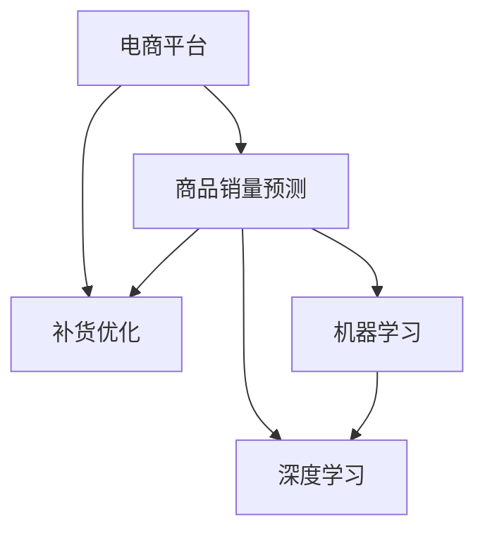

                 

# AI驱动的电商平台商品销量预测与补货优化

> 关键词：电商平台,商品销量预测,销量预测模型,机器学习,深度学习,补货优化,库存管理,智能决策

## 1. 背景介绍

随着电子商务的飞速发展，电商平台成为了消费者在线购物的重要渠道。然而，如何在确保库存充足的同时，避免过度囤货和资金积压，是电商平台面临的一大挑战。传统的库存管理方法往往基于简单的历史数据和人工经验，难以适应日益复杂和多样化的市场需求。因此，利用先进的人工智能技术，特别是基于机器学习和深度学习的商品销量预测模型，为电商平台提供科学的补货优化建议，成为当前技术研究的热点。

### 1.1 问题由来

电商平台商品的销售受到多种因素的影响，包括季节性变化、促销活动、用户行为、市场竞争等。这些因素通常具有非线性、复杂性以及不确定性，使得传统的统计方法难以准确预测商品销量。因此，电商平台亟需一种能够自适应数据变化、高效预测销量并优化补货的解决方案。

### 1.2 问题核心关键点

为解决这一问题，核心在于设计一种准确、高效的商品销量预测模型，并基于此模型优化库存补货策略。预测模型需要考虑多维度的输入数据，如时间序列数据、用户行为数据、市场环境数据等，以捕捉商品销量的动态变化。补货优化则要求模型能够在保证服务水平的前提下，最大化库存利用率，降低库存成本。

## 2. 核心概念与联系

### 2.1 核心概念概述

为更好地理解AI驱动的商品销量预测与补货优化方法，本节将介绍几个密切相关的核心概念：

- 电商平台（E-commerce Platform）：指基于互联网的销售平台，如Amazon、淘宝等。利用人工智能技术，可以实现更高效、更精准的商品管理和库存控制。
- 商品销量预测（Product Sales Forecasting）：指基于历史销售数据和相关因素，预测未来商品销量的过程。预测准确性直接影响库存管理策略和运营效率。
- 补货优化（Replenishment Optimization）：指基于销量预测结果，优化商品库存，以平衡库存成本和销售机会的决策过程。优化目标通常包括最小化库存成本、最大化利润等。
- 机器学习（Machine Learning）：一种通过数据训练模型，使其具备预测、分类、聚类等能力的技术。特别是基于深度学习的销量预测模型，可以自动捕捉复杂数据模式。
- 深度学习（Deep Learning）：机器学习的一个分支，通过多层神经网络结构，能够学习到高层次的数据表示。深度学习在图像识别、自然语言处理等领域有广泛应用，同样适用于销量预测。
- 库存管理（Inventory Management）：指对库存进行规划、控制、跟踪和分析，以提高库存效率、降低成本。库存管理是电商平台运营的重要环节。
- 智能决策（Intelligent Decision Making）：指基于人工智能技术，通过数据分析、模型训练，进行自动化、智能化的决策支持。

这些核心概念之间的逻辑关系可以通过以下Mermaid流程图来展示：



这个流程图展示了几者之间的逻辑关系：

1. 电商平台是应用环境，利用商品销量预测和补货优化提升运营效率。
2. 商品销量预测是预测未来销售情况，为补货优化提供数据支持。
3. 补货优化基于预测结果，优化库存管理策略。
4. 机器学习和深度学习为预测模型提供技术支撑，实现自动化预测。

## 3. 核心算法原理 & 具体操作步骤

### 3.1 算法原理概述

商品销量预测与补货优化是一个典型的预测和优化问题，涉及多维度数据和多目标优化。其核心算法原理可概括为以下几步：

1. **数据预处理**：对原始数据进行清洗、归一化、特征工程等预处理，以便模型训练。
2. **销量预测模型**：基于历史销售数据和相关因素，训练预测模型。
3. **补货优化模型**：根据预测结果，设计优化模型，优化库存补货策略。
4. **动态调整**：根据实时数据，动态调整预测和优化策略，确保系统实时性和准确性。

### 3.2 算法步骤详解

以下是具体的算法步骤详解：

**Step 1: 数据预处理**

- 数据收集：收集历史销售数据、用户行为数据、市场环境数据等。
- 数据清洗：处理缺失值、异常值，确保数据质量。
- 特征工程：提取、构建相关特征，如时间特征、季节性特征、促销特征等。
- 数据归一化：将特征值缩放到0到1之间，提升模型训练效果。

**Step 2: 销量预测模型**

- 模型选择：选择适合的预测模型，如ARIMA、时间序列模型、深度学习模型（如LSTM、GRU）等。
- 模型训练：使用历史数据训练预测模型，确保模型具有泛化能力。
- 模型评估：使用验证集评估模型性能，调整模型参数，确保模型准确性。

**Step 3: 补货优化模型**

- 补货策略设计：设计补货策略，如按需补货、定期补货、批量补货等。
- 优化目标设定：设定优化目标，如最小化库存成本、最大化利润等。
- 优化算法选择：选择适合的优化算法，如线性规划、遗传算法、强化学习等。
- 优化模型训练：使用预测结果训练补货优化模型，确保模型能够适应不同市场环境。

**Step 4: 动态调整**

- 实时数据监测：实时收集销售、库存等数据，监测市场变化。
- 预测模型更新：根据实时数据更新预测模型，确保预测准确性。
- 补货策略调整：根据新预测结果，动态调整补货策略，优化库存管理。
- 系统反馈：建立反馈机制，持续优化预测和补货策略，提升系统性能。

### 3.3 算法优缺点

商品销量预测与补货优化的算法具有以下优点：

- 高准确性：深度学习等先进算法能够捕捉复杂数据模式，提高预测准确性。
- 自适应性：基于实时数据进行动态调整，能够快速响应市场变化。
- 优化效果显著：通过科学优化补货策略，能够显著降低库存成本，提升利润。

同时，该算法也存在以下局限性：

- 数据依赖：预测模型的准确性高度依赖于数据质量，数据不足或偏差可能影响预测结果。
- 计算复杂性：深度学习模型需要大量的计算资源，特别是在大规模数据集上。
- 模型解释性：复杂的深度学习模型难以解释其内部决策过程，可能导致用户对结果的信任度下降。
- 鲁棒性不足：预测模型和补货策略可能对噪声和异常数据敏感，需要进一步改进。

### 3.4 算法应用领域

基于AI的商品销量预测与补货优化方法，已经在多个电商平台上得到了广泛应用，包括：

- 亚马逊（Amazon）：利用深度学习模型预测商品销量，优化库存补货，提升运营效率。
- 阿里巴巴（Alibaba）：使用机器学习模型分析用户行为数据，预测销量，个性化推荐商品。
- 京东（JD.com）：采用强化学习算法，动态调整补货策略，提升库存管理效果。
- Walmart：利用时间序列分析预测商品销量，优化供应链管理，降低库存成本。
- Zara：通过智能决策系统，实时预测市场需求，优化库存补货，提升时尚商品销售。

此外，在金融、物流、制造业等众多领域，基于AI的商品销量预测与补货优化方法同样具有广泛应用前景。

## 4. 数学模型和公式 & 详细讲解  
### 4.1 数学模型构建

本节将使用数学语言对商品销量预测与补货优化方法进行更加严格的刻画。

记历史销售数据为 $y_t$，其中 $t$ 为时间步长。设 $x_t$ 为 $t$ 时刻的特征向量，包括时间特征、促销特征、季节性特征等。目标为预测 $y_{t+1}$，即下一个月的销售量。

定义预测模型为 $f(y_{t+1}|x_t)$，其预测结果为 $\hat{y}_{t+1}$。补货优化模型为目标函数 $g(\hat{y}_{t+1})$，其中 $g$ 为优化算法。

预测模型的目标是最大化预测准确性，即最小化预测误差 $\epsilon_{t+1}$，可通过均方误差（MSE）衡量：

$$
\min_{f} \frac{1}{N} \sum_{t=1}^N (y_t - \hat{y}_t)^2
$$

补货优化模型的目标是最大化利润，即最小化库存成本和缺货成本：

$$
\max_{g} \pi - \rho \cdot \delta
$$

其中 $\pi$ 为利润，$\rho$ 为库存成本系数，$\delta$ 为缺货成本。

### 4.2 公式推导过程

以下我们以深度学习模型为例，推导预测模型的损失函数及其梯度计算公式。

假设模型 $f$ 为多层神经网络，使用均方误差作为损失函数，则预测误差为：

$$
\epsilon_{t+1} = y_{t+1} - \hat{y}_{t+1}
$$

目标函数为：

$$
L = \frac{1}{N} \sum_{t=1}^N \epsilon_{t+1}^2
$$

使用反向传播算法计算梯度：

$$
\frac{\partial L}{\partial \theta} = -2\frac{1}{N} \sum_{t=1}^N \epsilon_{t+1} \cdot \frac{\partial \hat{y}_{t+1}}{\partial \theta}
$$

其中 $\theta$ 为模型参数，$\hat{y}_{t+1}$ 为模型预测结果。

在得到预测模型的梯度后，即可带入优化算法中更新模型参数。

### 4.3 案例分析与讲解

假设我们有一个电商平台，需要预测一款商品的未来销售情况，并优化库存补货策略。我们使用LSTM模型作为预测模型，基于历史销售数据和相关特征进行训练。

预测模型输入为时间特征和促销特征，输出为下一个月的销售预测。

模型训练步骤如下：

- 数据预处理：收集历史销售数据和促销活动信息，清洗数据，进行特征工程。
- 模型选择：选择LSTM模型作为预测模型。
- 模型训练：使用历史数据训练模型，最小化均方误差损失。
- 模型评估：使用验证集评估模型性能，选择最佳模型参数。

补货优化模型步骤如下：

- 补货策略设计：设定批量补货策略，每次补货1000件。
- 优化目标设定：最小化库存成本和缺货成本，利润最大化。
- 优化算法选择：使用线性规划算法。
- 优化模型训练：使用预测结果训练补货优化模型，确保补货策略适应市场变化。

最终，系统可以根据实时销售数据，动态调整预测和补货策略，确保库存管理效果最优。

## 5. 项目实践：代码实例和详细解释说明
### 5.1 开发环境搭建

在进行商品销量预测与补货优化实践前，我们需要准备好开发环境。以下是使用Python进行TensorFlow开发的环境配置流程：

1. 安装Anaconda：从官网下载并安装Anaconda，用于创建独立的Python环境。

2. 创建并激活虚拟环境：
```bash
conda create -n tf-env python=3.8 
conda activate tf-env
```

3. 安装TensorFlow：根据CUDA版本，从官网获取对应的安装命令。例如：
```bash
conda install tensorflow
```

4. 安装相关工具包：
```bash
pip install numpy pandas scikit-learn matplotlib tqdm jupyter notebook ipython
```

完成上述步骤后，即可在`tf-env`环境中开始商品销量预测与补货优化的实践。

### 5.2 源代码详细实现

下面以LSTM模型为例，给出使用TensorFlow进行商品销量预测的PyTorch代码实现。

首先，定义预测模型和优化模型：

```python
import tensorflow as tf
from tensorflow.keras.layers import LSTM, Dense
from tensorflow.keras.models import Sequential

# 定义预测模型
model = Sequential()
model.add(LSTM(64, input_shape=(timesteps, features)))
model.add(Dense(1))

# 定义优化模型
optimizer = tf.keras.optimizers.Adam()

# 定义损失函数
loss_fn = tf.keras.losses.MeanSquaredError()
```

然后，定义数据处理函数：

```python
def preprocess_data(data, timesteps):
    X = []
    y = []
    for i in range(len(data) - timesteps):
        X.append(data[i:i+timesteps])
        y.append(data[i+timesteps])
    return np.array(X), np.array(y)
```

接着，定义训练和评估函数：

```python
def train_model(model, data, epochs):
    X_train, y_train = preprocess_data(data, timesteps)
    model.compile(optimizer=optimizer, loss=loss_fn)
    history = model.fit(X_train, y_train, epochs=epochs, batch_size=batch_size, validation_split=0.2)
    return history

def evaluate_model(model, data):
    X_test, y_test = preprocess_data(data, timesteps)
    loss = model.evaluate(X_test, y_test)
    return loss
```

最后，启动训练流程并在测试集上评估：

```python
epochs = 100
batch_size = 32

# 数据加载
data = ...

# 模型训练
history = train_model(model, data, epochs)

# 模型评估
loss = evaluate_model(model, data)

print(f"Epochs: {epochs}, Loss: {loss:.4f}")
```

以上就是使用TensorFlow进行商品销量预测的完整代码实现。可以看到，TensorFlow提供了高度抽象的Keras API，使得模型搭建和训练过程变得简洁高效。

### 5.3 代码解读与分析

让我们再详细解读一下关键代码的实现细节：

**定义预测模型**

- `Sequential`类：用于创建序列模型，堆叠多个层次化组件。
- `LSTM`层：时间步长为`timesteps`，特征数为`features`，用于捕捉时间序列数据的时序特征。
- `Dense`层：输出为1，用于预测下一个月的销售量。

**数据预处理**

- `preprocess_data`函数：将原始数据切割成时间步长的特征和标签，用于训练模型。

**模型训练**

- `train_model`函数：使用训练数据集进行模型训练，最小化均方误差损失。
- `compile`方法：配置优化器、损失函数、评估指标。
- `fit`方法：使用训练数据进行模型拟合，返回训练历史。

**模型评估**

- `evaluate_model`函数：使用测试数据集评估模型性能，返回预测损失。

**训练流程**

- 定义训练轮数和批量大小，加载数据。
- 使用`train_model`函数训练模型。
- 使用`evaluate_model`函数评估模型性能。

可以看到，TensorFlow提供了丰富的工具和API，使得模型训练和评估过程变得简单高效。在实际应用中，还需要根据具体任务进行优化，如引入正则化、调整模型参数等。

## 6. 实际应用场景
### 6.1 智能库存管理

商品销量预测与补货优化技术在智能库存管理中有着广泛应用。通过预测商品销售情况，智能管理系统可以动态调整补货策略，确保库存水平在合理范围内，避免过量或不足。

在实际应用中，可以集成库存管理系统和电商平台数据，实时更新预测模型和补货策略。系统可以自动生成补货计划，并通过API接口通知仓库进行补货，从而实现库存管理自动化。

### 6.2 个性化推荐

电商平台可以利用商品销量预测与补货优化技术，为每个用户提供个性化推荐。通过预测用户可能感兴趣的商品，系统可以主动推荐商品，提升用户购买率和满意度。

在推荐过程中，可以综合考虑用户历史行为、商品属性、促销活动等因素，进行动态调整。通过动态优化补货策略，保证热门商品的供应，同时避免非热门商品的积压，提升推荐效果。

### 6.3 市场趋势分析

电商平台可以利用商品销量预测技术，分析市场趋势，捕捉消费者需求变化，指导市场战略决策。

例如，通过预测不同商品、不同季节的销售情况，电商平台可以及时调整促销策略，优化商品组合，提升整体销售额。同时，通过分析历史数据，可以预判市场变化，提前调整库存和补货策略，避免供需不匹配。

### 6.4 未来应用展望

随着深度学习技术的不断进步，基于AI的商品销量预测与补货优化技术将迎来更多创新。未来，以下方向值得关注：

1. 多模态预测：结合图像、视频、文本等多模态数据，进行更全面的销量预测。
2. 自适应学习：通过在线学习机制，实时更新预测模型，提升模型适应性。
3. 跨平台优化：将预测与补货优化技术应用于多个电商平台，实现全局最优。
4. 自动化决策：引入强化学习、博弈论等方法，实现更智能、更高效的库存管理。
5. 边缘计算：在边缘设备上部署预测模型，减少云端计算负担，提升响应速度。

相信随着技术的不断进步，基于AI的商品销量预测与补货优化技术将在电商领域乃至更多行业发挥更大作用，为提高运营效率、降低成本带来新的突破。

## 7. 工具和资源推荐
### 7.1 学习资源推荐

为了帮助开发者系统掌握商品销量预测与补货优化的理论基础和实践技巧，这里推荐一些优质的学习资源：

1. TensorFlow官方文档：提供了详细的API文档和案例代码，适合初学者入门。
2. 《深度学习入门》系列书籍：讲解了深度学习的基本概念和算法，适合零基础学习。
3. Kaggle竞赛平台：提供了丰富的数据集和模型竞赛，实战练习效果显著。
4. Udacity《深度学习专业》课程：深度学习领域的经典课程，包含实战项目。
5. PyTorch官方文档：提供了先进的深度学习框架API，适合深度学习开发者。

通过对这些资源的学习实践，相信你一定能够快速掌握商品销量预测与补货优化的精髓，并用于解决实际的电商问题。

### 7.2 开发工具推荐

高效的开发离不开优秀的工具支持。以下是几款用于商品销量预测与补货优化的常用工具：

1. TensorFlow：由Google主导开发的深度学习框架，生产部署方便，适合大规模工程应用。
2. PyTorch：基于Python的开源深度学习框架，灵活动态的计算图，适合快速迭代研究。
3. Keras：基于TensorFlow的高级API，易于上手，适合快速原型开发。
4. Jupyter Notebook：交互式笔记本，方便代码调试和可视化。
5. Git：版本控制系统，支持代码协作和版本管理。

合理利用这些工具，可以显著提升商品销量预测与补货优化的开发效率，加快创新迭代的步伐。

### 7.3 相关论文推荐

商品销量预测与补货优化技术的发展源于学界的持续研究。以下是几篇奠基性的相关论文，推荐阅读：

1. "Sales Forecasting Using Recurrent Neural Networks"：使用LSTM进行销量预测的经典论文。
2. "Adaptive Sales Forecasting in Supply Chains"：探讨了适应性销售预测的算法和方法。
3. "Reinforcement Learning in Supply Chain Management"：介绍了强化学习在供应链管理中的应用。
4. "Fashion Demand Prediction Using Deep Learning"：利用深度学习进行时尚商品需求预测的研究。
5. "E-commerce Recommendation Systems: A Survey"：综述了电商推荐系统的研究成果和应用。

这些论文代表了大规模预测与优化技术的发展脉络。通过学习这些前沿成果，可以帮助研究者把握学科前进方向，激发更多的创新灵感。

## 8. 总结：未来发展趋势与挑战

### 8.1 总结

本文对基于AI的商品销量预测与补货优化方法进行了全面系统的介绍。首先阐述了商品销量预测与补货优化的研究背景和意义，明确了AI技术在提升运营效率、降低成本方面的独特价值。其次，从原理到实践，详细讲解了商品销量预测与补货优化的数学模型和关键步骤，给出了商品销量预测的完整代码实例。同时，本文还广泛探讨了预测与优化的应用场景，展示了AI技术在电商领域的广阔前景。

通过本文的系统梳理，可以看到，基于AI的商品销量预测与补货优化技术正在成为电商平台运营的重要手段，极大地提升了库存管理的自动化和智能化水平。未来，伴随技术不断进步，基于AI的预测与优化方法将在更多领域得到应用，为各行各业带来颠覆性变革。

### 8.2 未来发展趋势

展望未来，商品销量预测与补货优化技术将呈现以下几个发展趋势：

1. 多模态预测：结合图像、视频、文本等多模态数据，进行更全面的预测。
2. 自适应学习：通过在线学习机制，实时更新预测模型，提升模型适应性。
3. 全局优化：将预测与补货优化技术应用于多个电商平台，实现全局最优。
4. 自动化决策：引入强化学习、博弈论等方法，实现更智能、更高效的库存管理。
5. 实时计算：在边缘设备上部署预测模型，减少云端计算负担，提升响应速度。
6. 智能推荐：利用预测与优化技术，为每个用户提供个性化推荐，提升购买率和满意度。

以上趋势凸显了商品销量预测与补货优化技术的广阔前景。这些方向的探索发展，必将进一步提升电商平台的运营效率和客户体验，为传统行业带来新的变革。

### 8.3 面临的挑战

尽管商品销量预测与补货优化技术已经取得了瞩目成就，但在迈向更加智能化、普适化应用的过程中，仍面临诸多挑战：

1. 数据质量和多样性：数据质量和多样性是预测准确性的重要保障，但实际应用中往往面临数据缺失、噪声等问题。
2. 模型复杂性和可解释性：深度学习模型虽然精度高，但其内部决策过程复杂，难以解释，可能导致用户对结果的信任度下降。
3. 计算资源需求：深度学习模型需要大量的计算资源，特别是在大规模数据集上，需要考虑资源优化问题。
4. 动态市场变化：市场环境变化快速，需要模型具备较强的自适应能力，以应对市场波动。
5. 系统集成问题：不同系统之间的数据接口、业务流程等问题，影响整体效果。
6. 伦理和隐私问题：预测和优化技术需要大量用户数据，如何保护用户隐私，避免数据滥用，成为重要课题。

正视商品销量预测与补货优化面临的这些挑战，积极应对并寻求突破，将是大规模预测与优化技术走向成熟的必由之路。相信随着学界和产业界的共同努力，这些挑战终将一一被克服，基于AI的商品销量预测与补货优化技术必将在电商领域乃至更多行业发挥更大作用。

### 8.4 研究展望

面对商品销量预测与补货优化所面临的种种挑战，未来的研究需要在以下几个方面寻求新的突破：

1. 数据增强技术：结合数据生成、数据采集等技术，提升数据质量和多样性，增强模型泛化能力。
2. 模型解释性研究：引入可解释性技术，如可视化、因果推断等，提升模型的透明性和可信度。
3. 资源优化方法：开发高效计算模型和算法，优化资源配置，提升系统性能。
4. 自适应学习算法：开发能够实时调整的预测模型，增强系统的灵活性和鲁棒性。
5. 跨平台集成方案：研究如何将预测与补货优化技术与其他业务系统无缝集成，实现数据共享和协同优化。
6. 隐私保护技术：开发数据隐私保护技术，确保用户数据安全，避免数据滥用。

这些研究方向的探索，必将引领商品销量预测与补货优化技术迈向更高的台阶，为电商平台运营和供应链管理提供更加智能化、高效化的解决方案。

## 9. 附录：常见问题与解答

**Q1：商品销量预测与补货优化需要哪些关键数据？**

A: 商品销量预测与补货优化需要以下关键数据：
1. 历史销售数据：包括每天的销量、销售额等。
2. 用户行为数据：包括浏览记录、购买记录、评分反馈等。
3. 市场环境数据：包括促销活动、节假日、季节性因素等。

这些数据的质量和多样性直接影响预测模型的准确性和补货策略的效果。

**Q2：如何选择适合的预测模型？**

A: 选择适合的预测模型需要考虑多个因素：
1. 数据类型：时间序列数据适合使用ARIMA、LSTM等模型，非结构化数据适合使用深度学习模型。
2. 数据规模：大规模数据适合使用深度学习模型，小规模数据适合使用统计模型。
3. 任务复杂度：复杂任务适合使用深度学习模型，简单任务适合使用统计模型。

通常，可以通过实验对比不同模型的性能，选择最适合当前任务的模型。

**Q3：如何优化补货策略？**

A: 优化补货策略需要考虑多个目标：
1. 库存成本：保持合理的库存水平，避免过量或不足。
2. 缺货成本：确保热门商品供应，避免客户流失。
3. 运营效率：优化补货频率和批量，提升运营效率。

可以通过调整补货策略参数，如补货频率、补货批量、补货时间等，进行优化。

**Q4：预测模型的参数调整有哪些方法？**

A: 预测模型的参数调整方法包括：
1. 网格搜索：通过网格搜索，找到最优参数组合。
2. 随机搜索：通过随机搜索，探索参数空间。
3. 贝叶斯优化：通过贝叶斯优化，快速找到最优参数。

这些方法可以结合使用，找到最优的模型参数。

**Q5：如何处理异常数据和噪声？**

A: 处理异常数据和噪声的方法包括：
1. 数据清洗：删除或修正异常数据，处理缺失值。
2. 数据归一化：将数据缩放到0到1之间，避免异常值影响模型。
3. 特征选择：选择与预测目标相关的特征，去除无关特征。
4. 异常检测：使用异常检测算法，识别并处理异常数据。

这些方法可以有效提升数据质量，减少噪声对模型的影响。

---

作者：禅与计算机程序设计艺术 / Zen and the Art of Computer Programming

