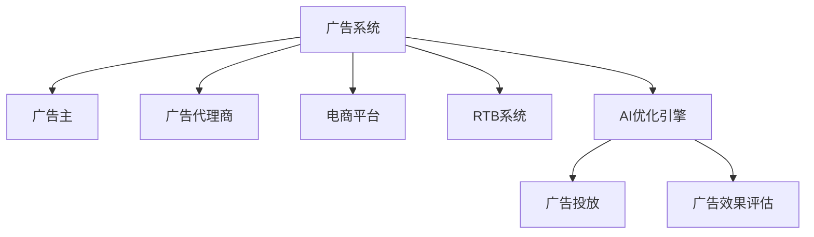

                 

# AI驱动的电商平台实时竞价广告系统优化

> 关键词：人工智能(AI), 实时竞价(RTB), 广告系统, 电商平台, 深度学习, 优化算法, 数据驱动

## 1. 背景介绍

随着电商平台的蓬勃发展，广告主们希望能够更精准地投放广告，实现投放效果最大化。而传统的批量竞价广告系统已经无法满足实时变化的市场需求，电商平台逐渐转向实时竞价广告系统(RTB)。通过RTB系统，广告可以基于实时数据进行动态竞价，以最优价格获得目标用户曝光，从而提升广告投放效果。

然而，RTB系统的高频交易和海量数据处理需求，对计算资源的消耗巨大。此外，广告投放的效果评估和优化也面临诸多挑战。广告主和平台希望通过AI技术优化广告系统，实现更精准的投放和更高的ROI。因此，基于AI的电商平台实时竞价广告系统优化技术应运而生。

## 2. 核心概念与联系

### 2.1 核心概念概述

为了深入理解AI驱动的电商平台实时竞价广告系统优化，本节将介绍几个关键概念及其相互关系。

- **人工智能(AI)**：一种模拟人类智能过程的技术，包括机器学习、深度学习、自然语言处理、计算机视觉等方向。AI技术能够处理大规模数据，并从中提取有价值的信息，为广告系统优化提供支持。

- **实时竞价(RTB)**：一种基于实时数据的广告竞价机制，通过高频交易，实现广告投放与用户行为同步，最大化广告投放效果。

- **广告系统**：由广告主、广告代理商、平台等多方参与的广告投放和广告投放效果评估的系统。包括广告竞价、广告投放、广告效果评估等多个环节。

- **深度学习**：一种模拟人脑神经网络结构的学习方法，通过多层神经网络提取数据特征，进行分类、预测等任务。

- **优化算法**：通过构建数学模型，求解目标函数，实现系统参数优化的算法。

这些概念之间存在密切联系。深度学习作为AI的核心技术，通过优化算法，从大量广告投放数据中提取特征，指导广告竞价和投放策略。而AI技术则使广告系统能够实现更高效、更精准的广告投放。

### 2.2 核心概念原理和架构的 Mermaid 流程图



这个流程图展示了广告系统中的主要组件和交互关系。广告主通过广告代理商向电商平台投放广告，电商平台将广告通过RTB系统投放给目标用户。AI优化引擎对广告投放效果进行评估，并使用深度学习模型预测投放效果，指导后续的广告投放策略。

## 3. 核心算法原理 & 具体操作步骤
### 3.1 算法原理概述

基于AI的电商平台实时竞价广告系统优化，通常包括以下几个步骤：

1. **数据收集与预处理**：收集广告投放和用户行为数据，包括广告展示次数、点击次数、转化率等。
2. **特征工程**：从原始数据中提取特征，如用户兴趣、历史行为、地理位置等。
3. **模型训练**：使用深度学习模型训练广告投放效果预测模型，如DNN、CNN、RNN等。
4. **广告投放策略优化**：根据预测模型，优化广告投放策略，实现动态竞价和精准投放。
5. **效果评估与反馈**：评估广告投放效果，将结果反馈到模型中进行迭代优化。

### 3.2 算法步骤详解

以下是基于AI的电商平台实时竞价广告系统优化的详细步骤：

1. **数据收集与预处理**：
   - 从电商平台和广告系统收集广告投放和用户行为数据，确保数据的时效性和完整性。
   - 清洗数据，去除异常值和噪声，确保数据质量。
   - 对数据进行归一化、标准化处理，方便后续特征提取。

2. **特征工程**：
   - 提取用户的基本信息，如年龄、性别、职业等。
   - 提取用户的在线行为特征，如浏览记录、点击记录、购买记录等。
   - 提取用户地理位置信息，如城市、省份、国家等。
   - 提取广告特征，如广告内容、广告类型、广告展示位置等。
   - 使用降维技术，如PCA、LDA等，减少特征维度，避免过拟合。

3. **模型训练**：
   - 选择合适的深度学习模型，如DNN、CNN、RNN等。
   - 使用随机梯度下降法（SGD）或Adam优化算法，训练模型。
   - 定义损失函数，如均方误差（MSE）、交叉熵（CE）等。
   - 在训练集上进行模型训练，得到广告投放效果预测模型。

4. **广告投放策略优化**：
   - 根据预测模型，动态调整广告竞价策略，实现实时竞价。
   - 使用A/B测试等方法，评估不同广告投放策略的效果。
   - 优化广告投放的预算分配，确保高ROI广告获得更多曝光。
   - 实时监控广告投放效果，调整投放策略。

5. **效果评估与反馈**：
   - 使用广告效果评估指标，如点击率（CTR）、转化率（CVR）、广告花费回报率（CPA）等。
   - 定期评估广告投放效果，生成效果报告。
   - 将评估结果反馈到模型训练过程中，进行迭代优化。

### 3.3 算法优缺点

基于AI的电商平台实时竞价广告系统优化具有以下优点：

1. **精准投放**：通过深度学习模型提取用户特征，实现精准的广告投放。
2. **实时优化**：动态调整广告竞价策略，实时优化投放效果。
3. **高效处理**：利用深度学习模型的高效计算能力，快速处理大量广告数据。
4. **自动反馈**：通过效果评估和反馈机制，实现广告投放策略的持续优化。

同时，该算法也存在一些局限性：

1. **数据依赖**：广告投放效果高度依赖于广告和用户数据的质量，数据的获取和清洗成本较高。
2. **模型复杂度**：深度学习模型结构复杂，训练和优化过程较耗时。
3. **过拟合风险**：模型容易过拟合，需要设计合理的特征工程和正则化技术。
4. **安全风险**：广告投放过程中可能存在隐私泄露和广告欺诈等问题。

### 3.4 算法应用领域

基于AI的电商平台实时竞价广告系统优化技术广泛应用于以下领域：

1. **电商广告投放**：在电商平台和移动应用中，通过AI技术优化广告投放策略，提高广告投放效果。
2. **在线视频广告**：在在线视频平台中，利用AI技术进行个性化推荐和精准广告投放。
3. **移动应用广告**：在移动应用中，通过AI技术优化广告竞价和投放效果，提升用户体验。
4. **社交媒体广告**：在社交媒体平台上，利用AI技术进行广告投放优化，提高广告效果。
5. **房地产广告**：在房地产领域，通过AI技术进行精准广告投放，吸引潜在客户。

这些应用领域展示了AI技术在广告系统中的广泛应用，通过优化广告投放策略，提升广告投放效果和用户满意度，为广告主和平台创造更大的价值。

## 4. 数学模型和公式 & 详细讲解

### 4.1 数学模型构建

为了更好地理解AI驱动的电商平台实时竞价广告系统优化，本节将介绍几个关键的数学模型。

假设广告投放数据集为 $D=\{(x_i,y_i)\}_{i=1}^N$，其中 $x_i$ 为广告特征向量，$y_i$ 为广告效果标签，表示点击、转化等行为。我们使用一个深度神经网络 $M_{\theta}$ 来预测广告效果，其中 $\theta$ 为模型参数。

模型的预测函数为 $M_{\theta}(x_i)=\sum_{j=1}^m w_j \cdot g(z_j)$，其中 $g(z)$ 为非线性激活函数，$w$ 为权重矩阵。

目标函数为均方误差损失函数，即：

$$
L(M_{\theta}, D) = \frac{1}{N}\sum_{i=1}^N (y_i - M_{\theta}(x_i))^2
$$

其中 $N$ 为样本数量。

### 4.2 公式推导过程

对于上述的深度神经网络，我们采用反向传播算法进行训练。设 $l_i$ 为第 $i$ 个样本的预测值，$y_i$ 为真实标签值，则均方误差损失函数对 $l_i$ 的导数为：

$$
\frac{\partial L(M_{\theta}, D)}{\partial l_i} = -2(l_i - y_i)
$$

由链式法则，可得到权重矩阵 $w$ 和激活函数 $g(z)$ 的导数：

$$
\frac{\partial L(M_{\theta}, D)}{\partial w} = \frac{\partial L(M_{\theta}, D)}{\partial l} \cdot \frac{\partial l}{\partial z} \cdot \frac{\partial z}{\partial w}
$$

$$
\frac{\partial L(M_{\theta}, D)}{\partial g} = \frac{\partial L(M_{\theta}, D)}{\partial l} \cdot \frac{\partial l}{\partial z} \cdot \frac{\partial z}{\partial g}
$$

通过反向传播算法，求得损失函数对模型参数的梯度，使用优化算法更新模型参数。

### 4.3 案例分析与讲解

以点击率预测为例，我们假设广告点击次数为 $Y_i$，展示次数为 $X_i$，使用逻辑回归模型进行预测。模型的预测函数为：

$$
M_{\theta}(X_i) = \log \frac{Y_i}{N-X_i}
$$

其中 $N$ 为总展示次数。损失函数为对数损失函数：

$$
L(M_{\theta}, D) = \frac{1}{N}\sum_{i=1}^N -\log \frac{Y_i}{N-X_i}
$$

在训练过程中，我们通过梯度下降算法最小化损失函数，得到模型参数 $\theta$。预测时，根据模型预测的点击概率，判断用户是否点击广告。

## 5. 项目实践：代码实例和详细解释说明
### 5.1 开发环境搭建

在进行项目实践前，我们需要准备好开发环境。以下是使用Python进行TensorFlow开发的环境配置流程：

1. 安装Anaconda：从官网下载并安装Anaconda，用于创建独立的Python环境。

2. 创建并激活虚拟环境：
```bash
conda create -n tf-env python=3.8 
conda activate tf-env
```

3. 安装TensorFlow：从官网获取对应的安装命令。例如：
```bash
conda install tensorflow
```

4. 安装必要的库：
```bash
pip install numpy pandas sklearn tensorflow-addons matplotlib tensorboard
```

5. 安装Jupyter Notebook：
```bash
pip install jupyter notebook
```

完成上述步骤后，即可在`tf-env`环境中开始项目实践。

### 5.2 源代码详细实现

下面以点击率预测为例，给出使用TensorFlow进行广告投放效果预测的代码实现。

首先，定义模型架构和损失函数：

```python
import tensorflow as tf
from tensorflow.keras.layers import Input, Dense, Activation, Dropout
from tensorflow.keras.models import Model

def create_model(input_shape):
    inputs = Input(shape=input_shape)
    x = Dense(64, activation='relu')(inputs)
    x = Dropout(0.5)(x)
    x = Dense(1, activation='sigmoid')(x)
    model = Model(inputs=inputs, outputs=x)
    return model

def create_loss_function():
    loss_function = tf.keras.losses.BinaryCrossentropy()
    return loss_function
```

然后，定义数据预处理函数：

```python
def preprocess_data(data):
    features = tf.data.Dataset.from_tensor_slices(data['features'])
    labels = tf.data.Dataset.from_tensor_slices(data['labels'])
    batch_size = 128
    dataset = tf.data.Dataset.zip((features, labels)).shuffle(1000).batch(batch_size).prefetch(1)
    return dataset
```

接着，定义模型训练函数：

```python
def train_model(model, loss_function, dataset, epochs, batch_size):
    model.compile(optimizer='adam', loss=loss_function)
    model.fit(dataset, epochs=epochs, batch_size=batch_size)
```

最后，启动模型训练过程：

```python
model = create_model((8,))
loss_function = create_loss_function()

# 假设数据集已经准备好，features和labels分别为广告特征向量和点击标签
dataset = preprocess_data(data)

train_model(model, loss_function, dataset, epochs=10, batch_size=128)
```

### 5.3 代码解读与分析

让我们再详细解读一下关键代码的实现细节：

**create_model函数**：
- 定义了三层全连接神经网络模型，包含输入层、隐藏层、输出层。
- 使用ReLU激活函数和Dropout正则化技术，防止过拟合。
- 输出层使用sigmoid激活函数，进行二分类预测。

**create_loss_function函数**：
- 定义了二元交叉熵损失函数，用于预测结果与真实标签的差异。

**preprocess_data函数**：
- 将原始数据转换为TensorFlow数据集，并进行归一化、分片和批处理。

**train_model函数**：
- 使用adam优化算法和二元交叉熵损失函数，对模型进行训练。
- 在模型训练过程中，循环迭代数据集，每轮迭代计算损失函数，并根据损失函数更新模型参数。

以上代码实现了基于深度学习模型的广告投放效果预测。在实际应用中，开发者可以根据具体任务调整模型结构、优化算法和损失函数，以获得更好的效果。

## 6. 实际应用场景

### 6.1 智能广告投放

AI驱动的电商平台实时竞价广告系统优化技术，已经广泛应用于智能广告投放中。通过深度学习模型预测广告效果，动态调整竞价策略，实现精准广告投放，提升广告主和平台的用户转化率和ROI。

在智能广告投放中，平台可以实时监测广告投放效果，通过AI技术分析用户行为数据，识别用户兴趣和行为偏好，动态调整广告竞价策略。例如，对于喜欢运动的用户，平台可以优先展示体育用品广告，提高广告点击率和转化率。

### 6.2 动态定价优化

电商平台中的广告竞价过程，实际上是一种动态定价过程。通过AI技术优化广告竞价策略，可以实现更优的动态定价，提高广告主和平台的整体收益。

在动态定价优化中，平台可以使用深度学习模型预测用户点击和转化概率，根据用户行为数据动态调整广告竞价策略，确保广告主获得最优的曝光机会。例如，对于价格敏感的用户，平台可以降低广告竞价，吸引更多点击和转化。

### 6.3 用户行为预测

AI驱动的电商平台实时竞价广告系统优化，还可以应用于用户行为预测中。通过深度学习模型预测用户行为，提前采取策略调整，提高广告投放效果。

例如，在用户即将离开电商平台时，平台可以动态调整广告竞价策略，推送个性化推荐广告，提升用户购买率和留存率。通过预测用户行为，平台可以提前介入，优化广告投放效果。

### 6.4 未来应用展望

随着AI技术的不断进步，基于AI的电商平台实时竞价广告系统优化将迎来更多应用场景：

1. **个性化推荐**：通过深度学习模型预测用户行为，提供个性化推荐广告，提升用户满意度和平台转化率。
2. **实时定价**：动态调整广告竞价策略，实现实时定价优化，提高广告主和平台的收益。
3. **风险控制**：通过AI技术分析用户行为数据，识别广告欺诈和恶意行为，保障平台广告生态安全。
4. **数据洞察**：分析广告投放数据，提供精准的广告投放效果评估和优化建议，帮助广告主和平台提升投放效果。

未来，基于AI的电商平台实时竞价广告系统优化将更多地应用于电商、媒体、金融等多个领域，助力平台和广告主实现更高效、更精准的广告投放，提升整体效益。

## 7. 工具和资源推荐

### 7.1 学习资源推荐

为了帮助开发者系统掌握基于AI的电商平台实时竞价广告系统优化技术，以下是一些优质的学习资源：

1. 《TensorFlow实战》系列书籍：详细介绍了TensorFlow的用法和实际应用案例，适合初学者学习。
2. Coursera《深度学习》课程：由斯坦福大学开设的深度学习课程，涵盖深度学习的基本概念和前沿技术。
3. TensorFlow官方文档：提供了丰富的模型和算法示例，适合进行深入学习和实践。
4. Kaggle广告投放数据集：包含电商平台的广告投放数据，可以进行数据预处理和模型训练。

通过这些学习资源的学习实践，相信你一定能够快速掌握基于AI的电商平台实时竞价广告系统优化技术，并用于解决实际的广告投放问题。

### 7.2 开发工具推荐

高效的开发离不开优秀的工具支持。以下是几款用于深度学习开发的常用工具：

1. TensorFlow：由Google主导开发的开源深度学习框架，具有丰富的API和强大的计算图优化能力。
2. PyTorch：由Facebook开发的深度学习框架，具有灵活的动态计算图和高效的GPU加速。
3. Jupyter Notebook：交互式的开发环境，支持Python代码的编写和执行。
4. TensorBoard：TensorFlow配套的可视化工具，可以实时监测模型训练状态，并提供丰富的图表呈现方式。

合理利用这些工具，可以显著提升深度学习模型的开发效率，加快创新迭代的步伐。

### 7.3 相关论文推荐

AI驱动的电商平台实时竞价广告系统优化技术的发展源于学界的持续研究。以下是几篇奠基性的相关论文，推荐阅读：

1. The Impact of Data Preprocessing and Feature Engineering on Online Advertising Performance：分析数据预处理和特征工程对在线广告投放效果的影响。
2. Real-time Bidding: A Survey of Platforms, Techniques, and Results：全面综述了实时竞价广告系统的发展和应用。
3. Deep Learning for Online Advertising Optimization：使用深度学习技术优化在线广告投放策略。
4. An Exploration of Machine Learning and AI Techniques in Online Advertising：探讨机器学习和AI技术在在线广告中的应用。

这些论文代表了大模型微调技术的发展脉络。通过学习这些前沿成果，可以帮助研究者把握学科前进方向，激发更多的创新灵感。

## 8. 总结：未来发展趋势与挑战

### 8.1 总结

本文对基于AI的电商平台实时竞价广告系统优化方法进行了全面系统的介绍。首先阐述了广告系统中的核心概念和实际应用，明确了AI技术在广告系统中的重要作用。其次，从原理到实践，详细讲解了AI优化算法的步骤和代码实现。同时，本文还广泛探讨了AI技术在广告系统中的应用前景，展示了其在提升广告投放效果、优化动态定价等方面的巨大潜力。

通过本文的系统梳理，可以看到，AI驱动的电商平台实时竞价广告系统优化方法已经在广告投放、动态定价等多个环节实现了显著的效果提升。AI技术通过深度学习模型预测广告效果，动态调整竞价策略，实现了更精准、更高效的广告投放。未来，随着技术的不断进步，AI技术在广告系统中的应用将更加广泛，进一步提升广告投放效果和用户满意度。

### 8.2 未来发展趋势

展望未来，基于AI的电商平台实时竞价广告系统优化技术将呈现以下几个发展趋势：

1. **数据驱动**：深度学习模型的训练和优化将更加依赖高质量的广告和用户数据，数据质量成为关键因素。
2. **实时优化**：广告投放和竞价策略将更加实时动态，根据用户行为数据和市场变化进行动态调整。
3. **个性化推荐**：基于用户行为数据，提供更加个性化的广告推荐，提升用户满意度和平台转化率。
4. **模型解释**：AI模型的可解释性和可审计性将成为重要研究方向，确保广告投放决策的透明和可信。
5. **多模态融合**：结合图像、语音等多模态数据，提升广告投放效果和用户体验。

以上趋势凸显了基于AI的电商平台实时竞价广告系统优化技术的广阔前景。这些方向的探索发展，必将进一步提升广告投放效果，为广告主和平台创造更大的价值。

### 8.3 面临的挑战

尽管基于AI的电商平台实时竞价广告系统优化技术已经取得了瞩目成就，但在迈向更加智能化、普适化应用的过程中，它仍面临着诸多挑战：

1. **数据质量问题**：广告投放效果高度依赖于广告和用户数据的质量，数据的获取和清洗成本较高。
2. **模型复杂度**：深度学习模型结构复杂，训练和优化过程较耗时。
3. **过拟合风险**：模型容易过拟合，需要设计合理的特征工程和正则化技术。
4. **隐私保护**：广告投放过程中可能存在隐私泄露和广告欺诈等问题。
5. **模型解释性**：AI模型的可解释性和可审计性尤为重要，需要确保广告投放决策的透明和可信。

### 8.4 研究展望

面对基于AI的电商平台实时竞价广告系统优化技术面临的挑战，未来的研究需要在以下几个方面寻求新的突破：

1. **数据获取与清洗**：开发更加高效的数据采集和清洗技术，降低数据获取成本，提升数据质量。
2. **模型优化**：优化深度学习模型结构，提升模型训练和优化效率，降低计算资源消耗。
3. **正则化技术**：引入更多的正则化技术，如dropout、L2正则化等，避免模型过拟合。
4. **隐私保护**：加强数据隐私保护，确保用户隐私安全。
5. **模型解释**：开发更加透明的AI模型解释工具，确保广告投放决策的透明和可信。

这些研究方向的探索，必将引领基于AI的电商平台实时竞价广告系统优化技术迈向更高的台阶，为广告主和平台创造更大的价值。相信随着技术的不断进步，AI技术在广告系统中的应用将更加广泛，进一步提升广告投放效果和用户满意度。

## 9. 附录：常见问题与解答

**Q1：AI驱动的电商平台实时竞价广告系统优化技术是否适用于所有电商场景？**

A: AI驱动的电商平台实时竞价广告系统优化技术主要适用于具有高频交易和海量数据处理需求的电商场景。但对于一些小规模电商平台，或者用户行为数据较少的电商场景，可能效果有限。此时可以考虑其他优化方法，如简单的A/B测试等。

**Q2：如何选择合适的深度学习模型进行广告投放效果预测？**

A: 选择合适的深度学习模型需要根据广告投放数据的特征和预测任务进行评估。一般来说，可以使用多层感知器（MLP）、卷积神经网络（CNN）、循环神经网络（RNN）等模型。对于广告投放数据，可以考虑使用多层感知器或卷积神经网络，对于长序列数据，可以使用循环神经网络。可以通过实验比较不同模型的效果，选择最适合的模型进行广告投放效果预测。

**Q3：如何进行有效的数据预处理？**

A: 有效的数据预处理包括数据清洗、特征提取、归一化等步骤。在数据清洗阶段，需要去除异常值和噪声，确保数据的完整性和一致性。在特征提取阶段，需要选择合适的特征，并进行特征降维，避免过拟合。在归一化阶段，需要将数据进行归一化处理，便于深度学习模型的训练和优化。

**Q4：如何评估广告投放效果？**

A: 广告投放效果的评估通常使用点击率（CTR）、转化率（CVR）、广告花费回报率（CPA）等指标。在实际应用中，可以使用A/B测试方法，比较不同广告投放策略的效果，选择最优策略。此外，可以通过效果反馈机制，不断优化广告投放策略，提升广告投放效果。

**Q5：如何处理广告欺诈问题？**

A: 广告欺诈问题是广告投放中常见的问题，需要采用多种手段进行防范。例如，可以通过IP地址、设备指纹等手段识别恶意广告投放行为，及时阻止恶意行为。此外，可以通过数据分析手段，识别广告欺诈行为，进行相应的处理。在广告投放过程中，需要结合多种手段，确保广告投放的公正性和安全性。

---

作者：禅与计算机程序设计艺术 / Zen and the Art of Computer Programming

