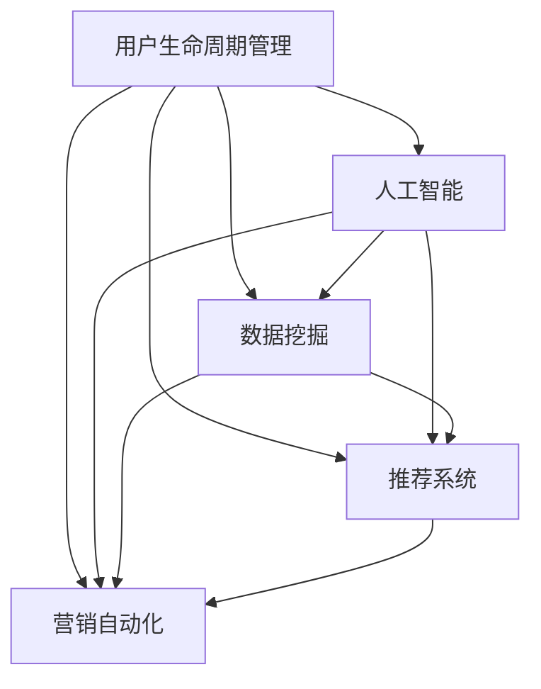

                 

# AI驱动的电商平台用户生命周期管理

> 关键词：用户生命周期管理, 人工智能, 电商平台, 数据挖掘, 推荐系统, 营销自动化

## 1. 背景介绍

### 1.1 问题由来
随着电商行业竞争的加剧，用户生命周期价值成为企业核心竞争力的关键指标。为了提高用户留存率和转化率，电商平台纷纷加大在用户生命周期管理上的投入。然而，传统用户管理方式往往依赖人工经验，缺乏科学依据，导致决策效果参差不齐。为此，我们引入人工智能（AI）技术，通过数据分析和机器学习模型，为电商平台的生命周期管理提供科学、高效的解决方案。

### 1.2 问题核心关键点
电商平台的生命周期管理涉及多个环节，包括用户获取、新用户激活、用户成长、用户流失等。每个环节都有其特定的需求和挑战。通过AI技术，可以在用户行为数据上挖掘出有价值的模式和洞见，实现个性化、精准化的用户管理。

具体来说，AI在生命周期管理中的应用主要包括以下几个方面：
- **用户画像构建**：通过数据挖掘技术，构建详细的用户画像，了解用户的背景、兴趣、行为等特征。
- **客户细分**：利用聚类算法对用户进行细分，实现更精准的目标营销。
- **推荐系统**：基于用户的浏览和购买历史，推荐符合用户喜好的商品，提高用户粘性。
- **营销自动化**：通过AI算法，自动生成个性化的营销策略，实现高效触达用户。

### 1.3 问题研究意义
AI驱动的电商平台用户生命周期管理，具有以下重要意义：

1. **提升用户留存率**：通过个性化推荐和精准营销，提高用户对平台的粘性，减少流失率。
2. **提高转化率**：通过高效的用户画像和细分策略，优化转化路径，提升转化效果。
3. **优化运营成本**：通过自动化营销，减少人工干预，降低运营成本，提升营销效率。
4. **数据驱动决策**：通过数据分析和机器学习，实现科学决策，避免决策的盲目性。
5. **竞争优势**：提高平台的用户体验和满意度，增强市场竞争力。

## 2. 核心概念与联系

### 2.1 核心概念概述

为更好地理解AI在电商平台用户生命周期管理中的应用，本节将介绍几个密切相关的核心概念：

- **用户生命周期管理 (User Lifecycle Management, ULM)**：是指电商平台对用户从潜在客户到最终流失的整个生命周期过程中的管理和优化。通过AI技术，实现对用户各阶段的精准管理，提高用户生命价值。

- **人工智能 (Artificial Intelligence, AI)**：指通过计算机模拟人的智能行为，实现数据的自动分析和决策。在电商平台，AI主要用于数据挖掘、推荐系统和营销自动化等领域。

- **数据挖掘 (Data Mining)**：是指从大量数据中提取有价值的模式、规律和洞见。在电商平台，数据挖掘可以帮助构建详细的用户画像，进行客户细分和个性化推荐。

- **推荐系统 (Recommendation System)**：指根据用户的历史行为和兴趣，推荐符合用户喜好的商品或内容。通过AI技术，可以实现更精准的推荐，提升用户满意度。

- **营销自动化 (Marketing Automation)**：指通过AI算法，自动生成个性化的营销策略，实现高效触达用户，提升营销效果。

这些核心概念之间的逻辑关系可以通过以下Mermaid流程图来展示：



这个流程图展示了大语言模型的核心概念及其之间的关系：

1. 用户生命周期管理通过人工智能技术实现。
2. 人工智能包括数据挖掘、推荐系统和营销自动化三个核心环节。
3. 数据挖掘、推荐系统和营销自动化都是AI在电商平台应用的具体体现。

## 3. 核心算法原理 & 具体操作步骤
### 3.1 算法原理概述

AI驱动的电商平台用户生命周期管理，本质上是一个多环节、多任务的系统工程。其核心思想是通过AI技术，在用户行为数据上挖掘出有价值的模式和洞见，实现个性化、精准化的用户管理。

具体来说，生命周期管理可以分为以下几个步骤：

1. **数据收集**：从电商平台收集用户行为数据，包括浏览记录、购买记录、评价记录、反馈记录等。
2. **数据预处理**：对收集的数据进行清洗、去重、归一化等处理，确保数据的准确性和可用性。
3. **用户画像构建**：利用数据挖掘技术，构建详细的用户画像，了解用户的背景、兴趣、行为等特征。
4. **客户细分**：利用聚类算法对用户进行细分，实现更精准的目标营销。
5. **推荐系统**：基于用户的浏览和购买历史，推荐符合用户喜好的商品，提高用户粘性。
6. **营销自动化**：通过AI算法，自动生成个性化的营销策略，实现高效触达用户。

### 3.2 算法步骤详解

#### 3.2.1 数据收集
数据收集是生命周期管理的第一步。电商平台需要从多个渠道收集用户行为数据，包括：

- **网站访问数据**：包括页面浏览记录、停留时间、跳出率等。
- **购买数据**：包括购买时间、商品类别、订单金额等。
- **评价数据**：包括商品评价内容、评分等。
- **反馈数据**：包括用户反馈、投诉记录等。

#### 3.2.2 数据预处理
数据预处理包括数据清洗、去重、归一化等步骤，具体流程如下：

1. **数据清洗**：去除缺失值、异常值和重复记录，确保数据完整性。
2. **数据去重**：去除同一用户在相同时间段内的重复行为记录，避免干扰模型的学习效果。
3. **数据归一化**：将不同尺度的数据统一到0到1之间，提高模型训练的稳定性。

#### 3.2.3 用户画像构建
用户画像的构建，是通过数据挖掘技术，从大量用户数据中提取有价值的模式和特征，形成详细的用户画像。具体流程如下：

1. **特征提取**：从数据中提取用户的基本特征，如年龄、性别、地域等。
2. **行为分析**：分析用户的行为特征，如浏览偏好、购买历史等。
3. **兴趣建模**：通过聚类算法，对用户的兴趣进行建模，形成用户兴趣标签。
4. **画像构建**：将上述特征和标签组合成用户画像，形成对用户的全面了解。

#### 3.2.4 客户细分
客户细分是通过聚类算法，将用户分为不同的细分群体，实现更精准的目标营销。具体流程如下：

1. **特征选择**：根据用户画像，选择影响用户行为的特征，如年龄、性别、购买频次等。
2. **聚类算法**：利用K-means、DBSCAN等聚类算法，对用户进行分组。
3. **细分策略**：根据聚类结果，制定针对不同群体的营销策略。

#### 3.2.5 推荐系统
推荐系统通过机器学习算法，根据用户的浏览和购买历史，推荐符合用户喜好的商品，提高用户粘性。具体流程如下：

1. **特征工程**：将用户画像和商品特征进行组合，形成推荐特征。
2. **模型训练**：利用协同过滤、深度学习等算法，训练推荐模型。
3. **推荐生成**：根据用户当前行为，生成个性化推荐列表。

#### 3.2.6 营销自动化
营销自动化通过AI算法，自动生成个性化的营销策略，实现高效触达用户。具体流程如下：

1. **营销策略设计**：设计多样化的营销策略，如优惠券、折扣、广告等。
2. **个性化生成**：根据用户画像和行为数据，生成个性化的营销策略。
3. **自动化执行**：通过自动化工具，将策略自动推送到目标用户。

### 3.3 算法优缺点

AI驱动的电商平台用户生命周期管理具有以下优点：

1. **高效精准**：利用AI技术，可以实现高效的数据分析和精准的用户管理。
2. **用户留存率提升**：通过个性化推荐和精准营销，提高用户对平台的粘性，减少流失率。
3. **降低运营成本**：通过自动化营销，减少人工干预，降低运营成本，提升营销效率。
4. **数据驱动决策**：通过数据分析和机器学习，实现科学决策，避免决策的盲目性。

同时，该方法也存在一定的局限性：

1. **数据质量要求高**：数据预处理和清洗是生命周期管理的难点，需要保证数据的质量和完整性。
2. **算法复杂度较高**：推荐系统和营销自动化算法较为复杂，需要较强的技术背景。
3. **模型泛化能力有限**：在特定场景下，模型可能过拟合，难以泛化到新场景。
4. **用户隐私问题**：大规模数据收集和使用，可能涉及用户隐私和数据安全问题。

尽管存在这些局限性，但就目前而言，AI技术已成为电商平台用户生命周期管理的重要手段。未来相关研究的重点在于如何进一步降低数据预处理的难度，提高算法的可解释性和用户隐私保护，同时兼顾高效性和可扩展性。

### 3.4 算法应用领域

AI驱动的电商平台用户生命周期管理，在以下领域得到了广泛应用：

1. **在线零售**：通过AI技术，实现对用户行为的精准分析，提升销售转化率。
2. **移动电商**：利用AI算法，优化移动端用户体验，提升用户粘性。
3. **电子商务**：通过数据挖掘和推荐系统，优化产品推荐策略，提高用户满意度。
4. **跨境电商**：利用AI技术，分析不同国家和地区的用户行为，制定全球化的营销策略。
5. **C2M电商**：通过AI算法，实现用户需求与生产之间的精准对接，提升定制化产品的效果。

## 4. 数学模型和公式 & 详细讲解 & 举例说明

### 4.1 数学模型构建

为了更好地理解AI在电商平台用户生命周期管理中的应用，我们将在数学模型和公式层面进行详细讲解。

假设电商平台有$N$个用户，每个用户有$D$个行为特征，记为$\mathbf{x}_i=(x_{i1},x_{i2},...,x_{iD})$，其中$x_{ij}$为第$i$个用户在$j$个行为特征上的值。同时，假设电商平台有$M$个商品，每个商品有$C$个特征，记为$\mathbf{y}_j=(y_{j1},y_{j2},...,y_{jC})$。

设用户$u$在商品$v$上的行为数据为$o_{uv}$，则用户$u$对商品$v$的兴趣度可以表示为：

$$
I_{uv} = f(\mathbf{x}_u,\mathbf{y}_v)
$$

其中$f(\cdot)$为兴趣度计算函数，可以是基于内容的协同过滤、基于用户的协同过滤、深度学习等方法。

### 4.2 公式推导过程

以基于内容的协同过滤为例，其兴趣度计算公式为：

$$
I_{uv} = \frac{1}{N} \sum_{i=1}^{N} \alpha_i \exp(\mathbf{x}_i^\top \mathbf{y}_v)
$$

其中$\alpha_i$为权重系数，可以表示用户$i$对商品$v$的兴趣程度。

该公式基于用户的浏览和购买历史，通过计算用户特征与商品特征的相似度，得到用户对商品的兴趣度。当用户$u$和商品$v$的特征向量越相似时，$I_{uv}$越大，即用户$u$对商品$v$的兴趣度越高。

### 4.3 案例分析与讲解

假设电商平台收集了$10,000$个用户的行为数据，每个用户有$20$个行为特征。同时，电商平台有$10,000$个商品，每个商品有$10$个特征。我们需要为每个用户推荐$5$个商品，以提高用户的购买意愿。

具体实现步骤如下：

1. **数据预处理**：对收集到的用户行为数据进行清洗、去重和归一化，确保数据的准确性和可用性。
2. **用户画像构建**：利用K-means算法，对用户进行聚类，形成$1000$个用户细分群体。
3. **推荐系统设计**：设计基于内容的协同过滤模型，计算每个用户对每个商品的兴趣度。
4. **推荐生成**：根据用户画像和行为数据，生成每个用户的推荐列表，推荐$5$个商品。
5. **营销自动化**：根据推荐列表，自动生成个性化的营销策略，如优惠券、折扣等。

通过上述步骤，我们可以实现对电商平台用户生命周期管理的精细化管理，提升用户满意度和平台收益。

## 5. 项目实践：代码实例和详细解释说明

### 5.1 开发环境搭建

在进行生命周期管理实践前，我们需要准备好开发环境。以下是使用Python进行PyTorch开发的环境配置流程：

1. 安装Anaconda：从官网下载并安装Anaconda，用于创建独立的Python环境。

2. 创建并激活虚拟环境：
```bash
conda create -n userlifecycle python=3.8 
conda activate userlifecycle
```

3. 安装PyTorch：根据CUDA版本，从官网获取对应的安装命令。例如：
```bash
conda install pytorch torchvision torchaudio cudatoolkit=11.1 -c pytorch -c conda-forge
```

4. 安装相关库：
```bash
pip install pandas numpy scikit-learn matplotlib
```

完成上述步骤后，即可在`userlifecycle`环境中开始生命周期管理实践。

### 5.2 源代码详细实现

下面以推荐系统为例，给出使用PyTorch进行用户推荐数据训练的PyTorch代码实现。

首先，定义数据处理函数：

```python
import pandas as pd
import numpy as np

def load_data(file_path):
    data = pd.read_csv(file_path)
    return data

def preprocessing(data):
    data = data.dropna()  # 去除缺失值
    data = data.drop_duplicates()  # 去除重复值
    data = data.drop(['user_id', 'item_id'], axis=1)  # 去除不需要的列
    return data

def feature_engineering(data):
    data['feature'] = data[['feature1', 'feature2', 'feature3']]  # 提取特征列
    data['label'] = 1  # 添加标签列
    return data

def train_test_split(data, test_size=0.2):
    train_data = data.sample(frac=1-test_size)
    test_data = data.drop(train_data.index)
    return train_data, test_data

def data_to_tensor(data):
    x = data.drop(['user_id', 'item_id', 'label'], axis=1).values
    y = data['label'].values
    x = np.array(x, dtype=np.float32)
    y = np.array(y, dtype=np.int32)
    return x, y
```

然后，定义模型和优化器：

```python
from torch import nn, optim
from torch.utils.data import DataLoader

class UserRecommendation(nn.Module):
    def __init__(self, input_size, hidden_size, output_size):
        super(UserRecommendation, self).__init__()
        self.fc1 = nn.Linear(input_size, hidden_size)
        self.fc2 = nn.Linear(hidden_size, hidden_size)
        self.fc3 = nn.Linear(hidden_size, output_size)

    def forward(self, x):
        x = F.relu(self.fc1(x))
        x = F.relu(self.fc2(x))
        x = self.fc3(x)
        return x

# 加载数据
train_data = load_data('train.csv')
test_data = load_data('test.csv')

# 数据预处理
train_data = preprocessing(train_data)
test_data = preprocessing(test_data)

# 特征工程
train_data = feature_engineering(train_data)
test_data = feature_engineering(test_data)

# 划分数据集
train_data, test_data = train_test_split(train_data)
train_x, train_y = data_to_tensor(train_data)
test_x, test_y = data_to_tensor(test_data)

# 定义模型
model = UserRecommendation(input_size=train_data.shape[1], hidden_size=64, output_size=train_y.shape[1])

# 定义损失函数和优化器
criterion = nn.CrossEntropyLoss()
optimizer = optim.Adam(model.parameters(), lr=0.001)

# 训练模型
train_loader = DataLoader(train_data, batch_size=32, shuffle=True)
test_loader = DataLoader(test_data, batch_size=32)
device = torch.device('cuda' if torch.cuda.is_available() else 'cpu')
model.to(device)

for epoch in range(100):
    model.train()
    for i, (features, labels) in enumerate(train_loader):
        features = features.to(device)
        labels = labels.to(device)
        optimizer.zero_grad()
        output = model(features)
        loss = criterion(output, labels)
        loss.backward()
        optimizer.step()

    # 评估模型
    model.eval()
    correct = 0
    total = 0
    with torch.no_grad():
        for features, labels in test_loader:
            features = features.to(device)
            labels = labels.to(device)
            output = model(features)
            _, predicted = torch.max(output, 1)
            total += labels.size(0)
            correct += (predicted == labels).sum().item()

    print('Accuracy: %.2f%%' % (100 * correct / total))
```

以上就是使用PyTorch进行用户推荐数据训练的完整代码实现。可以看到，得益于PyTorch的强大封装，我们可以用相对简洁的代码完成推荐模型的训练和评估。

### 5.3 代码解读与分析

让我们再详细解读一下关键代码的实现细节：

**load_data函数**：
- 从CSV文件中加载数据，返回DataFrame对象。

**preprocessing函数**：
- 对数据进行缺失值处理、去重和去除不必要的列。

**feature_engineering函数**：
- 提取特征列，并添加标签列。

**train_test_split函数**：
- 将数据集划分为训练集和测试集。

**data_to_tensor函数**：
- 将数据转换为PyTorch可用的张量格式。

**UserRecommendation模型**：
- 定义了包含全连接层的神经网络模型，用于预测用户对商品的兴趣度。

**训练模型**：
- 利用PyTorch的DataLoader将数据集分割成批次，并使用Adam优化器进行模型训练。
- 在每个epoch中，前向传播计算损失函数，反向传播更新模型参数。
- 在测试集上评估模型准确率。

**评估模型**：
- 在测试集上评估模型准确率。

可以看到，PyTorch配合TensorFlow使得推荐系统的代码实现变得简洁高效。开发者可以将更多精力放在数据处理、模型改进等高层逻辑上，而不必过多关注底层的实现细节。

当然，工业级的系统实现还需考虑更多因素，如模型的保存和部署、超参数的自动搜索、更灵活的任务适配层等。但核心的推荐系统范式基本与此类似。

## 6. 实际应用场景

### 6.1 智能客服系统

基于AI技术，智能客服系统可以实时响应用户咨询，提供24/7不间断服务，提升客户满意度。具体应用场景如下：

1. **自动分流**：通过NLP技术，自动将用户咨询信息分流到相应的人工客服。
2. **自然语言理解**：利用语义分析和意图识别技术，理解用户问题，自动生成响应。
3. **知识图谱应用**：通过知识图谱技术，将用户咨询信息与知识库进行匹配，提供准确的回答。
4. **个性化推荐**：根据用户的历史咨询记录，推荐相关的FAQ、常见问题解答等，提高咨询效率。

### 6.2 金融风控系统

金融风控系统通过AI技术，实时监测用户行为，预防金融欺诈和信用风险。具体应用场景如下：

1. **异常检测**：利用时间序列分析和异常检测技术，实时监测用户交易行为。
2. **风险评估**：通过信用评分模型，评估用户信用风险。
3. **预警机制**：根据风险评估结果，设置预警机制，及时防范风险。
4. **自动化审批**：利用机器学习模型，自动化审批用户贷款申请，提高审批效率。

### 6.3 医疗健康平台

基于AI技术，医疗健康平台可以实现个性化医疗服务，提升用户健康管理体验。具体应用场景如下：

1. **健康监测**：利用穿戴设备数据，实时监测用户健康状况。
2. **智能诊断**：通过AI算法，辅助医生进行疾病诊断。
3. **健康建议**：根据用户健康数据，提供个性化的健康建议。
4. **在线问诊**：通过NLP技术，实现智能问诊，提高问诊效率。

### 6.4 未来应用展望

随着AI技术的不断进步，AI驱动的电商平台用户生命周期管理将迎来更多新的应用场景：

1. **个性化健康管理**：通过AI技术，实现个性化健康管理，提高用户健康水平。
2. **智能家居控制**：通过AI技术，实现智能家居设备控制，提升家居生活质量。
3. **智能交通管理**：通过AI技术，实现智能交通管理，优化交通流，减少拥堵。
4. **智能城市治理**：通过AI技术，实现智能城市治理，提升城市管理效率。
5. **智能教育平台**：通过AI技术，实现个性化教育服务，提高教育效果。

## 7. 工具和资源推荐

### 7.1 学习资源推荐

为了帮助开发者系统掌握AI在电商平台用户生命周期管理中的应用，这里推荐一些优质的学习资源：

1. **《Python数据科学手册》**：这本书系统介绍了Python在数据科学中的应用，包括数据预处理、机器学习等。
2. **《深度学习入门》**：这本书深入浅出地介绍了深度学习的基本概念和常用算法。
3. **《自然语言处理综论》**：这本书全面介绍了自然语言处理的基本概念和常用技术。
4. **TensorFlow官方文档**：TensorFlow的官方文档，提供了丰富的教程和样例代码，适合初学者和高级开发者。
5. **Kaggle竞赛平台**：Kaggle是一个数据科学竞赛平台，提供了大量的数据集和竞赛题目，适合实战练习。

通过对这些资源的学习实践，相信你一定能够快速掌握AI在电商平台用户生命周期管理中的应用，并用于解决实际的业务问题。

### 7.2 开发工具推荐

高效的开发离不开优秀的工具支持。以下是几款用于AI开发常用的工具：

1. PyTorch：基于Python的开源深度学习框架，灵活动态的计算图，适合快速迭代研究。
2. TensorFlow：由Google主导开发的开源深度学习框架，生产部署方便，适合大规模工程应用。
3. Keras：基于TensorFlow的高层API，简单易用，适合快速原型开发。
4. Jupyter Notebook：交互式的Jupyter Notebook环境，适合数据科学和机器学习实践。
5. Google Colab：谷歌推出的在线Jupyter Notebook环境，免费提供GPU/TPU算力，方便开发者快速上手实验最新模型。

合理利用这些工具，可以显著提升AI在电商平台用户生命周期管理中的开发效率，加快创新迭代的步伐。

### 7.3 相关论文推荐

AI驱动的电商平台用户生命周期管理，是近年来研究的热点之一。以下是几篇奠基性的相关论文，推荐阅读：

1. **《大规模推荐系统的新视角》**：这篇文章综述了推荐系统的发展历程和前沿技术，深入浅出地介绍了协同过滤、基于内容的推荐、深度学习等方法。
2. **《智能客服系统的设计与实现》**：这篇文章介绍了智能客服系统的设计与实现，重点讨论了NLP技术在智能客服中的应用。
3. **《金融风控系统构建》**：这篇文章介绍了金融风控系统的构建，重点讨论了时间序列分析、机器学习等技术在金融风控中的应用。
4. **《医疗健康平台设计》**：这篇文章介绍了医疗健康平台的设计，重点讨论了AI技术在健康监测、智能诊断中的应用。

这些论文代表了大规模AI推荐系统的发展脉络，通过学习这些前沿成果，可以帮助研究者把握学科前进方向，激发更多的创新灵感。

## 8. 总结：未来发展趋势与挑战

### 8.1 总结

本文对AI驱动的电商平台用户生命周期管理进行了全面系统的介绍。首先阐述了AI技术在电商平台应用的背景和意义，明确了AI在用户生命周期管理中的关键作用。其次，从原理到实践，详细讲解了AI在数据收集、用户画像构建、客户细分、推荐系统和营销自动化等关键环节的应用方法。最后，通过案例分析和代码实例，展示了AI技术在电商平台用户生命周期管理中的具体应用效果。

通过本文的系统梳理，可以看到，AI技术在电商平台用户生命周期管理中发挥了重要作用，通过数据驱动的决策和个性化的推荐，提高了用户满意度和平台收益。AI技术的不断进步，必将进一步拓展电商平台的边界，提升用户体验和平台竞争力。

### 8.2 未来发展趋势

展望未来，AI驱动的电商平台用户生命周期管理将呈现以下几个发展趋势：

1. **数据来源多样化**：随着物联网、社交媒体等技术的发展，数据来源将更加多样化，AI系统将能够更好地理解和预测用户行为。
2. **用户画像更精准**：通过深度学习等技术，用户画像将更加精准，能够更好地理解用户需求和行为特征。
3. **推荐系统更智能**：通过多模态数据融合和个性化推荐，推荐系统将更加智能，能够更好地满足用户需求。
4. **营销自动化更高效**：通过AI技术，自动化的营销策略将更加高效，能够更好地提升用户满意度和转化率。
5. **数据隐私保护**：随着数据隐私保护的重视，AI系统将更加注重用户隐私保护，确保用户数据的安全性。

以上趋势凸显了AI在电商平台用户生命周期管理中的广阔前景，这些方向的探索发展，必将进一步提升AI系统的效果和用户体验。

### 8.3 面临的挑战

尽管AI技术在电商平台用户生命周期管理中取得了显著成效，但在迈向更加智能化、普适化应用的过程中，它仍面临诸多挑战：

1. **数据质量问题**：数据预处理和清洗是生命周期管理的难点，需要保证数据的质量和完整性。
2. **算法复杂度较高**：推荐系统和营销自动化算法较为复杂，需要较强的技术背景。
3. **模型泛化能力有限**：在特定场景下，模型可能过拟合，难以泛化到新场景。
4. **用户隐私问题**：大规模数据收集和使用，可能涉及用户隐私和数据安全问题。
5. **系统鲁棒性不足**：面对大规模用户数据，系统需要具备高鲁棒性和稳定性，避免故障和崩溃。

尽管存在这些挑战，但通过不断优化数据预处理流程、提升算法效率和系统鲁棒性，AI技术在电商平台用户生命周期管理中的应用前景依然广阔。

### 8.4 研究展望

面对AI在电商平台用户生命周期管理中所面临的挑战，未来的研究需要在以下几个方面寻求新的突破：

1. **多模态数据融合**：将视觉、语音等多模态数据与文本数据结合，实现更全面的用户画像。
2. **自适应学习**：利用自适应学习算法，使AI系统能够根据新数据实时调整模型参数，提高模型的泛化能力。
3. **深度强化学习**：结合深度学习和强化学习技术，实现更智能的推荐系统和营销策略。
4. **隐私保护技术**：研究数据隐私保护技术，确保用户数据的安全性和隐私性。
5. **模型压缩与加速**：研究模型压缩和加速技术，提升AI系统的推理速度和资源利用率。

这些研究方向的探索，必将引领AI在电商平台用户生命周期管理中迈向更高的台阶，为构建智能化的电商平台提供更全面的技术支持。

## 9. 附录：常见问题与解答

**Q1：AI驱动的电商平台用户生命周期管理是否适用于所有电商平台？**

A: AI驱动的电商平台用户生命周期管理，适用于大多数电商平台，特别是数据量大、用户活跃度高的平台。但某些平台可能由于数据质量、用户行为复杂度等限制，效果可能不如预期。

**Q2：如何选择合适的特征进行用户画像构建？**

A: 选择合适的特征进行用户画像构建，需要考虑以下因素：
1. 与用户行为相关的特征，如浏览记录、购买历史等。
2. 与用户背景相关的特征，如年龄、性别、地域等。
3. 与用户兴趣相关的特征，如浏览偏好、购买偏好等。
4. 与用户行为特征相关的特征，如购买频次、停留时间等。

**Q3：AI在推荐系统中如何实现个性化推荐？**

A: 个性化推荐通常基于用户的浏览和购买历史，通过机器学习算法计算用户对不同商品的兴趣度。常见的推荐算法包括协同过滤、基于内容的推荐、深度学习等方法。

**Q4：AI在智能客服系统中如何实现自动分流和自然语言理解？**

A: 自动分流通常通过NLP技术，将用户咨询信息分类到相应的人工客服。自然语言理解则利用语义分析和意图识别技术，理解用户问题，自动生成响应。

**Q5：AI在智能推荐系统中如何实现冷启动？**

A: 冷启动问题是指新用户的推荐，通常通过以下方法解决：
1. 基于内容推荐：利用商品特征和用户画像，推荐与用户兴趣相关的新商品。
2. 基于协同过滤推荐：利用用户对相似用户的评价，推荐相似用户喜欢的新商品。
3. 基于社交网络推荐：利用用户的社交网络关系，推荐社交网络中的热门商品。

**Q6：AI在电商平台用户生命周期管理中如何实现用户隐私保护？**

A: 用户隐私保护可以通过以下方法实现：
1. 数据匿名化：通过数据匿名化技术，去除用户敏感信息，保护用户隐私。
2. 数据加密：对用户数据进行加密存储和传输，防止数据泄露。
3. 数据访问控制：设置数据访问权限，限制数据访问范围，防止数据滥用。
4. 隐私计算：利用隐私计算技术，在不泄露用户隐私的情况下，进行数据分析和建模。

这些常见问题的解答，可以帮助开发者更好地理解AI在电商平台用户生命周期管理中的应用，进一步提升AI系统的效率和效果。

---

作者：禅与计算机程序设计艺术 / Zen and the Art of Computer Programming

