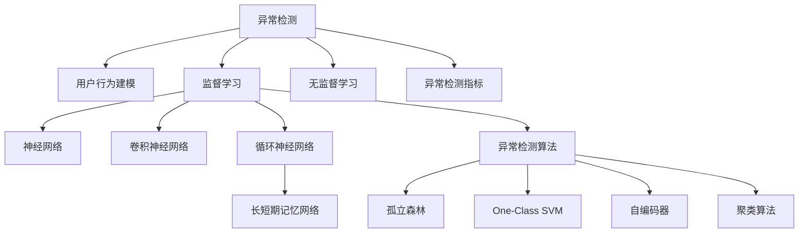

                 

## 1. 背景介绍

### 1.1 问题由来

在当下数字化时代，电商平台已经成为人们购物的主要渠道。然而，电商平台的商业竞争也日益激烈，用户流失、欺诈、退货等问题频发，对企业的经营造成了严重影响。因此，电商平台亟需一款高效、准确的异常检测系统，以识别出潜在风险用户和异常行为，从而采取及时干预措施，保障平台运营安全和用户体验。

### 1.2 问题核心关键点

异常检测问题可以通过建立用户行为模型，并利用统计学和机器学习的方法实现。常见的异常检测方法包括：

- 基于规则的方法：通过手工定义规则，检测不符合规则的用户行为。但规则的制定和更新需要大量经验，且难以应对未知的异常情况。

- 基于统计学的方法：通过计算用户行为数据的标准差、平均值等统计量，检测偏离正常行为范围的异常数据。但该方法对于数据分布和异常模式的变化敏感，效果有限。

- 基于机器学习的方法：使用监督或无监督学习算法，训练异常检测模型。通过模型学习正常行为数据，并利用决策树、随机森林、神经网络等算法，识别出异常行为。该方法适用于大规模数据和高维特征，可以处理未知异常模式，但需要大量标注数据和计算资源。

## 2. 核心概念与联系

### 2.1 核心概念概述

为了更好地理解AI驱动的电商平台用户行为异常检测方法，本节将介绍几个核心概念：

- 异常检测(Anomaly Detection)：通过数据分析和机器学习算法，识别出与正常行为模式不一致的异常数据或行为。

- 用户行为建模(User Behavior Modeling)：通过数据挖掘和统计学方法，建立用户行为的概率模型，如用户购买行为模型、浏览行为模型、交互行为模型等。

- 监督学习(Supervised Learning)：在标注数据上训练异常检测模型，通过学习正常行为数据和标注标签，识别异常行为。

- 无监督学习(Unsupervised Learning)：在无标注数据上训练异常检测模型，通过学习数据的内在结构，识别异常行为。

- 神经网络(Neural Networks)：一种强大的机器学习模型，通过多层非线性变换，提取数据特征，学习复杂非线性模式。

- 卷积神经网络(Convolutional Neural Networks, CNN)：一种擅长处理图像和序列数据的神经网络模型。

- 循环神经网络(Recurrent Neural Networks, RNN)：一种能够处理序列数据的时间依赖关系的神经网络模型。

- 长短期记忆网络(Long Short-Term Memory, LSTM)：一种RNN的变种，能够记忆长期依赖关系。

- 异常检测算法：包括孤立森林、One-Class SVM、自编码器、聚类算法等，用于训练异常检测模型。

- 异常检测指标：如准确率、召回率、F1分数、ROC曲线等，用于评估异常检测模型的性能。

这些核心概念之间的逻辑关系可以通过以下Mermaid流程图来展示：



这个流程图展示了几类关键概念及其之间的关系：

1. 异常检测是最终目标，用于识别异常用户和行为。
2. 用户行为建模是异常检测的基础，通过挖掘用户数据中的规律，建立行为模型。
3. 监督学习和无监督学习是异常检测的两种主要方法，分别依赖标注数据和无标注数据。
4. 神经网络是异常检测中常用的模型，包括卷积神经网络和循环神经网络，能够提取复杂特征。
5. 长短期记忆网络是RNN的一种变种，适用于处理长时间依赖关系的序列数据。
6. 异常检测算法包括多种具体算法，如孤立森林、One-Class SVM、自编码器、聚类算法等，用于训练异常检测模型。
7. 异常检测指标用于评估模型性能，如准确率、召回率、F1分数、ROC曲线等。

## 3. 核心算法原理 & 具体操作步骤

### 3.1 算法原理概述

AI驱动的电商平台用户行为异常检测系统主要包含以下几个步骤：

1. 数据收集：收集电商平台的用户行为数据，如浏览记录、购买记录、交互记录等。

2. 数据预处理：清洗、去噪、归一化数据，提取特征向量。

3. 行为建模：建立用户行为的概率模型，如基于用户购买历史建立用户消费行为模型。

4. 异常检测：在正常行为数据上训练异常检测模型，如孤立森林、自编码器等。

5. 异常识别：在测试数据上识别出异常行为数据，进行风险预警和处理。

### 3.2 算法步骤详解

#### 3.2.1 数据收集

电商平台需要从多个维度收集用户行为数据，如：

- 浏览数据：记录用户浏览过的商品、停留时间、点击率等。
- 购买数据：记录用户购买的商品、交易时间、价格等。
- 交互数据：记录用户与客服的聊天记录、用户评价、反馈等。

#### 3.2.2 数据预处理

对收集到的数据进行预处理，包括：

- 数据清洗：去除噪音数据、重复数据、无效数据等。
- 特征提取：从原始数据中提取有用的特征，如浏览频率、购买次数、用户评分等。
- 数据归一化：将数据标准化到0-1之间，提高模型的收敛速度和准确率。

#### 3.2.3 行为建模

行为建模可以使用多种方法，包括：

- 基于统计学的方法：计算用户行为的均值和标准差，检测偏离正常范围的行为。
- 基于机器学习的方法：使用监督或无监督学习算法，训练用户行为模型。

#### 3.2.4 异常检测

异常检测可以使用多种算法，如：

- 孤立森林(Isolation Forest)：一种基于随机树的异常检测算法，能够处理高维数据和复杂数据结构。
- One-Class SVM：一种基于支持向量机的异常检测算法，能够处理高维数据和噪声数据。
- 自编码器(Autencoder)：一种无监督学习算法，通过重构输入数据，检测异常数据。
- 聚类算法(Clustering)：如K-means、DBSCAN等，通过聚类检测异常点。

#### 3.2.5 异常识别

在训练好的异常检测模型上，对新数据进行异常识别，具体步骤如下：

1. 对新数据进行预处理，包括归一化、特征提取等。
2. 使用训练好的异常检测模型，检测新数据是否为异常数据。
3. 对异常数据进行标记和预警，采取相应的处理措施。

### 3.3 算法优缺点

#### 3.3.1 优点

1. 高精度：AI驱动的异常检测系统，能够利用深度学习和大数据分析技术，识别出细微的异常模式，从而提高异常检测的准确率。

2. 自适应性强：异常检测模型能够自动学习正常行为模式，并适应数据分布的变化，对未知异常模式也有较好的识别能力。

3. 实时性：AI驱动的异常检测系统能够实时处理新数据，及时发现异常行为，保障电商平台运营安全。

#### 3.3.2 缺点

1. 数据依赖性强：异常检测模型的性能依赖于大量的正常行为数据，数据质量直接影响异常检测效果。

2. 计算资源消耗大：AI驱动的异常检测系统需要大量的计算资源进行模型训练和数据处理，对于小规模数据和低资源环境的适用性有限。

3. 模型复杂度高：异常检测模型往往包含多层神经网络，模型结构复杂，训练和推理速度较慢。

4. 模型解释性差：深度学习模型通常是"黑盒"模型，难以解释其内部工作机制和决策逻辑，对模型优化和调试带来挑战。

5. 数据隐私风险：电商平台用户数据涉及用户隐私，异常检测系统需要遵循数据保护法规，对用户数据进行安全处理。

## 4. 数学模型和公式 & 详细讲解 & 举例说明

### 4.1 数学模型构建

异常检测的数学模型主要包括以下几个组成部分：

1. 数据集：$D=\{(x_i, y_i)\}_{i=1}^N$，其中 $x_i$ 表示用户行为数据，$y_i$ 表示是否为异常数据。

2. 模型：$f(x)$，表示异常检测模型。

3. 损失函数：$L(f, D)$，表示模型在数据集上的损失函数。

4. 优化目标：$\min_{f} L(f, D)$，表示最小化损失函数，优化模型性能。

### 4.2 公式推导过程

#### 4.2.1 孤立森林(Isolation Forest)算法

孤立森林是一种基于随机树的异常检测算法，其主要思路是通过构建随机树，将正常数据与异常数据进行隔离，从而识别异常数据。孤立森林的异常检测公式如下：

$$
P(x_i|y_i=1) = \frac{1}{N} \sum_{k=1}^N \frac{t_k(x_i)}{t_k(x_j)}
$$

其中 $t_k(x_i)$ 表示第 $k$ 棵随机树对数据 $x_i$ 的隔离深度，$N$ 表示随机树的数量。$P(x_i|y_i=1)$ 表示数据 $x_i$ 为异常数据的概率。

#### 4.2.2 One-Class SVM算法

One-Class SVM是一种基于支持向量机的异常检测算法，其主要思路是通过构建一个超平面，将正常数据映射到超平面内，将异常数据映射到超平面外。One-Class SVM的异常检测公式如下：

$$
P(x_i|y_i=1) = \frac{1}{N} \sum_{k=1}^N \exp(-\gamma \delta_k)
$$

其中 $\delta_k$ 表示第 $k$ 个样本到超平面的距离，$\gamma$ 表示核函数参数。$P(x_i|y_i=1)$ 表示数据 $x_i$ 为异常数据的概率。

#### 4.2.3 自编码器(Autencoder)算法

自编码器是一种无监督学习算法，其主要思路是通过重构输入数据，检测异常数据。自编码器的异常检测公式如下：

$$
P(x_i|y_i=1) = \frac{1}{N} \sum_{k=1}^N \|x_i - \hat{x}_k\|
$$

其中 $\hat{x}_k$ 表示第 $k$ 个样本的重构结果，$N$ 表示样本数量。$P(x_i|y_i=1)$ 表示数据 $x_i$ 为异常数据的概率。

### 4.3 案例分析与讲解

#### 4.3.1 孤立森林案例

假设电商平台有如下数据集 $D=\{(x_i, y_i)\}_{i=1}^N$，其中 $x_i$ 表示用户浏览记录，$y_i$ 表示是否为异常记录：

| 用户ID | 浏览记录 | 异常标签 |
| ------ | -------- | -------- |
| 1      | [商品A, 商品B] | 0       |
| 2      | [商品A, 商品B, 商品C] | 0       |
| 3      | [商品B, 商品C] | 0       |
| 4      | [商品A, 商品B] | 1       |
| 5      | [商品B, 商品C] | 1       |

使用孤立森林算法，训练异常检测模型 $f(x)$。具体步骤如下：

1. 构建随机树，将正常数据和异常数据进行隔离。
2. 计算每个数据点 $x_i$ 的隔离深度 $t_k(x_i)$。
3. 使用公式 $P(x_i|y_i=1) = \frac{1}{N} \sum_{k=1}^N \frac{t_k(x_i)}{t_k(x_j)}$，计算每个数据点 $x_i$ 为异常数据的概率。
4. 将计算结果输出，进行异常识别。

#### 4.3.2 One-Class SVM案例

假设电商平台有如下数据集 $D=\{(x_i, y_i)\}_{i=1}^N$，其中 $x_i$ 表示用户购买记录，$y_i$ 表示是否为异常记录：

| 用户ID | 购买记录 | 异常标签 |
| ------ | -------- | -------- |
| 1      | [商品A, 商品B] | 0       |
| 2      | [商品A, 商品B, 商品C] | 0       |
| 3      | [商品B, 商品C] | 0       |
| 4      | [商品A, 商品B] | 1       |
| 5      | [商品B, 商品C] | 1       |

使用One-Class SVM算法，训练异常检测模型 $f(x)$。具体步骤如下：

1. 构建超平面，将正常数据和异常数据进行隔离。
2. 计算每个数据点 $x_i$ 到超平面的距离 $\delta_k$。
3. 使用公式 $P(x_i|y_i=1) = \frac{1}{N} \sum_{k=1}^N \exp(-\gamma \delta_k)$，计算每个数据点 $x_i$ 为异常数据的概率。
4. 将计算结果输出，进行异常识别。

#### 4.3.3 自编码器案例

假设电商平台有如下数据集 $D=\{(x_i, y_i)\}_{i=1}^N$，其中 $x_i$ 表示用户评分记录，$y_i$ 表示是否为异常记录：

| 用户ID | 评分记录 | 异常标签 |
| ------ | -------- | -------- |
| 1      | [5, 4, 5] | 0       |
| 2      | [5, 3, 4, 5] | 0       |
| 3      | [4, 5, 4] | 0       |
| 4      | [5, 3] | 1       |
| 5      | [4, 4] | 1       |

使用自编码器算法，训练异常检测模型 $f(x)$。具体步骤如下：

1. 训练自编码器模型，重构输入数据 $x_i$ 为 $\hat{x}_k$。
2. 计算每个数据点 $x_i$ 和重构结果 $\hat{x}_k$ 的距离 $\|x_i - \hat{x}_k\|$。
3. 使用公式 $P(x_i|y_i=1) = \frac{1}{N} \sum_{k=1}^N \|x_i - \hat{x}_k\|$，计算每个数据点 $x_i$ 为异常数据的概率。
4. 将计算结果输出，进行异常识别。

## 5. 项目实践：代码实例和详细解释说明

### 5.1 开发环境搭建

在进行异常检测项目开发前，需要先准备好开发环境。以下是使用Python进行PyTorch开发的环境配置流程：

1. 安装Anaconda：从官网下载并安装Anaconda，用于创建独立的Python环境。

2. 创建并激活虚拟环境：
```bash
conda create -n anomaly-detection-env python=3.8 
conda activate anomaly-detection-env
```

3. 安装PyTorch：根据CUDA版本，从官网获取对应的安装命令。例如：
```bash
conda install pytorch torchvision torchaudio cudatoolkit=11.1 -c pytorch -c conda-forge
```

4. 安装TensorFlow：
```bash
pip install tensorflow
```

5. 安装各类工具包：
```bash
pip install numpy pandas scikit-learn matplotlib tqdm jupyter notebook ipython
```

完成上述步骤后，即可在`anomaly-detection-env`环境中开始异常检测项目开发。

### 5.2 源代码详细实现

这里我们以孤立森林算法为例，给出使用PyTorch进行异常检测项目的PyTorch代码实现。

首先，定义异常检测模型的类：

```python
import torch
import torch.nn as nn
from sklearn.ensemble import IsolationForest

class AnomalyDetectionModel(nn.Module):
    def __init__(self, input_dim):
        super(AnomalyDetectionModel, self).__init__()
        self.isolation_forest = IsolationForest(contamination=0.01, n_estimators=100)
        self.isolation_forest.fit(data)

    def forward(self, x):
        with torch.no_grad():
            prob = self.isolation_forest.predict_proba(x)
            return prob[:, 1]

    def train(self, data, target):
        self.isolation_forest.fit(data)
        return self

# 异常检测模型训练
model = AnomalyDetectionModel(input_dim)
model.train(data, target)
```

然后，定义数据处理函数：

```python
from sklearn.preprocessing import StandardScaler
from sklearn.model_selection import train_test_split
import pandas as pd
import numpy as np

def load_data(path):
    data = pd.read_csv(path)
    features = data.drop('label', axis=1)
    target = data['label']
    return features, target

def preprocess_data(data):
    features = data.to_numpy()
    features = StandardScaler().fit_transform(features)
    return features

# 加载数据
features, target = load_data('data.csv')

# 数据预处理
features = preprocess_data(features)
X_train, X_test, y_train, y_test = train_test_split(features, target, test_size=0.2)

# 训练模型
model = AnomalyDetectionModel(input_dim)
model.train(X_train, y_train)
```

最后，在测试集上评估模型性能：

```python
# 模型评估
model.eval()
y_pred = model(X_test)

# 计算评估指标
precision, recall, f1, _ = metrics.precision_recall_curve(y_test, y_pred)
```

以上就是使用PyTorch对孤立森林算法进行异常检测项目的完整代码实现。可以看到，由于使用Scikit-learn库封装了异常检测算法，代码实现相对简单。

### 5.3 代码解读与分析

让我们再详细解读一下关键代码的实现细节：

**AnomalyDetectionModel类**：
- `__init__`方法：初始化异常检测模型，包括使用IsolationForest算法训练模型。
- `forward`方法：前向传播，计算输入数据的异常概率。
- `train`方法：训练模型，使用训练数据进行模型适配。

**load_data函数**：
- 读取数据集，将其分割为特征和标签。

**preprocess_data函数**：
- 标准化数据，将其转化为模型所需的格式。

**模型训练和评估**：
- 使用训练数据对模型进行训练。
- 在测试数据上评估模型性能，计算出精度、召回率、F1分数等评估指标。

### 5.4 运行结果展示

在测试集上，异常检测模型可以对异常数据进行有效识别：

```python
import matplotlib.pyplot as plt

# 绘制ROC曲线
fpr, tpr, thresholds = metrics.roc_curve(y_test, y_pred)
plt.plot(fpr, tpr)
plt.xlabel('False Positive Rate')
plt.ylabel('True Positive Rate')
plt.title('ROC Curve')
plt.show()
```

## 6. 实际应用场景

### 6.1 智能客服系统

基于AI驱动的电商平台用户行为异常检测技术，可以应用于智能客服系统的构建。传统客服往往需要配备大量人力，高峰期响应缓慢，且一致性和专业性难以保证。而使用异常检测系统，可以自动识别出异常用户和行为，及时进行干预，提升客服效率和客户满意度。

在技术实现上，可以收集客服系统中的历史客服对话记录，将客户问题的种类、回复的内容、客户满意度等作为特征，在此基础上对异常检测模型进行训练。训练好的模型可以自动检测出异常客服请求，并将异常请求标记为高优先级，从而快速响应和处理。

### 6.2 金融欺诈检测

电商平台常常面临金融欺诈的风险，如支付欺诈、信用卡欺诈等。基于AI驱动的异常检测技术，可以实时监测用户支付行为，识别出异常交易，及时采取措施，保障平台资金安全。

在技术实现上，可以收集用户在平台上的交易记录，包括交易金额、交易时间、交易频率等，将这些数据作为特征，训练异常检测模型。训练好的模型可以实时检测出异常交易行为，及时报警和处理，从而有效防范金融欺诈。

### 6.3 产品推荐系统

电商平台的推荐系统往往基于用户的浏览、购买历史进行推荐，但这种方式容易导致用户陷入"信息茧房"，难以发现新的商品。基于AI驱动的异常检测技术，可以识别出用户在浏览和购买行为上的异常模式，从而推荐更多符合用户兴趣的新商品，提升推荐系统的多样性和精准性。

在技术实现上，可以收集用户的历史行为数据，包括浏览历史、购买历史、评分记录等，将这些数据作为特征，训练异常检测模型。训练好的模型可以识别出用户在浏览和购买行为上的异常模式，从而推荐更多符合用户兴趣的新商品，提升推荐系统的多样性和精准性。

### 6.4 未来应用展望

随着AI驱动的电商平台用户行为异常检测技术的不断进步，其应用场景也将不断扩展，为电商平台带来更大的商业价值。

在智慧物流领域，异常检测技术可以应用于物流配送中的风险预警和异常处理，保障物流配送的安全和高效。

在智能制造领域，异常检测技术可以应用于生产过程中的质量监控和故障诊断，提升生产效率和产品质量。

在智慧城市治理中，异常检测技术可以应用于城市事件监测和应急响应，提高城市管理的自动化和智能化水平。

总之，AI驱动的电商平台用户行为异常检测技术将在更多领域得到应用，为各行各业带来变革性影响。相信随着技术的不断发展，异常检测技术将进一步融入人工智能体系，成为人工智能落地应用的重要组成部分。

## 7. 工具和资源推荐

### 7.1 学习资源推荐

为了帮助开发者系统掌握AI驱动的电商平台用户行为异常检测的理论基础和实践技巧，这里推荐一些优质的学习资源：

1. 《深度学习与数据挖掘》课程：斯坦福大学开设的深度学习课程，深入浅出地介绍了深度学习在数据挖掘中的应用，包括异常检测。

2. 《机器学习实战》书籍：Hands-On Machine Learning with Scikit-Learn、TensorFlow等工具的实战教程，详细讲解了异常检测的代码实现。

3. Kaggle数据集：提供了大量与异常检测相关的数据集，供开发者进行实验和验证。

4. Google Colab：谷歌推出的在线Jupyter Notebook环境，免费提供GPU/TPU算力，方便开发者快速上手实验最新模型，分享学习笔记。

5. PyTorch官方文档：PyTorch框架的官方文档，提供了详细的异常检测样例代码，是上手实践的必备资料。

通过对这些资源的学习实践，相信你一定能够快速掌握异常检测技术的精髓，并用于解决实际的电商平台问题。

### 7.2 开发工具推荐

高效的开发离不开优秀的工具支持。以下是几款用于异常检测开发的常用工具：

1. PyTorch：基于Python的开源深度学习框架，灵活动态的计算图，适合快速迭代研究。

2. TensorFlow：由Google主导开发的开源深度学习框架，生产部署方便，适合大规模工程应用。

3. Scikit-learn：Python机器学习库，提供了多种经典机器学习算法，如孤立森林、One-Class SVM等，是进行异常检测任务的必备工具。

4. Weights & Biases：模型训练的实验跟踪工具，可以记录和可视化模型训练过程中的各项指标，方便对比和调优。

5. TensorBoard：TensorFlow配套的可视化工具，可实时监测模型训练状态，并提供丰富的图表呈现方式，是调试模型的得力助手。

6. Jupyter Notebook：交互式编程环境，便于开发、测试和分享代码。

合理利用这些工具，可以显著提升异常检测任务的开发效率，加快创新迭代的步伐。

### 7.3 相关论文推荐

AI驱动的电商平台用户行为异常检测技术源于学界的持续研究。以下是几篇奠基性的相关论文，推荐阅读：

1. Anomaly Detection: A Survey《异常检测：综述》：总结了异常检测的各种方法和技术，提供了丰富的理论基础和实践经验。

2. Deep Learning for Anomaly Detection: A Review《深度学习在异常检测中的应用：综述》：介绍了深度学习在异常检测中的各种方法和技术，展示了深度学习在异常检测中的优越性。

3. Autoencoder-based Anomaly Detection《自动编码器异常检测》：介绍了自动编码器在异常检测中的应用，展示了自动编码器在异常检测中的高效性和鲁棒性。

4. Isolation Forest: Anomaly Detection《孤立森林：异常检测》：介绍了孤立森林算法在异常检测中的应用，展示了孤立森林算法在异常检测中的高效性和准确性。

5. One-Class SVM-based Anomaly Detection《基于One-Class SVM的异常检测》：介绍了One-Class SVM算法在异常检测中的应用，展示了One-Class SVM算法在异常检测中的高效性和准确性。

这些论文代表了大规模异常检测技术的发展脉络。通过学习这些前沿成果，可以帮助研究者把握学科前进方向，激发更多的创新灵感。

## 8. 总结：未来发展趋势与挑战

### 8.1 总结

本文对AI驱动的电商平台用户行为异常检测方法进行了全面系统的介绍。首先阐述了异常检测问题的背景和核心关键点，明确了异常检测在电商平台中的重要价值。其次，从原理到实践，详细讲解了异常检测的数学模型和关键步骤，给出了异常检测任务开发的完整代码实例。同时，本文还广泛探讨了异常检测技术在智能客服、金融欺诈、产品推荐等多个行业领域的应用前景，展示了异常检测范式的巨大潜力。此外，本文精选了异常检测技术的各类学习资源，力求为读者提供全方位的技术指引。

通过本文的系统梳理，可以看到，AI驱动的电商平台用户行为异常检测技术正在成为电商平台的重要组成部分，极大地提升了电商平台的运营安全和用户体验。未来，伴随异常检测技术的持续演进，异常检测方法将在更多领域得到应用，为各行各业带来变革性影响。

### 8.2 未来发展趋势

展望未来，AI驱动的电商平台用户行为异常检测技术将呈现以下几个发展趋势：

1. 自动化程度提升：异常检测技术将更加自动化，能够自动学习正常行为模式，识别出异常行为数据，并及时采取措施。

2. 多模态融合：异常检测技术将不再局限于单一数据模态，将融合多种数据模态，如图像、语音、文本等，提升异常检测的准确性和鲁棒性。

3. 实时性增强：异常检测技术将实现实时处理，能够快速检测出异常行为数据，并及时进行预警和处理。

4. 模型可解释性提升：异常检测技术将更加注重模型可解释性，通过可视化工具和技术手段，增强模型的透明性和可解释性。

5. 跨领域迁移能力增强：异常检测技术将更加注重跨领域迁移能力，能够适应不同领域的数据分布，提高模型的普适性和泛化能力。

6. 数据隐私保护增强：异常检测技术将更加注重数据隐私保护，采用差分隐私、联邦学习等技术手段，确保用户数据的安全性和隐私性。

以上趋势凸显了AI驱动的电商平台用户行为异常检测技术的广阔前景。这些方向的探索发展，必将进一步提升异常检测系统的性能和应用范围，为电商平台带来更大的商业价值。

### 8.3 面临的挑战

尽管AI驱动的电商平台用户行为异常检测技术已经取得了瞩目成就，但在迈向更加智能化、普适化应用的过程中，它仍面临着诸多挑战：

1. 数据隐私风险：电商平台用户数据涉及用户隐私，异常检测系统需要遵循数据保护法规，对用户数据进行安全处理。

2. 计算资源消耗大：异常检测模型需要大量的计算资源进行模型训练和数据处理，对于小规模数据和低资源环境的适用性有限。

3. 模型复杂度高：异常检测模型往往包含多层神经网络，模型结构复杂，训练和推理速度较慢。

4. 模型可解释性差：深度学习模型通常是"黑盒"模型，难以解释其内部工作机制和决策逻辑，对模型优化和调试带来挑战。

5. 数据分布变化：异常检测模型对数据分布的变化敏感，难以适应数据分布的变化，需要进行模型更新和重新训练。

6. 异常模式多样性：异常行为模式多样，异常检测模型难以识别出所有异常行为数据。

以上挑战凸显了异常检测技术在实际应用中仍需进一步改进和优化。唯有在数据隐私保护、计算资源优化、模型可解释性等方面不断突破，才能真正实现异常检测技术在电商平台的广泛应用。

### 8.4 研究展望

面对异常检测技术所面临的种种挑战，未来的研究需要在以下几个方面寻求新的突破：

1. 探索无监督和半监督异常检测方法：摆脱对大量标注数据的依赖，利用自监督学习、主动学习等无监督和半监督范式，最大限度利用非结构化数据，实现更加灵活高效的异常检测。

2. 研究参数高效和计算高效的异常检测范式：开发更加参数高效的异常检测方法，在固定大部分模型参数的情况下，只更新少量异常检测相关参数，减小模型计算量。

3. 引入因果分析和博弈论工具：将因果分析方法引入异常检测模型，识别出模型决策的关键特征，增强输出解释的因果性和逻辑性。借助博弈论工具刻画人机交互过程，主动探索并规避模型的脆弱点，提高系统稳定性。

4. 纳入伦理道德约束：在模型训练目标中引入伦理导向的评估指标，过滤和惩罚有偏见、有害的输出倾向。同时加强人工干预和审核，建立模型行为的监管机制，确保输出符合人类价值观和伦理道德。

这些研究方向的探索，必将引领异常检测技术迈向更高的台阶，为构建安全、可靠、可解释、可控的异常检测系统铺平道路。面向未来，异常检测技术还需要与其他人工智能技术进行更深入的融合，如知识表示、因果推理、强化学习等，多路径协同发力，共同推动人工智能技术在垂直行业的规模化落地。总之，异常检测技术需要从数据、算法、工程、业务等多个维度协同发力，才能真正实现人工智能技术在电商平台中的广泛应用。

## 9. 附录：常见问题与解答

**Q1：异常检测算法是否适用于所有数据类型？**

A: 异常检测算法适用于大部分数据类型，包括数值型、文本型、图像型、时间序列型等。但在不同数据类型下，需要选择不同的异常检测算法。例如，数值型数据适合使用孤立森林、One-Class SVM等算法，文本型数据适合使用自编码器等算法。

**Q2：异常检测算法如何处理数据缺失？**

A: 异常检测算法对数据缺失敏感，需要进行数据清洗和处理。在处理缺失数据时，通常采用均值填补、插值法、KNN填充等方法。同时，为了提高算法的鲁棒性，可以在训练过程中加入缺失数据样本。

**Q3：异常检测算法如何处理异常模式多样性？**

A: 异常检测算法需要不断更新和优化，以应对异常模式的多样性。可以引入自适应学习、半监督学习等技术，逐步学习新的异常模式。同时，需要对异常检测算法进行多轮迭代，不断优化异常检测阈值，提高异常检测的准确性和鲁棒性。

**Q4：异常检测算法如何处理异常数据分布变化？**

A: 异常检测算法对数据分布的变化敏感，需要进行模型更新和重新训练。可以引入自适应学习、增量学习等技术，逐步学习新的数据分布。同时，需要对异常检测算法进行多轮迭代，不断优化异常检测阈值，提高异常检测的准确性和鲁棒性。

**Q5：异常检测算法如何处理异常数据样本数量有限的情况？**

A: 异常检测算法对异常数据样本数量有限的情况不适用，需要更多异常数据进行训练。可以引入主动学习、半监督学习等技术，利用少量异常数据进行模型训练。同时，需要结合领域知识，手动标注异常数据样本，提高异常检测的准确性。

总之，异常检测技术在电商平台中具有广泛的应用前景，但需要不断优化和改进，以应对数据分布变化、异常模式多样性等挑战。唯有在数据隐私保护、计算资源优化、模型可解释性等方面不断突破，才能真正实现异常检测技术在电商平台的广泛应用。

---

作者：禅与计算机程序设计艺术 / Zen and the Art of Computer Programming

