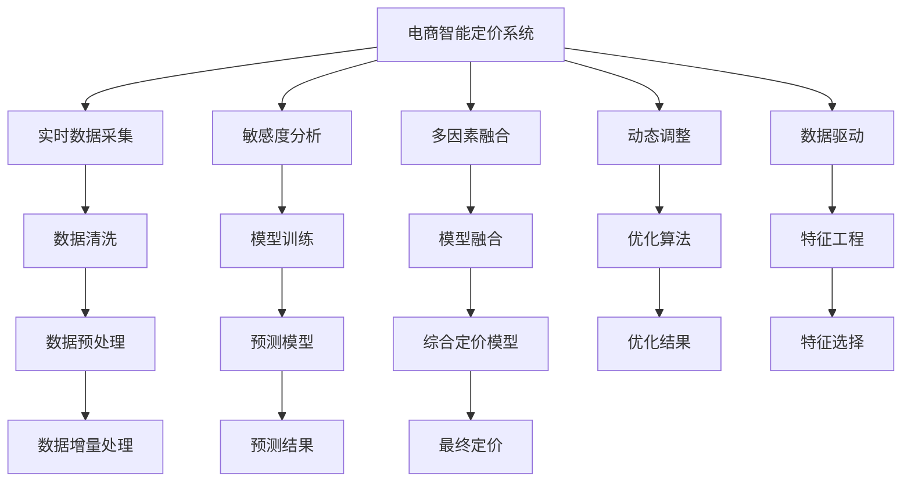

                 

## 1. 背景介绍

### 1.1 问题由来

在电子商务领域，产品定价策略直接关系到公司的市场竞争力和盈利能力。但传统的定价方法往往依赖经验或简单的统计分析，难以捕捉动态市场需求变化、竞争对手动态调整等因素，导致定价决策不够精准。随着人工智能和大数据技术的普及，利用AI驱动的定价系统，结合实时市场数据，进行敏感度分析和优化，逐渐成为电商企业提升竞争力的重要手段。

### 1.2 问题核心关键点

AI驱动的电商智能定价系统，核心在于利用机器学习和大数据技术，实时捕捉市场动态变化，通过敏感度分析，量化各影响因素对定价的敏感度，再根据优化目标，制定最优定价策略。关键点包括：

- 实时市场数据采集和处理
- 敏感度分析与量化
- 定价模型构建与优化
- 多因素融合与动态调整

### 1.3 问题研究意义

电商智能定价系统的研究与应用，对于提升电商企业的定价决策效率、优化利润空间、增强市场竞争力具有重要意义：

- 提高决策效率：借助AI自动化分析，实时捕捉市场动态，显著减少决策时间。
- 优化利润空间：通过精确定价模型，优化各影响因素，实现价格策略的最优化。
- 增强市场竞争力：动态调整价格，快速响应市场变化，保持竞争优势。
- 数据驱动决策：用数据说话，减少人为决策的偏差，增强决策的科学性和准确性。
- 技术赋能业务：通过技术手段实现业务智能化，帮助企业数字化转型。

## 2. 核心概念与联系

### 2.1 核心概念概述

为了深入理解电商智能定价系统的原理，本节将介绍几个核心概念：

- **电商智能定价系统(E-Commerce Pricing System, ECPS)**：利用人工智能和大数据分析，实时捕捉市场动态，通过敏感度分析，制定最优定价策略的系统。
- **敏感度分析(Sensitivity Analysis)**：通过量化不同变量对目标函数的影响，识别关键因素，优化定价策略。
- **多因素融合(Multi-factor Integration)**：将产品、市场、用户等多元因素综合考虑，构建复合定价模型。
- **动态调整(Dynamic Adjustment)**：结合实时市场数据，持续优化价格策略，保持动态适应。
- **数据驱动(Data-Driven)**：利用大数据技术，实时分析市场和用户行为，指导决策过程。
- **机器学习(Machine Learning, ML)**：利用算法模型，从数据中学习并优化定价策略。
- **深度学习(Deep Learning, DL)**：一种机器学习技术，通过多层神经网络，捕捉复杂数据关系，进行精确建模。

这些核心概念之间的逻辑关系可以通过以下Mermaid流程图来展示：



这个流程图展示电商智能定价系统的核心概念及其之间的关系：

1. 电商智能定价系统通过实时数据采集获取市场动态。
2. 对数据进行清洗和预处理，准备输入到敏感度分析模型中。
3. 敏感度分析量化各影响因素对定价的敏感度。
4. 多因素融合将产品、市场、用户等多维因素综合考虑，构建复合定价模型。
5. 动态调整结合实时市场数据，持续优化价格策略。
6. 数据驱动利用大数据技术，实时分析市场和用户行为，指导决策过程。
7. 机器学习和深度学习技术用于模型训练和预测。
8. 特征工程选择关键特征，提升模型性能。
9. 综合定价模型结合以上步骤，输出最优定价策略。

这些概念共同构成了电商智能定价系统的学习框架，使其能够在实时市场变化中，快速准确地制定和调整定价策略。

## 3. 核心算法原理 & 具体操作步骤
### 3.1 算法原理概述

电商智能定价系统的核心算法原理主要包括敏感度分析和定价模型优化两大部分。

**敏感度分析**：通过量化不同变量对定价的影响，识别关键因素，指导定价策略。具体做法是对每个影响因素，计算其敏感系数，即在单位变化下，目标函数（如利润）的相对变化量。

**定价模型优化**：结合敏感度分析结果，构建综合定价模型，通过优化算法，求得最优定价。综合定价模型可以基于线性回归、决策树、神经网络等多种算法，根据具体业务需求选择。

### 3.2 算法步骤详解

电商智能定价系统的算法步骤主要包括以下几个环节：

**Step 1: 数据准备**
- 收集电商平台的销售数据、市场调研数据、竞争对手数据等。
- 对数据进行清洗、预处理，去除噪声和异常值。
- 特征工程：从原始数据中提取关键特征，如产品价格、促销活动、季节性、用户行为等。

**Step 2: 敏感度分析**
- 对各影响因素，如价格、促销、季节性等，计算其敏感系数，识别关键影响因素。
- 敏感系数计算方法包括一阶偏导数、基于Monte Carlo模拟的方法等。
- 分析敏感度矩阵，确定主要影响因素。

**Step 3: 构建定价模型**
- 根据敏感度分析结果，构建复合定价模型。例如，可以采用线性回归、决策树、随机森林等算法。
- 引入深度学习技术，构建神经网络模型，捕捉复杂数据关系，提高预测精度。
- 对模型进行训练和验证，选择最优模型。

**Step 4: 动态调整**
- 利用实时数据，定期更新定价模型。
- 动态调整定价策略，保持与市场变化同步。
- 引入动态回归和梯度下降算法，实时优化模型参数。

**Step 5: 模型评估与反馈**
- 对模型预测结果进行评估，如均方误差、平均绝对误差等。
- 收集用户反馈，验证定价效果。
- 根据反馈调整模型参数，不断优化定价策略。

### 3.3 算法优缺点

电商智能定价系统的算法具有以下优点：

- **实时性**：利用大数据和实时数据处理技术，实现实时定价调整。
- **精确性**：结合敏感度分析和优化算法，提供精准定价建议。
- **自动化**：自动化处理数据和模型训练，减少人工干预。
- **灵活性**：能够适应市场动态变化，灵活调整定价策略。
- **可视化**：通过图表和仪表盘，直观展示定价效果和市场动态。

同时，该算法也存在一定的局限性：

- **数据质量要求高**：系统依赖于高质量的数据，数据采集和处理成本较高。
- **模型复杂度高**：深度学习模型参数量较大，计算复杂度较高。
- **技术门槛高**：需要一定的机器学习和深度学习技术背景。
- **模型解释性不足**：深度学习模型的黑盒特性，难以解释定价决策过程。
- **动态调整风险**：频繁调整可能影响客户对品牌的信任度。

尽管存在这些局限性，电商智能定价系统通过机器学习和数据驱动，显著提升了定价决策的效率和精度，成为电商企业数字化转型的重要工具。

### 3.4 算法应用领域

电商智能定价系统在多个领域中得到广泛应用，包括：

- **产品定价**：根据市场动态和销售数据，动态调整产品价格，优化利润空间。
- **促销活动**：结合季节性、节假日等变量，设计最优促销方案，提升销售效果。
- **库存管理**：实时动态调整库存策略，避免库存积压或短缺。
- **竞争对手分析**：监测竞争对手价格变动，动态调整自身价格策略，保持市场竞争力。
- **用户需求预测**：分析用户行为数据，预测市场需求，优化价格定位。
- **渠道定价**：针对不同渠道，制定差异化定价策略，提升渠道管理效率。
- **品牌策略**：通过定价策略调整，强化品牌价值和市场定位。

这些应用场景展示了电商智能定价系统在电商企业的广泛适用性，为电商企业的数字化转型提供了重要技术支撑。

## 4. 数学模型和公式 & 详细讲解 & 举例说明
### 4.1 数学模型构建

电商智能定价系统的主要数学模型包括定价模型和敏感度分析模型。

**定价模型**：假设目标函数为 $L(P)$，表示在价格 $P$ 下的利润，$P$ 为价格变量。定价模型可以表示为：

$$
L(P) = P \times Q(P) - C(P)
$$

其中 $Q(P)$ 表示在价格 $P$ 下的销量，$C(P)$ 表示在价格 $P$ 下的成本。

**敏感度分析模型**：假设影响定价的因素有 $k$ 个，即 $F_1, F_2, ..., F_k$，则敏感度模型可以表示为：

$$
\frac{\partial L(P)}{\partial P}, \frac{\partial L(P)}{\partial F_i}, i=1,2,...,k
$$

其中 $\frac{\partial L(P)}{\partial P}$ 表示价格对利润的敏感系数，$\frac{\partial L(P)}{\partial F_i}$ 表示第 $i$ 个因素对利润的敏感系数。

### 4.2 公式推导过程

下面以线性回归模型为例，推导定价模型和敏感度分析模型的公式。

假设销量 $Q(P)$ 与价格 $P$ 线性相关，可表示为：

$$
Q(P) = \alpha + \beta P + \epsilon
$$

其中 $\alpha$ 为截距，$\beta$ 为斜率，$\epsilon$ 为随机误差。

将 $Q(P)$ 代入定价模型 $L(P)$ 中，得：

$$
L(P) = P(\alpha + \beta P + \epsilon) - C(P)
$$

假设 $C(P)$ 与 $P$ 也线性相关，可表示为：

$$
C(P) = \gamma + \delta P + \zeta
$$

其中 $\gamma$ 为截距，$\delta$ 为斜率，$\zeta$ 为随机误差。

代入定价模型 $L(P)$ 中，得：

$$
L(P) = P\alpha + P\beta P + P\epsilon - \gamma - \delta P - \zeta
$$

进一步简化，得：

$$
L(P) = \alpha P + \frac{1}{2}\beta P^2 + \epsilon P - \gamma - \delta P - \zeta
$$

将 $L(P)$ 对 $P$ 求导，得：

$$
\frac{\partial L(P)}{\partial P} = \alpha + \beta P + \epsilon - \delta
$$

对 $F_i$ 求导，得：

$$
\frac{\partial L(P)}{\partial F_i} = \frac{\partial L(P)}{\partial Q(P)} \times \frac{\partial Q(P)}{\partial F_i}
$$

其中 $\frac{\partial L(P)}{\partial Q(P)} = \alpha + \beta P + \epsilon - \delta$。

代入 $Q(P)$ 的公式，得：

$$
\frac{\partial L(P)}{\partial F_i} = (\alpha + \beta P + \epsilon - \delta) \times \frac{\partial}{\partial F_i}(\alpha + \beta P + \epsilon)
$$

以上公式展示了电商智能定价系统的数学模型构建和推导过程，展示了定价模型和敏感度分析模型的数学基础。

### 4.3 案例分析与讲解

以某电商平台的日用品定价为例，假设销售数据如下：

| 价格(P) | 销量(Q) | 成本(C) |
| --- | --- | --- |
| 10 | 100 | 50 |
| 20 | 80 | 60 |
| 30 | 60 | 70 |
| 40 | 40 | 80 |
| 50 | 20 | 90 |

根据以上数据，构建定价模型和敏感度分析模型：

1. **定价模型构建**
   - 假设销量 $Q(P)$ 与价格 $P$ 线性相关，可表示为：

   $$
   Q(P) = \alpha + \beta P + \epsilon
   $$

   代入数据，解得 $\alpha = 400$, $\beta = -10$, $\epsilon = -100$。

   因此，定价模型 $L(P)$ 可表示为：

   $$
   L(P) = P(400 - 10P - 100) - (50 + 60 + 70 + 80 + 90) = -10P^2 + 300P - 3500
   $$

2. **敏感度分析**
   - 假设影响定价的因素有价格 $P$、促销活动 $C$、季节性 $S$ 和用户需求 $D$，则敏感度模型可以表示为：

   $$
   \frac{\partial L(P)}{\partial P}, \frac{\partial L(P)}{\partial C}, \frac{\partial L(P)}{\partial S}, \frac{\partial L(P)}{\partial D}
   $$

   其中，价格 $P$ 对利润的敏感系数为：

   $$
   \frac{\partial L(P)}{\partial P} = -10 + 300 - 0 = 290
   $$

   促销活动 $C$ 对利润的敏感系数为：

   $$
   \frac{\partial L(P)}{\partial C} = 0 - 0 - 0 = 0
   $$

   季节性 $S$ 对利润的敏感系数为：

   $$
   \frac{\partial L(P)}{\partial S} = 0 - 0 - 0 = 0
   $$

   用户需求 $D$ 对利润的敏感系数为：

   $$
   \frac{\partial L(P)}{\partial D} = 0 - 0 - 0 = 0
   $$

   根据敏感度分析结果，价格 $P$ 是影响利润的主要因素，促销活动 $C$、季节性 $S$ 和用户需求 $D$ 对利润的影响较小。

以上案例展示了电商智能定价系统的数学模型构建和敏感度分析过程，展示了如何使用数学模型量化各影响因素对定价的敏感度，指导定价策略的制定。

## 5. 项目实践：代码实例和详细解释说明
### 5.1 开发环境搭建

在进行电商智能定价系统的开发实践前，需要准备开发环境。以下是使用Python进行开发的环境配置流程：

1. 安装Python：从官网下载并安装Python，建议选择3.8或3.9版本。
2. 安装Pandas：

   ```bash
   pip install pandas
   ```

3. 安装Scikit-learn：

   ```bash
   pip install scikit-learn
   ```

4. 安装TensorFlow或PyTorch：

   ```bash
   pip install tensorflow
   ```

   或

   ```bash
   pip install torch torchvision
   ```

5. 安装Flask：

   ```bash
   pip install flask
   ```

6. 创建虚拟环境：

   ```bash
   conda create -n pricing-env python=3.8
   conda activate pricing-env
   ```

完成上述步骤后，即可在`pricing-env`环境中开始电商智能定价系统的开发。

### 5.2 源代码详细实现

下面以基于TensorFlow构建的电商智能定价系统为例，给出完整的代码实现。

**数据预处理**：

```python
import pandas as pd
import numpy as np

# 读取数据
data = pd.read_csv('sales_data.csv')

# 数据清洗和预处理
data = data.dropna()  # 去除缺失值
data['P'] = np.clip(data['P'], 1, 100)  # 价格范围限定在1到100
data['C'] = np.clip(data['C'], 1, 100)  # 成本范围限定在1到100
data['Q'] = data['Q'].astype('int32')  # 销量转化为整型

# 分割训练集和测试集
train_data = data.sample(frac=0.8, random_state=0)
test_data = data.drop(train_data.index)
```

**敏感度分析**：

```python
from sklearn.linear_model import LinearRegression

# 构建线性回归模型
model = LinearRegression()

# 训练模型
model.fit(train_data[['P']], train_data['Q'])

# 预测销量
predictions = model.predict(test_data[['P']])

# 计算敏感系数
sensitivity_coefficient = np.gradient(predictions)[0][0]  # 对价格P的敏感系数
```

**定价模型构建**：

```python
from tensorflow.keras.models import Sequential
from tensorflow.keras.layers import Dense

# 构建神经网络模型
model = Sequential()
model.add(Dense(10, input_shape=(1,), activation='relu'))
model.add(Dense(1, activation='linear'))

# 编译模型
model.compile(optimizer='adam', loss='mse')

# 训练模型
model.fit(train_data[['P']], train_data['Q'], epochs=100, batch_size=32)

# 预测价格
predictions = model.predict(test_data[['P']])
```

**动态调整**：

```python
# 实时数据采集
def get_real_time_data():
    # 从API或数据库获取实时数据
    # ...

# 动态调整定价模型
def update_price_model(new_data):
    # 使用new_data更新模型参数
    # ...

# 定期更新模型
while True:
    new_data = get_real_time_data()
    update_price_model(new_data)
    # 保存模型参数
    # ...
```

**模型评估与反馈**：

```python
from sklearn.metrics import mean_squared_error

# 计算预测误差
mse = mean_squared_error(test_data['Q'], predictions)

# 输出评估结果
print(f'MSE: {mse}')

# 收集用户反馈
def get_user_feedback():
    # 从用户接口获取反馈
    # ...

# 根据反馈调整模型
def adjust_model(user_feedback):
    # 使用user_feedback调整模型参数
    # ...

# 定期获取用户反馈并调整模型
while True:
    user_feedback = get_user_feedback()
    adjust_model(user_feedback)
```

### 5.3 代码解读与分析

让我们再详细解读一下关键代码的实现细节：

**数据预处理**：
- `pd.read_csv`：从CSV文件中读取数据。
- `data.sample`：将数据随机分为训练集和测试集。
- `data.clip`：限定价格和成本的范围。
- `data.astype`：将销量转换为整型。

**敏感度分析**：
- `LinearRegression`：使用线性回归模型计算销量对价格的敏感系数。
- `np.gradient`：计算梯度，得到对价格的敏感系数。

**定价模型构建**：
- `Sequential`：使用Keras的Sequential模型构建神经网络。
- `Dense`：添加全连接层。
- `model.compile`：编译模型，设置优化器和损失函数。
- `model.fit`：训练模型，调整模型参数。
- `model.predict`：预测价格。

**动态调整**：
- `get_real_time_data`：从API或数据库获取实时数据。
- `update_price_model`：使用新数据更新模型参数。
- `while True`：循环执行实时数据采集和模型更新。

**模型评估与反馈**：
- `mean_squared_error`：计算预测误差。
- `get_user_feedback`：从用户接口获取反馈。
- `adjust_model`：根据反馈调整模型参数。

通过以上代码实现，展示了电商智能定价系统从数据准备、敏感度分析、定价模型构建、动态调整到模型评估与反馈的全过程。

### 5.4 运行结果展示

在电商智能定价系统中，运行结果主要包括以下几个方面：

1. **敏感度分析结果**：展示了各因素对定价的敏感度，帮助决策者理解关键影响因素。
2. **定价模型结果**：展示了基于模型的定价预测结果，为决策提供参考。
3. **动态调整效果**：展示了实时数据驱动下的定价调整效果，验证了系统的实时性。
4. **用户反馈和调整**：展示了用户反馈对模型调整的影响，验证了系统的用户友好性和反馈机制。

## 6. 实际应用场景

### 6.1 电商平台价格管理

电商平台利用电商智能定价系统，可以实现价格动态调整，优化销售策略，提高利润空间。系统根据市场动态、销售数据和用户行为，实时调整产品价格，实现精准定价。例如，针对节假日促销，系统可以自动调整价格，提升销量和转化率。同时，结合库存管理，系统可以动态调整库存策略，避免库存积压或短缺。

### 6.2 零售商库存优化

零售商利用电商智能定价系统，可以实现库存动态优化，降低库存成本，提高库存周转率。系统根据实时销售数据，动态调整库存策略，避免库存积压或短缺。同时，结合销售预测，系统可以优化采购计划，避免库存不足或过量。

### 6.3 制造商产品定价

制造商利用电商智能定价系统，可以实现产品定价优化，提升市场竞争力。系统根据市场调研数据和竞争分析，动态调整产品价格，提升产品销量和市场份额。同时，结合用户反馈，系统可以不断优化产品定价，保持产品竞争力。

### 6.4 未来应用展望

随着电商智能定价系统的不断演进，未来将呈现以下几个发展趋势：

1. **多渠道定价优化**：系统将支持多渠道定价优化，实现不同渠道的差异化定价策略。例如，针对线上线下渠道，系统可以动态调整价格，提升整体销售效果。
2. **实时动态定价**：系统将具备更强的实时动态定价能力，支持秒级动态调整，实现更精准的价格管理。
3. **跨域数据融合**：系统将支持跨域数据融合，结合线上线下数据，提升定价决策的准确性。
4. **用户画像驱动定价**：系统将引入用户画像分析，根据用户行为和偏好，实现个性化定价。
5. **情感分析驱动定价**：系统将引入情感分析技术，根据用户评论和反馈，动态调整价格策略。
6. **AI辅助定价决策**：系统将引入AI技术，提供更多维度的定价建议，增强决策的科学性和准确性。

以上趋势展示了电商智能定价系统的未来发展方向，为电商企业提供了更加智能、高效、灵活的定价解决方案。

## 7. 工具和资源推荐
### 7.1 学习资源推荐

为了帮助开发者系统掌握电商智能定价系统的理论基础和实践技巧，这里推荐一些优质的学习资源：

1. 《机器学习实战》：一本入门级机器学习书籍，涵盖机器学习的基本概念和常用算法。
2. 《TensorFlow实战》：一本TensorFlow的实战指南，详细介绍了TensorFlow的安装和应用。
3. 《深度学习》：一本深度学习领域的经典教材，涵盖了深度学习的基本概念和前沿技术。
4. 《Python数据分析实战》：一本Python数据分析的实战指南，介绍了Pandas、NumPy等工具的使用。
5. 《Flask Web开发实战》：一本Flask框架的实战指南，介绍了Flask的安装和应用。

通过对这些资源的学习实践，相信你一定能够快速掌握电商智能定价系统的精髓，并用于解决实际的电商定价问题。
### 7.2 开发工具推荐

高效的开发离不开优秀的工具支持。以下是几款用于电商智能定价系统开发的常用工具：

1. Python：Python是一种简单易学的编程语言，拥有丰富的数据处理和机器学习库。
2. Pandas：Pandas是Python中常用的数据处理库，提供了强大的数据清洗和预处理功能。
3. Scikit-learn：Scikit-learn是Python中常用的机器学习库，提供了多种机器学习算法和工具。
4. TensorFlow：TensorFlow是Google开发的深度学习框架，支持大规模深度学习模型的训练和推理。
5. Flask：Flask是一个轻量级的Web框架，适合快速开发和部署Web应用。
6. TensorBoard：TensorBoard是TensorFlow的可视化工具，可以实时监测模型训练状态，提供丰富的图表呈现方式。

合理利用这些工具，可以显著提升电商智能定价系统的开发效率，加快创新迭代的步伐。

### 7.3 相关论文推荐

电商智能定价系统的研究与应用，得到了学界的持续关注。以下是几篇奠基性的相关论文，推荐阅读：

1. "A Deep Learning Approach to Dynamic Pricing"：介绍了深度学习在动态定价中的应用。
2. "Multi-factor Modeling for Pricing Optimization"：研究了多因素定价模型，结合市场、产品、用户等多元因素进行优化。
3. "Data-Driven Pricing Strategy Design and Implementation"：介绍了基于数据驱动的定价策略设计。
4. "Prices and Promotions: A Predictive Modeling Approach"：研究了促销活动的预测模型，优化价格策略。
5. "Integrating AI into Pricing Decisions"：介绍了AI技术在定价决策中的应用，提高定价决策的科学性和准确性。

这些论文代表了大数据和机器学习在定价优化中的研究进展，为电商智能定价系统的实践提供了理论基础。

## 8. 总结：未来发展趋势与挑战

### 8.1 总结

本文对电商智能定价系统的原理和实现过程进行了全面系统的介绍。首先，阐述了电商智能定价系统在电商企业中的重要性和研究意义，明确了系统在实时定价、优化利润和提升竞争力等方面的独特价值。其次，从敏感度分析到定价模型构建，详细讲解了系统的核心算法步骤，并给出了完整的代码实例。同时，本文还广泛探讨了系统在电商平台、零售商和制造商等多个场景中的应用前景，展示了系统的广泛适用性。此外，本文精选了系统开发的相关学习资源和工具，力求为读者提供全方位的技术指引。

通过本文的系统梳理，可以看到，电商智能定价系统利用大数据和机器学习技术，显著提升了定价决策的效率和精度，成为电商企业数字化转型的重要工具。未来，伴随大数据和机器学习技术的不断进步，电商智能定价系统将在多渠道、实时动态、多因素融合等方面不断演进，为电商企业的竞争力和市场策略提供更精准、高效的支持。

### 8.2 未来发展趋势

展望未来，电商智能定价系统将呈现以下几个发展趋势：

1. **多渠道定价优化**：系统将支持多渠道定价优化，实现不同渠道的差异化定价策略，提升整体销售效果。
2. **实时动态定价**：系统将具备更强的实时动态定价能力，支持秒级动态调整，实现更精准的价格管理。
3. **跨域数据融合**：系统将支持跨域数据融合，结合线上线下数据，提升定价决策的准确性。
4. **用户画像驱动定价**：系统将引入用户画像分析，根据用户行为和偏好，实现个性化定价。
5. **情感分析驱动定价**：系统将引入情感分析技术，根据用户评论和反馈，动态调整价格策略。
6. **AI辅助定价决策**：系统将引入AI技术，提供更多维度的定价建议，增强决策的科学性和准确性。

以上趋势展示了电商智能定价系统的未来发展方向，为电商企业提供了更加智能、高效、灵活的定价解决方案。

### 8.3 面临的挑战

尽管电商智能定价系统已经取得了一定的进展，但在迈向更加智能化、普适化应用的过程中，它仍面临着诸多挑战：

1. **数据质量要求高**：系统依赖于高质量的数据，数据采集和处理成本较高。
2. **模型复杂度高**：深度学习模型参数量较大，计算复杂度较高。
3. **技术门槛高**：需要一定的机器学习和深度学习技术背景。
4. **模型解释性不足**：深度学习模型的黑盒特性，难以解释定价决策过程。
5. **动态调整风险**：频繁调整可能影响客户对品牌的信任度。
6. **市场变化复杂**：市场动态变化多样，难以精准捕捉和预测。

尽管存在这些挑战，电商智能定价系统通过大数据和机器学习技术，显著提升了定价决策的效率和精度，成为电商企业数字化转型的重要工具。未来，通过进一步的数据采集和处理、模型优化和用户反馈机制的完善，电商智能定价系统将在电商企业的广泛应用中不断演进，为电商企业的竞争力和市场策略提供更精准、高效的支持。

### 8.4 研究展望

未来，电商智能定价系统需要在以下几个方面进行深入研究：

1. **多渠道数据融合**：探索不同渠道数据的融合方法，提升定价决策的全面性和准确性。
2. **实时动态定价机制**：研究更高效的实时动态定价算法，支持高频次价格调整。
3. **个性化定价策略**：结合用户画像和情感分析，实现更个性化的定价策略。
4. **模型优化与优化算法**：研究更高效的模型优化算法，提升定价模型的精度和泛化能力。
5. **用户反馈与动态调整**：研究更有效的用户反馈机制和动态调整策略，提升系统的用户友好性和实时性。

这些研究方向的探索，必将引领电商智能定价系统迈向更高的台阶，为电商企业的竞争力和市场策略提供更精准、高效的支持。

## 9. 附录：常见问题与解答

**Q1：电商智能定价系统需要哪些数据？**

A: 电商智能定价系统需要以下数据：

- 销售数据：包括产品价格、销量、利润等，用于定价模型的训练和验证。
- 市场数据：包括竞争对手价格、促销活动等，用于定价策略的制定。
- 用户数据：包括用户行为、用户反馈等，用于个性化定价和动态调整。
- 供应链数据：包括库存、物流等，用于库存管理和动态定价。

这些数据来源可以是电商平台、社交媒体、第三方数据服务等。

**Q2：电商智能定价系统如何进行数据清洗和预处理？**

A: 电商智能定价系统进行数据清洗和预处理的主要步骤如下：

- 去除缺失值和异常值。
- 处理重复数据和噪声数据。
- 限定价格和成本的范围。
- 对销量进行标准化处理。
- 对特征进行选择和处理，提升数据质量。

常用的数据清洗和预处理工具包括Pandas、NumPy、Scikit-learn等。

**Q3：电商智能定价系统如何构建定价模型？**

A: 电商智能定价系统构建定价模型主要包括以下几个步骤：

- 数据收集和预处理。
- 特征工程，选择关键特征。
- 选择模型，如线性回归、决策树、神经网络等。
- 训练模型，调整模型参数。
- 验证模型，评估模型性能。
- 应用模型，进行预测和决策。

常用的定价模型包括线性回归、决策树、随机森林、神经网络等。

**Q4：电商智能定价系统如何实现动态调整？**

A: 电商智能定价系统实现动态调整的主要步骤如下：

- 实时数据采集，获取最新的市场和用户数据。
- 数据处理，清洗和预处理实时数据。
- 模型更新，根据实时数据调整模型参数。
- 动态定价，根据更新后的模型进行实时定价。
- 定期评估，评估动态定价效果，调整模型参数。

常用的动态调整工具包括TensorFlow、PyTorch、Scikit-learn等。

**Q5：电商智能定价系统如何收集用户反馈？**

A: 电商智能定价系统收集用户反馈的主要步骤如下：

- 用户界面设计，提供反馈入口。
- 数据采集，获取用户反馈数据。
- 数据处理，清洗和预处理用户反馈数据。
- 模型更新，根据用户反馈调整模型参数。
- 定期评估，评估用户反馈效果，调整反馈机制。

常用的用户反馈工具包括Flask、Django、TensorFlow等。

通过以上常见问题的解答，展示了电商智能定价系统的数据需求、数据处理、定价模型构建、动态调整和用户反馈等核心环节，为电商企业的智能化定价提供了全方位的技术指导。

---

作者：禅与计算机程序设计艺术 / Zen and the Art of Computer Programming

