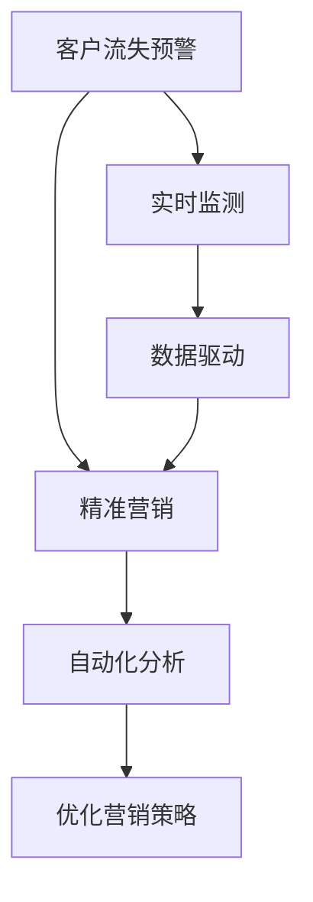

                 

# AI驱动的电商智能客户流失预警与精准营销系统

> 关键词：客户流失预警,精准营销,人工智能,电商,机器学习,决策系统,数据驱动

## 1. 背景介绍

### 1.1 问题由来
在现代电商行业中，客户留存率与客户终身价值是企业成功的关键因素之一。然而，随着市场的竞争日益激烈，客户流失问题越来越突出。企业需要能够及时、准确地预测哪些客户可能流失，并采取有针对性的措施，才能在激烈的市场竞争中赢得先机。

面对客户流失这一难题，传统的CRM系统往往依赖人工分析，存在成本高、效率低、效果差的问题。而人工智能技术的兴起，为电商企业提供了一种高效、智能的客户流失预警和精准营销解决方案。

### 1.2 问题核心关键点
AI驱动的电商智能客户流失预警与精准营销系统，其核心关键点如下：

- **数据驱动**：利用大量电商交易和用户行为数据，挖掘客户流失的根本原因，实现精准预测。
- **实时预警**：通过实时监测客户行为变化，快速响应流失预警信号，及时采取措施。
- **个性化营销**：根据客户特征和历史行为数据，设计个性化的营销策略，提升客户转化率。
- **系统自动化**：自动化分析、预警和营销过程，减少人工干预，提高效率。
- **效果评估**：实时跟踪营销效果，不断优化模型和策略，提升预警与营销的准确性和有效性。

### 1.3 问题研究意义
AI驱动的客户流失预警与精准营销系统，对电商企业有以下几方面的研究意义：

1. **提高客户留存率**：及时发现流失风险，采取有效措施，减少客户流失。
2. **提升客户终身价值**：通过精准营销，提升客户满意度和忠诚度，增加消费频次和消费金额。
3. **优化营销策略**：利用AI技术，不断优化营销方案，提高资源利用效率，降低营销成本。
4. **促进数据驱动决策**：将数据驱动的AI技术引入决策过程，提升企业决策的科学性和准确性。
5. **增强竞争优势**：在激烈的市场竞争中，通过智能化、自动化的客户管理，形成差异化的竞争优势。

## 2. 核心概念与联系

### 2.1 核心概念概述

为更好地理解AI驱动的电商智能客户流失预警与精准营销系统，本节将介绍几个密切相关的核心概念：

- **客户流失预警**：通过分析客户行为数据，预测客户流失的可能性，及时发出预警信号。
- **精准营销**：根据客户特征和行为数据，设计个性化的营销策略，提升营销效果。
- **人工智能**：利用机器学习、深度学习等AI技术，自动化、智能化地处理和分析数据。
- **电商系统**：涵盖订单处理、库存管理、客户服务等多个环节的电商业务系统。
- **数据驱动**：以数据为依据，通过统计分析和模型训练，指导业务决策。
- **实时监测**：对客户行为数据进行实时采集和处理，快速响应预警信号。

这些核心概念之间的逻辑关系可以通过以下Mermaid流程图来展示：



这个流程图展示了一个完整的客户流失预警和精准营销流程：

1. 通过实时监测系统收集客户行为数据。
2. 利用数据驱动的AI技术进行分析，预测客户流失风险。
3. 根据预警信号，自动化分析客户特征和行为，设计个性化的营销策略。
4. 不断优化营销策略，提升客户转化率。

## 3. 核心算法原理 & 具体操作步骤
### 3.1 算法原理概述

AI驱动的电商智能客户流失预警与精准营销系统，基于机器学习和大数据技术，实现对客户流失的实时预警和精准营销。其核心算法包括客户流失预测和个性化营销两个部分：

1. **客户流失预测**：通过分析客户历史行为数据，建立预测模型，实时预警客户流失风险。
2. **个性化营销**：利用客户特征和历史行为数据，设计个性化的营销策略，提升客户转化率。

### 3.2 算法步骤详解

#### 3.2.1 客户流失预测

**Step 1: 数据准备**
- 收集电商交易数据、用户行为数据、客户服务数据等。
- 清洗和处理数据，去除噪音和异常值，保证数据质量。

**Step 2: 特征工程**
- 提取与客户流失相关的特征，如订单数量、购买频率、客户投诉次数等。
- 对特征进行编码和归一化处理，保证模型输入的一致性。

**Step 3: 模型选择与训练**
- 选择适合电商场景的机器学习模型，如逻辑回归、随机森林、神经网络等。
- 利用历史数据训练模型，进行交叉验证，评估模型性能。

**Step 4: 实时预警**
- 实时采集客户行为数据，进行特征提取和输入处理。
- 将实时数据输入训练好的模型，预测客户流失概率。
- 根据预测结果，发出流失预警信号。

**Step 5: 预警信号处理**
- 对于高流失风险的客户，进行进一步的分析和干预。
- 根据客户特征和行为，设计个性化的干预措施，如短信提醒、优惠券、客户关怀等。

#### 3.2.2 个性化营销

**Step 1: 客户特征提取**
- 利用聚类、降维等技术，提取客户的核心特征，如消费水平、购买偏好、活跃度等。
- 对客户特征进行编码和归一化处理，便于模型输入。

**Step 2: 个性化策略设计**
- 根据客户特征，设计个性化的营销策略，如针对高消费客户推荐高端产品，针对低活跃客户推送优惠券等。
- 利用A/B测试等方法，评估营销策略的效果。

**Step 3: 策略执行与效果评估**
- 将个性化营销策略应用到实际营销活动中，记录营销效果。
- 定期跟踪营销效果，进行效果评估，不断优化策略。

### 3.3 算法优缺点

AI驱动的电商智能客户流失预警与精准营销系统，具有以下优点：

1. **高效精准**：利用机器学习和大数据技术，实现实时预警和精准营销，显著提高客户留存率和转化率。
2. **实时响应**：通过实时监测和分析，快速响应客户行为变化，及时采取干预措施，提高响应速度。
3. **个性化策略**：利用客户特征和行为数据，设计个性化的营销策略，提升营销效果。
4. **自动化流程**：自动化分析、预警和营销过程，减少人工干预，提高效率。
5. **效果评估**：实时跟踪营销效果，不断优化模型和策略，提升预警与营销的准确性和有效性。

同时，该系统也存在以下缺点：

1. **数据依赖**：系统依赖于电商平台的数据质量，数据缺失或噪声可能影响预测和营销效果。
2. **模型复杂**：建立和维护复杂的预测模型，需要较高的时间和人力成本。
3. **隐私问题**：需要处理大量客户数据，涉及隐私保护和数据安全问题。
4. **算法局限**：目前模型主要以历史数据为基础，对于新客户的预测和营销可能存在一定局限性。
5. **成本高**：系统开发和维护成本较高，中小型企业难以承担。

尽管存在这些缺点，AI驱动的电商智能客户流失预警与精准营销系统在实际应用中已经取得了显著效果，成为电商企业客户管理的重要工具。

### 3.4 算法应用领域

AI驱动的电商智能客户流失预警与精准营销系统，主要应用于以下几个领域：

1. **电商客户流失预警**：实时监测客户行为，预测客户流失风险，及时发出预警信号。
2. **精准个性化营销**：根据客户特征和行为数据，设计个性化的营销策略，提升客户转化率。
3. **智能客户服务**：利用AI技术，自动分析和响应客户咨询，提升客户满意度。
4. **智能库存管理**：通过客户流失预警和精准营销，优化库存结构，减少库存积压。
5. **电商风险控制**：利用客户流失预警，识别潜在欺诈行为，防范风险。

## 4. 数学模型和公式 & 详细讲解 & 举例说明
### 4.1 数学模型构建

本节将使用数学语言对AI驱动的电商智能客户流失预警与精准营销系统进行更加严格的刻画。

假设电商交易数据为 $\{(x_i, y_i)\}_{i=1}^N$，其中 $x_i$ 表示客户行为特征向量，$y_i \in \{0,1\}$ 表示客户是否流失。利用逻辑回归模型 $M(x) = \sigma(\beta_0 + \beta_1 x_1 + \cdots + \beta_p x_p)$ 进行客户流失预测，其中 $\sigma$ 为sigmoid函数，$\beta_j$ 为特征权重。

客户流失预测的目标是最小化损失函数：

$$
\mathcal{L}(\beta) = -\frac{1}{N} \sum_{i=1}^N [y_i \log M(x_i) + (1-y_i) \log (1-M(x_i))]
$$

### 4.2 公式推导过程

**Step 1: 定义损失函数**

定义客户流失预测模型的损失函数为交叉熵损失函数：

$$
\mathcal{L}(\beta) = -\frac{1}{N} \sum_{i=1}^N [y_i \log M(x_i) + (1-y_i) \log (1-M(x_i))]
$$

**Step 2: 求解最优参数**

利用梯度下降算法求解损失函数最小值，得到最优参数 $\beta^*$：

$$
\beta^* = \mathop{\arg\min}_{\beta} \mathcal{L}(\beta)
$$

其中，梯度下降算法的更新公式为：

$$
\beta_j \leftarrow \beta_j - \eta \frac{\partial \mathcal{L}(\beta)}{\partial \beta_j}
$$

**Step 3: 实时预警**

实时采集客户行为数据 $x_t$，代入模型得到预测概率 $M(x_t)$。根据预测结果，发出流失预警信号：

$$
\text{预警信号} = \begin{cases}
\text{高风险}, & \text{if } M(x_t) > \text{阈值} \\
\text{低风险}, & \text{if } M(x_t) \leq \text{阈值}
\end{cases}
$$

其中阈值需根据实际情况确定。

### 4.3 案例分析与讲解

假设某电商平台的客户流失预警系统，利用历史数据训练了一个逻辑回归模型。在实际应用中，该系统实时采集到一位客户的购买行为数据 $x_t = [10, 5, 2, 1]$，代入模型得到预测概率 $M(x_t) = 0.7$。系统判断该客户有较高的流失风险，发出预警信号。

## 5. 项目实践：代码实例和详细解释说明
### 5.1 开发环境搭建

在进行项目实践前，我们需要准备好开发环境。以下是使用Python进行TensorFlow开发的环境配置流程：

1. 安装Anaconda：从官网下载并安装Anaconda，用于创建独立的Python环境。

2. 创建并激活虚拟环境：
```bash
conda create -n tf-env python=3.8 
conda activate tf-env
```

3. 安装TensorFlow：根据CUDA版本，从官网获取对应的安装命令。例如：
```bash
conda install tensorflow -c pytorch -c conda-forge
```

4. 安装Pandas、Numpy等工具包：
```bash
pip install pandas numpy scikit-learn matplotlib tensorflow-gpu tqdm jupyter notebook ipython
```

完成上述步骤后，即可在`tf-env`环境中开始项目实践。

### 5.2 源代码详细实现

下面我们以电商客户流失预警系统为例，给出使用TensorFlow对模型进行开发的PyTorch代码实现。

首先，定义客户流失预测的模型：

```python
import tensorflow as tf

class CustomerChurnModel(tf.keras.Model):
    def __init__(self, input_dim, output_dim):
        super(CustomerChurnModel, self).__init__()
        self.layers = tf.keras.Sequential([
            tf.keras.layers.Dense(64, activation='relu', input_dim=input_dim),
            tf.keras.layers.Dense(64, activation='relu'),
            tf.keras.layers.Dense(output_dim, activation='sigmoid')
        ])
        
    def call(self, inputs):
        return self.layers(inputs)
```

然后，定义训练和评估函数：

```python
def train_model(model, train_data, train_labels, epochs, batch_size, learning_rate):
    model.compile(loss='binary_crossentropy', optimizer=tf.keras.optimizers.Adam(learning_rate), metrics=['accuracy'])
    model.fit(train_data, train_labels, epochs=epochs, batch_size=batch_size, validation_split=0.2)
    return model

def evaluate_model(model, test_data, test_labels):
    test_loss, test_acc = model.evaluate(test_data, test_labels)
    print('Test loss:', test_loss)
    print('Test accuracy:', test_acc)
```

最后，启动训练流程并在测试集上评估：

```python
input_dim = 4  # 客户行为特征维度
output_dim = 1  # 流失概率二分类

model = CustomerChurnModel(input_dim, output_dim)
model = train_model(model, train_data, train_labels, epochs=10, batch_size=32, learning_rate=0.001)

test_data, test_labels = load_test_data()
evaluate_model(model, test_data, test_labels)
```

以上就是使用TensorFlow对电商客户流失预警模型进行训练和评估的完整代码实现。可以看到，得益于TensorFlow的强大封装，我们可以用相对简洁的代码完成模型的训练和评估。

### 5.3 代码解读与分析

让我们再详细解读一下关键代码的实现细节：

**CustomerChurnModel类**：
- `__init__`方法：初始化模型结构，包括三个全连接层。
- `call`方法：前向传播过程，将输入数据通过网络层进行计算，输出预测结果。

**train_model函数**：
- `compile`方法：配置模型训练参数，包括损失函数、优化器等。
- `fit`方法：启动训练过程，对模型进行优化和验证。
- `validation_split`参数：指定验证集的比例。

**evaluate_model函数**：
- `evaluate`方法：评估模型在测试集上的性能，输出损失和准确率。

**训练流程**：
- `epochs`：训练轮数。
- `batch_size`：每个批次的大小。
- `learning_rate`：学习率。

可以看到，TensorFlow提供了便捷高效的模型训练和评估工具，极大地简化了代码实现。开发者可以将更多精力放在模型设计和业务逻辑上，而不必过多关注底层的实现细节。

当然，工业级的系统实现还需考虑更多因素，如模型的保存和部署、超参数的自动搜索、更灵活的任务适配层等。但核心的微调范式基本与此类似。

## 6. 实际应用场景

### 6.1 智能客户流失预警

智能客户流失预警系统可以广泛应用于电商平台的客户管理。在实际应用中，系统通过实时监测客户行为数据，预测客户流失风险，及时发出预警信号。

**具体实现**：
- 实时采集客户行为数据，如浏览记录、购买记录、退换货记录等。
- 利用训练好的客户流失预测模型，计算每个客户的流失概率。
- 根据预测结果，对高流失风险的客户发出预警信号。

**效果评估**：
- 定期统计预警信号的准确率、召回率和F1分数。
- 跟踪流失预警后客户的实际流失情况，评估预警模型的效果。

### 6.2 精准个性化营销

精准个性化营销系统可以根据客户特征和行为数据，设计个性化的营销策略，提升客户转化率。

**具体实现**：
- 利用聚类、降维等技术，提取客户的核心特征，如消费水平、购买偏好、活跃度等。
- 根据客户特征，设计个性化的营销策略，如针对高消费客户推荐高端产品，针对低活跃客户推送优惠券等。
- 利用A/B测试等方法，评估营销策略的效果，不断优化策略。

**效果评估**：
- 定期统计个性化营销活动的转化率和ROI。
- 跟踪不同策略下的客户行为变化，评估策略的效果。

### 6.3 智能客户服务

智能客户服务系统可以利用AI技术，自动分析和响应客户咨询，提升客户满意度。

**具体实现**：
- 实时采集客户咨询数据，利用NLP技术进行文本分析和意图识别。
- 根据客户咨询内容，设计自动回复策略，生成自然流畅的回复。
- 不断优化回复策略，提高客户满意度。

**效果评估**：
- 统计自动回复的准确率和用户满意度。
- 跟踪客户咨询的响应时间和客户满意度，评估系统效果。

### 6.4 未来应用展望

随着AI驱动的客户流失预警与精准营销系统的发展，未来将有更多应用场景得到拓展：

1. **跨平台客户管理**：将不同平台（如电商平台、社交平台、邮件平台）的客户数据进行整合，实现统一的客户管理。
2. **多渠道营销**：结合不同渠道（如短信、邮件、APP推送）的客户数据，设计综合性的营销策略。
3. **客户细分**：利用聚类、分群等技术，对客户进行细分，制定针对性更强的营销策略。
4. **智能推荐系统**：结合客户流失预警和精准营销，优化推荐系统，提升推荐效果。
5. **预测市场趋势**：利用客户流失预警和精准营销的数据，预测市场趋势和用户需求，指导企业决策。

这些应用场景的拓展，将进一步提升AI驱动的客户流失预警与精准营销系统的价值，助力企业客户管理的智能化和高效化。

## 7. 工具和资源推荐
### 7.1 学习资源推荐

为了帮助开发者系统掌握AI驱动的客户流失预警与精准营销技术，这里推荐一些优质的学习资源：

1. **TensorFlow官方文档**：TensorFlow的官方文档，提供了丰富的教程和样例代码，是入门TensorFlow的必备资源。

2. **PyTorch官方文档**：PyTorch的官方文档，提供了详细的API和示例代码，方便快速上手。

3. **《深度学习》书籍**：Ian Goodfellow、Yoshua Bengio、Aaron Courville合著的深度学习经典教材，系统介绍了机器学习和深度学习的基础理论。

4. **《Python机器学习》书籍**：Sebastian Raschka和Vahid Mirjalili合著的入门级书籍，介绍了机器学习算法和Python实现。

5. **Kaggle竞赛平台**：Kaggle是一个数据科学竞赛平台，提供丰富的数据集和算法竞赛，是锻炼和提升算法能力的绝佳场所。

通过对这些资源的学习实践，相信你一定能够快速掌握AI驱动的客户流失预警与精准营销技术的精髓，并用于解决实际的电商客户流失问题。

### 7.2 开发工具推荐

高效的开发离不开优秀的工具支持。以下是几款用于AI驱动的客户流失预警与精准营销系统开发的常用工具：

1. **TensorFlow**：由Google主导开发的开源深度学习框架，生产部署方便，适合大规模工程应用。

2. **PyTorch**：由Facebook主导开发的深度学习框架，灵活性高，易于迭代和调试。

3. **TensorBoard**：TensorFlow配套的可视化工具，可实时监测模型训练状态，提供丰富的图表呈现方式。

4. **Jupyter Notebook**：一个交互式的数据分析和代码执行环境，支持Python、R等语言，方便快速迭代。

5. **Git**：版本控制系统，用于代码管理和协作开发，提升开发效率和团队协作能力。

6. **Docker**：容器化技术，用于打包和部署应用程序，方便跨平台部署和扩展。

合理利用这些工具，可以显著提升AI驱动的客户流失预警与精准营销系统的开发效率，加快创新迭代的步伐。

### 7.3 相关论文推荐

AI驱动的客户流失预警与精准营销技术的发展源于学界的持续研究。以下是几篇奠基性的相关论文，推荐阅读：

1. **Customer Churn Prediction in Retail with Synthetic Surveys**：提出基于合成问卷的客户流失预测方法，利用问卷数据预测客户流失风险。

2. **A Comparative Study of Machine Learning Techniques for Customer Churn Prediction**：比较了多种机器学习算法在客户流失预测中的表现，包括逻辑回归、决策树、随机森林等。

3. **Customer Churn Prediction: A Survey**：综述了客户流失预测的研究进展，包括模型选择、特征工程、数据采集等。

4. **Deep Learning Techniques for Customer Churn Prediction**：探讨了深度学习在客户流失预测中的应用，包括卷积神经网络、循环神经网络等。

5. **Machine Learning for Customer Churn Prediction**：介绍了机器学习在客户流失预测中的应用，包括模型训练、评估和部署。

这些论文代表了大数据和AI技术在客户流失预警和精准营销领域的研究进展，提供了丰富的理论和方法。

## 8. 总结：未来发展趋势与挑战

### 8.1 总结

本文对AI驱动的电商智能客户流失预警与精准营销系统进行了全面系统的介绍。首先阐述了客户流失预警与精准营销的研究背景和意义，明确了系统在电商企业客户管理中的独特价值。其次，从原理到实践，详细讲解了系统的主要算法和操作步骤，给出了系统开发的完整代码实例。同时，本文还广泛探讨了系统在智能客户服务、智能推荐、市场预测等多个领域的应用前景，展示了系统的高效性和普适性。此外，本文精选了系统开发所需的学习资源、开发工具和相关论文，力求为读者提供全方位的技术指引。

通过本文的系统梳理，可以看到，AI驱动的电商智能客户流失预警与精准营销系统已经初步构建起一个较为完整的客户管理解决方案，能够显著提升电商企业的客户留存率和转化率，推动企业数字化转型升级。未来，随着大数据和AI技术的不断发展，该系统有望在更多领域得到应用，成为推动产业智能化发展的强大驱动力。

### 8.2 未来发展趋势

展望未来，AI驱动的客户流失预警与精准营销系统将呈现以下几个发展趋势：

1. **模型复杂度提升**：随着深度学习和大数据技术的发展，预测模型的复杂度将不断提高，模型效果也将更加精准。
2. **多模态融合**：结合客户行为数据、社交网络数据、位置数据等多模态信息，提升预测的全面性和准确性。
3. **实时性增强**：利用流式计算和实时数据处理技术，实现预测结果的实时更新和实时预警。
4. **个性化策略优化**：结合客户行为数据和偏好，设计更加个性化和动态化的营销策略。
5. **多平台集成**：将不同平台（如电商平台、社交平台、邮件平台）的客户数据进行整合，实现统一的客户管理。
6. **隐私保护增强**：加强数据隐私保护和合规性管理，确保客户数据的安全和合规使用。

这些趋势凸显了AI驱动的客户流失预警与精准营销系统的高效性和智能化水平，为电商企业提供了更加全面、精准的客户管理方案。

### 8.3 面临的挑战

尽管AI驱动的客户流失预警与精准营销系统已经取得了显著效果，但在迈向更加智能化、普适化应用的过程中，它仍面临着诸多挑战：

1. **数据质量问题**：客户数据质量不佳，存在缺失、噪声等问题，可能影响预测和营销效果。
2. **模型泛化能力不足**：模型在新客户或小样本数据上的预测效果可能较差。
3. **隐私保护问题**：客户数据的隐私保护和合规性管理，需不断加强。
4. **技术成本高昂**：系统开发和维护成本较高，需考虑中小企业的实际需求。
5. **算法复杂度高**：模型构建和优化过程复杂，需深入研究和不断迭代。

这些挑战需要企业、学界和工程师共同努力，持续优化模型、数据和算法，确保系统的稳定性和有效性。

### 8.4 研究展望

面对AI驱动的客户流失预警与精准营销系统所面临的挑战，未来的研究需要在以下几个方面寻求新的突破：

1. **多模态数据融合**：结合不同类型的数据，提升预测的全面性和准确性。
2. **小样本学习**：利用少样本学习技术，提升模型在新客户或小样本数据上的泛化能力。
3. **隐私保护技术**：加强数据隐私保护和合规性管理，确保客户数据的安全和合规使用。
4. **模型优化**：探索高效的模型构建和优化方法，降低开发和维护成本。
5. **实时处理能力**：利用流式计算和实时数据处理技术，实现预测结果的实时更新和实时预警。
6. **自动化和智能化**：利用自动化和智能化技术，提升系统的人机交互体验和操作便利性。

这些研究方向的研究突破，将推动AI驱动的客户流失预警与精准营销系统迈向更高的台阶，为电商企业客户管理的智能化和高效化提供强有力的技术支持。

## 9. 附录：常见问题与解答

**Q1：客户流失预测模型如何选择合适的特征？**

A: 客户流失预测模型需要选择合适的特征，以便更好地反映客户流失的根本原因。通常选择的特征包括：
1. **历史行为数据**：如订单数量、购买频率、退货次数等。
2. **客户服务数据**：如客服互动记录、投诉次数等。
3. **客户属性数据**：如年龄、性别、职业等。
4. **社交网络数据**：如社交媒体互动数据等。
5. **位置数据**：如地理位置等。
特征选择需结合具体业务场景和领域知识进行，可通过特征工程、聚类分析等方法进行。

**Q2：客户流失预警的阈值如何确定？**

A: 客户流失预警的阈值需根据实际业务需求和模型预测结果确定。通常可采用以下方法：
1. **基于业务经验**：根据业务经验和历史数据，设定预警阈值。
2. **交叉验证**：利用交叉验证方法，评估不同阈值下的预警效果。
3. **ROC曲线**：绘制ROC曲线，选择最佳的阈值。
4. **AUC指标**：利用AUC指标，评估不同阈值下的预警效果。
阈值的选择需综合考虑模型准确率和召回率，找到最优的平衡点。

**Q3：如何设计个性化的营销策略？**

A: 个性化的营销策略需根据客户特征和行为数据进行设计，具体步骤包括：
1. **客户细分**：利用聚类、分群等技术，将客户分为不同的群体。
2. **特征提取**：提取客户的核心特征，如消费水平、购买偏好、活跃度等。
3. **策略设计**：根据客户特征，设计个性化的营销策略，如针对高消费客户推荐高端产品，针对低活跃客户推送优惠券等。
4. **A/B测试**：利用A/B测试等方法，评估不同策略的效果，不断优化策略。
5. **实时调整**：根据客户行为数据，动态调整策略，确保营销效果最大化。

个性化的营销策略需不断迭代和优化，结合客户反馈和市场变化进行调整。

**Q4：如何实现系统的高效部署？**

A: 系统的高效部署需考虑以下因素：
1. **模型裁剪**：去除不必要的层和参数，减小模型尺寸，加快推理速度。
2. **量化加速**：将浮点模型转为定点模型，压缩存储空间，提高计算效率。
3. **分布式计算**：利用分布式计算技术，提升模型训练和推理的速度。
4. **缓存机制**：利用缓存机制，提升数据加载和处理的效率。
5. **CDN加速**：利用CDN技术，提升网页加载速度和用户体验。
系统的高效部署需结合具体的业务需求和技术条件进行优化。

**Q5：如何保证系统的稳定性和安全性？**

A: 系统的稳定性和安全性需从多个方面进行保障：
1. **数据备份**：定期备份系统数据，防止数据丢失。
2. **系统监控**：实时监控系统运行状态，及时发现和解决问题。
3. **安全防护**：加强系统安全防护措施，防止数据泄露和攻击。
4. **合规性管理**：确保系统符合相关法律法规和标准，保障数据隐私和合规使用。
5. **人工干预**：利用人工干预和审核机制，确保系统输出符合业务需求和伦理道德。
系统的稳定性和安全性需综合考虑技术和管理两方面，确保系统的高效运行和数据安全。

---

作者：禅与计算机程序设计艺术 / Zen and the Art of Computer Programming

