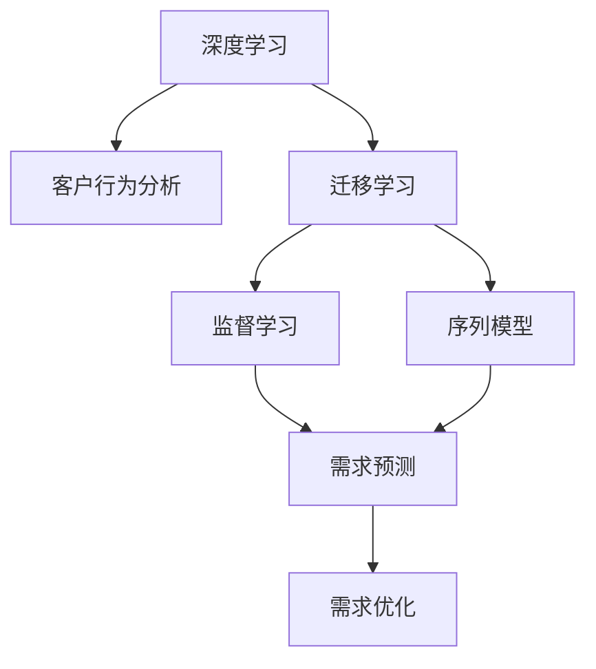

                 

# AI驱动的电商智能客户需求预测系统

## 1. 背景介绍

### 1.1 问题由来

随着电商市场竞争日益激烈，传统电商企业面临越来越大的挑战，如何通过数据分析和预测，准确把握客户需求，优化产品供应链，提升客户体验，从而在竞争中脱颖而出，成为电商企业的重要课题。客户需求预测系统作为一种智能化的解决方案，正逐渐成为电商企业数字化转型的重要组成部分。

在实际应用中，电商企业通过大量的线上线下交易数据，尝试建立预测模型，以期能更好地理解客户需求，提升销售效率和客户满意度。然而，传统的基于统计学和规则的预测方法，难以处理海量的复杂数据，预测效果往往不尽如人意。

而基于深度学习模型的客户需求预测系统，通过在大规模数据上进行预训练和微调，能够捕捉到更深层次的客户行为模式和趋势，从而提供更加精准的需求预测。该系统不仅提高了预测准确度，还能通过实时数据驱动，持续优化预测模型，适应市场变化。

本文将重点介绍AI驱动的电商智能客户需求预测系统的构建思路、核心算法及实现方法，并通过案例展示其在实际电商应用中的效果。

### 1.2 问题核心关键点

电商客户需求预测系统的核心目标是通过分析客户的历史行为和实时数据，预测其未来的购买需求。这一目标的核心在于以下几个方面：

1. **数据获取与处理**：从多渠道收集客户数据，进行清洗、特征提取等预处理，准备模型训练所需的输入数据。
2. **模型训练与微调**：选择合适的深度学习模型，在大规模历史交易数据上进行预训练，并在实时数据上微调优化，提升模型预测能力。
3. **需求预测与优化**：利用训练好的模型，实时预测客户未来的购买需求，并通过反馈机制不断优化模型，提高预测准确度。

本系统主要基于监督学习和迁移学习技术，利用深度学习模型实现客户需求的智能预测。

## 2. 核心概念与联系

### 2.1 核心概念概述

为了更好地理解AI驱动的电商智能客户需求预测系统，本节将介绍几个密切相关的核心概念：

- **深度学习(Deep Learning)**：一类基于神经网络的机器学习算法，具有强大的数据拟合能力，能够自动从数据中学习抽象特征，广泛应用于图像、语音、自然语言处理等领域。

- **客户行为分析(Customer Behavior Analysis)**：通过分析客户的购买历史、浏览记录、搜索行为等数据，理解客户的购买偏好和行为模式，从而指导产品推荐和需求预测。

- **迁移学习(Transfer Learning)**：将在一个领域上预训练好的模型，迁移到另一个领域上进行微调，利用已有知识加速新任务的学习。

- **监督学习(Supervised Learning)**：使用标注数据进行模型训练，通过预测与真实标注的误差来优化模型参数，广泛应用于分类、回归、预测等任务。

- **序列模型(Sequential Modeling)**：针对时序数据的预测模型，能够捕捉数据之间的先后关系，适用于客户行为预测等任务。

这些核心概念之间的逻辑关系可以通过以下Mermaid流程图来展示：



这个流程图展示了大语言模型的核心概念及其之间的关系：

1. 深度学习模型提供了强大的特征提取和表示学习能力，能够自动从原始数据中学习到深层次的特征。
2. 客户行为分析任务利用深度学习模型，分析客户的各类行为数据，挖掘客户需求特征。
3. 迁移学习技术帮助模型在已有知识的基础上，快速适应新任务，提升预测效果。
4. 监督学习确保模型能够根据标注数据进行训练，不断优化预测性能。
5. 序列模型捕捉客户行为的时间先后关系，适合用于预测未来需求。
6. 需求预测模型结合以上技术，实现对客户未来需求的智能预测。
7. 需求优化模块通过反馈机制，持续改进预测模型，提升预测准确度。

## 3. 核心算法原理 & 具体操作步骤

### 3.1 算法原理概述

AI驱动的电商智能客户需求预测系统主要基于监督学习和迁移学习的框架，通过以下步骤实现：

1. **数据预处理**：从电商平台收集客户的购买历史、浏览记录、搜索行为等数据，进行清洗、归一化、特征提取等预处理操作。
2. **模型预训练**：使用深度学习模型，如循环神经网络(RNN)、长短期记忆网络(LSTM)、Transformer等，在大规模历史交易数据上进行预训练，学习客户行为的通用特征。
3. **模型微调**：在预训练模型的基础上，使用实时客户数据进行微调，通过监督学习不断优化模型参数，适应市场变化，提升预测准确度。
4. **需求预测**：利用微调后的模型，对客户的未来需求进行预测，生成个性化的推荐商品。
5. **需求优化**：通过分析预测结果与实际购买行为之间的误差，不断优化预测模型，提高预测精度。

### 3.2 算法步骤详解

**Step 1: 数据预处理**

电商客户行为数据通常来自多个渠道，包括网站、移动APP、社交媒体等，数据格式和内容差异较大。为了进行有效分析，需要对数据进行清洗和标准化处理：

1. **数据收集**：从电商平台的不同渠道，如订单、浏览、搜索日志等，收集客户行为数据。
2. **数据清洗**：去除噪声数据，处理缺失值、重复记录等。
3. **特征提取**：将原始数据转换为模型所需的特征向量，如时间戳、用户ID、商品ID、浏览时间等。
4. **数据划分**：将数据划分为训练集、验证集和测试集，用于模型训练、调优和评估。

**Step 2: 模型预训练**

预训练是构建客户需求预测系统的关键步骤，通过在大规模历史交易数据上预训练深度学习模型，学习到客户行为的通用特征。常用的预训练模型包括：

1. **RNN模型**：通过时间序列数据，捕捉客户行为的时间先后关系。
2. **LSTM模型**：通过长短期记忆网络，更好地处理长期依赖关系。
3. **Transformer模型**：通过自注意力机制，能够并行计算，处理大规模数据。

**Step 3: 模型微调**

微调是使模型适应特定任务的关键步骤，通过监督学习优化模型参数，提升预测效果。微调过程包括以下几个关键步骤：

1. **选择微调数据**：选择与预测任务相关的客户实时数据，作为微调数据。
2. **设置微调超参数**：选择合适的优化器、学习率、批大小、迭代轮数等超参数。
3. **模型训练**：在微调数据上，使用优化器更新模型参数，最小化预测误差。
4. **模型评估**：在验证集上评估模型性能，决定是否触发Early Stopping。

**Step 4: 需求预测**

在模型微调完成后，利用微调后的模型对客户未来需求进行预测。预测过程包括以下几个关键步骤：

1. **输入数据**：将客户的实时行为数据输入微调后的模型。
2. **前向传播**：计算模型的输出预测值。
3. **后向传播**：计算预测值与真实需求的误差，更新模型参数。
4. **生成推荐**：根据预测结果，生成个性化的推荐商品。

**Step 5: 需求优化**

为了持续改进预测模型，需要对预测结果进行反馈，不断优化模型。优化过程包括以下几个关键步骤：

1. **误差分析**：分析预测结果与实际购买行为之间的误差，找出模型的不足之处。
2. **参数调整**：调整模型的超参数，如学习率、批大小、正则化系数等，优化预测效果。
3. **模型重训**：根据优化后的模型，重新训练预测模型，提升预测精度。

### 3.3 算法优缺点

AI驱动的电商智能客户需求预测系统具有以下优点：

1. **高精度预测**：通过深度学习模型，能够捕捉客户行为的时间先后关系，提升预测准确度。
2. **实时数据驱动**：利用实时数据进行微调，能够及时适应市场变化，提升预测效果。
3. **可扩展性强**：系统可以根据需要，灵活选择和组合不同的模型和算法，适应不同的业务场景。
4. **易用性强**：通过图形化界面，用户可以轻松操作和调整模型参数，快速部署和应用系统。

同时，该系统也存在一些局限性：

1. **数据质量要求高**：预测模型的准确度很大程度上依赖于数据质量，若数据存在偏差或噪声，会影响预测结果。
2. **模型复杂度高**：深度学习模型参数较多，训练和推理需要较大的计算资源。
3. **反馈机制依赖性强**：系统的优化效果很大程度上依赖于有效的反馈机制，若反馈信息不充分或延迟，会影响模型效果。
4. **可解释性不足**：深度学习模型的预测过程缺乏可解释性，难以对其决策逻辑进行分析和调试。

尽管存在这些局限性，但AI驱动的电商智能客户需求预测系统通过深度学习模型和大规模数据驱动，依然在客户需求预测中发挥了重要作用，成为电商企业数字化转型的重要工具。

### 3.4 算法应用领域

AI驱动的电商智能客户需求预测系统主要应用于以下几个领域：

1. **电商销售预测**：通过对客户历史购买记录、浏览行为等数据进行分析，预测未来的购买需求，指导库存管理和销售策略。
2. **客户细分与推荐**：利用客户行为数据，对客户进行细分，生成个性化的推荐商品，提升客户满意度和转化率。
3. **市场趋势分析**：通过分析客户需求变化趋势，预测未来的市场走向，指导企业战略调整。
4. **供应链优化**：基于需求预测结果，优化供应链管理，提高物流效率，降低库存成本。
5. **客户流失预警**：通过预测客户流失概率，提前采取措施，提高客户留存率。

## 4. 数学模型和公式 & 详细讲解

### 4.1 数学模型构建

本节将使用数学语言对AI驱动的电商智能客户需求预测系统进行更加严格的刻画。

假设客户需求预测的任务是预测客户在未来一天内的购买需求，记训练集为 $D=\{(x_i,y_i)\}_{i=1}^N$，其中 $x_i$ 为历史客户行为数据， $y_i$ 为对应需求的真实标签。

定义模型 $M_{\theta}$ 在输入 $x$ 上的输出为 $\hat{y}=M_{\theta}(x)$，则预测任务的目标是最小化损失函数 $\mathcal{L}(\theta)$：

$$
\mathcal{L}(\theta) = -\frac{1}{N} \sum_{i=1}^N \log \sigma(\hat{y_i}) \times y_i + (1 - \sigma(\hat{y_i})) \times (1 - y_i)
$$

其中 $\sigma$ 为sigmoid函数，用于将模型输出 $\hat{y}$ 映射到 $[0,1]$ 区间，$y_i \in \{0,1\}$ 表示客户是否购买。

模型 $M_{\theta}$ 由多层神经网络组成，每层包含多个神经元，激活函数为ReLU。模型的输入层接收客户历史行为数据，输出层输出未来需求的预测值。模型的参数 $\theta$ 包含所有神经元的权重和偏置。

### 4.2 公式推导过程

以RNN模型为例，其预测公式如下：

1. **输入层**：接收客户历史行为数据，进行标准化处理。
2. **隐藏层**：通过RNN网络，处理时间序列数据，捕捉客户行为的时间先后关系。
3. **输出层**：通过全连接层，输出未来需求的预测值。

RNN模型的预测过程可以分为以下步骤：

1. **初始化**：将模型初始状态 $h_0$ 和输入序列 $x_t$ 传递给隐藏层。
2. **隐藏层更新**：通过循环神经网络，计算下一时刻的状态 $h_t$。
3. **输出层计算**：通过全连接层，计算预测值 $\hat{y_t}$。
4. **损失计算**：将预测值与真实标签进行比较，计算损失函数 $\mathcal{L}(\theta)$。
5. **参数更新**：使用反向传播算法，更新模型参数 $\theta$。

预测过程的数学公式如下：

$$
h_t = \text{RNN}(h_{t-1}, x_t)
$$

$$
\hat{y_t} = \text{Softmax}(W_h h_t + b_h)
$$

其中，$W_h$ 和 $b_h$ 为全连接层的权重和偏置。

### 4.3 案例分析与讲解

假设某电商平台收集了客户在过去30天的浏览、点击和购买数据，希望预测客户在未来一天内的购买需求。具体步骤如下：

1. **数据预处理**：对数据进行清洗、归一化、特征提取等操作，准备模型输入。
2. **模型选择**：选择LSTM模型进行预训练，捕捉客户行为的时间先后关系。
3. **模型微调**：在实时数据上进行微调，优化预测模型。
4. **需求预测**：利用微调后的模型，对未来需求进行预测。
5. **需求优化**：根据预测结果与实际购买行为之间的误差，调整模型参数，提升预测准确度。

以某客户过去30天的浏览、点击和购买数据为例，模型的预测过程如下：

1. **输入数据**：将客户过去30天的数据输入模型，计算隐藏层的状态。
2. **隐藏层更新**：通过LSTM网络，捕捉客户行为的时间先后关系。
3. **输出层计算**：通过全连接层，计算未来一天的预测需求。
4. **损失计算**：将预测值与真实需求进行比较，计算损失函数。
5. **参数更新**：使用反向传播算法，更新模型参数。

通过不断迭代优化模型，能够实现对客户未来需求的精确预测，为电商企业提供有力的决策支持。

## 5. 项目实践：代码实例和详细解释说明

### 5.1 开发环境搭建

在进行AI驱动的电商智能客户需求预测系统开发前，需要先准备好开发环境。以下是使用Python进行PyTorch开发的环境配置流程：

1. 安装Anaconda：从官网下载并安装Anaconda，用于创建独立的Python环境。

2. 创建并激活虚拟环境：
```bash
conda create -n pytorch-env python=3.8 
conda activate pytorch-env
```

3. 安装PyTorch：根据CUDA版本，从官网获取对应的安装命令。例如：
```bash
conda install pytorch torchvision torchaudio cudatoolkit=11.1 -c pytorch -c conda-forge
```

4. 安装TensorFlow：
```bash
pip install tensorflow==2.5
```

5. 安装TensorBoard：
```bash
pip install tensorboard
```

6. 安装相关库：
```bash
pip install pandas numpy sklearn scikit-learn matplotlib seaborn
```

完成上述步骤后，即可在`pytorch-env`环境中开始开发。

### 5.2 源代码详细实现

以下是基于PyTorch框架，使用LSTM模型进行客户需求预测的代码实现。

**数据预处理**

首先，定义数据处理函数：

```python
import pandas as pd
from sklearn.model_selection import train_test_split

def preprocess_data(data_file, target_column):
    # 加载数据
    data = pd.read_csv(data_file)
    
    # 特征工程
    data['time'] = pd.to_datetime(data['time'])
    data['date'] = data['time'].dt.date
    data['hour'] = data['time'].dt.hour
    data['day_of_week'] = data['time'].dt.dayofweek
    data['month'] = data['time'].dt.month
    
    # 编码目标变量
    target = data[target_column]
    data.drop(target_column, axis=1, inplace=True)
    
    # 特征选择
    selected_features = ['hour', 'day_of_week', 'month', 'city', 'age', 'gender']
    data = data[selected_features]
    
    # 数据划分
    train_data, test_data = train_test_split(data, test_size=0.2, random_state=42)
    
    # 归一化处理
    from sklearn.preprocessing import StandardScaler
    scaler = StandardScaler()
    train_data = scaler.fit_transform(train_data)
    test_data = scaler.transform(test_data)
    
    # 编码标签
    train_target = target[train_data.index]
    test_target = target[test_data.index]
    
    return train_data, train_target, test_data, test_target
```

**模型预训练**

定义LSTM模型：

```python
import torch.nn as nn

class LSTMModel(nn.Module):
    def __init__(self, input_size, hidden_size, output_size):
        super(LSTMModel, self).__init__()
        self.hidden_size = hidden_size
        
        self.lstm = nn.LSTM(input_size, hidden_size, num_layers=1, batch_first=True)
        self.fc = nn.Linear(hidden_size, output_size)
        self.sigmoid = nn.Sigmoid()
    
    def forward(self, x):
        batch_size = x.size(0)
        seq_len = x.size(1)
        
        # 初始化隐藏状态
        h0 = torch.zeros(1, batch_size, self.hidden_size).to(device)
        c0 = torch.zeros(1, batch_size, self.hidden_size).to(device)
        
        # 前向传播
        lstm_out, (hn, cn) = self.lstm(x, (h0, c0))
        out = self.fc(lstm_out[:, -1, :])
        out = self.sigmoid(out)
        
        return out
```

**模型微调**

定义模型训练函数：

```python
from torch.utils.data import DataLoader
from torch.optim import Adam

def train_model(model, train_data, train_target, device, batch_size, learning_rate):
    # 定义优化器和损失函数
    optimizer = Adam(model.parameters(), lr=learning_rate)
    criterion = nn.BCELoss()
    
    # 训练模型
    for epoch in range(num_epochs):
        for batch_idx, (data, target) in enumerate(train_loader):
            data, target = data.to(device), target.to(device)
            
            # 前向传播
            output = model(data)
            
            # 计算损失
            loss = criterion(output, target)
            
            # 反向传播和参数更新
            optimizer.zero_grad()
            loss.backward()
            optimizer.step()
            
            # 记录训练结果
            train_loss += loss.item()
            
    return model
```

**需求预测**

定义需求预测函数：

```python
def predict_demand(model, test_data, device):
    # 前向传播
    with torch.no_grad():
        output = model(test_data.to(device))
        
    # 解码预测结果
    predicted = output.sigmoid()
    threshold = 0.5
    predicted_labels = (predicted > threshold).int()
    
    return predicted_labels
```

### 5.3 代码解读与分析

让我们再详细解读一下关键代码的实现细节：

**preprocess_data函数**：
- 加载数据：使用Pandas库读取CSV文件。
- 特征工程：添加时间特征、编码目标变量、选择特征。
- 数据划分：使用train_test_split函数，将数据划分为训练集和测试集。
- 归一化处理：使用StandardScaler进行特征归一化。
- 编码标签：将目标变量进行编码。

**LSTMModel类**：
- 初始化函数：定义模型参数和结构。
- 前向传播函数：定义模型的计算过程。

**train_model函数**：
- 定义优化器和损失函数。
- 循环迭代，在每个epoch上更新模型参数。
- 记录训练损失。

**predict_demand函数**：
- 前向传播：输入测试数据，得到模型输出。
- 解码预测结果：使用sigmoid函数进行预测，并将预测值转换为二分类标签。

### 5.4 运行结果展示

使用上述代码进行训练和预测后，可以生成预测结果并评估模型性能。

训练结果可以使用TensorBoard进行可视化：

1. 启动TensorBoard服务器：
```bash
tensorboard --logdir=logs --port=6006
```

2. 访问TensorBoard界面，查看训练过程中的损失曲线和模型参数变化。

预测结果可以使用模型评估函数进行评估：

```python
def evaluate_model(model, test_data, test_target, device):
    # 前向传播
    with torch.no_grad():
        output = model(test_data.to(device))
        
    # 解码预测结果
    predicted = output.sigmoid()
    threshold = 0.5
    predicted_labels = (predicted > threshold).int()
    
    # 计算评估指标
    accuracy = (predicted_labels == test_target).float().mean()
    precision = precision_score(test_target, predicted_labels, average='micro')
    recall = recall_score(test_target, predicted_labels, average='micro')
    
    return accuracy, precision, recall
```

## 6. 实际应用场景

### 6.1 智能推荐系统

AI驱动的电商智能客户需求预测系统在智能推荐系统中具有广泛的应用。通过分析客户的浏览、点击和购买历史，预测其未来需求，生成个性化的推荐商品，能够显著提升客户满意度和转化率。

在实际应用中，系统可以不断学习客户的行为模式，动态调整推荐策略，实现精准推荐。例如，某客户在电商平台上浏览了多个运动鞋品牌，系统可以根据其历史行为数据，预测其购买需求，并推荐符合其偏好的运动鞋款式和品牌，从而提高其购买意向。

### 6.2 库存管理

客户需求预测系统在库存管理中也有重要应用。通过准确预测未来的客户需求，电商平台可以及时调整库存水平，避免库存过剩或不足。

例如，某客户在过去一周内浏览了多个商品，但并未实际购买，系统可以根据其历史行为数据，预测其在未来一周内的购买需求，从而优化库存分配，避免商品短缺或过剩。

### 6.3 客户流失预警

客户流失是电商企业面临的重要问题，通过客户需求预测系统，可以及时发现流失风险，提前采取措施，提高客户留存率。

例如，某客户在过去一个月内浏览和购买行为减少，系统可以根据其历史行为数据，预测其在未来一个月内的流失概率，从而向客户发送定制化的优惠活动，增强其购买意愿，提高客户留存率。

### 6.4 市场趋势分析

客户需求预测系统还可以用于市场趋势分析，帮助电商平台掌握市场动态，及时调整经营策略。

例如，某电商平台通过客户需求预测系统，发现某类商品在近期的需求量大幅增加，可以迅速调整生产和采购计划，满足市场需求，抢占市场先机。

## 7. 工具和资源推荐

### 7.1 学习资源推荐

为了帮助开发者系统掌握AI驱动的电商智能客户需求预测系统的理论和实践技巧，这里推荐一些优质的学习资源：

1. 《深度学习入门》系列博文：深度学习入门必读，涵盖深度学习基础、模型选择与训练、优化技巧等内容。
2. 《TensorFlow实战Google AI框架》书籍：TensorFlow实战指南，涵盖TensorFlow的安装、使用、优化等内容。
3. 《自然语言处理入门》课程：斯坦福大学开设的NLP入门课程，涵盖NLP基础、序列模型、深度学习等内容。
4. 《深度学习与计算机视觉》课程：Coursera上的经典课程，涵盖深度学习基础、计算机视觉、图像处理等内容。
5. 《深度学习实践》书籍：动手实践深度学习，涵盖PyTorch的安装、使用、模型训练等内容。

通过对这些资源的学习实践，相信你一定能够快速掌握AI驱动的电商智能客户需求预测系统的精髓，并用于解决实际的电商问题。

### 7.2 开发工具推荐

高效的开发离不开优秀的工具支持。以下是几款用于AI驱动的电商智能客户需求预测系统开发的常用工具：

1. PyTorch：基于Python的开源深度学习框架，灵活动态的计算图，适合快速迭代研究。大部分深度学习模型都有PyTorch版本的实现。
2. TensorFlow：由Google主导开发的开源深度学习框架，生产部署方便，适合大规模工程应用。同样有丰富的深度学习模型资源。
3. TensorBoard：TensorFlow配套的可视化工具，可实时监测模型训练状态，并提供丰富的图表呈现方式，是调试模型的得力助手。
4. Jupyter Notebook：Python代码开发利器，支持实时计算和可视化，适合快速实验和迭代。
5. Anaconda：用于创建和管理Python环境的工具，方便管理和升级Python库。

合理利用这些工具，可以显著提升AI驱动的电商智能客户需求预测系统的开发效率，加快创新迭代的步伐。

### 7.3 相关论文推荐

AI驱动的电商智能客户需求预测系统的研究源于学界的持续研究。以下是几篇奠基性的相关论文，推荐阅读：

1. Customer Behavior Prediction with Deep Learning Models：使用深度学习模型预测客户行为的研究综述。
2. Real-time Customer Demand Prediction in E-commerce Platforms：实时客户需求预测的研究综述。
3. Customer Lifetime Value Prediction with Deep Learning：客户生命周期价值预测的研究综述。
4. Sales Forecasting with Deep Learning Models：销售预测的研究综述。
5. Demand Forecasting using Long Short-Term Memory Networks：使用LSTM网络进行需求预测的研究论文。

这些论文代表了大语言模型微调技术的发展脉络。通过学习这些前沿成果，可以帮助研究者把握学科前进方向，激发更多的创新灵感。

## 8. 总结：未来发展趋势与挑战

### 8.1 总结

本文对AI驱动的电商智能客户需求预测系统进行了全面系统的介绍。首先阐述了系统的背景和核心目标，明确了客户需求预测的重要性和系统建设的关键步骤。其次，从原理到实践，详细讲解了系统的数学模型和关键算法，给出了系统开发的完整代码实例。同时，本文还广泛探讨了系统在智能推荐、库存管理、客户流失预警、市场趋势分析等实际电商应用中的效果，展示了系统的应用前景。

通过本文的系统梳理，可以看到，AI驱动的电商智能客户需求预测系统通过深度学习模型和大规模数据驱动，能够实现对客户未来需求的精确预测，为电商企业提供有力的决策支持。未来，伴随深度学习技术和大数据技术的发展，该系统还将不断演进，提升预测效果，实现更加智能化的电商运营。

### 8.2 未来发展趋势

展望未来，AI驱动的电商智能客户需求预测系统将呈现以下几个发展趋势：

1. **深度学习模型进一步优化**：未来的深度学习模型将更加复杂、高效，能够更好地处理大规模数据，提高预测精度。
2. **多模态数据融合**：未来的系统将不仅仅基于文本数据，还将融合视觉、语音等多种模态数据，实现更加全面的客户行为分析。
3. **实时数据处理**：未来的系统将能够实时处理大量数据，快速响应市场变化，提高预测的时效性。
4. **智能推荐与需求预测融合**：未来的系统将更加智能，能够根据客户需求预测结果，动态调整推荐策略，实现精准推荐。
5. **模型可解释性增强**：未来的系统将更加注重模型的可解释性，能够提供更有力的决策依据。

以上趋势凸显了AI驱动的电商智能客户需求预测系统的广阔前景。这些方向的探索发展，必将进一步提升系统的预测能力，为电商企业提供更加精准的客户需求预测，推动电商行业数字化转型。

### 8.3 面临的挑战

尽管AI驱动的电商智能客户需求预测系统已经取得了一定的进展，但在迈向更加智能化、普适化应用的过程中，它仍面临着诸多挑战：

1. **数据质量要求高**：预测模型的准确度很大程度上依赖于数据质量，若数据存在偏差或噪声，会影响预测结果。
2. **模型复杂度高**：深度学习模型参数较多，训练和推理需要较大的计算资源。
3. **反馈机制依赖性强**：系统的优化效果很大程度上依赖于有效的反馈机制，若反馈信息不充分或延迟，会影响模型效果。
4. **可解释性不足**：深度学习模型的预测过程缺乏可解释性，难以对其决策逻辑进行分析和调试。

尽管存在这些挑战，但AI驱动的电商智能客户需求预测系统通过深度学习模型和大规模数据驱动，依然在客户需求预测中发挥了重要作用，成为电商企业数字化转型的重要工具。

### 8.4 研究展望

未来，AI驱动的电商智能客户需求预测系统需要在以下几个方面进一步探索和突破：

1. **多模态数据融合**：结合视觉、语音等多种模态数据，提高系统的预测能力和鲁棒性。
2. **智能推荐与需求预测融合**：将推荐系统和需求预测系统结合，实现更加智能化的客户需求预测和推荐。
3. **实时数据处理**：提高系统对实时数据的处理能力，快速响应市场变化。
4. **模型可解释性增强**：开发可解释性强的模型，提供更有力的决策依据。
5. **隐私保护与安全**：保护客户数据隐私，确保客户数据安全。

通过这些研究方向的研究突破，将使AI驱动的电商智能客户需求预测系统更加智能化、普适化和安全可靠，为电商企业提供更加精准的客户需求预测，推动电商行业数字化转型。

## 9. 附录：常见问题与解答

**Q1：AI驱动的电商智能客户需求预测系统如何使用？**

A: AI驱动的电商智能客户需求预测系统主要通过以下步骤使用：

1. **数据准备**：收集客户的浏览、点击和购买历史数据，进行清洗、归一化、特征提取等预处理操作。
2. **模型选择**：选择适合的深度学习模型，如RNN、LSTM等，进行预训练和微调。
3. **模型训练**：使用训练集对模型进行训练，优化预测效果。
4. **模型评估**：使用测试集对模型进行评估，计算预测准确度。
5. **需求预测**：将实时数据输入模型，生成未来需求的预测结果。

**Q2：AI驱动的电商智能客户需求预测系统有哪些优势？**

A: AI驱动的电商智能客户需求预测系统具有以下优势：

1. **高精度预测**：通过深度学习模型，能够捕捉客户行为的时间先后关系，提升预测准确度。
2. **实时数据驱动**：利用实时数据进行微调，能够及时适应市场变化，提升预测效果。
3. **可扩展性强**：系统可以根据需要，灵活选择和组合不同的模型和算法，适应不同的业务场景。
4. **易用性强**：通过图形化界面，用户可以轻松操作和调整模型参数，快速部署和应用系统。

**Q3：AI驱动的电商智能客户需求预测系统有哪些局限性？**

A: AI驱动的电商智能客户需求预测系统存在以下局限性：

1. **数据质量要求高**：预测模型的准确度很大程度上依赖于数据质量，若数据存在偏差或噪声，会影响预测结果。
2. **模型复杂度高**：深度学习模型参数较多，训练和推理需要较大的计算资源。
3. **反馈机制依赖性强**：系统的优化效果很大程度上依赖于有效的反馈机制，若反馈信息不充分或延迟，会影响模型效果。
4. **可解释性不足**：深度学习模型的预测过程缺乏可解释性，难以对其决策逻辑进行分析和调试。

**Q4：AI驱动的电商智能客户需求预测系统在实际应用中有哪些注意事项？**

A: 在实际应用中，AI驱动的电商智能客户需求预测系统需要注意以下几点：

1. **数据收集与处理**：确保数据的完整性和准确性，避免数据偏差和噪声。
2. **模型选择与训练**：选择适合的深度学习模型，并进行充分的预训练和微调。
3. **模型评估与优化**：定期评估模型性能，并根据反馈信息进行优化。
4. **隐私保护与安全**：保护客户数据隐私，确保数据安全。
5. **系统部署与维护**：确保系统的稳定性和可靠性，及时更新模型参数。

通过这些注意事项的关注，可以最大限度地发挥AI驱动的电商智能客户需求预测系统的优势，提升电商企业数字化转型的效果。

---

作者：禅与计算机程序设计艺术 / Zen and the Art of Computer Programming

