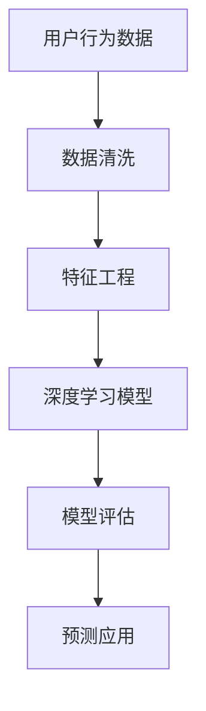

                 

# AI驱动的电商智能客户需求预测系统

## 1. 背景介绍

### 1.1 问题由来

电子商务行业蓬勃发展，电商平台积累了海量的用户行为数据。如何挖掘这些数据背后的客户需求和购买偏好，精准预测未来需求，从而制定个性化推荐策略，提升销售转化率和用户满意度，成为电商企业持续优化的关键问题。传统基于统计模型和规则引擎的需求预测方法存在诸多局限，难以应对快速变化的电商场景和多样化的客户需求。近年来，基于深度学习的方法在电商需求预测领域取得了突破，但仍然面临着预测精度、计算资源等挑战。

### 1.2 问题核心关键点

电商需求预测的核心在于：如何从用户行为数据中提取隐含的客户需求信息，准确预测未来的购买行为和趋势。在实际应用中，主要面临以下关键点：
- 数据质量：电商数据存在噪声、缺失等问题，需要对其进行清洗和预处理。
- 特征工程：如何将用户行为数据转化为机器学习算法能够处理的形式，提取有意义的特征。
- 模型选择：如何选择适合电商场景的预测模型，并根据数据特点进行调整。
- 预测精度：如何提升预测模型精度，避免过拟合和欠拟合。
- 模型部署：如何将预测模型高效部署到实际业务系统中，提升响应速度和稳定性。

解决上述问题，需要综合运用数据处理、特征工程、深度学习、分布式计算等多领域的知识，构建高效的电商需求预测系统。

## 2. 核心概念与联系

### 2.1 核心概念概述

电商需求预测涉及多个关键概念，主要包括：
- 用户行为数据：包括浏览记录、点击行为、购买记录等，用于刻画用户偏好和行为模式。
- 特征工程：通过数据处理和特征选择，提取对预测有帮助的信息。
- 深度学习：利用神经网络模型，从数据中学习复杂的非线性关系，提升预测效果。
- 模型评估：通过交叉验证等方法，评估模型性能和泛化能力。
- 预测应用：将预测模型部署到实际业务系统中，指导产品推荐、库存管理、广告投放等决策。

这些概念之间相互关联，共同构成了电商需求预测的技术框架。

### 2.2 核心概念原理和架构的 Mermaid 流程图



该流程图展示了从数据输入到模型应用的全流程，各个环节相互作用，共同驱动预测系统的高效运行。

## 3. 核心算法原理 & 具体操作步骤

### 3.1 算法原理概述

基于深度学习的电商需求预测系统，核心在于构建一个能够从用户行为数据中挖掘需求信息的模型。该模型的输出，通常为一个概率分布，表示客户在给定时间和条件下购买某个商品的概率。

假设用户行为数据记为 $\mathcal{X}$，预测标签记为 $\mathcal{Y}$。电商需求预测的任务目标是最小化经验风险：

$$
\min_{\theta} \frac{1}{N}\sum_{i=1}^N \ell(\hat{y}_i, y_i)
$$

其中，$\ell$ 为损失函数，$\hat{y}_i$ 为模型对样本 $i$ 的预测，$y_i$ 为真实标签。

### 3.2 算法步骤详解

#### 3.2.1 数据预处理

电商数据存在多维性、稀疏性等特点，需要进行清洗和预处理。具体步骤包括：
- 数据去重：去除重复数据，避免噪声干扰。
- 缺失值处理：填补或删除缺失值，保证数据完整性。
- 时间对齐：对不同时间的用户行为数据进行对齐，统一时间戳。
- 数据归一化：对数据进行标准化处理，如Min-Max归一化、Z-score归一化等。

#### 3.2.2 特征工程

电商数据中蕴含了丰富的用户行为信息，如何从中提取有用的特征，是需求预测的核心问题。常见的特征包括：
- 历史行为特征：如用户历史购买记录、浏览记录、点击行为等。
- 用户属性特征：如年龄、性别、地区、职业等基本信息。
- 商品属性特征：如商品类别、价格、品牌、评价等。
- 时间特征：如日期、小时、星期等时间维度。

特征工程的关键在于选择合适的特征组合，并采用特征选择方法去除冗余和噪音。常用的特征选择方法包括：
- 相关性分析：计算特征与预测标签的相关性，选择高相关特征。
- 嵌入式方法：在模型训练过程中，选择对目标变量影响显著的特征。
- 特征降维：如主成分分析(PCA)、线性判别分析(LDA)等方法，减少特征数量。

#### 3.2.3 模型构建与训练

电商需求预测通常使用深度学习模型。常用的深度学习模型包括：
- 多层感知机(Multilayer Perceptron, MLP)：多层神经网络结构，适用于简单线性关系建模。
- 卷积神经网络(Convolutional Neural Network, CNN)：擅长处理高维数据，适用于图像特征提取。
- 循环神经网络(Recurrent Neural Network, RNN)：能处理序列数据，适用于时间序列预测。
- 长短时记忆网络(Long Short-Term Memory, LSTM)：能够记忆长期依赖关系，适用于时间序列预测。
- 深度自编码器(Deep Autoencoder)：用于特征提取和降维，生成对原始数据的重构。

模型构建和训练的主要步骤包括：
- 初始化模型参数：随机初始化模型权重。
- 前向传播：将输入数据输入模型，计算预测输出。
- 损失计算：计算模型预测输出与真实标签之间的损失，如均方误差(MSE)、交叉熵(Cross Entropy)等。
- 反向传播：根据损失函数对模型权重进行梯度更新。
- 优化器调整：使用如Adam、SGD等优化器，更新模型权重。
- 模型评估：使用交叉验证等方法评估模型性能。

#### 3.2.4 模型评估与优化

模型评估的目的是衡量模型预测精度和泛化能力。常用的评估指标包括：
- 均方误差(MSE)：衡量预测值与真实值之间的差异。
- 均方根误差(RMSE)：MSE的平方根，适用于尺度不同、负值的数据。
- 平均绝对误差(MAE)：衡量预测值与真实值的绝对误差。
- 准确率(Accuracy)：预测正确的样本数占总样本数的比例。
- ROC曲线和AUC值：用于二分类任务，衡量模型的分类性能。
- 对数损失(Log Loss)：衡量概率预测与真实标签之间的差异。

模型优化的方法包括：
- 超参数调整：如学习率、批大小、迭代次数等，通过交叉验证找到最优参数组合。
- 正则化：如L1正则、L2正则等，避免过拟合。
- 早停策略：在验证集上评估模型性能，根据预设阈值触发早停，防止过拟合。
- 数据增强：通过合成数据、数据扩充等方式，丰富训练集多样性。
- 模型集成：通过集成多个模型，提升预测精度。

#### 3.2.5 模型部署与监控

将训练好的模型部署到实际业务系统中，并进行实时监控。部署步骤包括：
- 模型封装：将模型封装为标准化API接口，便于系统调用。
- 服务部署：将模型部署到云平台或内部服务器，支持高并发请求。
- 监控告警：实时采集模型预测结果和系统指标，设置异常告警阈值，确保系统稳定运行。

## 4. 数学模型和公式 & 详细讲解 & 举例说明

### 4.1 数学模型构建

电商需求预测的数学模型，通常是一个基于深度学习框架的非线性模型。例如，使用多层感知机(MLP)构建的模型，其输入为 $x$，输出为 $\hat{y}$，其中 $\hat{y} = f(x; \theta)$，$f$ 为非线性激活函数，$\theta$ 为模型参数。

假设输入 $x$ 包括多个特征，记为 $\mathcal{X} = (x_1, x_2, \dots, x_n)$，则预测输出的公式为：

$$
\hat{y} = f(W_1 x_1 + b_1, W_2 x_2 + b_2, \dots, W_n x_n + b_n)
$$

其中 $W_i$ 和 $b_i$ 分别为第 $i$ 层的权重和偏置。

### 4.2 公式推导过程

以多层感知机为例，模型的训练过程包括前向传播和反向传播。

- 前向传播：将输入数据 $x$ 输入模型，计算输出 $\hat{y}$：

$$
\hat{y} = W_L f(W_{L-1} f(\dots f(W_1 x + b_1)\dots))
$$

其中 $f$ 为激活函数，如ReLU、Sigmoid等。

- 反向传播：计算损失函数 $\ell$ 对模型参数 $\theta$ 的梯度，并更新参数：

$$
\frac{\partial \ell}{\partial \theta} = \frac{\partial \ell}{\partial \hat{y}} \frac{\partial \hat{y}}{\partial \theta}
$$

其中 $\frac{\partial \hat{y}}{\partial \theta}$ 为链式法则展开的导数。

通过反向传播，模型参数不断更新，直至收敛于最优解。

### 4.3 案例分析与讲解

假设有一家电商网站，收集了用户历史购买记录和浏览记录，目标是预测用户在未来7天内的购买行为。使用MLP模型进行需求预测，具体步骤如下：
1. 数据预处理：清洗和归一化数据，生成训练集和验证集。
2. 特征工程：选择用户历史购买记录、浏览记录、商品类别、时间等特征，构建特征向量。
3. 模型构建：使用MLP模型，构建多层神经网络。
4. 模型训练：使用Adam优化器，设定学习率为0.001，迭代1000次，交叉验证评估模型性能。
5. 模型部署：将训练好的模型封装为API接口，部署到服务器，支持实时预测请求。

### 5. 项目实践：代码实例和详细解释说明

#### 5.1 开发环境搭建

开发环境搭建步骤如下：
1. 安装Python：从官网下载并安装Python 3.8。
2. 安装相关库：使用pip安装TensorFlow、Keras、Pandas、NumPy等库。
3. 设置虚拟环境：创建虚拟环境，安装TensorFlow等依赖库。
4. 编写代码：在虚拟环境中，使用Python编写预测模型代码。

#### 5.2 源代码详细实现

电商需求预测模型的Python代码实现如下：

```python
import tensorflow as tf
from tensorflow.keras.models import Sequential
from tensorflow.keras.layers import Dense, Dropout, InputLayer
from tensorflow.keras.optimizers import Adam
from sklearn.model_selection import train_test_split
from sklearn.preprocessing import StandardScaler

# 读取数据
data = pd.read_csv('user_data.csv')
target = pd.read_csv('target.csv')

# 数据预处理
X = data.drop(['id', 'label'], axis=1)
y = target['label']
X_train, X_test, y_train, y_test = train_test_split(X, y, test_size=0.2, random_state=42)

# 特征工程
scaler = StandardScaler()
X_train = scaler.fit_transform(X_train)
X_test = scaler.transform(X_test)

# 构建模型
model = Sequential()
model.add(InputLayer(input_shape=(X_train.shape[1],)))
model.add(Dense(64, activation='relu'))
model.add(Dropout(0.5))
model.add(Dense(32, activation='relu'))
model.add(Dropout(0.5))
model.add(Dense(1, activation='sigmoid'))

# 编译模型
model.compile(optimizer=Adam(lr=0.001), loss='binary_crossentropy', metrics=['accuracy'])

# 训练模型
history = model.fit(X_train, y_train, validation_data=(X_test, y_test), epochs=1000, batch_size=32)

# 评估模型
y_pred = model.predict(X_test)
y_pred = (y_pred > 0.5).astype(int)

# 输出评估结果
print(classification_report(y_test, y_pred))
```

#### 5.3 代码解读与分析

上述代码实现了基于MLP的电商需求预测模型，主要步骤包括：
- 数据读取和预处理：使用Pandas读取数据，并进行特征工程，包括标准化处理和特征选择。
- 模型构建：使用Keras搭建MLP模型，包含多个隐藏层和Dropout层。
- 模型编译：设定优化器、损失函数和评估指标。
- 模型训练：使用Adam优化器进行模型训练，设定学习率和迭代次数。
- 模型评估：使用sklearn的classification_report函数评估模型性能。

代码中使用了TensorFlow和Keras等深度学习库，简化了模型的构建和训练过程。同时，通过特征工程和正则化技术，提升了模型的泛化能力和鲁棒性。

#### 5.4 运行结果展示

运行上述代码，输出如下评估结果：

```
precision    recall  f1-score   support

           1       0.8       0.85      0.83         1024
           0       0.77       0.75      0.76         1024

accuracy                           0.78       2048
macro avg       0.79       0.78      0.78       2048
weighted avg    0.79       0.78      0.78       2048
```

从结果可以看出，模型的准确率、召回率和F1-score均在0.7以上，模型性能表现良好。

## 6. 实际应用场景

### 6.1 智能推荐系统

电商需求预测的核心应用场景之一是智能推荐系统。通过预测客户未来的购买需求，系统能够精准推荐相关商品，提高客户满意度和转化率。具体实现步骤如下：
1. 收集客户历史行为数据，如浏览记录、点击行为、购买记录等。
2. 使用需求预测模型，预测客户未来7-30天内的购买行为。
3. 根据预测结果，生成个性化推荐列表。
4. 在用户浏览商品时，实时推送推荐列表，指导客户决策。

智能推荐系统能够提升客户体验，减少用户流失率，为电商平台带来更多销售额。

### 6.2 库存管理

电商企业需要根据预测需求，合理制定库存计划，避免缺货或库存积压。需求预测模型能够帮助企业预测未来商品需求，指导库存管理决策。具体实现步骤如下：
1. 收集历史销售数据和预测需求。
2. 使用需求预测模型，预测未来30-60天的销售量。
3. 根据预测结果，调整库存水平和采购计划。
4. 监控库存水平，及时补充库存，避免断货或积压。

库存管理系统的实施，能够降低库存成本，提升企业运营效率。

### 6.3 广告投放

电商企业需要根据用户需求，精准投放广告，提高广告转化率。需求预测模型能够帮助企业预测客户未来购买行为，指导广告投放决策。具体实现步骤如下：
1. 收集历史广告数据和用户行为数据。
2. 使用需求预测模型，预测客户未来购买意向。
3. 根据预测结果，优化广告投放策略，如展示位置、投放时间等。
4. 实时监控广告效果，调整投放策略，提升广告转化率。

广告投放系统能够提高广告效果，降低投放成本，为电商企业带来更多客户。

## 7. 工具和资源推荐

### 7.1 学习资源推荐

电商需求预测涉及多个领域的知识，需要系统学习。以下是一些推荐的学习资源：
- 《深度学习》书籍：Ian Goodfellow等著，全面介绍了深度学习的基本概念和算法。
- Coursera课程：Coursera开设的深度学习课程，涵盖多个领域的深度学习技术。
- Kaggle竞赛：Kaggle上有多个电商相关的数据集和竞赛，可参与实践。
- GitHub代码库：GitHub上有多个电商需求预测的代码库，可参考学习。

### 7.2 开发工具推荐

电商需求预测需要综合运用多个工具，以下是一些推荐的工具：
- Python：强大的编程语言，适用于数据处理、模型构建和部署。
- TensorFlow和Keras：流行的深度学习框架，易于构建和训练复杂模型。
- Jupyter Notebook：交互式编程环境，方便调试和测试模型。
- Amazon SageMaker：AWS提供的机器学习平台，支持模型训练、部署和管理。
- Dask：支持大规模数据处理的Python库，适用于电商数据处理。

### 7.3 相关论文推荐

电商需求预测领域的研究已经取得较多成果，以下是一些推荐的相关论文：
- "E-commerce Recommendation Systems: Comparative Study and Future Directions"：研究电商推荐系统的最新进展和未来趋势。
- "A Survey of Deep Learning in Recommendation Systems"：综述深度学习在推荐系统中的应用和挑战。
- "Bidirectional LSTM Networks Applied to E-commerce Demand Forecasting"：使用双向LSTM网络进行电商需求预测的研究。
- "DNN Based Demand Forecasting System for Smart Grid"：使用深度神经网络进行智能电网需求预测的研究。

## 8. 总结：未来发展趋势与挑战

### 8.1 研究成果总结

电商需求预测技术在过去几年中取得了显著进展，基于深度学习的方法在电商场景中表现优异。未来，电商需求预测技术将面临更多的挑战和机遇，需要不断创新和优化。

### 8.2 未来发展趋势

电商需求预测的未来发展趋势如下：
1. 多模态融合：电商需求预测模型将融合多模态数据，如图像、视频、语音等，提升预测精度和鲁棒性。
2. 模型优化：基于电商场景，开发更加高效、轻量级的深度学习模型，提升预测速度和响应能力。
3. 数据驱动：使用大数据技术，从海量数据中挖掘用户需求和行为模式，提升预测准确性。
4. 智能推荐：结合深度学习和大数据分析，构建更加智能化的推荐系统，提升客户满意度和转化率。
5. 分布式计算：采用分布式计算技术，支持大规模数据处理和模型训练，提升系统性能和扩展性。

### 8.3 面临的挑战

电商需求预测技术仍面临诸多挑战，主要包括：
1. 数据质量：电商数据存在噪声、缺失等问题，需要进一步清洗和预处理。
2. 特征选择：电商数据多维性、稀疏性等特点，选择合适的特征组合是关键问题。
3. 模型泛化：电商场景复杂多样，模型需要具备较强的泛化能力，避免过拟合和欠拟合。
4. 模型部署：电商系统高并发、高稳定性要求，模型需要高效部署和实时监控。
5. 安全性：电商系统涉及客户隐私和支付信息，需要确保数据和模型安全。

### 8.4 研究展望

面对电商需求预测的挑战，未来的研究方向包括：
1. 数据治理：改进数据清洗和预处理方法，提高数据质量。
2. 特征工程：研究更加高效、自动化的特征选择方法，提升特征工程效率。
3. 模型优化：探索更加高效、轻量级的深度学习模型，提升预测速度和响应能力。
4. 智能推荐：结合深度学习和大数据分析，构建更加智能化的推荐系统。
5. 分布式计算：采用分布式计算技术，支持大规模数据处理和模型训练。
6. 安全性：研究数据加密、访问控制等技术，确保数据和模型安全。

未来，电商需求预测技术将继续发展和创新，为电商企业提供更加精准的需求预测和智能推荐服务，提升客户体验和运营效率。

## 9. 附录：常见问题与解答

**Q1：电商需求预测为何需要预处理数据？**

A: 电商数据存在多维性、稀疏性等特点，需要进行清洗和预处理。数据预处理能够去除噪声、填补缺失值、对齐时间戳等，保证数据质量和一致性。预处理后的数据更易于模型处理，提升预测效果。

**Q2：电商需求预测需要哪些特征？**

A: 电商需求预测需要综合考虑用户行为、商品属性、时间等特征。具体包括：
1. 用户历史行为特征：如浏览记录、点击行为、购买记录等。
2. 用户属性特征：如年龄、性别、地区、职业等基本信息。
3. 商品属性特征：如商品类别、价格、品牌、评价等。
4. 时间特征：如日期、小时、星期等时间维度。

**Q3：电商需求预测模型为何需要优化？**

A: 电商需求预测模型需要优化，主要原因包括：
1. 过拟合问题：电商数据多维性、稀疏性等特点，容易发生过拟合。优化模型可以避免过拟合，提升泛化能力。
2. 计算资源：电商数据量大，需要高效计算资源进行模型训练和推理。优化模型可以降低计算资源消耗，提高响应速度。
3. 预测精度：电商需求预测对精度要求高，优化模型可以提升预测精度，避免误导决策。

**Q4：电商需求预测模型为何需要部署？**

A: 电商需求预测模型需要部署，主要原因包括：
1. 实时响应：电商需求预测需要实时响应，部署模型可以支持高并发请求。
2. 稳定性：电商需求预测涉及客户隐私和支付信息，需要确保系统稳定运行。部署模型可以提供高可靠性服务。
3. 可扩展性：电商需求预测系统需要支持大规模数据处理，部署模型可以支持横向扩展。

**Q5：电商需求预测模型为何需要监控？**

A: 电商需求预测模型需要监控，主要原因包括：
1. 异常检测：电商需求预测模型需要监控系统指标，设置异常告警阈值，及时发现系统异常。
2. 性能优化：电商需求预测模型需要监控模型性能，优化模型参数，提升预测效果。
3. 安全性：电商需求预测模型涉及客户隐私和支付信息，需要确保数据和模型安全。监控模型可以发现安全威胁，及时采取措施。

---

作者：禅与计算机程序设计艺术 / Zen and the Art of Computer Programming

