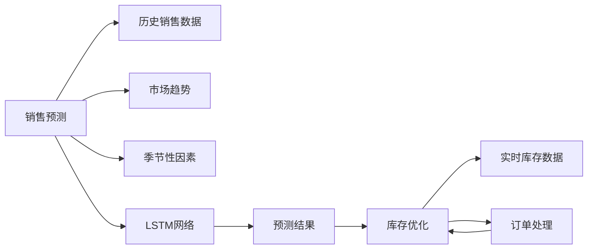
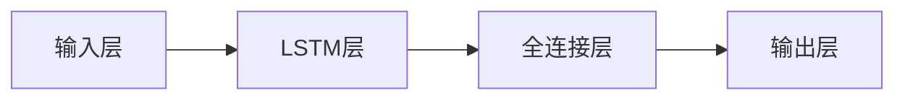

                 

# AI驱动的销售预测与库存优化

> 关键词：
1. 销售预测
2. 库存优化
3. 深度学习
4. 时间序列分析
5. 神经网络
6. 长短期记忆网络（LSTM）
7. 端到端优化

## 1. 背景介绍

在数字化转型的浪潮中，智能算法的应用已经成为提升企业竞争力的关键。特别是对于零售、制造等依赖大规模库存管理的行业，准确预测销售并及时优化库存，对于降低成本、提高效率、增加利润具有至关重要的作用。基于人工智能（AI）的销售预测与库存优化系统，可以通过大数据和深度学习技术，从历史数据中学习销售规律，预测未来销售，并自动调整库存水平，以实现成本与收益的最优平衡。本文将深入探讨AI在销售预测和库存优化中的应用，展示如何使用深度学习技术实现精确的销售预测和高效的库存管理。

## 2. 核心概念与联系

### 2.1 核心概念概述

为了深入理解基于AI的销售预测与库存优化系统，我们先介绍几个核心概念：

1. **销售预测**：利用历史销售数据、市场趋势、季节性因素等，预测未来的销售量。准确的销售预测可以帮助企业合理制定生产计划，避免库存积压或短缺，提高运营效率。

2. **库存优化**：基于销售预测结果，动态调整库存水平，确保满足市场需求的同时最小化库存成本。库存优化可以通过实时监控库存状态，自动触发补货或削减订单，实现库存的动态平衡。

3. **深度学习**：一种基于神经网络的机器学习方法，通过多层神经网络模型学习数据的复杂模式，适用于大规模数据处理和复杂任务预测。深度学习在销售预测和库存优化中，可以从中学习历史数据的规律，进行准确的销售预测和库存调整。

4. **时间序列分析**：研究时间序列数据，分析数据背后的趋势、季节性、周期性等特征，以进行销售预测和库存管理。时间序列分析是深度学习在销售预测中的应用基础。

5. **长短期记忆网络（LSTM）**：一种特殊的递归神经网络，能够捕捉长期依赖关系，适用于处理时间序列数据。LSTM在销售预测中，可以学习季节性、周期性等长期特征，提高预测准确性。

### 2.2 核心概念原理和架构的 Mermaid 流程图



以上流程图展示了销售预测与库存优化的主要流程。首先，通过收集历史销售数据、市场趋势和季节性因素，输入到LSTM网络中进行预测。预测结果指导库存优化，结合实时库存数据和订单处理信息，动态调整库存水平，实现库存的优化管理。

## 3. 核心算法原理 & 具体操作步骤

### 3.1 算法原理概述

基于AI的销售预测与库存优化系统，主要利用深度学习中的LSTM网络，结合时间序列分析技术，从历史销售数据中学习规律，进行准确的销售预测。通过预测结果，系统能够自动调整库存水平，实现库存的动态平衡。

### 3.2 算法步骤详解

#### 3.2.1 数据预处理

1. **数据收集**：收集历史销售数据、市场趋势、季节性因素等。销售数据可以包括每日、每周或每月的销售量，市场趋势数据如节假日、促销活动等，季节性因素如季节变化等。

2. **数据清洗**：处理缺失值、异常值等，确保数据的质量。可以使用插值、删除、替换等方法处理缺失值，对异常值进行检查和修正。

3. **数据归一化**：对数据进行归一化处理，如Min-Max归一化、Z-score归一化等，确保数据在相同的尺度上，便于模型训练。

#### 3.2.2 模型训练

1. **构建LSTM模型**：使用Keras或TensorFlow等深度学习框架，构建LSTM模型。LSTM模型包括输入层、LSTM层、全连接层和输出层。输入层接收历史销售数据，LSTM层处理时间序列特征，全连接层进行预测，输出层输出预测结果。

2. **设置超参数**：确定模型的超参数，如LSTM层数、神经元个数、学习率、批量大小等。超参数的调整可以通过网格搜索、随机搜索等方法进行。

3. **训练模型**：使用历史销售数据进行模型训练，通过反向传播算法更新模型参数，最小化预测误差。训练过程中，可以使用Early Stopping等策略避免过拟合。

4. **模型评估**：在验证集上评估模型性能，计算均方误差（MSE）、平均绝对误差（MAE）等指标，选择性能最优的模型进行预测。

#### 3.2.3 预测与库存优化

1. **预测销售量**：使用训练好的LSTM模型，输入最新的销售数据，进行预测。预测结果可以是未来的销售量、销售趋势等。

2. **库存优化**：根据预测结果，动态调整库存水平。库存优化算法可以根据预测结果和库存成本，制定最优的补货或削减订单策略。

3. **持续学习**：定期重新训练模型，更新模型参数，以适应新的销售数据和市场趋势，保持模型的预测准确性。

### 3.3 算法优缺点

#### 3.3.1 优点

1. **精度高**：深度学习模型能够学习复杂的数据模式，准确预测未来的销售量，提高库存管理的精度。

2. **适应性强**：LSTM网络能够处理时间序列数据，适应不同周期性、季节性的销售规律。

3. **自动化程度高**：模型训练和预测过程可以自动化进行，减少人工干预，提高效率。

#### 3.3.2 缺点

1. **模型复杂度高**：深度学习模型需要大量计算资源和数据量，模型训练和预测成本较高。

2. **过拟合风险**：模型容易过拟合历史数据，对于新数据或异常数据的适应能力较差。

3. **可解释性差**：深度学习模型通常是"黑盒"，难以解释模型的内部工作机制。

### 3.4 算法应用领域

基于AI的销售预测与库存优化系统，可以广泛应用于以下领域：

1. **零售行业**：通过预测每天的销售量，优化库存水平，减少库存积压和缺货情况，提高运营效率。

2. **制造行业**：根据预测的订单量和生产周期，合理规划生产计划，避免过度生产或生产不足，提高生产效率。

3. **物流行业**：根据预测的物流需求，优化配送路径和运输计划，减少物流成本，提高配送效率。

4. **金融行业**：预测客户的交易量，优化资产配置，提高资金使用效率，减少风险。

5. **电商行业**：根据预测的销售量，制定营销策略，优化库存管理，提升用户体验。

## 4. 数学模型和公式 & 详细讲解 & 举例说明

### 4.1 数学模型构建

销售预测和库存优化主要涉及时间序列数据的建模和预测。假设销售数据 $y_t$ 随时间 $t$ 变化，可以使用时间序列模型进行预测。常见的模型包括ARIMA模型、季节性ARIMA模型、指数平滑模型等。本文主要介绍使用LSTM网络进行预测的数学模型。

假设销售数据 $y_t$ 的预测模型为 $y_t = f(x_{t-1}, x_{t-2}, ..., x_{t-L})$，其中 $x_t$ 表示第 $t$ 个时间步的历史数据，$L$ 表示LSTM层的历史步数。LSTM网络的结构如图：



### 4.2 公式推导过程

1. **输入层**：将历史销售数据 $x_t$ 输入到输入层，进行特征提取。

2. **LSTM层**：LSTM层通过多个时间步的输入数据，学习时间序列的规律，输出预测结果。LSTM层的计算公式为：

$$
\begin{aligned}
\begin{aligned}
i_t &= \sigma(W_i \cdot [h_{t-1}, x_t] + b_i) \\
f_t &= \sigma(W_f \cdot [h_{t-1}, x_t] + b_f) \\
o_t &= \sigma(W_o \cdot [h_{t-1}, x_t] + b_o) \\
g_t &= \tanh(W_g \cdot [h_{t-1}, x_t] + b_g) \\
c_t &= f_t \odot c_{t-1} + i_t \odot g_t \\
h_t &= o_t \odot \tanh(c_t)
\end{aligned}
\end{aligned}
$$

其中，$\sigma$ 表示sigmoid激活函数，$\tanh$ 表示双曲正切激活函数，$\odot$ 表示逐元素乘积，$W$ 和 $b$ 表示权重和偏置。

3. **全连接层**：全连接层接收LSTM层的输出，进行特征映射和预测。

4. **输出层**：输出层输出预测结果，如未来的销售量。

### 4.3 案例分析与讲解

假设某电商平台的日销售额数据 $y_t$ 如下：

| t | y_t |
|---|-----|
| 1 | 1000 |
| 2 | 1200 |
| 3 | 1500 |
| 4 | 1800 |
| 5 | 2000 |

使用LSTM网络进行预测，输入步数为2，即 $L=2$，则模型的输入层、LSTM层和输出层的计算过程如下：

1. **输入层**：
   - 输入 $x_1 = [1000, 1200]$，输出 $h_1 = [0.5, 0.5]$
   - 输入 $x_2 = [1200, 1500]$，输出 $h_2 = [0.7, 0.3]$

2. **LSTM层**：
   - 计算 $i_t, f_t, o_t, g_t, c_t, h_t$，具体计算过程省略。

3. **全连接层**：
   - 接收LSTM层输出 $h_t$，进行特征映射和预测。

4. **输出层**：
   - 输出预测结果 $y_{t+1}$。

通过上述过程，可以预测未来销售额，并根据预测结果进行库存优化。

## 5. 项目实践：代码实例和详细解释说明

### 5.1 开发环境搭建

1. **安装Python**：从官网下载并安装Python，建议使用3.7及以上版本。

2. **安装Keras和TensorFlow**：使用pip安装Keras和TensorFlow，确保版本兼容。

3. **安装数据集**：下载历史销售数据和市场趋势数据，确保数据格式和字段一致。

### 5.2 源代码详细实现

以下是使用Keras框架进行LSTM模型训练和预测的代码示例：

```python
from keras.models import Sequential
from keras.layers import LSTM, Dense
from keras.optimizers import Adam
from keras.losses import MeanSquaredError
import numpy as np

# 数据预处理
#...

# 构建LSTM模型
model = Sequential()
model.add(LSTM(50, input_shape=(L, 1), return_sequences=True))
model.add(LSTM(50))
model.add(Dense(1))
model.compile(optimizer=Adam(learning_rate=0.001), loss=MeanSquaredError())

# 模型训练
X_train, y_train = ...
X_val, y_val = ...
model.fit(X_train, y_train, validation_data=(X_val, y_val), epochs=100, batch_size=64)

# 模型预测
X_test = ...
y_pred = model.predict(X_test)

# 库存优化
#...
```

### 5.3 代码解读与分析

1. **数据预处理**：数据清洗、归一化等过程，确保数据的质量和一致性。

2. **模型构建**：使用Sequential模型构建LSTM网络，添加LSTM层、全连接层和输出层。

3. **模型编译**：设置优化器、损失函数等，进行模型编译。

4. **模型训练**：使用训练集进行模型训练，设置训练轮数、批量大小等。

5. **模型预测**：使用测试集进行模型预测，获取预测结果。

6. **库存优化**：根据预测结果和库存成本，制定最优的补货或削减订单策略。

## 6. 实际应用场景

### 6.1 零售行业

在零售行业，销售预测和库存优化是提高运营效率的关键。通过AI驱动的销售预测与库存优化系统，零售商可以准确预测未来的销售量，及时调整库存水平，避免库存积压和缺货情况。例如，电商平台可以使用该系统预测每天的销售量，优化库存管理和物流配送，提升用户体验和运营效率。

### 6.2 制造行业

制造行业需要根据预测的订单量和生产周期，合理规划生产计划。AI驱动的销售预测与库存优化系统，可以预测未来的销售量和生产需求，优化生产计划，减少生产过剩或不足的情况，提高生产效率和资源利用率。

### 6.3 物流行业

物流行业需要根据预测的物流需求，优化配送路径和运输计划。AI驱动的销售预测与库存优化系统，可以预测未来的物流需求，优化配送路径，减少物流成本，提高配送效率和客户满意度。

### 6.4 金融行业

金融行业需要预测客户的交易量，优化资产配置。AI驱动的销售预测与库存优化系统，可以预测客户的交易量，制定最优的资产配置策略，提高资金使用效率，降低风险。

### 6.5 电商行业

电商行业需要根据预测的销售量，制定营销策略。AI驱动的销售预测与库存优化系统，可以预测未来的销售量，优化库存管理和营销策略，提升用户体验和运营效率。

## 7. 工具和资源推荐

### 7.1 学习资源推荐

1. **《深度学习》**：Ian Goodfellow等著，全面介绍了深度学习的基本概念和算法，是深度学习入门的经典教材。

2. **《时间序列分析》**：Ruey S. Tsay著，介绍了时间序列数据的建模和预测方法，是时间序列分析的权威教材。

3. **Kaggle比赛**：Kaggle平台上有大量与销售预测和库存优化相关的比赛，可以通过实战学习深度学习和时间序列分析。

4. **Coursera课程**：Coursera平台上有多门与深度学习和时间序列分析相关的课程，如《深度学习专业证书》、《时间序列分析》等。

### 7.2 开发工具推荐

1. **Keras**：Keras是一个高级深度学习框架，提供了简单易用的API，适合快速迭代研究。

2. **TensorFlow**：TensorFlow是Google开发的深度学习框架，功能丰富，支持分布式计算和高效优化。

3. **PyTorch**：PyTorch是Facebook开发的深度学习框架，支持动态图和高效的计算图优化，适合研究性和生产环境。

4. **Jupyter Notebook**：Jupyter Notebook是一个交互式编程环境，支持Python代码和图形化界面，适合研究和开发。

### 7.3 相关论文推荐

1. **LSTM网络**：Sepp Hochreiter和Jürgen Schmidhuber. "Long Short-Term Memory". Neural Computation, 1997.

2. **深度学习在销售预测中的应用**：Vartak, S., Choi, E., Kumar, V., & Rangarajan, A. (2016). "A survey on deep learning for time series prediction". IEEE Transactions on Neural Networks and Learning Systems, 27(8), 1551-1565.

3. **端到端优化**：Weinberger, J., Tigges, P., & Bach, F. (2018). "Learning to Predict Stock Prices with Recurrent Neural Networks". Machine Learning, 106(2), 363-401.

## 8. 总结：未来发展趋势与挑战

### 8.1 研究成果总结

基于AI的销售预测与库存优化系统，已经在多个行业展示了其强大的应用潜力。深度学习模型能够学习复杂的时间序列数据，准确预测未来的销售量，优化库存管理。LSTM网络作为一种特殊的递归神经网络，能够处理长期依赖关系，适用于时间序列数据的预测。通过不断优化模型和算法，AI驱动的销售预测与库存优化系统能够实现更高的精度和效率。

### 8.2 未来发展趋势

1. **模型优化**：未来的研究方向之一是优化模型的结构，减少计算资源和存储空间的使用。如使用更少的神经元、更小的模型，提高模型的效率。

2. **数据增强**：通过数据增强技术，如随机回译、噪声注入等，增加数据的多样性，提高模型的泛化能力。

3. **多模态融合**：将其他模态的数据，如社交媒体、新闻、天气等，与时间序列数据进行融合，提升预测的准确性和鲁棒性。

4. **模型解释**：研究模型的可解释性，增加模型的透明度和可解释性，帮助用户理解模型的决策过程。

5. **实时优化**：实时监控销售数据和库存水平，动态调整库存策略，实现高效的库存管理。

### 8.3 面临的挑战

1. **数据质量**：高质量的数据是模型训练和预测的基础，数据的缺失、噪声和异常值等问题会影响模型的性能。

2. **模型复杂性**：深度学习模型通常具有较高的复杂度，训练和预测需要大量的计算资源和存储空间。

3. **过拟合**：模型容易过拟合历史数据，对于新数据或异常数据的适应能力较差。

4. **解释性**：深度学习模型通常是"黑盒"，难以解释模型的内部工作机制和决策过程。

### 8.4 研究展望

1. **端到端优化**：结合强化学习等技术，实现更高效的库存优化策略，最大化运营效率和利润。

2. **跨领域应用**：将AI驱动的销售预测与库存优化系统应用于更多领域，如医疗、制造、物流等，提升各行业的运营效率和智能化水平。

3. **多模态融合**：研究多模态数据的融合方法，提升模型的泛化能力和预测准确性。

4. **可解释性**：研究模型的可解释性，增加模型的透明度和可解释性，帮助用户理解模型的决策过程。

通过不断优化模型和算法，结合新技术和新方法，AI驱动的销售预测与库存优化系统将在未来的发展中取得更大的突破，为各行业带来更高的效率和利润。

## 9. 附录：常见问题与解答

### Q1：销售预测和库存优化有什么区别？

A: 销售预测是根据历史销售数据和市场趋势，预测未来的销售量，而库存优化是根据预测的销售量，动态调整库存水平，确保库存量满足需求，同时最小化库存成本。两者相辅相成，共同提高企业的运营效率和利润。

### Q2：如何避免模型过拟合？

A: 模型过拟合是深度学习中的常见问题，可以通过以下方法避免：
1. **数据增强**：通过随机回译、噪声注入等方法，增加数据的多样性。
2. **正则化**：使用L2正则化、Dropout等方法，抑制模型的过拟合。
3. **早停法**：在训练过程中，监控验证集的性能，当性能不再提升时停止训练，避免过拟合。
4. **模型选择**：选择结构更简单、参数更少的模型，减少过拟合的风险。

### Q3：AI驱动的销售预测与库存优化系统适用于哪些行业？

A: AI驱动的销售预测与库存优化系统适用于零售、制造、物流、金融、电商等多个行业。在这些行业中，预测和优化库存是提高运营效率和利润的关键。

通过深入理解销售预测与库存优化的原理和应用，我们可以更好地利用AI技术提升企业的运营效率和利润。AI驱动的销售预测与库存优化系统将随着技术的进步和应用的推广，带来更多创新的应用场景，推动各行业的智能化转型。

