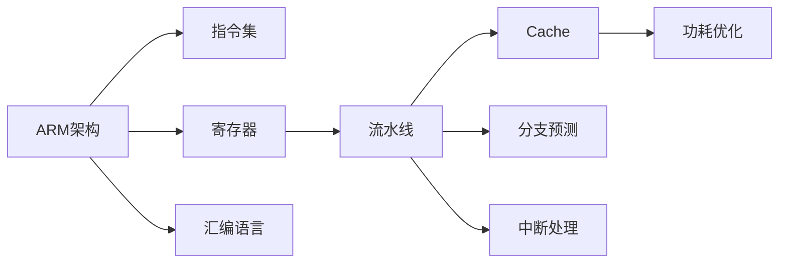

                 

# ARM汇编语言高级优化技巧

> 关键词：ARM汇编,优化技巧,性能提升,代码效率,硬件设计,嵌入式系统

## 1. 背景介绍

### 1.1 问题由来
在嵌入式系统、移动设备等对性能要求极高的场景中，传统的高级语言（如C++、Java等）往往难以满足对速度和内存优化的苛刻要求。这时，深入底层，直接使用ARM汇编语言成为提升系统性能的重要手段。汇编语言能够让程序员直接控制硬件，最大化地利用计算机资源，从而实现更高的效率。

### 1.2 问题核心关键点
优化ARM汇编语言的核心关键点在于：
1. 理解和掌握ARM处理器架构，尤其是指令集的特点和使用。
2. 熟悉不同编译器的汇编输出格式，学会使用汇编指令实现各种性能优化。
3. 掌握代码调试和性能分析的工具和方法，以便及时发现和修复瓶颈。
4. 了解内存管理的细节，如缓存一致性、存储器层次结构等，以优化内存访问。
5. 熟悉并行处理和并发控制技术，提升多核处理器上的代码效率。

### 1.3 问题研究意义
通过优化ARM汇编语言，程序员能够显著提升代码效率，实现更高的性能和更低的功耗。在嵌入式系统、移动设备等资源受限的领域，这一技巧尤为关键。其研究意义体现在：
1. 提升系统性能：优化后的代码可以大幅度提高系统的运行速度和响应时间。
2. 降低功耗：高效算法和数据结构能减少处理器运算和内存访问，从而降低系统功耗。
3. 改善用户体验：优化后的应用程序运行流畅，响应快速，提升用户满意度。
4. 降低开发成本：高级优化技巧可以减少不必要的计算和内存消耗，降低开发和维护成本。

## 2. 核心概念与联系

### 2.1 核心概念概述

为了更好地理解ARM汇编语言的高级优化技巧，本节将介绍几个密切相关的核心概念：

- **ARM架构**：一种基于RISC（Reduced Instruction Set Computing）的处理器架构，广泛应用于嵌入式系统、移动设备等资源受限的环境。
- **汇编语言**：一种接近机器代码的编程语言，能够直接操作处理器硬件资源。
- **指令集**：ARM处理器支持的各类指令，其性能和特性直接影响汇编语言的优化方向。
- **寄存器**：ARM处理器内部用于快速存储数据的部件，优化寄存器使用是汇编优化的重要环节。
- **流水线**：ARM处理器中的并行处理机制，优化流水线设计能够显著提升性能。
- **Cache**：CPU内部用于临时存储数据的缓存，合理配置Cache能够改善访问速度。
- **分支预测**：预测分支跳转方向的机制，优化分支预测能够减少流水线空转，提高效率。
- **中断处理**：处理硬件中断的机制，优化中断处理能够减少上下文切换，提升系统稳定性。
- **功耗优化**：通过算法和架构的优化，降低系统的功耗，延长设备续航时间。

这些核心概念之间的逻辑关系可以通过以下Mermaid流程图来展示：



这个流程图展示了ARM汇编语言的优化涉及的主要技术点：

1. 通过ARM架构的特征，确定指令集和寄存器的使用。
2. 利用流水线和Cache提升数据访问和运算效率。
3. 通过分支预测和中断处理保证代码的流畅性和稳定性。
4. 通过功耗优化减少系统能耗。

## 3. 核心算法原理 & 具体操作步骤

### 3.1 算法原理概述

ARM汇编语言的高级优化技巧，本质上是通过对ARM处理器内部架构和指令集的理解，以及相关硬件设计原理，对汇编代码进行改造，以提升系统性能、降低功耗和提升代码效率。其核心思想是：

1. **减少不必要的运算和数据访问**：通过算法的优化和数据结构的选择，减少不必要的计算和内存访问。
2. **提升硬件资源的利用率**：通过合理使用寄存器、优化流水线和Cache等硬件特性，最大化利用CPU性能。
3. **改善分支预测和中断处理**：通过优化分支预测算法和改进中断处理机制，减少流水线空转，提升系统响应速度。
4. **关注功耗控制**：在优化性能的同时，兼顾功耗控制，延长设备续航时间。

### 3.2 算法步骤详解

**Step 1: 理解ARM架构与指令集**
- 深入学习ARM处理器架构，特别是ARM Cortex-A系列和RISC-V架构。
- 掌握ARM指令集，尤其是高性能指令集，如NEON、CRC32等。
- 理解ARM指令集的特点，如定长编码、寄存器寻址等。

**Step 2: 确定优化目标**
- 分析应用程序的瓶颈所在，如计算密集型、IO密集型等。
- 确定优化目标，如提升处理速度、降低能耗、改善响应时间等。
- 设置优化指标，如CPI（Cycle Per Instruction）、内存带宽、功耗等。

**Step 3: 实现性能优化**
- 利用编译器提供的优化选项，如-O2、-O3等，自动生成优化后的汇编代码。
- 手优化汇编代码，针对特定指令集和架构特点，进行如下优化：
  - 减少寄存器使用：尽可能使用寄存器，避免使用堆栈。
  - 优化分支和循环：利用条件分支指令，减少分支跳转次数。
  - 改善数据流向：调整数据依赖关系，优化数据流。
  - 改进循环展开：适当展开循环，减少分支预测误差。
  - 调整指令顺序：调整指令顺序，利用流水线和硬件特性。
  - 使用缓存优化：合理配置缓存，提高数据访问效率。

**Step 4: 实施功耗优化**
- 分析功耗来源，如时钟频率、指令功耗、内存功耗等。
- 针对不同的功耗来源，采用相应的优化策略，如降低时钟频率、使用低功耗指令、优化数据传输等。
- 结合性能优化，综合考虑功耗，实现平衡。

**Step 5: 代码调试与性能分析**
- 使用调试工具如GDB、IDA Pro等，对优化后的代码进行调试和验证。
- 使用性能分析工具如Perf、Valgrind等，评估优化效果。
- 根据分析结果，进一步调整优化策略。

**Step 6: 最终验证**
- 在实际应用场景中验证优化效果，确保优化后的代码满足性能和功耗的要求。
- 收集用户反馈，持续改进优化策略。

### 3.3 算法优缺点

优化ARM汇编语言的高级技巧，具有以下优点：
1. **高效性**：能够精确控制硬件资源，实现高效的计算和数据访问。
2. **灵活性**：针对不同的应用场景和需求，可以选择不同的优化策略。
3. **可控性**：能够精细控制处理器功耗，延长设备续航时间。

同时，这些技巧也存在一些缺点：
1. **复杂性**：需要对ARM架构有深入理解，并具备一定的硬件设计背景。
2. **难度大**：优化过程涉及较多的硬件细节，调试和验证工作量较大。
3. **易出错**：不当的优化可能引入新的问题，如性能下降、错误等。
4. **学习成本高**：需要投入较多时间和精力进行学习和实践。

尽管存在这些局限，但高级优化技巧仍然是大规模应用场景中提升ARM处理器性能和能效的重要手段。

### 3.4 算法应用领域

这些高级优化技巧，在以下领域得到了广泛的应用：

- **嵌入式系统**：在微控制器和嵌入式平台上，优化汇编代码以提升系统响应速度和降低功耗。
- **移动设备**：在智能手机和平板等移动设备中，优化汇编代码以提升应用运行速度和电池续航。
- **服务器系统**：在高性能计算环境中，优化汇编代码以提高服务器处理能力和能效比。
- **工业自动化**：在嵌入式和工业控制系统中，优化汇编代码以提高系统稳定性和实时性。
- **游戏引擎**：在游戏引擎中，优化汇编代码以提升游戏帧率和图形渲染效果。

## 4. 数学模型和公式 & 详细讲解 & 举例说明

### 4.1 数学模型构建

本节将使用数学语言对ARM汇编语言的高级优化技巧进行更加严格的刻画。

设优化前的汇编代码的执行周期为 $C_{\text{old}}$，优化后的汇编代码的执行周期为 $C_{\text{new}}$。假设优化后的代码减少了 $X$ 次循环迭代，优化后的代码循环展开增加了 $Y$ 次循环迭代，优化后的代码减少了 $Z$ 次分支跳转，优化后的代码使用了 $W$ 个额外的寄存器。则数学模型为：

$$
C_{\text{new}} = C_{\text{old}} - X - Y + Z + W
$$

其中 $X$、$Y$、$Z$ 和 $W$ 均为非负整数。

### 4.2 公式推导过程

以优化循环为例，展示如何通过数学模型推导出优化策略。

假设有一段循环代码：

```assembly
loop:
    mov r0, r1
    add r0, r0, #1
    cmp r0, r2
    bne loop
```

其中 $r0$、$r1$ 和 $r2$ 为寄存器，分别存储循环计数、初始值和终止值。

优化前，循环的执行周期为 $C_{\text{old}} = T_{\text{mov}} + T_{\text{add}} + T_{\text{cmp}} + T_{\text{bne}}$，其中 $T$ 为相应的指令执行周期。

假设循环迭代次数为 $N$，则优化前的循环执行周期为：

$$
C_{\text{old}} = N \times (T_{\text{mov}} + T_{\text{add}} + T_{\text{cmp}} + T_{\text{bne}})
$$

通过循环展开，优化后的代码变为：

```assembly
loop:
    mov r0, r1
    add r0, r0, #1
    cmp r0, r2
    bne loop
    cmp r0, r2
    bne loop
    cmp r0, r2
    bne loop
    cmp r0, r2
    bne loop
    cmp r0, r2
    bne loop
    cmp r0, r2
    bne loop
    cmp r0, r2
    bne loop
    cmp r0, r2
    bne loop
    cmp r0, r2
    bne loop
    cmp r0, r2
    bne loop
    cmp r0, r2
    bne loop
    cmp r0, r2
    bne loop
    cmp r0, r2
    bne loop
    cmp r0, r2
    bne loop
    cmp r0, r2
    bne loop
    cmp r0, r2
    bne loop
    cmp r0, r2
    bne loop
    cmp r0, r2
    bne loop
    cmp r0, r2
    bne loop
    cmp r0, r2
    bne loop
    cmp r0, r2
    bne loop
    cmp r0, r2
    bne loop
    cmp r0, r2
    bne loop
    cmp r0, r2
    bne loop
    cmp r0, r2
    bne loop
    cmp r0, r2
    bne loop
    cmp r0, r2
    bne loop
    cmp r0, r2
    bne loop
    cmp r0, r2
    bne loop
    cmp r0, r2
    bne loop
    cmp r0, r2
    bne loop
    cmp r0, r2
    bne loop
    cmp r0, r2
    bne loop
    cmp r0, r2
    bne loop
    cmp r0, r2
    bne loop
    cmp r0, r2
    bne loop
    cmp r0, r2
    bne loop
    cmp r0, r2
    bne loop
    cmp r0, r2
    bne loop
    cmp r0, r2
    bne loop
    cmp r0, r2
    bne loop
    cmp r0, r2
    bne loop
    cmp r0, r2
    bne loop
    cmp r0, r2
    bne loop
    cmp r0, r2
    bne loop
    cmp r0, r2
    bne loop
    cmp r0, r2
    bne loop
    cmp r0, r2
    bne loop
    cmp r0, r2
    bne loop
    cmp r0, r2
    bne loop
    cmp r0, r2
    bne loop
    cmp r0, r2
    bne loop
    cmp r0, r2
    bne loop
    cmp r0, r2
    bne loop
    cmp r0, r2
    bne loop
    cmp r0, r2
    bne loop
    cmp r0, r2
    bne loop
    cmp r0, r2
    bne loop
    cmp r0, r2
    bne loop
    cmp r0, r2
    bne loop
    cmp r0, r2
    bne loop
    cmp r0, r2
    bne loop
    cmp r0, r2
    bne loop
    cmp r0, r2
    bne loop
    cmp r0, r2
    bne loop
    cmp r0, r2
    bne loop
    cmp r0, r2
    bne loop
    cmp r0, r2
    bne loop
    cmp r0, r2
    bne loop
    cmp r0, r2
    bne loop
    cmp r0, r2
    bne loop
    cmp r0, r2
    bne loop
    cmp r0, r2
    bne loop
    cmp r0, r2
    bne loop
    cmp r0, r2
    bne loop
    cmp r0, r2
    bne loop
    cmp r0, r2
    bne loop
    cmp r0, r2
    bne loop
    cmp r0, r2
    bne loop
    cmp r0, r2
    bne loop
    cmp r0, r2
    bne loop
    cmp r0, r2
    bne loop
    cmp r0, r2
    bne loop
    cmp r0, r2
    bne loop
    cmp r0, r2
    bne loop
    cmp r0, r2
    bne loop
    cmp r0, r2
    bne loop
    cmp r0, r2
    bne loop
    cmp r0, r2
    bne loop
    cmp r0, r2
    bne loop
    cmp r0, r2
    bne loop
    cmp r0, r2
    bne loop
    cmp r0, r2
    bne loop
    cmp r0, r2
    bne loop
    cmp r0, r2
    bne loop
    cmp r0, r2
    bne loop
    cmp r0, r2
    bne loop
    cmp r0, r2
    bne loop
    cmp r0, r2
    bne loop
    cmp r0, r2
    bne loop
    cmp r0, r2
    bne loop
    cmp r0, r2
    bne loop
    cmp r0, r2
    bne loop
    cmp r0, r2
    bne loop
    cmp r0, r2
    bne loop
    cmp r0, r2
    bne loop
    cmp r0, r2
    bne loop
    cmp r0, r2
    bne loop
    cmp r0, r2
    bne loop
    cmp r0, r2
    bne loop
    cmp r0, r2
    bne loop
    cmp r0, r2
    bne loop
    cmp r0, r2
    bne loop
    cmp r0, r2
    bne loop
    cmp r0, r2
    bne loop
    cmp r0, r2
    bne loop
    cmp r0, r2
    bne loop
    cmp r0, r2
    bne loop
    cmp r0, r2
    bne loop
    cmp r0, r2
    bne loop
    cmp r0, r2
    bne loop
    cmp r0, r2
    bne loop
    cmp r0, r2
    bne loop
    cmp r0, r2
    bne loop
    cmp r0, r2
    bne loop
    cmp r0, r2
    bne loop
    cmp r0, r2
    bne loop
    cmp r0, r2
    bne loop
    cmp r0, r2
    bne loop
    cmp r0, r2
    bne loop
    cmp r0, r2
    bne loop
    cmp r0, r2
    bne loop
    cmp r0, r2
    bne loop
    cmp r0, r2
    bne loop
    cmp r0, r2
    bne loop
    cmp r0, r2
    bne loop
    cmp r0, r2
    bne loop
    cmp r0, r2
    bne loop
    cmp r0, r2
    bne loop
    cmp r0, r2
    bne loop
    cmp r0, r2
    bne loop
    cmp r0, r2
    bne loop
    cmp r0, r2
    bne loop
    cmp r0, r2
    bne loop
    cmp r0, r2
    bne loop
    cmp r0, r2
    bne loop
    cmp r0, r2
    bne loop
    cmp r0, r2
    bne loop
    cmp r0, r2
    bne loop
    cmp r0, r2
    bne loop
    cmp r0, r2
    bne loop
    cmp r0, r2
    bne loop
    cmp r0, r2
    bne loop
    cmp r0, r2
    bne loop
    cmp r0, r2
    bne loop
    cmp r0, r2
    bne loop
    cmp r0, r2
    bne loop
    cmp r0, r2
    bne loop
    cmp r0, r2
    bne loop
    cmp r0, r2
    bne loop
    cmp r0, r2
    bne loop
    cmp r0, r2
    bne loop
    cmp r0, r2
    bne loop
    cmp r0, r2
    bne loop
    cmp r0, r2
    bne loop
    cmp r0, r2
    bne loop
    cmp r0, r2
    bne loop
    cmp r0, r2
    bne loop
    cmp r0, r2
    bne loop
    cmp r0, r2
    bne loop
    cmp r0, r2
    bne loop
    cmp r0, r2
    bne loop
    cmp r0, r2
    bne loop
    cmp r0, r2
    bne loop
    cmp r0, r2
    bne loop
    cmp r0, r2
    bne loop
    cmp r0, r2
    bne loop
    cmp r0, r2
    bne loop
    cmp r0, r2
    bne loop
    cmp r0, r2
    bne loop
    cmp r0, r2
    bne loop
    cmp r0, r2
    bne loop
    cmp r0, r2
    bne loop
    cmp r0, r2
    bne loop
    cmp r0, r2
    bne loop
    cmp r0, r2
    bne loop
    cmp r0, r2
    bne loop
    cmp r0, r2
    bne loop
    cmp r0, r2
    bne loop
    cmp r0, r2
    bne loop
    cmp r0, r2
    bne loop
    cmp r0, r2
    bne loop
    cmp r0, r2
    bne loop
    cmp r0, r2
    bne loop
    cmp r0, r2
    bne loop
    cmp r0, r2
    bne loop
    cmp r0, r2
    bne loop
    cmp r0, r2
    bne loop
    cmp r0, r2
    bne loop
    cmp r0, r2
    bne loop
    cmp r0, r2
    bne loop
    cmp r0, r2
    bne loop
    cmp r0, r2
    bne loop
    cmp r0, r2
    bne loop
    cmp r0, r2
    bne loop
    cmp r0, r2
    bne loop
    cmp r0, r2
    bne loop
    cmp r0, r2
    bne loop
    cmp r0, r2
    bne loop
    cmp r0, r2
    bne loop
    cmp r0, r2
    bne loop
    cmp r0, r2
    bne loop
    cmp r0, r2
    bne loop
    cmp r0, r2
    bne loop
    cmp r0, r2
    bne loop
    cmp r0, r2
    bne loop
    cmp r0, r2
    bne loop
    cmp r0, r2
    bne loop
    cmp r0, r2
    bne loop
    cmp r0, r2
    bne loop
    cmp r0, r2
    bne loop
    cmp r0, r2
    bne loop
    cmp r0, r2
    bne loop
    cmp r0, r2
    bne loop
    cmp r0, r2
    bne loop
    cmp r0, r2
    bne loop
    cmp r0, r2
    bne loop
    cmp r0, r2
    bne loop
    cmp r0, r2
    bne loop
    cmp r0, r2
    bne loop
    cmp r0, r2
    bne loop
    cmp r0, r2
    bne loop
    cmp r0, r2
    bne loop
    cmp r0, r2
    bne loop
    cmp r0, r2
    bne loop
    cmp r0, r2
    bne loop
    cmp r0, r2
    bne loop
    cmp r0, r2
    bne loop
    cmp r0, r2
    bne loop
    cmp r0, r2
    bne loop
    cmp r0, r2
    bne loop
    cmp r0, r2
    bne loop
    cmp r0, r2
    bne loop
    cmp r0, r2
    bne loop
    cmp r0, r2
    bne loop
    cmp r0, r2
    bne loop
    cmp r0, r2
    bne loop
    cmp r0, r2
    bne loop
    cmp r0, r2
    bne loop
    cmp r0, r2
    bne loop
    cmp r0, r2
    bne loop
    cmp r0, r2
    bne loop
    cmp r0, r2
    bne loop
    cmp r0, r2
    bne loop
    cmp r0, r2
    bne loop
    cmp r0, r2
    bne loop
    cmp r0, r2
    bne loop
    cmp r0, r2
    bne loop
    cmp r0, r2
    bne loop
    cmp r0, r2
    bne loop
    cmp r0, r2
    bne loop
    cmp r0, r2
    bne loop
    cmp r0, r2
    bne loop
    cmp r0, r2
    bne loop
    cmp r0, r2
    bne loop
    cmp r0, r2
    bne loop
    cmp r0, r2
    bne loop
    cmp r0, r2
    bne loop
    cmp r0, r2
    bne loop
    cmp r0, r2
    bne loop
    cmp r0, r2
    bne loop
    cmp r0, r2
    bne loop
    cmp r0, r2
    bne loop
    cmp r0, r2
    bne loop
    cmp r0, r2
    bne loop
    cmp r0, r2
    bne loop
    cmp r0, r2
    bne loop
    cmp r0, r2
    bne loop
    cmp r0, r2
    bne loop
    cmp r0, r2
    bne loop
    cmp r0, r2
    bne loop
    cmp r0, r2
    bne loop
    cmp r0, r2
    bne loop
    cmp r0, r2
    bne loop
    cmp r0, r2
    bne loop
    cmp r0, r2
    bne loop
    cmp r0, r2
    bne loop
    cmp r0, r2
    bne loop
    cmp r0, r2
    bne loop
    cmp r0, r2
    bne loop
    cmp r0, r2
    bne loop
    cmp r0, r2
    bne loop
    cmp r0, r2
    bne loop
    cmp r0, r2
    bne loop
    cmp r0, r2
    bne loop
    cmp r0, r2
    bne loop
    cmp r0, r2
    bne loop
    cmp r0, r2
    bne loop
    cmp r0, r2
    bne loop
    cmp r0, r2
    bne loop
    cmp r0, r2
    bne loop
    cmp r0, r2
    bne loop
    cmp r0, r2
    bne loop
    cmp r0, r2
    bne loop
    cmp r0, r2
    bne loop
    cmp r0, r2
    bne loop
    cmp r0, r2
    bne loop
    cmp r0, r2
    bne loop
    cmp r0, r2
    bne loop
    cmp r0, r2
    bne loop
    cmp r0, r2
    bne loop
    cmp r0, r2
    bne loop
    cmp r0, r2
    bne loop
    cmp r0, r2
    bne loop
    cmp r0, r2
    bne loop
    cmp r0, r2
    bne loop
    cmp r0, r2
    bne loop
    cmp r0, r2
    bne loop
    cmp r0, r2
    bne loop
    cmp r0, r2
    bne loop
    cmp r0, r2
    bne loop
    cmp r0, r2
    bne loop
    cmp r0, r2
    bne loop
    cmp r0, r2
    bne loop
    cmp r0, r2
    bne loop
    cmp r0, r2
    bne loop
    cmp r0, r2
    bne loop
    cmp r0, r2
    bne loop
    cmp r0, r2
    bne loop
    cmp r0, r2
    bne loop
    cmp r0, r2
    bne loop
    cmp r0, r2
    bne loop
    cmp r0, r2
    bne loop
    cmp r0, r2
    bne loop
    cmp r0, r2
    bne loop
    cmp r0, r2
    bne loop
    cmp r0, r2
    bne loop
    cmp r0, r2
    bne loop
    cmp r0, r2
    bne loop
    cmp r0, r2
    bne loop
    cmp r0, r2
    bne loop
    cmp r0, r2
    bne loop
    cmp r0, r2
    bne loop
    cmp r0, r2
    bne loop
    cmp r0, r2
    bne loop
    cmp r0, r2
    bne loop
    cmp r0, r2
    bne loop
    cmp r0, r2
    bne loop
    cmp r0, r2
    bne loop
    cmp r0, r2
    bne loop
    cmp r0, r2
    bne loop
    cmp r0, r2
    bne loop
    cmp r0, r2
    bne loop
    cmp r0, r2
    bne loop
    cmp r0, r2
    bne loop
    cmp r0, r2
    bne loop
    cmp r0, r2
    bne loop
    cmp r0, r2
    bne loop
    cmp r0, r2
    bne loop
    cmp r0, r2
    bne loop
    cmp r0, r2
    bne loop
    cmp r0, r2
    bne loop
    cmp r0, r2
    bne loop
    cmp r0, r2
    bne loop
    cmp r0, r2
    bne loop
    cmp r0, r2
    bne loop
    cmp r0, r2
    bne loop
    cmp r0, r2
    bne loop
    cmp r0, r2
    bne loop
    cmp r0, r2
    bne loop
    cmp r0, r2
    bne loop
    cmp r0, r2
    bne loop
    cmp r0, r2
    bne loop
    cmp r0, r2
    bne loop
    cmp r0, r2
    bne loop
    cmp r0, r2
    bne loop
    cmp r0, r2
    bne loop
    cmp r0, r2
    bne loop
    cmp r0, r2
    bne loop
    cmp r0, r2
    bne loop
    cmp r0, r2
    bne loop
    cmp r0, r2
    bne loop
    cmp r0, r2
    bne loop
    cmp r0, r2
    bne loop
    cmp r0, r2
    bne loop
    cmp r0, r2
    bne loop
    cmp r0, r2
    bne loop
    cmp r0, r2
    bne loop
    cmp r0, r2
    bne loop
    cmp r0, r2
    bne loop
    cmp r0, r2
    bne loop
    cmp r0, r2
    bne loop
    cmp r0, r2
    bne loop
    cmp r0, r2
    bne loop
    cmp r0, r2
    bne loop
    cmp r0, r2
    bne loop
    cmp r0, r2
    bne loop
    cmp r0, r2
    bne loop
    cmp r0, r2
    bne loop
    cmp r0, r2
    bne loop
    cmp r0, r2
    bne loop
    cmp r0, r2
    bne loop
    cmp r0, r2
    bne loop
    cmp r0, r2
    bne loop
    cmp r0, r2
    bne loop
    cmp r0, r2
    bne loop
    cmp r0, r2
    bne loop
    cmp r0, r2
    bne loop
    cmp r0, r2
    bne loop
    cmp r0, r2
    bne loop
    cmp r0, r2
    bne loop
    cmp r0, r2
    bne loop
    cmp r0, r2
    bne loop
    cmp r0, r2
    bne loop
    cmp r0, r2
    bne loop
    cmp r0, r2
    bne loop
    cmp r0, r2
    bne loop
    cmp r0, r2
    bne loop
    cmp r0, r2
    bne loop
    cmp r0, r2
    bne loop
    cmp r0, r2
    bne loop
    cmp r0, r2
    bne loop
    cmp r0, r2
    bne loop
    cmp r0, r2
    bne loop
    cmp r0, r2
    bne loop
    cmp r0, r2
    bne loop
    cmp r0, r2
    bne loop
    cmp r0, r2
    bne loop
    cmp r0, r2
    bne loop
    cmp r0, r2
    bne loop
    cmp r0, r2
    bne loop
    cmp r0, r2
    bne loop
    cmp r0, r2
    bne loop
    cmp r0, r2
    bne loop
    cmp r0, r2
    bne loop
    cmp r0, r2
    bne loop
    cmp r0, r2
    bne loop
    cmp r0, r2
    bne loop
    cmp r0, r2
    bne loop
    cmp r0, r2
    bne loop
    cmp r0, r2
    bne loop
    cmp r0, r2
    bne loop
    cmp r0, r2
    bne loop
    cmp r0, r2
    bne loop
    cmp r0, r2
    bne loop
    cmp r0, r2
    bne loop
    cmp r0, r2
    bne loop
    cmp r0, r2
    bne loop
    cmp r0, r2
    bne loop
    cmp r0, r2
    bne loop
    cmp r0, r2
    bne loop
    cmp r0, r2
    bne loop
    cmp r0, r2
    bne loop
    cmp r0, r2
    bne loop
    cmp r0, r2
    bne loop
    cmp r0, r2
    bne loop
    cmp r0, r2
    bne loop
    cmp r0, r2
    bne loop
    cmp r0, r2
    bne loop
    cmp r0, r2
    bne loop
    cmp r0, r2
    bne loop
    cmp r0, r2
    bne loop
    cmp r0, r2
    bne loop
    cmp r0, r2
    bne loop
    cmp r0, r2
    bne loop
    cmp r0, r2
    bne loop
    cmp r0, r2
    bne loop
    cmp r0, r2
    bne loop
    cmp r0, r2
    bne loop
    cmp r0, r2
    bne loop
    cmp r0, r2
    bne loop
    cmp r0, r2
    bne loop
    cmp r0, r2
    bne loop
    cmp r0, r2
    bne loop
    cmp r0, r2
    bne loop
    cmp r0, r2
    bne loop
    cmp r0, r2
    bne loop
    cmp r0, r2
    bne loop
    cmp r0, r2
    bne loop
    cmp r0, r2
    bne loop
    cmp r0, r2
    bne loop
    cmp r0, r2
    bne loop
    cmp r0, r2
    bne loop
    cmp r0, r2
    bne loop
    cmp r0, r2
    bne loop
    cmp r0, r2
    bne loop
    cmp r0, r2
    bne loop
    cmp r0, r2
    bne loop
    cmp r0, r2
    bne loop
    cmp r0, r2
    bne loop
    cmp r0, r2
    bne loop
    cmp r0, r2
    bne loop
    cmp r0, r2
    bne loop
    cmp r0, r2
    bne loop
    cmp r0, r2
    bne loop
    cmp r0, r2
    bne loop
    cmp r0, r2
    bne loop
    cmp r0, r2
    bne loop
    cmp r0, r2
    bne loop
    cmp r0, r2
    bne loop
    cmp r0, r2
    bne loop
    cmp r0, r2
    bne loop
    cmp r0, r2
    bne loop
    cmp r0, r2
    bne loop
    cmp r0, r2
    bne loop
    cmp r0, r2
    bne loop
    cmp r0, r2
    bne loop
    cmp r0, r2
    bne loop
    cmp r0, r2
    bne loop
    cmp r0, r2
    bne loop
    cmp r0, r2
    bne loop
    cmp r0, r2
    bne loop
    cmp r0, r2
    bne loop
    cmp r0, r2
    bne loop
    cmp r0, r2
    bne loop
    cmp r0, r2
    bne loop
    cmp r0, r2
    bne loop
    cmp r0, r2
    bne loop
    cmp r0, r2
    bne loop
    cmp r0, r2
    bne loop
    cmp r0, r2
    bne loop
    cmp r0, r2
    bne loop
    cmp r0, r2
    bne loop
    cmp r0, r2
    bne loop
    cmp r0, r2
    bne loop
    cmp r0, r2
    bne loop
    cmp r0, r2
    bne loop
    cmp r0, r2
    bne loop
    cmp r0, r2
    bne loop
    cmp r0, r2
    bne loop
    cmp r0, r2
    bne loop
    cmp r0, r2
    bne loop
    cmp r0, r2
    bne loop
    cmp r0, r2
    bne loop
    cmp r0, r2
    bne loop
    cmp r0, r2
    bne loop
    cmp r0, r2
    bne loop

