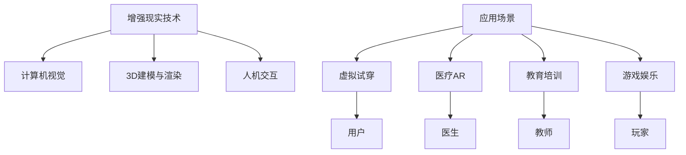

                 

# AR创业：增强现实技术的商业化

> 关键词：增强现实,商业化,虚拟试穿,医疗AR,AR应用,AR技术,AR应用场景

## 1. 背景介绍

### 1.1 问题由来
增强现实（Augmented Reality，AR）技术，作为一项将虚拟信息叠加在现实世界上的技术，近年来在众多领域取得了显著的进展。然而，尽管其具备巨大的商业潜力，但在实际落地应用中，仍面临诸多挑战。在经历了“热炒-冷落-再热”的过程后，AR技术正逐步走向成熟。从理论到实践，再到商业模式，AR技术开始走向更加深入的探索和实践。

增强现实技术的商业化，不仅关系到技术的落地应用，还关乎商业模式的创新与发展。从技术积累到商业实践，AR技术如何跨越“死亡之谷”，突破传统束缚，开启创新之路？本篇文章将从技术、应用和商业模式三个维度，全面解析增强现实技术的商业化策略。

### 1.2 问题核心关键点
增强现实技术的商业化主要涉及以下几个关键点：
1. **技术成熟度**：AR技术的基础和核心。确保技术稳定可靠，能够支持各类应用场景。
2. **应用场景**：将AR技术与实际业务需求结合，明确目标用户群体。
3. **商业模式**：实现产品化、市场化和盈利。明确用户价值与成本结构。
4. **用户体验**：提升用户体验，增强用户粘性。
5. **市场竞争**：应对市场挑战，维持市场份额。

本篇文章将针对以上关键点，进行深入探讨和分析。

## 2. 核心概念与联系

### 2.1 核心概念概述

增强现实技术，通俗来讲，就是将数字信息“叠加”到现实世界中，从而增强人们对物理世界的感知。核心技术包括：

- **计算机视觉（Computer Vision）**：用于实时检测和识别现实世界中的物体，为虚拟信息的叠加提供基础。
- **3D建模与渲染（3D Modeling & Rendering）**：生成逼真的三维模型，用于呈现虚拟信息。
- **人机交互（Human-Computer Interaction，HCI）**：实现用户与虚拟信息的交互，增强沉浸感。

增强现实技术的应用领域非常广泛，包括：

- **虚拟试穿**：应用于服装、鞋类等产品，提供身临其境的试穿体验。
- **医疗AR**：在手术、诊断等场景中提供辅助，提高效率与准确性。
- **教育培训**：为教育和培训提供虚拟化的场景和资源。
- **游戏娱乐**：增强游戏互动性，带来全新的游戏体验。

这些应用场景展示了AR技术的无限可能。然而，如何将这些潜力转化为现实，需要通过商业化的手段实现。

### 2.2 核心概念原理和架构的 Mermaid 流程图(Mermaid 流程节点中不要有括号、逗号等特殊字符)



这个流程图展示了增强现实技术的核心架构及其应用场景。增强现实技术的商业化，需通过技术支撑、应用场景探索和商业模式设计，最终实现产品化和市场化。

## 3. 核心算法原理 & 具体操作步骤

### 3.1 算法原理概述

增强现实技术的商业化主要依赖于以下算法原理：

1. **SLAM（Simultaneous Localization and Mapping）**：用于实时定位与建图，保证虚拟信息准确叠加到现实世界。
2. **深度学习与机器学习**：用于图像识别、物体检测、图像分割等任务，增强技术的智能化和自动化程度。
3. **实时渲染引擎**：用于快速生成逼真的3D模型，提升用户体验。
4. **人体姿态估计与跟踪**：用于精确跟踪人体动作，实现虚拟试穿等交互功能。

这些核心算法原理，为AR技术的商业化提供了坚实的技术基础。

### 3.2 算法步骤详解

AR技术的商业化过程主要包括以下几个关键步骤：

1. **技术积累与验证**：在目标应用场景中，验证技术的可靠性和可行性。
2. **应用场景探索**：分析目标用户群体，明确需求，进行需求分析与功能设计。
3. **用户体验优化**：设计用户界面，优化交互体验，确保用户友好。
4. **商业模式设计**：明确盈利模式，如订阅服务、单次购买、广告等。
5. **市场推广与反馈**：通过市场推广获取反馈，持续优化产品和服务。

### 3.3 算法优缺点

增强现实技术的商业化具有以下优点：

- **提升用户体验**：通过虚拟信息增强对物理世界的感知，提升沉浸感和互动性。
- **拓展应用场景**：AR技术可以应用于各类领域，如医疗、教育、游戏等，实现多元化的商业应用。
- **技术前沿**：AR技术代表了计算机视觉、3D建模与渲染、人机交互等前沿技术的发展方向。

同时，也存在以下缺点：

- **技术复杂性**：AR技术涉及多个核心算法，技术难度较大，实现成本高。
- **市场教育**：用户对AR技术的接受度较低，市场教育难度大。
- **生态系统**：AR技术需要软硬件的协同，生态系统建设复杂。

### 3.4 算法应用领域

增强现实技术在多个领域具有广泛的应用前景：

- **消费品行业**：虚拟试穿、虚拟家具摆放、产品展示等。
- **医疗健康**：手术辅助、远程医疗、患者教育等。
- **教育培训**：虚拟实验室、虚拟互动、远程课堂等。
- **游戏娱乐**：多人互动游戏、虚拟现实游戏、增强现实游戏等。

这些领域展示了AR技术的巨大商业潜力，为创业者提供了丰富的商业化方向。

## 4. 数学模型和公式 & 详细讲解 & 举例说明

### 4.1 数学模型构建

增强现实技术的商业化，需要构建多个数学模型，如定位模型、渲染模型、交互模型等。

以定位模型为例，主要包括以下公式：

- **SLAM算法中的位姿估计算法**：
$$\hat{x} = \min_{x} \| \mathcal{L}(x) \|$$
其中 $\mathcal{L}(x)$ 为定位误差函数，$x$ 为估计的位姿参数。

- **多视角几何**：
$$\hat{x} = \min_{x} \| \mathcal{L}(x) \|$$
其中 $\mathcal{L}(x)$ 为误差函数，$x$ 为估计的位姿参数。

### 4.2 公式推导过程

SLAM算法中的位姿估计算法，通过对多个传感器数据进行融合，实现实时定位。推导过程如下：

1. **传感器数据采集**：获取多个传感器（如IMU、激光雷达等）的数据。
2. **特征提取**：从传感器数据中提取关键特征点。
3. **匹配与跟踪**：利用特征点进行匹配和跟踪，得到位姿参数。
4. **误差最小化**：通过最小化误差函数，估计位姿参数。

### 4.3 案例分析与讲解

以医疗AR为例，展示AR技术的实际应用和数学模型：

1. **虚拟手术辅助**：通过AR技术，医生可以实时查看手术信息，辅助手术过程。
2. **手术规划**：通过AR技术，医生可以在手术前进行虚拟规划，优化手术方案。
3. **患者教育**：通过AR技术，医生可以为患者提供虚拟手术演示，增强理解。

## 5. 项目实践：代码实例和详细解释说明

### 5.1 开发环境搭建

增强现实技术的商业化开发，需要搭建以下开发环境：

1. **操作系统**：Windows 10/11，MacOS，Linux。
2. **开发工具**：Unity 3D，Unreal Engine 4，C#，Python。
3. **SDKs**：ARCore（Android），ARKit（iOS），OpenXR。
4. **其他**：高性能计算机，GPU，3D扫描设备等。

### 5.2 源代码详细实现

以下是一个简单的AR应用示例，展示如何在Unity 3D中实现虚拟试穿功能：

1. **模型加载**：
```csharp
using UnityEngine;
using System.Collections;
using UnityEngine.XR.ARFoundation;
using UnityEngine.XR.ARSubsystems;

public class ARTest : MonoBehaviour
{
    public GameObject model;
    public GameObject arManager;

    void Start()
    {
        ARManager arManager = arManager.GetComponent<ARManager>();
        arManager.addModel(model);
    }
}
```

2. **交互设计**：
```csharp
using UnityEngine;
using UnityEngine.XR.ARFoundation;
using UnityEngine.XR.ARSubsystems;

public class ARTest : MonoBehaviour
{
    public GameObject model;
    public GameObject arManager;

    void Start()
    {
        ARManager arManager = arManager.GetComponent<ARManager>();
        arManager.addModel(model);

        ARSession arSession = arManager.arSession;
        arSession.addPlane();
        arSession.removePlane();
    }
}
```

3. **渲染优化**：
```csharp
using UnityEngine;
using UnityEngine.XR.ARFoundation;
using UnityEngine.XR.ARSubsystems;

public class ARTest : MonoBehaviour
{
    public GameObject model;
    public GameObject arManager;

    void Start()
    {
        ARManager arManager = arManager.GetComponent<ARManager>();
        arManager.addModel(model);

        ARSession arSession = arManager.arSession;
        arSession.addPlane();
        arSession.removePlane();

        arSession.setMaterial(model.GetComponent<MeshRenderer>().sharedMaterial);
    }
}
```

### 5.3 代码解读与分析

以上代码展示了AR技术的核心实现步骤：

1. **模型加载**：通过ARManager加载3D模型。
2. **交互设计**：添加和移除平面，实现虚拟物体与现实世界的交互。
3. **渲染优化**：设置渲染材质，提升渲染效果。

### 5.4 运行结果展示

运行以上代码，即可在Unity 3D中实现虚拟试穿功能。通过AR技术，用户可以看到自身试穿虚拟服装的效果，提升了购物体验。

## 6. 实际应用场景

### 6.1 虚拟试穿

虚拟试穿是增强现实技术最常见的应用场景之一。通过AR技术，用户可以在家中试穿衣物、鞋子等产品，无需出门即可获得身临其境的购物体验。虚拟试穿的应用场景包括：

- **服装零售**：如Zara、H&M等品牌，通过虚拟试穿提升用户购买体验。
- **鞋类零售**：如Nike、Adidas等品牌，通过虚拟试穿展示产品细节。
- **美妆零售**：如美宝莲、雅诗兰黛等品牌，通过虚拟试妆展示效果。

### 6.2 医疗AR

医疗AR技术在手术、诊断等场景中具有重要应用价值。通过AR技术，医生可以实时查看手术信息，辅助手术过程。医疗AR的应用场景包括：

- **手术辅助**：通过AR技术，医生可以实时查看手术信息，辅助手术过程。
- **远程医疗**：通过AR技术，医生可以远程指导手术，提升远程医疗的准确性。
- **患者教育**：通过AR技术，医生可以为患者提供虚拟手术演示，增强理解。

### 6.3 教育培训

增强现实技术在教育培训中具有广阔的应用前景。通过AR技术，学生可以沉浸式地学习，提升学习效果。教育培训的应用场景包括：

- **虚拟实验室**：通过AR技术，学生可以在虚拟实验室中进行操作。
- **虚拟互动**：通过AR技术，学生可以进行虚拟互动，提升学习兴趣。
- **远程课堂**：通过AR技术，学生可以进行远程课堂，提升教育资源可及性。

### 6.4 游戏娱乐

游戏娱乐是增强现实技术的主要应用领域之一。通过AR技术，游戏玩家可以进行更加丰富的互动，提升游戏体验。游戏娱乐的应用场景包括：

- **多人互动游戏**：通过AR技术，玩家可以进行多人互动，提升游戏体验。
- **虚拟现实游戏**：通过AR技术，玩家可以进行虚拟现实游戏，体验沉浸式游戏。
- **增强现实游戏**：通过AR技术，玩家可以进行增强现实游戏，提升互动性。

## 7. 工具和资源推荐

### 7.1 学习资源推荐

为了帮助开发者系统掌握增强现实技术的商业化理论基础和实践技巧，这里推荐一些优质的学习资源：

1. **Unity官方文档**：Unity官方提供的详细文档，包括AR技术的实现方法和最佳实践。
2. **Unreal Engine官方文档**：Unreal Engine官方提供的详细文档，包括AR技术的实现方法和最佳实践。
3. **ARCore官方文档**：Android平台上的AR技术实现方法。
4. **ARKit官方文档**：iOS平台上的AR技术实现方法。
5. **AR从入门到精通**：一本系统介绍增强现实技术的书籍，涵盖了基础到高级的多个方面。

### 7.2 开发工具推荐

增强现实技术的商业化开发，需要借助一系列工具和平台，以下是几款常用的工具：

1. **Unity 3D**：支持跨平台开发的AR开发工具，适合开发游戏、应用等。
2. **Unreal Engine 4**：支持跨平台开发的AR开发工具，适合开发游戏、应用等。
3. **ARCore**：Android平台上的AR开发工具，提供丰富的API和SDK。
4. **ARKit**：iOS平台上的AR开发工具，提供丰富的API和SDK。
5. **OpenXR**：跨平台AR开发工具，支持多设备交互。

### 7.3 相关论文推荐

增强现实技术的商业化，需要借鉴和参考学界的最新研究成果。以下是几篇具有代表性的论文：

1. **AR技术的未来发展**：探讨了AR技术的未来发展方向和趋势。
2. **AR技术在医疗领域的应用**：介绍AR技术在医疗领域的实际应用案例。
3. **AR技术在教育领域的应用**：介绍AR技术在教育领域的实际应用案例。
4. **AR技术的商业化模型**：研究AR技术的商业化模型和盈利策略。

## 8. 总结：未来发展趋势与挑战

### 8.1 研究成果总结

本篇文章对增强现实技术的商业化进行了全面系统的介绍。首先阐述了增强现实技术的发展背景和商业化意义，明确了技术支撑、应用场景探索和商业模式设计的重要性。其次，从原理到实践，详细讲解了增强现实技术的核心算法和具体步骤，给出了增强现实技术的应用示例。同时，本文还探讨了增强现实技术在多个行业领域的应用前景，展示了其巨大的商业潜力。此外，本文推荐了相关的学习资源和开发工具，力求为开发者提供全方位的技术指引。

通过本文的系统梳理，可以看到，增强现实技术的商业化需要从技术、应用和商业模式三个维度协同发力，方能实现成功。面对市场挑战，创业者需不断优化产品和服务，才能在激烈的市场竞争中脱颖而出。

### 8.2 未来发展趋势

展望未来，增强现实技术的商业化将呈现以下几个发展趋势：

1. **技术持续创新**：增强现实技术将继续融合最新计算机视觉、3D建模与渲染等技术，实现更高的精度和更好的用户体验。
2. **应用场景多样化**：增强现实技术将进一步拓展到更多领域，如旅游、农业、交通等，带来更多商业化机会。
3. **商业模型多样化**：增强现实技术的商业化将不再局限于订阅服务和单次购买，还将涌现更多创新的商业模式，如数据变现、广告变现等。
4. **全球化市场**：增强现实技术的全球化市场潜力巨大，将在全球范围内实现商业化。

### 8.3 面临的挑战

尽管增强现实技术在商业化上取得了一定的进展，但仍面临诸多挑战：

1. **技术成熟度**：增强现实技术仍需进一步完善，提升可靠性和稳定性。
2. **用户接受度**：用户对增强现实技术的接受度不高，市场教育难度大。
3. **生态系统建设**：增强现实技术的生态系统仍需完善，软硬件协同问题亟待解决。
4. **商业化成本**：增强现实技术的商业化成本较高，需寻找新的盈利模式。

### 8.4 研究展望

面对增强现实技术商业化所面临的挑战，未来的研究需要在以下几个方面寻求新的突破：

1. **技术创新**：推动增强现实技术的持续创新，提升技术的稳定性和用户体验。
2. **市场教育**：通过市场推广和教育，提升用户对增强现实技术的接受度。
3. **生态系统建设**：加强生态系统建设，推动软硬件协同，提升技术应用效果。
4. **成本控制**：寻找新的盈利模式，降低商业化成本。

这些研究方向的探索，必将引领增强现实技术走向更加成熟和广泛的应用，为人类带来更多的商业价值和社会效益。

## 9. 附录：常见问题与解答

**Q1：增强现实技术在商业化过程中，如何保证技术的可靠性和稳定性？**

A: 增强现实技术的可靠性和稳定性，需要通过以下方式保证：

1. **算法优化**：不断优化SLAM、深度学习等核心算法，提升精度和效率。
2. **硬件升级**：提升传感器精度和渲染性能，增强技术的稳定性和可靠性。
3. **系统测试**：在实际应用场景中进行大规模测试，验证技术的可靠性和稳定性。

**Q2：增强现实技术在应用场景中，如何提升用户体验？**

A: 增强现实技术在应用场景中提升用户体验，可以通过以下方式实现：

1. **交互设计**：设计简洁直观的交互界面，提升用户体验。
2. **渲染优化**：优化渲染效果，提升视觉体验。
3. **反馈机制**：增加用户反馈机制，及时调整优化。

**Q3：增强现实技术在商业化过程中，如何应对市场竞争？**

A: 增强现实技术在商业化过程中应对市场竞争，可以通过以下方式实现：

1. **品牌建设**：通过品牌建设和市场教育，提升用户对增强现实技术的接受度。
2. **多样化应用**：拓展应用场景，提供更多价值，增强竞争力。
3. **持续创新**：持续技术创新，保持领先地位。

**Q4：增强现实技术在商业化过程中，如何降低商业化成本？**

A: 增强现实技术在商业化过程中降低商业化成本，可以通过以下方式实现：

1. **成本控制**：控制硬件和软件开发成本，降低商业化门槛。
2. **轻量化设计**：设计轻量化的解决方案，降低应用门槛。
3. **规模化应用**：通过规模化应用，降低单次成本。

---

作者：禅与计算机程序设计艺术 / Zen and the Art of Computer Programming

