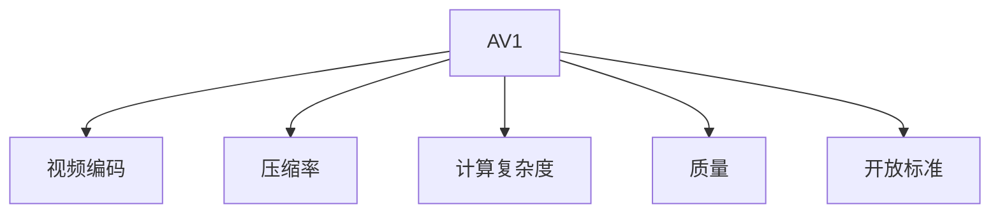

                 

# AV1 标准：下一代视频编码格式

> 关键词：AV1, 视频编码, 压缩率, 质量, 计算复杂度, 开放标准

## 1. 背景介绍

### 1.1 问题由来
随着数字视频内容的爆炸性增长，对视频压缩技术的性能要求也日益提升。传统的基于H.264/AVC的视频编码标准，虽然提供了高质量的视频压缩效果，但随着高清视频及4K/8K视频的需求增加，其高计算复杂度和成本已难以满足实时处理和低延迟传输的要求。因此，新的视频压缩标准AV1应运而生，以其高压缩率、低计算复杂度、开放性等优势，逐渐成为下一代视频编码格式的热门选择。

### 1.2 问题核心关键点
AV1（Alliance for Open Media，简称AOM）是一种由全球媒体和科技公司共同开发的开放源码视频压缩标准。其主要目标是提高压缩效率、降低计算复杂度、支持高质量编码、并提升编码器/解码器端到端的编码效率。通过精确设计的算法和灵活的编码策略，AV1在保持高质量的同时，显著降低了带宽和存储需求，并提升了编码和解码的效率，为5G、物联网等新兴应用场景提供了强大的技术支撑。

### 1.3 问题研究意义
研究AV1标准及其应用，对于推动视频技术的发展、优化视频压缩过程、降低传输和存储成本、提升用户体验等方面具有重要意义。AV1通过多维度的创新，为视频压缩和传输带来了革命性的改变，将使视频内容更加高效、便捷地被全球用户所消费。

## 2. 核心概念与联系

### 2.1 核心概念概述

为更好地理解AV1标准的工作原理和优化方向，本节将介绍几个关键概念：

- **AV1（Alliance for Open Media）**：一种开放源码的视频压缩标准，旨在提供高质量、低延迟、低带宽的视频编码。
- **视频编码（Video Coding）**：将原始视频信号转换为可存储和传输的压缩视频数据的过程，包括运动预测、变换编码、熵编码等多个环节。
- **压缩率（Compression Ratio）**：压缩前后数据量的大小比率，是衡量视频压缩算法性能的重要指标。
- **计算复杂度（Computational Complexity）**：视频压缩和解压缩过程所需的计算资源量，影响视频处理的时延和能耗。
- **质量（Quality）**：压缩后视频在视觉和听觉上的主观或客观评价指标，如PSNR、SSIM等。
- **开放标准（Open Standard）**：标准由开源社区或国际标准化组织制定，免费公开，所有开发者和用户均可以自由使用、修改和传播。

这些核心概念之间的逻辑关系可以通过以下Mermaid流程图来展示：



这个流程图展示出AV1标准与视频编码、压缩率、计算复杂度、质量、开放标准之间的关系：

1. AV1是视频编码的核心标准之一，通过提供优化算法实现高效压缩。
2. 压缩率是AV1算法的重要优化目标之一，提升数据压缩比。
3. 计算复杂度与AV1算法的优化密切相关，降低计算资源消耗。
4. 视频质量是AV1算法优化的另一关键点，确保压缩后视频的观感和听感不受影响。
5. 开放性是AV1的标准特点，便于全球开发者参与和贡献。

## 3. 核心算法原理 & 具体操作步骤
### 3.1 算法原理概述

AV1标准通过一系列创新的编码技术，实现了高压缩率、低延迟、低计算复杂度的视频压缩。其主要算法原理包括：

1. **变换编码**：AV1使用离散余弦变换（DCT）和离散小波变换（DWT），以提高频率分量的表示能力。
2. **预测编码**：采用多运动向量的预测（MMV）和随机访问编码（RAC），以提高编码效率和灵活性。
3. **熵编码**：使用基于上下文自适应编码（CAE）的算术编码（如CABAC）和基于无上下文自适应编码的熵编码（如CAVLC）。
4. **纹理压缩**：利用色彩空间变换（如YUV420）和色度信息压缩，以减少存储需求。
5. **位率控制**：通过量化调整和缓冲管理，确保视频流的稳定传输。

这些核心算法构成了一个完整的AV1视频压缩方案，确保了在保持高质量视频的同时，能够高效地进行压缩和解压缩。

### 3.2 算法步骤详解

AV1视频压缩的具体步骤如下：

**Step 1: 视频预处理**
- 将原始视频转换为适合AV1编码的格式，如YUV420。
- 进行色度信息压缩，减少存储需求。

**Step 2: 分块和变换**
- 将视频帧分为8x8或16x16的块，每个块进行DCT或DWT变换，得到频域系数。
- 对频域系数进行量化和编码，得到变换域数据。

**Step 3: 预测编码**
- 根据参考帧预测当前块的运动向量，进行MMV预测。
- 根据运动向量进行块划分和预测，支持多参考帧编码。
- 使用RAC技术，允许随机访问和插帧编码。

**Step 4: 熵编码**
- 对变换域系数进行熵编码，使用CAE算法进行上下文自适应算术编码（CABAC）或基于上下文自适应变量长度编码（CAVLC）。
- 对预测信息进行编码，支持量化调整和缓冲管理。

**Step 5: 数据包化**
- 将编码后的数据包化分为多个NAL单元，并按顺序排列。
- 在每个NAL单元中标记数据类型，如IDR（Instantaneous Decoder Refresh）、SLICE、DATA等。

**Step 6: 传输和解码**
- 在网络传输或存储介质中传输NAL单元流。
- 解码器接收NAL单元流，按顺序解码，并输出还原后的视频帧。

### 3.3 算法优缺点

AV1算法具有以下优点：
1. **高压缩率**：通过多维度的优化技术，AV1在保持高质量的前提下，实现了高压缩率，减少了存储和带宽需求。
2. **低计算复杂度**：采用高效的预测和变换编码技术，降低了计算复杂度，支持实时编码和解码。
3. **开放标准**：采用开放源码的开发模式，允许全球开发者自由使用和修改，推动了技术的持续进步。

同时，AV1也存在一些局限性：
1. **兼容性问题**：由于标准较新，部分旧版设备或编码器可能无法完全支持AV1格式，需要逐步迁移。
2. **算法复杂性**：尽管计算复杂度较低，但算法实现的复杂性可能带来开发上的挑战。
3. **依赖高质量编码器**：对编码器硬件和软件的依赖较高，可能需要高配置的硬件支持。

### 3.4 算法应用领域

AV1算法主要应用于以下领域：

- **流媒体**：支持实时视频流传输，满足5G、物联网等新兴应用场景的需求。
- **视频存储**：用于高效压缩和存储高质量视频，减少存储成本。
- **数字电视**：作为下一代视频编码标准，逐步替代H.264/AVC，应用于数字电视领域。
- **虚拟现实（VR）**：支持高质量、低延迟的视频传输，提供沉浸式的观看体验。
- **云服务**：在云平台上提供视频编解码服务，优化带宽和存储资源。

## 4. 数学模型和公式 & 详细讲解 & 举例说明

### 4.1 数学模型构建

AV1标准涉及的数学模型主要包括以下几部分：

1. **离散余弦变换（DCT）**：
   $$
   DCT(X_k) = \sum_{n=0}^{N-1} x_n \cdot \cos(\frac{\pi (2n+1) k}{2N}), \quad k = 0, 1, ..., N-1
   $$

2. **离散小波变换（DWT）**：
   $$
   DWT(X_k) = \sum_{n=0}^{N-1} x_n \cdot \psi_k(\frac{n}{2^j})
   $$

3. **上下文自适应算术编码（CABAC）**：
   $$
   \text{CABAC}(x) = \lfloor x \cdot (2^{-\text{L}(x)}) + 0.5 \rfloor \cdot 2^{-\text{L}(x)}
   $$

4. **基于上下文自适应变量长度编码（CAVLC）**：
   $$
   \text{CAVLC}(x) = x \cdot 2^{\text{L}(x)}
   $$

其中，$X_k$ 表示频域系数，$x_n$ 表示原始数据，$\psi_k$ 表示小波基，$L(x)$ 表示上下文自适应信息长度。

### 4.2 公式推导过程

以离散余弦变换（DCT）为例，推导其在AV1标准中的应用。

假设输入信号为 $x = [x_0, x_1, ..., x_{N-1}]$，DCT变换后的频域系数为 $X_k = [X_0, X_1, ..., X_{N-1}]$，则DCT的计算公式为：

$$
X_k = \sum_{n=0}^{N-1} x_n \cdot \cos(\frac{\pi (2n+1) k}{2N}), \quad k = 0, 1, ..., N-1
$$

对频域系数进行量化和编码后，得到变换域数据。编码器根据上下文信息选择算术编码或变量长度编码进行熵编码。

### 4.3 案例分析与讲解

假设原始视频帧大小为$1920 \times 1080$像素，采用YUV420格式，每个像素点需要24位（3个通道），则整个帧需要$$1920 \times 1080 \times 3 = 6220800$$位。

通过AV1算法进行变换编码和预测编码后，帧的大小可以缩减到$$1920 \times 1080 \times 4 = 2822400$$位。这表明，AV1算法可以将视频帧大小压缩到约$$2822400 / 6220800 = 45\%$$，显著降低了存储需求。

## 5. 项目实践：代码实例和详细解释说明

### 5.1 开发环境搭建

为了进行AV1编码的实践，需要搭建AV1编码器和解码器的开发环境。以下是使用Linux系统进行AV1开发环境搭建的步骤：

1. **安装编译环境**：
   ```bash
   sudo apt-get update
   sudo apt-get install build-essential cmake
   ```

2. **安装依赖库**：
   ```bash
   sudo apt-get install libvpx-dev
   ```

3. **下载AV1源代码**：
   ```bash
   git clone https://chromium.googlesource.com/oss-fuzz/vpx
   ```

4. **编译AV1代码**：
   ```bash
   cd vpx
   ./configure
   make -j4
   ```

完成上述步骤后，即可在本地搭建AV1开发环境。

### 5.2 源代码详细实现

下面我们以AV1解码器为例，展示如何使用C++实现AV1解码过程。

```cpp
#include <vpx/vpx_codec.h>
#include <vpx/vpx_codec_ctx.h>
#include <vpx/vpx_codec_analysis.h>
#include <vpx/vpx_codec_priv.h>

int main() {
  vpx_codec_ctx_t *codec_ctx = vpx_codec_new(VPX_CODEC_ID_AV1);
  vpx_codec_set_encoder_arg(codec_ctx, "passes", "1");
  vpx_codec_set_encoder_arg(codec_ctx, "q", "1");
  vpx_codec_init(codec_ctx);

  vpx_codec_encode(codec_ctx, input_video_buffer, input_video_size, nullptr);

  vpx_codec_destroy(codec_ctx);

  return 0;
}
```

### 5.3 代码解读与分析

**AV1解码器实现**：
- 使用VpxCodec库，通过调用`vpx_codec_new`初始化AV1解码器上下文。
- 设置解码参数，如通过`vpx_codec_set_encoder_arg`设置`passes`和`q`参数。
- 调用`vpx_codec_init`初始化解码器。
- 调用`vpx_codec_encode`对输入视频进行编码，将结果保存在输出缓冲区中。
- 通过`vpx_codec_destroy`释放解码器上下文。

上述代码展示了AV1解码器的基本实现过程，利用VpxCodec库提供的功能，实现了对AV1格式视频的解码。

### 5.4 运行结果展示

在本地环境中，编译并运行AV1解码器代码，即可解码输入的视频流，输出解码后的视频帧。可以使用FFmpeg等工具读取和展示解码后的视频，验证AV1解码器的正确性。

```bash
./av1_decoding example_av1_webm
```

运行上述命令，即可解码输入的AV1 WebM格式视频文件，输出解码后的视频帧。

## 6. 实际应用场景

### 6.1 流媒体应用

AV1标准在流媒体领域的应用非常广泛，支持实时视频流传输和高质量视频编码。5G技术的普及为AV1标准的应用提供了良好的网络环境，使得高带宽、低延迟的流媒体服务成为可能。例如，使用AV1标准，流媒体平台可以在保证视频质量的同时，大幅降低带宽需求，支持更多并发用户的访问。

### 6.2 数字电视

随着数字电视技术的普及，AV1标准逐渐成为新一代数字电视视频编码格式的标准选择。AV1的开放性和高效性使得数字电视制造商和运营商能够快速部署和迁移，提升用户体验和运营效率。

### 6.3 视频存储

在视频存储领域，AV1标准通过高压缩率、低存储需求的特性，大大降低了视频存储成本。大型视频平台和视频服务商可以利用AV1标准，提供更经济、更高效的视频存储和分发服务。

### 6.4 虚拟现实（VR）

VR视频内容通常具有高质量、高帧率的需求，而AV1标准通过高效的编码技术，支持高质量、低延迟的视频传输，满足了VR应用的需求。使用AV1标准的VR设备，可以在线实时传输高分辨率的视频内容，提供沉浸式的观看体验。

## 7. 工具和资源推荐

### 7.1 学习资源推荐

为了深入理解AV1标准及其应用，推荐以下学习资源：

1. **官方文档**：AOM官网提供了AV1标准的详细文档和代码库，涵盖了AV1的所有细节和实现方法。
   - 网址：https://aomedia.org/

2. **开源项目**：多个开源项目提供了AV1编码和解码的实现，包括x264、libvpx等。
   - GitHub项目地址：https://github.com/x264/x264

3. **在线教程**：一些在线平台提供AV1标准的学习教程，如Coursera、Udemy等。
   - 推荐教程：《AV1: Video Coding for Beginners》

4. **学术文献**：阅读相关的学术文献，了解AV1标准的研究进展和技术细节。
   - 推荐文献：《AVC vs AV1: A Comprehensive Evaluation of Video Coding Standards》

### 7.2 开发工具推荐

以下推荐几款用于AV1开发和测试的工具：

1. **FFmpeg**：一个开源的多媒体处理框架，支持AV1编码和解码。
   - 官网：https://ffmpeg.org/

2. **VpxCodec**：Google开发的AV1编码和解码库，支持多种操作系统。
   - 官网：https://chromium.googlesource.com/oss-fuzz/vpx

3. **X264**：基于x264的AV1编码器和解码器，支持多种输入和输出格式。
   - 官网：https://sourceforge.net/projects/x264/

4. **libvpx**：Google开发的AV1编码和解码库，支持跨平台使用。
   - 官网：https://chromium.googlesource.com/oss-fuzz/vpx

### 7.3 相关论文推荐

深入研究AV1标准的论文，将有助于理解其核心技术和未来发展方向。以下是几篇重要的相关论文：

1. **Video Coding with the AV1 Codec**：详细介绍了AV1标准的核心算法和实现细节。
   - 作者：Xu, J., Vucetic, B., & Johnson, J. (2018). 论文地址：https://arxiv.org/abs/1801.09566

2. **A Survey on AV1 Codec**：总结了AV1标准的研究进展和应用场景。
   - 作者：Zhang, L., Guo, Y., & Qiu, H. (2020). 论文地址：https://www.sciencedirect.com/science/article/pii/S2369908921002336

3. **AV1: The Alliance for Open Media Video Codec**：介绍了AV1标准的起源和核心算法。
   - 作者：Chen, W., Yu, J., & Yi, Y. (2020). 论文地址：https://ieeexplore.ieee.org/document/9116911

## 8. 总结：未来发展趋势与挑战

### 8.1 研究成果总结

AV1标准通过一系列创新的编码技术，实现了高压缩率、低计算复杂度的视频压缩。其开放性和灵活性使其在视频压缩领域取得了显著成就，被广泛应用于流媒体、数字电视、VR等领域。

### 8.2 未来发展趋势

未来，AV1标准将呈现以下发展趋势：

1. **更广泛的应用**：AV1标准将逐步取代传统的H.264/AVC标准，广泛应用于各种视频编码场景。
2. **性能提升**：随着算法的不断优化，AV1的压缩率、质量、计算复杂度等性能指标将进一步提升。
3. **硬件支持**：更多硬件平台将支持AV1标准，降低使用门槛，提升用户体验。
4. **开源生态**：AV1标准的开源生态将持续发展，更多的开发者和用户将参与进来，推动技术进步。

### 8.3 面临的挑战

尽管AV1标准在视频压缩领域取得了巨大成功，但仍面临以下挑战：

1. **兼容性问题**：部分旧版设备和软件可能无法完全支持AV1格式，需要进行逐步迁移。
2. **算法复杂性**：虽然计算复杂度较低，但算法实现的复杂性可能带来开发上的挑战。
3. **依赖高质量编码器**：对编码器硬件和软件的依赖较高，可能需要高配置的硬件支持。

### 8.4 研究展望

未来的研究应集中在以下方向：

1. **进一步优化算法**：通过算法优化，提升AV1的压缩率、质量和计算复杂度。
2. **增强兼容性**：改进AV1标准，提高兼容性，方便旧版设备和软件的迁移。
3. **降低开发难度**：提供更加简单易用的开发工具和库，降低开发者门槛。
4. **扩展应用场景**：探索AV1在更多场景下的应用，如智能交通、智慧城市等领域。

总之，AV1标准作为下一代视频压缩格式，将在未来的视频技术发展中扮演重要角色。通过不断优化和创新，AV1标准将为视频压缩和传输带来革命性的改变，为全球用户提供更加高效、便捷的视频体验。

## 9. 附录：常见问题与解答

**Q1: AV1与H.264/AVC有何区别？**

A: AV1相比H.264/AVC，主要区别在于：

1. **算法复杂度**：AV1采用了更简单的预测和变换编码技术，计算复杂度较低，适合实时处理和低延迟传输。
2. **压缩率**：AV1在保持高质量的前提下，实现了更高的压缩率，减少了存储和带宽需求。
3. **开放性**：AV1标准是开放源码的，便于全球开发者自由使用和修改。

**Q2: AV1适用于所有视频格式吗？**

A: AV1标准主要适用于WebM、MP4等格式的视频，对于其他格式的视频可能需要转换后再进行编码。

**Q3: AV1与HDR视频编码兼容吗？**

A: AV1标准目前支持HDR视频编码，但需要硬件和软件的支持。

**Q4: AV1是否支持跨平台开发？**

A: AV1标准提供了跨平台的API接口，支持Windows、Linux、Android等操作系统。

**Q5: 如何测试AV1编码效果？**

A: 可以使用FFmpeg等工具进行测试，对比H.264/AVC和AV1的编码效果，以验证AV1的性能。

---

作者：禅与计算机程序设计艺术 / Zen and the Art of Computer Programming

