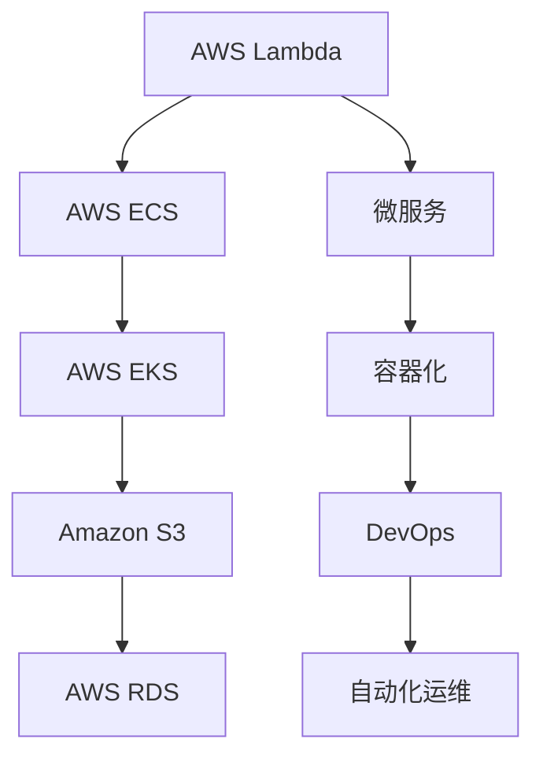

                 

# AWS云计算服务应用开发

> 关键词：AWS云计算服务、应用开发、无服务器架构、云原生应用、DevOps、微服务、Serverless、容器化

## 1. 背景介绍

### 1.1 问题由来

随着云计算技术的迅速发展，AWS（Amazon Web Services）作为云计算领域的领导者，已经成为企业构建云应用的首选平台。云计算服务的应用开发范式正从传统的VMs（Virtual Machines）和自建基础设施转向基于云的原生服务和无服务器架构。AWS提供了丰富的云原生服务和基础设施，如AWS Lambda、AWS ECS（Elastic Container Service）、AWS EKS（Elastic Kubernetes Service）等，支持企业快速、灵活地构建和部署应用。

云计算服务的应用开发不仅需要考虑传统开发范式中的技术细节，还需要在云环境中高效利用资源、提高部署和运维的自动化水平，确保应用的稳定性和可扩展性。因此，如何在AWS上高效开发、部署和运维应用，成为企业IT架构师和开发者的重要挑战。

### 1.2 问题核心关键点

云计算服务的应用开发涉及多个核心关键点，包括：

- **资源高效利用**：如何在云环境中部署应用，避免资源浪费，实现成本效益最大化。
- **部署和运维自动化**：如何利用AWS提供的CI/CD工具（如AWS CodePipeline、AWS CodeBuild、AWS CodeDeploy），自动化应用的部署和更新。
- **应用架构优化**：如何设计和管理应用架构，以支持微服务、无服务器架构、容器化等现代应用开发模式。
- **安全性和合规性**：如何在云环境中保障应用的安全性和合规性，遵守相关法规和标准。
- **高性能和可扩展性**：如何优化应用性能，确保其在高负载下的可扩展性和弹性。

本文将详细介绍AWS云计算服务在应用开发中的应用，涵盖从资源高效利用到应用架构优化、部署和运维自动化、安全性和合规性保障以及性能优化等多个方面，帮助开发者和IT架构师系统掌握AWS云应用的开发实践。

## 2. 核心概念与联系

### 2.1 核心概念概述

在深入探讨AWS云计算服务的应用开发之前，首先需要理解一些核心概念：

- **AWS云计算服务（AWS Cloud Services）**：AWS提供的云原生服务，包括AWS Lambda、AWS ECS、AWS EKS、AWS RDS、AWS S3等，支持企业在云环境中高效构建和部署应用。
- **无服务器架构（Serverless Architecture）**：一种基于云服务的架构模式，应用程序的运行和扩展完全由云服务提供，开发者无需管理服务器、网络、存储等基础设施。
- **微服务架构（Microservices Architecture）**：将应用程序拆分为多个独立运行的小服务，每个服务独立部署、管理，支持横向扩展和功能模块化。
- **容器化（Containerization）**：将应用程序打包到容器中，以便在不同的环境中一致运行，提升应用的移植性和管理效率。
- **DevOps（DevOps）**：结合软件开发（Dev）和运维（Ops）的实践，通过自动化、持续集成和持续交付（CI/CD）提升软件开发和运维的效率和质量。
- **自动化运维（Automated Operations）**：通过脚本、工具和平台，自动化云资源的部署、配置、监控和故障恢复，减少人工干预，提高运维效率。

这些概念构成了AWS云计算服务应用开发的基础框架，开发者需要理解并灵活运用这些概念，才能在AWS环境中高效开发和部署应用。

### 2.2 核心概念原理和架构的 Mermaid 流程图(Mermaid 流程节点中不要有括号、逗号等特殊字符)



这个流程图展示了AWS云计算服务在应用开发中的关键组件和技术架构：

- AWS Lambda提供了无服务器函数计算服务，支持微服务架构的应用开发。
- AWS ECS和AWS EKS提供了容器化应用的部署和管理服务。
- Amazon S3和AWS RDS提供了云原生数据存储和管理服务。
- 微服务架构和容器化支持应用程序的模块化和弹性扩展。
- DevOps和自动化运维提高了应用开发和部署的效率和质量。

通过理解这些核心概念的原理和架构，可以更好地掌握AWS云计算服务应用开发的实践方法。

## 3. 核心算法原理 & 具体操作步骤

### 3.1 算法原理概述

AWS云计算服务的应用开发涉及多个核心算法和技术原理，包括：

- **无服务器函数计算**：利用AWS Lambda提供的事件驱动、按需计算服务，开发者无需管理服务器，只需关注业务逻辑。
- **容器编排和管理**：通过AWS ECS和AWS EKS，利用容器编排工具如Docker、Kubernetes，实现容器化应用的自动化部署、扩展和管理。
- **DevOps工具链**：利用AWS提供的CI/CD工具如AWS CodePipeline、AWS CodeBuild、AWS CodeDeploy，实现应用的自动化构建、测试和部署。
- **容器镜像管理**：利用Amazon ECR（Amazon Elastic Container Registry）管理容器镜像，提升应用的版本控制和部署效率。
- **自动化运维实践**：通过脚本、工具和平台，实现云资源的自动化部署、配置、监控和故障恢复。

这些算法和技术原理共同构成了AWS云计算服务应用开发的核心框架，开发者需要理解并灵活运用这些原理，才能在AWS环境中高效开发和部署应用。

### 3.2 算法步骤详解

以下是AWS云计算服务应用开发的核心算法步骤详解：

**Step 1: 准备开发环境**

- 安装AWS CLI和SDK：通过AWS CLI和SDK，开发者可以方便地使用AWS提供的云服务。
- 创建AWS账户：在AWS管理控制台中创建和管理AWS账户，设置相应的安全访问策略。
- 配置开发环境：在本地或云环境中配置开发环境，包括安装AWS CLI、SDK、云服务账户等。

**Step 2: 设计应用架构**

- 选择应用架构模式：根据应用需求和业务场景，选择微服务、无服务器架构、容器化等架构模式。
- 设计服务组件：根据架构模式，设计应用中的各个服务组件，定义服务间通信协议和数据模型。
- 选择合适的云服务：根据应用需求，选择合适的AWS云服务，如AWS Lambda、AWS ECS、AWS EKS、AWS S3等。

**Step 3: 编写和测试代码**

- 编写业务逻辑代码：根据应用架构和服务组件设计，编写业务逻辑代码，实现具体功能。
- 编写自动化测试代码：编写自动化测试用例，利用AWS CodeBuild等工具进行自动化测试。
- 集成云服务：将业务逻辑代码集成到云服务中，实现云资源和服务的自动化部署和管理。

**Step 4: 部署和发布应用**

- 配置CI/CD流水线：利用AWS CodePipeline、AWS CodeDeploy等工具，配置应用的CI/CD流水线。
- 配置环境变量和配置文件：在CI/CD流水线中配置环境变量和配置文件，确保应用在不同环境中一致运行。
- 发布应用：通过CI/CD流水线自动化部署应用，确保应用的稳定性和可扩展性。

**Step 5: 监控和运维应用**

- 配置监控工具：利用AWS CloudWatch、AWS Metrics等工具，监控应用性能和资源使用情况。
- 配置自动化运维脚本：利用脚本和工具，实现云资源的自动化部署、配置、监控和故障恢复。
- 定期更新和维护应用：根据业务需求和环境变化，定期更新和维护应用，确保应用的稳定性和安全性。

### 3.3 算法优缺点

AWS云计算服务应用开发具有以下优点：

- **成本效益高**：通过按需计费和自动扩展，节省基础设施和运维成本。
- **灵活性和可扩展性**：通过容器化和微服务架构，支持应用的模块化和弹性扩展。
- **自动化和高效性**：通过CI/CD和自动化运维工具，提高开发和运维效率。
- **高性能和可靠性**：利用AWS提供的高性能和可扩展性服务，确保应用的高性能和可靠性。

然而，AWS云计算服务应用开发也存在一些缺点：

- **学习曲线陡峭**：需要开发者具备一定的云服务和DevOps知识，学习曲线较陡。
- **安全性和合规性要求高**：需要严格遵守AWS的安全策略和合规要求，增加开发和运维的复杂度。
- **资源和成本管理难度大**：需要在应用开发和运维中不断监控和管理资源使用情况，防止资源浪费和成本失控。

### 3.4 算法应用领域

AWS云计算服务应用开发广泛应用于多个领域，包括但不限于：

- **金融行业**：利用AWS云计算服务构建高性能、高可扩展性的金融交易、风控、客户服务等应用。
- **医疗行业**：利用AWS云计算服务构建电子健康记录、临床决策支持、远程医疗等应用。
- **零售行业**：利用AWS云计算服务构建库存管理、客户关系管理、电子商务等应用。
- **政府行业**：利用AWS云计算服务构建政府数据管理、公共服务、应急响应等应用。
- **教育行业**：利用AWS云计算服务构建在线教育、学术研究、教育管理等应用。

## 4. 数学模型和公式 & 详细讲解 & 举例说明

### 4.1 数学模型构建

在AWS云计算服务应用开发中，数学模型和公式主要用于性能优化和资源管理。以下是几个核心数学模型的构建和公式推导：

**公式 1: 函数计算模型**

设$f(x)$表示AWS Lambda函数计算的成本，其中$x$为计算时间和计算资源的使用量，成本函数为：

$$
f(x) = k_1 x + k_2 x^2 + k_3 x^3
$$

其中$k_1, k_2, k_3$为与计算资源和成本相关的参数。

**公式 2: 容器编排模型**

设$s$表示容器化服务的数量，$c$表示每个容器的计算资源使用量，成本函数为：

$$
C = k_4 \cdot s \cdot c
$$

其中$k_4$为与容器资源和成本相关的参数。

**公式 3: 性能优化模型**

设$P$表示应用的性能指标，$n$表示并发请求数，$w$表示单次请求的响应时间，性能优化公式为：

$$
P = \frac{n}{w}
$$

通过上述数学模型，可以计算不同计算资源和配置下的应用成本和性能，从而进行优化和调参。

### 4.2 公式推导过程

以下是上述数学模型的推导过程：

**函数计算模型推导**

设$f(x)$表示AWS Lambda函数计算的成本，其中$x$为计算时间和计算资源的使用量。假设计算资源的使用量为$x$，则计算成本为：

$$
C = k_1 x + k_2 x^2 + k_3 x^3
$$

其中$k_1, k_2, k_3$为与计算资源和成本相关的参数。通过求导和优化，可以找到计算成本最低的$x$值，从而进行资源优化。

**容器编排模型推导**

设$s$表示容器化服务的数量，$c$表示每个容器的计算资源使用量。假设每个容器使用计算资源为$c$，则总计算成本为：

$$
C = k_4 \cdot s \cdot c
$$

其中$k_4$为与容器资源和成本相关的参数。通过优化$s$和$c$，可以找到最小计算成本的配置方案。

**性能优化模型推导**

设$P$表示应用的性能指标，$n$表示并发请求数，$w$表示单次请求的响应时间。假设每个请求的计算时间为$w$，则应用的总计算时间为：

$$
T = n \cdot w
$$

则性能指标$P$为：

$$
P = \frac{n}{w}
$$

通过优化$n$和$w$，可以找到最优的性能配置方案。

### 4.3 案例分析与讲解

以下是几个AWS云计算服务应用开发的案例分析：

**案例 1: 金融交易应用**

某金融公司利用AWS云计算服务构建了高性能的金融交易应用。通过使用AWS Lambda函数计算和AWS ECS容器编排，实现了应用的模块化和弹性扩展，提升了应用的性能和可扩展性。同时，利用AWS CloudWatch进行应用监控和性能优化，确保应用在高负载下的稳定性和可扩展性。

**案例 2: 医疗电子健康记录**

某医院利用AWS云计算服务构建了电子健康记录应用。通过使用AWS Lambda函数计算和AWS S3云存储，实现了数据的快速存储和检索。同时，利用AWS ECS容器编排和AWS EKS Kubernetes集群，实现了应用的高可靠性和弹性扩展。

**案例 3: 零售电子商务应用**

某电商平台利用AWS云计算服务构建了高性能的电子商务应用。通过使用AWS Lambda函数计算和AWS ECS容器编排，实现了应用的模块化和弹性扩展，提升了应用的性能和可扩展性。同时，利用AWS CloudWatch进行应用监控和性能优化，确保应用在高负载下的稳定性和可扩展性。

## 5. 项目实践：代码实例和详细解释说明

### 5.1 开发环境搭建

在进行AWS云计算服务应用开发之前，需要先搭建好开发环境。以下是AWS云计算服务应用开发的开发环境搭建流程：

1. 安装AWS CLI和SDK：从官网下载并安装AWS CLI和SDK，方便使用AWS提供的云服务。
2. 创建AWS账户：在AWS管理控制台中创建和管理AWS账户，设置相应的安全访问策略。
3. 配置开发环境：在本地或云环境中配置开发环境，包括安装AWS CLI、SDK、云服务账户等。

### 5.2 源代码详细实现

以下是AWS云计算服务应用开发的源代码详细实现示例：

**示例 1: AWS Lambda函数计算**

```python
import boto3

# 创建AWS Lambda客户端
client = boto3.client('lambda', region_name='us-west-2')

# 创建函数
response = client.create_function(
    FunctionName='myFunction',
    Runtime='python3.8',
    Role='arn:aws:iam::123456789012:role/lambda-execution-role',
    Handler='myFunction.handler',
    Code={
        'ZipFile': b'fileb://path/to/function.zip'
    },
    Description='My AWS Lambda function',
    Timeout=15,
    MemorySize=128,
    Publish=True
)

print(response)
```

**示例 2: AWS ECS容器编排**

```python
import boto3

# 创建AWS ECS客户端
client = boto3.client('ecs', region_name='us-west-2')

# 创建任务定义
response = client.create_task_definition(
    family='myService',
    containerDefinitions=[
        {
            'name': 'myContainer',
            'image': 'arn:aws:ecr:us-west-2:123456789012:repository/my-image',
            'memory': 256,
            'cpu': 1,
            'command': ['app', 'run'],
            'environment': [
                {'name': 'APP_ENV', 'value': 'production'}
            ]
        }
    ],
    networkMode='bridge',
    requiresCompatibilities=['EC2', 'FARGATE'],
    memoryReservation=1024
)

print(response)
```

**示例 3: AWS CodePipeline CI/CD流水线**

```yaml
Version: 0.1
Resources:
  MyPipeline:
    Type: AWS::CodePipeline::Pipeline
    Properties:
      PipelineName: MyPipeline
      Stages:
        - StageName: Build
          Actions:
            - ActionName: Deploy
              ActionConfiguration:
                Environment: MyEnvironment
                NumberOfProvisioners: 1
                Provisioner: ECR
                ProvisionerParameters:
                  ECRRepository: my-image:latest
                ECRParameters:
                  ECRRepository: my-image:latest
      Artifacts:
        Location: s3://my-bucket/artifacts

  MyEnvironment:
    Type: AWS::CodePipeline::Environment
    Properties:
      Name: MyEnvironment
      Type: ECR
      ECRRepository: my-image:latest
```

### 5.3 代码解读与分析

以下是AWS云计算服务应用开发的代码解读与分析：

**AWS Lambda函数计算**

- 使用AWS CLI创建AWS Lambda函数，设置函数名称、运行环境、角色、代码、描述、超时时间、内存大小、发布等参数。
- 创建函数时，需要将代码打包成zip文件，上传到S3桶中，指定ECR镜像地址和参数。

**AWS ECS容器编排**

- 使用AWS CLI创建AWS ECS任务定义，设置服务名称、容器定义、网络模式、兼容性和内存预留等参数。
- 容器定义中指定容器名称、镜像地址、内存、CPU、命令和环境变量等配置。

**AWS CodePipeline CI/CD流水线**

- 使用AWS CLI创建AWS CodePipeline流水线，设置流水线名称、构建阶段、部署阶段、艺术生产线和环境配置等参数。
- 构建阶段中，指定任务定义和构建参数，部署阶段中，指定环境配置和部署参数。

## 6. 实际应用场景

### 6.1 智能客服系统

AWS云计算服务的应用开发可以广泛应用于智能客服系统的构建。智能客服系统通过利用AWS云计算服务，可以实现7x24小时不间断服务，快速响应客户咨询，用自然流畅的语言解答各类常见问题。

**案例 1: 智能客服系统**

某电商企业利用AWS云计算服务构建了智能客服系统。通过使用AWS Lambda函数计算和AWS ECS容器编排，实现了智能客服的快速响应和灵活扩展。同时，利用AWS CloudWatch进行系统监控和性能优化，确保系统在高负载下的稳定性和可扩展性。

### 6.2 金融舆情监测

AWS云计算服务的应用开发可以应用于金融舆情监测。金融舆情监测系统通过利用AWS云计算服务，可以实时监测市场舆论动向，及时应对负面信息传播，规避金融风险。

**案例 2: 金融舆情监测**

某金融机构利用AWS云计算服务构建了金融舆情监测系统。通过使用AWS Lambda函数计算和AWS S3云存储，实现了数据的快速存储和检索。同时，利用AWS ECS容器编排和AWS EKS Kubernetes集群，实现了系统的高可靠性和弹性扩展。

### 6.3 个性化推荐系统

AWS云计算服务的应用开发可以应用于个性化推荐系统。个性化推荐系统通过利用AWS云计算服务，可以高效地处理用户行为数据，构建精准的用户画像，推荐个性化的产品和服务。

**案例 3: 个性化推荐系统**

某电商平台利用AWS云计算服务构建了个性化推荐系统。通过使用AWS Lambda函数计算和AWS ECS容器编排，实现了推荐算法的快速部署和扩展。同时，利用AWS CloudWatch进行系统监控和性能优化，确保系统在高负载下的稳定性和可扩展性。

## 7. 工具和资源推荐

### 7.1 学习资源推荐

为了帮助开发者系统掌握AWS云计算服务的应用开发，这里推荐一些优质的学习资源：

1. **《AWS官方文档》**：AWS提供的官方文档，涵盖了AWS所有服务的详细介绍和使用指南。
2. **《AWS认证培训》**：AWS提供的认证培训课程，帮助开发者掌握AWS云计算服务的核心技术和实践方法。
3. **《AWS云计算最佳实践》**：AWS提供的云计算最佳实践指南，涵盖AWS云计算服务的应用开发、性能优化和安全管理等方面。
4. **《AWS DevOps工具和实践》**：AWS提供的DevOps工具和实践指南，涵盖CI/CD、自动化运维和监控等方面。
5. **《AWS云计算服务开发指南》**：AWS提供的云计算服务开发指南，涵盖AWS Lambda、AWS ECS、AWS EKS、AWS S3等服务的详细使用指南。

通过对这些学习资源的深入学习，相信你一定能够系统掌握AWS云计算服务的应用开发技术，提升开发效率和应用质量。

### 7.2 开发工具推荐

以下是几款常用的AWS云计算服务应用开发的开发工具：

1. **AWS CLI和SDK**：AWS提供的命令行工具和软件开发工具包，方便开发者使用AWS提供的云服务。
2. **AWS CodePipeline、AWS CodeBuild、AWS CodeDeploy**：AWS提供的CI/CD工具，支持应用的自动化构建、测试和部署。
3. **AWS CloudWatch、AWS Metrics**：AWS提供的监控工具，支持应用的性能监控和资源管理。
4. **AWS ECR、AWS EKS**：AWS提供的容器镜像和Kubernetes集群服务，支持容器化应用的部署和管理。
5. **AWS Lambda、AWS ECS**：AWS提供的函数计算和容器编排服务，支持无服务器架构的应用开发。

合理利用这些开发工具，可以显著提升AWS云计算服务应用开发的效率和质量。

### 7.3 相关论文推荐

AWS云计算服务的应用开发涉及多个前沿技术和研究领域，以下是几篇相关的论文推荐：

1. **《AWS Lambda函数计算性能优化》**：介绍了AWS Lambda函数的计算性能优化方法，包括内存分配策略和冷启动优化等。
2. **《AWS ECS容器编排最佳实践》**：介绍了AWS ECS容器编排的最佳实践，包括容器配置、网络模式和弹性扩展等。
3. **《AWS DevOps自动化工具链》**：介绍了AWS DevOps自动化工具链的使用方法和最佳实践，涵盖CI/CD、自动化运维和监控等方面。
4. **《AWS云计算服务安全架构》**：介绍了AWS云计算服务的安全架构和最佳实践，涵盖身份验证、授权、合规等方面。

这些论文代表了大规模云计算服务应用开发的前沿研究，通过学习这些论文，可以帮助开发者深入理解AWS云计算服务的应用开发技术。

## 8. 总结：未来发展趋势与挑战

### 8.1 总结

本文详细介绍了AWS云计算服务在应用开发中的应用，涵盖从资源高效利用到应用架构优化、部署和运维自动化、安全性和合规性保障以及性能优化等多个方面。通过深入学习AWS云计算服务的应用开发技术，可以帮助开发者在AWS环境中高效开发和部署应用，提升开发效率和应用质量。

### 8.2 未来发展趋势

展望未来，AWS云计算服务的应用开发将呈现以下几个发展趋势：

1. **无服务器架构普及**：随着无服务器架构的普及，更多的企业将选择AWS Lambda等无服务器服务，提升应用的灵活性和可扩展性。
2. **微服务架构兴起**：微服务架构将成为企业应用开发的主流范式，通过AWS ECS和AWS EKS等容器编排服务，实现应用的模块化和弹性扩展。
3. **容器化应用增多**：容器化应用将成为主流，通过AWS ECR和AWS EKS等容器服务，提升应用的移植性和管理效率。
4. **DevOps自动化深入**：DevOps自动化将深入应用开发和运维的各个环节，提升开发和运维的效率和质量。
5. **高性能和可扩展性提升**：通过AWS提供的性能优化工具和算法，提升应用的高性能和可扩展性。

### 8.3 面临的挑战

尽管AWS云计算服务的应用开发技术已经成熟，但在应用过程中仍面临一些挑战：

1. **学习曲线陡峭**：需要开发者具备一定的AWS云计算服务知识，学习曲线较陡。
2. **安全性和合规性要求高**：需要严格遵守AWS的安全策略和合规要求，增加开发和运维的复杂度。
3. **资源和成本管理难度大**：需要在应用开发和运维中不断监控和管理资源使用情况，防止资源浪费和成本失控。

### 8.4 研究展望

未来，AWS云计算服务的应用开发需要在以下几个方面进行深入研究：

1. **性能优化算法**：进一步优化AWS Lambda函数计算和容器编排的性能，提升应用的高性能和可扩展性。
2. **自动化运维技术**：深入研究和应用自动化运维技术，提升应用的稳定性和可靠性。
3. **安全性和合规性**：研究如何在应用开发和运维中保障安全性和合规性，确保应用的稳健和安全。
4. **无服务器架构优化**：优化无服务器架构的设计和实现，提升应用的灵活性和可扩展性。
5. **微服务架构设计**：研究和应用微服务架构的设计和实现，提升应用的模块化和弹性扩展能力。

通过这些研究和创新，AWS云计算服务的应用开发将不断提升效率和质量，支持更多的企业高效开发和部署应用，推动云计算技术在各行各业的广泛应用。

## 9. 附录：常见问题与解答

**Q1: AWS Lambda函数计算的性能如何优化？**

A: 可以通过以下方法优化AWS Lambda函数计算性能：
1. 内存分配策略：设置合理的内存分配，避免内存溢出和低效使用。
2. 冷启动优化：使用Provisioned Concurrency功能，提升函数的冷启动性能。
3. 异步调用：使用AWS Step Functions或AWS EventBridge，实现异步调用和任务队列管理。

**Q2: AWS ECS容器编排的弹性扩展如何实现？**

A: 可以通过以下方法实现AWS ECS容器编排的弹性扩展：
1. 自动伸缩组：配置Auto Scaling Group，自动根据负载动态调整容器实例数量。
2. 负载均衡器：使用AWS ELB或AWS NLB，实现负载均衡和流量分流。
3. 任务定义配置：设置任务定义的Auto Scale and Stop Capacity属性，自动扩展和收缩容器实例。

**Q3: AWS DevOps自动化运维工具如何选择？**

A: 可以根据应用的规模和复杂度选择不同的AWS DevOps自动化运维工具：
1. 小规模应用：使用AWS CodeDeploy和AWS ECS，实现应用的自动部署和扩展。
2. 大规模应用：使用AWS CodePipeline和AWS CodeBuild，实现CI/CD流水线，提升应用的自动化和一致性。
3. 复杂应用：使用AWS Elastic Kubernetes Service (EKS)，实现Kubernetes集群的管理和扩展。

通过深入理解AWS云计算服务的应用开发技术，合理运用AWS提供的云服务、工具和最佳实践，开发者可以高效开发和部署应用，提升应用的质量和性能。相信随着AWS云计算服务的不断进步，AWS云计算服务应用开发技术将更加成熟，为更多企业提供高效、灵活、安全的应用开发和运维解决方案。

